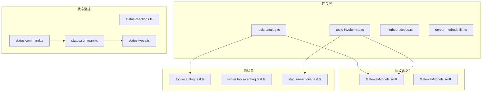
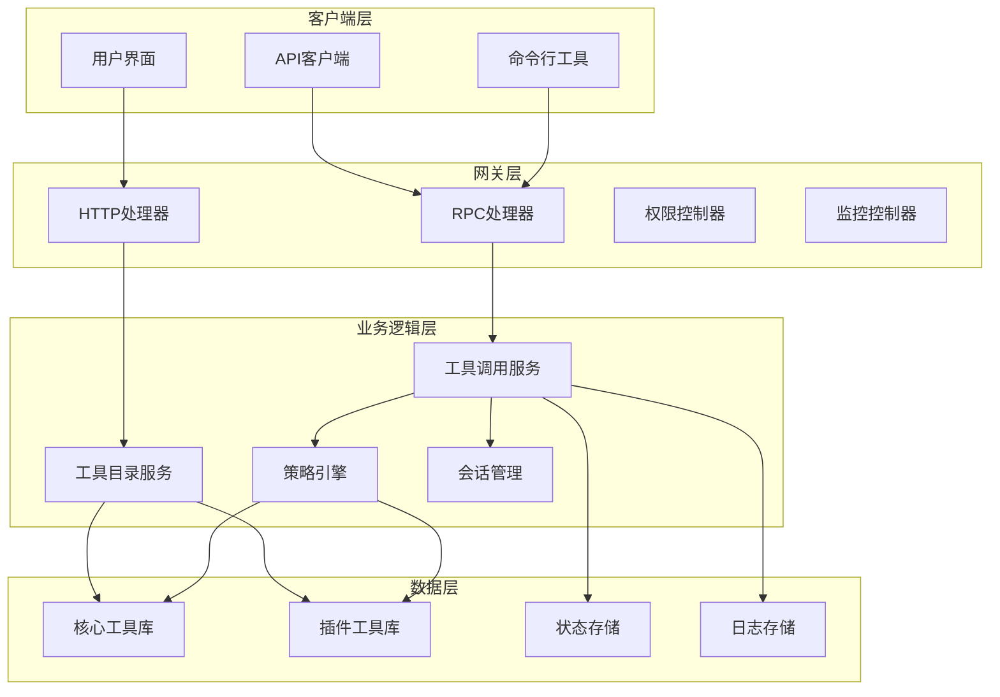
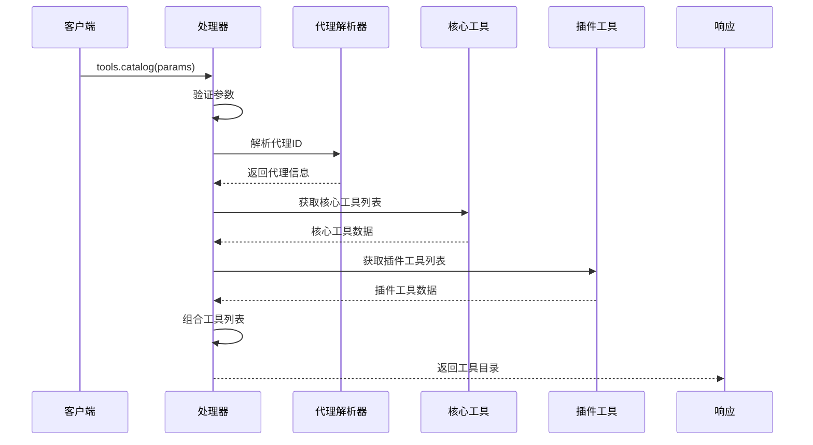
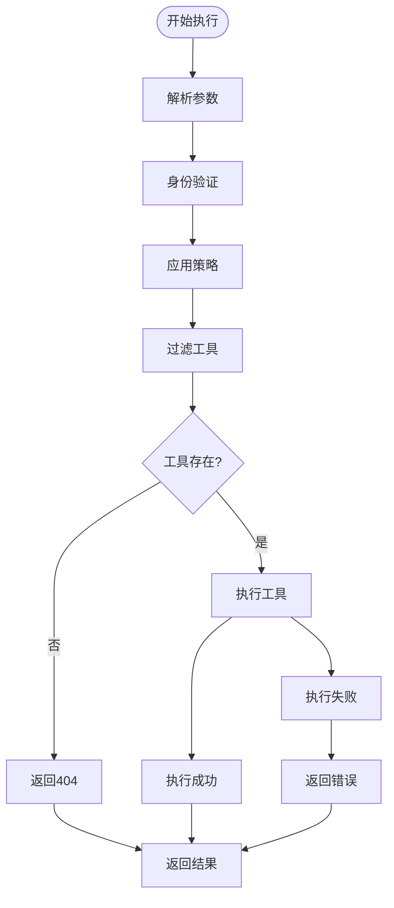
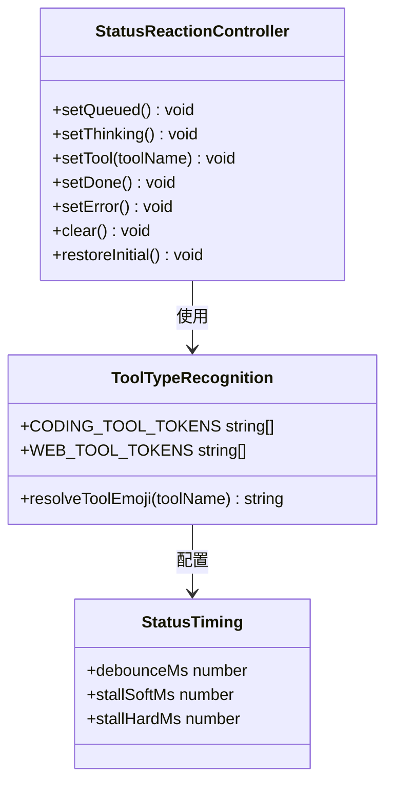
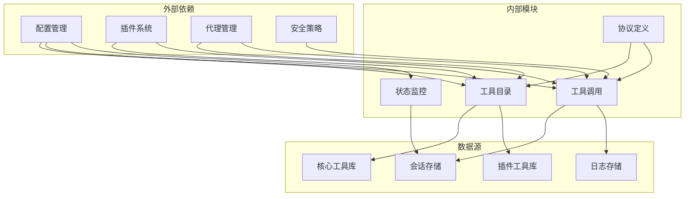

# 工具目录接口

## 目录
1. [简介](#简介)
2. [项目结构](#项目结构)
3. [核心组件](#核心组件)
4. [架构概览](#架构概览)
5. [详细组件分析](#详细组件分析)
6. [依赖关系分析](#依赖关系分析)
7. [性能考虑](#性能考虑)
8. [故障排除指南](#故障排除指南)
9. [结论](#结论)

## 简介

OpenClaw工具目录接口是系统中用于管理和访问可用工具的核心功能模块。该接口提供了三个主要的RPC方法：`tools.catalog`（工具目录查询）、`tools.invoke`（工具调用执行）和`tools.status`（工具状态监控）。这些接口支持工具注册、权限控制、执行监控等功能，为开发者和用户提供了一个统一的工具管理平台。

工具目录接口的设计遵循了模块化和可扩展性原则，支持核心工具和插件工具的统一管理，同时提供了灵活的权限控制机制和安全策略。系统通过严格的参数验证、权限检查和错误处理确保了工具调用的安全性和可靠性。

## 项目结构

OpenClaw工具目录接口的实现分布在多个关键模块中：

**图表来源**
- [src/gateway/server-methods/tools-catalog.ts](file://src/gateway/server-methods/tools-catalog.ts#L1-L167)
- [src/gateway/tools-invoke-http.ts](file://src/gateway/tools-invoke-http.ts#L1-L341)
- [apps/macos/Sources/OpenClawProtocol/GatewayModels.swift](file://apps/macos/Sources/OpenClawProtocol/GatewayModels.swift#L2411-L2573)

**章节来源**
- [src/gateway/server-methods/tools-catalog.ts](file://src/gateway/server-methods/tools-catalog.ts#L1-L167)
- [src/gateway/tools-invoke-http.ts](file://src/gateway/tools-invoke-http.ts#L1-L341)

## 核心组件

### 工具目录服务

工具目录服务是系统的核心组件，负责提供所有可用工具的元数据信息。它支持以下功能：

- **工具分类管理**：将工具按功能分组，包括核心工具和插件工具
- **代理ID解析**：支持多代理环境下的工具目录查询
- **插件工具集成**：动态加载和管理插件工具
- **权限控制**：基于工具配置的访问控制

### 工具调用服务

工具调用服务提供了HTTP和RPC两种调用方式，支持：

- **参数验证**：严格的输入参数验证和类型检查
- **权限检查**：多层次的权限控制和策略应用
- **执行监控**：工具执行过程的状态跟踪和日志记录
- **错误处理**：完善的异常处理和错误响应机制

### 状态监控系统

状态监控系统提供了工具执行状态的可视化反馈：

- **表情符号映射**：根据工具类型自动选择合适的表情符号
- **状态转换**：支持排队、思考、工具执行、完成、错误等多种状态
- **定时器管理**：智能的超时检测和状态切换
- **去抖动机制**：防止频繁的状态更新造成性能问题

**章节来源**
- [src/gateway/server-methods/tools-catalog.ts](file://src/gateway/server-methods/tools-catalog.ts#L22-L167)
- [src/gateway/tools-invoke-http.ts](file://src/gateway/tools-invoke-http.ts#L134-L341)
- [src/channels/status-reactions.ts](file://src/channels/status-reactions.ts#L1-L111)

## 架构概览

OpenClaw工具目录接口采用分层架构设计，确保了系统的可维护性和扩展性：

**图表来源**
- [src/gateway/server-methods/tools-catalog.ts](file://src/gateway/server-methods/tools-catalog.ts#L125-L167)
- [src/gateway/tools-invoke-http.ts](file://src/gateway/tools-invoke-http.ts#L134-L341)

## 详细组件分析

### 工具目录查询 (tools.catalog)

工具目录查询接口提供了系统中所有可用工具的完整列表。该接口支持以下特性：

#### 参数验证
- `agentId`：可选的代理ID参数，用于指定查询特定代理的工具
- `includePlugins`：布尔值参数，控制是否包含插件工具

#### 工具分类
系统将工具分为两大类：

1. **核心工具 (core)**：内置的基础工具集合
2. **插件工具 (plugin)**：动态加载的第三方工具

#### 插件工具管理
插件工具通过以下机制进行管理：
- 动态加载和初始化
- 元数据提取和分类
- 冲突检测和解决
- 权限继承和控制

**图表来源**
- [src/gateway/server-methods/tools-catalog.ts](file://src/gateway/server-methods/tools-catalog.ts#L125-L167)

**章节来源**
- [src/gateway/server-methods/tools-catalog.ts](file://src/gateway/server-methods/tools-catalog.ts#L125-L167)
- [src/gateway/server-methods/tools-catalog.test.ts](file://src/gateway/server-methods/tools-catalog.test.ts#L44-L121)

### 工具调用执行 (tools.invoke)

工具调用执行接口提供了统一的工具调用入口，支持多种调用方式：

#### HTTP调用流程
HTTP调用通过专用的处理器处理，具有以下特点：

1. **身份验证**：支持多种认证方式
2. **参数解析**：自动解析和验证请求参数
3. **权限检查**：应用多层次的权限控制策略
4. **执行监控**：实时跟踪工具执行状态

#### 工具执行策略
系统采用分层策略控制工具访问：

**图表来源**
- [src/gateway/tools-invoke-http.ts](file://src/gateway/tools-invoke-http.ts#L134-L341)

#### 错误处理机制
系统提供了完善的错误处理机制：

- **输入验证错误**：返回400状态码
- **权限不足**：返回403状态码  
- **工具不存在**：返回404状态码
- **执行异常**：返回500状态码

**章节来源**
- [src/gateway/tools-invoke-http.ts](file://src/gateway/tools-invoke-http.ts#L134-L341)

### 工具状态监控 (tools.status)

工具状态监控系统提供了工具执行状态的可视化反馈：

#### 状态类型定义
系统支持以下状态类型：

| 状态 | 描述 | 表情符号 |
|------|------|----------|
| queued | 排队等待 | 👀 |
| thinking | 思考中 | 🤔 |
| tool | 工具执行 | 🔥 |
| coding | 编程相关 | 👨‍💻 |
| web | 网络相关 | ⚡ |
| done | 执行完成 | 👍 |
| error | 执行错误 | 😱 |
| stallSoft | 轻微停滞 | 🥱 |
| stallHard | 严重停滞 | 😨 |

#### 工具类型识别
系统通过关键词匹配自动识别工具类型：

**图表来源**
- [src/channels/status-reactions.ts](file://src/channels/status-reactions.ts#L37-L111)

**章节来源**
- [src/channels/status-reactions.ts](file://src/channels/status-reactions.ts#L1-L111)
- [src/channels/status-reactions.test.ts](file://src/channels/status-reactions.test.ts#L1-L111)

## 依赖关系分析

### 核心依赖关系

OpenClaw工具目录接口的依赖关系体现了清晰的分层架构：

**图表来源**
- [src/gateway/server-methods/tools-catalog.ts](file://src/gateway/server-methods/tools-catalog.ts#L1-L20)
- [src/gateway/tools-invoke-http.ts](file://src/gateway/tools-invoke-http.ts#L1-L35)

### 方法权限控制

系统通过方法范围控制确保API的安全访问：

| 方法名 | 默认权限 | 描述 |
|--------|----------|------|
| tools.catalog | operator.read | 查询工具目录 |
| tools.invoke | operator.write | 执行工具调用 |
| tools.status | operator.read | 监控工具状态 |

**章节来源**
- [src/gateway/method-scopes.ts](file://src/gateway/method-scopes.ts#L62-L62)
- [src/gateway/server-methods-list.ts](file://src/gateway/server-methods-list.ts#L38-L38)

## 性能考虑

### 工具目录缓存策略

为了提高工具目录查询的性能，系统采用了多级缓存机制：

1. **内存缓存**：缓存已解析的工具元数据
2. **插件缓存**：缓存插件工具的加载状态
3. **代理缓存**：缓存代理ID解析结果

### 并发控制

系统通过以下机制控制并发访问：

- **请求队列**：限制同时执行的工具调用数量
- **超时控制**：设置合理的执行超时时间
- **资源限制**：限制单个工具调用的资源消耗

### 监控和诊断

系统提供了全面的监控功能：

- **执行时间统计**：记录每个工具的执行时间
- **错误率监控**：跟踪工具调用的成功率
- **资源使用监控**：监控内存和CPU使用情况

## 故障排除指南

### 常见问题诊断

#### 工具目录查询失败
可能的原因和解决方案：

1. **代理ID无效**
   - 检查代理ID是否存在
   - 确认代理配置正确

2. **插件加载失败**
   - 检查插件依赖
   - 验证插件权限

#### 工具调用执行错误

1. **权限不足**
   - 检查用户权限
   - 验证工具访问策略

2. **参数验证失败**
   - 检查请求格式
   - 验证必需参数

#### 状态监控异常

1. **表情符号显示错误**
   - 检查表情符号支持
   - 验证字符编码

2. **状态更新延迟**
   - 检查网络连接
   - 验证定时器配置

**章节来源**
- [src/gateway/server-methods/tools-catalog.test.ts](file://src/gateway/server-methods/tools-catalog.test.ts#L51-L67)
- [src/gateway/server.tools-catalog.test.ts](file://src/gateway/server.tools-catalog.test.ts#L29-L45)

## 结论

OpenClaw工具目录接口提供了一个功能完整、安全可靠的工具管理平台。通过模块化的架构设计、严格的权限控制和完善的监控机制，系统能够满足各种复杂的工具管理需求。

该接口的主要优势包括：

- **统一的工具管理**：核心工具和插件工具的统一管理
- **灵活的权限控制**：多层次的权限策略和访问控制
- **强大的监控能力**：实时的状态反馈和性能监控
- **良好的扩展性**：支持新的工具类型和插件系统

未来的发展方向包括进一步优化性能、增强安全性以及提供更丰富的监控和诊断功能。