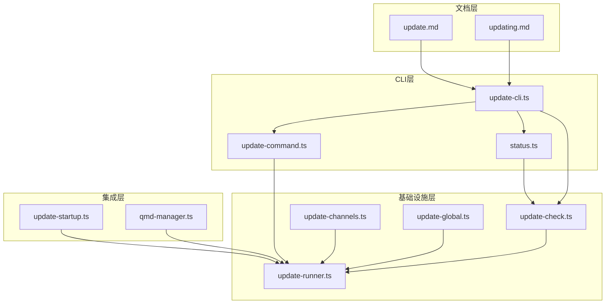
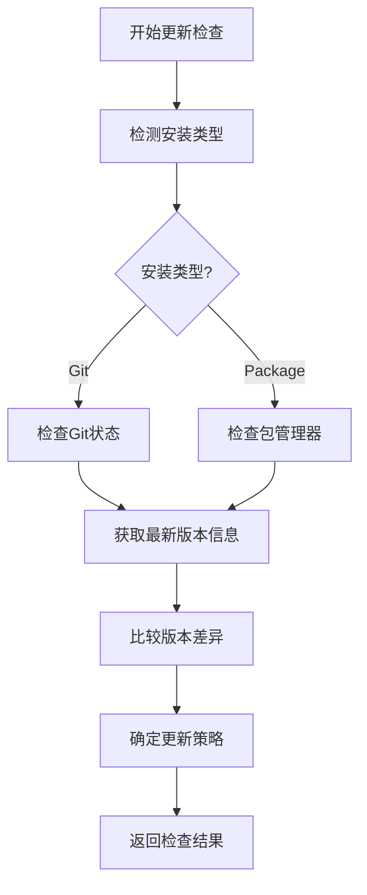
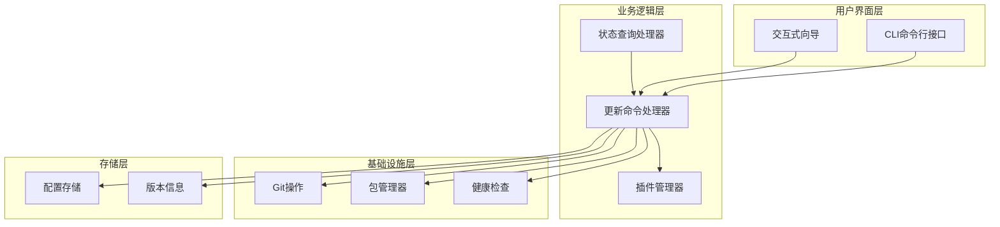
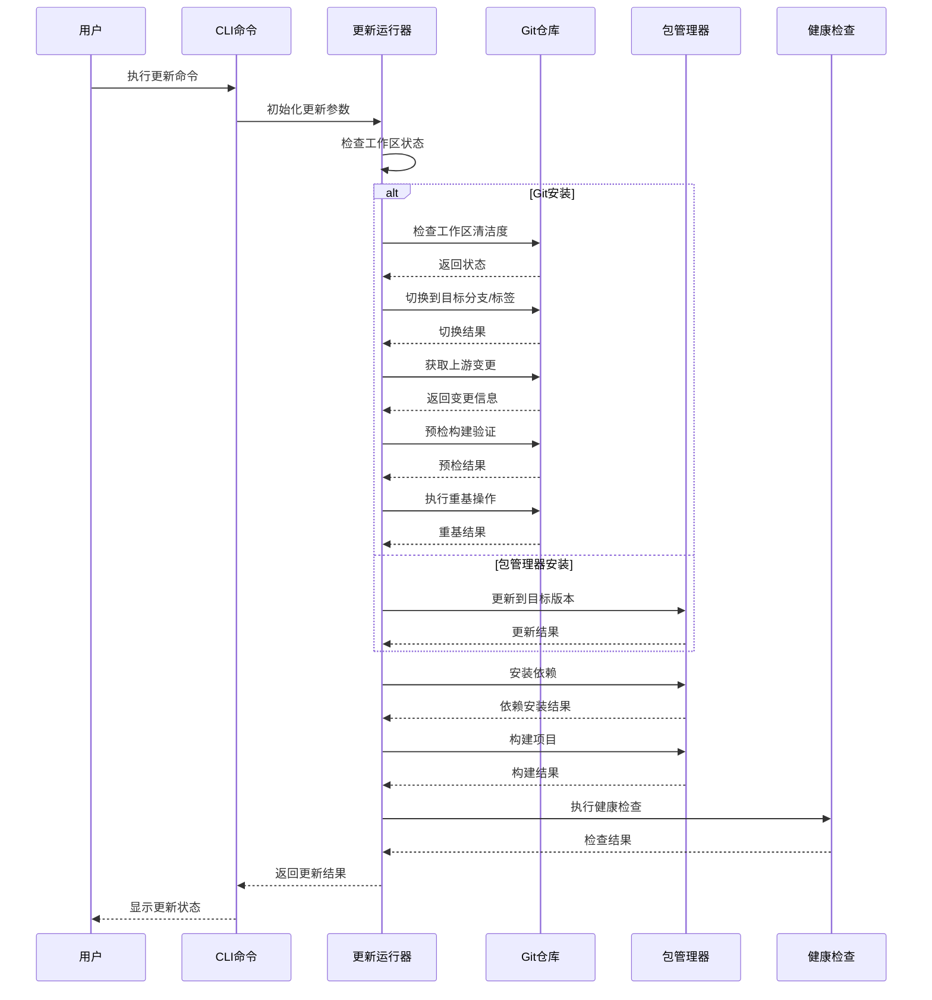
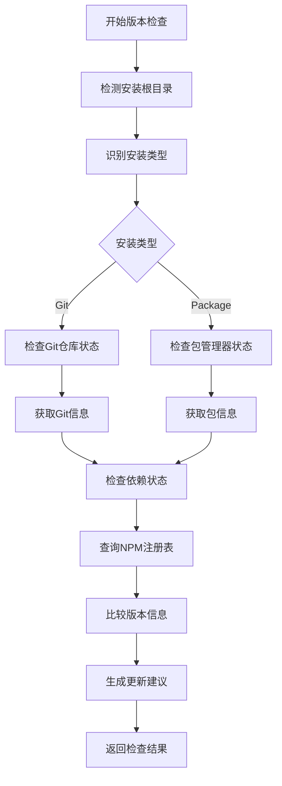
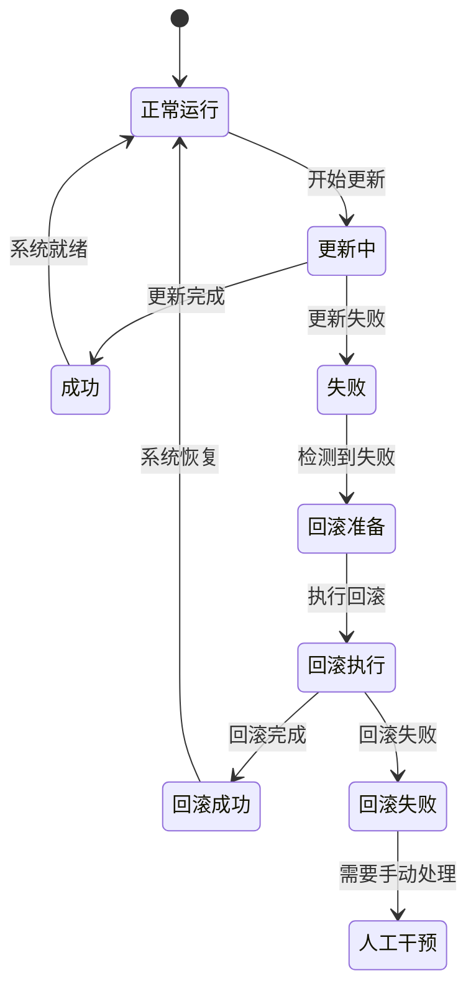
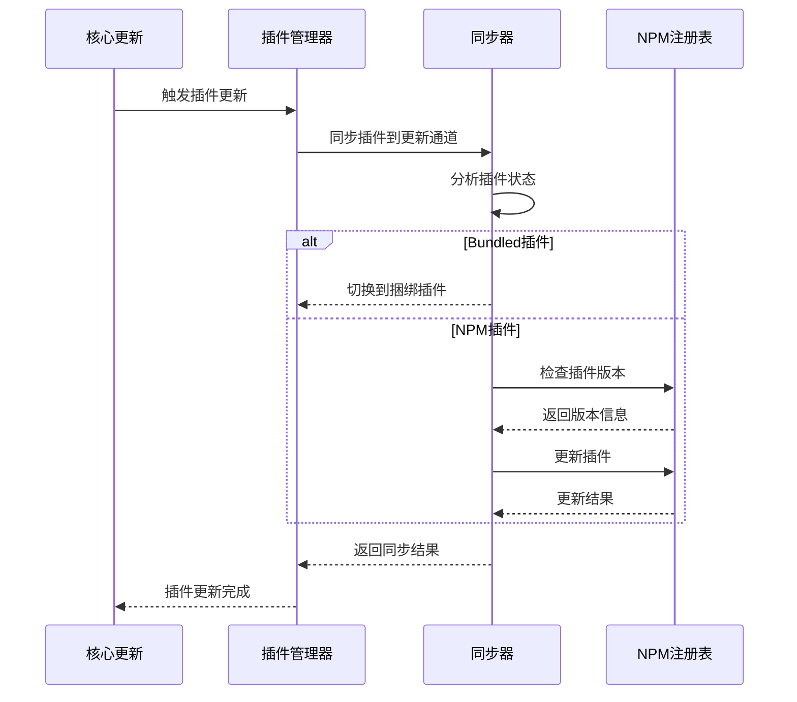
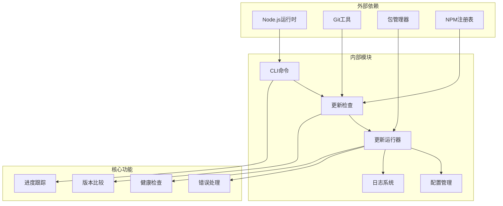

# 更新管理接口

## 目录
1. [简介](#简介)
2. [项目结构](#项目结构)
3. [核心组件](#核心组件)
4. [架构概览](#架构概览)
5. [详细组件分析](#详细组件分析)
6. [依赖关系分析](#依赖关系分析)
7. [性能考虑](#性能考虑)
8. [故障排除指南](#故障排除指南)
9. [结论](#结论)

## 简介

OpenClaw 更新管理功能提供了一个完整的自动化更新解决方案，支持多种更新模式和策略。该系统实现了安全的更新流程，包括版本检查、自动更新、回滚机制和故障恢复。

主要特性包括：
- 支持稳定版(stable)、测试版(beta)、开发版(dev)三种更新通道
- 自动化的预检和回滚机制
- 多种包管理器支持(pnpm、npm、bun)
- 插件同步和更新管理
- 健康检查和服务重启

## 项目结构

更新管理功能分布在以下关键模块中：

**图表来源**
- [src/cli/update-cli.ts](file://src/cli/update-cli.ts#L34-L153)
- [src/infra/update-check.ts](file://src/infra/update-check.ts#L449-L490)
- [src/infra/update-runner.ts](file://src/infra/update-runner.ts#L320-L927)

## 核心组件

### 更新命令接口

更新命令提供了三个主要子命令：

1. **update.run** - 执行完整的更新流程
2. **update.check** - 检查可用更新
3. **update.rollback** - 回滚到之前的版本

### 版本检查机制

系统通过多层检查确保更新的安全性：

**图表来源**
- [src/infra/update-check.ts](file://src/infra/update-check.ts#L449-L490)
- [src/infra/update-check.ts](file://src/infra/update-check.ts#L90-L181)

**章节来源**
- [src/cli/update-cli/update-command.ts](file://src/cli/update-cli/update-command.ts#L630-L919)
- [src/infra/update-check.ts](file://src/infra/update-check.ts#L1-L490)

## 架构概览

更新管理系统采用分层架构设计，确保各组件职责清晰分离：

**图表来源**
- [src/cli/update-cli.ts](file://src/cli/update-cli.ts#L34-L153)
- [src/cli/update-cli/update-command.ts](file://src/cli/update-cli/update-command.ts#L630-L919)
- [src/infra/update-runner.ts](file://src/infra/update-runner.ts#L320-L927)

## 详细组件分析

### 更新执行引擎 (update.run)

更新执行引擎是整个系统的核心，负责协调所有更新步骤：

#### 主要流程

**图表来源**
- [src/cli/update-cli/update-command.ts](file://src/cli/update-cli/update-command.ts#L630-L919)
- [src/infra/update-runner.ts](file://src/infra/update-runner.ts#L320-L927)

#### 关键特性

1. **多通道支持**: 支持稳定版、测试版、开发版三种更新通道
2. **预检机制**: 开发版更新前进行预检，确保构建稳定性
3. **错误恢复**: 自动处理更新失败并提供回滚选项
4. **进度跟踪**: 实时显示更新进度和状态

**章节来源**
- [src/cli/update-cli/update-command.ts](file://src/cli/update-cli/update-command.ts#L324-L402)
- [src/infra/update-runner.ts](file://src/infra/update-runner.ts#L320-L927)

### 版本检查系统 (update.check)

版本检查系统提供全面的更新状态评估：

#### 检查流程

**图表来源**
- [src/infra/update-check.ts](file://src/infra/update-check.ts#L449-L490)
- [src/infra/update-check.ts](file://src/infra/update-check.ts#L90-L181)

#### 核心功能

1. **多维度检查**: 同时检查Git状态、依赖状态、注册表信息
2. **智能比较**: 使用语义化版本比较算法
3. **缓存机制**: 缓存检查结果以提高性能
4. **错误处理**: 提供详细的错误诊断信息

**章节来源**
- [src/infra/update-check.ts](file://src/infra/update-check.ts#L1-L490)
- [src/infra/update-startup.ts](file://src/infra/update-startup.ts#L117-L154)

### 回滚机制 (update.rollback)

系统内置了强大的回滚机制，确保更新失败时能够安全恢复：

#### 回滚策略

**图表来源**
- [src/infra/update-runner.ts](file://src/infra/update-runner.ts#L626-L669)

#### 回滚特性

1. **自动检测**: 自动检测更新失败并触发回滚
2. **多级回滚**: 支持不同级别的回滚策略
3. **数据保护**: 确保回滚过程中数据完整性
4. **日志记录**: 详细记录回滚过程便于诊断

**章节来源**
- [src/infra/update-runner.ts](file://src/infra/update-runner.ts#L626-L669)
- [src/memory/qmd-manager.ts](file://src/memory/qmd-manager.ts#L1030-L1068)

### 插件更新管理

系统提供智能的插件更新管理功能：

#### 插件更新流程

**图表来源**
- [src/cli/update-cli/update-command.ts](file://src/cli/update-cli/update-command.ts#L404-L503)

**章节来源**
- [src/cli/update-cli/update-command.ts](file://src/cli/update-cli/update-command.ts#L404-L503)

## 依赖关系分析

更新管理系统具有清晰的依赖层次结构：

**图表来源**
- [src/cli/update-cli.ts](file://src/cli/update-cli.ts#L1-L153)
- [src/infra/update-check.ts](file://src/infra/update-check.ts#L1-L490)
- [src/infra/update-runner.ts](file://src/infra/update-runner.ts#L1-L927)

**章节来源**
- [src/cli/update-cli.ts](file://src/cli/update-cli.ts#L1-L153)
- [src/infra/update-check.ts](file://src/infra/update-check.ts#L1-L490)

## 性能考虑

### 更新性能优化

1. **并发执行**: 支持多个更新步骤并行执行
2. **缓存策略**: 缓存版本信息和检查结果
3. **增量更新**: 只更新必要的组件
4. **超时控制**: 合理设置超时时间避免长时间阻塞

### 内存管理

1. **流式处理**: 使用流式处理减少内存占用
2. **垃圾回收**: 及时清理临时文件和缓存
3. **资源监控**: 监控内存使用情况及时告警

## 故障排除指南

### 常见问题及解决方案

#### 更新失败

**症状**: 更新过程中出现错误并中断

**原因分析**:
1. 网络连接问题
2. 权限不足
3. 依赖冲突
4. 磁盘空间不足

**解决步骤**:
1. 检查网络连接状态
2. 确认有足够的磁盘空间
3. 以管理员权限重新执行
4. 清理缓存后重试

#### 回滚失败

**症状**: 更新失败后无法回滚到之前版本

**诊断方法**:
1. 检查Git工作区状态
2. 验证备份文件完整性
3. 确认权限设置正确

**恢复步骤**:
1. 手动执行回滚命令
2. 检查并修复权限问题
3. 重新安装依赖

#### 性能问题

**症状**: 更新过程缓慢或卡死

**优化措施**:
1. 增加超时时间
2. 关闭不必要的后台程序
3. 清理系统缓存
4. 检查磁盘I/O性能

**章节来源**
- [src/infra/update-runner.ts](file://src/infra/update-runner.ts#L626-L669)
- [src/memory/qmd-manager.ts](file://src/memory/qmd-manager.ts#L1030-L1068)

## 结论

OpenClaw 更新管理功能提供了一个完整、安全、可靠的自动化更新解决方案。通过多层检查、智能回滚、插件管理等特性，确保了系统的稳定性和可靠性。

### 主要优势

1. **安全性**: 多层检查和预检机制确保更新安全
2. **可靠性**: 完善的回滚和故障恢复机制
3. **易用性**: 简洁的命令行接口和交互式向导
4. **可扩展性**: 模块化设计支持功能扩展

### 未来改进方向

1. **增量更新**: 实现更高效的增量更新机制
2. **并行处理**: 进一步优化并行处理能力
3. **监控增强**: 添加更详细的性能监控和告警
4. **用户体验**: 改进错误提示和诊断信息

该系统为OpenClaw提供了坚实的更新基础，确保用户能够获得最新的功能和安全补丁，同时保持系统的稳定运行。