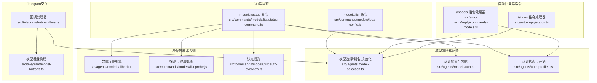
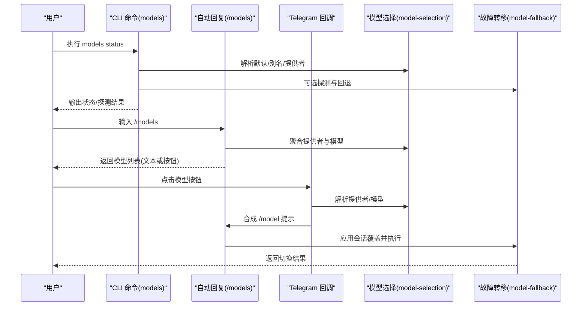
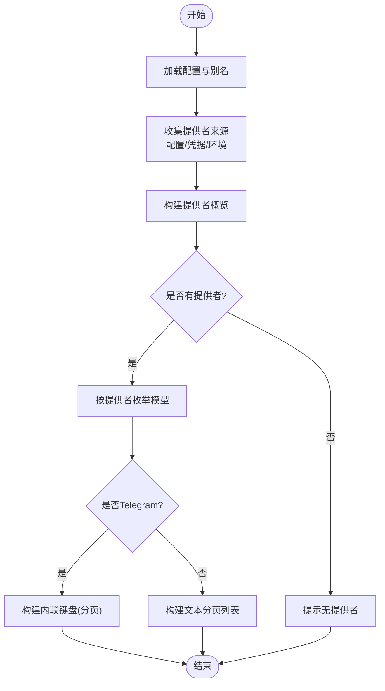
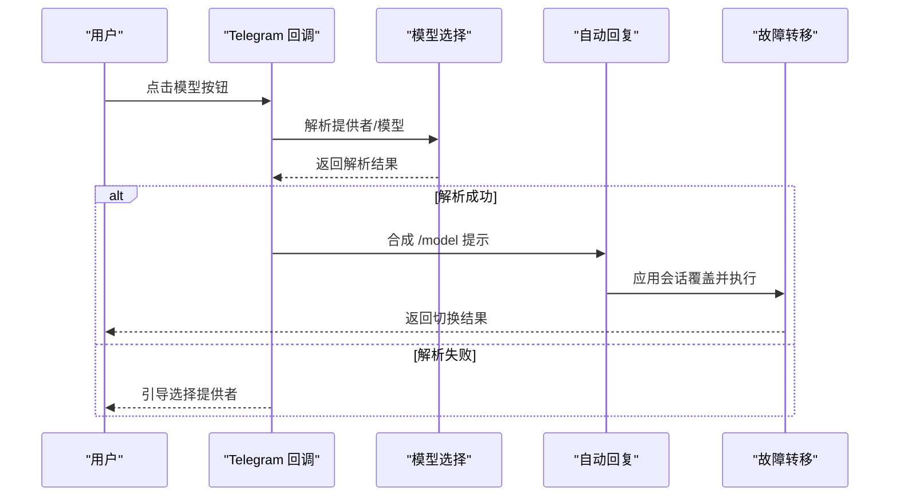
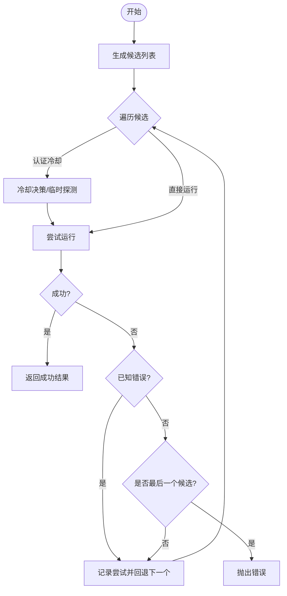
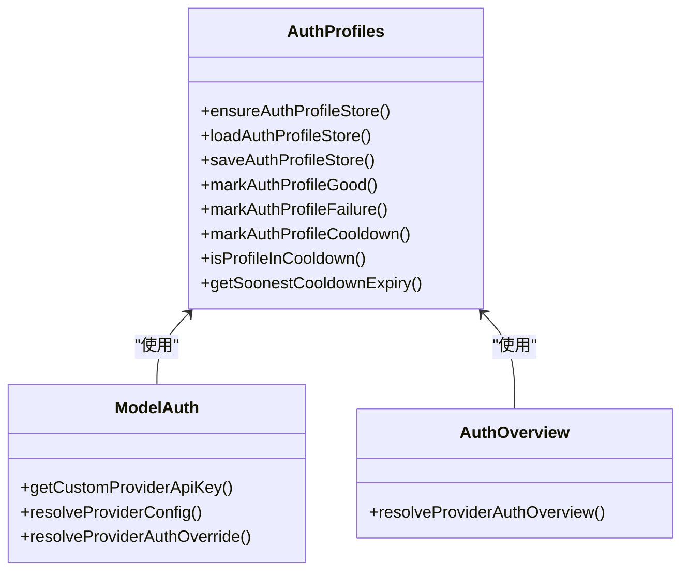
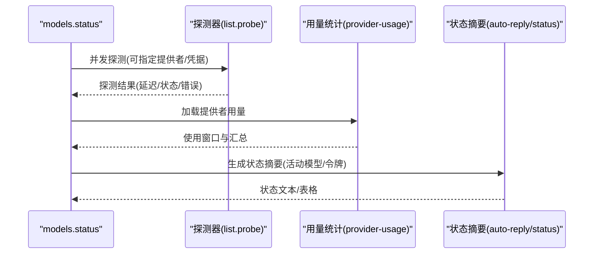
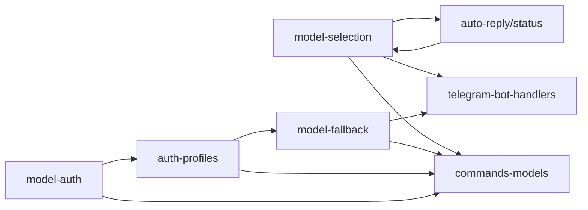

# 模型管理接口

## 目录
1. [简介](#简介)
2. [项目结构](#项目结构)
3. [核心组件](#核心组件)
4. [架构总览](#架构总览)
5. [详细组件分析](#详细组件分析)
6. [依赖关系分析](#依赖关系分析)
7. [性能考虑](#性能考虑)
8. [故障排查指南](#故障排查指南)
9. [结论](#结论)

## 简介
本文件面向OpenClaw的模型管理功能，系统化梳理并说明以下接口与能力：
- 模型发现：通过配置与目录扫描聚合可用模型清单
- 列表展示：支持分页与按钮交互（Telegram）
- 模型切换：解析用户输入，应用会话级覆盖
- 负载均衡/故障转移：基于备选模型与认证状态的自动回退
- 配置与认证：模型别名、提供者配置、凭据存储与健康检查
- 性能监控与状态：探测延迟、使用统计与状态摘要
- 故障转移机制：超时、过载、格式错误等场景的策略化处理

## 项目结构
围绕模型管理的关键模块分布如下：
- CLI命令与状态：models.list、models.status、models.set（通过会话覆盖实现）等
- 自动回复与指令：/models、/model（切换）、/status（状态摘要）
- Telegram交互：内联键盘、分页按钮、回调处理
- 模型选择与别名：规范化提供者ID、模型ID、别名索引
- 认证与配额：凭据存储、冷却时间、健康概览
- 故障转移：多候选模型回退、错误分类与重试策略
- 性能与探测：延迟探测、并发控制、使用窗口统计

**图表来源**
- [src/commands/models/list.status-command.ts](file://src/commands/models/list.status-command.ts#L61-L687)
- [src/auto-reply/reply/commands-models.ts](file://src/auto-reply/reply/commands-models.ts#L200-L399)
- [src/telegram/bot-handlers.ts](file://src/telegram/bot-handlers.ts#L1300-L1405)
- [src/telegram/model-buttons.ts](file://src/telegram/model-buttons.ts#L213-L276)
- [src/agents/model-selection.ts](file://src/agents/model-selection.ts#L1-L200)
- [src/agents/model-auth.ts](file://src/agents/model-auth.ts#L30-L70)
- [src/agents/auth-profiles.ts](file://src/agents/auth-profiles.ts#L1-L55)
- [src/agents/model-fallback.ts](file://src/agents/model-fallback.ts#L1-L769)
- [src/commands/models/list.probe.js](file://src/commands/models/list.probe.js)
- [src/commands/models/list.auth-overview.js](file://src/commands/models/list.auth-overview.js)

**章节来源**
- [src/commands/models/list.status-command.ts](file://src/commands/models/list.status-command.ts#L61-L687)
- [src/auto-reply/reply/commands-models.ts](file://src/auto-reply/reply/commands-models.ts#L200-L399)
- [src/telegram/bot-handlers.ts](file://src/telegram/bot-handlers.ts#L1300-L1405)
- [src/telegram/model-buttons.ts](file://src/telegram/model-buttons.ts#L213-L276)
- [src/agents/model-selection.ts](file://src/agents/model-selection.ts#L1-L200)
- [src/agents/model-auth.ts](file://src/agents/model-auth.ts#L30-L70)
- [src/agents/auth-profiles.ts](file://src/agents/auth-profiles.ts#L1-L55)
- [src/agents/model-fallback.ts](file://src/agents/model-fallback.ts#L1-L769)

## 核心组件
- 模型发现与列表
  - 通过配置与环境变量聚合提供者与模型，支持别名与规范化
  - 支持分页与按钮交互（Telegram），非Telegram以文本列表输出
- 模型切换
  - 解析“提供者/模型”引用，应用会话级覆盖，优先于全局默认
- 负载均衡与故障转移
  - 多候选模型按顺序尝试；根据错误类型与认证状态决定是否回退
  - 对过载场景进行指数退避，避免雪崩
- 认证与配置
  - 凭据存储与冷却时间管理；提供者配置覆盖与环境变量注入
- 性能监控与状态
  - 探测延迟、并发控制、使用窗口统计；状态摘要与健康概览
- 故障转移机制
  - 错误分类（超时、格式、过载等）；失败尝试记录与总结

**章节来源**
- [src/auto-reply/reply/commands-models.ts](file://src/auto-reply/reply/commands-models.ts#L200-L399)
- [src/telegram/bot-handlers.ts](file://src/telegram/bot-handlers.ts#L1308-L1391)
- [src/telegram/model-buttons.ts](file://src/telegram/model-buttons.ts#L213-L276)
- [src/agents/model-fallback.ts](file://src/agents/model-fallback.ts#L1-L769)
- [src/agents/model-selection.ts](file://src/agents/model-selection.ts#L1-L200)
- [src/agents/auth-profiles.ts](file://src/agents/auth-profiles.ts#L1-L55)
- [src/commands/models/list.status-command.ts](file://src/commands/models/list.status-command.ts#L61-L687)

## 架构总览
模型管理在不同入口协同工作：
- CLI入口：models.status负责状态与探测；models.list负责模型清单加载
- 自动回复入口：/models列出模型；/model切换模型；/status输出状态摘要
- Telegram入口：内联键盘分页浏览；回调解析选择并合成消息触发切换
- 模型选择与认证：统一的模型引用解析、别名与提供者规范化；认证状态与冷却控制
- 故障转移：运行时按候选顺序尝试，结合错误分类与认证健康度

**图表来源**
- [src/commands/models/list.status-command.ts](file://src/commands/models/list.status-command.ts#L61-L687)
- [src/auto-reply/reply/commands-models.ts](file://src/auto-reply/reply/commands-models.ts#L200-L399)
- [src/telegram/bot-handlers.ts](file://src/telegram/bot-handlers.ts#L1308-L1391)
- [src/agents/model-selection.ts](file://src/agents/model-selection.ts#L1-L200)
- [src/agents/model-fallback.ts](file://src/agents/model-fallback.ts#L1-L769)

## 详细组件分析

### 模型发现与列表展示
- 发现流程
  - 聚合默认模型、别名、图像模型与允许列表
  - 从配置、凭据存储、环境变量中提取提供者集合
  - 构建提供者概览与缺失提供者检测
- 列表展示
  - Telegram：内联键盘分页，支持“上一页/下一页/当前页”
  - 非Telegram：文本分页，支持“全部/更多/下一页”

**图表来源**
- [src/commands/models/list.status-command.ts](file://src/commands/models/list.status-command.ts#L104-L177)
- [src/auto-reply/reply/commands-models.ts](file://src/auto-reply/reply/commands-models.ts#L236-L362)
- [src/telegram/model-buttons.ts](file://src/telegram/model-buttons.ts#L213-L276)

**章节来源**
- [src/commands/models/list.status-command.ts](file://src/commands/models/list.status-command.ts#L104-L177)
- [src/auto-reply/reply/commands-models.ts](file://src/auto-reply/reply/commands-models.ts#L236-L362)
- [src/telegram/model-buttons.ts](file://src/telegram/model-buttons.ts#L213-L276)

### 模型切换与会话覆盖
- 解析与验证
  - 解析“提供者/模型”引用，规范化提供者ID与模型ID
  - 若无法解析，回退到提供者选择界面
- 会话覆盖
  - 将选择写入会话上下文，优先于全局默认模型
  - Telegram回调通过合成消息触发自动回复流程

**图表来源**
- [src/telegram/bot-handlers.ts](file://src/telegram/bot-handlers.ts#L1359-L1391)
- [src/telegram/bot-handlers.ts](file://src/telegram/bot-handlers.ts#L1377-L1387)
- [src/agents/model-selection.ts](file://src/agents/model-selection.ts#L149-L170)

**章节来源**
- [src/telegram/bot-handlers.ts](file://src/telegram/bot-handlers.ts#L1359-L1391)
- [src/telegram/bot-handlers.ts](file://src/telegram/bot-handlers.ts#L1377-L1387)
- [src/agents/model-selection.ts](file://src/agents/model-selection.ts#L149-L170)

### 负载均衡与故障转移
- 候选生成
  - 默认主模型 + 备选模型；可按代理覆盖
  - 过滤不在允许列表中的候选
- 冷却与探测
  - 若所有认证配置均处于冷却，按探测策略决定是否继续
  - 允许临时探测探查可用性
- 回退策略
  - 已知错误类型才触发回退；未知错误在最后候选时抛出
  - 记录每次尝试的错误、原因、HTTP状态/代码
- 过载退避
  - 对“过载”错误进行指数退避，避免重复过载

**图表来源**
- [src/agents/model-fallback.ts](file://src/agents/model-fallback.ts#L66-L703)
- [src/agents/pi-embedded-runner/run.ts](file://src/agents/pi-embedded-runner/run.ts#L779-L798)

**章节来源**
- [src/agents/model-fallback.ts](file://src/agents/model-fallback.ts#L66-L703)
- [src/agents/pi-embedded-runner/run.ts](file://src/agents/pi-embedded-runner/run.ts#L779-L798)
- [src/agents/failover-error.test.ts](file://src/agents/failover-error.test.ts#L71-L82)

### 认证管理与配置
- 凭据存储与冷却
  - 统一的认证配置存储；冷却时间计算与到期检查
  - 标记使用、失败与冷却；修复OAuth配置不一致
- 提供者配置
  - 支持自定义API Key、基础URL与认证模式覆盖
  - 环境变量注入与Shell环境回退策略
- 认证概览与健康
  - 汇总各提供者的凭据来源（存储、环境、models.json）
  - 剩余时间与不可用原因格式化显示

**图表来源**
- [src/agents/auth-profiles.ts](file://src/agents/auth-profiles.ts#L1-L55)
- [src/agents/model-auth.ts](file://src/agents/model-auth.ts#L30-L70)
- [src/commands/models/list.auth-overview.js](file://src/commands/models/list.auth-overview.js)

**章节来源**
- [src/agents/auth-profiles.ts](file://src/agents/auth-profiles.ts#L1-L55)
- [src/agents/model-auth.ts](file://src/agents/model-auth.ts#L30-L70)
- [src/commands/models/list.auth-overview.js](file://src/commands/models/list.auth-overview.js)

### 性能监控与状态摘要
- 探测与延迟
  - 并发探测、超时控制、最大输出令牌限制
  - 汇总探测结果与延迟描述
- 使用统计
  - 提供者用量窗口与汇总格式化
- 状态摘要
  - 当前活动模型、上下文令牌、输入/输出/缓存统计
  - 会话作用域内的覆盖优先级

**图表来源**
- [src/commands/models/list.status-command.ts](file://src/commands/models/list.status-command.ts#L61-L687)
- [src/commands/models/list.probe.js](file://src/commands/models/list.probe.js)
- [src/auto-reply/status.ts](file://src/auto-reply/status.ts#L411-L462)

**章节来源**
- [src/commands/models/list.status-command.ts](file://src/commands/models/list.status-command.ts#L61-L687)
- [src/auto-reply/status.ts](file://src/auto-reply/status.ts#L411-L462)

## 依赖关系分析
- 模块耦合
  - 模型选择与别名：被CLI、自动回复、Telegram广泛复用
  - 故障转移：依赖认证状态、错误分类与候选生成
  - 状态摘要：依赖模型选择与上下文令牌解析
- 外部集成
  - 探测器与用量统计作为外部子系统接入
  - Shell环境与凭据存储提供运行时配置来源

**图表来源**
- [src/agents/model-selection.ts](file://src/agents/model-selection.ts#L1-L200)
- [src/commands/models/list.status-command.ts](file://src/commands/models/list.status-command.ts#L61-L687)
- [src/auto-reply/reply/commands-models.ts](file://src/auto-reply/reply/commands-models.ts#L200-L399)
- [src/telegram/bot-handlers.ts](file://src/telegram/bot-handlers.ts#L1300-L1405)
- [src/agents/model-fallback.ts](file://src/agents/model-fallback.ts#L1-L769)
- [src/agents/auth-profiles.ts](file://src/agents/auth-profiles.ts#L1-L55)
- [src/agents/model-auth.ts](file://src/agents/model-auth.ts#L30-L70)
- [src/auto-reply/status.ts](file://src/auto-reply/status.ts#L411-L462)

**章节来源**
- [src/agents/model-selection.ts](file://src/agents/model-selection.ts#L1-L200)
- [src/agents/model-fallback.ts](file://src/agents/model-fallback.ts#L1-L769)
- [src/agents/auth-profiles.ts](file://src/agents/auth-profiles.ts#L1-L55)
- [src/agents/model-auth.ts](file://src/agents/model-auth.ts#L30-L70)
- [src/auto-reply/status.ts](file://src/auto-reply/status.ts#L411-L462)

## 性能考虑
- 探测并发与超时
  - 并发探测提升吞吐，需合理设置超时与最大输出令牌
- 退避策略
  - 对过载错误采用指数退避，降低抖动与失败传播
- 分页与渲染
  - Telegram内联键盘分页减少单次消息体积；文本列表支持“全部”快速查看
- 缓存与复用
  - 上下文引擎一次性初始化并在多次尝试间复用，减少连接开销

[本节为通用指导，无需具体文件分析]

## 故障排查指南
- 常见问题定位
  - 提供者未配置：检查models.providers与凭据存储；确认环境变量注入
  - 模型不可用：查看认证冷却与不可用原因；必要时临时探测
  - 切换失败：检查错误分类与最后尝试摘要；核对候选顺序与允许列表
- 命令辅助
  - 使用models.status --check快速判断整体健康状况
  - 使用models.status --probe针对特定提供者/凭据进行探测
- 日志与状态
  - 查看状态摘要中的活动模型与令牌统计，确认会话覆盖是否生效
  - 使用状态助手构建通道/账户运行时快照，辅助诊断

**章节来源**
- [src/commands/models/list.status-command.ts](file://src/commands/models/list.status-command.ts#L684-L687)
- [src/plugin-sdk/status-helpers.ts](file://src/plugin-sdk/status-helpers.ts#L48-L123)
- [src/commands/status.ts](file://src/commands/status.ts#L1-L3)

## 结论
OpenClaw的模型管理以“统一的模型选择与别名、完善的认证与冷却、可扩展的故障转移”为核心，配合CLI与自动回复/Telegram的多入口，实现了从模型发现、切换、到状态监控与故障恢复的完整闭环。通过合理的并发探测与退避策略，系统在复杂网络环境下仍能保持稳定与高效。