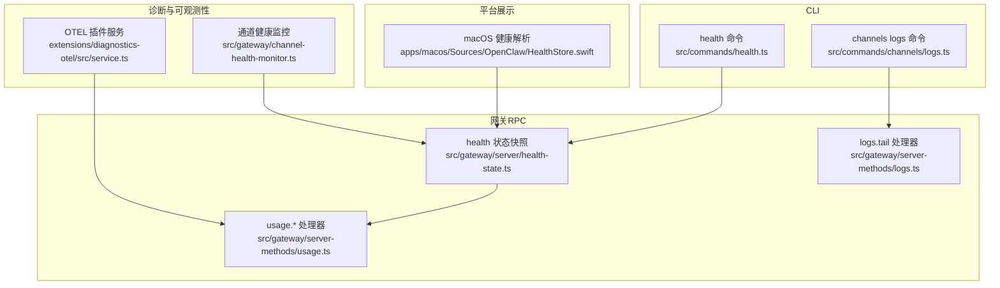
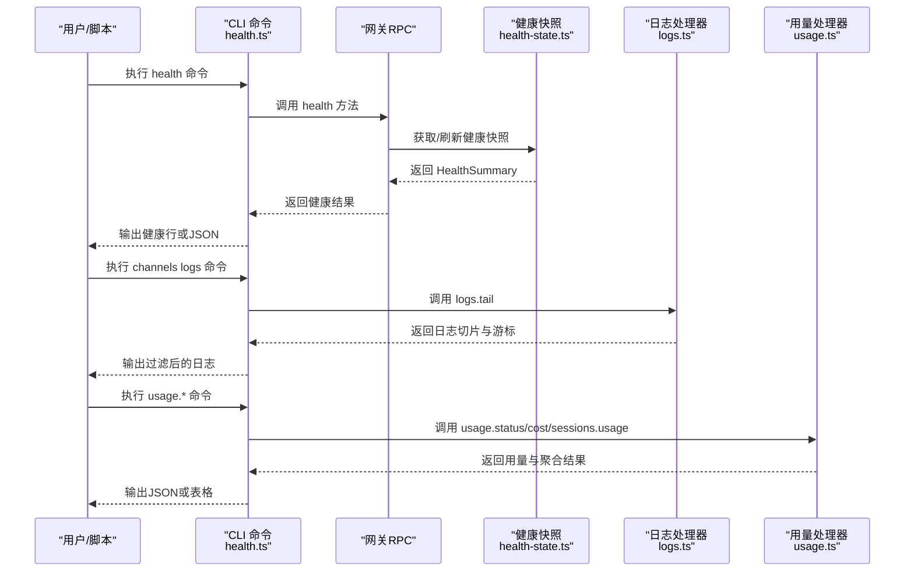
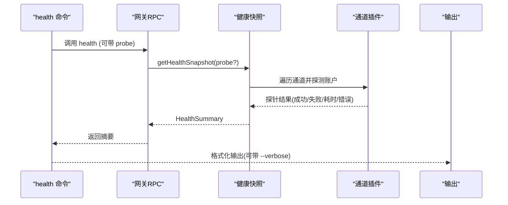
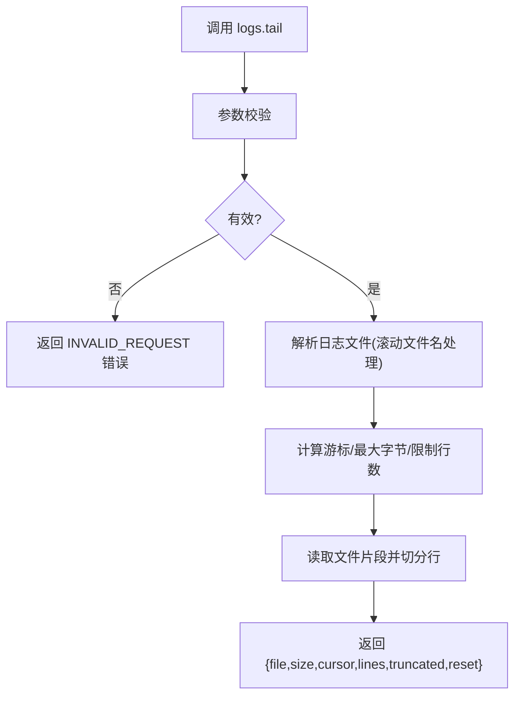
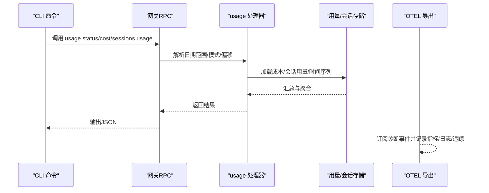
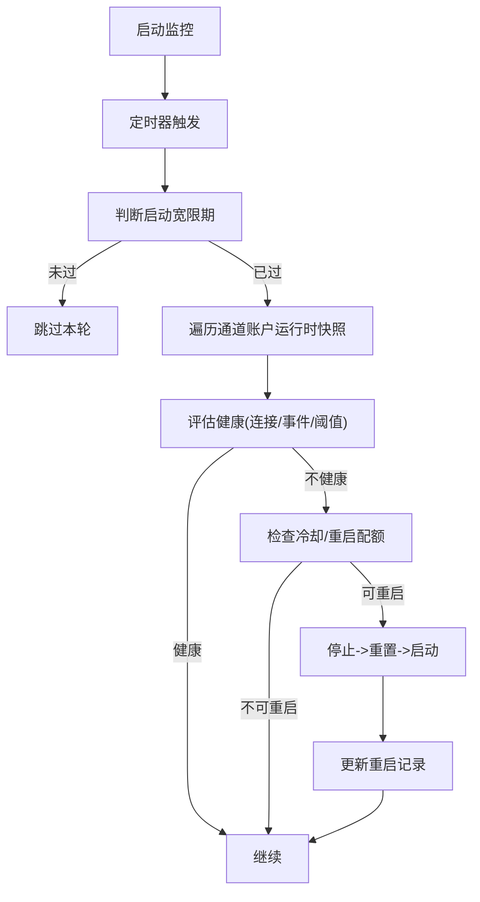
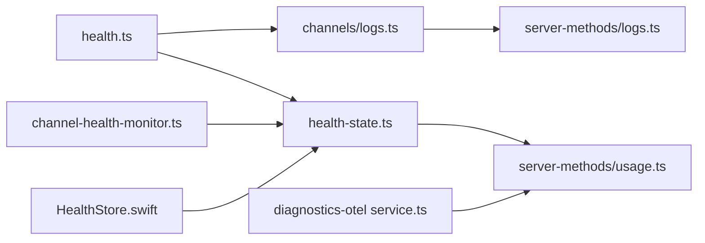

# 监控诊断接口

## 目录
1. [简介](#简介)
2. [项目结构](#项目结构)
3. [核心组件](#核心组件)
4. [架构总览](#架构总览)
5. [详细组件分析](#详细组件分析)
6. [依赖关系分析](#依赖关系分析)
7. [性能考量](#性能考量)
8. [故障排查指南](#故障排查指南)
9. [结论](#结论)

## 简介
本文件面向OpenClaw的监控诊断能力，系统性梳理并说明以下接口与机制：
- health.check：网关健康状态获取与通道探针
- logs.get：运行日志尾部读取与通道日志过滤
- metrics.get：会话用量统计与聚合（成本、令牌、消息、延迟）
- 健康监控与自动重启策略
- 诊断事件采集与OTLP导出
- 告警与故障排查流程

目标是帮助开发者与运维人员快速定位问题、评估系统健康度、收集性能指标，并建立稳定的监控闭环。

## 项目结构
围绕监控诊断的关键模块分布如下：
- CLI与命令层：health命令、channels logs命令
- 网关RPC层：health、logs.tail、usage.*等方法
- 健康快照与缓存：健康版本管理、缓存刷新
- 通道健康监控：周期性检测、重启策略
- 诊断与可观测性：OTLP指标/日志/追踪导出
- 平台侧健康展示：macOS端健康状态解析

图表来源
- [src/commands/health.ts](file://src/commands/health.ts#L525-L751)
- [src/gateway/server/health-state.ts](file://src/gateway/server/health-state.ts#L17-L85)
- [src/gateway/server-methods/logs.ts](file://src/gateway/server-methods/logs.ts#L147-L180)
- [src/commands/channels/logs.ts](file://src/commands/channels/logs.ts#L76-L113)
- [src/gateway/server-methods/usage.ts](file://src/gateway/server-methods/usage.ts#L350-L800)
- [extensions/diagnostics-otel/src/service.ts](file://extensions/diagnostics-otel/src/service.ts#L72-L686)
- [src/gateway/channel-health-monitor.ts](file://src/gateway/channel-health-monitor.ts#L76-L201)
- [apps/macos/Sources/OpenClaw/HealthStore.swift](file://apps/macos/Sources/OpenClaw/HealthStore.swift#L147-L163)

章节来源
- [src/commands/health.ts](file://src/commands/health.ts#L1-L752)
- [src/gateway/server/health-state.ts](file://src/gateway/server/health-state.ts#L1-L86)
- [src/gateway/server-methods/logs.ts](file://src/gateway/server-methods/logs.ts#L1-L181)
- [src/commands/channels/logs.ts](file://src/commands/channels/logs.ts#L1-L114)
- [src/gateway/server-methods/usage.ts](file://src/gateway/server-methods/usage.ts#L1-L870)
- [extensions/diagnostics-otel/src/service.ts](file://extensions/diagnostics-otel/src/service.ts#L1-L686)
- [src/gateway/channel-health-monitor.ts](file://src/gateway/channel-health-monitor.ts#L1-L201)
- [apps/macos/Sources/OpenClaw/HealthStore.swift](file://apps/macos/Sources/OpenClaw/HealthStore.swift#L147-L163)

## 核心组件
- 健康快照与命令
  - 健康摘要类型、通道账户探针、格式化输出、CLI调用网关health方法
- 日志读取
  - 网关RPC logs.tail：滚动日志解析、游标与字节限制、分页返回
  - CLI channels logs：按通道过滤、尾部读取、JSON输出
- 指标与用量
  - usage.status/usage.cost/sessions.usage：日期范围解析、缓存、聚合、会话用量加载
- 健康监控与自动重启
  - 通道健康策略、冷却与限速重启、错误原因归因
- 诊断与导出
  - OTEL插件：指标计数/直方图、日志导出、追踪span、诊断事件订阅
- 平台健康展示
  - macOS端对健康探针失败的描述与超时判定

章节来源
- [src/commands/health.ts](file://src/commands/health.ts#L23-L72)
- [src/gateway/server-methods/logs.ts](file://src/gateway/server-methods/logs.ts#L13-L18)
- [src/gateway/server-methods/usage.ts](file://src/gateway/server-methods/usage.ts#L46-L60)
- [src/gateway/channel-health-monitor.ts](file://src/gateway/channel-health-monitor.ts#L20-L45)
- [extensions/diagnostics-otel/src/service.ts](file://extensions/diagnostics-otel/src/service.ts#L72-L686)
- [apps/macos/Sources/OpenClaw/HealthStore.swift](file://apps/macos/Sources/OpenClaw/HealthStore.swift#L147-L163)

## 架构总览
下图展示从CLI到网关RPC，再到健康快照、日志读取与用量统计的整体调用链路。

图表来源
- [src/commands/health.ts](file://src/commands/health.ts#L525-L751)
- [src/gateway/server/health-state.ts](file://src/gateway/server/health-state.ts#L70-L85)
- [src/gateway/server-methods/logs.ts](file://src/gateway/server-methods/logs.ts#L147-L180)
- [src/commands/channels/logs.ts](file://src/commands/channels/logs.ts#L76-L113)
- [src/gateway/server-methods/usage.ts](file://src/gateway/server-methods/usage.ts#L350-L800)

## 详细组件分析

### 健康检查 health.check
- 功能要点
  - 通过CLI调用网关health方法，支持--verbose触发通道探针
  - 组装通道账户级探针结果，汇总为可读行或JSON
  - 与会话存储、心跳配置联动，提供代理与会话概要
- 关键流程
  - 解析配置与代理顺序
  - 构建通道账户绑定映射
  - 对每个账户执行探针（可选），并生成摘要
  - 格式化输出（含探针耗时、机器人用户名、webhook信息）

图表来源
- [src/commands/health.ts](file://src/commands/health.ts#L348-L523)
- [src/gateway/server/health-state.ts](file://src/gateway/server/health-state.ts#L70-L85)

章节来源
- [src/commands/health.ts](file://src/commands/health.ts#L23-L72)
- [src/commands/health.ts](file://src/commands/health.ts#L252-L346)
- [src/commands/health.ts](file://src/commands/health.ts#L348-L523)
- [src/commands/health.ts](file://src/commands/health.ts#L525-L751)
- [docs/cli/health.md](file://docs/cli/health.md#L1-L22)

### 日志查询 logs.get
- 网关RPC logs.tail
  - 参数校验、滚动日志解析、游标定位、最大字节数与行数限制
  - 返回当前文件大小、游标、截断标记、重置标记与日志行
- CLI channels logs
  - 从配置解析日志文件路径，读取尾部文本，解析为结构化日志行
  - 支持按通道过滤（all/具体通道）、限制行数、JSON输出

图表来源
- [src/gateway/server-methods/logs.ts](file://src/gateway/server-methods/logs.ts#L147-L180)
- [src/gateway/server-methods/logs.ts](file://src/gateway/server-methods/logs.ts#L53-L145)

章节来源
- [src/gateway/server-methods/logs.ts](file://src/gateway/server-methods/logs.ts#L13-L18)
- [src/gateway/server-methods/logs.ts](file://src/gateway/server-methods/logs.ts#L147-L180)
- [src/commands/channels/logs.ts](file://src/commands/channels/logs.ts#L16-L18)
- [src/commands/channels/logs.ts](file://src/commands/channels/logs.ts#L76-L113)

### 性能指标收集 metrics.get
- usage.status：提供模型提供商用量概要
- usage.cost：按日期范围（支持UTC/gateway/specific模式）计算成本汇总，带缓存
- sessions.usage：发现会话、合并命名与未命名会话、加载用量、聚合消息、工具、模型/供应商维度、延迟与每日分解
- 诊断事件到OTEL指标映射
  - 模型用量、webhook接收/处理/错误、消息入队/处理、队列深度/等待、会话状态/卡住、运行尝试、心跳队列深度
  - 可选开启日志导出与追踪span

图表来源
- [src/gateway/server-methods/usage.ts](file://src/gateway/server-methods/usage.ts#L350-L800)
- [extensions/diagnostics-otel/src/service.ts](file://extensions/diagnostics-otel/src/service.ts#L619-L664)

章节来源
- [src/gateway/server-methods/usage.ts](file://src/gateway/server-methods/usage.ts#L46-L60)
- [src/gateway/server-methods/usage.ts](file://src/gateway/server-methods/usage.ts#L350-L800)
- [extensions/diagnostics-otel/src/service.ts](file://extensions/diagnostics-otel/src/service.ts#L166-L242)
- [extensions/diagnostics-otel/src/service.ts](file://extensions/diagnostics-otel/src/service.ts#L619-L664)

### 健康监控与自动重启
- 周期性检查通道健康，识别“连接空窗/事件停滞”等异常
- 冷却窗口与每小时重启次数限制，避免风暴重启
- 基于策略决定重启原因并执行停止/重置/启动

图表来源
- [src/gateway/channel-health-monitor.ts](file://src/gateway/channel-health-monitor.ts#L76-L201)

章节来源
- [src/gateway/channel-health-monitor.ts](file://src/gateway/channel-health-monitor.ts#L20-L45)
- [src/gateway/channel-health-monitor.ts](file://src/gateway/channel-health-monitor.ts#L99-L176)

### 平台健康展示与告警
- macOS端对通道健康进行解析：未配置、探针失败（超时/状态码/错误）、耗时描述
- 建议在平台侧基于探针结果与健康快照进行告警：如超时、失败率上升、会话卡住计数增加

章节来源
- [apps/macos/Sources/OpenClaw/HealthStore.swift](file://apps/macos/Sources/OpenClaw/HealthStore.swift#L147-L163)

## 依赖关系分析
- 健康快照依赖通道插件的账户探测与摘要构建
- 日志tail依赖日志文件解析与滚动日志匹配
- 用量统计依赖会话存储与用量聚合工具
- OTEL插件订阅诊断事件并映射为指标/日志/追踪
- 通道健康监控独立于RPC，但与通道运行时状态交互

图表来源
- [src/commands/health.ts](file://src/commands/health.ts#L1-L20)
- [src/gateway/server/health-state.ts](file://src/gateway/server/health-state.ts#L1-L10)
- [src/gateway/server-methods/logs.ts](file://src/gateway/server-methods/logs.ts#L1-L11)
- [src/commands/channels/logs.ts](file://src/commands/channels/logs.ts#L1-L6)
- [src/gateway/server-methods/usage.ts](file://src/gateway/server-methods/usage.ts#L1-L44)
- [extensions/diagnostics-otel/src/service.ts](file://extensions/diagnostics-otel/src/service.ts#L1-L20)
- [src/gateway/channel-health-monitor.ts](file://src/gateway/channel-health-monitor.ts#L1-L10)
- [apps/macos/Sources/OpenClaw/HealthStore.swift](file://apps/macos/Sources/OpenClaw/HealthStore.swift#L147-L163)

## 性能考量
- 健康探针默认有超时上限，避免阻塞；--verbose会触发更深入探测
- 日志tail默认限制最大字节数与行数，防止大文件读取造成内存压力
- 用量统计使用缓存（TTL）减少重复计算
- OTEL指标采用批量导出与采样率控制，降低开销

## 故障排查指南
- 健康检查
  - 使用--verbose查看各通道账户探针耗时与错误
  - 若探针超时，优先检查网络连通性与远端服务可用性
  - 关注通道“未配置/未链接”的提示，确认凭据与绑定
- 日志读取
  - logs.tail返回truncated/reset时，需按游标继续拉取
  - 滚动日志文件名变化时，确保解析逻辑能匹配最新文件
- 用量统计
  - 若日期范围解析异常，检查mode/utcOffset格式
  - 缓存命中与失效：关注最近请求是否被缓存
- 通道健康
  - 观察重启频率与冷却窗口，避免频繁重启
  - 结合诊断事件（会话卡住、运行尝试）定位瓶颈
- 平台告警
  - macOS端将探针失败转为明确描述（超时/状态码/错误），便于快速定位

章节来源
- [src/commands/health.ts](file://src/commands/health.ts#L525-L751)
- [src/gateway/server-methods/logs.ts](file://src/gateway/server-methods/logs.ts#L147-L180)
- [src/gateway/server-methods/usage.ts](file://src/gateway/server-methods/usage.ts#L144-L184)
- [src/gateway/channel-health-monitor.ts](file://src/gateway/channel-health-monitor.ts#L145-L151)
- [apps/macos/Sources/OpenClaw/HealthStore.swift](file://apps/macos/Sources/OpenClaw/HealthStore.swift#L153-L163)

## 结论
OpenClaw的监控诊断体系以“健康快照+日志+用量+诊断事件”为核心，配合通道健康监控与OTEL导出，形成从可观测到自动恢复的闭环。建议在生产环境中启用OTEL导出、设置合理的健康阈值与重启策略，并结合平台侧健康展示进行持续告警与优化。