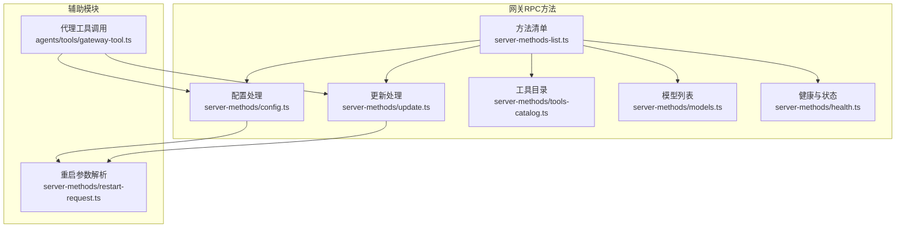
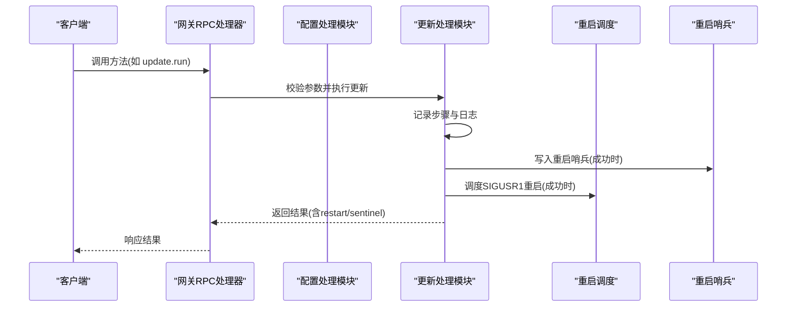
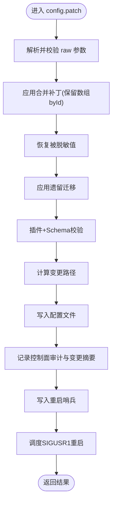
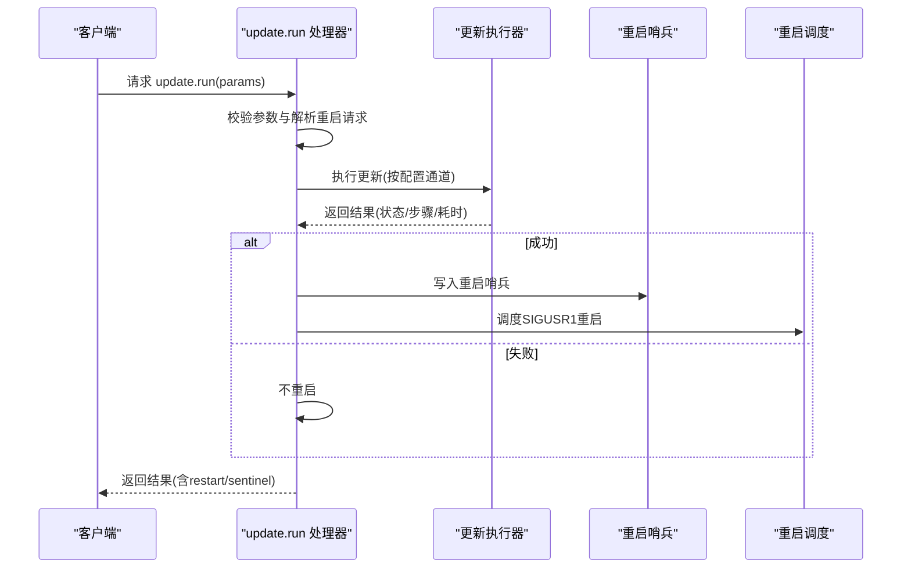
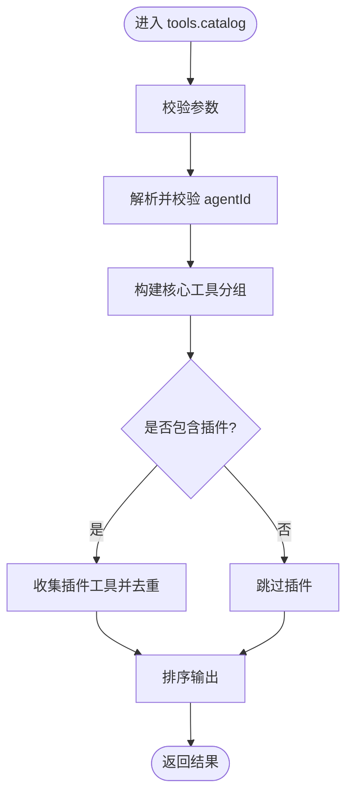
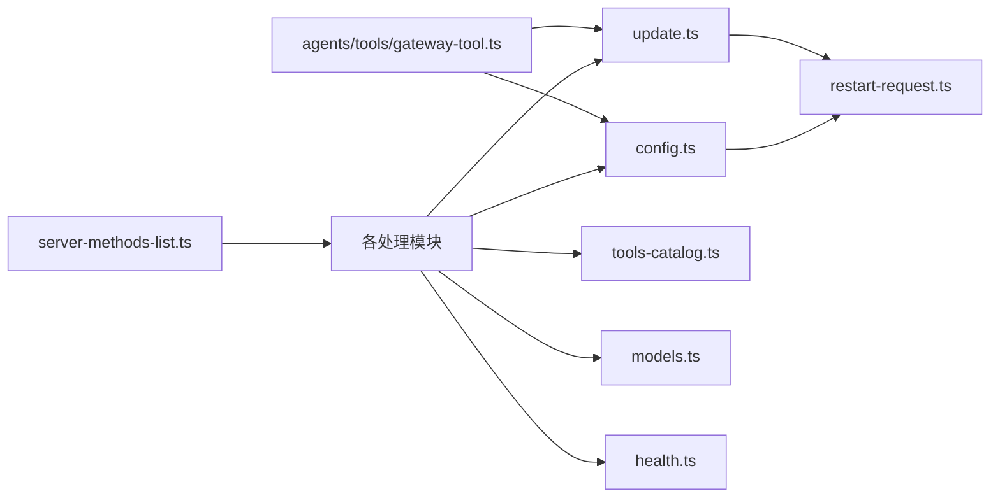

# 系统管理接口

## 目录
1. [简介](#简介)
2. [项目结构](#项目结构)
3. [核心组件](#核心组件)
4. [架构总览](#架构总览)
5. [详细组件分析](#详细组件分析)
6. [依赖关系分析](#依赖关系分析)
7. [性能考虑](#性能考虑)
8. [故障排查指南](#故障排查指南)
9. [结论](#结论)

## 简介
本文件面向OpenClaw系统管理功能的REST API（通过网关RPC方法暴露）进行完整文档化，覆盖系统配置、更新管理、工具目录、模型管理等关键能力，并补充系统监控、性能优化与故障恢复相关的API实现要点。重点接口包括：
- 配置管理：config.get、config.schema、config.schema.lookup、config.set、config.apply、config.patch
- 更新管理：update.run
- 工具目录：tools.catalog
- 模型管理：models.list
- 系统监控与状态：health、status、system-presence
- 重启与哨兵：restart相关逻辑与sentinel写入

## 项目结构
OpenClaw的系统管理API主要由网关层的方法注册与处理函数构成，配合协议校验、控制面审计、重启调度与重启哨兵写入等基础设施。

图表来源
- [src/gateway/server-methods-list.ts](file://src/gateway/server-methods-list.ts#L1-L133)
- [src/gateway/server-methods/config.ts](file://src/gateway/server-methods/config.ts#L1-L516)
- [src/gateway/server-methods/update.ts](file://src/gateway/server-methods/update.ts#L1-L135)
- [src/gateway/server-methods/tools-catalog.ts](file://src/gateway/server-methods/tools-catalog.ts#L1-L167)
- [src/gateway/server-methods/models.ts](file://src/gateway/server-methods/models.ts#L1-L40)
- [src/gateway/server-methods/health.ts](file://src/gateway/server-methods/health.ts#L1-L37)
- [src/gateway/server-methods/restart-request.ts](file://src/gateway/server-methods/restart-request.ts#L1-L21)
- [src/agents/tools/gateway-tool.ts](file://src/agents/tools/gateway-tool.ts#L35-L210)

章节来源
- [src/gateway/server-methods-list.ts](file://src/gateway/server-methods-list.ts#L1-L133)

## 核心组件
- 方法注册与事件：提供所有可用RPC方法名与事件集合，确保客户端可发现并调用。
- 配置子系统：提供配置读取、模式查询、路径查询、全量应用与补丁合并写入，并在写入后生成重启哨兵与调度重启。
- 更新子系统：执行系统更新（包或Git），记录步骤与日志，仅在成功时触发重启。
- 工具目录：聚合核心工具与插件工具，按代理维度返回工具分组与默认配置档案。
- 模型目录：基于允许模型集与默认提供者，返回当前可用模型清单。
- 健康与状态：提供健康快照与状态摘要，支持带探测刷新与缓存策略。
- 重启与审计：统一解析重启请求参数，记录控制面操作者信息，写入重启哨兵以指导重启流程。

章节来源
- [src/gateway/server-methods-list.ts](file://src/gateway/server-methods-list.ts#L107-L110)
- [src/gateway/server-methods/config.ts](file://src/gateway/server-methods/config.ts#L262-L515)
- [src/gateway/server-methods/update.ts](file://src/gateway/server-methods/update.ts#L18-L134)
- [src/gateway/server-methods/tools-catalog.ts](file://src/gateway/server-methods/tools-catalog.ts#L125-L166)
- [src/gateway/server-methods/models.ts](file://src/gateway/server-methods/models.ts#L12-L39)
- [src/gateway/server-methods/health.ts](file://src/gateway/server-methods/health.ts#L10-L36)
- [src/gateway/server-methods/restart-request.ts](file://src/gateway/server-methods/restart-request.ts#L1-L21)

## 架构总览
下图展示从客户端到网关处理函数的典型调用链，以及与重启调度、重启哨兵的关系。

图表来源
- [src/gateway/server-methods/update.ts](file://src/gateway/server-methods/update.ts#L18-L134)
- [src/gateway/server-methods/restart-request.ts](file://src/gateway/server-methods/restart-request.ts#L1-L21)

## 详细组件分析

### 配置管理接口
- config.get
  - 功能：获取当前配置快照与UI提示，返回前对敏感字段进行脱敏。
  - 参数：无
  - 返回：配置快照与UI提示
  - 错误：INVALID_REQUEST（参数无效）
- config.schema
  - 功能：构建并返回完整的配置Schema（含插件与渠道）
  - 参数：无
  - 返回：Schema对象
- config.schema.lookup
  - 功能：按路径查询Schema片段
  - 参数：path（字符串）
  - 返回：Schema片段或错误
- config.set
  - 功能：基于原始JSON5写入完整配置；需携带baseHash校验一致性
  - 参数：raw（原始配置）、baseHash、sessionKey、note、restartDelayMs
  - 返回：写入路径、脱敏后的配置
  - 错误：INVALID_REQUEST（参数/校验失败）
- config.apply
  - 功能：全量应用配置（验证+写入），随后写入重启哨兵并调度重启
  - 参数：raw、baseHash、sessionKey、note、restartDelayMs
  - 返回：ok、路径、脱敏配置、重启信息、重启哨兵
- config.patch
  - 功能：部分更新（JSON Merge Patch），合并后验证并写入，记录变更路径
  - 参数：raw（对象）、baseHash、sessionKey、note、restartDelayMs
  - 返回：ok、路径、脱敏配置、重启信息、重启哨兵

图表来源
- [src/gateway/server-methods/config.ts](file://src/gateway/server-methods/config.ts#L333-L454)

章节来源
- [src/gateway/server-methods/config.ts](file://src/gateway/server-methods/config.ts#L262-L515)

### 更新管理接口
- update.run
  - 功能：根据配置通道执行系统更新（包或Git），记录步骤、日志与耗时
  - 参数：sessionKey、note、restartDelayMs、timeoutMs（可选）
  - 行为：仅在成功时写入重启哨兵并调度重启；失败时返回错误状态但不重启
  - 返回：ok、结果详情、重启计划、重启哨兵路径与载荷

图表来源
- [src/gateway/server-methods/update.ts](file://src/gateway/server-methods/update.ts#L18-L134)

章节来源
- [src/gateway/server-methods/update.ts](file://src/gateway/server-methods/update.ts#L18-L134)

### 工具目录接口
- tools.catalog
  - 功能：返回工具分组与工具清单，支持包含插件工具；可指定agentId
  - 参数：agentId（可选）、includePlugins（默认true）
  - 返回：agentId、可用档案列表、工具分组（核心与插件）
  - 错误：INVALID_REQUEST（参数无效）；UNKNOWN_AGENT_ID（未知agent）

图表来源
- [src/gateway/server-methods/tools-catalog.ts](file://src/gateway/server-methods/tools-catalog.ts#L125-L166)

章节来源
- [src/gateway/server-methods/tools-catalog.ts](file://src/gateway/server-methods/tools-catalog.ts#L125-L166)

### 模型管理接口
- models.list
  - 功能：返回允许模型集或完整模型目录；默认提供者参与筛选
  - 参数：无
  - 返回：models数组
  - 错误：INVALID_REQUEST（参数无效）；UNAVAILABLE（加载失败）

章节来源
- [src/gateway/server-methods/models.ts](file://src/gateway/server-methods/models.ts#L12-L39)

### 系统监控与状态接口
- health
  - 功能：返回健康快照；支持带探测刷新；短时间内的调用可能命中缓存
  - 参数：probe（布尔，是否强制探测）
  - 返回：健康快照；若命中缓存，响应头会标注cached=true
  - 错误：UNAVAILABLE（刷新失败）
- status
  - 功能：返回系统状态摘要；包含敏感信息时需具备管理员范围
  - 参数：无
  - 返回：状态摘要对象
  - 权限：需要admin范围

章节来源
- [src/gateway/server-methods/health.ts](file://src/gateway/server-methods/health.ts#L10-L36)

### 重启与审计
- 重启参数解析
  - 解析sessionKey、note、restartDelayMs；对数值进行边界校验
- 控制面审计
  - 记录操作者、设备ID、客户端IP、变更路径摘要
- 重启哨兵
  - 在配置写入与更新完成后写入，用于重启后通知与诊断

章节来源
- [src/gateway/server-methods/restart-request.ts](file://src/gateway/server-methods/restart-request.ts#L1-L21)
- [src/gateway/server-methods/config.ts](file://src/gateway/server-methods/config.ts#L408-L434)
- [src/gateway/server-methods/update.ts](file://src/gateway/server-methods/update.ts#L58-L118)

## 依赖关系分析
- 方法注册与发现
  - server-methods-list.ts集中声明所有RPC方法名，动态叠加渠道插件暴露的方法
- 处理器耦合
  - config与update处理器均依赖重启参数解析、控制面审计与重启调度
  - tools.catalog依赖插件与渠道工具元数据
  - models.list依赖模型目录与允许模型集
- 代理工具集成
  - agents/tools/gateway-tool.ts将config.*、update.run等作为工具动作暴露给代理

图表来源
- [src/gateway/server-methods-list.ts](file://src/gateway/server-methods-list.ts#L107-L110)
- [src/gateway/server-methods/config.ts](file://src/gateway/server-methods/config.ts#L1-L516)
- [src/gateway/server-methods/update.ts](file://src/gateway/server-methods/update.ts#L1-L135)
- [src/gateway/server-methods/tools-catalog.ts](file://src/gateway/server-methods/tools-catalog.ts#L1-L167)
- [src/gateway/server-methods/models.ts](file://src/gateway/server-methods/models.ts#L1-L40)
- [src/gateway/server-methods/health.ts](file://src/gateway/server-methods/health.ts#L1-L37)
- [src/gateway/server-methods/restart-request.ts](file://src/gateway/server-methods/restart-request.ts#L1-L21)
- [src/agents/tools/gateway-tool.ts](file://src/agents/tools/gateway-tool.ts#L35-L210)

章节来源
- [src/gateway/server-methods-list.ts](file://src/gateway/server-methods-list.ts#L107-L110)
- [src/agents/tools/gateway-tool.ts](file://src/agents/tools/gateway-tool.ts#L35-L210)

## 性能考虑
- 健康快照缓存：health接口在短时间内复用缓存，减少探测开销；后台异步刷新
- 配置Schema构建：Schema构建涉及插件与渠道，已利用已有缓存；避免重复构建
- 更新执行：仅在成功时重启，避免失败导致的崩溃重启循环
- 重启调度：支持延迟重启与合并策略，降低频繁重启影响

## 故障排查指南
- 配置写入失败
  - 检查baseHash是否与当前快照一致；若不一致，先调用config.get重新获取并重试
  - 关注INVALID_REQUEST错误中的细节，修复配置后再尝试
- 更新失败
  - 查看返回的reason与steps日志尾部；确认通道与环境配置
  - 失败时不自动重启，需人工介入修复后再次调用
- 工具目录为空
  - 确认includePlugins参数；检查插件是否正确加载
  - 指定agentId是否存在
- 健康接口异常
  - 使用probe=true强制探测；查看后台刷新日志
  - 确认服务可达性与权限

章节来源
- [src/gateway/server-methods/config.ts](file://src/gateway/server-methods/config.ts#L57-L101)
- [src/gateway/server-methods/update.ts](file://src/gateway/server-methods/update.ts#L48-L56)
- [src/gateway/server-methods/tools-catalog.ts](file://src/gateway/server-methods/tools-catalog.ts#L126-L137)
- [src/gateway/server-methods/health.ts](file://src/gateway/server-methods/health.ts#L16-L22)

## 结论
本文档梳理了OpenClaw系统管理的核心RPC接口，明确了配置、更新、工具目录、模型管理与系统监控的调用方式与行为边界。通过统一的参数校验、控制面审计、重启哨兵与重启调度机制，系统在保证安全性的同时提供了可观测与可恢复的能力。建议在生产环境中优先使用config.apply与update.run等幂操作，并结合health/status接口进行持续监控与问题定位。