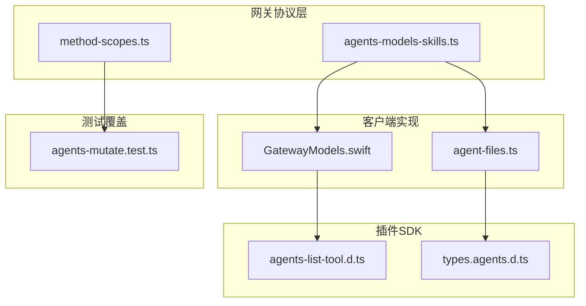
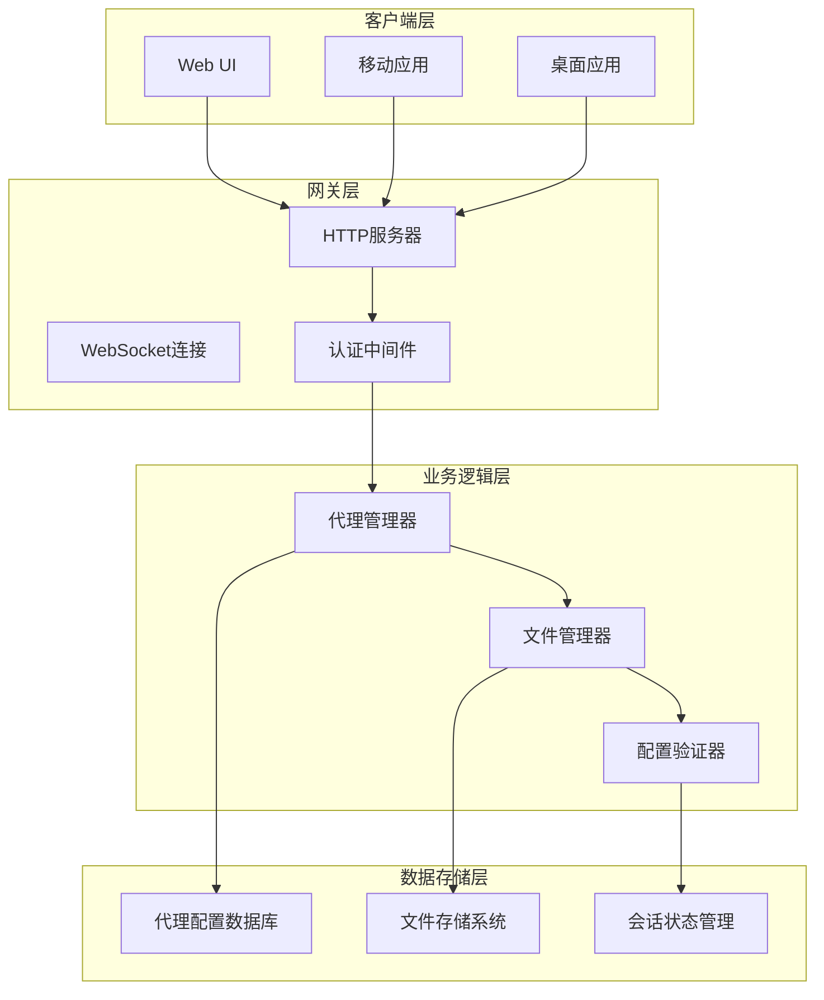
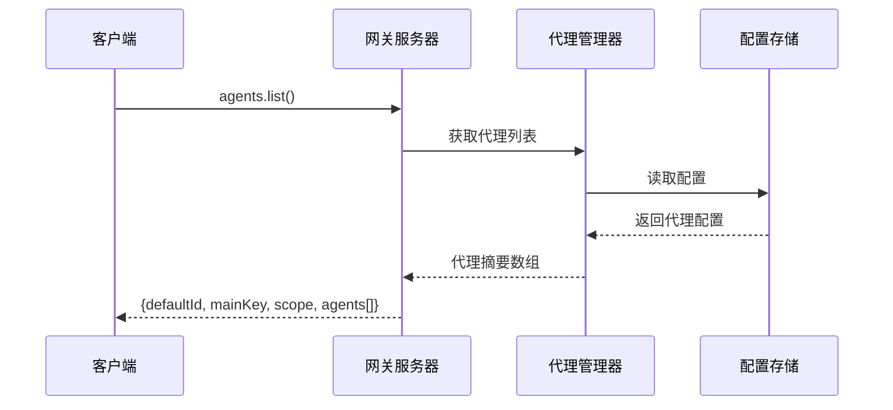
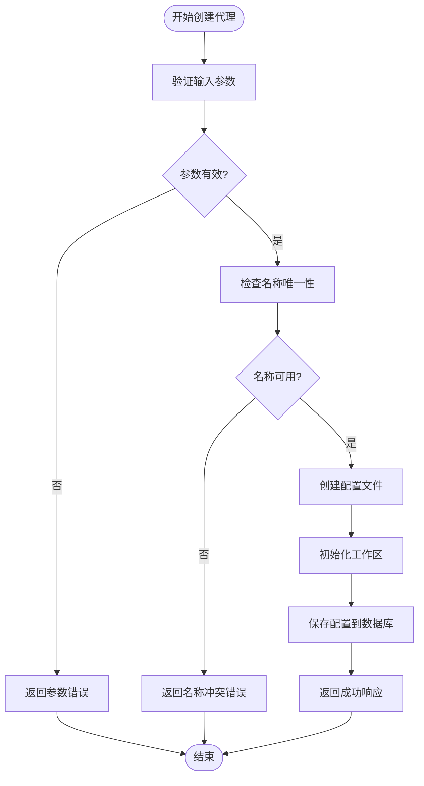
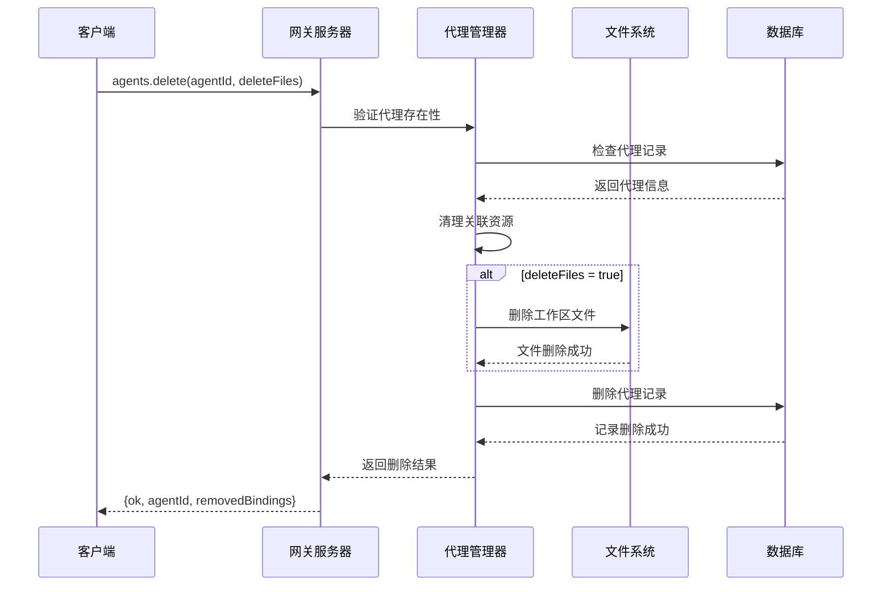
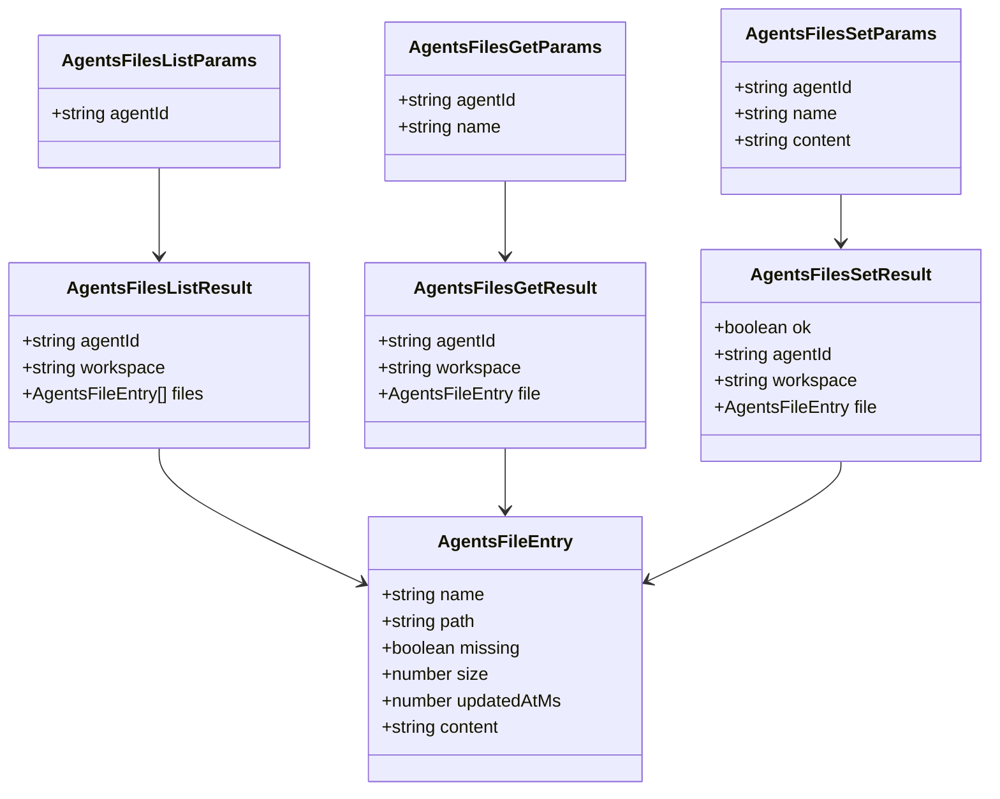
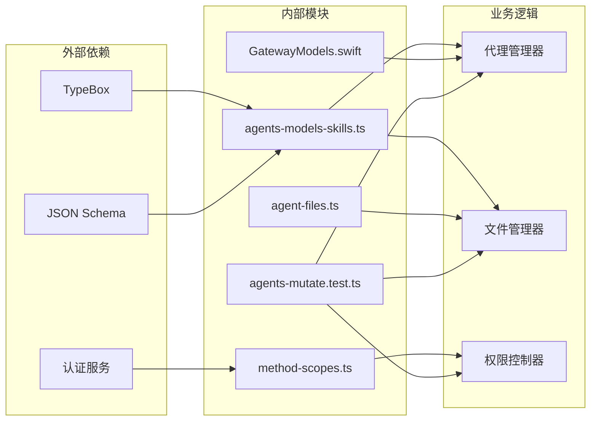

# 代理管理端点

## 目录
1. [简介](#简介)
2. [项目结构](#项目结构)
3. [核心组件](#核心组件)
4. [架构概览](#架构概览)
5. [详细组件分析](#详细组件分析)
6. [依赖关系分析](#依赖关系分析)
7. [性能考虑](#性能考虑)
8. [故障排除指南](#故障排除指南)
9. [结论](#结论)

## 简介

OpenClaw网关代理管理端点提供了一套完整的代理生命周期管理接口，包括代理列表查询、创建、更新、删除以及代理文件管理功能。这些端点支持多代理环境中的代理配置和文件管理，确保代理系统能够灵活地处理不同场景下的代理需求。

## 项目结构

代理管理端点在OpenClaw项目中的组织结构如下：

**图表来源**
- [agents-models-skills.ts](file://src/gateway/protocol/schema/agents-models-skills.ts#L1-L271)
- [method-scopes.ts](file://src/gateway/method-scopes.ts#L60-L135)

**章节来源**
- [agents-models-skills.ts](file://src/gateway/protocol/schema/agents-models-skills.ts#L1-L271)
- [method-scopes.ts](file://src/gateway/method-scopes.ts#L60-L135)

## 核心组件

代理管理端点由以下核心组件构成：

### 代理管理接口
- **agents.list**: 查询可用代理列表
- **agents.create**: 创建新代理
- **agents.update**: 更新现有代理配置
- **agents.delete**: 删除代理及其关联资源

### 文件管理接口
- **agents.files.list**: 列出代理工作区文件
- **agents.files.get**: 获取特定文件内容
- **agents.files.set**: 设置文件内容

### 数据模型
- **AgentSummary**: 代理摘要信息
- **AgentsFileEntry**: 文件条目结构
- **ModelChoice**: 模型选择配置

**章节来源**
- [agents-models-skills.ts](file://src/gateway/protocol/schema/agents-models-skills.ts#L15-L165)

## 架构概览

代理管理系统采用分层架构设计，确保了良好的模块化和可扩展性：

**图表来源**
- [agents-models-skills.ts](file://src/gateway/protocol/schema/agents-models-skills.ts#L35-L101)
- [method-scopes.ts](file://src/gateway/method-scopes.ts#L63-L130)

## 详细组件分析

### 代理生命周期管理

#### agents.list - 代理列表查询

该接口用于获取当前可用代理的完整列表，支持全局和按发送者范围的代理配置。

**请求参数:**
- 无参数

**响应结构:**
- `defaultId`: 默认代理ID
- `mainKey`: 主要代理键
- `scope`: 作用域类型（"per-sender" 或 "global"）
- `agents[]`: 代理摘要数组

**图表来源**
- [agents-models-skills.ts](file://src/gateway/protocol/schema/agents-models-skills.ts#L35-L45)
- [method-scopes.ts](file://src/gateway/method-scopes.ts#L63-L63)

#### agents.create - 代理创建

创建新的AI代理实例，支持自定义名称、工作区和外观设置。

**请求参数:**
- `name`: 代理名称（必填）
- `workspace`: 工作区标识符（必填）
- `emoji`: 表情符号（可选）
- `avatar`: 头像URL（可选）

**响应结构:**
- `ok`: 操作结果标志
- `agentId`: 新创建的代理ID
- `name`: 代理名称
- `workspace`: 工作区标识符

**图表来源**
- [agents-models-skills.ts](file://src/gateway/protocol/schema/agents-models-skills.ts#L47-L65)
- [method-scopes.ts](file://src/gateway/method-scopes.ts#L109-L109)

#### agents.update - 代理更新

更新现有代理的配置信息，支持部分字段更新。

**请求参数:**
- `agentId`: 代理ID（必填）
- `name`: 新名称（可选）
- `workspace`: 新工作区（可选）
- `model`: 新模型ID（可选）
- `avatar`: 新头像（可选）

**响应结构:**
- `ok`: 操作结果标志
- `agentId`: 更新的代理ID

**章节来源**
- [agents-models-skills.ts](file://src/gateway/protocol/schema/agents-models-skills.ts#L67-L84)
- [method-scopes.ts](file://src/gateway/method-scopes.ts#L110-L110)

#### agents.delete - 代理删除

删除指定代理及其所有关联资源，支持可选的文件清理选项。

**请求参数:**
- `agentId`: 代理ID（必填）
- `deleteFiles`: 是否删除关联文件（可选，默认false）

**响应结构:**
- `ok`: 操作结果标志
- `agentId`: 被删除的代理ID
- `removedBindings`: 移除的绑定数量

**图表来源**
- [agents-models-skills.ts](file://src/gateway/protocol/schema/agents-models-skills.ts#L86-L101)
- [method-scopes.ts](file://src/gateway/method-scopes.ts#L111-L111)

### 文件管理组件

#### agents.files.list - 文件列表查询

列出指定代理工作区中的所有文件。

**请求参数:**
- `agentId`: 代理ID（必填）

**响应结构:**
- `agentId`: 代理ID
- `workspace`: 工作区标识符
- `files[]`: 文件条目数组

#### agents.files.get - 文件获取

获取指定文件的内容和元数据。

**请求参数:**
- `agentId`: 代理ID（必填）
- `name`: 文件名（必填）

**响应结构:**
- `agentId`: 代理ID
- `workspace`: 工作区标识符
- `file`: 文件条目对象

#### agents.files.set - 文件设置

设置或更新文件内容。

**请求参数:**
- `agentId`: 代理ID（必填）
- `name`: 文件名（必填）
- `content`: 文件内容（必填）

**响应结构:**
- `ok`: 操作结果标志
- `agentId`: 代理ID
- `workspace`: 工作区标识符
- `file`: 更新后的文件条目

**图表来源**
- [agents-models-skills.ts](file://src/gateway/protocol/schema/agents-models-skills.ts#L103-L165)

**章节来源**
- [agents-models-skills.ts](file://src/gateway/protocol/schema/agents-models-skills.ts#L115-L165)

### 数据模型定义

#### AgentSummary - 代理摘要

代理的基本信息结构，用于列表显示和快速访问。

**字段说明:**
- `id`: 唯一代理标识符
- `name`: 代理显示名称（可选）
- `identity`: 代理身份信息（可选）
  - `name`: 身份名称
  - `theme`: 主题颜色
  - `emoji`: 身份表情
  - `avatar`: 头像路径
  - `avatarUrl`: 头像URL

#### ModelChoice - 模型选择

模型配置的数据结构，支持上下文窗口大小和推理能力设置。

**字段说明:**
- `id`: 模型唯一标识符
- `name`: 模型显示名称
- `provider`: 模型提供商
- `contextWindow`: 上下文窗口大小（可选）
- `reasoning`: 是否支持推理（可选）

**章节来源**
- [agents-models-skills.ts](file://src/gateway/protocol/schema/agents-models-skills.ts#L15-L33)
- [agents-models-skills.ts](file://src/gateway/protocol/schema/agents-models-skills.ts#L4-L13)

## 依赖关系分析

代理管理端点的依赖关系体现了清晰的分层架构：

**图表来源**
- [agents-models-skills.ts](file://src/gateway/protocol/schema/agents-models-skills.ts#L1-L3)
- [method-scopes.ts](file://src/gateway/method-scopes.ts#L60-L135)

**章节来源**
- [method-scopes.ts](file://src/gateway/method-scopes.ts#L63-L130)
- [agents-mutate.test.ts](file://src/gateway/server-methods/agents-mutate.test.ts#L196-L377)

## 性能考虑

代理管理系统的性能优化策略包括：

### 缓存机制
- 代理配置缓存：减少频繁的数据库查询
- 文件内容缓存：避免重复读取相同文件
- 结果集缓存：对常用查询结果进行缓存

### 异步处理
- 文件I/O操作异步化
- 批量操作支持
- 连接池管理

### 资源管理
- 内存使用优化
- 文件句柄管理
- 数据库连接复用

## 故障排除指南

### 常见问题及解决方案

#### 代理创建失败
**症状:** agents.create返回参数错误
**可能原因:**
- 缺少必需参数
- 代理名称已存在
- 工作区权限不足

**解决步骤:**
1. 验证所有必需参数是否提供
2. 检查代理名称唯一性
3. 确认工作区访问权限

#### 文件操作异常
**症状:** agents.files.get/set返回文件不存在
**可能原因:**
- 文件路径不正确
- 权限不足
- 文件已被删除

**解决步骤:**
1. 验证文件名和路径
2. 检查代理工作区权限
3. 确认文件存在状态

#### 权限错误
**症状:** 操作被拒绝
**可能原因:**
- 认证令牌过期
- 用户权限不足
- 代理所有权验证失败

**解决步骤:**
1. 刷新认证令牌
2. 检查用户角色权限
3. 验证代理归属关系

**章节来源**
- [agents-mutate.test.ts](file://src/gateway/server-methods/agents-mutate.test.ts#L196-L377)

## 结论

OpenClaw网关代理管理端点提供了一个完整、安全且高效的代理生命周期管理解决方案。通过清晰的API设计、严格的参数验证和完善的权限控制，系统能够支持复杂的多代理应用场景。

关键特性包括：
- **完整的代理生命周期管理**：从创建到删除的全链路支持
- **灵活的文件管理**：支持代理工作区内的文件操作
- **强大的权限控制**：基于作用域和认证的细粒度访问控制
- **可扩展的架构**：模块化的组件设计便于功能扩展

该系统为开发者提供了可靠的代理管理基础设施，支持各种AI代理应用的部署和运维需求。