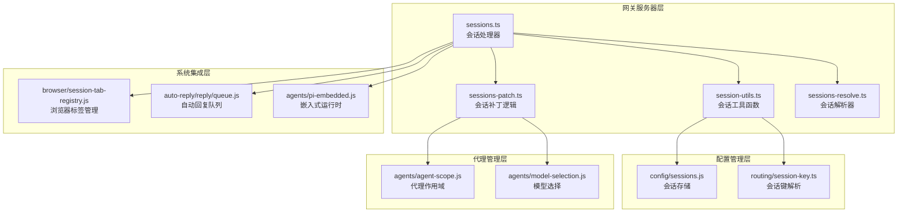
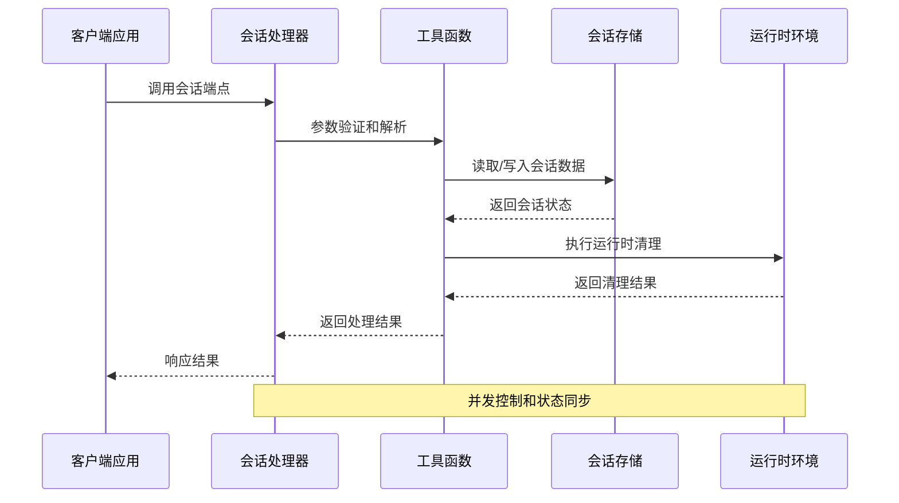
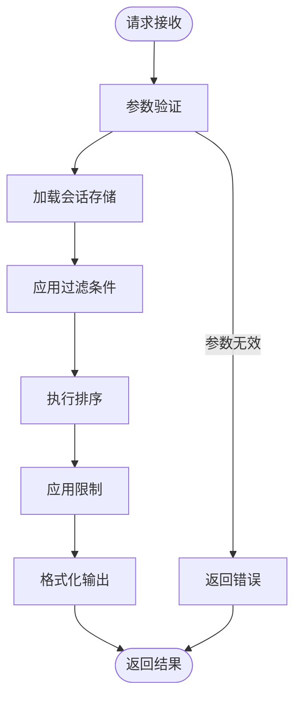
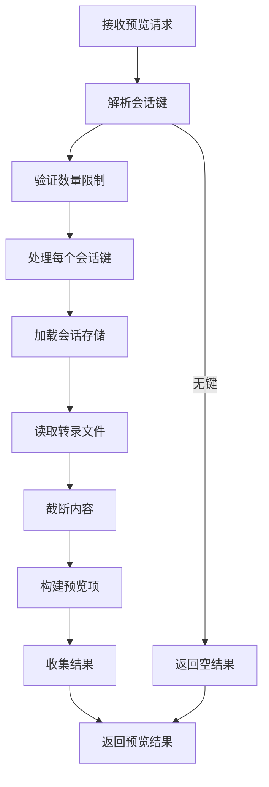
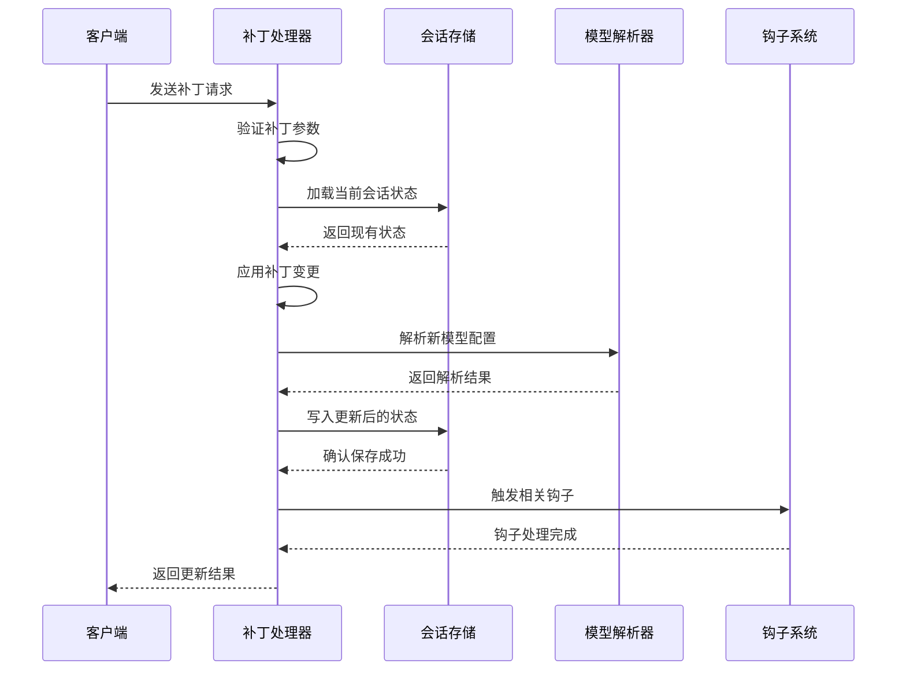
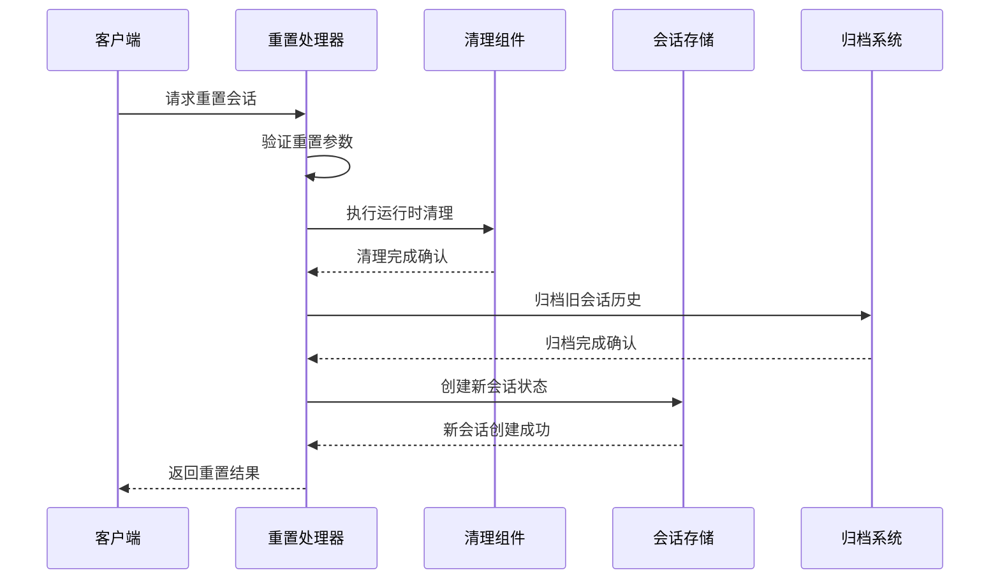
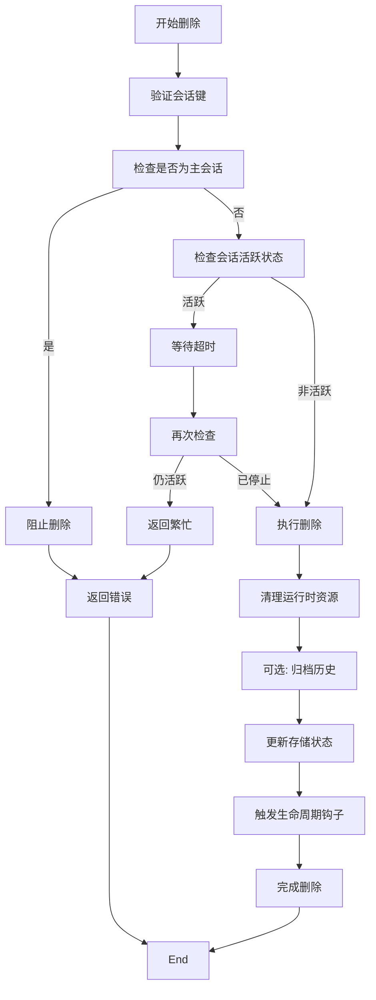
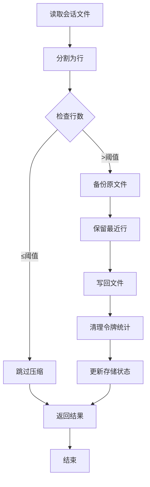
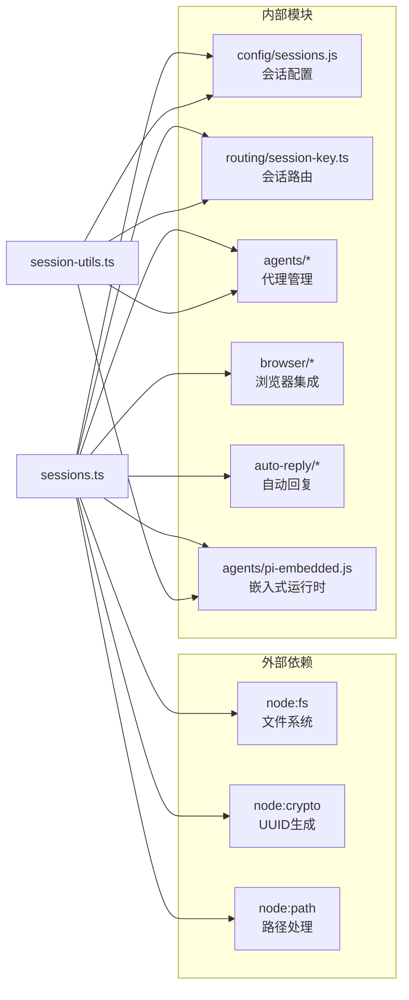

# 会话管理端点

## 目录
1. [简介](#简介)
2. [项目结构](#项目结构)
3. [核心组件](#核心组件)
4. [架构概览](#架构概览)
5. [详细组件分析](#详细组件分析)
6. [依赖关系分析](#依赖关系分析)
7. [性能考虑](#性能考虑)
8. [故障排除指南](#故障排除指南)
9. [结论](#结论)

## 简介

OpenClaw网关的会话管理端点提供了完整的会话生命周期管理能力，包括会话列表查询、预览、补丁更新、重置、删除和压缩等核心功能。这些端点支持多代理环境下的会话状态管理、历史记录处理和会话清理，确保系统在复杂场景下的稳定运行。

## 项目结构

会话管理功能主要分布在以下关键模块中：

**图表来源**
- [src/gateway/server-methods/sessions.ts](file://src/gateway/server-methods/sessions.ts#L1-L755)
- [src/gateway/session-utils.ts](file://src/gateway/session-utils.ts#L1-L200)

**章节来源**
- [src/gateway/server-methods/sessions.ts](file://src/gateway/server-methods/sessions.ts#L1-L755)
- [src/gateway/session-utils.ts](file://src/gateway/session-utils.ts#L1-L200)

## 核心组件

### 会话处理器 (sessionsHandlers)

会话处理器是所有会话管理端点的核心实现，提供以下主要功能：

- **会话列表查询**: 支持按多种条件过滤和排序会话
- **会话预览**: 快速获取会话摘要信息
- **会话补丁更新**: 动态修改会话配置
- **会话重置**: 创建新的会话实例
- **会话删除**: 彻底移除会话及其历史记录
- **会话压缩**: 清理和优化会话历史文件

每个处理器都包含完整的参数验证、错误处理和状态同步机制。

**章节来源**
- [src/gateway/server-methods/sessions.ts](file://src/gateway/server-methods/sessions.ts#L331-L755)

### 会话工具函数

会话工具函数提供了底层的会话操作支持：

- **会话存储管理**: 读取、写入和清理会话数据
- **会话键解析**: 将用户输入转换为标准会话标识符
- **会话状态迁移**: 处理会话格式升级和兼容性
- **会话历史处理**: 管理会话消息历史和预览

**章节来源**
- [src/gateway/session-utils.ts](file://src/gateway/session-utils.ts#L1-L400)

## 架构概览

会话管理系统采用分层架构设计，确保各层职责清晰分离：

**图表来源**
- [src/gateway/server-methods/sessions.ts](file://src/gateway/server-methods/sessions.ts#L423-L465)
- [src/gateway/session-utils.ts](file://src/gateway/session-utils.ts#L178-L188)

## 详细组件分析

### sessions.list - 会话列表查询

会话列表端点提供灵活的会话发现和筛选能力：

#### 功能特性
- **多维度过滤**: 支持按代理、通道、聊天类型等条件筛选
- **智能排序**: 按最后活动时间、创建时间等排序
- **状态聚合**: 提供会话统计和状态汇总
- **默认值支持**: 自动填充缺失的会话配置

#### 数据流图

**图表来源**
- [src/gateway/server-methods/sessions.ts](file://src/gateway/server-methods/sessions.ts#L332-L346)

**章节来源**
- [src/gateway/server-methods/sessions.ts](file://src/gateway/server-methods/sessions.ts#L332-L346)

### sessions.preview - 会话预览

会话预览端点提供快速的会话摘要信息获取：

#### 核心功能
- **批量预览**: 支持同时预览多个会话
- **智能截断**: 自动截断过长的消息内容
- **状态报告**: 提供会话存在性检查
- **性能优化**: 使用缓存减少重复读取

#### 预览流程

**图表来源**
- [src/gateway/server-methods/sessions.ts](file://src/gateway/server-methods/sessions.ts#L347-L408)

**章节来源**
- [src/gateway/server-methods/sessions.ts](file://src/gateway/server-methods/sessions.ts#L347-L408)

### sessions.patch - 会话补丁更新

会话补丁端点提供细粒度的会话配置修改能力：

#### 支持的修改字段
- **模型配置**: 切换AI模型和提供商
- **行为设置**: 调整思考深度、详细程度
- **发送策略**: 配置消息发送规则
- **元数据**: 更新显示名称、标签等

#### 补丁应用流程

**图表来源**
- [src/gateway/server-methods/sessions.ts](file://src/gateway/server-methods/sessions.ts#L423-L465)
- [src/gateway/sessions-patch.ts](file://src/gateway/sessions-patch.ts)

**章节来源**
- [src/gateway/server-methods/sessions.ts](file://src/gateway/server-methods/sessions.ts#L423-L465)

### sessions.reset - 会话重置

会话重置端点创建全新的会话实例，同时保留重要的配置信息：

#### 重置策略
- **状态迁移**: 保留思考级别、详细程度等配置
- **令牌重置**: 清除使用计数，避免累积
- **历史归档**: 安全地移动旧历史到归档位置
- **运行时清理**: 终止活跃的会话相关进程

#### 重置序列图

**图表来源**
- [src/gateway/server-methods/sessions.ts](file://src/gateway/server-methods/sessions.ts#L466-L558)

**章节来源**
- [src/gateway/server-methods/sessions.ts](file://src/gateway/server-methods/sessions.ts#L466-L558)

### sessions.delete - 会话删除

会话删除端点提供安全的会话移除能力：

#### 删除保护机制
- **主会话保护**: 防止删除主会话键
- **运行时检测**: 确保会话不再活跃
- **历史清理**: 可选的历史文件删除
- **资源回收**: 关闭相关浏览器标签

#### 删除流程

**图表来源**
- [src/gateway/server-methods/sessions.ts](file://src/gateway/server-methods/sessions.ts#L559-L629)

**章节来源**
- [src/gateway/server-methods/sessions.ts](file://src/gateway/server-methods/sessions.ts#L559-L629)

### sessions.compact - 会话压缩

会话压缩端点优化大体积会话历史文件：

#### 压缩策略
- **行数限制**: 基于最大行数的智能截断
- **文件备份**: 压缩前自动创建备份
- **令牌信息清理**: 移除历史令牌使用统计
- **状态更新**: 同步更新会话存储状态

#### 压缩算法

**图表来源**
- [src/gateway/server-methods/sessions.ts](file://src/gateway/server-methods/sessions.ts#L652-L753)

**章节来源**
- [src/gateway/server-methods/sessions.ts](file://src/gateway/server-methods/sessions.ts#L652-L753)

## 依赖关系分析

会话管理系统涉及多个关键依赖关系：

**图表来源**
- [src/gateway/server-methods/sessions.ts](file://src/gateway/server-methods/sessions.ts#L1-L58)
- [src/gateway/session-utils.ts](file://src/gateway/session-utils.ts#L1-L47)

**章节来源**
- [src/gateway/server-methods/sessions.ts](file://src/gateway/server-methods/sessions.ts#L1-L58)
- [src/gateway/session-utils.ts](file://src/gateway/session-utils.ts#L1-L47)

## 性能考虑

### 并发控制策略

会话管理系统实现了多层次的并发控制：

- **会话级锁**: 确保同一会话的并发操作串行化
- **存储访问控制**: 使用原子操作保证数据一致性
- **运行时清理**: 在修改前终止可能的竞态条件

### 缓存优化

- **存储缓存**: 避免重复的文件系统访问
- **解析缓存**: 缓存会话键解析结果
- **模型解析缓存**: 减少模型配置解析开销

### 内存管理

- **流式处理**: 大文件处理时使用流式读取
- **及时释放**: 确保临时对象及时垃圾回收
- **批量操作**: 支持批量会话操作以提高效率

## 故障排除指南

### 常见问题及解决方案

#### 会话删除失败
**症状**: 删除请求返回"会话仍活跃"错误
**原因**: 会话仍在运行或有活跃的子进程
**解决**: 等待会话自然结束或强制清理

#### 会话重置异常
**症状**: 重置后会话状态不正确
**原因**: 运行时清理未完成或存储写入失败
**解决**: 检查系统日志，重新执行重置操作

#### 预览功能失效
**症状**: 预览返回空结果或错误
**原因**: 会话不存在或转录文件损坏
**解决**: 验证会话键正确性和文件完整性

**章节来源**
- [src/gateway/server-methods/sessions.ts](file://src/gateway/server-methods/sessions.ts#L211-L227)
- [src/gateway/server-methods/sessions.ts](file://src/gateway/server-methods/sessions.ts#L268-L303)

## 结论

OpenClaw网关的会话管理端点提供了完整、可靠且高性能的会话生命周期管理能力。通过精心设计的架构和严格的错误处理机制，系统能够在复杂的多代理环境中保持会话状态的一致性和可靠性。各个端点之间的协调配合确保了从会话创建到销毁的整个过程都能得到妥善处理。