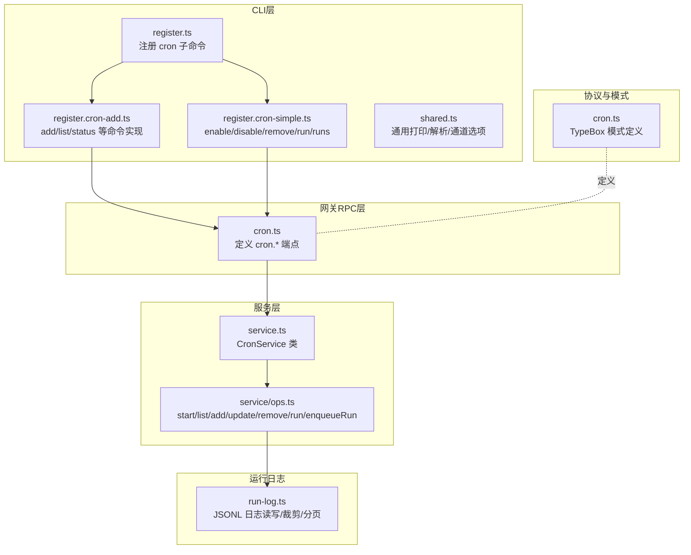
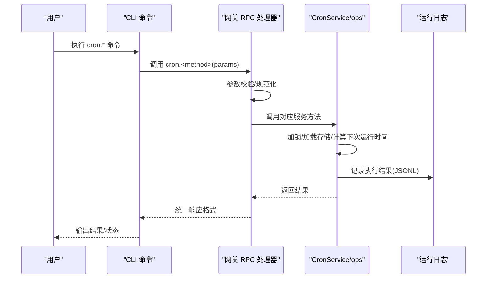
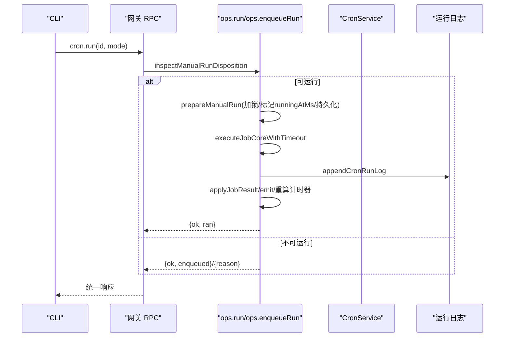
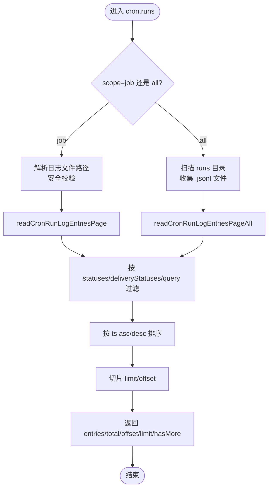
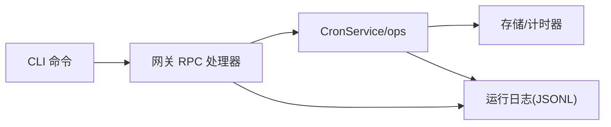

# 定时任务端点

## 目录
1. [简介](#简介)
2. [项目结构](#项目结构)
3. [核心组件](#核心组件)
4. [架构总览](#架构总览)
5. [详细组件分析](#详细组件分析)
6. [依赖关系分析](#依赖关系分析)
7. [性能考量](#性能考量)
8. [故障排查指南](#故障排查指南)
9. [结论](#结论)

## 简介
本文件面向 OpenClaw 网关的定时任务（cron）相关 API，系统性梳理并说明以下端点的行为与数据流：cron.list、cron.status、cron.add、cron.update、cron.remove、cron.run、cron.runs。内容覆盖任务调度、执行状态、运行历史记录、性能监控、任务编排、错误处理与资源限制等技术实现，并提供可视化图示帮助理解端到端流程。

## 项目结构
围绕定时任务的端点与实现主要分布在如下模块：
- 网关 RPC 层：定义并实现 cron.* 端点，负责参数校验、调用上下文与响应封装
- 协议与模式：定义请求/响应结构、枚举值与字段约束
- CLI 层：提供 cron 子命令，将用户输入转换为网关 RPC 调用
- 服务层：封装调度器核心逻辑（启动、停止、增删改查、手动触发）
- 运行日志：以 JSONL 文件持久化运行结果，支持分页查询与裁剪

图表来源
- [src/gateway/server-methods/cron.ts](file://src/gateway/server-methods/cron.ts#L1-L304)
- [src/gateway/protocol/schema/cron.ts](file://src/gateway/protocol/schema/cron.ts#L1-L371)
- [src/cli/cron-cli/register.ts](file://src/cli/cron-cli/register.ts#L1-L28)
- [src/cli/cron-cli/register.cron-add.ts](file://src/cli/cron-cli/register.cron-add.ts#L1-L283)
- [src/cli/cron-cli/register.cron-simple.ts](file://src/cli/cron-cli/register.cron-simple.ts#L1-L110)
- [src/cli/cron-cli/shared.ts](file://src/cli/cron-cli/shared.ts#L1-L274)
- [src/cron/service.ts](file://src/cron/service.ts#L1-L61)
- [src/cron/service/ops.ts](file://src/cron/service/ops.ts#L1-L570)
- [src/cron/run-log.ts](file://src/cron/run-log.ts#L1-L455)

章节来源
- [src/gateway/server-methods/cron.ts](file://src/gateway/server-methods/cron.ts#L1-L304)
- [src/gateway/protocol/schema/cron.ts](file://src/gateway/protocol/schema/cron.ts#L1-L371)
- [src/cli/cron-cli/register.ts](file://src/cli/cron-cli/register.ts#L1-L28)
- [src/cli/cron-cli/register.cron-add.ts](file://src/cli/cron-cli/register.cron-add.ts#L1-L283)
- [src/cli/cron-cli/register.cron-simple.ts](file://src/cli/cron-cli/register.cron-simple.ts#L1-L110)
- [src/cli/cron-cli/shared.ts](file://src/cli/cron-cli/shared.ts#L1-L274)
- [src/cron/service.ts](file://src/cron/service.ts#L1-L61)
- [src/cron/service/ops.ts](file://src/cron/service/ops.ts#L1-L570)
- [src/cron/run-log.ts](file://src/cron/run-log.ts#L1-L455)

## 核心组件
- 网关 RPC 处理器：在 cron.ts 中集中实现所有 cron.* 端点，统一进行参数校验、调用 CronService 并返回标准响应
- 协议与模式：使用 TypeBox 定义请求/响应结构、枚举与字段约束，确保前后端一致
- CLI 命令：register.cron-add.ts 与 register.cron-simple.ts 提供 add/list/status/run/runs 等命令，将用户输入映射为 RPC 参数
- 服务层：service.ts 暴露 CronService 类；ops.ts 实现启动、停止、列表、分页、新增、更新、删除、手动运行、入队运行等核心逻辑
- 运行日志：run-log.ts 将每次执行结果以 JSONL 写入独立文件，支持按作业或全量分页查询、裁剪与安全权限设置

章节来源
- [src/gateway/server-methods/cron.ts](file://src/gateway/server-methods/cron.ts#L24-L304)
- [src/gateway/protocol/schema/cron.ts](file://src/gateway/protocol/schema/cron.ts#L1-L371)
- [src/cli/cron-cli/register.cron-add.ts](file://src/cli/cron-cli/register.cron-add.ts#L61-L283)
- [src/cli/cron-cli/register.cron-simple.ts](file://src/cli/cron-cli/register.cron-simple.ts#L32-L110)
- [src/cron/service.ts](file://src/cron/service.ts#L7-L61)
- [src/cron/service/ops.ts](file://src/cron/service/ops.ts#L92-L131)
- [src/cron/run-log.ts](file://src/cron/run-log.ts#L138-L169)

## 架构总览
下图展示从 CLI 到网关 RPC、再到服务层与运行日志的完整调用链路与职责边界：

图表来源
- [src/cli/cron-cli/register.cron-add.ts](file://src/cli/cron-cli/register.cron-add.ts#L99-L280)
- [src/cli/cron-cli/register.cron-simple.ts](file://src/cli/cron-cli/register.cron-simple.ts#L64-L108)
- [src/gateway/server-methods/cron.ts](file://src/gateway/server-methods/cron.ts#L44-L302)
- [src/cron/service/ops.ts](file://src/cron/service/ops.ts#L236-L268)
- [src/cron/run-log.ts](file://src/cron/run-log.ts#L138-L169)

## 详细组件分析

### 端点：cron.status
- 功能：返回网关定时任务调度器的状态信息，包括是否启用、存储路径、作业总数、下次唤醒时间等
- 入参：无
- 出参：包含 enabled、storePath、jobs、nextWakeAtMs 的对象
- 关键行为：
  - 通过 CronService.status 获取状态
  - 若调度器未启用，则 nextWakeAtMs 为 null
- 错误处理：内部异常会被上层统一捕获并返回标准错误结构

章节来源
- [src/gateway/server-methods/cron.ts](file://src/gateway/server-methods/cron.ts#L76-L89)
- [src/cron/service/ops.ts](file://src/cron/service/ops.ts#L137-L146)

### 端点：cron.list
- 功能：分页列出定时任务，支持过滤（是否包含禁用）、查询、排序与限制数量
- 入参：
  - includeDisabled：是否包含禁用任务
  - limit/offset：分页参数
  - query：关键词搜索
  - enabled：all/enabled/disabled
  - sortBy：nextRunAtMs/updatedAtMs/name
  - sortDir：asc/desc
- 出参：jobs 数组与分页元信息（total/offset/limit/hasMore/nextOffset）
- 关键行为：
  - 使用 CronService.listPage 实现分页、过滤与排序
  - 默认 limit 为全部或 50（空集时）
  - limit 最大 200
- 错误处理：参数校验失败返回 INVALID_REQUEST

章节来源
- [src/gateway/server-methods/cron.ts](file://src/gateway/server-methods/cron.ts#L44-L74)
- [src/cron/service/ops.ts](file://src/cron/service/ops.ts#L197-L234)

### 端点：cron.add
- 功能：新增一个定时任务
- 入参：名称、描述、是否启用、删除策略、会话目标、唤醒模式、调度、负载（systemEvent 或 agentTurn）、交付方式、失败告警等
- 出参：新增任务的完整信息
- 关键行为：
  - 先进行参数规范化（normalizeCronJobCreate），再进行严格校验
  - 校验调度时间戳合法性（validateScheduleTimestamp）
  - 创建后重新计算下次运行时间并持久化，同时更新计时器
- 错误处理：参数非法返回 INVALID_REQUEST；调度时间戳非法返回 INVALID_REQUEST；内部异常统一包装

章节来源
- [src/gateway/server-methods/cron.ts](file://src/gateway/server-methods/cron.ts#L91-L116)
- [src/gateway/protocol/schema/cron.ts](file://src/gateway/protocol/schema/cron.ts#L279-L291)
- [src/cron/service/ops.ts](file://src/cron/service/ops.ts#L236-L268)

### 端点：cron.update
- 功能：更新现有任务的部分字段
- 入参：id/jobId + patch（名称、描述、启用、删除策略、调度、会话目标、唤醒模式、负载、交付、失败告警、状态等）
- 出参：更新后的任务
- 关键行为：
  - 规范化补丁（normalizeCronJobPatch）
  - 校验补丁参数与调度时间戳
  - 更新后修复 nextRunAtMs（若缺失或不合法），并重算计时器
- 错误处理：参数非法返回 INVALID_REQUEST；调度时间戳非法返回 INVALID_REQUEST

章节来源
- [src/gateway/server-methods/cron.ts](file://src/gateway/server-methods/cron.ts#L118-L163)
- [src/gateway/protocol/schema/cron.ts](file://src/gateway/protocol/schema/cron.ts#L293-L310)
- [src/cron/service/ops.ts](file://src/cron/service/ops.ts#L271-L322)

### 端点：cron.remove
- 功能：删除指定任务
- 入参：id/jobId
- 出参：&#123; ok, removed &#125;
- 关键行为：
  - 删除后重算计时器并持久化
- 错误处理：参数非法返回 INVALID_REQUEST

章节来源
- [src/gateway/server-methods/cron.ts](file://src/gateway/server-methods/cron.ts#L165-L191)
- [src/gateway/protocol/schema/cron.ts](file://src/gateway/protocol/schema/cron.ts#L312-L312)
- [src/cron/service/ops.ts](file://src/cron/service/ops.ts#L325-L341)

### 端点：cron.run
- 功能：手动触发一次任务执行（调试用途）
- 入参：id/jobId + mode（due/force）
- 出参：&#123; ok, ran/enqueued &#125; 及运行标识
- 关键行为：
  - 支持两种模式：
    - due：仅在“到期”时执行
    - force：强制执行（即使未到期）
  - 首先检查可运行性（避免并发重复执行），然后在锁内保留 runningAtMs 标记并持久化
  - 执行完成后应用结果、发出事件、必要时删除一次性任务、重算计时器
- 错误处理：参数非法返回 INVALID_REQUEST；已运行或未到期返回相应原因

章节来源
- [src/gateway/server-methods/cron.ts](file://src/gateway/server-methods/cron.ts#L193-L216)
- [src/gateway/protocol/schema/cron.ts](file://src/gateway/protocol/schema/cron.ts#L314-L316)
- [src/cron/service/ops.ts](file://src/cron/service/ops.ts#L365-L525)

### 端点：cron.runs
- 功能：查询任务运行历史（支持按作业或全量）
- 入参：
  - scope：job/all（默认根据是否提供 id 推断）
  - id/jobId：当 scope=job 时必填
  - limit/offset：分页
  - statuses/deliveryStatuses：过滤状态
  - query：全文检索
  - sortDir：asc/desc
- 出参：entries 数组与分页元信息
- 关键行为：
  - scope=all：遍历 runs 目录下所有 JSONL 文件，聚合并排序
  - scope=job：定位到特定作业的日志文件，读取并分页
  - 对日志文件路径进行安全校验，防止路径穿越
- 错误处理：参数非法返回 INVALID_REQUEST；无效 id 抛出错误

章节来源
- [src/gateway/server-methods/cron.ts](file://src/gateway/server-methods/cron.ts#L218-L301)
- [src/gateway/protocol/schema/cron.ts](file://src/gateway/protocol/schema/cron.ts#L318-L335)
- [src/cron/run-log.ts](file://src/cron/run-log.ts#L64-L74)
- [src/cron/run-log.ts](file://src/cron/run-log.ts#L390-L454)

### CLI 命令与参数映射
- cron status：调用 cron.status，输出 JSON 或人类可读格式
- cron list：调用 cron.list，支持 --all 与 --json
- cron add：调用 cron.add，解析多种调度与负载参数，校验互斥与组合约束
- cron enable/disable/remove/run/runs：调用对应 cron.* 端点，run 命令默认超时提升至 600000ms

章节来源
- [src/cli/cron-cli/register.ts](file://src/cli/cron-cli/register.ts#L12-L27)
- [src/cli/cron-cli/register.cron-add.ts](file://src/cli/cron-cli/register.cron-add.ts#L19-L58)
- [src/cli/cron-cli/register.cron-add.ts](file://src/cli/cron-cli/register.cron-add.ts#L61-L283)
- [src/cli/cron-cli/register.cron-simple.ts](file://src/cli/cron-cli/register.cron-simple.ts#L32-L110)
- [src/cli/cron-cli/shared.ts](file://src/cli/cron-cli/shared.ts#L24-L46)

### 数据模型与协议
- 任务结构：包含 id、name、description、enabled、deleteAfterRun、createdAtMs、updatedAtMs、schedule、sessionTarget、wakeMode、payload、delivery、failureAlert、state 等
- 调度类型：at（一次性）、every（固定间隔）、cron（Cron 表达式，支持时区与抖动窗口）
- 运行状态：ok/error/skipped；交付状态：delivered/not-delivered/unknown/not-requested
- 运行日志条目：包含 ts、jobId、action、status、error、summary、delivered、deliveryStatus、sessionId、sessionKey、runAtMs、durationMs、nextRunAtMs、telemetry 等

章节来源
- [src/gateway/protocol/schema/cron.ts](file://src/gateway/protocol/schema/cron.ts#L242-L262)
- [src/gateway/protocol/schema/cron.ts](file://src/gateway/protocol/schema/cron.ts#L101-L126)
- [src/gateway/protocol/schema/cron.ts](file://src/gateway/protocol/schema/cron.ts#L337-L370)
- [src/cron/types.ts](file://src/cron/types.ts#L5-L160)

### 手动运行流程（序列图）

图表来源
- [src/gateway/server-methods/cron.ts](file://src/gateway/server-methods/cron.ts#L193-L216)
- [src/cron/service/ops.ts](file://src/cron/service/ops.ts#L365-L525)
- [src/cron/run-log.ts](file://src/cron/run-log.ts#L138-L169)

### 分页与过滤流程（流程图）

图表来源
- [src/gateway/server-methods/cron.ts](file://src/gateway/server-methods/cron.ts#L218-L301)
- [src/cron/run-log.ts](file://src/cron/run-log.ts#L354-L388)
- [src/cron/run-log.ts](file://src/cron/run-log.ts#L390-L454)

## 依赖关系分析
- 网关 RPC 处理器依赖：
  - 参数校验与错误包装（validate*/errorShape）
  - CronService 方法（listPage/status/add/update/remove/enqueueRun）
  - 运行日志读写（readCronRunLogEntriesPage/All、resolveCronRunLogPath）
- CLI 依赖：
  - 命令注册与选项解析
  - 与网关 RPC 交互（callGatewayFromCli）
  - 人类可读输出与警告提示
- 服务层依赖：
  - 加锁（locked）保证并发安全
  - 存储加载/持久化（ensureLoaded/persist）
  - 计时器管理（armTimer/stopTimer/runMissedJobs）
  - 事件发射（emit）
- 运行日志依赖：
  - JSONL 文件写入与裁剪
  - 权限控制（文件/目录 chmod 0700/0600）

图表来源
- [src/gateway/server-methods/cron.ts](file://src/gateway/server-methods/cron.ts#L1-L304)
- [src/cron/service/ops.ts](file://src/cron/service/ops.ts#L1-L570)
- [src/cron/run-log.ts](file://src/cron/run-log.ts#L1-L455)

章节来源
- [src/gateway/server-methods/cron.ts](file://src/gateway/server-methods/cron.ts#L1-L304)
- [src/cron/service/ops.ts](file://src/cron/service/ops.ts#L1-L570)
- [src/cron/run-log.ts](file://src/cron/run-log.ts#L1-L455)

## 性能考量
- 并发与锁：所有写操作均通过 locked 包裹，避免竞态；手动运行采用“先加锁标记 runningAtMs 再释放锁执行”的策略，确保一致性
- 计时器优化：启动时清理异常 runningAtMs 标记，运行错过的周期；重算 nextRunAtMs 后再 armTimer，减少重复触发
- IO 与日志：
  - JSONL 写入采用去重 pending 写入队列，避免并发冲突
  - 支持按字节上限与保留行数裁剪，防止磁盘膨胀
  - 文件权限严格设置（目录 0700、文件 0600），保障安全性
- 分页与查询：
  - runs 查询对每个文件进行去重写入等待，保证读取一致性
  - 支持 statuses/deliveryStatuses/query 精确过滤，降低内存占用
- 资源限制：
  - CLI run 命令默认超时提升至 600000ms，避免短超时导致的误判
  - runs 查询 limit 最大 200，避免过大分页造成阻塞

章节来源
- [src/cron/service/ops.ts](file://src/cron/service/ops.ts#L92-L131)
- [src/cron/service/ops.ts](file://src/cron/service/ops.ts#L527-L562)
- [src/cron/run-log.ts](file://src/cron/run-log.ts#L110-L169)
- [src/cron/run-log.ts](file://src/cron/run-log.ts#L187-L212)
- [src/cron/run-log.ts](file://src/cron/run-log.ts#L354-L388)
- [src/cli/cron-cli/register.cron-simple.ts](file://src/cli/cron-cli/register.cron-simple.ts#L92-L107)

## 故障排查指南
- 常见错误类型：
  - INVALID_REQUEST：参数校验失败（如缺少 id、多调度混用、互斥选项冲突等）
  - 调度时间戳非法：schedule 时间戳校验失败
  - 作业不存在或路径非法：cron.runs 的 id 校验失败
- 建议排查步骤：
  - 使用 cron.status 检查调度器是否启用与存储路径
  - 使用 cron.list 验证任务是否存在、是否被禁用
  - 使用 cron.runs 查询最近运行记录，结合 status/deliveryStatuses 定位问题
  - 若运行日志异常，检查 runs 目录权限与裁剪配置
- CLI 提示：
  - 当调度器关闭时，warnIfCronSchedulerDisabled 会给出启用建议与存储路径
  - run 命令根据返回值退出码区分成功/失败

章节来源
- [src/gateway/server-methods/cron.ts](file://src/gateway/server-methods/cron.ts#L44-L116)
- [src/gateway/server-methods/cron.ts](file://src/gateway/server-methods/cron.ts#L165-L216)
- [src/gateway/server-methods/cron.ts](file://src/gateway/server-methods/cron.ts#L218-L301)
- [src/cli/cron-cli/shared.ts](file://src/cli/cron-cli/shared.ts#L24-L46)
- [src/cli/cron-cli/register.cron-simple.ts](file://src/cli/cron-cli/register.cron-simple.ts#L92-L107)

## 结论
OpenClaw 的定时任务体系通过清晰的网关 RPC 层、严谨的协议模式、健壮的服务层与安全的运行日志，实现了从任务创建、调度、执行到历史追踪的完整闭环。CLI 与网关端点协同，既满足日常运维需求，也便于调试与排障。遵循本文档的参数规范与最佳实践，可在保证稳定性的同时获得良好的性能与可观测性。