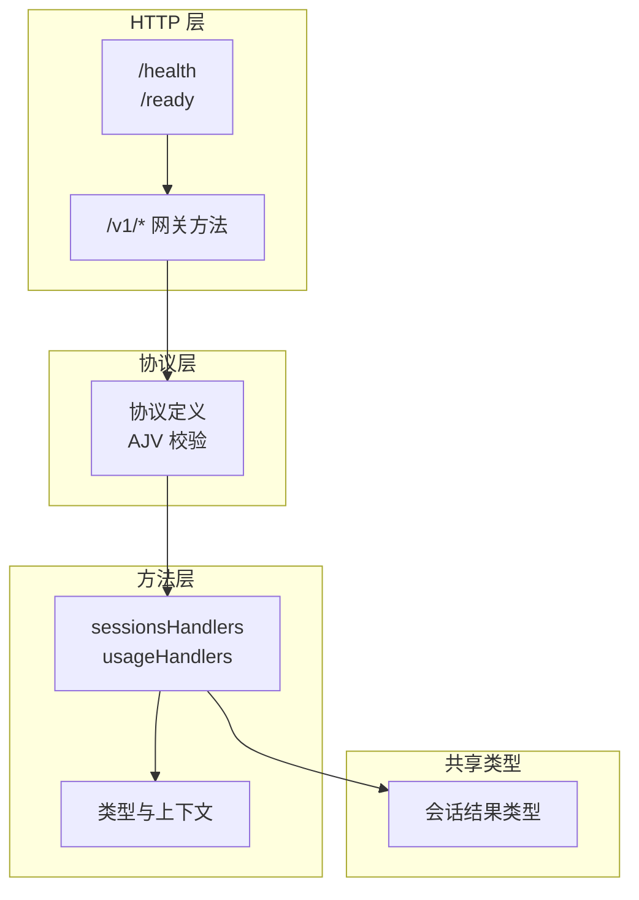
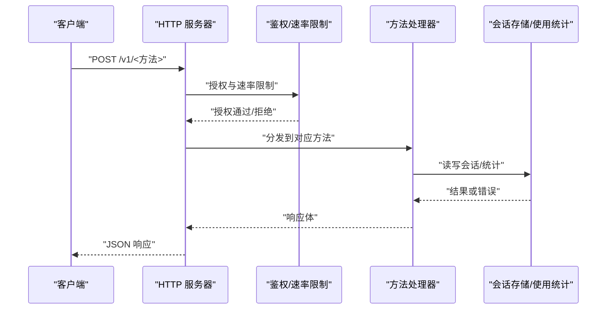
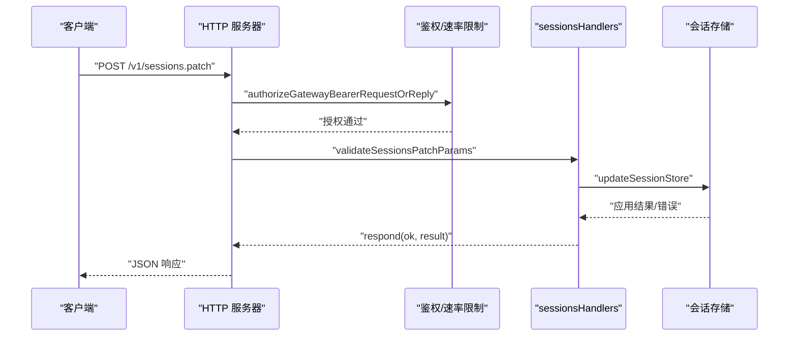
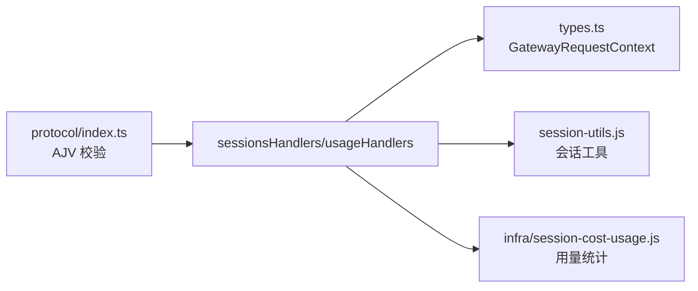

# 网关核心端点

## 目录
1. [简介](#简介)
2. [项目结构](#项目结构)
3. [核心组件](#核心组件)
4. [架构总览](#架构总览)
5. [详细组件分析](#详细组件分析)
6. [依赖分析](#依赖分析)
7. [性能考虑](#性能考虑)
8. [故障排查指南](#故障排查指南)
9. [结论](#结论)

## 简介
本文件面向 OpenClaw 网关的核心 HTTP 端点，聚焦以下能力：
- 健康检查与就绪探测（/health、/ready）
- 状态查询（usage.*）
- 配置管理（config.*）
- 会话管理（sessions.*）

重点覆盖会话管理相关接口：sessions.list、sessions.preview、sessions.patch、sessions.reset、sessions.delete、sessions.get、sessions.compact、sessions.resolve、sessions.usage 及其时间序列与日志变体。文档提供每个端点的 HTTP 方法、URL 路径、请求参数、响应格式、认证要求、错误码说明与使用示例。

## 项目结构
OpenClaw 网关通过统一的请求处理框架分发到各方法处理器：
- 会话管理：src/gateway/server-methods/sessions.ts
- 使用统计：src/gateway/server-methods/usage.ts
- 请求类型与上下文：src/gateway/server-methods/types.ts
- 协议与参数校验：src/gateway/protocol/index.ts、src/gateway/protocol/schema.ts
- HTTP 辅助工具：src/gateway/http-endpoint-helpers.ts
- 服务端路由与健康检查：src/gateway/server-http.ts、src/gateway/control-ui-routing.ts
- 共享会话类型：src/shared/session-types.ts

图表来源
- [server-http.ts](file://src/gateway/server-http.ts#L80-L120)
- [http-endpoint-helpers.ts](file://src/gateway/http-endpoint-helpers.ts#L1-L47)
- [index.ts](file://src/gateway/protocol/index.ts#L320-L340)
- [sessions.ts](file://src/gateway/server-methods/sessions.ts#L331-L755)
- [usage.ts](file://src/gateway/server-methods/usage.ts#L350-L800)
- [types.ts](file://src/gateway/server-methods/types.ts#L1-L113)
- [session-types.ts](file://src/shared/session-types.ts#L15-L28)

章节来源
- [server-http.ts](file://src/gateway/server-http.ts#L80-L120)
- [http-endpoint-helpers.ts](file://src/gateway/http-endpoint-helpers.ts#L1-L47)
- [index.ts](file://src/gateway/protocol/index.ts#L320-L340)

## 核心组件
- 会话管理处理器（sessionsHandlers）：提供会话列表、预览、解析、变更、重置、删除、消息读取、压缩、使用统计等能力。
- 使用统计处理器（usageHandlers）：提供全局使用状态、成本汇总、会话使用明细与聚合。
- 类型与上下文（GatewayRequestContext、GatewayRequestHandlers）：统一请求上下文、客户端信息、广播与钩子等。
- 协议与校验（validateSessions*、validateUsage*）：基于 AJV 的参数校验与错误格式化。
- HTTP 辅助（handleGatewayPostJsonEndpoint）：统一的 POST JSON 端点鉴权与请求体读取。

章节来源
- [sessions.ts](file://src/gateway/server-methods/sessions.ts#L331-L755)
- [usage.ts](file://src/gateway/server-methods/usage.ts#L350-L800)
- [types.ts](file://src/gateway/server-methods/types.ts#L1-L113)
- [index.ts](file://src/gateway/protocol/index.ts#L320-L340)
- [http-endpoint-helpers.ts](file://src/gateway/http-endpoint-helpers.ts#L1-L47)

## 架构总览
下图展示从 HTTP 到方法处理器的调用链路与关键职责：

图表来源
- [http-endpoint-helpers.ts](file://src/gateway/http-endpoint-helpers.ts#L7-L47)
- [sessions.ts](file://src/gateway/server-methods/sessions.ts#L331-L755)
- [usage.ts](file://src/gateway/server-methods/usage.ts#L350-L800)

## 详细组件分析

### 健康检查与就绪探测
- /health（存活探针）
- /ready（就绪探针）
- 控制 UI 挂载路径集合包含上述路径，便于外部探针访问。

章节来源
- [server-http.ts](file://src/gateway/server-http.ts#L80-L120)
- [control-ui-routing.ts](file://src/gateway/control-ui-routing.ts#L1-L20)

### 状态查询（usage.*）
- usage.status：返回各提供方用量摘要。
- usage.cost：按日期范围返回成本汇总，支持 UTC/gateway/specific 解释模式与 UTC 偏移。
- sessions.usage：列出会话并聚合令牌、成本、消息、工具、模型/提供商维度统计；可按 key 或日期范围筛选。
- sessions.usage.timeseries：按日期粒度返回会话使用时间序列（需配合具体实现）。
- sessions.usage.logs：返回会话日志片段（需配合具体实现）。

请求与响应要点
- 认证：B 接口（Bearer），受速率限制。
- 参数校验：AJV Schema 校验，错误统一格式化。
- 时间解释：支持 "utc"、"gateway"、"specific" 三种模式，默认 "utc" 兼容历史行为。
- 聚合：按模型、提供商、代理、渠道、每日等多维聚合，含延迟统计与工具调用统计。

章节来源
- [usage.ts](file://src/gateway/server-methods/usage.ts#L350-L800)
- [index.ts](file://src/gateway/protocol/index.ts#L337-L338)

### 配置管理（config.*）
- config.get、config.set、config.apply、config.patch、config.schema.* 等。
- 参数由 validateConfig* 系列校验，错误统一返回。

章节来源
- [index.ts](file://src/gateway/protocol/index.ts#L339-L349)

### 会话管理（sessions.*）
- sessions.list：列出会话，支持分页与过滤。
- sessions.preview：批量预览会话最近消息片段。
- sessions.resolve：将输入键解析为规范键。
- sessions.patch：更新会话属性（如模型、标签、策略等）。
- sessions.reset：重置会话（保留部分元数据，生成新 sessionId 并归档旧转录）。
- sessions.delete：删除会话（可选删除转录），触发生命周期事件。
- sessions.get：读取会话消息（限制数量）。
- sessions.compact：压缩会话转录文件行数。
- sessions.usage：会话级使用统计（同上，但限定到单个或多个会话）。

请求与响应要点
- 认证：B 接口（Bearer），受速率限制。
- 参数校验：validateSessions* 系列。
- 错误码：INVALID_REQUEST、UNAVAILABLE 等。
- 会话键：支持多种输入形式，内部标准化与迁移。
- 生命周期：重置/删除会话时清理运行时、关闭 ACP 运行时、发出解绑事件。

图表来源
- [http-endpoint-helpers.ts](file://src/gateway/http-endpoint-helpers.ts#L7-L47)
- [sessions.ts](file://src/gateway/server-methods/sessions.ts#L423-L465)
- [index.ts](file://src/gateway/protocol/index.ts#L327-L328)

#### sessions.list
- 方法：POST
- 路径：/v1/sessions.list
- 请求参数：limit、offset、agentId、spawnedBy、label、updatedAfter 等（以实际 Schema 为准）
- 响应：包含 ts、path、count、defaults、sessions 数组
- 认证：Bearer
- 错误码：INVALID_REQUEST

章节来源
- [sessions.ts](file://src/gateway/server-methods/sessions.ts#L332-L346)
- [index.ts](file://src/gateway/protocol/index.ts#L320-L320)

#### sessions.preview
- 方法：POST
- 路径：/v1/sessions.preview
- 请求参数：keys（数组，最多 64）、limit（默认 12）、maxChars（默认 240）
- 响应：&#123; ts, previews: [&#123; key, status, items &#125;] &#125;
- 认证：Bearer
- 错误码：INVALID_REQUEST

章节来源
- [sessions.ts](file://src/gateway/server-methods/sessions.ts#L347-L408)
- [index.ts](file://src/gateway/protocol/index.ts#L321-L321)

#### sessions.resolve
- 方法：POST
- 路径：/v1/sessions.resolve
- 请求参数：key（或 sessionKey）
- 响应：&#123; ok, key &#125;
- 认证：Bearer
- 错误码：INVALID_REQUEST

章节来源
- [sessions.ts](file://src/gateway/server-methods/sessions.ts#L409-L422)
- [index.ts](file://src/gateway/protocol/index.ts#L324-L324)

#### sessions.patch
- 方法：POST
- 路径：/v1/sessions.patch
- 请求参数：key（必填）、可选字段（如 model、modelProvider、label、thinkingLevel、verboseLevel、reasoningLevel、sendPolicy、contextTokens、skillsSnapshot 等）
- 响应：&#123; ok, path, key, entry, resolved: &#123; modelProvider, model &#125; &#125;
- 认证：Bearer
- 错误码：INVALID_REQUEST、UNAVAILABLE
- 特殊限制：Webchat 客户端不可直接变更会话（除控制 UI）

章节来源
- [sessions.ts](file://src/gateway/server-methods/sessions.ts#L423-L465)
- [index.ts](file://src/gateway/protocol/index.ts#L327-L328)

#### sessions.reset
- 方法：POST
- 路径：/v1/sessions.reset
- 请求参数：key（必填）、reason（new/reset）
- 响应：&#123; ok, key, entry &#125;
- 认证：Bearer
- 行为：生成新 sessionId，归档旧转录，清理运行时，发出生命周期事件
- 错误码：INVALID_REQUEST、UNAVAILABLE

章节来源
- [sessions.ts](file://src/gateway/server-methods/sessions.ts#L466-L558)
- [index.ts](file://src/gateway/protocol/index.ts#L329-L329)

#### sessions.delete
- 方法：POST
- 路径：/v1/sessions.delete
- 请求参数：key（必填）、deleteTranscript（默认 true）、emitLifecycleHooks（默认 true）
- 响应：&#123; ok, key, deleted, archived &#125;
- 认证：Bearer
- 行为：删除会话条目与可选转录，清理运行时，发出生命周期事件
- 错误码：INVALID_REQUEST、UNAVAILABLE

章节来源
- [sessions.ts](file://src/gateway/server-methods/sessions.ts#L559-L629)
- [index.ts](file://src/gateway/protocol/index.ts#L331-L331)

#### sessions.get
- 方法：POST
- 路径：/v1/sessions.get
- 请求参数：key/sessionKey（必填）、limit（默认 200）
- 响应：&#123; messages &#125;
- 认证：Bearer
- 错误码：INVALID_REQUEST

章节来源
- [sessions.ts](file://src/gateway/server-methods/sessions.ts#L630-L651)
- [index.ts](file://src/gateway/protocol/index.ts#L320-L320)

#### sessions.compact
- 方法：POST
- 路径：/v1/sessions.compact
- 请求参数：key（必填）、maxLines（默认 400）
- 响应：&#123; ok, key, compacted, archived?, kept? &#125;
- 认证：Bearer
- 行为：仅当存在 sessionId 且转录文件存在时执行压缩
- 错误码：INVALID_REQUEST

章节来源
- [sessions.ts](file://src/gateway/server-methods/sessions.ts#L652-L753)
- [index.ts](file://src/gateway/protocol/index.ts#L334-L334)

#### sessions.usage
- 方法：POST
- 路径：/v1/sessions.usage
- 请求参数：startDate、endDate、days、mode（utc/gateway/specific）、utcOffset、limit、includeContextWeight、key
- 响应：包含 sessions、totals、aggregates、startDate、endDate、updatedAt
- 认证：Bearer
- 行为：合并已命名与未命名会话，加载使用统计并聚合
- 错误码：INVALID_REQUEST

章节来源
- [usage.ts](file://src/gateway/server-methods/usage.ts#L367-L800)
- [index.ts](file://src/gateway/protocol/index.ts#L337-L337)

#### sessions.usage.timeseries 与 sessions.usage.logs
- 方法：POST
- 路径：/v1/sessions.usage.timeseries、/v1/sessions.usage.logs
- 请求参数：与 sessions.usage 类似，按时间序列或日志维度返回
- 认证：Bearer
- 错误码：INVALID_REQUEST

章节来源
- [usage.ts](file://src/gateway/server-methods/usage.ts#L94-L110)
- [usage.ts](file://src/gateway/server-methods/usage.ts#L350-L366)

### 共享类型与结果结构
- SessionsListResultBase：包含 ts、path、count、defaults、sessions
- SessionsPatchResultBase：包含 ok、path、key、entry
- 会话预览项：key、status、items
- 会话使用结果：sessions、totals、aggregates、startDate、endDate、updatedAt

章节来源
- [session-types.ts](file://src/shared/session-types.ts#L15-L28)

## 依赖分析
- 协议与校验：AJV Schema 定义与校验函数集中于 protocol/index.ts，方法层通过 validateSessions*、validateUsage* 等进行参数校验。
- 处理器与上下文：方法处理器依赖 GatewayRequestContext 提供的模型目录、健康缓存、广播、节点注册等能力。
- 存储与工具：会话操作依赖会话存储与转录读取工具，使用统计依赖成本与用量聚合工具。

图表来源
- [index.ts](file://src/gateway/protocol/index.ts#L320-L340)
- [sessions.ts](file://src/gateway/server-methods/sessions.ts#L331-L755)
- [usage.ts](file://src/gateway/server-methods/usage.ts#L1-L800)
- [types.ts](file://src/gateway/server-methods/types.ts#L1-L113)

章节来源
- [index.ts](file://src/gateway/protocol/index.ts#L320-L340)
- [sessions.ts](file://src/gateway/server-methods/sessions.ts#L331-L755)
- [usage.ts](file://src/gateway/server-methods/usage.ts#L1-L800)
- [types.ts](file://src/gateway/server-methods/types.ts#L1-L113)

## 性能考虑
- 会话预览与使用统计涉及磁盘读取与聚合，建议合理设置 limit、maxLines 与日期范围。
- 成本汇总带缓存（TTL 30 秒），避免频繁重复计算。
- 批量预览 keys 最大 64，避免一次请求过大。
- 重置/删除会话前清理运行时与浏览器标签页，防止资源泄漏。

## 故障排查指南
常见错误与定位
- INVALID_REQUEST：参数校验失败，检查请求体结构与字段类型。
- UNAVAILABLE：会话仍处于活跃状态，稍后重试。
- 权限不足：确认 Bearer Token 正确且在可信代理白名单内（如适用）。

章节来源
- [sessions.ts](file://src/gateway/server-methods/sessions.ts#L223-L226)
- [index.ts](file://src/gateway/protocol/index.ts#L424-L458)

## 结论
本文档系统梳理了 OpenClaw 网关的核心 HTTP 端点，重点覆盖健康检查、状态查询与会话管理。通过统一的鉴权、速率限制与参数校验机制，结合清晰的响应结构与错误码，确保接口稳定可用。建议在生产环境中：
- 明确各端点的认证方式与速率限制策略
- 合理设置会话预览与使用统计的查询范围
- 对重置/删除等高风险操作做好幂等与回滚设计