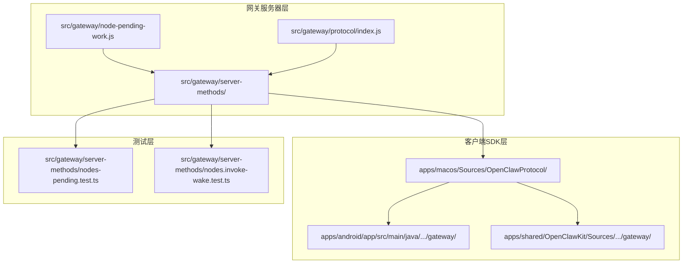
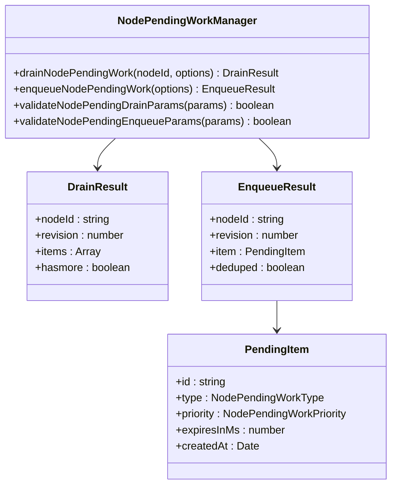
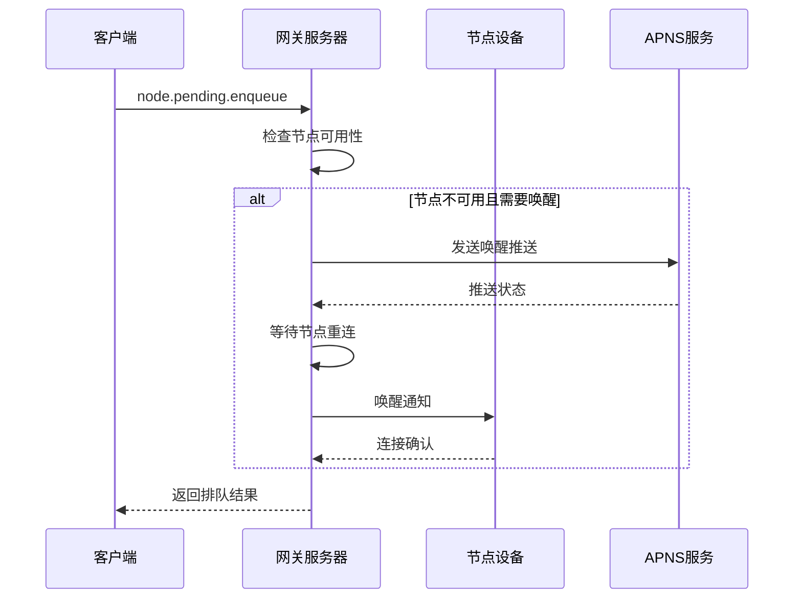
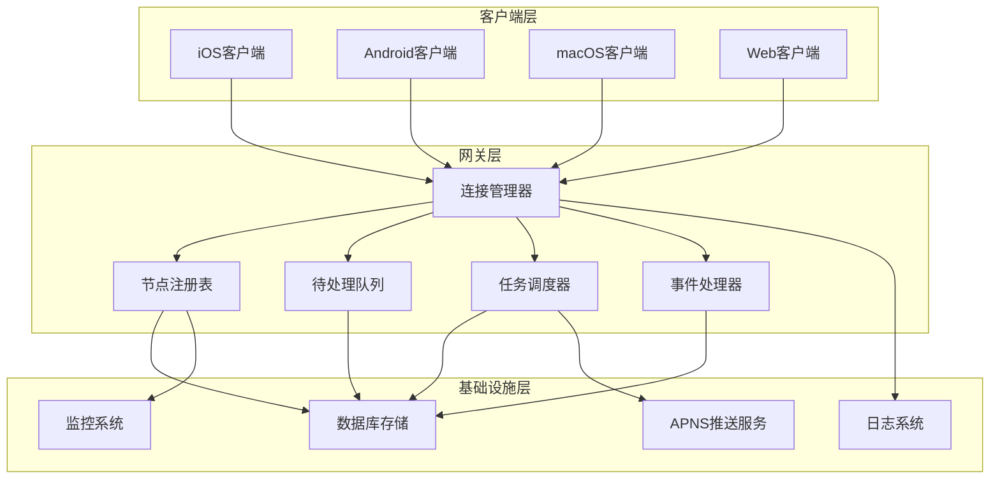
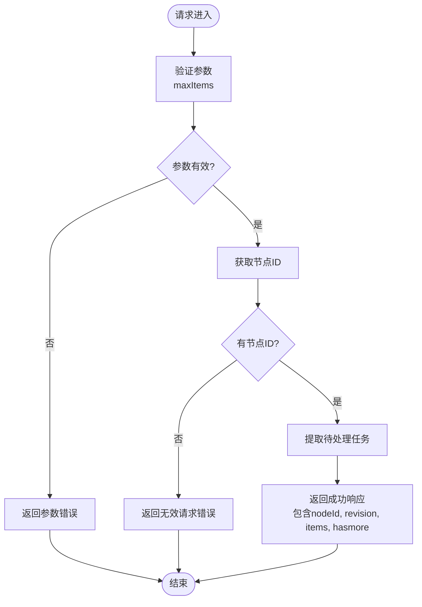
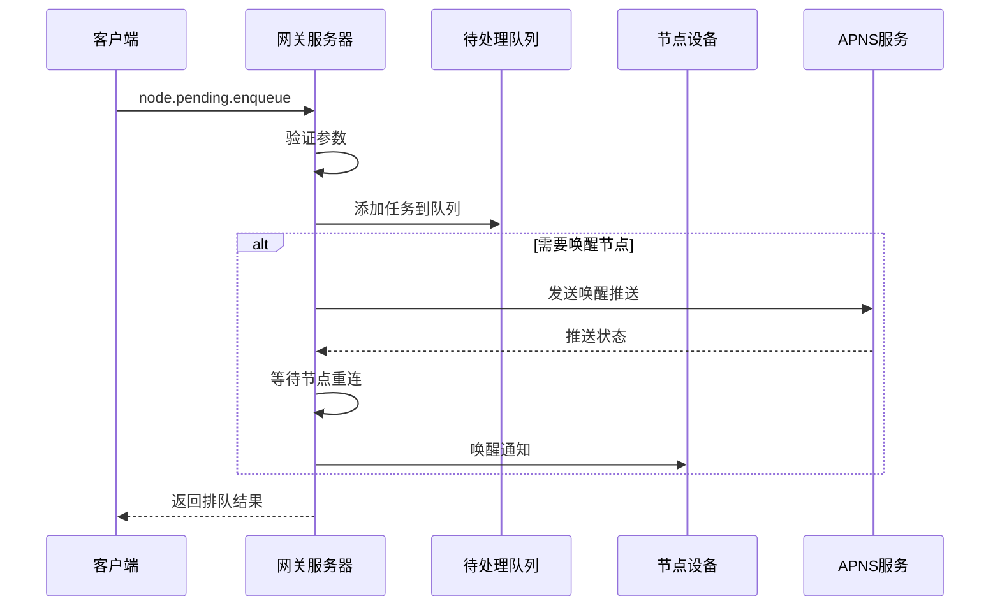
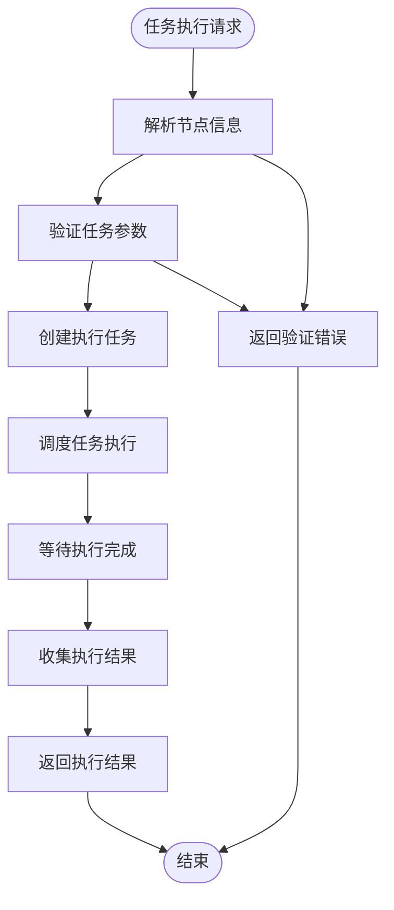
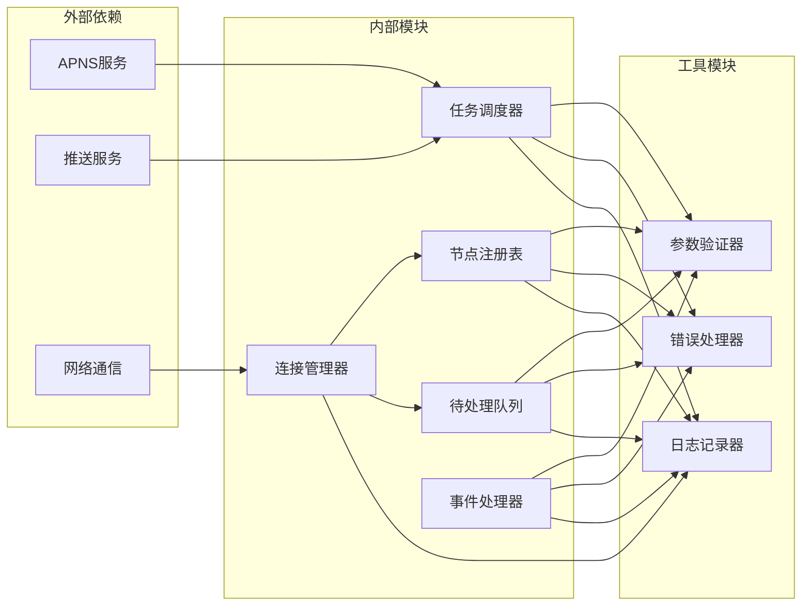

# 节点管理端点

## 目录
1. [简介](#简介)
2. [项目结构](#项目结构)
3. [核心组件](#核心组件)
4. [架构概览](#架构概览)
5. [详细组件分析](#详细组件分析)
6. [依赖关系分析](#依赖关系分析)
7. [性能考虑](#性能考虑)
8. [故障排除指南](#故障排除指南)
9. [结论](#结论)

## 简介

OpenClaw网关节点管理系统提供了完整的节点生命周期管理能力，包括节点注册、任务调度、执行结果处理等功能。该系统支持多种平台（iOS、Android、macOS）的节点设备，通过标准化的RPC协议实现节点间的通信和协调。

系统的核心功能围绕以下端点展开：
- 节点列表管理：node.list、node.describe
- 待处理队列管理：node.pending.drain、node.pending.enqueue、node.pending.pull、node.pending.ack
- 任务执行：node.invoke、node.invoke.result
- 事件通知：node.event

## 项目结构

OpenClaw项目的节点管理功能主要分布在以下几个关键目录：

**图表来源**
- [nodes-pending.ts](file://src/gateway/server-methods/nodes-pending.ts#L1-L160)
- [GatewayModels.swift](file://apps/macos/Sources/OpenClawProtocol/GatewayModels.swift#L931-L991)

**章节来源**
- [nodes-pending.ts](file://src/gateway/server-methods/nodes-pending.ts#L1-L160)
- [GatewayModels.swift](file://apps/macos/Sources/OpenClawProtocol/GatewayModels.swift#L931-L991)

## 核心组件

### 节点待处理工作管理器

节点待处理工作管理器是整个节点管理系统的核心组件，负责处理节点的待执行任务队列。

**图表来源**
- [nodes-pending.ts](file://src/gateway/server-methods/nodes-pending.ts#L1-L160)

### 节点唤醒机制

系统实现了智能的节点唤醒机制，支持APNS推送和重连等待策略：

**图表来源**
- [nodes-pending.ts](file://src/gateway/server-methods/nodes-pending.ts#L76-L157)

**章节来源**
- [nodes-pending.ts](file://src/gateway/server-methods/nodes-pending.ts#L31-L159)

## 架构概览

OpenClaw节点管理系统的整体架构采用分层设计，确保了系统的可扩展性和可靠性：

**图表来源**
- [nodes.ts](file://src/gateway/server-methods/nodes.ts)
- [nodes-pending.ts](file://src/gateway/server-methods/nodes-pending.ts#L1-L160)

## 详细组件分析

### 节点待处理队列管理

#### node.pending.drain 端点

`node.pending.drain`端点用于从指定节点的待处理队列中提取任务项：

**图表来源**
- [nodes-pending.ts](file://src/gateway/server-methods/nodes-pending.ts#L32-L58)

#### node.pending.enqueue 端点

`node.pending.enqueue`端点负责向节点队列添加新的待处理任务：

**图表来源**
- [nodes-pending.ts](file://src/gateway/server-methods/nodes-pending.ts#L60-L158)

**章节来源**
- [nodes-pending.ts](file://src/gateway/server-methods/nodes-pending.ts#L31-L159)

### 节点任务执行管理

#### node.invoke 端点

节点任务执行端点负责触发节点上的具体操作：

**图表来源**
- [nodes.ts](file://src/gateway/server-methods/nodes.ts)

#### node.invoke.result 端点

`node.invoke.result`端点用于获取任务执行的最终结果：

**章节来源**
- [nodes.ts](file://src/gateway/server-methods/nodes.ts)

### 节点事件处理

#### node.event 端点

节点事件端点提供实时事件通知机制：

**章节来源**
- [nodes.ts](file://src/gateway/server-methods/nodes.ts)

## 依赖关系分析

节点管理系统的依赖关系体现了清晰的分层架构：

**图表来源**
- [nodes-pending.ts](file://src/gateway/server-methods/nodes-pending.ts#L1-L160)
- [nodes.helpers.ts](file://src/gateway/server-methods/nodes.helpers.ts)

**章节来源**
- [nodes-pending.ts](file://src/gateway/server-methods/nodes-pending.ts#L1-L160)
- [nodes.helpers.ts](file://src/gateway/server-methods/nodes.helpers.ts)

## 性能考虑

### 负载均衡策略

系统采用多层负载均衡机制：

1. **节点选择算法**：基于节点可用性、地理位置、网络质量等因素进行智能选择
2. **任务分发策略**：根据任务类型和节点能力进行差异化分发
3. **动态调整机制**：实时监控节点负载并动态调整任务分配

### 故障恢复机制

系统实现了多层次的故障恢复策略：

1. **节点离线检测**：通过心跳机制和超时检测及时发现节点异常
2. **任务重试机制**：对失败的任务自动进行有限次数的重试
3. **数据持久化**：确保任务状态在系统重启后能够正确恢复
4. **优雅降级**：在网络不稳定时提供基本功能保证

## 故障排除指南

### 常见问题诊断

#### 节点无法连接

**症状**：`node.pending.enqueue`返回节点不可用错误

**排查步骤**：
1. 检查节点是否在线状态
2. 验证APNS推送配置
3. 确认网络连接正常
4. 查看节点日志信息

#### 任务执行超时

**症状**：`node.invoke`长时间无响应

**排查步骤**：
1. 检查节点资源使用情况
2. 验证任务参数有效性
3. 查看节点执行日志
4. 确认节点版本兼容性

#### 事件丢失问题

**症状**：`node.event`事件通知不完整

**排查步骤**：
1. 检查事件订阅状态
2. 验证事件过滤条件
3. 查看事件队列长度
4. 确认网络稳定性

**章节来源**
- [nodes-pending.test.ts](file://src/gateway/server-methods/nodes-pending.test.ts)
- [nodes.invoke-wake.test.ts](file://src/gateway/server-methods/nodes.invoke-wake.test.ts)

## 结论

OpenClaw网关节点管理系统提供了完整的企业级节点管理解决方案。系统通过标准化的RPC协议、智能的任务调度机制和完善的故障恢复策略，确保了跨平台节点设备的高效协同工作。

主要优势包括：
- **统一的API接口**：提供一致的节点管理体验
- **智能的任务调度**：支持优先级和超时管理
- **强大的故障恢复**：确保系统的高可用性
- **灵活的扩展性**：支持新节点类型的快速集成

未来发展方向：
- 增强AI驱动的任务优化算法
- 扩展更多平台和设备类型的支持
- 优化大规模节点集群的管理效率
- 加强安全性和隐私保护机制