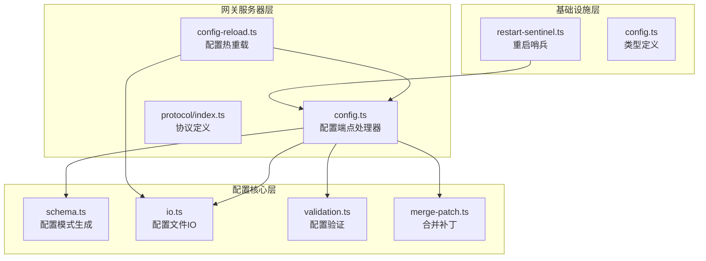
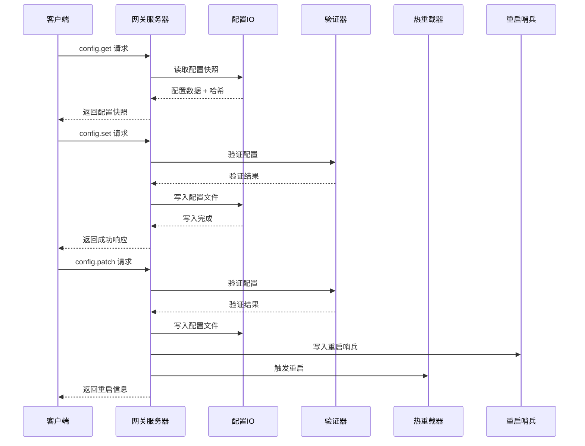
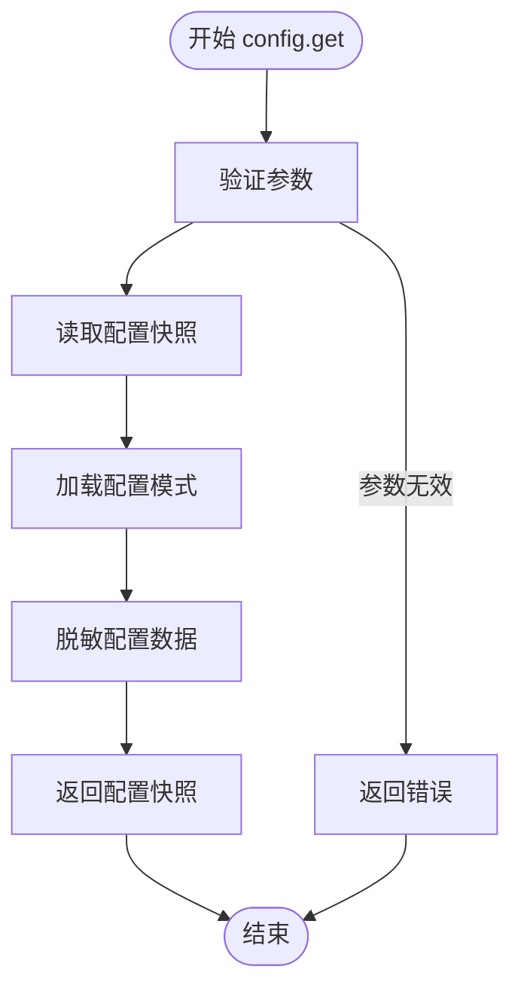
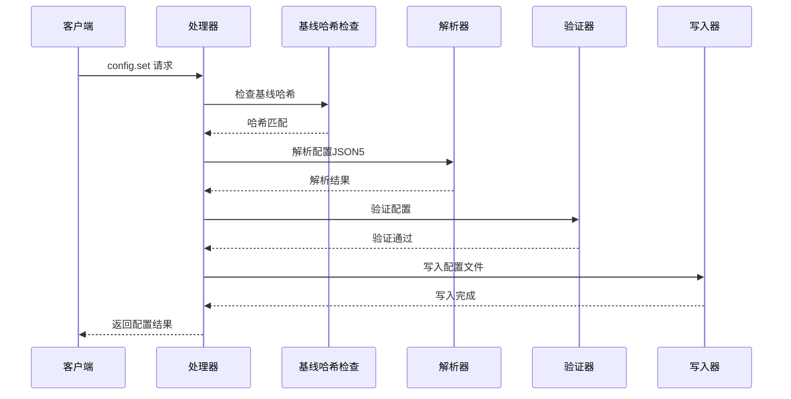
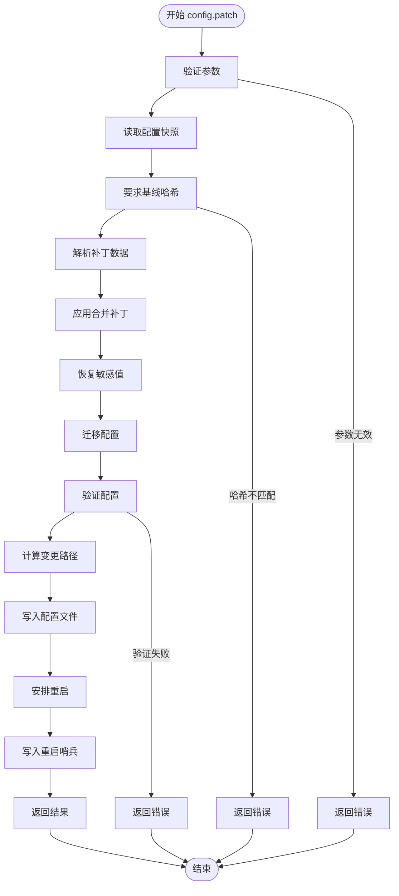
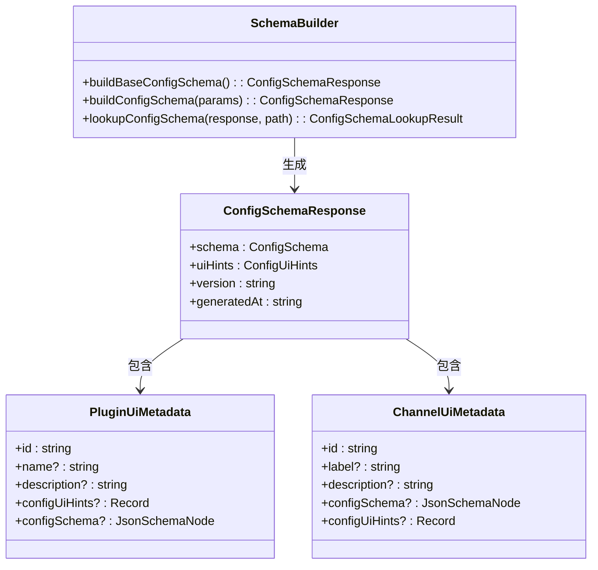
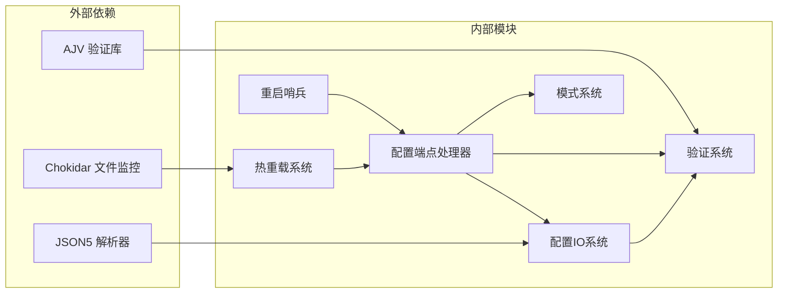

# 配置管理端点

## 目录
1. [简介](#简介)
2. [项目结构](#项目结构)
3. [核心组件](#核心组件)
4. [架构概览](#架构概览)
5. [详细组件分析](#详细组件分析)
6. [依赖关系分析](#依赖关系分析)
7. [性能考虑](#性能考虑)
8. [故障排除指南](#故障排除指南)
9. [结论](#结论)

## 简介

OpenClaw网关配置管理端点提供了完整的配置操作接口，包括配置获取、设置、应用、补丁更新和模式查询等功能。这些端点支持实时配置管理，具备配置验证、热重载、版本控制和安全基线哈希检查等特性。

## 项目结构

配置管理功能分布在多个核心模块中：

**图表来源**
- [src/gateway/server-methods/config.ts](file://src/gateway/server-methods/config.ts#L262-L515)
- [src/config/schema.ts](file://src/config/schema.ts#L449-L484)
- [src/gateway/config-reload.ts](file://src/gateway/config-reload.ts#L1-L248)

**章节来源**
- [src/gateway/server-methods/config.ts](file://src/gateway/server-methods/config.ts#L1-L516)
- [src/config/schema.ts](file://src/config/schema.ts#L1-L712)

## 核心组件

### 配置端点处理器

配置端点处理器提供以下主要接口：

- **config.get**: 获取当前配置快照
- **config.set**: 设置完整配置
- **config.apply**: 应用完整配置（带重启机制）
- **config.patch**: 应用配置补丁（带重启机制）
- **config.schema**: 获取配置模式
- **config.schema.lookup**: 查询特定路径的配置模式

### 配置验证系统

配置验证系统基于Zod Schema和插件注册表，提供多层次的验证：

- 基础配置结构验证
- 插件配置验证
- 通道配置验证
- 代理配置验证

### 热重载机制

热重载系统监控配置文件变化，智能决定是进行热重载还是完全重启：

- 文件变更监控
- 变更路径分析
- 重启策略决策
- 平滑重启协调

**章节来源**
- [src/gateway/server-methods/config.ts](file://src/gateway/server-methods/config.ts#L262-L515)
- [src/config/validation.ts](file://src/config/validation.ts#L300-L605)
- [src/gateway/config-reload.ts](file://src/gateway/config-reload.ts#L16-L66)

## 架构概览

**图表来源**
- [src/gateway/server-methods/config.ts](file://src/gateway/server-methods/config.ts#L263-L514)
- [src/config/io.ts](file://src/config/io.ts#L707-L800)
- [src/config/validation.ts](file://src/config/validation.ts#L229-L286)

## 详细组件分析

### 配置获取流程 (config.get)

配置获取是最基础的操作，返回当前有效的配置快照：

**图表来源**
- [src/gateway/server-methods/config.ts](file://src/gateway/server-methods/config.ts#L263-L270)
- [src/config/schema.ts](file://src/config/schema.ts#L449-L484)

### 配置设置流程 (config.set)

配置设置提供完整配置替换功能：

**图表来源**
- [src/gateway/server-methods/config.ts](file://src/gateway/server-methods/config.ts#L310-L332)
- [src/config/io.ts](file://src/config/io.ts#L636-L645)

### 配置补丁流程 (config.patch)

配置补丁支持增量更新，是最复杂的操作：

**图表来源**
- [src/gateway/server-methods/config.ts](file://src/gateway/server-methods/config.ts#L333-L454)
- [src/config/merge-patch.ts](file://src/config/merge-patch.ts#L62-L98)

### 配置模式系统

配置模式系统提供动态生成的配置模式：

**图表来源**
- [src/config/schema.ts](file://src/config/schema.ts#L101-L143)
- [src/config/schema.ts](file://src/config/schema.ts#L449-L484)
- [src/config/schema.ts](file://src/config/schema.ts#L678-L711)

**章节来源**
- [src/gateway/server-methods/config.ts](file://src/gateway/server-methods/config.ts#L262-L515)
- [src/config/schema.ts](file://src/config/schema.ts#L1-L712)
- [src/config/merge-patch.ts](file://src/config/merge-patch.ts#L1-L98)

## 依赖关系分析

**图表来源**
- [src/gateway/server-methods/config.ts](file://src/gateway/server-methods/config.ts#L1-L56)
- [src/gateway/config-reload.ts](file://src/gateway/config-reload.ts#L1-L10)

**章节来源**
- [src/gateway/server-methods/config.ts](file://src/gateway/server-methods/config.ts#L1-L56)
- [src/gateway/config-reload.ts](file://src/gateway/config-reload.ts#L1-L10)

## 性能考虑

### 缓存策略

配置模式系统实现了多级缓存：

- 基础配置模式缓存
- 合并配置模式缓存（最多64个条目）
- UI提示缓存

### 写入优化

配置写入采用原子操作和备份机制：

- 配置审计日志记录
- 写入前环境变量快照
- 路径级变更检测

### 监控开销

热重载监控使用节流机制：

- 默认300ms去抖动延迟
- 支持自定义监控模式
- 错误处理和资源清理

## 故障排除指南

### 常见错误类型

1. **配置哈希不匹配**: 当配置在请求期间被其他进程修改时发生
2. **配置验证失败**: 配置格式或内容不符合模式要求
3. **文件权限错误**: 无法读取或写入配置文件
4. **重启失败**: 配置变更后网关重启异常

### 排查步骤

1. 使用 `config.get` 获取最新配置快照
2. 检查配置哈希是否匹配
3. 验证配置格式和内容
4. 查看配置审计日志
5. 检查重启哨兵状态

**章节来源**
- [src/gateway/server-methods/config.ts](file://src/gateway/server-methods/config.ts#L57-L101)
- [src/infra/restart-sentinel.ts](file://src/infra/restart-sentinel.ts#L1-L128)

## 结论

OpenClaw的配置管理端点提供了企业级的配置管理能力，具备以下特点：

- **安全性**: 基线哈希检查防止并发修改冲突
- **完整性**: 全面的配置验证和模式检查
- **可靠性**: 智能热重载和优雅降级
- **可观测性**: 详细的审计日志和重启跟踪

这些设计确保了配置管理的安全性、可靠性和可维护性，适用于生产环境的复杂配置管理需求。