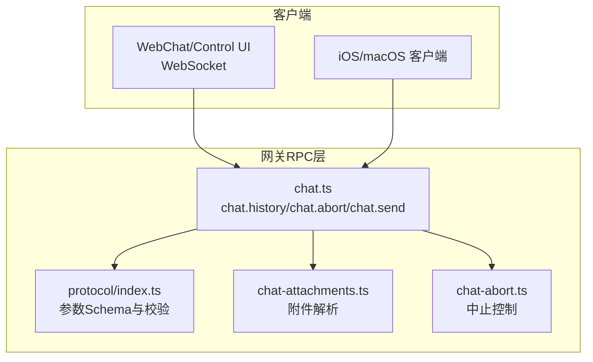
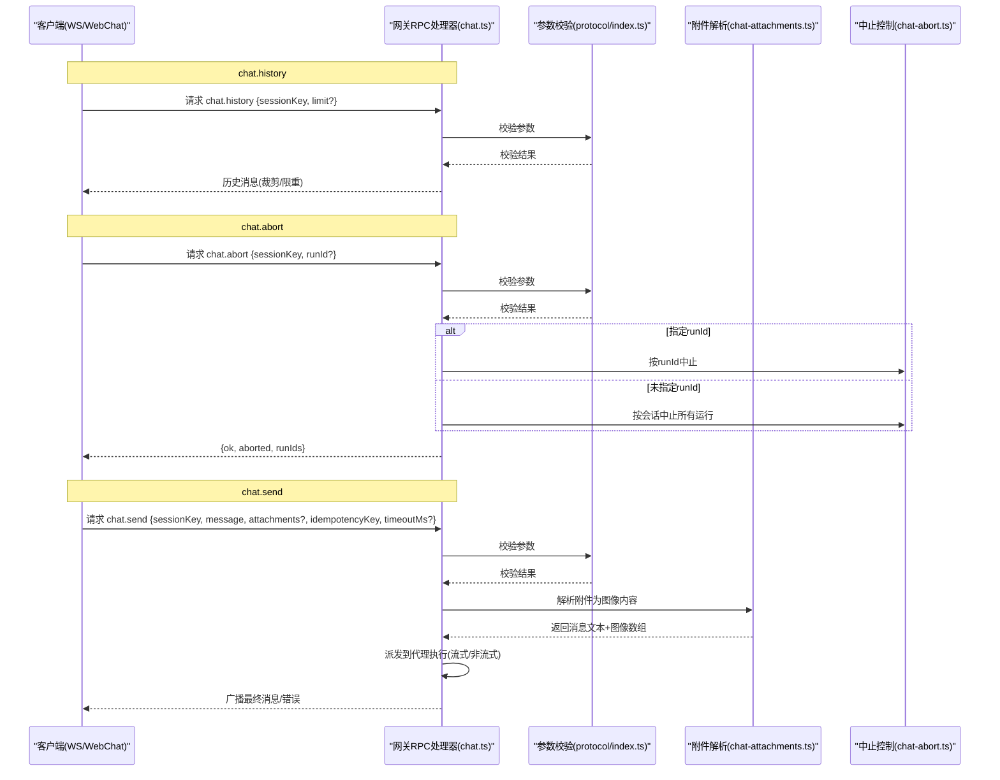
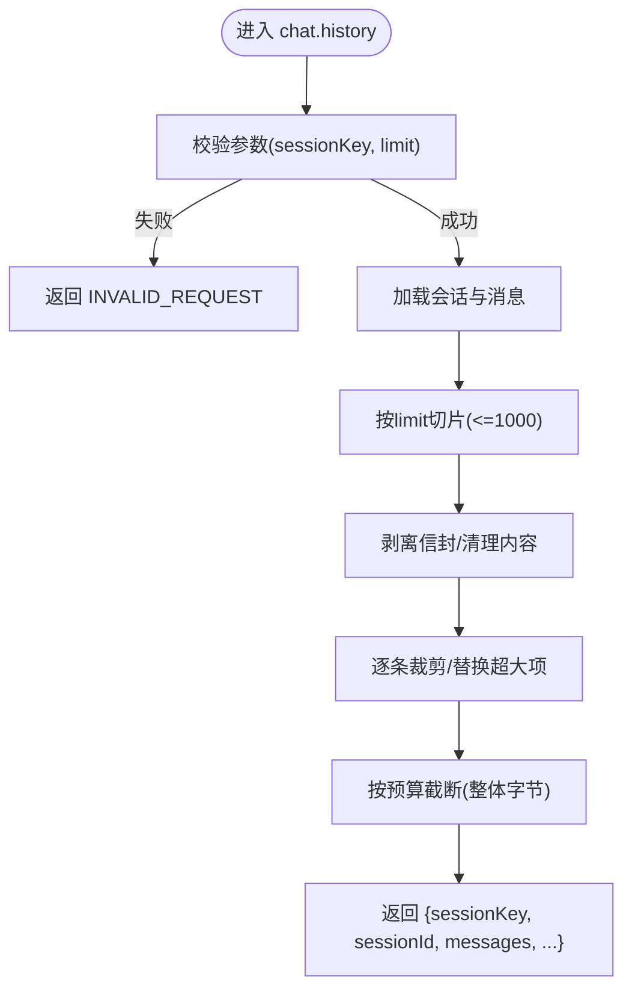
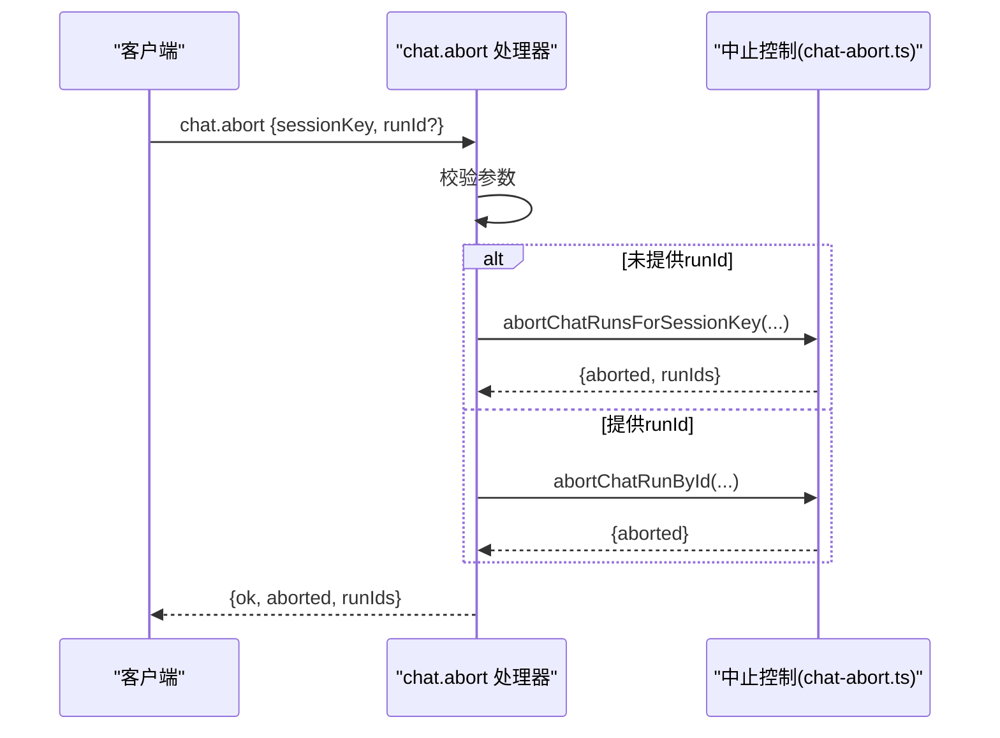
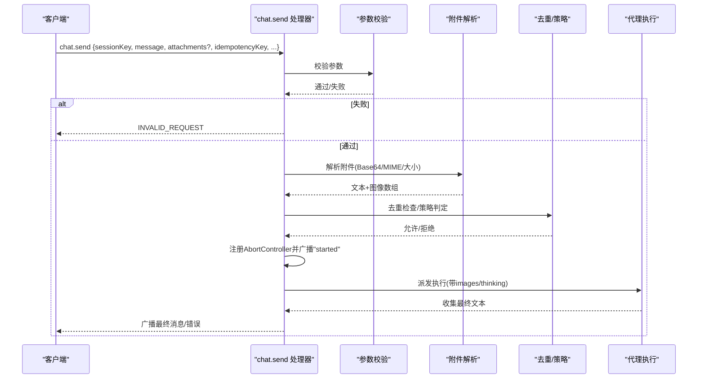
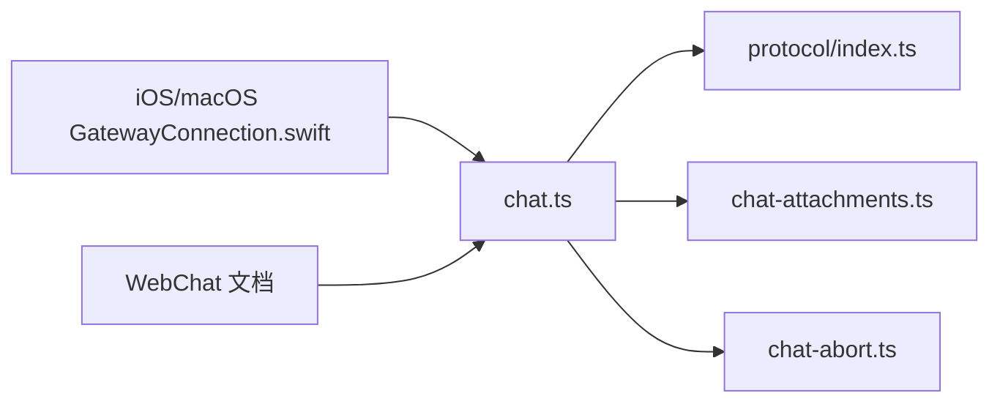

# 聊天接口

## 目录
1. [简介](#简介)
2. [项目结构](#项目结构)
3. [核心组件](#核心组件)
4. [架构总览](#架构总览)
5. [详细组件分析](#详细组件分析)
6. [依赖关系分析](#依赖关系分析)
7. [性能考量](#性能考量)
8. [故障排查指南](#故障排查指南)
9. [结论](#结论)
10. [附录](#附录)

## 简介
本文件面向OpenClaw聊天相关REST API（通过网关RPC暴露）的使用者与集成者，系统性说明以下端点与能力：
- chat.history：查询会话聊天历史，支持限制条数与内容裁剪
- chat.abort：中止指定会话或特定运行的任务
- chat.send：向指定会话发送消息，支持附件、幂等键、超时控制与工具事件订阅

文档同时覆盖消息格式、附件上传、流式响应处理、WebChat集成方式与实时聊天实现要点。

## 项目结构
OpenClaw的聊天能力由“网关RPC处理器 + 协议校验 + 附件解析 + 中止控制”构成，核心文件如下：
- 网关聊天处理器：负责chat.history、chat.abort、chat.send的请求处理与广播
- 协议与参数校验：统一的参数Schema与AJV校验器
- 附件解析：将Base64附件解析为图像内容并注入消息
- 中止控制：管理运行中的聊天任务，支持按会话或按runId中止

图表来源
- [src/gateway/server-methods/chat.ts](file://src/gateway/server-methods/chat.ts#L741-L1305)
- [src/gateway/protocol/index.ts](file://src/gateway/protocol/index.ts#L414-L418)
- [src/gateway/chat-attachments.ts](file://src/gateway/chat-attachments.ts#L97-L145)
- [src/gateway/chat-abort.ts](file://src/gateway/chat-abort.ts#L45-L125)

章节来源
- [src/gateway/server-methods/chat.ts](file://src/gateway/server-methods/chat.ts#L1-L1305)
- [src/gateway/protocol/index.ts](file://src/gateway/protocol/index.ts#L1-L673)
- [src/gateway/chat-attachments.ts](file://src/gateway/chat-attachments.ts#L1-L185)
- [src/gateway/chat-abort.ts](file://src/gateway/chat-abort.ts#L1-L125)

## 核心组件
- chat.history：从会话存储读取消息，进行内容裁剪与大小限制，返回受控的历史数据
- chat.abort：按会话或runId中止运行中的聊天任务，必要时持久化部分输出
- chat.send：接收消息与可选附件，解析为图像内容，派发到代理执行，广播最终结果
- 参数校验：基于Schema的AJV校验，统一错误格式
- 附件处理：Base64解码、MIME嗅探、大小限制与类型过滤
- 中止机制：AbortController + 运行时状态管理 + 广播通知

章节来源
- [src/gateway/server-methods/chat.ts](file://src/gateway/server-methods/chat.ts#L741-L1305)
- [src/gateway/protocol/index.ts](file://src/gateway/protocol/index.ts#L414-L418)
- [src/gateway/chat-attachments.ts](file://src/gateway/chat-attachments.ts#L97-L145)
- [src/gateway/chat-abort.ts](file://src/gateway/chat-abort.ts#L45-L125)

## 架构总览
下图展示聊天端点在系统中的交互关系与数据流：

图表来源
- [src/gateway/server-methods/chat.ts](file://src/gateway/server-methods/chat.ts#L741-L1305)
- [src/gateway/protocol/index.ts](file://src/gateway/protocol/index.ts#L414-L418)
- [src/gateway/chat-attachments.ts](file://src/gateway/chat-attachments.ts#L97-L145)
- [src/gateway/chat-abort.ts](file://src/gateway/chat-abort.ts#L45-L125)

## 详细组件分析

### chat.history 接口
- 功能：查询指定会话的历史消息，支持limit限制与内容裁剪
- 输入参数
  - sessionKey: 会话标识符
  - limit?: 数量上限（默认200，最大1000）
- 输出
  - sessionKey、sessionId
  - messages: 历史消息数组（已裁剪/替换超大项）
  - thinkingLevel、verboseLevel
- 关键行为
  - 读取会话存储，切片取最后N条
  - 内容裁剪与占位替换，避免单条过大
  - 最终按字节预算截断，确保整体响应可控
- 错误
  - 参数无效时返回INVALID_REQUEST

图表来源
- [src/gateway/server-methods/chat.ts](file://src/gateway/server-methods/chat.ts#L741-L803)

章节来源
- [src/gateway/server-methods/chat.ts](file://src/gateway/server-methods/chat.ts#L741-L803)

### chat.abort 接口
- 功能：中止指定会话或特定runId的聊天任务；若存在部分输出，可持久化到历史
- 输入参数
  - sessionKey: 会话标识符
  - runId?: 可选，指定具体运行
- 行为
  - 未提供runId：中止该会话下所有活跃运行
  - 提供runId：校验sessionKey匹配后中止该runId
  - 若有缓冲文本且非空，持久化为助手消息并标记中止原因
- 输出
  - &#123;ok: true, aborted: boolean, runIds: string[]&#125;

图表来源
- [src/gateway/server-methods/chat.ts](file://src/gateway/server-methods/chat.ts#L805-L875)
- [src/gateway/chat-abort.ts](file://src/gateway/chat-abort.ts#L73-L125)

章节来源
- [src/gateway/server-methods/chat.ts](file://src/gateway/server-methods/chat.ts#L805-L875)
- [src/gateway/chat-abort.ts](file://src/gateway/chat-abort.ts#L45-L125)

### chat.send 接口
- 功能：发送消息到指定会话，支持附件（图像）、幂等键、超时与工具事件订阅
- 输入参数
  - sessionKey: 会话标识符
  - message: 文本消息
  - thinking?: 推理/思考内容（注入到命令体）
  - deliver?: 是否外发到渠道
  - attachments?: 附件数组（Base64，自动嗅探MIME）
  - timeoutMs?: 超时时间
  - systemInputProvenance?: 系统输入来源（仅ACP桥）
  - systemProvenanceReceipt?: 系统回执（仅ACP桥）
  - idempotencyKey: 幂等键
- 附件处理
  - Base64校验与大小限制（默认5MB）
  - MIME嗅探与类型过滤（仅image/*）
  - 解析为图像内容块，注入到消息
- 执行流程
  - 校验参数与策略
  - 若为停止指令则中止会话内运行
  - 去重检查与去重缓存
  - 注册AbortController并广播“已开始”
  - 派发给代理执行，收集最终回复
  - 广播最终消息或错误，清理运行状态
- 输出
  - 初始：&#123;runId, status: "started"&#125;
  - 后续：广播最终消息或错误
  - 成功：&#123;runId, status: "ok"&#125;（去重缓存命中时含cached=true）

图表来源
- [src/gateway/server-methods/chat.ts](file://src/gateway/server-methods/chat.ts#L876-L1240)
- [src/gateway/chat-attachments.ts](file://src/gateway/chat-attachments.ts#L97-L145)

章节来源
- [src/gateway/server-methods/chat.ts](file://src/gateway/server-methods/chat.ts#L876-L1240)
- [src/gateway/chat-attachments.ts](file://src/gateway/chat-attachments.ts#L97-L145)

### 参数校验与错误格式
- 使用AJV对各端点参数Schema进行编译与校验
- 统一错误形状：包含错误码与可读信息
- 校验失败时返回INVALID_REQUEST

章节来源
- [src/gateway/protocol/index.ts](file://src/gateway/protocol/index.ts#L414-L418)
- [src/gateway/protocol/index.ts](file://src/gateway/protocol/index.ts#L424-L458)

### 附件上传与解析
- 支持多附件，每项为Base64字符串
- 自动去除data URL前缀，嗅探MIME类型
- 仅接受image/*类型，超过阈值（默认5MB）丢弃
- 解析为图像内容块，注入到消息中

章节来源
- [src/gateway/chat-attachments.ts](file://src/gateway/chat-attachments.ts#L97-L145)

### 中止控制与持久化
- 运行时以AbortController管理中止信号
- 中止时可保留缓冲文本为助手消息并持久化
- 广播中止事件，通知客户端

章节来源
- [src/gateway/chat-abort.ts](file://src/gateway/chat-abort.ts#L45-L125)

## 依赖关系分析
- chat.ts依赖
  - 协议校验：validateChatHistoryParams/validateChatSendParams/validateChatAbortParams
  - 附件解析：parseMessageWithAttachments
  - 中止控制：abortChatRunById/abortChatRunsForSessionKey
- 客户端侧
  - iOS/macOS Swift模型定义了chat.send参数结构
  - WebChat文档明确了WS交互与行为边界

图表来源
- [src/gateway/server-methods/chat.ts](file://src/gateway/server-methods/chat.ts#L1-L1305)
- [src/gateway/protocol/index.ts](file://src/gateway/protocol/index.ts#L414-L418)
- [src/gateway/chat-attachments.ts](file://src/gateway/chat-attachments.ts#L97-L145)
- [src/gateway/chat-abort.ts](file://src/gateway/chat-abort.ts#L45-L125)
- [apps/macos/Sources/OpenClaw/GatewayConnection.swift](file://apps/macos/Sources/OpenClaw/GatewayConnection.swift#L629-L662)
- [docs/web/webchat.md](file://docs/web/webchat.md#L24-L32)

章节来源
- [src/gateway/server-methods/chat.ts](file://src/gateway/server-methods/chat.ts#L1-L1305)
- [src/gateway/protocol/index.ts](file://src/gateway/protocol/index.ts#L414-L418)
- [src/gateway/chat-attachments.ts](file://src/gateway/chat-attachments.ts#L97-L145)
- [src/gateway/chat-abort.ts](file://src/gateway/chat-abort.ts#L45-L125)
- [apps/macos/Sources/OpenClaw/GatewayConnection.swift](file://apps/macos/Sources/OpenClaw/GatewayConnection.swift#L629-L662)
- [docs/web/webchat.md](file://docs/web/webchat.md#L24-L32)

## 性能考量
- 历史查询
  - 限制最大返回条数与整体字节数，避免内存与网络压力
  - 对超大消息采用占位符替换，保证稳定性
- 发送流程
  - 幂等键去重，减少重复执行
  - 超时控制与AbortController，防止长时间占用
  - 附件大小限制与MIME嗅探，降低解析成本
- 广播与事件
  - 仅在最终阶段广播，中间增量不广播，减少消息风暴

[本节为通用指导，无需列出章节来源]

## 故障排查指南
- 参数校验失败
  - 检查字段类型、必填项与额外属性
  - 参考统一错误形状中的描述定位问题
- 附件相关错误
  - Base64格式非法、超出大小限制、MIME类型不符
  - 确认附件为image/*，并满足大小阈值
- 中止无效
  - 若提供runId，请确认sessionKey匹配
  - 未提供runId时，确认目标会话确实存在活跃运行
- WebChat不可写
  - 网关不可达时，UI为只读
  - 检查WebSocket连接与认证配置

章节来源
- [src/gateway/protocol/index.ts](file://src/gateway/protocol/index.ts#L424-L458)
- [src/gateway/chat-attachments.ts](file://src/gateway/chat-attachments.ts#L76-L90)
- [src/gateway/server-methods/chat.ts](file://src/gateway/server-methods/chat.ts#L805-L875)
- [docs/web/webchat.md](file://docs/web/webchat.md#L24-L32)

## 结论
OpenClaw的聊天接口以“RPC + Schema校验 + 附件解析 + 中止控制”为核心，提供了稳定、可扩展的聊天能力。通过严格的参数校验、历史裁剪与预算控制，以及对附件的严格处理，确保在复杂场景下的可靠性与性能。WebChat与移动端客户端均直接对接这些端点，实现一致的实时聊天体验。

[本节为总结性内容，无需列出章节来源]

## 附录

### API参考：chat.history
- 方法：chat.history
- 请求参数
  - sessionKey: string
  - limit?: number（默认200，最大1000）
- 响应字段
  - sessionKey: string
  - sessionId?: string
  - messages: 历史消息数组（已裁剪/替换超大项）
  - thinkingLevel?: number
  - verboseLevel?: number

章节来源
- [src/gateway/server-methods/chat.ts](file://src/gateway/server-methods/chat.ts#L741-L803)

### API参考：chat.abort
- 方法：chat.abort
- 请求参数
  - sessionKey: string
  - runId?: string（可选）
- 响应字段
  - ok: boolean
  - aborted: boolean
  - runIds: string[]（被中止的运行ID列表）

章节来源
- [src/gateway/server-methods/chat.ts](file://src/gateway/server-methods/chat.ts#L805-L875)
- [src/gateway/chat-abort.ts](file://src/gateway/chat-abort.ts#L106-L125)

### API参考：chat.send
- 方法：chat.send
- 请求参数
  - sessionKey: string
  - message: string
  - thinking?: string
  - deliver?: boolean
  - attachments?: Array[&#123;type?, mimeType?, fileName?, content?&#125;]
  - timeoutMs?: number
  - systemInputProvenance?: InputProvenance（仅ACP桥）
  - systemProvenanceReceipt?: string（仅ACP桥）
  - idempotencyKey: string
- 响应
  - 初始：&#123;runId, status: "started"&#125;
  - 最终：广播最终消息或错误
  - 成功：&#123;runId, status: "ok"&#125;（去重缓存命中时含cached=true）

章节来源
- [src/gateway/server-methods/chat.ts](file://src/gateway/server-methods/chat.ts#L876-L1240)
- [src/gateway/chat-attachments.ts](file://src/gateway/chat-attachments.ts#L97-L145)
- [apps/macos/Sources/OpenClawProtocol/GatewayModels.swift](file://apps/macos/Sources/OpenClawProtocol/GatewayModels.swift#L3360-L3392)

### 附件格式
- attachments[].content 必须为Base64字符串
- 支持自动去除data URL前缀
- MIME类型需为image/*
- 默认大小上限：5MB（解码后）

章节来源
- [src/gateway/chat-attachments.ts](file://src/gateway/chat-attachments.ts#L49-L90)

### WebChat集成要点
- 使用WebSocket直连网关，调用chat.history、chat.send、chat.inject
- 历史始终从网关获取，UI保持只读时需提示网关不可达
- 中止运行可保留部分输出并在UI可见

章节来源
- [docs/web/webchat.md](file://docs/web/webchat.md#L24-L32)

### 实时聊天实现指南
- 客户端
  - 订阅网关事件频道“chat”，监听state变化（final/error/aborted）
  - 使用idempotencyKey避免重复提交
  - 需要工具事件时，注册工具事件接收者
- 网关侧
  - chat.send在代理启动时广播“started”，最终广播“final”
  - chat.abort在中止时广播“aborted”，必要时持久化部分输出

章节来源
- [src/gateway/server-methods/chat.ts](file://src/gateway/server-methods/chat.ts#L1013-L1240)
- [src/gateway/chat-abort.ts](file://src/gateway/chat-abort.ts#L45-L125)

### 示例：调用链参考
- chat.history：见脚本示例
- chat.send：见ACP桥调用
- chat.abort：见ACP桥调用

章节来源
- [scripts/dev/gateway-smoke.ts](file://scripts/dev/gateway-smoke.ts#L62-L70)
- [apps/ios/Sources/Model/NodeAppModel.swift](file://apps/ios/Sources/Model/NodeAppModel.swift#L1128-L1136)