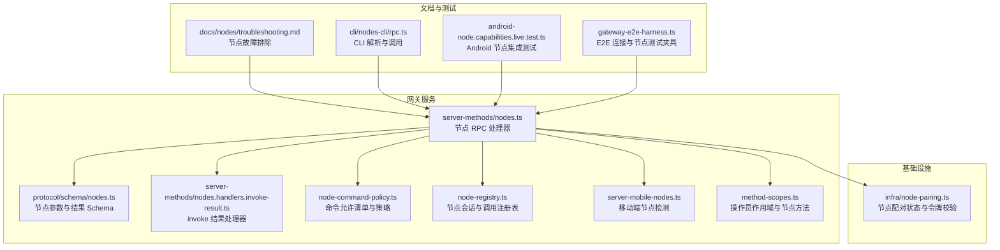
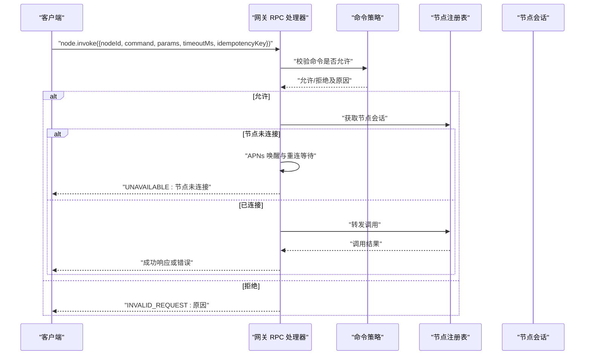
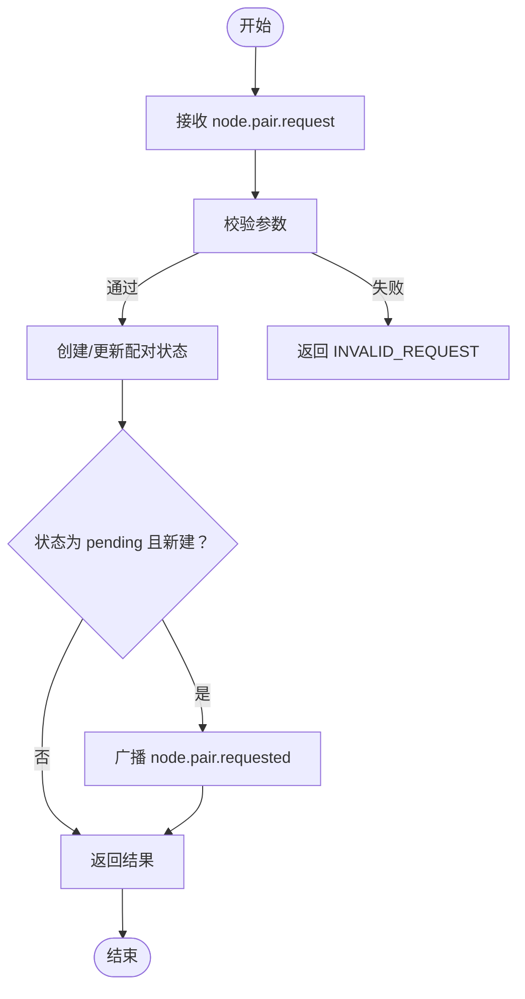
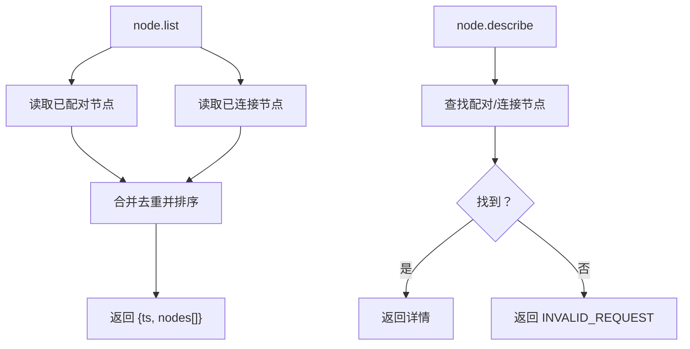
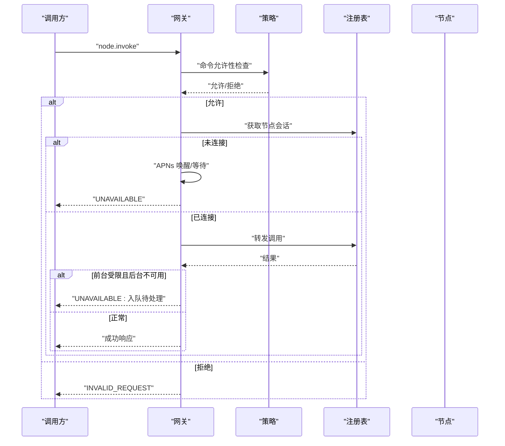
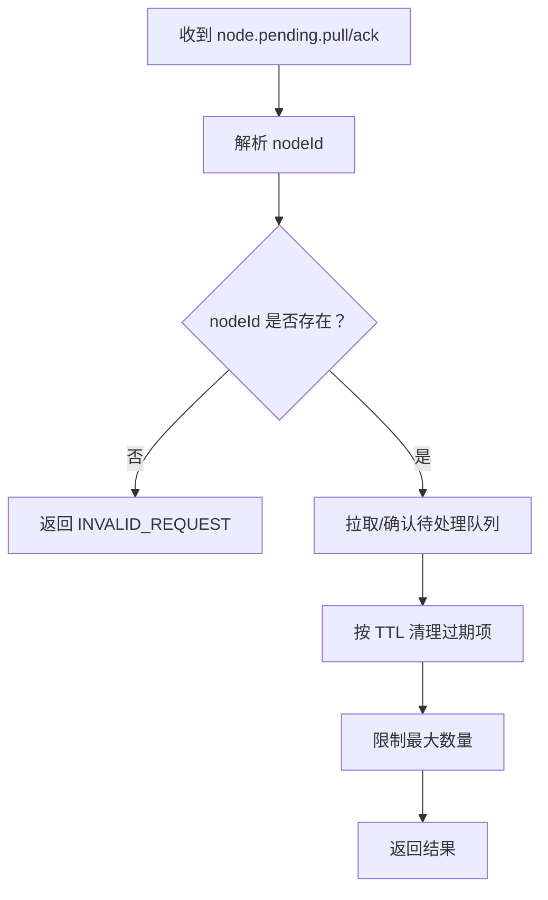
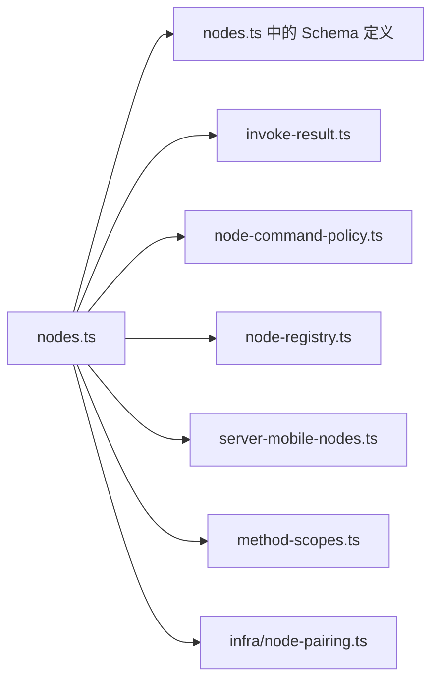

# 节点控制接口

## 目录
1. [简介](#简介)
2. [项目结构](#项目结构)
3. [核心组件](#核心组件)
4. [架构总览](#架构总览)
5. [详细组件分析](#详细组件分析)
6. [依赖关系分析](#依赖关系分析)
7. [性能考量](#性能考量)
8. [故障排除指南](#故障排除指南)
9. [结论](#结论)
10. [附录](#附录)

## 简介
本文件为 OpenClaw 节点控制系统提供的 REST API 文档，聚焦于节点配对、节点列表、节点调用与待处理工作等关键能力。文档覆盖 node.pair.*、node.list、node.invoke、node.pending.* 系列端点的完整用法，同时阐述节点认证、权限控制与状态同步机制，并提供最佳实践与故障排除建议。

## 项目结构
节点控制相关代码主要位于网关侧的 server-methods 与协议定义目录，配合节点命令策略、节点注册表、移动端节点检测与作用域控制模块协同工作。

**图表来源**
- [src/gateway/server-methods/nodes.ts](file://src/gateway/server-methods/nodes.ts#L384-L1052)
- [src/gateway/protocol/schema/nodes.ts](file://src/gateway/protocol/schema/nodes.ts#L1-L167)
- [src/gateway/server-methods/nodes.handlers.invoke-result.ts](file://src/gateway/server-methods/nodes.handlers.invoke-result.ts#L1-L72)
- [src/gateway/node-command-policy.ts](file://src/gateway/node-command-policy.ts#L1-L212)
- [src/gateway/node-registry.ts](file://src/gateway/node-registry.ts#L1-L105)
- [src/gateway/server-mobile-nodes.ts](file://src/gateway/server-mobile-nodes.ts#L1-L14)
- [src/gateway/method-scopes.ts](file://src/gateway/method-scopes.ts#L1-L30)
- [src/infra/node-pairing.ts](file://src/infra/node-pairing.ts#L146-L228)
- [docs/nodes/troubleshooting.md](file://docs/nodes/troubleshooting.md#L1-L115)
- [src/cli/nodes-cli/rpc.ts](file://src/cli/nodes-cli/rpc.ts#L75-L96)
- [src/gateway/android-node.capabilities.live.test.ts](file://src/gateway/android-node.capabilities.live.test.ts#L411-L427)
- [test/helpers/gateway-e2e-harness.ts](file://test/helpers/gateway-e2e-harness.ts#L265-L311)

**章节来源**
- [src/gateway/server-methods/nodes.ts](file://src/gateway/server-methods/nodes.ts#L384-L1052)
- [src/gateway/protocol/schema/nodes.ts](file://src/gateway/protocol/schema/nodes.ts#L1-L167)

## 核心组件
- 节点 RPC 处理器：实现 node.pair.*、node.list、node.describe、node.invoke、node.pending.*、node.event、node.canvas.capability.refresh 等方法。
- 参数与结果 Schema：定义各方法的输入输出结构与校验规则。
- 命令策略：基于平台与配置生成允许命令集合，执行命令白名单/黑名单检查。
- 节点注册表：维护连接节点会话、挂起调用与超时处理。
- 移动端节点检测：识别移动端节点，用于前台限制与唤醒策略。
- 作用域控制：区分 operator.admin、operator.read、operator.write、operator.approvals、operator.pairing 等作用域，限定节点相关方法访问。
- 配对与令牌：管理节点配对状态、令牌验证与元数据更新。

**章节来源**
- [src/gateway/server-methods/nodes.ts](file://src/gateway/server-methods/nodes.ts#L384-L1052)
- [src/gateway/node-command-policy.ts](file://src/gateway/node-command-policy.ts#L173-L211)
- [src/gateway/node-registry.ts](file://src/gateway/node-registry.ts#L38-L105)
- [src/gateway/server-mobile-nodes.ts](file://src/gateway/server-mobile-nodes.ts#L1-L14)
- [src/gateway/method-scopes.ts](file://src/gateway/method-scopes.ts#L1-L30)
- [src/infra/node-pairing.ts](file://src/infra/node-pairing.ts#L146-L228)

## 架构总览
下图展示节点控制的关键交互：客户端通过网关发起节点 RPC，网关根据作用域与策略进行鉴权与命令校验，必要时唤醒节点并转发调用，最终返回结果或待处理队列。

**图表来源**
- [src/gateway/server-methods/nodes.ts](file://src/gateway/server-methods/nodes.ts#L776-L1004)
- [src/gateway/node-command-policy.ts](file://src/gateway/node-command-policy.ts#L191-L211)
- [src/gateway/node-registry.ts](file://src/gateway/node-registry.ts#L38-L105)

## 详细组件分析

### 节点配对接口（node.pair.*）
- node.pair.request
  - 功能：请求配对新节点，支持显示名、平台、版本、能力、命令、远程 IP、静默模式等参数。
  - 校验：使用 NodePairRequestParamsSchema。
  - 广播：当状态为 pending 且新建时广播 node.pair.requested。
  - 返回：包含请求状态与创建时间等信息。
- node.pair.list
  - 功能：列出所有配对请求与已配对节点。
  - 校验：使用 NodePairListParamsSchema。
- node.pair.approve
  - 功能：批准指定请求，将请求转为已配对节点，广播 node.pair.resolved(decision=approved)。
  - 校验：使用 NodePairApproveParamsSchema。
- node.pair.reject
  - 功能：拒绝指定请求，广播 node.pair.resolved(decision=rejected)。
  - 校验：使用 NodePairRejectParamsSchema。
- node.pair.verify
  - 功能：校验节点令牌有效性。
  - 校验：使用 NodePairVerifyParamsSchema。
- node.rename
  - 功能：重命名已配对节点。
  - 校验：使用 NodeRenameParamsSchema。

**图表来源**
- [src/gateway/server-methods/nodes.ts](file://src/gateway/server-methods/nodes.ts#L385-L417)
- [src/gateway/protocol/schema/nodes.ts](file://src/gateway/protocol/schema/nodes.ts#L12-L45)
- [src/infra/node-pairing.ts](file://src/infra/node-pairing.ts#L146-L228)

**章节来源**
- [src/gateway/server-methods/nodes.ts](file://src/gateway/server-methods/nodes.ts#L385-L508)
- [src/gateway/protocol/schema/nodes.ts](file://src/gateway/protocol/schema/nodes.ts#L12-L50)
- [src/infra/node-pairing.ts](file://src/infra/node-pairing.ts#L146-L228)

### 节点列表与描述（node.list、node.describe）
- node.list
  - 功能：合并“已配对”与“已连接”的节点信息，按连接状态与名称排序，返回节点列表与时间戳。
  - 关键字段：nodeId、displayName、platform、version、coreVersion、uiVersion、deviceFamily、modelIdentifier、remoteIp、caps、commands、permissions、connectedAtMs、paired、connected。
- node.describe
  - 功能：返回单个节点的详细描述，若未知则返回 INVALID_REQUEST。

**图表来源**
- [src/gateway/server-methods/nodes.ts](file://src/gateway/server-methods/nodes.ts#L536-L615)
- [src/gateway/server-methods/nodes.ts](file://src/gateway/server-methods/nodes.ts#L617-L669)

**章节来源**
- [src/gateway/server-methods/nodes.ts](file://src/gateway/server-methods/nodes.ts#L536-L669)

### 节点调用（node.invoke）
- 输入参数
  - 必填：nodeId、command、idempotencyKey。
  - 可选：params（任意结构）、timeoutMs（毫秒）。
- 执行流程
  - 参数校验与必需项检查。
  - 若目标节点未连接，尝试通过 APNs 唤醒并等待重连；若仍不可达，返回 UNAVAILABLE。
  - 命令策略检查：结合节点声明命令与全局 allow/deny 列表判断是否允许。
  - 参数净化与转发：对 system.execApprovals.* 命令进行特殊处理。
  - 调用执行：通过节点注册表转发至节点会话。
  - 特殊错误处理：若为 iOS/Android 前台受限命令且报错为后台不可用，则入队待处理并返回可重试错误。
  - 成功：返回 &#123;ok, nodeId, command, payload/payloadJSON&#125;。
- 结果回调（node.invoke.result）
  - 仅允许来自对应节点的回调；晚到结果会被忽略并返回成功以避免噪声。

**图表来源**
- [src/gateway/server-methods/nodes.ts](file://src/gateway/server-methods/nodes.ts#L776-L1004)
- [src/gateway/server-methods/nodes.handlers.invoke-result.ts](file://src/gateway/server-methods/nodes.handlers.invoke-result.ts#L25-L72)
- [src/gateway/node-command-policy.ts](file://src/gateway/node-command-policy.ts#L191-L211)
- [src/gateway/node-registry.ts](file://src/gateway/node-registry.ts#L38-L105)

**章节来源**
- [src/gateway/server-methods/nodes.ts](file://src/gateway/server-methods/nodes.ts#L776-L1004)
- [src/gateway/server-methods/nodes.handlers.invoke-result.ts](file://src/gateway/server-methods/nodes.handlers.invoke-result.ts#L25-L72)
- [src/gateway/protocol/schema/nodes.ts](file://src/gateway/protocol/schema/nodes.ts#L66-L95)

### 待处理工作（node.pending.*）
- node.pending.pull
  - 功能：拉取当前节点的待处理动作队列，返回动作数组（含 id、command、paramsJSON、enqueuedAtMs）。
- node.pending.ack
  - 功能：确认消费部分或全部待处理动作，返回剩余数量。
  - 参数：ids 数组，去重后过滤空值。
- 内部机制
  - TTL：默认 10 分钟，超过则清理。
  - 最大数量：每节点最多保留 64 条。
  - 前台受限命令在后台不可用时自动入队，便于前台恢复后重试。

**图表来源**
- [src/gateway/server-methods/nodes.ts](file://src/gateway/server-methods/nodes.ts#L716-L775)
- [src/gateway/server-methods/nodes.ts](file://src/gateway/server-methods/nodes.ts#L141-L198)

**章节来源**
- [src/gateway/server-methods/nodes.ts](file://src/gateway/server-methods/nodes.ts#L716-L775)
- [src/gateway/server-methods/nodes.ts](file://src/gateway/server-methods/nodes.ts#L141-L198)

### Canvas 能力刷新（node.canvas.capability.refresh）
- 功能：为当前节点会话签发临时 Canvas 能力令牌与带作用域的 Host URL，延长有效期。
- 限制：仅在具备 canvasHostUrl 的节点会话可用。

**章节来源**
- [src/gateway/server-methods/nodes.ts](file://src/gateway/server-methods/nodes.ts#L671-L715)

### 节点事件（node.event）
- 功能：接收节点上报事件（如通知变化），网关内部处理并广播相关系统事件。
- 参数：event（事件名）、payload 或 payloadJSON。

**章节来源**
- [src/gateway/server-methods/nodes.ts](file://src/gateway/server-methods/nodes.ts#L1006-L1051)

## 依赖关系分析

**图表来源**
- [src/gateway/server-methods/nodes.ts](file://src/gateway/server-methods/nodes.ts#L1-L1071)
- [src/gateway/protocol/schema/nodes.ts](file://src/gateway/protocol/schema/nodes.ts#L1-L167)
- [src/gateway/server-methods/nodes.handlers.invoke-result.ts](file://src/gateway/server-methods/nodes.handlers.invoke-result.ts#L1-L72)
- [src/gateway/node-command-policy.ts](file://src/gateway/node-command-policy.ts#L1-L212)
- [src/gateway/node-registry.ts](file://src/gateway/node-registry.ts#L1-L105)
- [src/gateway/server-mobile-nodes.ts](file://src/gateway/server-mobile-nodes.ts#L1-L14)
- [src/gateway/method-scopes.ts](file://src/gateway/method-scopes.ts#L1-L30)
- [src/infra/node-pairing.ts](file://src/infra/node-pairing.ts#L146-L228)

**章节来源**
- [src/gateway/server-methods/nodes.ts](file://src/gateway/server-methods/nodes.ts#L1-L1071)

## 性能考量
- 唤醒与重连
  - 采用节流与指数退避策略，避免频繁唤醒造成 APNs 压力。
  - 提供两阶段等待窗口，提升唤醒成功率。
- 待处理队列
  - TTL 与上限控制，防止内存膨胀。
  - 前台受限命令自动入队，减少失败重试成本。
- 命令策略
  - 基于平台与配置的预计算允许集，降低运行时决策开销。

[本节为通用指导，无需具体文件分析]

## 故障排除指南
- 常见症状与定位
  - 节点可见但工具调用失败：优先检查配对与前台权限。
  - 前台受限命令报错：在前台恢复后重试或等待待处理队列自动恢复。
  - 系统执行被拒：检查 exec approvals 与 allowlist 配置。
- 快速检查清单
  - openclaw nodes status / describe
  - openclaw approvals get / allowlist add
  - openclaw logs --follow
- 权限矩阵与错误码
  - 不同平台的相机、屏幕录制、位置、系统执行等权限差异较大，需按平台核对。
  - 常见错误码：NODE_BACKGROUND_UNAVAILABLE、*_PERMISSION_REQUIRED、LOCATION_*、SYSTEM_RUN_DENIED 等。

**章节来源**
- [docs/nodes/troubleshooting.md](file://docs/nodes/troubleshooting.md#L1-L115)

## 结论
本文档梳理了 OpenClaw 节点控制的核心 RPC 接口与工作机制，明确了配对、列表、调用与待处理队列的使用方式，并解释了命令策略、权限控制与状态同步的关键要点。建议在生产环境中结合作用域控制与日志监控，持续优化命令白名单与前台唤醒策略，以获得稳定可靠的节点控制体验。

[本节为总结，无需具体文件分析]

## 附录

### API 方法与参数速查
- node.pair.request
  - 参数：nodeId、displayName、platform、version、coreVersion、uiVersion、deviceFamily、modelIdentifier、caps、commands、remoteIp、silent。
  - 返回：请求状态与创建时间等。
- node.pair.list
  - 参数：无。
  - 返回：pending 与 paired 列表。
- node.pair.approve/reject
  - 参数：requestId。
  - 返回：批准/拒绝结果。
- node.pair.verify
  - 参数：nodeId、token。
  - 返回：校验结果。
- node.rename
  - 参数：nodeId、displayName。
  - 返回：更新后的节点信息。
- node.list
  - 参数：无。
  - 返回：&#123;ts, nodes[]&#125;。
- node.describe
  - 参数：nodeId。
  - 返回：节点详细信息。
- node.invoke
  - 参数：nodeId、command、params、timeoutMs、idempotencyKey。
  - 返回：成功或错误（含待处理队列入队场景）。
- node.invoke.result
  - 参数：id、nodeId、ok、payload/payloadJSON、error。
  - 返回：成功或忽略（晚到结果）。
- node.pending.pull
  - 参数：无。
  - 返回：待处理动作列表。
- node.pending.ack
  - 参数：ids[]。
  - 返回：ackedIds 与 remainingCount。
- node.canvas.capability.refresh
  - 参数：无。
  - 返回：canvasCapability、expiresAtMs、canvasHostUrl。

**章节来源**
- [src/gateway/server-methods/nodes.ts](file://src/gateway/server-methods/nodes.ts#L385-L1052)
- [src/gateway/protocol/schema/nodes.ts](file://src/gateway/protocol/schema/nodes.ts#L12-L167)

### 认证与权限控制
- 作用域
  - operator.admin、operator.read、operator.write、operator.approvals、operator.pairing。
  - 节点相关方法（如 node.invoke.result、node.event、node.pending.*、node.canvas.*）默认允许节点角色调用。
- 命令策略
  - 基于平台与配置的允许/拒绝清单，结合节点声明命令进行二次校验。
- 配对与令牌
  - 通过 node.pair.verify 校验节点令牌，确保节点身份可信。

**章节来源**
- [src/gateway/method-scopes.ts](file://src/gateway/method-scopes.ts#L1-L30)
- [src/gateway/node-command-policy.ts](file://src/gateway/node-command-policy.ts#L173-L211)
- [src/infra/node-pairing.ts](file://src/infra/node-pairing.ts#L203-L215)

### 状态同步机制
- 节点列表合并
  - 合并“已配对”与“已连接”节点，优先使用连接态信息，缺失字段回退至配对态。
- 前台限制与待处理
  - 对 iOS/Android 的前台受限命令，后台不可用时自动入队，前台恢复后由 node.pending.* 机制处理。
- 移动端检测
  - 通过平台前缀识别移动端节点，辅助前台限制与唤醒策略。

**章节来源**
- [src/gateway/server-methods/nodes.ts](file://src/gateway/server-methods/nodes.ts#L536-L615)
- [src/gateway/server-methods/nodes.ts](file://src/gateway/server-methods/nodes.ts#L120-L139)
- [src/gateway/server-mobile-nodes.ts](file://src/gateway/server-mobile-nodes.ts#L1-L14)

### 使用示例与最佳实践
- 使用 CLI 获取节点列表与配对信息，再进行节点选择与调用。
- 对高风险命令（如摄像头、屏幕录制、系统执行）谨慎放行，结合前台限制与待处理队列。
- 在移动端场景下，优先确保节点处于前台，避免后台不可用导致的失败。

**章节来源**
- [src/cli/nodes-cli/rpc.ts](file://src/cli/nodes-cli/rpc.ts#L75-L96)
- [src/gateway/android-node.capabilities.live.test.ts](file://src/gateway/android-node.capabilities.live.test.ts#L411-L427)
- [test/helpers/gateway-e2e-harness.ts](file://test/helpers/gateway-e2e-harness.ts#L265-L311)