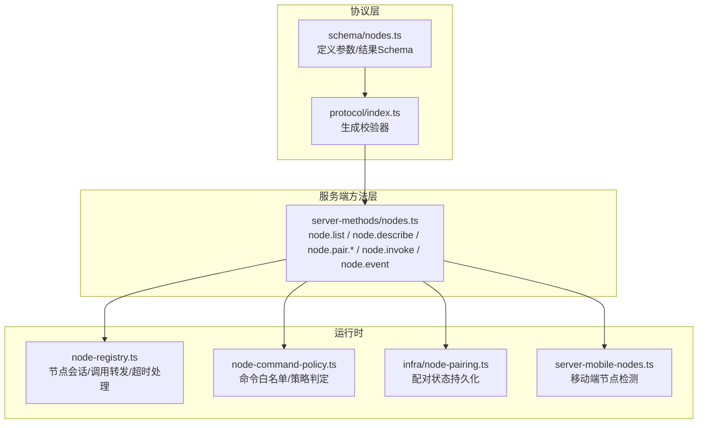
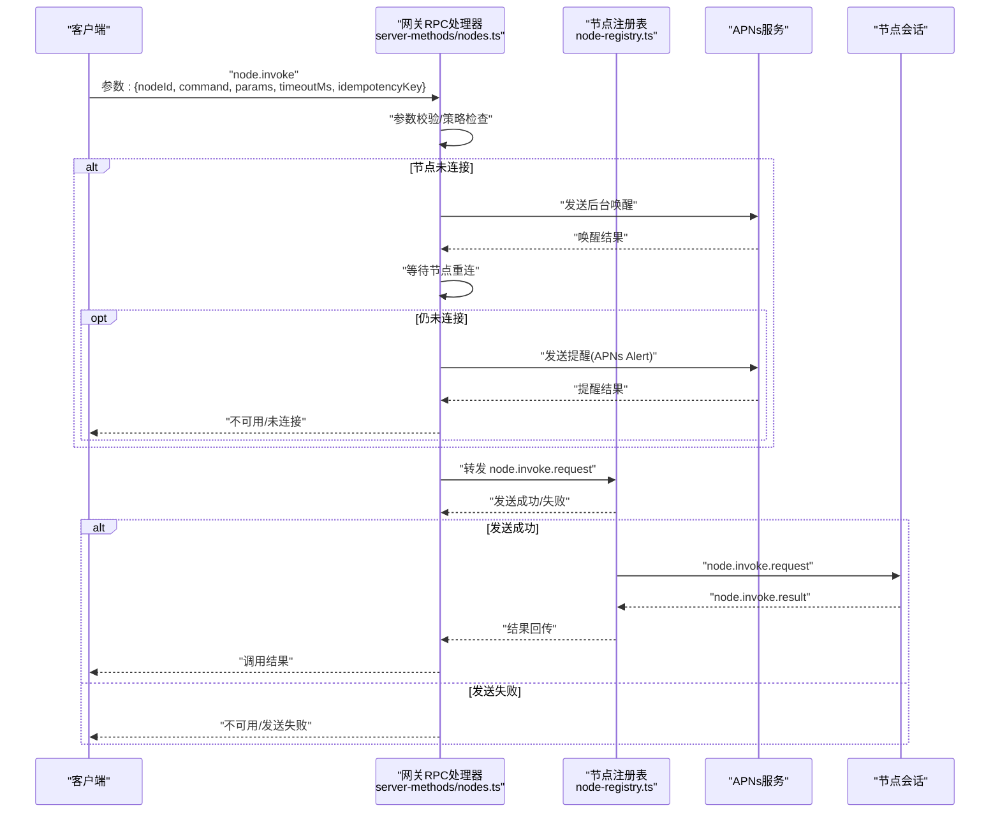
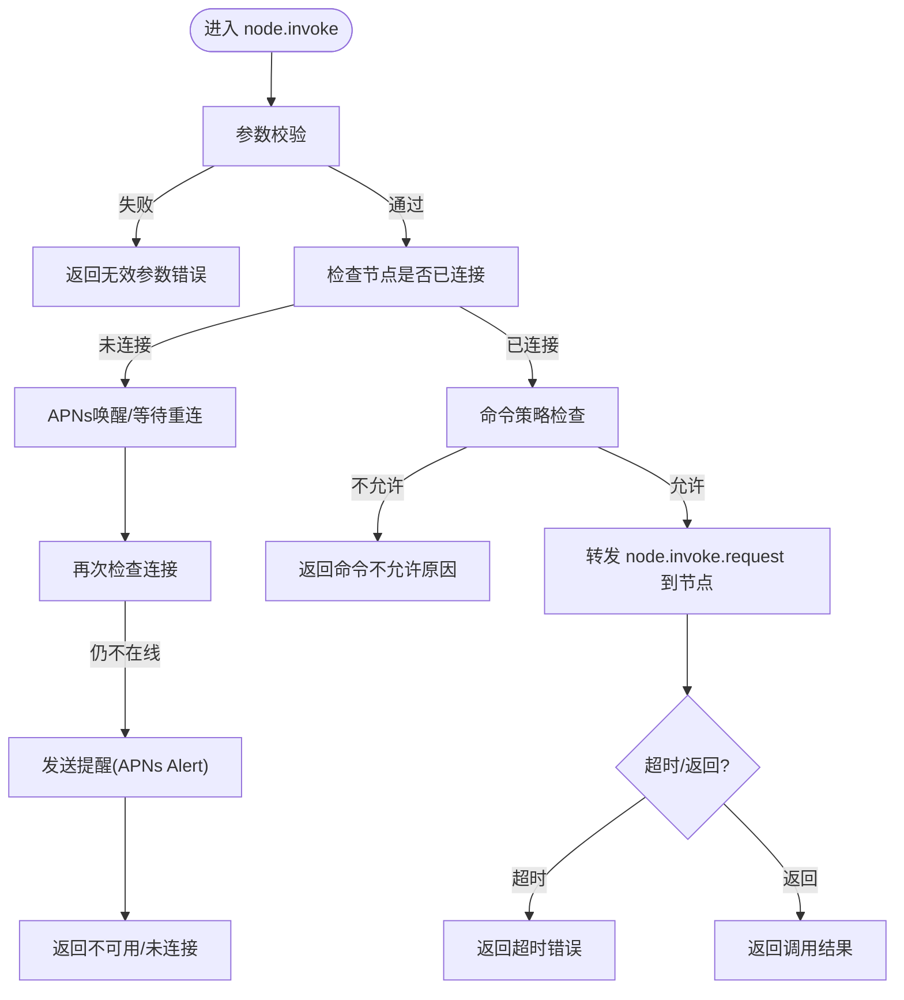
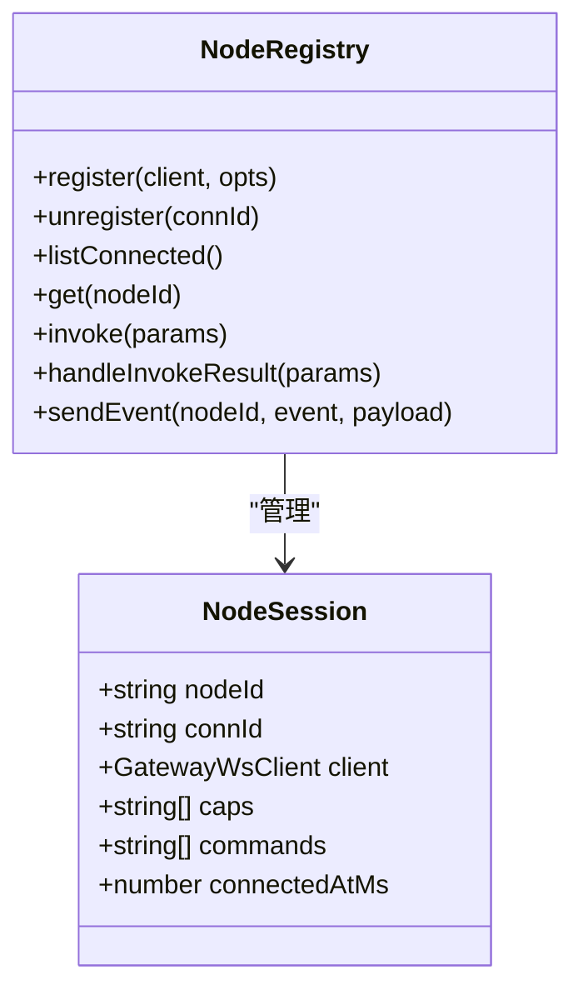
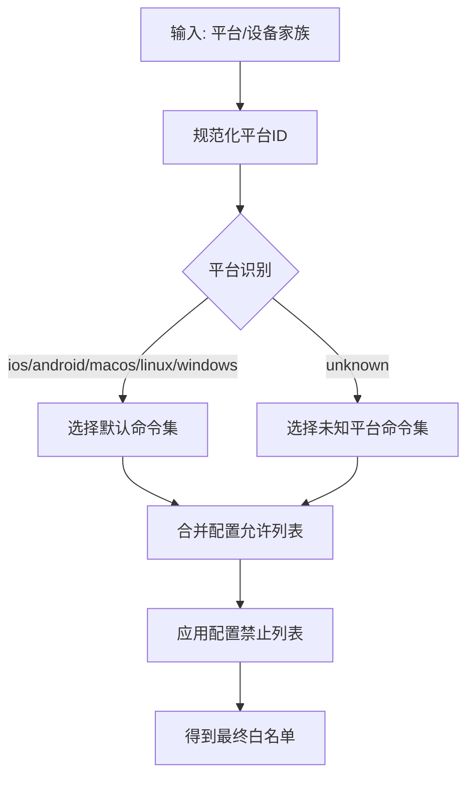
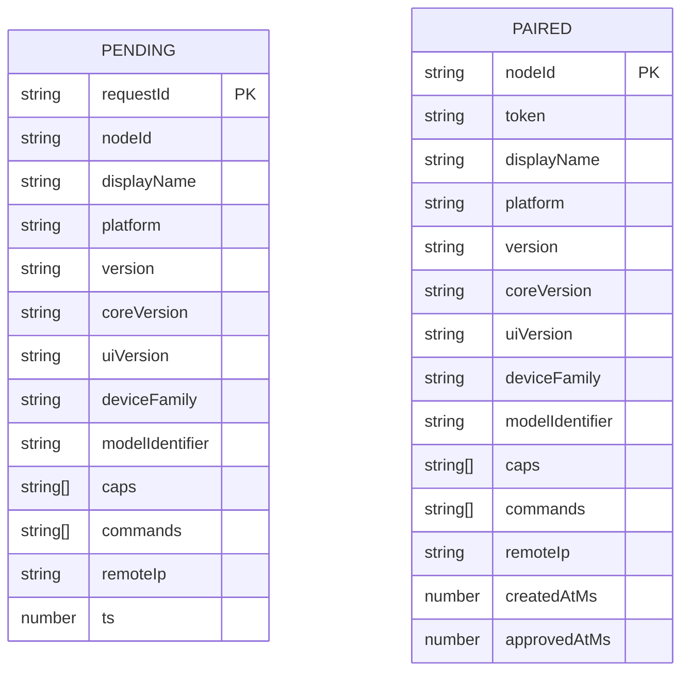
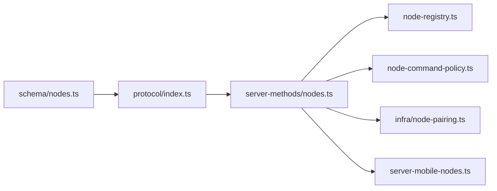

# 节点管理接口

## 目录
1. [简介](#简介)
2. [项目结构](#项目结构)
3. [核心组件](#核心组件)
4. [架构总览](#架构总览)
5. [详细组件分析](#详细组件分析)
6. [依赖关系分析](#依赖关系分析)
7. [性能与资源限制](#性能与资源限制)
8. [故障排查指南](#故障排查指南)
9. [结论](#结论)
10. [附录：REST API 定义](#附录rest-api-定义)

## 简介
本文件面向OpenClaw节点管理系统，聚焦于“节点管理”相关REST风格方法（以内部RPC命名约定体现），包括节点列表查询、节点描述、节点配对、节点重命名、节点事件上报、节点远程调用以及待处理动作队列等能力。文档从系统架构、数据流、处理逻辑、错误处理与性能优化等方面进行深入解析，并提供可视化图示与排障建议。

## 项目结构
围绕节点管理的关键代码分布在以下模块：
- 协议层：定义参数与结果的Schema及校验器
- 服务端方法层：实现各节点管理RPC方法
- 节点注册表：维护已连接节点会话与调用结果回传
- 命令策略：基于平台与配置的命令白名单判定
- 配对状态：持久化存储节点配对请求与配对结果
- 移动端辅助：检测是否存在移动端节点

**图表来源**
- [src/gateway/protocol/schema/nodes.ts](file://src/gateway/protocol/schema/nodes.ts#L1-L167)
- [src/gateway/protocol/index.ts](file://src/gateway/protocol/index.ts#L276-L305)
- [src/gateway/server-methods/nodes.ts](file://src/gateway/server-methods/nodes.ts#L384-L1052)
- [src/gateway/node-registry.ts](file://src/gateway/node-registry.ts#L38-L210)
- [src/gateway/node-command-policy.ts](file://src/gateway/node-command-policy.ts#L173-L211)
- [src/infra/node-pairing.ts](file://src/infra/node-pairing.ts#L87-L228)
- [src/gateway/server-mobile-nodes.ts](file://src/gateway/server-mobile-nodes.ts#L1-L14)

**章节来源**
- [src/gateway/server-methods/nodes.ts](file://src/gateway/server-methods/nodes.ts#L384-L1052)
- [src/gateway/protocol/schema/nodes.ts](file://src/gateway/protocol/schema/nodes.ts#L1-L167)
- [src/gateway/protocol/index.ts](file://src/gateway/protocol/index.ts#L276-L305)
- [src/gateway/node-registry.ts](file://src/gateway/node-registry.ts#L38-L210)
- [src/gateway/node-command-policy.ts](file://src/gateway/node-command-policy.ts#L173-L211)
- [src/infra/node-pairing.ts](file://src/infra/node-pairing.ts#L87-L228)
- [src/gateway/server-mobile-nodes.ts](file://src/gateway/server-mobile-nodes.ts#L1-L14)

## 核心组件
- 节点RPC处理器集合：集中实现节点管理相关RPC方法，负责参数校验、权限与策略判定、APNs唤醒、节点会话转发、待处理动作队列等。
- 节点注册表：维护已连接节点会话，负责将“node.invoke.request”事件发送到节点，并在超时或收到结果后清理挂起调用。
- 命令策略：根据节点平台与配置计算命令白名单，确保仅允许声明且被允许的命令执行。
- 配对状态管理：持久化存储待审批与已配对节点信息，支持列表、审批、拒绝、校验令牌等。
- 移动端节点检测：判断当前是否有iOS/Android节点在线，用于策略与提示。

**章节来源**
- [src/gateway/server-methods/nodes.ts](file://src/gateway/server-methods/nodes.ts#L384-L1052)
- [src/gateway/node-registry.ts](file://src/gateway/node-registry.ts#L38-L210)
- [src/gateway/node-command-policy.ts](file://src/gateway/node-command-policy.ts#L173-L211)
- [src/infra/node-pairing.ts](file://src/infra/node-pairing.ts#L87-L228)
- [src/gateway/server-mobile-nodes.ts](file://src/gateway/server-mobile-nodes.ts#L1-L14)

## 架构总览
下图展示“node.invoke”的完整调用链路：客户端发起RPC，服务端进行参数校验与策略检查，必要时通过APNs唤醒目标节点，等待节点重新连接后转发调用请求；节点返回结果后由注册表回调，最终响应客户端。

**图表来源**
- [src/gateway/server-methods/nodes.ts](file://src/gateway/server-methods/nodes.ts#L776-L1004)
- [src/gateway/node-registry.ts](file://src/gateway/node-registry.ts#L107-L155)

**章节来源**
- [src/gateway/server-methods/nodes.ts](file://src/gateway/server-methods/nodes.ts#L776-L1004)
- [src/gateway/node-registry.ts](file://src/gateway/node-registry.ts#L107-L155)

## 详细组件分析

### 节点RPC处理器（node.list / node.describe / node.pair.* / node.invoke / node.event）
- 参数与结果Schema：统一使用TypeBox定义，配合编译后的校验器进行输入验证。
- 方法职责：
  - node.list：合并“已配对”与“已连接”节点信息，输出节点清单。
  - node.describe：按nodeId返回节点详细信息。
  - node.pair.request/list/approve/reject/verify：配对生命周期管理。
  - node.rename：重命名已配对节点显示名。
  - node.invoke：远程调用节点命令，含APNs唤醒、策略检查、待处理队列与结果回传。
  - node.event：接收节点侧上报事件并交由事件处理器处理。
  - node.pending.pull/ack：节点侧拉取与确认待处理动作。
  - node.canvas.capability.refresh：刷新Canvas能力令牌与作用域URL。

**图表来源**
- [src/gateway/server-methods/nodes.ts](file://src/gateway/server-methods/nodes.ts#L776-L1004)
- [src/gateway/node-command-policy.ts](file://src/gateway/node-command-policy.ts#L191-L211)

**章节来源**
- [src/gateway/server-methods/nodes.ts](file://src/gateway/server-methods/nodes.ts#L536-L1052)
- [src/gateway/protocol/schema/nodes.ts](file://src/gateway/protocol/schema/nodes.ts#L66-L95)
- [src/gateway/protocol/index.ts](file://src/gateway/protocol/index.ts#L296-L305)

### 节点注册表（NodeRegistry）
- 维护节点会话映射、连接断开时清理挂起调用。
- 提供invoke方法：构造请求ID、序列化参数、发送事件、设置超时并等待结果。
- 处理结果回传：匹配请求ID与节点ID，清理挂起项并resolve。

**图表来源**
- [src/gateway/node-registry.ts](file://src/gateway/node-registry.ts#L38-L210)

**章节来源**
- [src/gateway/node-registry.ts](file://src/gateway/node-registry.ts#L38-L210)

### 命令策略与白名单
- 基于平台前缀与设备家族识别平台类型。
- 默认命令集按平台划分，支持通过配置追加/屏蔽命令。
- 最终以“声明命令集合 ∩ 白名单 − 黑名单”作为可执行命令集。

**图表来源**
- [src/gateway/node-command-policy.ts](file://src/gateway/node-command-policy.ts#L173-L211)

**章节来源**
- [src/gateway/node-command-policy.ts](file://src/gateway/node-command-policy.ts#L173-L211)

### 配对状态管理
- 支持请求、列出、审批、拒绝、校验令牌、更新元数据等。
- 使用原子写入保证状态一致性，带过期清理。

**图表来源**
- [src/infra/node-pairing.ts](file://src/infra/node-pairing.ts#L87-L228)

**章节来源**
- [src/infra/node-pairing.ts](file://src/infra/node-pairing.ts#L87-L228)

### 移动端节点检测
- 检测已连接节点中是否存在iOS/iPadOS/Android平台节点，用于策略提示或行为调整。

**章节来源**
- [src/gateway/server-mobile-nodes.ts](file://src/gateway/server-mobile-nodes.ts#L1-L14)

## 依赖关系分析
- 协议Schema与校验器：所有RPC方法均依赖编译后的校验器进行参数验证。
- RPC处理器依赖注册表进行节点会话转发与结果回传。
- 命令策略依赖配置与节点声明命令集合进行判定。
- 配对状态管理独立于RPC处理器，但RPC处理器在配对相关方法中调用其API。
- 移动端检测用于影响唤醒策略与提示。

**图表来源**
- [src/gateway/protocol/schema/nodes.ts](file://src/gateway/protocol/schema/nodes.ts#L1-L167)
- [src/gateway/protocol/index.ts](file://src/gateway/protocol/index.ts#L276-L305)
- [src/gateway/server-methods/nodes.ts](file://src/gateway/server-methods/nodes.ts#L384-L1052)
- [src/gateway/node-registry.ts](file://src/gateway/node-registry.ts#L38-L210)
- [src/gateway/node-command-policy.ts](file://src/gateway/node-command-policy.ts#L173-L211)
- [src/infra/node-pairing.ts](file://src/infra/node-pairing.ts#L87-L228)
- [src/gateway/server-mobile-nodes.ts](file://src/gateway/server-mobile-nodes.ts#L1-L14)

**章节来源**
- [src/gateway/server-methods/nodes.ts](file://src/gateway/server-methods/nodes.ts#L384-L1052)
- [src/gateway/protocol/index.ts](file://src/gateway/protocol/index.ts#L276-L305)

## 性能与资源限制
- 节点唤醒节流：短时间内多次唤醒会被节流，避免频繁触发推送。
- 重连轮询：分阶段等待节点重连，避免阻塞。
- 待处理动作队列：限制每个节点的最大待处理数量，设置TTL，防止内存膨胀。
- 调用超时：默认超时时间可由调用方指定，超时后清理挂起项。
- 命令策略缓存：白名单计算基于平台与配置，减少重复计算成本。

**章节来源**
- [src/gateway/server-methods/nodes.ts](file://src/gateway/server-methods/nodes.ts#L50-L56)
- [src/gateway/server-methods/nodes.ts](file://src/gateway/server-methods/nodes.ts#L141-L179)
- [src/gateway/node-registry.ts](file://src/gateway/node-registry.ts#L138-L154)

## 故障排查指南
- “nodeId和/或命令缺失”：检查调用参数，确保nodeId与command非空。
- “节点未连接”：确认节点是否在线；若离线，检查APNs配置与推送状态；必要时发送提醒。
- “命令不允许”：核对节点声明命令集合与白名单配置，确认命令是否在允许列表且未被屏蔽。
- “发送失败”：检查节点会话是否仍在；若断开，注册表会清理挂起调用并返回错误。
- “超时”：适当增大调用超时时间，或优化节点端处理逻辑。
- “待处理动作队列”：节点回到前台后，可通过“node.pending.pull/ack”拉取并确认待处理动作。

**章节来源**
- [src/gateway/server-methods/nodes.ts](file://src/gateway/server-methods/nodes.ts#L776-L1004)
- [src/gateway/node-registry.ts](file://src/gateway/node-registry.ts#L113-L154)

## 结论
OpenClaw的节点管理以清晰的协议Schema、严格的参数校验、灵活的命令策略与稳健的节点会话管理为核心，结合APNs唤醒与待处理队列机制，实现了跨平台、可扩展的节点远程控制能力。通过合理的资源限制与超时策略，系统在可用性与性能之间取得平衡。

## 附录：REST API 定义
说明：以下为内部RPC方法的语义化REST风格描述，便于理解与对接。实际调用请参考RPC处理器与Schema定义。

- GET /nodes
  - 功能：列出所有节点（已配对+已连接），按连接状态与显示名排序
  - 查询参数：无
  - 返回：节点数组（包含nodeId、displayName、platform、version、capabilities、commands、权限、连接状态等）

- GET /nodes/&#123;nodeId&#125;
  - 功能：获取指定节点的详细信息
  - 路径参数：nodeId
  - 返回：节点详情对象（同上字段）

- POST /nodes/pair/request
  - 功能：请求与节点建立配对
  - 请求体：nodeId、displayName、platform、version、coreVersion、uiVersion、deviceFamily、modelIdentifier、caps、commands、permissions、remoteIp、silent等
  - 返回：请求状态（如pending）与创建时间

- GET /nodes/pair/list
  - 功能：列出待审批与已配对节点
  - 返回：&#123; pending[], paired[] &#125;

- POST /nodes/pair/approve
  - 功能：批准某条配对请求
  - 请求体：requestId
  - 返回：批准结果与节点信息

- POST /nodes/pair/reject
  - 功能：拒绝某条配对请求
  - 请求体：requestId
  - 返回：拒绝结果

- POST /nodes/pair/verify
  - 功能：校验节点令牌
  - 请求体：nodeId、token
  - 返回：校验结果与节点信息

- POST /nodes/rename
  - 功能：重命名已配对节点显示名
  - 请求体：nodeId、displayName
  - 返回：更新后的nodeId与displayName

- POST /nodes/invoke
  - 功能：远程调用节点命令
  - 请求体：nodeId、command、params（可选）、timeoutMs（可选）、idempotencyKey（可选）
  - 返回：调用结果（ok、payload、payloadJSON、error）

- POST /nodes/event
  - 功能：接收节点上报事件
  - 请求体：event、payload 或 payloadJSON
  - 返回：成功标记

- GET /nodes/pending/pull
  - 功能：节点拉取待处理动作
  - 返回：actions数组（包含id、command、paramsJSON、enqueuedAtMs）

- POST /nodes/pending/ack
  - 功能：节点确认待处理动作
  - 请求体：ids（待确认动作ID数组）
  - 返回：ackedIds与remainingCount

- POST /nodes/canvas/capability/refresh
  - 功能：刷新Canvas能力令牌与作用域URL
  - 返回：canvasCapability、canvasCapabilityExpiresAtMs、canvasHostUrl

**章节来源**
- [src/gateway/server-methods/nodes.ts](file://src/gateway/server-methods/nodes.ts#L536-L1052)
- [src/gateway/protocol/schema/nodes.ts](file://src/gateway/protocol/schema/nodes.ts#L12-L167)
- [docs/cli/nodes.md](file://docs/cli/nodes.md#L25-L53)