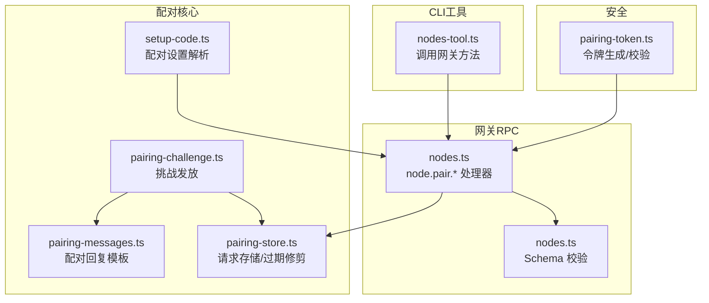
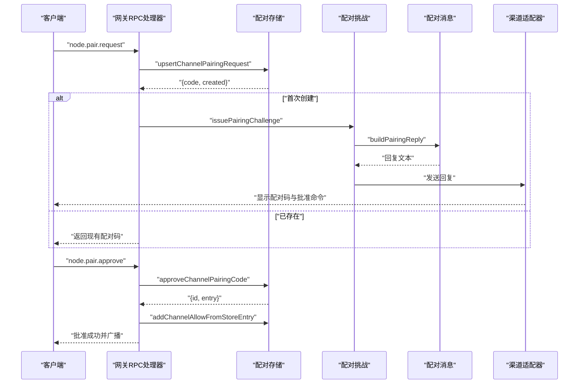
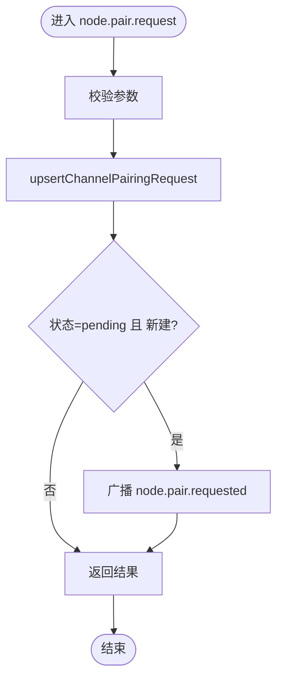
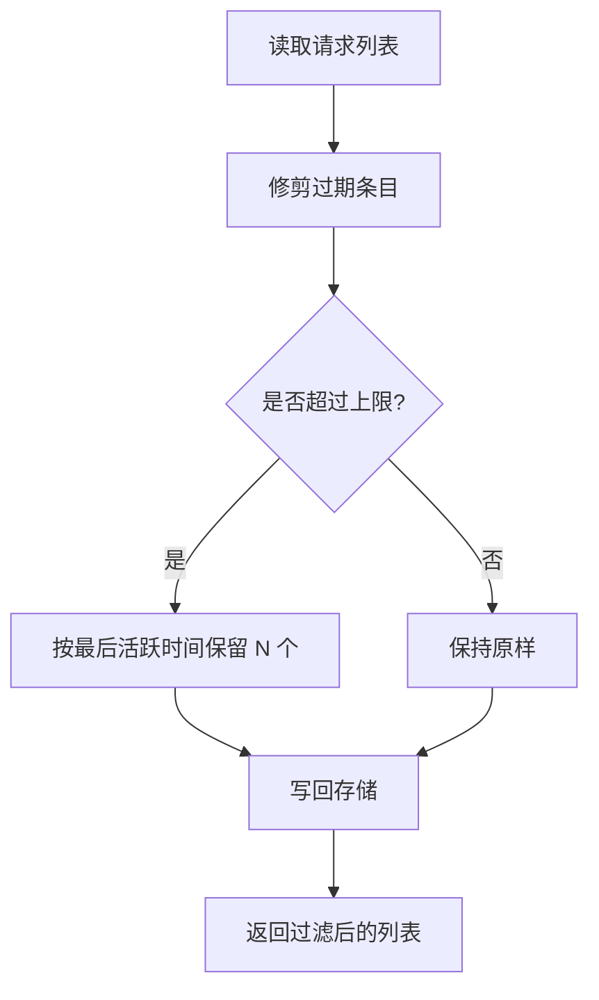
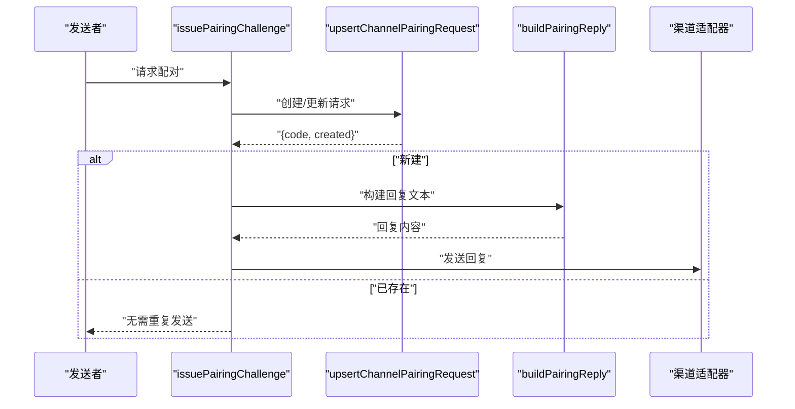
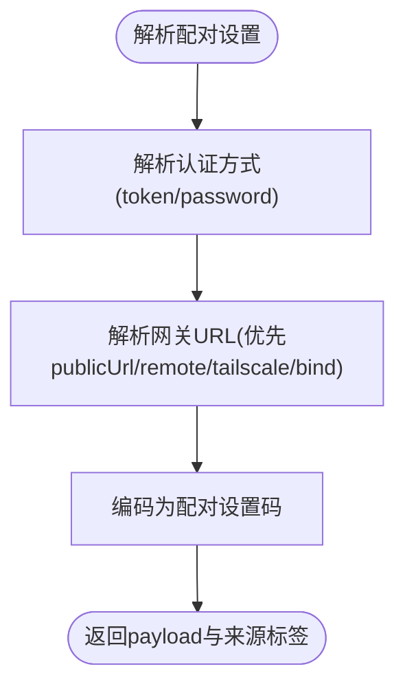
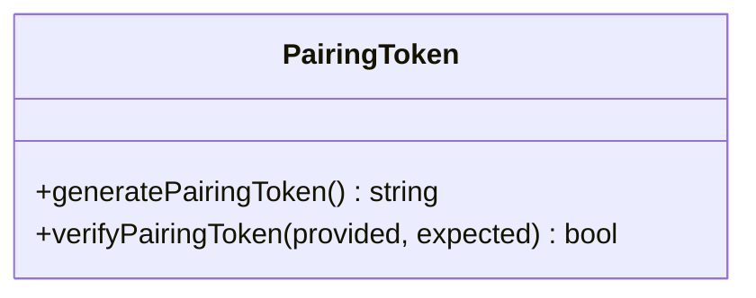
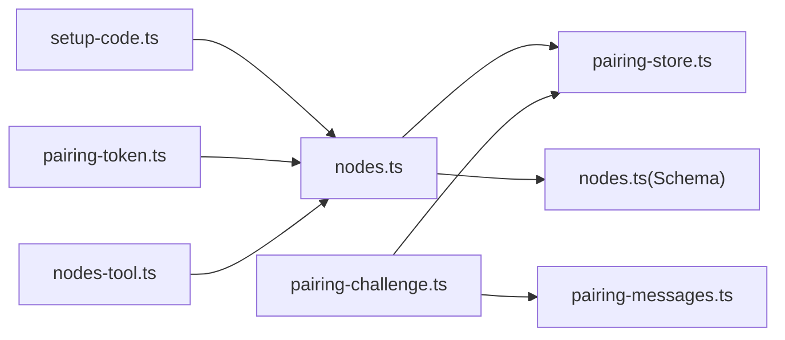

# 节点配对接口

## 目录
1. [简介](#简介)
2. [项目结构](#项目结构)
3. [核心组件](#核心组件)
4. [架构总览](#架构总览)
5. [详细组件分析](#详细组件分析)
6. [依赖关系分析](#依赖关系分析)
7. [性能考量](#性能考量)
8. [故障排除指南](#故障排除指南)
9. [结论](#结论)
10. [附录](#附录)

## 简介
本文件为 OpenClaw 节点配对系统的详细 API 文档，覆盖 node.pair.* 系列端点的完整实现，包括：
- 节点发现与列表
- 配对请求处理（请求、批准、拒绝）
- 认证令牌颁发与验证
- 配对状态管理与持久化
- 安全机制、超时与重试策略
- 客户端实现示例与排障指南

目标读者：后端开发者、集成工程师、CLI 用户与插件作者。

## 项目结构
与节点配对直接相关的代码主要分布在以下模块：
- 网关 RPC 处理器：定义并实现 node.pair.* 方法
- 协议 Schema：定义参数校验规则
- 配对存储与挑战：管理待配对请求、生成配对码、回复消息构建
- 设备配对设置：生成配对二维码或一次性链接
- 安全工具：令牌生成与安全比较
- CLI 工具：通过工具调用网关方法进行配对操作

**图表来源**
- [src/gateway/server-methods/nodes.ts](file://src/gateway/server-methods/nodes.ts#L384-L508)
- [src/gateway/protocol/schema/nodes.ts](file://src/gateway/protocol/schema/nodes.ts#L12-L45)
- [src/pairing/pairing-challenge.ts](file://src/pairing/pairing-challenge.ts#L24-L48)
- [src/pairing/pairing-store.ts](file://src/pairing/pairing-store.ts#L13-L26)
- [src/pairing/pairing-messages.ts](file://src/pairing/pairing-messages.ts#L4-L20)
- [src/pairing/setup-code.ts](file://src/pairing/setup-code.ts#L357-L397)
- [src/infra/pairing-token.ts](file://src/infra/pairing-token.ts#L6-L12)
- [src/agents/tools/nodes-tool.ts](file://src/agents/tools/nodes-tool.ts#L186-L219)

**章节来源**
- [src/gateway/server-methods/nodes.ts](file://src/gateway/server-methods/nodes.ts#L384-L508)
- [src/gateway/protocol/schema/nodes.ts](file://src/gateway/protocol/schema/nodes.ts#L12-L45)
- [src/pairing/pairing-challenge.ts](file://src/pairing/pairing-challenge.ts#L24-L48)
- [src/pairing/pairing-store.ts](file://src/pairing/pairing-store.ts#L13-L26)
- [src/pairing/pairing-messages.ts](file://src/pairing/pairing-messages.ts#L4-L20)
- [src/pairing/setup-code.ts](file://src/pairing/setup-code.ts#L357-L397)
- [src/infra/pairing-token.ts](file://src/infra/pairing-token.ts#L6-L12)
- [src/agents/tools/nodes-tool.ts](file://src/agents/tools/nodes-tool.ts#L186-L219)

## 核心组件
- 网关 RPC 处理器：实现 node.pair.request、node.pair.list、node.pair.approve、node.pair.reject、node.pair.verify 等方法，并在批准/拒绝时广播事件。
- 配对存储：基于文件锁的 JSON 存储，支持过期修剪、数量上限、账户隔离与允许来源白名单。
- 配对挑战：统一的“创建若无则发”流程，确保每个发送者仅生成一次配对码并发送回复。
- 配对消息：标准化的配对回复文本，包含配对码与批准命令提示。
- 配对设置：从配置中解析网关 URL、认证方式（token/password），并编码为可分享的配对设置。
- 安全令牌：随机生成安全令牌，使用常量时间比较防止时序攻击。
- CLI 工具：封装对 node.pair.* 的调用，便于自动化与运维。

**章节来源**
- [src/gateway/server-methods/nodes.ts](file://src/gateway/server-methods/nodes.ts#L384-L508)
- [src/pairing/pairing-store.ts](file://src/pairing/pairing-store.ts#L657-L796)
- [src/pairing/pairing-challenge.ts](file://src/pairing/pairing-challenge.ts#L24-L48)
- [src/pairing/pairing-messages.ts](file://src/pairing/pairing-messages.ts#L4-L20)
- [src/pairing/setup-code.ts](file://src/pairing/setup-code.ts#L357-L397)
- [src/infra/pairing-token.ts](file://src/infra/pairing-token.ts#L6-L12)
- [src/agents/tools/nodes-tool.ts](file://src/agents/tools/nodes-tool.ts#L186-L219)

## 架构总览
下图展示 node.pair.* 端到端流程：客户端发起配对请求，网关生成/查询配对码，渠道适配器发送回复；管理员批准后写入允许来源白名单并广播结果。

**图表来源**
- [src/gateway/server-methods/nodes.ts](file://src/gateway/server-methods/nodes.ts#L384-L460)
- [src/pairing/pairing-challenge.ts](file://src/pairing/pairing-challenge.ts#L24-L48)
- [src/pairing/pairing-messages.ts](file://src/pairing/pairing-messages.ts#L4-L20)
- [src/pairing/pairing-store.ts](file://src/pairing/pairing-store.ts#L697-L852)

## 详细组件分析

### 网关 RPC：node.pair.* 端点
- node.pair.request
  - 参数：设备标识、显示名、平台、版本信息、能力与命令清单、远端 IP、静默模式等
  - 行为：校验参数后调用配对请求接口，若状态为 pending 且新建，则广播 node.pair.requested 事件
  - 返回：包含请求状态、是否新建、请求详情
- node.pair.list
  - 参数：空
  - 行为：列出当前通道下的所有待配对请求（按创建时间排序）
  - 返回：请求列表
- node.pair.approve
  - 参数：requestId
  - 行为：批准请求，移除待配对条目并写入允许来源白名单，广播 node.pair.resolved（决策=approved）
  - 返回：批准结果
- node.pair.reject
  - 参数：requestId
  - 行为：拒绝请求，移除待配对条目并广播 node.pair.resolved（决策=rejected）
  - 返回：拒绝结果
- node.pair.verify
  - 参数：nodeId、token
  - 行为：校验令牌有效性
  - 返回：校验结果

**图表来源**
- [src/gateway/server-methods/nodes.ts](file://src/gateway/server-methods/nodes.ts#L384-L418)

**章节来源**
- [src/gateway/server-methods/nodes.ts](file://src/gateway/server-methods/nodes.ts#L384-L508)
- [src/gateway/protocol/schema/nodes.ts](file://src/gateway/protocol/schema/nodes.ts#L12-L45)

### 配对存储与状态管理
- 过期策略：默认 60 分钟 TTL，启动时自动修剪过期条目
- 数量上限：默认最多保留 3 条待配对请求，超出按最后活跃时间淘汰最旧项
- 文件锁：读写均使用文件锁，避免并发冲突
- 账户隔离：支持按 accountId 过滤与合并历史遗留允许来源
- 允许来源白名单：批准后将设备 id 写入对应通道的 allowFrom 存储

**图表来源**
- [src/pairing/pairing-store.ts](file://src/pairing/pairing-store.ts#L657-L695)

**章节来源**
- [src/pairing/pairing-store.ts](file://src/pairing/pairing-store.ts#L13-L26)
- [src/pairing/pairing-store.ts](file://src/pairing/pairing-store.ts#L657-L796)

### 配对挑战与消息
- issuePairingChallenge：若发送者无配对请求则创建并生成唯一配对码，随后构建标准回复文本并通过渠道适配器发送
- buildPairingReply：生成包含配对码与批准命令的回复文本
- 回复错误回调：发送失败时触发 onReplyError 回调

**图表来源**
- [src/pairing/pairing-challenge.ts](file://src/pairing/pairing-challenge.ts#L24-L48)
- [src/pairing/pairing-messages.ts](file://src/pairing/pairing-messages.ts#L4-L20)

**章节来源**
- [src/pairing/pairing-challenge.ts](file://src/pairing/pairing-challenge.ts#L24-L48)
- [src/pairing/pairing-messages.ts](file://src/pairing/pairing-messages.ts#L4-L20)

### 配对设置与分享
- resolvePairingSetupFromConfig：根据配置解析网关 URL 与认证方式（token/password），支持强制安全方案、优先远程 URL、Tailscale Serve/Funnel 等
- encodePairingSetupCode：将 URL、token 或 password 编码为安全的 Base64URL 字符串，便于分享

**图表来源**
- [src/pairing/setup-code.ts](file://src/pairing/setup-code.ts#L357-L397)

**章节来源**
- [src/pairing/setup-code.ts](file://src/pairing/setup-code.ts#L357-L397)

### 安全机制与令牌
- 令牌生成：使用安全随机源生成 32 字节，编码为 base64url
- 令牌校验：使用常量时间比较函数，避免时序侧信道
- 配对码：8 字符人类友好型字符集，区分大小写，避免易混淆字符

**图表来源**
- [src/infra/pairing-token.ts](file://src/infra/pairing-token.ts#L6-L12)

**章节来源**
- [src/infra/pairing-token.ts](file://src/infra/pairing-token.ts#L6-L12)

### CLI 与工具集成
- nodes-tool：封装对 node.list、node.describe、node.pair.list/approve/reject 的调用，便于自动化与运维脚本

**章节来源**
- [src/agents/tools/nodes-tool.ts](file://src/agents/tools/nodes-tool.ts#L186-L219)

## 依赖关系分析
- 网关 RPC 依赖配对存储与消息模板
- 配对挑战依赖消息模板与渠道适配器
- 配对设置依赖配置解析与网络接口
- 安全令牌独立于其他模块，被 RPC 层用于令牌校验

**图表来源**
- [src/gateway/server-methods/nodes.ts](file://src/gateway/server-methods/nodes.ts#L384-L508)
- [src/pairing/pairing-challenge.ts](file://src/pairing/pairing-challenge.ts#L24-L48)
- [src/pairing/pairing-store.ts](file://src/pairing/pairing-store.ts#L657-L796)
- [src/pairing/pairing-messages.ts](file://src/pairing/pairing-messages.ts#L4-L20)
- [src/pairing/setup-code.ts](file://src/pairing/setup-code.ts#L357-L397)
- [src/infra/pairing-token.ts](file://src/infra/pairing-token.ts#L6-L12)
- [src/agents/tools/nodes-tool.ts](file://src/agents/tools/nodes-tool.ts#L186-L219)

**章节来源**
- [src/gateway/server-methods/nodes.ts](file://src/gateway/server-methods/nodes.ts#L384-L508)
- [src/pairing/pairing-challenge.ts](file://src/pairing/pairing-challenge.ts#L24-L48)
- [src/pairing/pairing-store.ts](file://src/pairing/pairing-store.ts#L657-L796)
- [src/pairing/pairing-messages.ts](file://src/pairing/pairing-messages.ts#L4-L20)
- [src/pairing/setup-code.ts](file://src/pairing/setup-code.ts#L357-L397)
- [src/infra/pairing-token.ts](file://src/infra/pairing-token.ts#L6-L12)
- [src/agents/tools/nodes-tool.ts](file://src/agents/tools/nodes-tool.ts#L186-L219)

## 性能考量
- 文件锁重试：默认最多重试 10 次，指数退避，最大单次等待约 10 秒，避免高并发下的锁竞争
- 过期修剪与上限：启动时自动清理过期条目并限制数量，降低存储膨胀
- 广播事件：仅在新建 pending 请求或批准/拒绝时广播，减少冗余事件
- 常量时间比较：令牌校验使用安全比较，避免时序攻击但不影响性能

[本节为通用指导，不涉及具体文件分析]

## 故障排除指南
常见问题与排查步骤：
- 无法获取配对码
  - 检查渠道适配器是否正确发送回复
  - 确认 issuePairingChallenge 是否返回 created=true
  - 查看 onReplyError 回调日志
- 批准无效
  - 确认 requestId 正确且未过期
  - 检查批准后是否写入 allowFrom 白名单
  - 关注 node.pair.resolved 广播事件
- 超时与重试
  - 配对请求默认 60 分钟过期，超过上限会自动裁剪
  - 文件锁默认重试 10 次，若仍失败请检查磁盘权限与并发访问
- 认证失败
  - 确认网关认证模式与配置一致（token/password）
  - 使用 resolvePairingSetupFromConfig 校验 URL 与凭据解析结果

**章节来源**
- [src/pairing/pairing-challenge.ts](file://src/pairing/pairing-challenge.ts#L24-L48)
- [src/pairing/pairing-store.ts](file://src/pairing/pairing-store.ts#L13-L26)
- [src/pairing/pairing-store.ts](file://src/pairing/pairing-store.ts#L697-L852)
- [src/pairing/setup-code.ts](file://src/pairing/setup-code.ts#L357-L397)

## 结论
node.pair.* 系列端点提供了完整的节点配对生命周期管理：从请求、审批到令牌验证与状态持久化。通过严格的过期与上限策略、文件锁保护与安全令牌比较，系统在可用性与安全性之间取得平衡。配合标准化的消息模板与配置解析，用户可在多种渠道与环境下完成节点配对。

[本节为总结性内容，不涉及具体文件分析]

## 附录

### API 参考概览
- node.pair.request
  - 方法：node.pair.request
  - 参数：nodeId、displayName、platform、version、coreVersion、uiVersion、deviceFamily、modelIdentifier、caps、commands、remoteIp、silent
  - 返回：status（pending/ok）、created（布尔）、requestId、code（可选）
- node.pair.list
  - 方法：node.pair.list
  - 参数：空
  - 返回：请求列表（按创建时间排序）
- node.pair.approve
  - 方法：node.pair.approve
  - 参数：requestId
  - 返回：批准结果（含节点信息）
- node.pair.reject
  - 方法：node.pair.reject
  - 参数：requestId
  - 返回：拒绝结果（含节点 id）
- node.pair.verify
  - 方法：node.pair.verify
  - 参数：nodeId、token
  - 返回：校验结果（布尔）

**章节来源**
- [src/gateway/server-methods/nodes.ts](file://src/gateway/server-methods/nodes.ts#L384-L508)
- [src/gateway/protocol/schema/nodes.ts](file://src/gateway/protocol/schema/nodes.ts#L12-L45)

### 错误码说明
- INVALID_REQUEST：请求参数非法或未知的 requestId/nodeId
- UNAVAILABLE：资源不可用（如 Canvas 主机不可用）
- 其他：由底层校验器与响应工具抛出的标准错误

**章节来源**
- [src/gateway/server-methods/nodes.ts](file://src/gateway/server-methods/nodes.ts#L26-L39)
- [src/gateway/server-methods/nodes.ts](file://src/gateway/server-methods/nodes.ts#L446-L447)

### 客户端实现示例（路径参考）
- 发起配对请求
  - 调用：node.pair.request
  - 参数：包含设备标识与可选元数据
  - 参考路径：[src/gateway/server-methods/nodes.ts](file://src/gateway/server-methods/nodes.ts#L384-L418)
- 列出待配对请求
  - 调用：node.pair.list
  - 参考路径：[src/gateway/server-methods/nodes.ts](file://src/gateway/server-methods/nodes.ts#L419-L431)
- 批准配对请求
  - 调用：node.pair.approve
  - 参考路径：[src/gateway/server-methods/nodes.ts](file://src/gateway/server-methods/nodes.ts#L433-L460)
- 拒绝配对请求
  - 调用：node.pair.reject
  - 参考路径：[src/gateway/server-methods/nodes.ts](file://src/gateway/server-methods/nodes.ts#L462-L489)
- 验证令牌
  - 调用：node.pair.verify
  - 参考路径：[src/gateway/server-methods/nodes.ts](file://src/gateway/server-methods/nodes.ts#L491-L508)
- CLI 工具调用
  - 参考路径：[src/agents/tools/nodes-tool.ts](file://src/agents/tools/nodes-tool.ts#L186-L219)