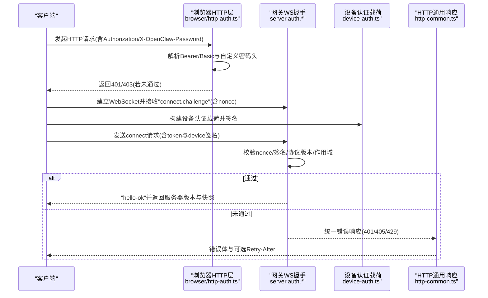
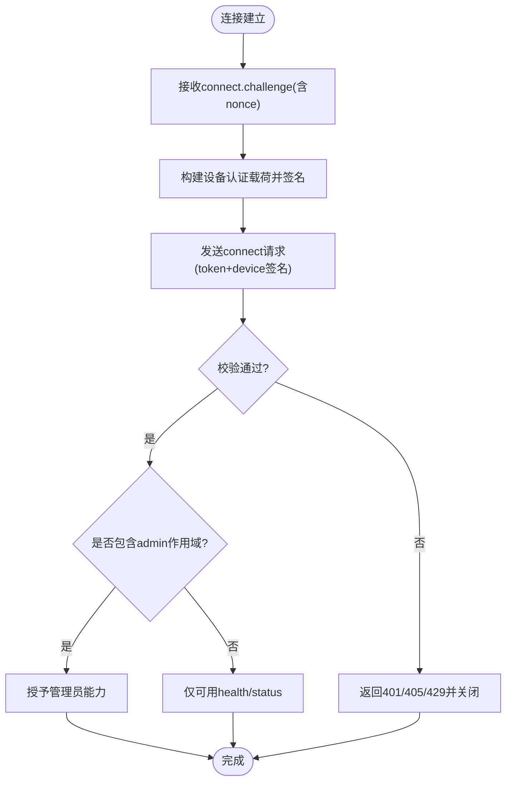
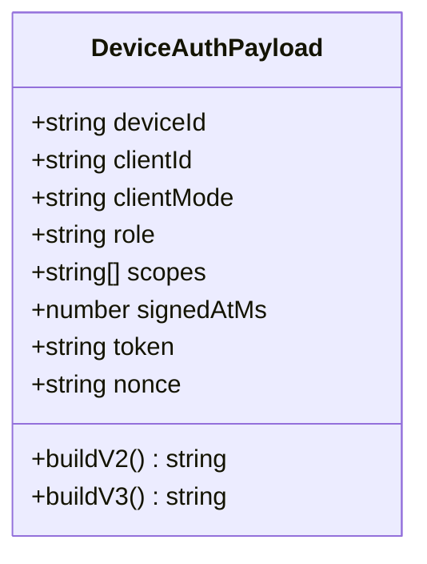
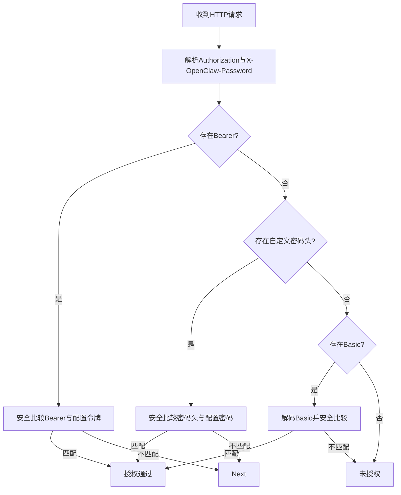
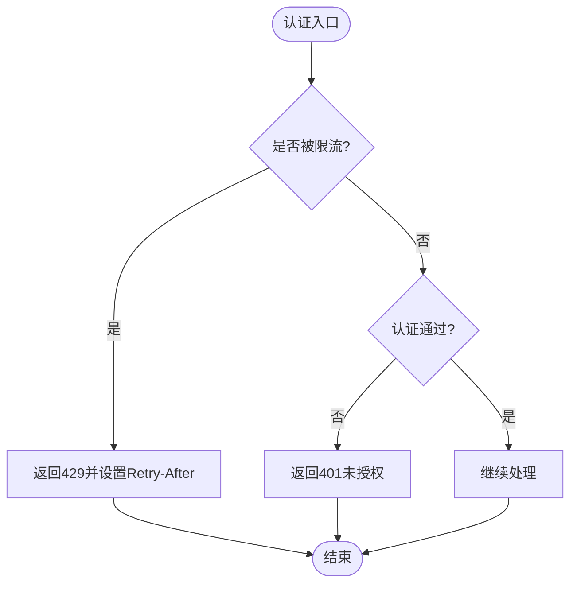
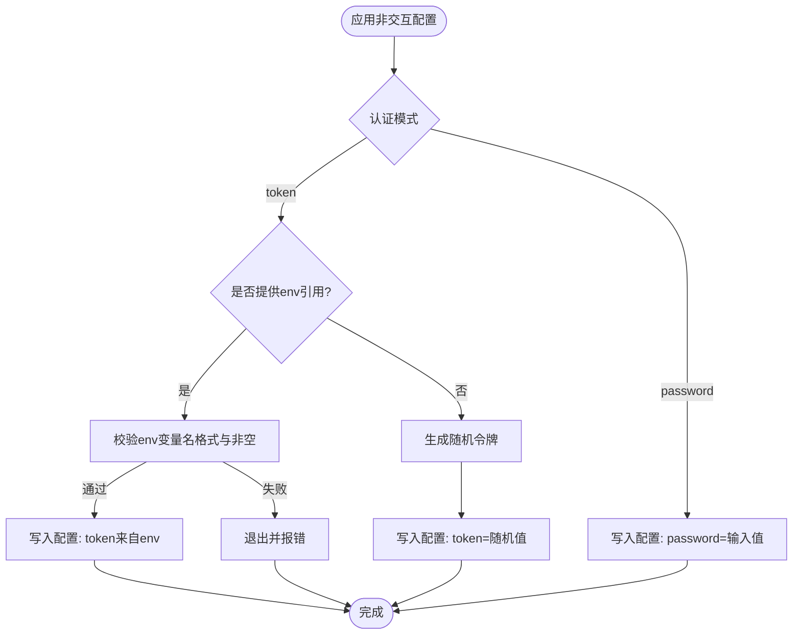
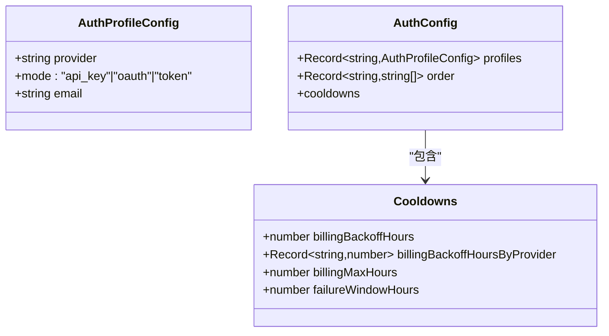
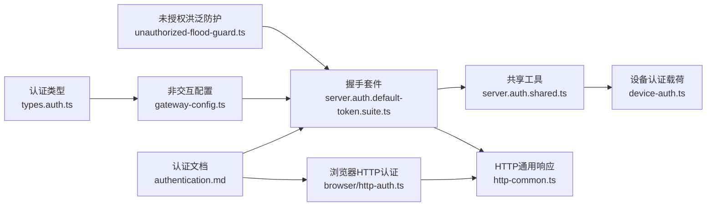

# 认证和授权接口

## 目录
1. [简介](#简介)
2. [项目结构](#项目结构)
3. [核心组件](#核心组件)
4. [架构总览](#架构总览)
5. [详细组件分析](#详细组件分析)
6. [依赖关系分析](#依赖关系分析)
7. [性能考量](#性能考量)
8. [故障排查指南](#故障排查指南)
9. [结论](#结论)

## 简介
本文件面向OpenClaw认证与授权系统，聚焦于网关侧的连接认证、令牌管理与权限控制机制，覆盖以下主题：
- API密钥与OAuth配置语义与健康状态
- 网关连接握手流程与设备签名认证
- 浏览器HTTP请求的认证校验
- 网关HTTP端点的统一错误响应与速率限制
- 安全最佳实践、密钥轮换与访问控制实现建议

## 项目结构
围绕认证与授权的关键代码分布在如下模块：
- 网关测试与握手：用于验证默认令牌认证、设备签名、握手超时、作用域与错误细节码
- 设备认证载荷构建：用于生成可签名的设备认证字符串
- 浏览器HTTP认证：解析Authorization头与自定义密码头，进行安全比较
- 网关HTTP通用响应：统一401/429/405等错误响应
- 引导配置：非交互式设置网关认证模式（token/password）、绑定地址与端口
- 配置类型：认证配置与凭据模式定义
- 文档：认证与凭据管理的高层说明

```mermaid
graph TB
subgraph "网关服务"
WS["WebSocket握手<br/>server.auth.*"]
HTTP["HTTP通用响应<br/>http-common.ts"]
DEV["设备认证载荷<br/>device-auth.ts"]
FLOOD["未授权洪泛防护<br/>unauthorized-flood-guard.ts"]
end
subgraph "浏览器"
BHTTP["浏览器HTTP认证<br/>browser/http-auth.ts"]
end
subgraph "引导与配置"
ONBOARD["非交互式网关配置<br/>onboard-non-interactive/gateway-config.ts"]
TYPES["认证类型定义<br/>config/types.auth.ts"]
end
DOC["认证文档<br/>docs/gateway/authentication.md"]
WS --> DEV
WS --> HTTP
WS --> FLOOD
BHTTP --> HTTP
ONBOARD --> WS
ONBOARD --> TYPES
DOC --> WS
DOC --> BHTTP
```

**图表来源**
- [src/gateway/server.auth.default-token.suite.ts](file://src/gateway/server.auth.default-token.suite.ts#L1-L415)
- [src/gateway/server.auth.shared.ts](file://src/gateway/server.auth.shared.ts#L1-L397)
- [src/gateway/device-auth.ts](file://src/gateway/device-auth.ts#L1-L55)
- [src/gateway/http-common.ts](file://src/gateway/http-common.ts#L36-L71)
- [src/gateway/server.ws-connection/unauthorized-flood-guard.ts](file://src/gateway/server.ws-connection/unauthorized-flood-guard.ts#L1-L69)
- [src/browser/http-auth.ts](file://src/browser/http-auth.ts#L1-L64)
- [src/commands/onboard-non-interactive/local/gateway-config.ts](file://src/commands/onboard-non-interactive/local/gateway-config.ts#L1-L159)
- [src/config/types.auth.ts](file://src/config/types.auth.ts#L1-L30)
- [docs/gateway/authentication.md](file://docs/gateway/authentication.md#L1-L56)

**章节来源**
- [src/gateway/server.auth.default-token.suite.ts](file://src/gateway/server.auth.default-token.suite.ts#L1-L415)
- [src/gateway/server.auth.shared.ts](file://src/gateway/server.auth.shared.ts#L1-L397)
- [src/browser/http-auth.ts](file://src/browser/http-auth.ts#L1-L64)
- [src/gateway/http-common.ts](file://src/gateway/http-common.ts#L36-L71)
- [src/gateway/device-auth.ts](file://src/gateway/device-auth.ts#L1-L55)
- [src/commands/onboard-non-interactive/local/gateway-config.ts](file://src/commands/onboard-non-interactive/local/gateway-config.ts#L1-L159)
- [src/config/types.auth.ts](file://src/config/types.auth.ts#L1-L30)
- [docs/gateway/authentication.md](file://docs/gateway/authentication.md#L1-L56)

## 核心组件
- 默认令牌认证套件：验证握手挑战、协议版本、设备签名、作用域与错误细节码
- 共享测试工具：建立WebSocket连接、读取挑战nonce、构造带签名的设备载荷
- 设备认证载荷：标准化设备身份、客户端元数据、角色、作用域、签名时间戳、令牌与随机数
- 浏览器HTTP认证：支持Bearer令牌与Basic密码，以及自定义密码头的安全比较
- HTTP通用响应：统一401/405/429等错误响应，支持Retry-After
- 未授权洪泛防护：统计未授权尝试，按阈值关闭连接并可选日志
- 非交互式网关配置：选择认证模式（token/password），解析环境变量引用，生成随机令牌
- 认证配置类型：定义凭据模式（api_key/oauth/token）与冷却策略

**章节来源**
- [src/gateway/server.auth.default-token.suite.ts](file://src/gateway/server.auth.default-token.suite.ts#L26-L415)
- [src/gateway/server.auth.shared.ts](file://src/gateway/server.auth.shared.ts#L61-L397)
- [src/gateway/device-auth.ts](file://src/gateway/device-auth.ts#L20-L55)
- [src/browser/http-auth.ts](file://src/browser/http-auth.ts#L37-L64)
- [src/gateway/http-common.ts](file://src/gateway/http-common.ts#L36-L71)
- [src/gateway/server.ws-connection/unauthorized-flood-guard.ts](file://src/gateway/server.ws-connection/unauthorized-flood-guard.ts#L18-L69)
- [src/commands/onboard-non-interactive/local/gateway-config.ts](file://src/commands/onboard-non-interactive/local/gateway-config.ts#L59-L133)
- [src/config/types.auth.ts](file://src/config/types.auth.ts#L1-L30)

## 架构总览
下图展示从浏览器到网关的认证与授权交互路径，包括握手挑战、设备签名、作用域判定与错误处理。

**图表来源**
- [src/browser/http-auth.ts](file://src/browser/http-auth.ts#L37-L64)
- [src/gateway/server.auth.default-token.suite.ts](file://src/gateway/server.auth.default-token.suite.ts#L287-L313)
- [src/gateway/server.auth.shared.ts](file://src/gateway/server.auth.shared.ts#L61-L199)
- [src/gateway/device-auth.ts](file://src/gateway/device-auth.ts#L20-L55)
- [src/gateway/http-common.ts](file://src/gateway/http-common.ts#L36-L71)

## 详细组件分析

### 组件A：默认令牌认证与握手流程
- 功能要点
  - 握手挑战：首次连接发送“connect.challenge”，包含nonce
  - 协议版本：客户端需满足最小/最大协议范围
  - 设备签名：客户端基于载荷签名，服务端校验nonce与签名
  - 作用域与管理员权限：空作用域仅可用health/status；携带admin作用域才授予管理员能力
  - 错误细节码：针对nonce缺失/不匹配、参数无效、协议不兼容等场景返回明确错误码
  - 超时与静默关闭：握手超时后自动关闭连接
- 关键行为
  - 无设备直连：operator可直连，node需设备
  - 令牌校验：错误令牌返回未授权
  - 速率限制：可通过配置启用并触发429

**图表来源**
- [src/gateway/server.auth.default-token.suite.ts](file://src/gateway/server.auth.default-token.suite.ts#L287-L313)
- [src/gateway/server.auth.shared.ts](file://src/gateway/server.auth.shared.ts#L61-L199)
- [src/gateway/http-common.ts](file://src/gateway/http-common.ts#L36-L71)

**章节来源**
- [src/gateway/server.auth.default-token.suite.ts](file://src/gateway/server.auth.default-token.suite.ts#L26-L415)
- [src/gateway/server.auth.shared.ts](file://src/gateway/server.auth.shared.ts#L61-L199)

### 组件B：设备认证载荷与签名
- 数据结构
  - v2/v3载荷字段：版本、设备ID、客户端ID/模式、角色、作用域列表、签名时间戳、令牌、nonce、平台/设备族（v3）
  - 作用域以逗号拼接，便于服务端解析
- 安全要点
  - 载荷中包含nonce，防止重放
  - 使用设备私钥对载荷签名，服务端用公钥验证
  - 支持可选令牌字段，用于一次性共享令牌或临时令牌

**图表来源**
- [src/gateway/device-auth.ts](file://src/gateway/device-auth.ts#L4-L55)

**章节来源**
- [src/gateway/device-auth.ts](file://src/gateway/device-auth.ts#L20-L55)

### 组件C：浏览器HTTP认证
- 支持的认证方式
  - Bearer令牌：Authorization头以Bearer开头
  - Basic密码：Authorization头以Basic编码，提取冒号后的密码
  - 自定义密码头：X-OpenClaw-Password，用于特定场景
- 安全比较
  - 使用安全相等比较函数，避免时序攻击
- 返回结果
  - 任一方式匹配即视为已授权；否则返回未授权

**图表来源**
- [src/browser/http-auth.ts](file://src/browser/http-auth.ts#L8-L64)

**章节来源**
- [src/browser/http-auth.ts](file://src/browser/http-auth.ts#L1-L64)

### 组件D：HTTP通用响应与速率限制
- 统一错误响应
  - 401未授权：sendUnauthorized
  - 405方法不允许：sendMethodNotAllowed
  - 429速率限制：sendRateLimited，支持Retry-After
  - 400无效请求：sendInvalidRequest
- 速率限制与洪泛防护
  - 未授权尝试计数，超过阈值关闭连接
  - 可配置日志频率与关闭阈值

**图表来源**
- [src/gateway/http-common.ts](file://src/gateway/http-common.ts#L36-L71)
- [src/gateway/server.ws-connection/unauthorized-flood-guard.ts](file://src/gateway/server.ws-connection/unauthorized-flood-guard.ts#L18-L69)

**章节来源**
- [src/gateway/http-common.ts](file://src/gateway/http-common.ts#L36-L71)
- [src/gateway/server.ws-connection/unauthorized-flood-guard.ts](file://src/gateway/server.ws-connection/unauthorized-flood-guard.ts#L1-L69)

### 组件E：非交互式网关认证配置
- 支持的认证模式
  - token：共享令牌或环境变量引用
  - password：固定密码
- 环境变量引用
  - 支持通过OPENCLAW_GATEWAY_TOKEN等环境变量注入令牌
  - 若提供env引用，则必须同时满足格式与非空约束
- 令牌生成
  - 未显式提供时生成随机令牌
- 绑定与端口
  - Tailscale开启时强制loopback绑定
  - Funnel模式强制password认证

**图表来源**
- [src/commands/onboard-non-interactive/local/gateway-config.ts](file://src/commands/onboard-non-interactive/local/gateway-config.ts#L59-L133)

**章节来源**
- [src/commands/onboard-non-interactive/local/gateway-config.ts](file://src/commands/onboard-non-interactive/local/gateway-config.ts#L1-L159)

### 组件F：认证配置类型与凭据模式
- 凭据模式
  - api_key：静态提供方API密钥
  - oauth：可刷新的OAuth凭据（access/refresh/expires）
  - token：静态Bearer风格令牌（可过期；不可刷新）
- 冷却策略
  - 默认与按提供方的计费回退小时数
  - 失败窗口与上限

**图表来源**
- [src/config/types.auth.ts](file://src/config/types.auth.ts#L1-L30)

**章节来源**
- [src/config/types.auth.ts](file://src/config/types.auth.ts#L1-L30)

## 依赖关系分析
- 组件耦合
  - 握手流程依赖设备认证载荷构建与共享测试工具
  - HTTP响应统一由http-common提供，被握手与浏览器HTTP认证共同使用
  - 未授权洪泛防护独立于握手，但与速率限制策略协同
- 外部集成
  - 引导配置影响网关启动参数与认证模式
  - 文档提供高层认证与凭据管理说明

**图表来源**
- [src/gateway/server.auth.default-token.suite.ts](file://src/gateway/server.auth.default-token.suite.ts#L1-L415)
- [src/gateway/server.auth.shared.ts](file://src/gateway/server.auth.shared.ts#L1-L397)
- [src/gateway/device-auth.ts](file://src/gateway/device-auth.ts#L1-L55)
- [src/gateway/http-common.ts](file://src/gateway/http-common.ts#L36-L71)
- [src/browser/http-auth.ts](file://src/browser/http-auth.ts#L1-L64)
- [src/gateway/server.ws-connection/unauthorized-flood-guard.ts](file://src/gateway/server.ws-connection/unauthorized-flood-guard.ts#L1-L69)
- [src/commands/onboard-non-interactive/local/gateway-config.ts](file://src/commands/onboard-non-interactive/local/gateway-config.ts#L1-L159)
- [src/config/types.auth.ts](file://src/config/types.auth.ts#L1-L30)
- [docs/gateway/authentication.md](file://docs/gateway/authentication.md#L1-L56)

**章节来源**
- [src/gateway/server.auth.default-token.suite.ts](file://src/gateway/server.auth.default-token.suite.ts#L1-L415)
- [src/gateway/server.auth.shared.ts](file://src/gateway/server.auth.shared.ts#L1-L397)
- [src/browser/http-auth.ts](file://src/browser/http-auth.ts#L1-L64)
- [src/gateway/http-common.ts](file://src/gateway/http-common.ts#L36-L71)
- [src/gateway/device-auth.ts](file://src/gateway/device-auth.ts#L1-L55)
- [src/commands/onboard-non-interactive/local/gateway-config.ts](file://src/commands/onboard-non-interactive/local/gateway-config.ts#L1-L159)
- [src/config/types.auth.ts](file://src/config/types.auth.ts#L1-L30)
- [docs/gateway/authentication.md](file://docs/gateway/authentication.md#L1-L56)

## 性能考量
- 握手超时与静默关闭：避免长时间占用资源
- 速率限制与洪泛防护：减少恶意尝试对CPU与连接数的压力
- 429响应中的Retry-After：帮助客户端合理退避
- 设备签名与安全比较：尽量保持常量时间比较，降低侧信道风险

## 故障排查指南
- 401未授权
  - 检查Bearer令牌或Basic密码是否正确
  - 确认X-OpenClaw-Password头是否与配置一致
- 405方法不允许
  - 确保使用POST或其他允许的方法
- 429速率限制
  - 查看Retry-After并等待后再试
  - 检查是否频繁使用错误令牌
- 握手失败
  - 确认nonce存在且与挑战一致
  - 检查协议版本范围与客户端元数据
  - 确认设备签名有效且包含必要字段
- 作用域问题
  - 空作用域仅可用health/status
  - 需要admin作用域才能获得管理员能力

**章节来源**
- [src/gateway/http-common.ts](file://src/gateway/http-common.ts#L36-L71)
- [src/gateway/server.auth.default-token.suite.ts](file://src/gateway/server.auth.default-token.suite.ts#L287-L313)
- [src/gateway/server.auth.shared.ts](file://src/gateway/server.auth.shared.ts#L61-L199)
- [src/gateway/server.ws-connection/unauthorized-flood-guard.ts](file://src/gateway/server.ws-connection/unauthorized-flood-guard.ts#L18-L69)

## 结论
OpenClaw认证与授权体系通过“握手挑战+设备签名+作用域控制”确保连接安全，结合HTTP统一错误响应与速率限制策略，形成完整、可运维的认证闭环。配合非交互式引导配置与凭据模式定义，可在不同部署场景下灵活落地。建议在生产环境中：
- 优先使用API密钥或OAuth，并定期轮换
- 启用速率限制与洪泛防护，合理设置Retry-After
- 对令牌与密码采用最小暴露原则，避免硬编码
- 明确作用域划分，遵循最小权限原则