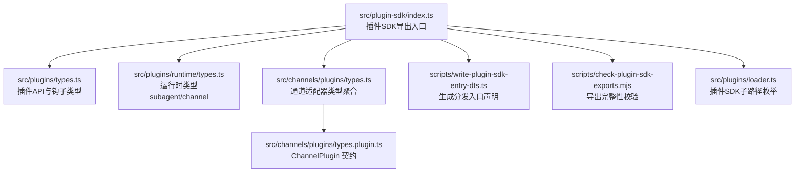
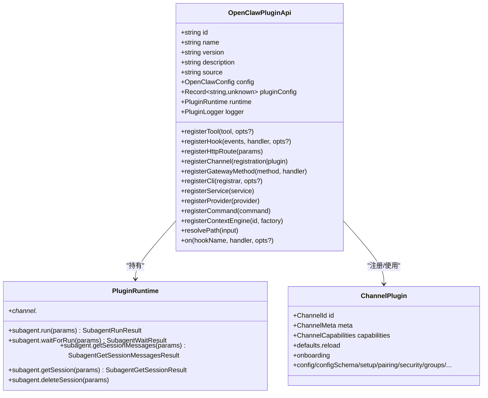
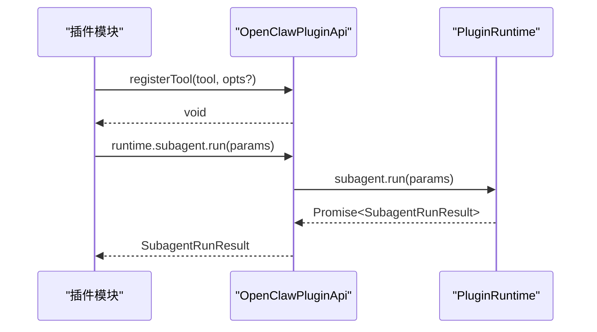
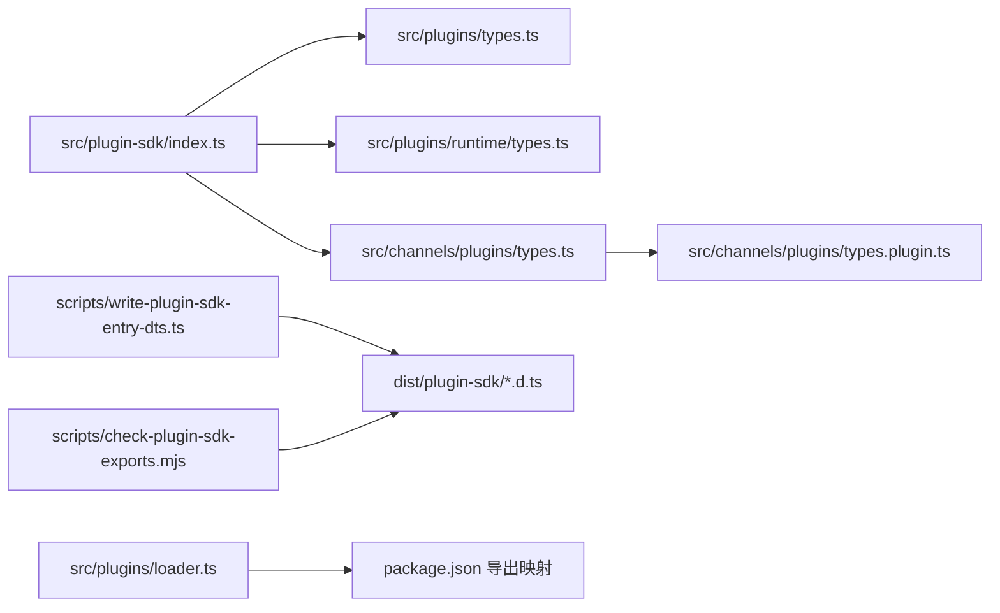

# API参考

## 目录
1. [简介](#简介)
2. [项目结构](#项目结构)
3. [核心组件](#核心组件)
4. [架构总览](#架构总览)
5. [详细组件分析](#详细组件分析)
6. [依赖关系分析](#依赖关系分析)
7. [性能考量](#性能考量)
8. [故障排查指南](#故障排查指南)
9. [结论](#结论)
10. [附录](#附录)

## 简介
本文件为 OpenClaw 插件 SDK 的权威 API 参考，覆盖插件开发所需的关键类型、接口与函数签名，重点说明以下核心对象的定义与用法：
- OpenClawPluginApi：插件注册与运行时交互的统一入口
- PluginRuntime：子代理（subagent）与通道（channel）运行时能力
- ChannelPlugin：通道适配器插件的契约与能力集合
并系统梳理插件生命周期钩子、HTTP 路由注册、命令注册、服务注册、网关方法注册、工具与钩子注册、提供商认证等机制；同时给出错误处理与最佳实践建议。

## 项目结构
OpenClaw 插件 SDK 的导出入口位于 src/plugin-sdk/index.ts，该文件集中 re-export 了大量类型与工具函数，涵盖：
- 通道适配器类型与通道插件契约
- 插件 API 类型与运行时类型
- HTTP 路由、Webhook、SSRF 防护、临时文件、命令执行、日志传输等通用工具
- 多个具体通道（Discord、Slack、Telegram、Signal、WhatsApp、LINE 等）的账户解析、规范化、状态检查等辅助能力

图表来源
- [src/plugin-sdk/index.ts](file://src/plugin-sdk/index.ts#L1-L812)
- [src/plugins/types.ts](file://src/plugins/types.ts#L1-L893)
- [src/plugins/runtime/types.ts](file://src/plugins/runtime/types.ts#L1-L64)
- [src/channels/plugins/types.ts](file://src/channels/plugins/types.ts#L1-L66)
- [src/channels/plugins/types.plugin.ts](file://src/channels/plugins/types.plugin.ts#L1-L86)
- [scripts/write-plugin-sdk-entry-dts.ts](file://scripts/write-plugin-sdk-entry-dts.ts#L1-L60)
- [scripts/check-plugin-sdk-exports.mjs](file://scripts/check-plugin-sdk-exports.mjs#L1-L157)
- [src/plugins/loader.ts](file://src/plugins/loader.ts#L112-L144)

章节来源
- [src/plugin-sdk/index.ts](file://src/plugin-sdk/index.ts#L1-L812)

## 核心组件
本节对 OpenClaw 插件 SDK 的三大核心类型进行深入解析，并给出参数说明、返回值类型与典型使用场景。

- OpenClawPluginApi
  - 定义位置：[src/plugins/types.ts](file://src/plugins/types.ts#L263-L306)
  - 关键字段与方法
    - id/name/version/description/source：插件元信息
    - config/pluginConfig/runtime/logger：运行期上下文与配置
    - registerTool(tool, opts?)：注册工具或工具工厂
    - registerHook(events, handler, opts?)：注册内部钩子
    - registerHttpRoute(params)：注册 HTTP 路由
    - registerChannel(registration|plugin)：注册通道插件
    - registerGatewayMethod(method, handler)：注册网关方法
    - registerCli(registrar, opts?)：注册 CLI 子命令
    - registerService(service)：注册后台服务
    - registerProvider(provider)：注册提供商（含认证）
    - registerCommand(command)：注册简单命令（绕过 LLM）
    - registerContextEngine(id, factory)：注册上下文引擎（独占槽位）
    - resolvePath(input)：解析相对路径
    - on(hookName, handler, opts?)：注册生命周期钩子（带优先级）
  - 使用示例（路径）
    - 工具注册：[src/plugins/types.ts](file://src/plugins/types.ts#L273-L276)
    - 钩子注册：[src/plugins/types.ts](file://src/plugins/types.ts#L277-L281)
    - HTTP 路由注册：[src/plugins/types.ts](file://src/plugins/types.ts#L282-L282)
    - 通道注册：[src/plugins/types.ts](file://src/plugins/types.ts#L283-L283)
    - 网关方法注册：[src/plugins/types.ts](file://src/plugins/types.ts#L284-L284)
    - CLI 注册：[src/plugins/types.ts](file://src/plugins/types.ts#L285-L285)
    - 服务注册：[src/plugins/types.ts](file://src/plugins/types.ts#L286-L286)
    - 提供商注册：[src/plugins/types.ts](file://src/plugins/types.ts#L287-L287)
    - 命令注册：[src/plugins/types.ts](file://src/plugins/types.ts#L293-L293)
    - 上下文引擎注册：[src/plugins/types.ts](file://src/plugins/types.ts#L295-L298)
    - 生命周期钩子注册：[src/plugins/types.ts](file://src/plugins/types.ts#L301-L305)

- PluginRuntime
  - 定义位置：[src/plugins/runtime/types.ts](file://src/plugins/runtime/types.ts#L51-L63)
  - 子代理能力（subagent.*）
    - run(params) -> Promise&lt;SubagentRunResult&gt;
    - waitForRun(params) -> Promise&lt;SubagentWaitResult&gt;
    - getSessionMessages(params) -> Promise&lt;SubagentGetSessionMessagesResult&gt;
    - getSession(params) -> Promise&lt;SubagentGetSessionResult&gt;（已废弃）
    - deleteSession(params) -> Promise&lt;void&gt;
  - 通道能力（channel.*）
    - 由 PluginRuntimeChannel 提供（详见类型定义）
  - 使用示例（路径）
    - 子代理运行：[src/plugins/runtime/types.ts](file://src/plugins/runtime/types.ts#L52-L61)
    - 获取会话消息：[src/plugins/runtime/types.ts](file://src/plugins/runtime/types.ts#L55-L57)

- ChannelPlugin
  - 定义位置：[src/channels/plugins/types.plugin.ts](file://src/channels/plugins/types.plugin.ts#L49-L85)
  - 关键字段
    - id/meta/capabilities：通道标识、元数据与能力
    - defaults.reload：热重载相关前缀
    - onboarding：CLI 引导适配器
    - config/configSchema/setup/pairing/security/groups/mentions/outbound/status/gateway/auth/elevated/commands/streaming/threading/messaging/agentPrompt/directory/resolver/actions/heartbeat/agentTools
  - 使用示例（路径）
    - 通道插件定义：[src/channels/plugins/types.plugin.ts](file://src/channels/plugins/types.plugin.ts#L49-L85)

章节来源
- [src/plugins/types.ts](file://src/plugins/types.ts#L263-L306)
- [src/plugins/runtime/types.ts](file://src/plugins/runtime/types.ts#L51-L63)
- [src/channels/plugins/types.plugin.ts](file://src/channels/plugins/types.plugin.ts#L49-L85)

## 架构总览
OpenClaw 插件 SDK 将“插件 API”“运行时”“通道适配器”三者解耦，通过统一的 OpenClawPluginApi 挂接各类能力，并在生命周期钩子中与宿主系统进行深度交互。

图表来源
- [src/plugins/types.ts](file://src/plugins/types.ts#L263-L306)
- [src/plugins/runtime/types.ts](file://src/plugins/runtime/types.ts#L51-L63)
- [src/channels/plugins/types.plugin.ts](file://src/channels/plugins/types.plugin.ts#L49-L85)

## 详细组件分析

### OpenClawPluginApi：插件注册与运行时交互
- 职责
  - 作为插件与宿主之间的唯一接口，负责注册工具、钩子、HTTP 路由、通道、网关方法、CLI、服务、提供商、命令与上下文引擎
  - 提供运行时访问（runtime）、日志（logger）、配置（config）与路径解析（resolvePath）
- 典型调用序列（以注册工具为例）

图表来源
- [src/plugins/types.ts](file://src/plugins/types.ts#L273-L276)
- [src/plugins/runtime/types.ts](file://src/plugins/runtime/types.ts#L52-L54)

章节来源
- [src/plugins/types.ts](file://src/plugins/types.ts#L263-L306)

### PluginRuntime：子代理与通道运行时
- 子代理（subagent）
  - run：启动一次子代理运行，返回 runId
  - waitForRun：等待指定 runId 完成，返回状态与可选错误
  - getSessionMessages：按会话键获取消息列表
  - getSession/getSessionResult：已废弃别名
  - deleteSession：删除会话（可选是否删除转录）
- 通道（channel）
  - 由 PluginRuntimeChannel 提供通道特定能力（如发送、解析、状态等）
- 使用示例（路径）
  - 子代理运行与等待：[src/plugins/runtime/types.ts](file://src/plugins/runtime/types.ts#L52-L59)
  - 获取会话消息：[src/plugins/runtime/types.ts](file://src/plugins/runtime/types.ts#L55-L57)

章节来源
- [src/plugins/runtime/types.ts](file://src/plugins/runtime/types.ts#L51-L63)

### ChannelPlugin：通道适配器契约
- 能力清单
  - 配置与引导：config/configSchema/setup/onboarding
  - 安全与配对：pairing/security
  - 组织与提及：groups/mentions
  - 出站与状态：outbound/status
  - 网关与认证：gateway/auth/elevated
  - 命令与流式：commands/streaming
  - 线程与消息：threading/messaging
  - 代理提示与目录：agentPrompt/directory
  - 解析与动作：resolver/actions
  - 心跳与工具：heartbeat/agentTools
- 使用示例（路径）
  - 通道插件定义：[src/channels/plugins/types.plugin.ts](file://src/channels/plugins/types.plugin.ts#L49-L85)

章节来源
- [src/channels/plugins/types.plugin.ts](file://src/channels/plugins/types.plugin.ts#L49-L85)

### 生命周期钩子与事件模型
- 钩子名称（部分）
  - before_model_resolve、before_prompt_build、before_agent_start、llm_input、llm_output、agent_end
  - before_compaction、after_compaction、before_reset
  - message_received、message_sending、message_sent
  - before_tool_call、after_tool_call、tool_result_persist
  - before_message_write
  - session_start、session_end
  - subagent_spawning、subagent_delivery_target、subagent_spawned、subagent_ended
  - gateway_start、gateway_stop
- 事件与结果类型
  - 例如 before_model_resolve 的事件与结果、before_prompt_build 的系统提示与上下文注入、message_sending 的内容修改与取消、tool_result_persist 的消息裁剪等
- 使用示例（路径）
  - 钩子名称常量与校验：[src/plugins/types.ts](file://src/plugins/types.ts#L347-L382)
  - before_prompt_build 事件与结果：[src/plugins/types.ts](file://src/plugins/types.ts#L422-L442)
  - message_sending 事件与结果：[src/plugins/types.ts](file://src/plugins/types.ts#L573-L583)
  - tool_result_persist 事件与结果：[src/plugins/types.ts](file://src/plugins/types.ts#L635-L657)

章节来源
- [src/plugins/types.ts](file://src/plugins/types.ts#L321-L394)
- [src/plugins/types.ts](file://src/plugins/types.ts#L422-L442)
- [src/plugins/types.ts](file://src/plugins/types.ts#L573-L583)
- [src/plugins/types.ts](file://src/plugins/types.ts#L635-L657)

### HTTP 路由与 Webhook 接口
- OpenClawPluginHttpRouteParams
  - 字段：path、handler、auth（gateway|plugin）、match（exact|prefix）、replaceExisting
  - 注册：registerHttpRoute(params)
- Webhook 辅助
  - 路径规范化与解析：normalizePluginHttpPath、normalizeWebhookPath、resolveWebhookPath
  - 目标注册与鉴权：registerWebhookTarget、registerWebhookTargetWithPluginRoute、resolveWebhookTargetWithAuthOrReject、withResolvedWebhookRequestPipeline
  - 请求守卫：applyBasicWebhookRequestGuards、beginWebhookRequestPipelineOrReject、isJsonContentType、readWebhookBodyOrReject、readJsonBodyWithLimit、installRequestBodyLimitGuard
- 使用示例（路径）
  - 路由注册：[src/plugins/types.ts](file://src/plugins/types.ts#L282-L282)
  - Webhook 目标注册：[src/plugin-sdk/index.ts](file://src/plugin-sdk/index.ts#L149-L159)
  - 请求体限制与守卫：[src/plugin-sdk/index.ts](file://src/plugin-sdk/index.ts#L419-L427)

章节来源
- [src/plugins/types.ts](file://src/plugins/types.ts#L205-L219)
- [src/plugin-sdk/index.ts](file://src/plugin-sdk/index.ts#L149-L159)
- [src/plugin-sdk/index.ts](file://src/plugin-sdk/index.ts#L419-L427)

### 命令注册与 CLI 扩展
- OpenClawPluginCommandDefinition
  - 字段：name、nativeNames、description、acceptsArgs、requireAuth、handler
  - 注册：registerCommand(command)
- OpenClawPluginCliRegistrar
  - 字段：program、config、workspaceDir、logger
  - 注册：registerCli(registrar, opts?)
- 使用示例（路径）
  - 命令定义与注册：[src/plugins/types.ts](file://src/plugins/types.ts#L186-L203)
  - CLI 注册：[src/plugins/types.ts](file://src/plugins/types.ts#L285-L285)

章节来源
- [src/plugins/types.ts](file://src/plugins/types.ts#L146-L203)
- [src/plugins/types.ts](file://src/plugins/types.ts#L221-L228)
- [src/plugins/types.ts](file://src/plugins/types.ts#L285-L285)

### 服务与提供商注册
- OpenClawPluginService
  - 字段：id、start(ctx)、stop?(ctx)
  - 注册：registerService(service)
- ProviderPlugin
  - 字段：id、label、docsPath、aliases、envVars、models、auth、formatApiKey、refreshOAuth
  - 注册：registerProvider(provider)
- 使用示例（路径）
  - 服务注册：[src/plugins/types.ts](file://src/plugins/types.ts#L237-L241)
  - 提供商注册：[src/plugins/types.ts](file://src/plugins/types.ts#L122-L132)

章节来源
- [src/plugins/types.ts](file://src/plugins/types.ts#L237-L241)
- [src/plugins/types.ts](file://src/plugins/types.ts#L122-L132)

### 工具与钩子注册
- registerTool(tool|factory, opts?)
- registerHook(events, handler, opts?)
- on(hookName, handler, opts?)
- 使用示例（路径）
  - 工具注册：[src/plugins/types.ts](file://src/plugins/types.ts#L273-L276)
  - 钩子注册：[src/plugins/types.ts](file://src/plugins/types.ts#L277-L281)
  - 生命周期钩子注册：[src/plugins/types.ts](file://src/plugins/types.ts#L301-L305)

章节来源
- [src/plugins/types.ts](file://src/plugins/types.ts#L273-L281)
- [src/plugins/types.ts](file://src/plugins/types.ts#L301-L305)

### 通道插件注册与对接
- registerChannel(registration|plugin)
- ChannelPlugin 能力矩阵见上文
- 使用示例（路径）
  - 通道注册：[src/plugins/types.ts](file://src/plugins/types.ts#L283-L283)
  - 通道插件定义：[src/channels/plugins/types.plugin.ts](file://src/channels/plugins/types.plugin.ts#L49-L85)

章节来源
- [src/plugins/types.ts](file://src/plugins/types.ts#L283-L283)
- [src/channels/plugins/types.plugin.ts](file://src/channels/plugins/types.plugin.ts#L49-L85)

### 网关方法注册
- registerGatewayMethod(method, handler)
- 使用示例（路径）
  - 网关方法注册：[src/plugins/types.ts](file://src/plugins/types.ts#L284-L284)

章节来源
- [src/plugins/types.ts](file://src/plugins/types.ts#L284-L284)

### 上下文引擎注册
- registerContextEngine(id, factory)
- 说明：独占槽位，仅允许一个上下文引擎激活
- 使用示例（路径）
  - 上下文引擎注册：[src/plugins/types.ts](file://src/plugins/types.ts#L295-L298)

章节来源
- [src/plugins/types.ts](file://src/plugins/types.ts#L295-L298)

### 路径解析与资源定位
- resolvePath(input)：将相对路径解析为绝对路径
- 使用示例（路径）
  - 路径解析：[src/plugins/types.ts](file://src/plugins/types.ts#L299-L299)

章节来源
- [src/plugins/types.ts](file://src/plugins/types.ts#L299-L299)

## 依赖关系分析
- 导出入口与分发
  - scripts/write-plugin-sdk-entry-dts.ts 生成 dist/plugin-sdk/*.d.ts，确保各子路径入口稳定
  - scripts/check-plugin-sdk-exports.mjs 在构建后校验关键导出是否存在，防止运行时崩溃
  - src/plugins/loader.ts 列举 package.json 中导出映射下的插件SDK子路径，用于加载与发现
- 依赖图

图表来源
- [src/plugin-sdk/index.ts](file://src/plugin-sdk/index.ts#L1-L812)
- [src/plugins/types.ts](file://src/plugins/types.ts#L1-L893)
- [src/plugins/runtime/types.ts](file://src/plugins/runtime/types.ts#L1-L64)
- [src/channels/plugins/types.ts](file://src/channels/plugins/types.ts#L1-L66)
- [src/channels/plugins/types.plugin.ts](file://src/channels/plugins/types.plugin.ts#L1-L86)
- [scripts/write-plugin-sdk-entry-dts.ts](file://scripts/write-plugin-sdk-entry-dts.ts#L1-L60)
- [scripts/check-plugin-sdk-exports.mjs](file://scripts/check-plugin-sdk-exports.mjs#L1-L157)
- [src/plugins/loader.ts](file://src/plugins/loader.ts#L112-L144)

章节来源
- [scripts/write-plugin-sdk-entry-dts.ts](file://scripts/write-plugin-sdk-entry-dts.ts#L1-L60)
- [scripts/check-plugin-sdk-exports.mjs](file://scripts/check-plugin-sdk-exports.mjs#L1-L157)
- [src/plugins/loader.ts](file://src/plugins/loader.ts#L112-L144)

## 性能考量
- 子代理会话管理
  - 使用 getSessionMessages 代替一次性拉取全量消息，避免内存峰值
  - 合理设置 lane 与 idempotencyKey，减少重复计算与网络请求
- 钩子链路
  - 在 before_prompt_build 中进行静态上下文注入（prependSystemContext/appendSystemContext），降低每轮对话的 token 成本
  - 在 tool_result_persist 中裁剪非必要字段，缩短写盘与传输开销
- Webhook
  - 使用 readJsonBodyWithLimit/installRequestBodyLimitGuard 控制请求体大小，避免内存压力
  - 结合 createFixedWindowRateLimiter 与 createWebhookAnomalyTracker 进行限流与异常检测

## 故障排查指南
- 导出缺失
  - 构建后若出现运行时找不到符号，先运行 scripts/check-plugin-sdk-exports.mjs 校验导出完整性
- 分发入口声明
  - 若 IDE 或打包器无法解析子路径导出，确认 dist/plugin-sdk/*.d.ts 是否存在（由 scripts/write-plugin-sdk-entry-dts.ts 生成）
- 子路径枚举
  - 若插件加载失败，检查 src/plugins/loader.ts 中列出的导出子路径是否与 package.json 的 exports 对应
- 错误处理
  - Webhook 请求体过大：使用 readJsonBodyWithLimit 并捕获 RequestBodyLimitError
  - SSRF/私有地址访问：使用 fetchWithSsrFGuard 与 isBlockedHostname/isPrivateIpAddress 进行防护
  - 日志与诊断：通过 registerLogTransport 与 emitDiagnosticEvent 输出诊断事件

章节来源
- [scripts/check-plugin-sdk-exports.mjs](file://scripts/check-plugin-sdk-exports.mjs#L1-L157)
- [scripts/write-plugin-sdk-entry-dts.ts](file://scripts/write-plugin-sdk-entry-dts.ts#L1-L60)
- [src/plugins/loader.ts](file://src/plugins/loader.ts#L112-L144)
- [src/plugin-sdk/index.ts](file://src/plugin-sdk/index.ts#L419-L427)
- [src/plugin-sdk/index.ts](file://src/plugin-sdk/index.ts#L442-L449)

## 结论
OpenClaw 插件 SDK 通过 OpenClawPluginApi 提供统一的注册与运行时访问，结合 PluginRuntime 的子代理与通道能力，以及 ChannelPlugin 的通道适配契约，形成一套可扩展、可观测、可治理的插件生态。遵循本文档的类型定义、参数说明与最佳实践，可高效实现从简单命令到复杂通道适配的各类插件。

## 附录
- 常用类型速查
  - OpenClawPluginApi：[src/plugins/types.ts](file://src/plugins/types.ts#L263-L306)
  - PluginRuntime：[src/plugins/runtime/types.ts](file://src/plugins/runtime/types.ts#L51-L63)
  - ChannelPlugin：[src/channels/plugins/types.plugin.ts](file://src/channels/plugins/types.plugin.ts#L49-L85)
  - 钩子事件与结果：[src/plugins/types.ts](file://src/plugins/types.ts#L397-L784)
  - HTTP/Webhook 工具：[src/plugin-sdk/index.ts](file://src/plugin-sdk/index.ts#L125-L175)
  - 账户与通道解析：[src/plugin-sdk/index.ts](file://src/plugin-sdk/index.ts#L634-L784)