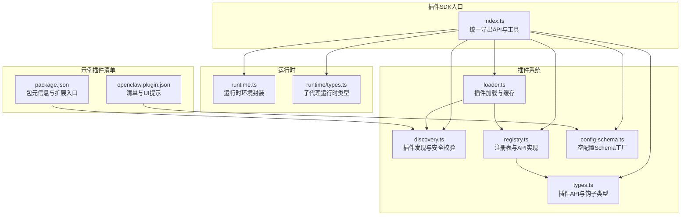
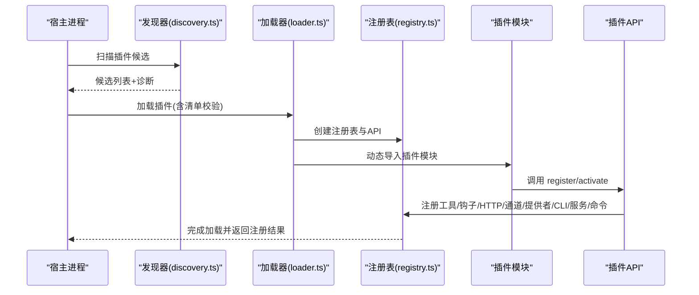
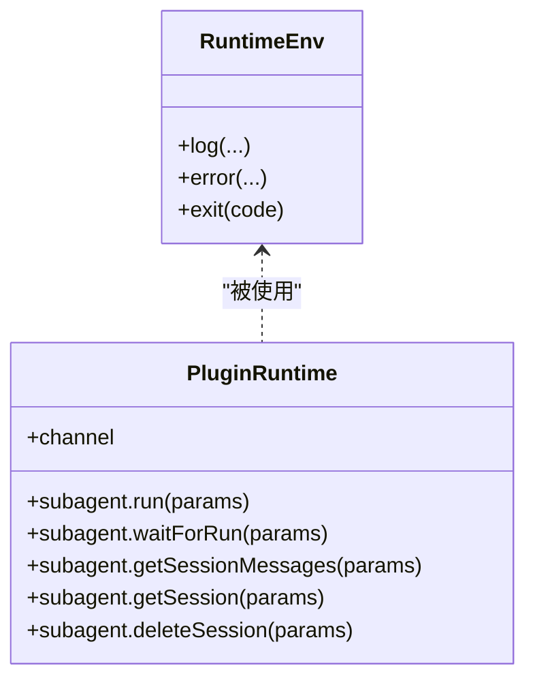
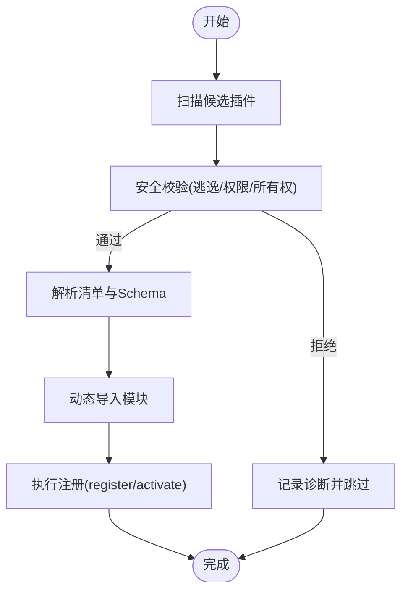
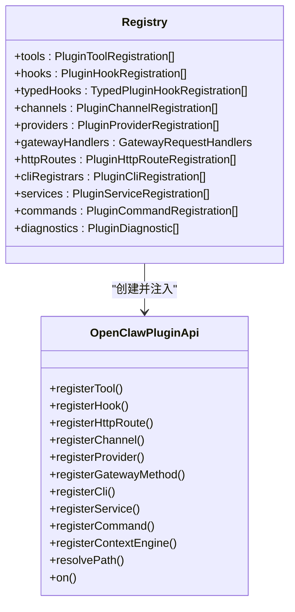
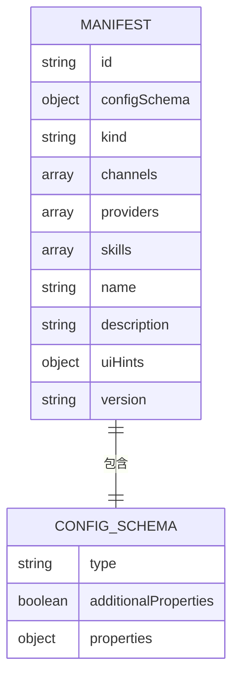
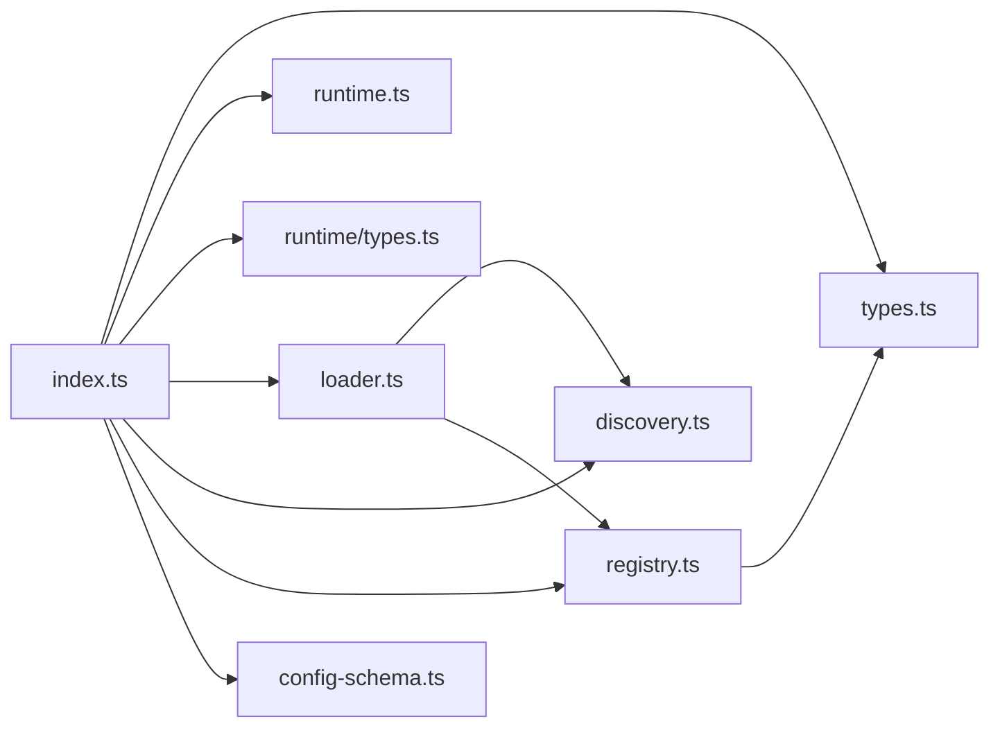

# 插件SDK


## 目录
1. [简介](#简介)
2. [项目结构](#项目结构)
3. [核心组件](#核心组件)
4. [架构总览](#架构总览)
5. [详细组件分析](#详细组件分析)
6. [依赖关系分析](#依赖关系分析)
7. [性能考量](#性能考量)
8. [故障排查指南](#故障排查指南)
9. [结论](#结论)
10. [附录](#附录)

## 简介
本文件为 OpenClaw 插件SDK的权威API参考与实践指南。内容覆盖插件开发框架的核心接口与类型定义、插件生命周期（加载、初始化、激活、卸载）、插件清单（Manifest）规范、与宿主系统的交互接口（事件监听、工具注册、配置访问、HTTP路由、网关方法、CLI命令、服务）、插件间通信与数据共享、最佳实践与安全考虑、调试方法以及打包与版本管理流程。

## 项目结构
OpenClaw 的插件系统由“入口导出层”“运行时环境”“类型与API定义”“加载器与发现”“注册表与钩子系统”等模块组成。下图展示与插件SDK直接相关的结构关系：



图表来源
- [index.ts](file://src/plugin-sdk/index.ts#L1-L812)
- [runtime.ts](file://src/plugin-sdk/runtime.ts#L1-L45)
- [runtime/types.ts](file://src/plugins/runtime/types.ts#L1-L64)
- [types.ts](file://src/plugins/types.ts#L1-L893)
- [loader.ts](file://src/plugins/loader.ts#L1-L829)
- [discovery.ts](file://src/plugins/discovery.ts#L1-L712)
- [registry.ts](file://src/plugins/registry.ts#L1-L625)
- [config-schema.ts](file://src/plugins/config-schema.ts#L1-L34)
- [openclaw.plugin.json](file://extensions/diffs/openclaw.plugin.json#L1-L183)
- [package.json](file://extensions/diffs/package.json#L1-L21)

章节来源
- [index.ts](file://src/plugin-sdk/index.ts#L1-L812)
- [runtime.ts](file://src/plugin-sdk/runtime.ts#L1-L45)
- [runtime/types.ts](file://src/plugins/runtime/types.ts#L1-L64)
- [types.ts](file://src/plugins/types.ts#L1-L893)
- [loader.ts](file://src/plugins/loader.ts#L1-L829)
- [discovery.ts](file://src/plugins/discovery.ts#L1-L712)
- [registry.ts](file://src/plugins/registry.ts#L1-L625)
- [config-schema.ts](file://src/plugins/config-schema.ts#L1-L34)
- [openclaw.plugin.json](file://extensions/diffs/openclaw.plugin.json#L1-L183)
- [package.json](file://extensions/diffs/package.json#L1-L21)

## 核心组件
- 插件API与类型：定义插件能力边界、上下文、钩子、命令、HTTP路由、网关方法、CLI注册、服务、提供者认证等。
- 运行时环境：提供日志、错误退出、路径解析等基础能力。
- 加载器与发现：扫描插件候选、校验安全、解析清单、执行注册。
- 注册表：集中管理插件注册项（工具、钩子、通道、提供者、HTTP路由、CLI、服务、命令），并提供API实现。
- 配置Schema：用于严格验证插件配置，支持空Schema与UI提示。

章节来源
- [types.ts](file://src/plugins/types.ts#L248-L306)
- [runtime.ts](file://src/plugin-sdk/runtime.ts#L9-L44)
- [loader.ts](file://src/plugins/loader.ts#L447-L800)
- [registry.ts](file://src/plugins/registry.ts#L185-L624)
- [config-schema.ts](file://src/plugins/config-schema.ts#L13-L33)

## 架构总览
下图展示从“发现插件”到“注册API并执行注册”的端到端流程：



图表来源
- [discovery.ts](file://src/plugins/discovery.ts#L618-L711)
- [loader.ts](file://src/plugins/loader.ts#L509-L800)
- [registry.ts](file://src/plugins/registry.ts#L185-L624)

章节来源
- [discovery.ts](file://src/plugins/discovery.ts#L618-L711)
- [loader.ts](file://src/plugins/loader.ts#L447-L800)
- [registry.ts](file://src/plugins/registry.ts#L185-L624)

## 详细组件分析

### 组件A：插件API与生命周期钩子
- 插件定义与模块形态：支持对象式定义或函数式导出，均通过统一API注入。
- 生命周期钩子：涵盖模型解析前、提示构建前、代理开始、LLM输入/输出、消息收发/发送、工具调用前后、会话开始/结束、子代理派生/交付/结束、网关启动/停止等。
- 类型安全：钩子名称集合在编译期校验，确保使用正确的钩子名；部分钩子允许限制提示注入以提升安全性。
- 上下文引擎：支持注册上下文引擎实现（独占槽位）。

```mermaid
classDiagram
class OpenClawPluginApi {
+id : string
+name : string
+version? : string
+description? : string
+source : string
+config : OpenClawConfig
+pluginConfig? : Record<string, unknown>
+runtime : PluginRuntime
+logger : PluginLogger
+registerTool(tool, opts)
+registerHook(events, handler, opts)
+registerHttpRoute(params)
+registerChannel(registration)
+registerGatewayMethod(method, handler)
+registerCli(registrar, opts)
+registerService(service)
+registerCommand(command)
+registerContextEngine(id, factory)
+resolvePath(input) : string
+on(hookName, handler, opts)
}
class PluginHookName {
<<enumeration>>
"before_model_resolve"
"before_prompt_build"
"before_agent_start"
"llm_input"
"llm_output"
"agent_end"
"before_compaction"
"after_compaction"
"before_reset"
"message_received"
"message_sending"
"message_sent"
"before_tool_call"
"after_tool_call"
"tool_result_persist"
"before_message_write"
"session_start"
"session_end"
"subagent_spawning"
"subagent_delivery_target"
"subagent_spawned"
"subagent_ended"
"gateway_start"
"gateway_stop"
}
OpenClawPluginApi --> PluginHookName : "注册/监听"
```

图表来源
- [types.ts](file://src/plugins/types.ts#L263-L306)
- [types.ts](file://src/plugins/types.ts#L321-L372)

章节来源
- [types.ts](file://src/plugins/types.ts#L248-L306)
- [types.ts](file://src/plugins/types.ts#L321-L372)

### 组件B：运行时环境与子代理运行时
- 运行时环境：提供日志、错误、退出能力，并可从外部传入或自动创建。
- 子代理运行时：支持运行子代理、等待运行完成、查询会话消息、删除会话等。



图表来源
- [runtime.ts](file://src/plugin-sdk/runtime.ts#L9-L44)
- [runtime/types.ts](file://src/plugins/runtime/types.ts#L51-L63)

章节来源
- [runtime.ts](file://src/plugin-sdk/runtime.ts#L9-L44)
- [runtime/types.ts](file://src/plugins/runtime/types.ts#L1-L64)

### 组件C：插件加载与发现（安全与缓存）
- 发现策略：扫描工作区、全局、捆绑插件目录，支持包级扩展入口解析。
- 安全校验：禁止源文件逃逸插件根、禁止世界可写路径、检测可疑所有权。
- 缓存控制：基于环境变量的发现缓存窗口，避免启动风暴。
- 加载流程：解析清单、校验配置Schema、动态导入模块、执行注册回调、收集诊断信息。



图表来源
- [discovery.ts](file://src/plugins/discovery.ts#L117-L251)
- [loader.ts](file://src/plugins/loader.ts#L538-L799)

章节来源
- [discovery.ts](file://src/plugins/discovery.ts#L618-L711)
- [loader.ts](file://src/plugins/loader.ts#L447-L800)

### 组件D：注册表与API实现
- 注册表职责：集中管理工具、钩子、HTTP路由、通道、提供者、CLI、服务、命令；并提供API实现。
- API实现：将宿主能力注入插件，如注册工具、钩子、HTTP路由、通道、提供者、网关方法、CLI、服务、命令、上下文引擎、路径解析、Typed钩子注册。
- 冲突检测：HTTP路由重叠与权限冲突检测、重复注册警告、核心网关方法冲突检测。



图表来源
- [registry.ts](file://src/plugins/registry.ts#L129-L142)
- [registry.ts](file://src/plugins/registry.ts#L575-L607)

章节来源
- [registry.ts](file://src/plugins/registry.ts#L185-L624)

### 组件E：插件清单（Manifest）与配置Schema
- 清单要求：每个插件必须在根目录提供 openclaw.plugin.json，包含 id 与 configSchema；可选字段包括 kind、channels、providers、skills、name、description、uiHints、version。
- JSON Schema：必须提供Schema，即使为空；Schema在配置读写时验证，不依赖运行时。
- 验证行为：未知渠道键、未知插件ID、禁用但存在配置等均有明确的错误或警告处理。
- 示例清单：示例插件展示了 uiHints 与复杂嵌套配置Schema的组织方式。



图表来源
- [manifest.md](file://docs/plugins/manifest.md#L18-L76)
- [openclaw.plugin.json](file://extensions/diffs/openclaw.plugin.json#L1-L183)

章节来源
- [manifest.md](file://docs/plugins/manifest.md#L1-L76)
- [openclaw.plugin.json](file://extensions/diffs/openclaw.plugin.json#L1-L183)

## 依赖关系分析
- 入口导出层聚合了大量类型与工具，便于插件开发者按需引入。
- 加载器依赖发现器与注册表，形成“发现—校验—注册”的闭环。
- 注册表依赖钩子系统、通道插件、网关方法、HTTP路由等子系统。
- 配置Schema工厂为所有插件提供统一的Schema能力。



图表来源
- [index.ts](file://src/plugin-sdk/index.ts#L1-L812)
- [loader.ts](file://src/plugins/loader.ts#L1-L829)
- [registry.ts](file://src/plugins/registry.ts#L1-L625)

章节来源
- [index.ts](file://src/plugin-sdk/index.ts#L1-L812)
- [loader.ts](file://src/plugins/loader.ts#L1-L829)
- [registry.ts](file://src/plugins/registry.ts#L1-L625)

## 性能考量
- 启动延迟优化：加载器对运行时采用惰性初始化，仅在首次访问时创建，避免无谓的通道依赖加载。
- 发现缓存：通过环境变量控制发现缓存窗口，减少重复扫描带来的开销。
- 配置Schema验证：在配置读写阶段进行，避免运行时重复校验。
- 路由冲突检测：在注册阶段尽早发现HTTP路由冲突，降低运行时调度成本。

## 故障排查指南
- 插件加载失败：检查 openclaw.plugin.json 是否存在且合法；确认模块导出是否包含 register 或 activate；查看诊断信息中的错误与警告。
- 配置校验失败：核对 configSchema 与实际配置值，修正类型或枚举值；利用 uiHints 辅助定位敏感字段。
- 安全拦截：若出现“源逃逸/世界可写/可疑所有权”等警告，请修正文件权限与归属。
- HTTP路由冲突：根据诊断信息调整路径、匹配模式或认证方式，避免与已有路由重叠。
- 钩子未触发：确认钩子名称正确、Typed钩子策略允许提示注入、插件启用状态与钩子系统开关。

章节来源
- [loader.ts](file://src/plugins/loader.ts#L256-L284)
- [discovery.ts](file://src/plugins/discovery.ts#L216-L227)
- [registry.ts](file://src/plugins/registry.ts#L318-L399)

## 结论
OpenClaw 插件SDK通过清晰的API边界、严格的清单与Schema校验、完善的生命周期钩子与运行时能力，为插件生态提供了高扩展性与强安全性的基础。遵循本文档的规范与最佳实践，可高效构建稳定、可维护的插件。

## 附录

### 插件清单（Manifest）字段说明
- id：插件唯一标识，必填。
- configSchema：JSON Schema，必填。
- kind：插件类型（如 memory、context-engine），可选。
- channels：插件注册的通道ID数组，可选。
- providers：插件注册的提供者ID数组，可选。
- skills：技能目录相对路径数组，可选。
- name/description：显示名称与描述，可选。
- uiHints：配置字段的UI提示（标签、帮助、高级、敏感、占位符等），可选。
- version：版本号，可选。

章节来源
- [manifest.md](file://docs/plugins/manifest.md#L18-L76)

### 插件清单示例与Schema要点
- 示例清单展示了 uiHints 的组织方式与嵌套配置Schema（defaults、security）。
- 包元信息中可通过 openclaw.extensions 指定扩展入口，供发现器识别。

章节来源
- [openclaw.plugin.json](file://extensions/diffs/openclaw.plugin.json#L1-L183)
- [package.json](file://extensions/diffs/package.json#L15-L19)

### 插件开发最佳实践
- 使用空配置Schema工厂以支持“无配置”插件。
- 在 register 中一次性完成所有注册，避免异步注册导致的竞态。
- 对外暴露的HTTP路由应明确认证方式与匹配规则，避免冲突。
- 利用Typed钩子限制提示注入，增强安全性。
- 提供完善的 uiHints，改善配置体验。

章节来源
- [config-schema.ts](file://src/plugins/config-schema.ts#L13-L33)
- [types.ts](file://src/plugins/types.ts#L384-L394)
- [registry.ts](file://src/plugins/registry.ts#L318-L399)

### 插件打包与版本管理
- 包元信息通过 openclaw.extensions 指定扩展入口，便于发现器解析。
- 版本号建议与插件清单 version 保持一致，便于追踪与审计。
- 若插件依赖原生模块，需在清单中注明构建步骤与包管理器要求。

章节来源
- [package.json](file://extensions/diffs/package.json#L15-L19)
- [manifest.md](file://docs/plugins/manifest.md#L69-L76)