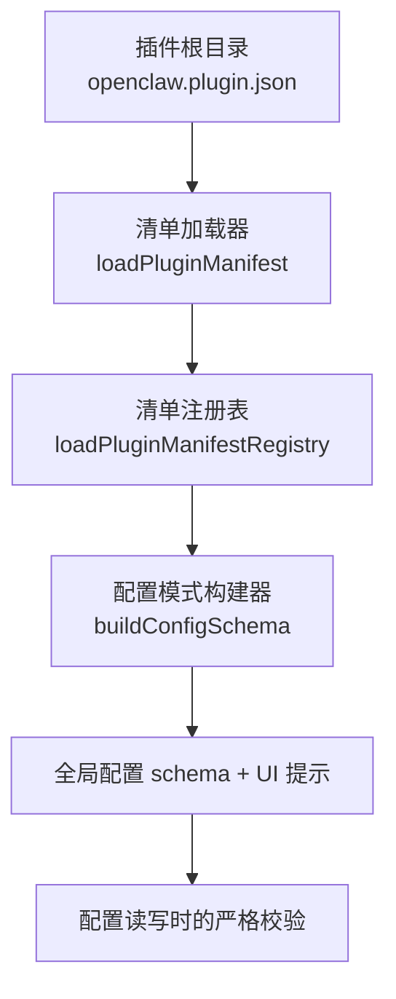
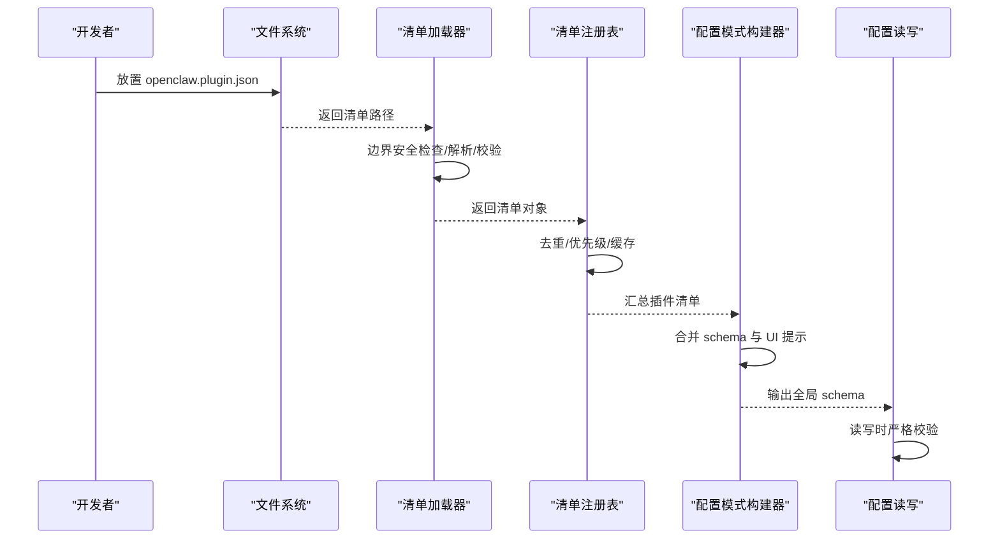
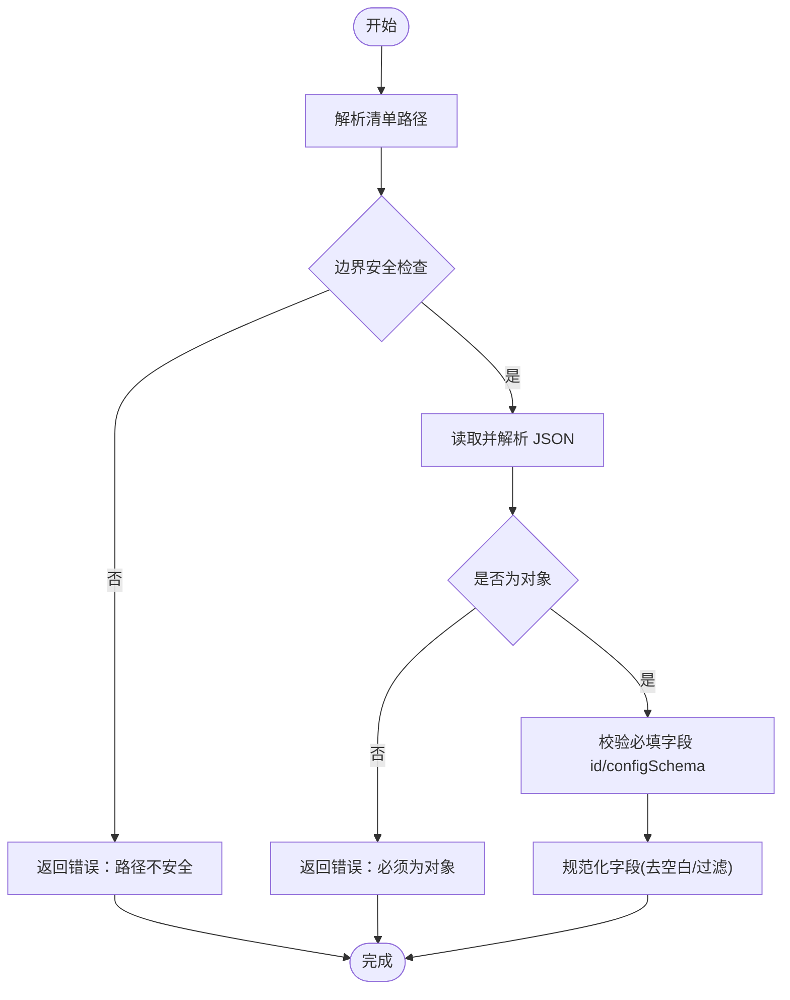
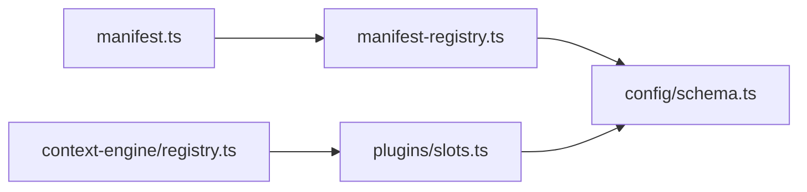

# 插件清单规范

## 目录
1. [简介](#简介)
2. [项目结构](#项目结构)
3. [核心组件](#核心组件)
4. [架构总览](#架构总览)
5. [组件详解](#组件详解)
6. [依赖关系分析](#依赖关系分析)
7. [性能考量](#性能考量)
8. [故障排查指南](#故障排查指南)
9. [结论](#结论)
10. [附录](#附录)

## 简介
本规范面向 OpenClaw 插件开发者，系统性说明 openclaw.plugin.json 插件清单的结构、字段定义与校验规则，涵盖插件元数据、依赖与能力声明、权限与安全边界、入口点与模块导出、配置模式(schema)定义与验证、分类标签与关键词、完整示例与常见配置模式，以及清单版本兼容性与迁移策略。

## 项目结构
OpenClaw 插件以“清单 + 模式(schema) + 可选 UI 提示”为核心，清单位于插件根目录，命名固定为 openclaw.plugin.json。清单驱动以下流程：
- 发现：扫描工作区与加载路径中的插件目录
- 加载：读取并解析清单，执行基础校验
- 合并：将插件 schema 与 UI 提示合并到全局配置 schema
- 验证：在读取/写入配置阶段执行严格校验

图表来源
- [src/plugins/manifest.ts](file://src/plugins/manifest.ts#L45-L119)
- [src/plugins/manifest-registry.ts](file://src/plugins/manifest-registry.ts#L135-L261)
- [src/config/schema.ts](file://src/config/schema.ts#L449-L484)

章节来源
- [docs/plugins/manifest.md](file://docs/plugins/manifest.md#L9-L16)
- [src/plugins/manifest.ts](file://src/plugins/manifest.ts#L8-L119)
- [src/plugins/manifest-registry.ts](file://src/plugins/manifest-registry.ts#L135-L261)
- [src/config/schema.ts](file://src/config/schema.ts#L449-L484)

## 核心组件
- 清单类型与加载
  - 类型定义：包含 id、configSchema、kind、channels、providers、skills、name、description、version、uiHints 等字段
  - 加载流程：解析路径、边界安全检查、JSON 解析、字段校验、规范化
- 清单注册表
  - 去重与优先级：按 origin 排序(config > workspace > global > bundled)，同 id 同物理路径覆盖
  - 缓存：基于环境变量与 mtime 的短缓存，降低启动抖动
- 配置模式与 UI 提示
  - 将插件 schema 与 UI 提示合并到全局配置 schema，支持敏感信息标记、分组、排序、高级项等
- 插件槽位与专属插件
  - 通过 plugins.slots.* 选择专属插件(kind: memory/context-engine)，默认值与解析逻辑由槽位模块提供

章节来源
- [src/plugins/manifest.ts](file://src/plugins/manifest.ts#L11-L22)
- [src/plugins/manifest.ts](file://src/plugins/manifest.ts#L45-L119)
- [src/plugins/manifest-registry.ts](file://src/plugins/manifest-registry.ts#L15-L45)
- [src/plugins/manifest-registry.ts](file://src/plugins/manifest-registry.ts#L135-L261)
- [src/config/schema.ts](file://src/config/schema.ts#L101-L134)
- [src/config/schema.ts](file://src/config/schema.ts#L449-L484)
- [src/plugins/slots.ts](file://src/plugins/slots.ts#L12-L31)
- [src/context-engine/registry.ts](file://src/context-engine/registry.ts#L69-L85)

## 架构总览
清单驱动的配置验证与 UI 合流架构如下：

图表来源
- [src/plugins/manifest.ts](file://src/plugins/manifest.ts#L45-L119)
- [src/plugins/manifest-registry.ts](file://src/plugins/manifest-registry.ts#L135-L261)
- [src/config/schema.ts](file://src/config/schema.ts#L449-L484)

## 组件详解

### 清单文件结构与字段定义
- 必填字段
  - id：插件唯一标识，字符串，去空白后必填
  - configSchema：JSON Schema 对象，用于配置校验
- 可选字段
  - kind：插件种类，如 memory、context-engine
  - channels：该插件注册的通道 id 列表
  - providers：该插件注册的服务商 id 列表
  - skills：相对插件根目录的技能目录数组
  - name/description/version：展示与信息字段
  - uiHints：配置字段的 UI 提示，含 label/help/tags/group/order/advanced/sensitive/placeholder 等
- 字段规范要点
  - 所有字段均在加载阶段进行基础校验，非法清单直接报错
  - channels/providers/skills 自动去空白与过滤空串
  - uiHints 中的键支持相对路径前缀，最终映射到 plugins.entries.&lt;id&gt;.config.&lt;path&gt;

章节来源
- [docs/plugins/manifest.md](file://docs/plugins/manifest.md#L18-L46)
- [src/plugins/manifest.ts](file://src/plugins/manifest.ts#L11-L22)
- [src/plugins/manifest.ts](file://src/plugins/manifest.ts#L81-L119)
- [src/shared/config-ui-hints-types.ts](file://src/shared/config-ui-hints-types.ts#L1-L11)

### 清单加载与校验流程
- 路径解析：固定文件名 openclaw.plugin.json，若不存在则报错
- 安全边界：拒绝硬链接等不安全路径，防止越界访问
- JSON 解析：失败即报错
- 结构校验：id 与 configSchema 必填，其他字段可选
- 规范化：列表字段去空白、过滤空串；uiHints 保持原样供后续合并

图表来源
- [src/plugins/manifest.ts](file://src/plugins/manifest.ts#L35-L119)

章节来源
- [src/plugins/manifest.ts](file://src/plugins/manifest.ts#L35-L119)

### 清单注册表与去重策略
- 去重依据：同一物理目录视为相同插件，忽略不同路径表示
- 优先级：config > workspace > global > bundled，低优先级被高优先级覆盖
- 重复 id 警告：不同来源出现相同 id 时发出警告，可能被覆盖
- 缓存：基于环境变量与清单 mtime 的短缓存，提升启动性能

章节来源
- [src/plugins/manifest-registry.ts](file://src/plugins/manifest-registry.ts#L15-L45)
- [src/plugins/manifest-registry.ts](file://src/plugins/manifest-registry.ts#L170-L261)

### 配置模式(schema)定义与合并
- 插件 schema 合并：将各插件 configSchema 与基础 schema 合并，处理 required、properties、additionalProperties
- UI 提示合并：自动为插件生成 entries.&lt;id&gt; 的 UI 分组与子项提示，支持敏感标记、分组、排序、高级项
- 全局 schema：输出包含插件配置的完整 schema 与 UI 提示，供配置界面渲染与校验

章节来源
- [src/config/schema.ts](file://src/config/schema.ts#L81-L99)
- [src/config/schema.ts](file://src/config/schema.ts#L298-L324)
- [src/config/schema.ts](file://src/config/schema.ts#L449-L484)

### 权限配置与安全边界
- 清单层面的安全边界
  - 清单文件路径必须在插件根目录内，拒绝硬链接等不安全路径
  - 清单解析失败或字段缺失将导致插件错误
- UI 层面的敏感信息标记
  - uiHints.sensitive 标记敏感字段，便于 UI 隐藏或加密显示
  - uiHints.advanced 标记高级配置项，避免普通用户误改
- 实践建议
  - 对涉及外部命令、网络、文件系统等高风险操作的配置，建议使用 uiHints.advanced/sensitive 并在插件代码中严格限制权限范围

章节来源
- [src/plugins/manifest.ts](file://src/plugins/manifest.ts#L50-L64)
- [src/shared/config-ui-hints-types.ts](file://src/shared/config-ui-hints-types.ts#L1-L11)

### 插件入口点与模块导出
- 入口点候选：index.ts、index.js、index.mjs、index.cjs
- 包元数据扩展：package.json 中的 openclaw 字段可用于安装与引导信息
- 与清单的关系：清单仅负责发现与校验，实际模块加载由运行时独立完成

章节来源
- [src/plugins/manifest.ts](file://src/plugins/manifest.ts#L155-L165)
- [src/plugins/manifest.ts](file://src/plugins/manifest.ts#L169-L182)

### 插件槽位与专属插件
- 槽位键映射：kind=memory → slots.memory；kind=context-engine → slots.contextEngine
- 默认值：memory 默认 memory-core；contextEngine 默认 legacy
- 选择逻辑：通过 applyExclusiveSlotSelection 将选定插件写入 slots，未命中槽位的同 kind 插件将被禁用

章节来源
- [src/plugins/slots.ts](file://src/plugins/slots.ts#L12-L31)
- [src/plugins/slots.ts](file://src/plugins/slots.ts#L39-L56)
- [src/context-engine/registry.ts](file://src/context-engine/registry.ts#L69-L85)

### 验证行为与错误处理
- 通道与插件 id：未知通道或未知插件 id 视为错误
- 禁用插件：若配置存在但插件被禁用，保留配置并在诊断中给出警告
- 修复建议：确保清单字段完整、id 唯一、schema 有效

章节来源
- [docs/plugins/manifest.md](file://docs/plugins/manifest.md#L53-L62)

### 清单示例与常见配置模式
- 最小清单：包含 id 与 configSchema（可为空对象）
- 通道插件：声明 channels 数组，configSchema 可为空
- 技能插件：声明 skills 目录，configSchema 可为空
- 复杂配置：参考 acpx 插件，包含多层嵌套对象、枚举、数值范围、高级项与 UI 提示

章节来源
- [docs/plugins/manifest.md](file://docs/plugins/manifest.md#L18-L46)
- [extensions/discord/openclaw.plugin.json](file://extensions/discord/openclaw.plugin.json#L1-L10)
- [extensions/telegram/openclaw.plugin.json](file://extensions/telegram/openclaw.plugin.json#L1-L10)
- [extensions/feishu/openclaw.plugin.json](file://extensions/feishu/openclaw.plugin.json#L1-L11)
- [extensions/line/openclaw.plugin.json](file://extensions/line/openclaw.plugin.json#L1-L10)
- [extensions/whatsapp/openclaw.plugin.json](file://extensions/whatsapp/openclaw.plugin.json#L1-L10)
- [extensions/zalo/openclaw.plugin.json](file://extensions/zalo/openclaw.plugin.json#L1-L10)
- [extensions/lobster/openclaw.plugin.json](file://extensions/lobster/openclaw.plugin.json#L1-L11)
- [extensions/acpx/openclaw.plugin.json](file://extensions/acpx/openclaw.plugin.json#L1-L106)

## 依赖关系分析
- 清单加载器依赖边界文件读取工具，确保路径安全
- 注册表依赖发现模块与清单加载器，负责去重与优先级
- 配置模式构建器依赖注册表提供的插件清单，合并 schema 与 UI 提示
- 槽位模块与上下文引擎注册模块共同决定专属插件的选择与解析

图表来源
- [src/plugins/manifest.ts](file://src/plugins/manifest.ts#L1-L10)
- [src/plugins/manifest-registry.ts](file://src/plugins/manifest-registry.ts#L1-L8)
- [src/config/schema.ts](file://src/config/schema.ts#L1-L10)
- [src/plugins/slots.ts](file://src/plugins/slots.ts#L1-L4)
- [src/context-engine/registry.ts](file://src/context-engine/registry.ts#L1-L4)

章节来源
- [src/plugins/manifest.ts](file://src/plugins/manifest.ts#L1-L10)
- [src/plugins/manifest-registry.ts](file://src/plugins/manifest-registry.ts#L1-L8)
- [src/config/schema.ts](file://src/config/schema.ts#L1-L10)
- [src/plugins/slots.ts](file://src/plugins/slots.ts#L1-L4)
- [src/context-engine/registry.ts](file://src/context-engine/registry.ts#L1-L4)

## 性能考量
- 清单缓存：通过环境变量控制缓存 TTL，默认短 TTL，避免频繁 IO；可通过环境变量禁用
- 启动合并：在首次加载时预热缓存，后续测试或启动可复用解析结果
- 去重与 realpath：对重复来源与符号链接进行物理路径归一化，减少重复解析

章节来源
- [src/plugins/manifest-registry.ts](file://src/plugins/manifest-registry.ts#L56-L77)
- [src/plugins/manifest-registry.ts](file://src/plugins/manifest-registry.ts#L147-L153)
- [src/plugins/manifest-registry.ts](file://src/plugins/manifest-registry.ts#L208-L216)

## 故障排查指南
- 清单缺失或路径不安全
  - 现象：报错“清单未找到/路径不安全”
  - 处理：确认清单位于插件根目录且路径合法，避免硬链接
- JSON 解析失败
  - 现象：报错“无法解析清单”
  - 处理：检查 JSON 语法，移除注释与尾逗号
- 字段缺失
  - 现象：报错“缺少 id 或 configSchema”
  - 处理：补齐必填字段
- 重复 id 或覆盖
  - 现象：警告“检测到重复 id，可能被覆盖”
  - 处理：确保 id 唯一，或合并来源一致的物理路径
- 禁用插件仍保留配置
  - 现象：诊断警告“插件已禁用但仍保留配置”
  - 处理：确认插件启用状态或删除冗余配置

章节来源
- [src/plugins/manifest.ts](file://src/plugins/manifest.ts#L57-L64)
- [src/plugins/manifest.ts](file://src/plugins/manifest.ts#L69-L74)
- [src/plugins/manifest.ts](file://src/plugins/manifest.ts#L82-L87)
- [src/plugins/manifest-registry.ts](file://src/plugins/manifest-registry.ts#L232-L237)
- [docs/plugins/manifest.md](file://docs/plugins/manifest.md#L61-L62)

## 结论
openclaw.plugin.json 是 OpenClaw 插件生态的“契约”，承担发现、校验与 UI 提示合并的关键职责。遵循本规范可确保插件清单的正确性、安全性与可维护性，并为用户提供一致的配置体验。

## 附录

### 字段定义速查
- id：字符串，必填
- configSchema：对象，必填
- kind：字符串，可选
- channels/providers：字符串数组，可选
- skills：字符串数组，可选
- name/description/version：字符串，可选
- uiHints：对象，可选

章节来源
- [docs/plugins/manifest.md](file://docs/plugins/manifest.md#L18-L46)
- [src/plugins/manifest.ts](file://src/plugins/manifest.ts#L11-L22)

### 配置模式(schema)定义方法
- 使用 JSON Schema 定义插件配置结构
- 通过 buildConfigSchema 将插件 schema 合并到全局 schema
- 在 uiHints 中补充 label/help/tags/group/order/advanced/sensitive/placeholder 等

章节来源
- [docs/plugins/manifest.md](file://docs/plugins/manifest.md#L47-L51)
- [src/config/schema.ts](file://src/config/schema.ts#L449-L484)
- [src/shared/config-ui-hints-types.ts](file://src/shared/config-ui-hints-types.ts#L1-L11)

### 版本兼容性与迁移策略
- 清单文件名固定为 openclaw.plugin.json，无需迁移
- 若未来引入新字段，应向后兼容：旧版加载器忽略未知字段；新版加载器可新增默认值
- 建议在 major 版本升级时提供迁移脚本或文档指引

章节来源
- [src/plugins/manifest.ts](file://src/plugins/manifest.ts#L8-L10)
- [docs/plugins/manifest.md](file://docs/plugins/manifest.md#L73-L76)