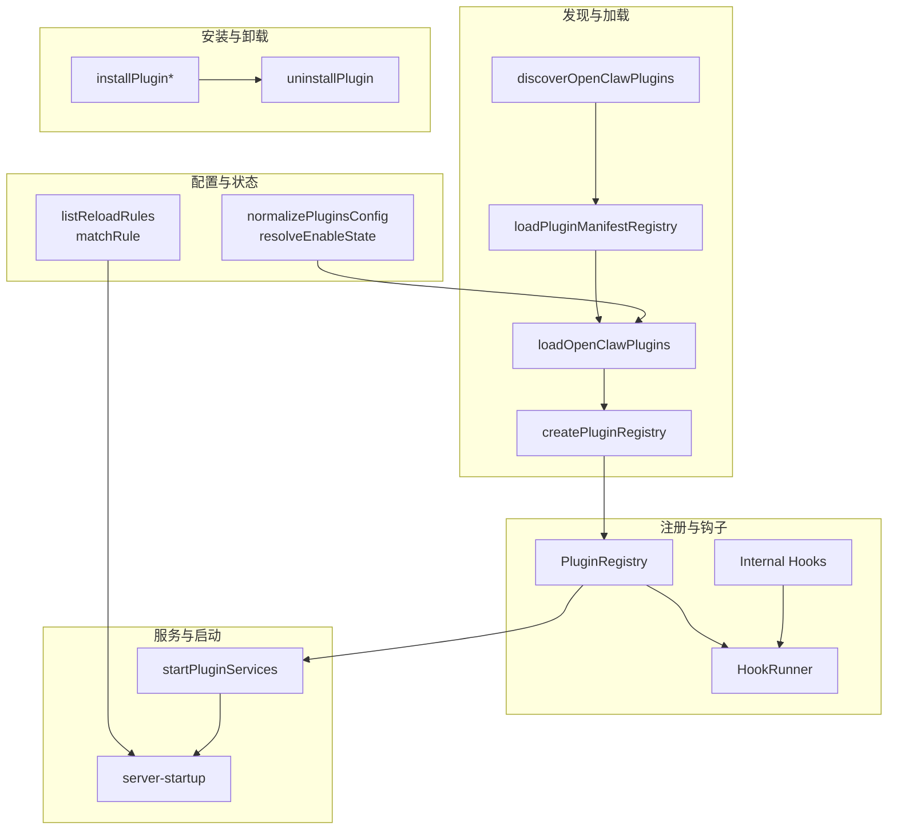
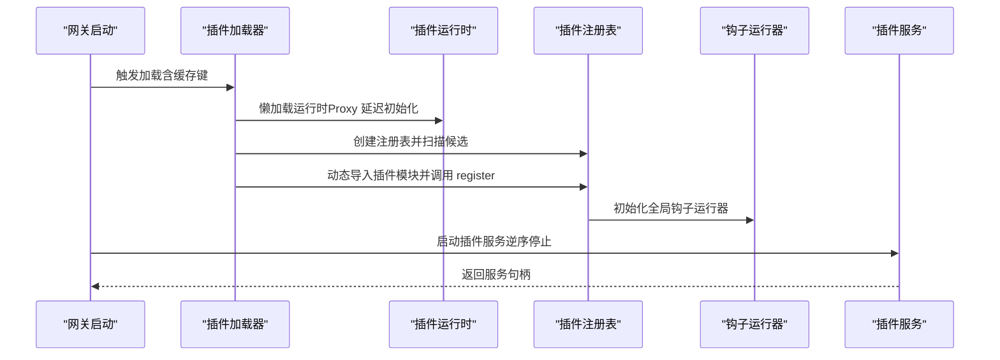
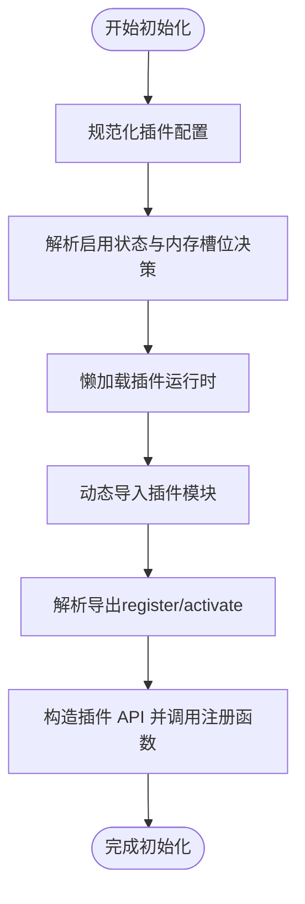
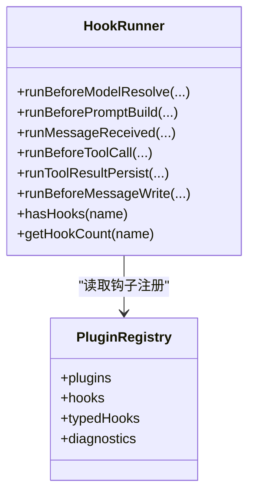
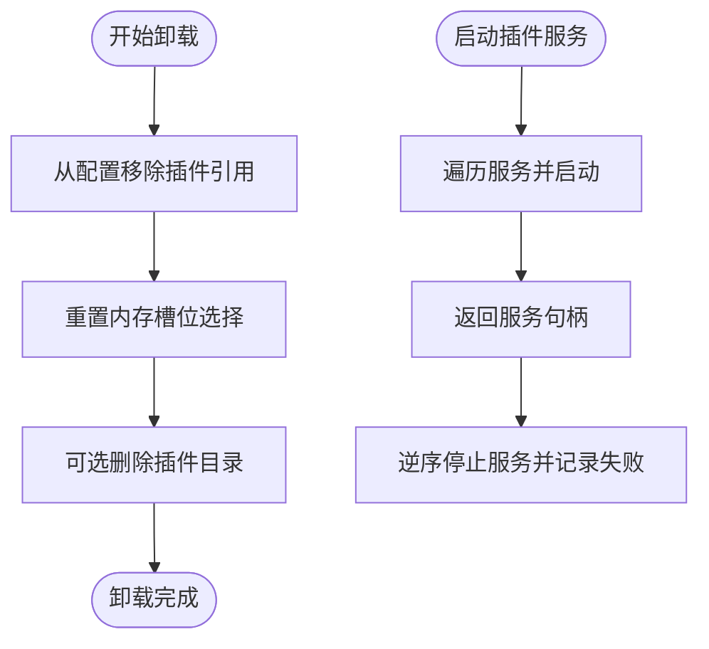
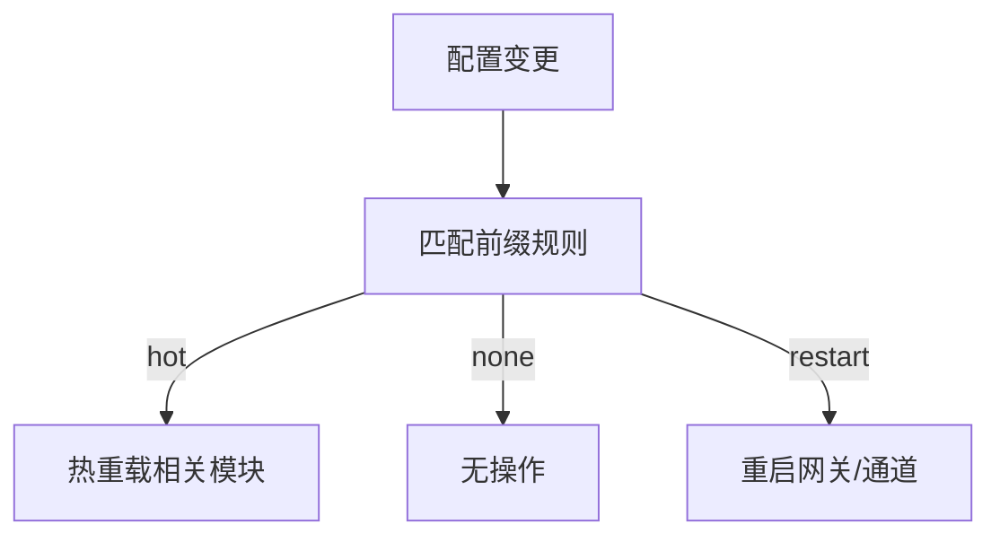
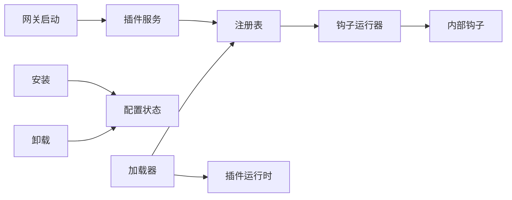

# 插件生命周期

## 目录
1. [简介](#简介)
2. [项目结构](#项目结构)
3. [核心组件](#核心组件)
4. [架构总览](#架构总览)
5. [详细组件分析](#详细组件分析)
6. [依赖关系分析](#依赖关系分析)
7. [性能考量](#性能考量)
8. [故障排查指南](#故障排查指南)
9. [结论](#结论)
10. [附录](#附录)

## 简介
本文件系统化阐述 OpenClaw 插件生命周期管理：从“发现与加载”到“激活与运行”，再到“停止与卸载”的全过程。重点覆盖以下方面：
- 初始化阶段：配置校验、资源分配、依赖注入与注册表构建
- 运行阶段：状态管理、事件处理与钩子执行模型
- 停止与卸载：清理流程、资源回收与内存槽位策略
- 热重载与动态更新：配置变更的热重载规则与通道插件贡献
- 生命周期钩子：钩子类型、优先级、合并策略与最佳实践
- 状态监控与调试：诊断信息、日志与可观测性
- 插件间依赖：注册表聚合、冲突检测与服务生命周期

## 项目结构
围绕插件生命周期的关键模块分布如下：
- 发现与加载：discover、manifest、loader、runtime
- 注册与钩子：registry、hooks、internal-hooks
- 配置与状态：config-state、config-reload-plan
- 安装与卸载：install、uninstall
- 服务与启动：services、server-startup
- SDK 工具：runtime-store

图示来源
- [loader.ts](file://src/plugins/loader.ts#L447-L800)
- [registry.ts](file://src/plugins/registry.ts#L185-L625)
- [hooks.ts](file://src/plugins/hooks.ts#L126-L760)
- [config-state.ts](file://src/plugins/config-state.ts#L90-L287)
- [config-reload-plan.ts](file://src/gateway/config-reload-plan.ts#L103-L140)
- [install.ts](file://src/plugins/install.ts#L205-L377)
- [uninstall.ts](file://src/plugins/uninstall.ts#L65-L164)
- [services.ts](file://src/plugins/services.ts#L48-L75)
- [server-startup.ts](file://src/gateway/server-startup.ts#L153-L191)

章节来源
- [loader.ts](file://src/plugins/loader.ts#L447-L800)
- [registry.ts](file://src/plugins/registry.ts#L185-L625)
- [hooks.ts](file://src/plugins/hooks.ts#L126-L760)
- [config-state.ts](file://src/plugins/config-state.ts#L90-L287)
- [config-reload-plan.ts](file://src/gateway/config-reload-plan.ts#L103-L140)
- [install.ts](file://src/plugins/install.ts#L205-L377)
- [uninstall.ts](file://src/plugins/uninstall.ts#L65-L164)
- [services.ts](file://src/plugins/services.ts#L48-L75)
- [server-startup.ts](file://src/gateway/server-startup.ts#L153-L191)

## 核心组件
- 插件注册表（PluginRegistry）：聚合工具、钩子、通道、提供者、HTTP 路由、CLI、服务、命令与诊断信息，统一管理插件元数据与能力清单。
- 钩子运行器（HookRunner）：按优先级顺序执行修改型钩子，或并行执行无返回值钩子；提供错误捕获与日志。
- 插件加载器（PluginLoader）：扫描候选、解析清单、校验配置、延迟初始化运行时、动态导入并调用插件注册函数。
- 配置状态机（Config-State）：规范化配置、解析启用状态、内存槽位决策与测试默认值。
- 安装/卸载（Install/Uninstall）：安装包/目录/文件与 npm 规范包的安装流程，以及卸载时对配置与文件系统的清理。
- 服务生命周期（Plugin Services）：启动与逆序停止插件服务，失败记录日志但不中断整体流程。
- 热重载（Config Reload Plan）：基于前缀匹配的热重载/无操作规则，支持通道插件贡献。

章节来源
- [registry.ts](file://src/plugins/registry.ts#L129-L142)
- [hooks.ts](file://src/plugins/hooks.ts#L126-L760)
- [loader.ts](file://src/plugins/loader.ts#L447-L800)
- [config-state.ts](file://src/plugins/config-state.ts#L90-L287)
- [install.ts](file://src/plugins/install.ts#L205-L377)
- [uninstall.ts](file://src/plugins/uninstall.ts#L65-L164)
- [services.ts](file://src/plugins/services.ts#L48-L75)
- [config-reload-plan.ts](file://src/gateway/config-reload-plan.ts#L103-L140)

## 架构总览
下图展示从“加载插件”到“启动服务”的关键交互路径，并标注钩子运行器的全局初始化。

图示来源
- [loader.ts](file://src/plugins/loader.ts#L447-L507)
- [loader.ts](file://src/plugins/loader.ts#L442-L445)
- [server-startup.ts](file://src/gateway/server-startup.ts#L153-L191)
- [services.ts](file://src/plugins/services.ts#L48-L75)

章节来源
- [loader.ts](file://src/plugins/loader.ts#L447-L507)
- [loader.ts](file://src/plugins/loader.ts#L442-L445)
- [server-startup.ts](file://src/gateway/server-startup.ts#L153-L191)
- [services.ts](file://src/plugins/services.ts#L48-L75)

## 详细组件分析

### 初始化阶段：配置验证、资源分配与依赖注入
- 配置规范化与启用状态解析
  - 规范化插件配置（允许列表、拒绝列表、加载路径、内存槽位等），并解析每个插件的启用状态与原因。
  - 内存槽位决策：当存在多个内存类插件时，仅允许一个被选中，其余禁用。
- 运行时懒加载
  - 通过 Proxy 包装运行时对象，避免在仅发现/校验阶段加载重型依赖。
- 插件注册 API
  - 提供工具注册、钩子注册、HTTP 路由、通道、提供者、网关方法、CLI、服务、命令与上下文引擎注册。
  - 钩子策略：对提示注入类钩子可按配置进行约束或拦截。
- 清单与导出校验
  - 校验插件清单与导出接口一致性，记录警告或错误诊断。

图示来源
- [config-state.ts](file://src/plugins/config-state.ts#L90-L287)
- [loader.ts](file://src/plugins/loader.ts#L473-L507)
- [loader.ts](file://src/plugins/loader.ts#L675-L787)
- [registry.ts](file://src/plugins/registry.ts#L575-L623)

章节来源
- [config-state.ts](file://src/plugins/config-state.ts#L90-L287)
- [loader.ts](file://src/plugins/loader.ts#L473-L507)
- [loader.ts](file://src/plugins/loader.ts#L675-L787)
- [registry.ts](file://src/plugins/registry.ts#L575-L623)

### 运行阶段：状态管理与事件处理
- 钩子运行模型
  - 修改型钩子：按优先级顺序串行执行，结果可合并；典型如 before_model_resolve、before_prompt_build、before_tool_call 等。
  - 无返回值钩子：并行执行，典型如 message_received、llm_input、gateway_start 等。
  - 同步钩子：tool_result_persist、before_message_write 在热路径上同步执行，禁止异步返回。
- 全局钩子运行器
  - 通过内部钩子系统桥接通用事件与插件钩子，支持跨模块共享状态并在模块重载后保持。
- 状态与诊断
  - 插件记录状态（loaded/disabled/error）、错误信息与诊断集合，便于问题定位。

图示来源
- [hooks.ts](file://src/plugins/hooks.ts#L126-L760)
- [registry.ts](file://src/plugins/registry.ts#L129-L142)

章节来源
- [hooks.ts](file://src/plugins/hooks.ts#L126-L760)
- [registry.ts](file://src/plugins/registry.ts#L129-L142)
- [internal-hooks.ts](file://src/hooks/internal-hooks.ts#L174-L193)
- [hook-runner-global.test.ts](file://src/plugins/hook-runner-global.test.ts#L14-L49)

### 停止与卸载阶段：清理流程与资源回收
- 卸载流程
  - 从配置中移除条目、安装记录、允许列表、加载路径与内存槽位选择。
  - 对非“路径链接”插件可选择删除已安装目录，保留安全策略（仅在默认安装路径时删除）。
- 服务停止
  - 以逆序停止所有已启动的插件服务，失败仅记录警告，不影响其他服务。
- 启动后服务
  - 网关启动时尝试启动插件服务，失败记录告警但不阻断启动。

图示来源
- [uninstall.ts](file://src/plugins/uninstall.ts#L65-L164)
- [uninstall.ts](file://src/plugins/uninstall.ts#L177-L238)
- [services.ts](file://src/plugins/services.ts#L48-L75)
- [server-startup.ts](file://src/gateway/server-startup.ts#L153-L191)

章节来源
- [uninstall.ts](file://src/plugins/uninstall.ts#L65-L164)
- [uninstall.ts](file://src/plugins/uninstall.ts#L177-L238)
- [services.ts](file://src/plugins/services.ts#L48-L75)
- [server-startup.ts](file://src/gateway/server-startup.ts#L153-L191)

### 热重载与动态更新
- 热重载规则
  - 基于配置前缀匹配决定是否热重载、无操作或重启网关/通道。
  - 通道插件可贡献自定义前缀，声明哪些配置变更应触发其通道的热重载。
- 配置变更入口
  - 网关启动时根据规则决定行为，确保最小化停机时间与正确传播变更。

图示来源
- [config-reload-plan.ts](file://src/gateway/config-reload-plan.ts#L103-L140)

章节来源
- [config-reload-plan.ts](file://src/gateway/config-reload-plan.ts#L103-L140)

### 生命周期钩子函数使用与最佳实践
- 钩子类型与用途
  - 模型与提示：before_model_resolve、before_prompt_build、before_agent_start
  - 会话与消息：session_start/end、message_received/sending/sent、before_message_write
  - 工具调用：before_tool_call、after_tool_call、tool_result_persist
  - 子代理：subagent_* 系列
  - 网关：gateway_start/stop
- 优先级与合并
  - 修改型钩子按优先级降序执行，结果可合并；无返回值钩子并行执行。
  - 同步钩子（tool_result_persist、before_message_write）严禁返回 Promise。
- 最佳实践
  - 使用 catchErrors 控制错误传播；在生产环境建议捕获错误并记录，避免中断主流程。
  - 对提示注入类钩子谨慎放行，必要时通过配置禁用。
  - 在热路径钩子中避免异步操作，确保低延迟。

章节来源
- [hooks.ts](file://src/plugins/hooks.ts#L126-L760)
- [types.ts](file://src/plugins/types.ts#L321-L372)

### 插件状态监控与调试技巧
- 诊断与日志
  - 插件注册表维护诊断数组，记录警告与错误；加载器在异常时写入错误状态与消息。
  - 允许列表为空时发出告警，提示可能自动加载未受信插件。
- 运行时存储
  - 提供运行时存储工厂，用于在插件生命周期内保存运行时对象，缺失时抛出明确错误。
- 模块重载与全局钩子
  - 全局钩子运行器在模块重载后仍可保留状态，便于开发期热替换与测试。

章节来源
- [loader.ts](file://src/plugins/loader.ts#L408-L410)
- [loader.ts](file://src/plugins/loader.ts#L256-L284)
- [runtime-store.ts](file://src/plugin-sdk/runtime-store.ts#L1-L26)
- [hook-runner-global.test.ts](file://src/plugins/hook-runner-global.test.ts#L14-L49)

### 插件间依赖关系管理
- 注册表聚合
  - 注册表统一收集插件提供的能力（工具、钩子、HTTP 路由、通道、提供者、服务、命令等），并进行冲突检测与去重。
- 冲突检测
  - 网关方法名冲突、HTTP 路由重叠、提供者 ID 冲突等均会生成诊断信息。
- 服务依赖
  - 插件服务独立启动与停止，彼此无强耦合；失败不影响其他服务。

章节来源
- [registry.ts](file://src/plugins/registry.ts#L290-L457)
- [services.ts](file://src/plugins/services.ts#L48-L75)

## 依赖关系分析
- 组件耦合
  - 加载器依赖注册表与运行时；注册表依赖钩子系统与内部钩子；钩子运行器依赖注册表与日志。
  - 卸载与安装流程与配置状态紧密耦合，确保配置与文件系统一致。
- 外部集成
  - 网关启动依赖插件服务；热重载规则依赖通道插件贡献。

图示来源
- [loader.ts](file://src/plugins/loader.ts#L447-L507)
- [registry.ts](file://src/plugins/registry.ts#L185-L288)
- [hooks.ts](file://src/plugins/hooks.ts#L126-L197)
- [internal-hooks.ts](file://src/hooks/internal-hooks.ts#L174-L193)
- [uninstall.ts](file://src/plugins/uninstall.ts#L65-L164)
- [install.ts](file://src/plugins/install.ts#L205-L377)
- [server-startup.ts](file://src/gateway/server-startup.ts#L153-L191)

章节来源
- [loader.ts](file://src/plugins/loader.ts#L447-L507)
- [registry.ts](file://src/plugins/registry.ts#L185-L288)
- [hooks.ts](file://src/plugins/hooks.ts#L126-L197)
- [internal-hooks.ts](file://src/hooks/internal-hooks.ts#L174-L193)
- [uninstall.ts](file://src/plugins/uninstall.ts#L65-L164)
- [install.ts](file://src/plugins/install.ts#L205-L377)
- [server-startup.ts](file://src/gateway/server-startup.ts#L153-L191)

## 性能考量
- 懒加载运行时：避免在仅发现/校验阶段加载重型依赖，降低启动成本。
- 并行钩子：无返回值钩子并行执行，提升事件处理吞吐。
- 同步钩子：热路径上的同步钩子避免异步开销，保障低延迟。
- 缓存键：基于工作区与配置构建缓存键，减少重复加载。

章节来源
- [loader.ts](file://src/plugins/loader.ts#L473-L507)
- [hooks.ts](file://src/plugins/hooks.ts#L203-L224)
- [hooks.ts](file://src/plugins/hooks.ts#L475-L522)

## 故障排查指南
- 常见问题
  - 插件加载失败：检查导出接口（register/activate）、清单与根目录边界、路径别名与 SDK 别名映射。
  - 配置无效：核对 JSON Schema 校验结果与错误列表；确认内存槽位与允许/拒绝列表。
  - 钩子异常：启用 catchErrors 记录错误而不中断；检查同步钩子是否返回 Promise。
  - 卸载失败：确认目标目录是否为默认安装路径；查看警告信息。
- 调试建议
  - 查看诊断数组与日志输出；在开发模式下利用模块重载与全局钩子运行器保持状态。
  - 使用 CLI 安装/卸载插件后，重启网关以应用变更。

章节来源
- [loader.ts](file://src/plugins/loader.ts#L256-L284)
- [hooks.ts](file://src/plugins/hooks.ts#L184-L197)
- [uninstall.ts](file://src/plugins/uninstall.ts#L212-L228)
- [hook-runner-global.test.ts](file://src/plugins/hook-runner-global.test.ts#L14-L49)
- [plugins-cli.ts](file://src/cli/plugins-cli.ts#L156-L197)

## 结论
OpenClaw 的插件生命周期通过“发现—加载—注册—运行—服务—停止—卸载”的闭环实现，具备完善的配置校验、钩子执行模型、热重载规则与可观测性。借助注册表聚合与冲突检测，插件间依赖关系清晰可控；通过懒加载与并行执行优化性能。遵循本文的最佳实践与调试技巧，可在保证稳定性的同时高效扩展系统能力。

## 附录
- 关键流程路径参考
  - 插件加载与注册：[loader.ts](file://src/plugins/loader.ts#L447-L800)、[registry.ts](file://src/plugins/registry.ts#L185-L625)
  - 钩子运行与策略：[hooks.ts](file://src/plugins/hooks.ts#L126-L760)
  - 配置状态与热重载：[config-state.ts](file://src/plugins/config-state.ts#L90-L287)、[config-reload-plan.ts](file://src/gateway/config-reload-plan.ts#L103-L140)
  - 安装与卸载：[install.ts](file://src/plugins/install.ts#L205-L377)、[uninstall.ts](file://src/plugins/uninstall.ts#L65-L164)
  - 服务生命周期：[services.ts](file://src/plugins/services.ts#L48-L75)、[server-startup.ts](file://src/gateway/server-startup.ts#L153-L191)
  - 运行时存储与全局钩子：[runtime-store.ts](file://src/plugin-sdk/runtime-store.ts#L1-L26)、[internal-hooks.ts](file://src/hooks/internal-hooks.ts#L174-L193)