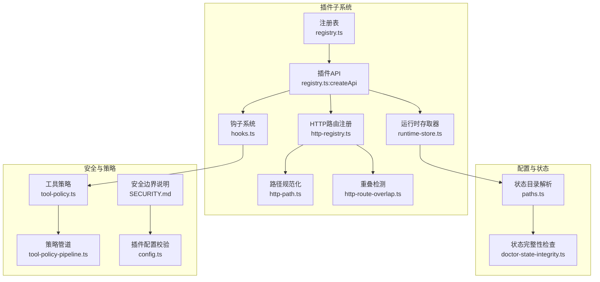
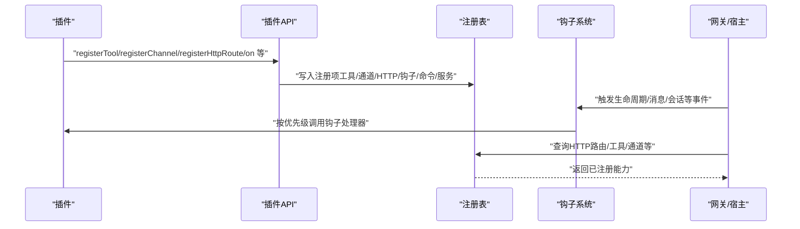
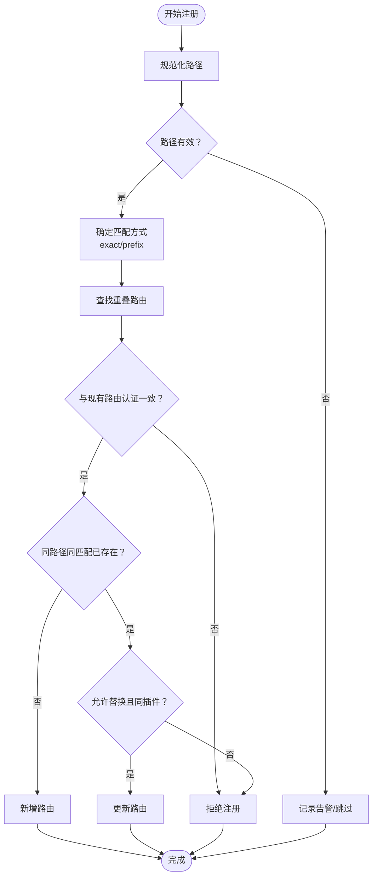
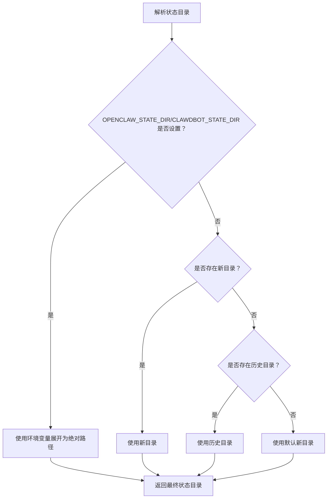
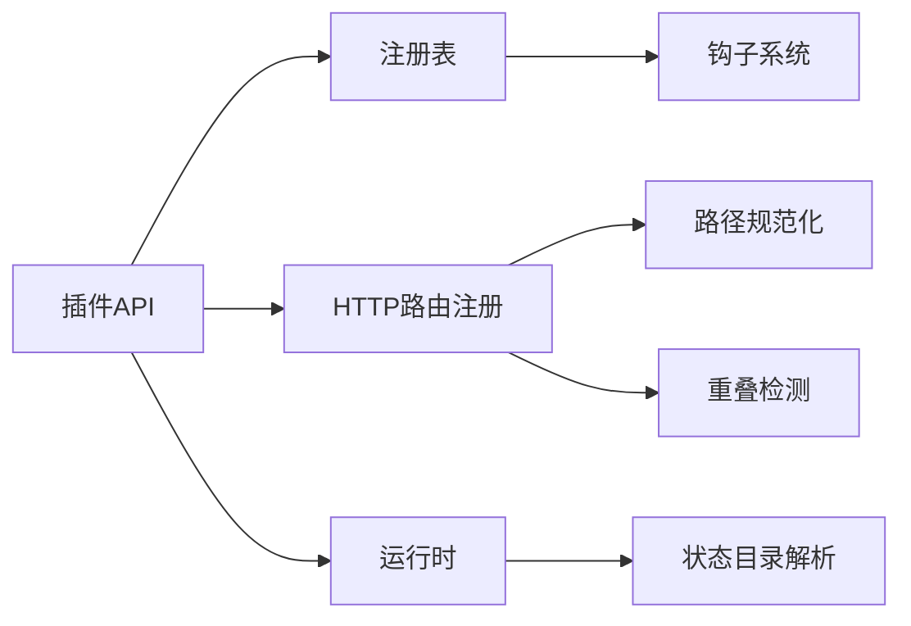

# 插件通信机制

## 目录
1. [简介](#简介)
2. [项目结构](#项目结构)
3. [核心组件](#核心组件)
4. [架构总览](#架构总览)
5. [详细组件分析](#详细组件分析)
6. [依赖关系分析](#依赖关系分析)
7. [性能考量](#性能考量)
8. [故障排查指南](#故障排查指南)
9. [结论](#结论)
10. [附录](#附录)

## 简介
本文件系统性梳理 OpenClaw 的插件通信机制，覆盖插件与宿主系统的通信协议、HTTP 路由注册与 Webhook 处理、插件间通信与数据共享策略、WebSocket 实时消息传递、状态存储与持久化、事件系统与消息传递 API、权限控制与安全边界、性能优化与错误处理策略，以及调试与监控方法。目标是帮助开发者在理解现有实现的基础上，正确扩展与维护插件生态。

## 项目结构
OpenClaw 将插件通信相关能力集中在 src/plugins 子系统中，并通过统一的运行时、注册表、钩子系统与路径解析来支撑插件生命周期与运行期交互。关键模块包括：
- 注册表与 API：负责插件能力注册（工具、通道、HTTP 路由、命令、服务等）
- 钩子系统：提供生命周期事件与消息流事件的有序执行
- HTTP 路由：插件可注册受控的 HTTP 入口，支持精确匹配与前缀匹配
- 运行时与状态：提供日志、状态目录解析、媒体处理、文本分块等能力
- 权限与策略：通过工具策略、插件配置校验与安全边界约束保障系统安全

图表来源
- [registry.ts](file://src/plugins/registry.ts#L185-L624)
- [http-registry.ts](file://src/plugins/http-registry.ts#L12-L92)
- [http-path.ts](file://src/plugins/http-path.ts#L1-L15)
- [http-route-overlap.ts](file://src/plugins/http-route-overlap.ts#L1-L45)
- [runtime-store.ts](file://src/plugin-sdk/runtime-store.ts#L1-L26)
- [paths.ts](file://src/config/paths.ts#L60-L89)
- [doctor-state-integrity.ts](file://src/commands/doctor-state-integrity.ts#L345-L696)
- [SECURITY.md](file://SECURITY.md#L104-L110)
- [tool-policy.ts](file://src/agents/tool-policy.ts#L197-L205)
- [tool-policy-pipeline.ts](file://src/agents/tool-policy-pipeline.ts#L104-L108)
- [config.ts](file://extensions/acpx/src/config.ts#L155-L189)

章节来源
- [registry.ts](file://src/plugins/registry.ts#L185-L624)
- [http-registry.ts](file://src/plugins/http-registry.ts#L12-L92)
- [http-path.ts](file://src/plugins/http-path.ts#L1-L15)
- [http-route-overlap.ts](file://src/plugins/http-route-overlap.ts#L1-L45)
- [runtime-store.ts](file://src/plugin-sdk/runtime-store.ts#L1-L26)
- [paths.ts](file://src/config/paths.ts#L60-L89)
- [doctor-state-integrity.ts](file://src/commands/doctor-state-integrity.ts#L345-L696)
- [SECURITY.md](file://SECURITY.md#L104-L110)
- [tool-policy.ts](file://src/agents/tool-policy.ts#L197-L205)
- [tool-policy-pipeline.ts](file://src/agents/tool-policy-pipeline.ts#L104-L108)
- [config.ts](file://extensions/acpx/src/config.ts#L155-L189)

## 核心组件
- 插件注册表与 API
  - 统一注册工具、通道、HTTP 路由、命令、服务、网关方法、上下文引擎等
  - 提供插件生命周期钩子注册与执行
- HTTP 路由注册与冲突检测
  - 支持精确匹配与前缀匹配；对重叠路径与不同认证级别进行严格约束
- 钩子系统
  - 按优先级顺序执行修改型钩子，按并行策略执行无返回值钩子
  - 对同步热路径钩子进行严格限制，避免异步误用
- 运行时与状态
  - 提供日志、状态目录解析、媒体下载与保存、文本分块等能力
- 权限与策略
  - 工具调用策略合并与过滤；插件配置校验；安全边界说明

章节来源
- [registry.ts](file://src/plugins/registry.ts#L185-L624)
- [hooks.ts](file://src/plugins/hooks.ts#L126-L760)
- [types.ts](file://src/plugins/types.ts#L205-L219)
- [plugin-sdk.md](file://docs/refactor/plugin-sdk.md#L45-L145)
- [plugin-sdk.md（中文）](file://docs/zh-CN/refactor/plugin-sdk.md#L52-L152)

## 架构总览
下图展示插件与宿主系统的关键交互：插件通过 API 注册能力，宿主在运行期通过注册表与钩子系统驱动插件；HTTP 路由由插件声明式注册，宿主侧进行冲突检测与规范化；运行时提供状态目录与日志能力；安全策略贯穿配置校验与工具调用。

图表来源
- [registry.ts](file://src/plugins/registry.ts#L575-L623)
- [hooks.ts](file://src/plugins/hooks.ts#L126-L760)
- [http-registry.ts](file://src/plugins/http-registry.ts#L12-L92)

## 详细组件分析

### HTTP 路由注册与 Webhook 处理
- 路径规范化与注册
  - 使用路径规范化函数确保以斜杠开头且非空
  - 注册时支持精确匹配与前缀匹配两种模式
- 冲突与重叠检测
  - 若存在同路径同匹配方式的注册，需显式允许替换且同插件方可替换
  - 不同认证级别的重叠路径将被拒绝
- 认证与来源
  - 插件必须显式声明 auth（gateway 或 plugin），否则注册失败
  - 注册条目记录 pluginId 与 source，便于审计与排障

图表来源
- [http-registry.ts](file://src/plugins/http-registry.ts#L12-L92)
- [http-path.ts](file://src/plugins/http-path.ts#L1-L15)
- [http-route-overlap.ts](file://src/plugins/http-route-overlap.ts#L15-L44)

章节来源
- [http-registry.ts](file://src/plugins/http-registry.ts#L12-L92)
- [http-path.ts](file://src/plugins/http-path.ts#L1-L15)
- [http-route-overlap.ts](file://src/plugins/http-route-overlap.ts#L1-L45)
- [plugin.md](file://docs/tools/plugin.md#L139-L144)

### 插件间通信与数据共享
- 通道插件协作
  - 通过通道注册与路由解析，插件可声明其支持的渠道能力与路由策略
- 会话与消息上下文
  - 钩子系统提供消息接收、发送、结果持久化、写入前拦截等事件，形成跨插件的消息流转契约
- 数据共享策略
  - 插件通过注册表共享工具、命令、服务等能力；状态共享通过运行时提供的状态目录与媒体缓存能力实现

章节来源
- [registry.ts](file://src/plugins/registry.ts#L402-L428)
- [hooks.ts](file://src/plugins/hooks.ts#L391-L427)
- [hooks.ts](file://src/plugins/hooks.ts#L475-L522)
- [hooks.ts](file://src/plugins/hooks.ts#L540-L599)

### WebSocket 连接与实时消息传递
- 客户端模拟与测试
  - 提供 WebSocket 会话与任务的最小实现，用于测试实时消息传递流程
- 协议与握手
  - 测试用例展示了握手响应帧结构与特性字段，体现协议版本、特性列表与快照信息
- 实际集成
  - 在移动端与桌面端，可通过类似会话抽象与任务队列实现 WebSocket 连接与消息收发

章节来源
- [openai-ws-connection.test.ts](file://src/agents/openai-ws-connection.test.ts#L29-L81)

### 插件状态存储与持久化
- 状态目录解析
  - 支持环境变量覆盖与历史兼容目录探测，默认位于用户家目录下的特定子目录
- 多态状态目录检测
  - 可检测多个状态目录并给出警告，避免会话历史分裂
- 插件状态目录解析
  - 插件运行时通过状态解析器获取插件专属状态目录，确保隔离与持久化

图表来源
- [paths.ts](file://src/config/paths.ts#L60-L89)
- [doctor-state-integrity.ts](file://src/commands/doctor-state-integrity.ts#L345-L696)

章节来源
- [paths.ts](file://src/config/paths.ts#L60-L89)
- [doctor-state-integrity.ts](file://src/commands/doctor-state-integrity.ts#L345-L696)

### 插件事件系统与消息传递 API
- 生命周期钩子
  - 包括 before_model_resolve、before_prompt_build、before_agent_start、llm_input、llm_output、agent_end、before_compaction、after_compaction、before_reset、session_start/end、subagent_* 等
- 消息钩子
  - message_received、message_sending、message_sent；支持串行合并与取消/内容修改
- 工具钩子
  - before_tool_call、after_tool_call；tool_result_persist、before_message_write（同步热路径）
- API 使用要点
  - 通过 api.on 注册生命周期钩子，按优先级排序执行
  - 通过 api.registerHttpRoute 声明 HTTP 入口，明确 auth 与 match

章节来源
- [hooks.ts](file://src/plugins/hooks.ts#L126-L760)
- [types.ts](file://src/plugins/types.ts#L321-L372)
- [plugin-sdk.md](file://docs/refactor/plugin-sdk.md#L45-L145)
- [plugin-sdk.md（中文）](file://docs/zh-CN/refactor/plugin-sdk.md#L52-L152)

### 权限控制与安全边界管理
- 插件信任模型
  - 插件属于网关可信计算基，安装或启用即授予与本地主机相同信任级别
- 工具策略
  - 合并与过滤工具调用策略，支持插件组与通配符
- 插件配置校验
  - 通过配置 Schema 与自定义校验逻辑，确保插件参数合法
- 安全边界
  - 安全报告需证明越界（如未授权加载、白名单/策略绕过、沙箱/路径安全绕过）

章节来源
- [SECURITY.md](file://SECURITY.md#L104-L110)
- [tool-policy.ts](file://src/agents/tool-policy.ts#L197-L205)
- [tool-policy-pipeline.ts](file://src/agents/tool-policy-pipeline.ts#L104-L108)
- [config.ts](file://extensions/acpx/src/config.ts#L155-L189)

## 依赖关系分析
- 组件耦合
  - 注册表与 API：紧密耦合，API 作为注册入口封装注册行为
  - 钩子系统：依赖注册表中的钩子登记，按名称与优先级执行
  - HTTP 路由：依赖路径规范化与重叠检测，避免冲突
  - 运行时：为插件提供日志、状态目录、媒体与文本处理能力
- 外部依赖
  - Node.js HTTP 服务器（IncomingMessage/ServerResponse）
  - 文件系统（状态目录、媒体缓存）
  - 环境变量（OPENCLAW_STATE_DIR 等）

图表来源
- [registry.ts](file://src/plugins/registry.ts#L575-L623)
- [hooks.ts](file://src/plugins/hooks.ts#L126-L760)
- [http-registry.ts](file://src/plugins/http-registry.ts#L12-L92)
- [http-path.ts](file://src/plugins/http-path.ts#L1-L15)
- [http-route-overlap.ts](file://src/plugins/http-route-overlap.ts#L1-L45)
- [runtime-store.ts](file://src/plugin-sdk/runtime-store.ts#L1-L26)
- [paths.ts](file://src/config/paths.ts#L60-L89)

章节来源
- [registry.ts](file://src/plugins/registry.ts#L185-L624)
- [hooks.ts](file://src/plugins/hooks.ts#L126-L760)
- [http-registry.ts](file://src/plugins/http-registry.ts#L12-L92)

## 性能考量
- 并行执行
  - 无返回值钩子采用并行执行以提升吞吐
- 串行合并
  - 修改型钩子按优先级串行执行并合并结果，保证一致性
- 同步热路径
  - tool_result_persist 与 before_message_write 明确为同步钩子，禁止异步返回，避免阻塞热路径
- 路由冲突避免
  - 严格的重叠检测与替换规则减少运行期冲突与回退成本

章节来源
- [hooks.ts](file://src/plugins/hooks.ts#L203-L224)
- [hooks.ts](file://src/plugins/hooks.ts#L230-L264)
- [hooks.ts](file://src/plugins/hooks.ts#L475-L522)
- [hooks.ts](file://src/plugins/hooks.ts#L540-L599)
- [http-registry.ts](file://src/plugins/http-registry.ts#L36-L74)

## 故障排查指南
- HTTP 路由问题
  - 路径缺失或认证未声明会导致注册失败；重叠路由被拒绝；替换需同插件且允许替换
- 钩子异常
  - 钩子处理器抛错会被捕获并记录（可配置），不影响其他处理器执行
- 状态目录问题
  - 多个状态目录可能导致会话历史分裂；应统一到单一目录
- WebSocket 连接
  - 通过测试用例中的会话抽象验证握手与消息收发流程

章节来源
- [http-registry.ts](file://src/plugins/http-registry.ts#L31-L74)
- [hooks.ts](file://src/plugins/hooks.ts#L184-L197)
- [doctor-state-integrity.ts](file://src/commands/doctor-state-integrity.ts#L345-L696)
- [openai-ws-connection.test.ts](file://src/agents/openai-ws-connection.test.ts#L29-L81)

## 结论
OpenClaw 的插件通信机制以“声明式注册 + 严格冲突检测 + 钩子系统 + 运行时能力”为核心，既保证了插件生态的灵活性与可扩展性，又通过安全边界与策略约束确保系统稳定与可控。HTTP 路由、事件钩子、状态存储与权限控制共同构成完整的插件通信闭环。遵循本文档的规范与最佳实践，可高效构建与维护高质量插件。

## 附录
- 插件 API 与钩子参考
  - 参考插件 SDK 文档，了解运行时能力与钩子事件的完整定义
- 安全与合规
  - 严格遵守插件信任模型与安全边界，避免越界行为

章节来源
- [plugin-sdk.md](file://docs/refactor/plugin-sdk.md#L45-L145)
- [plugin-sdk.md（中文）](file://docs/zh-CN/refactor/plugin-sdk.md#L52-L152)
- [SECURITY.md](file://SECURITY.md#L104-L110)