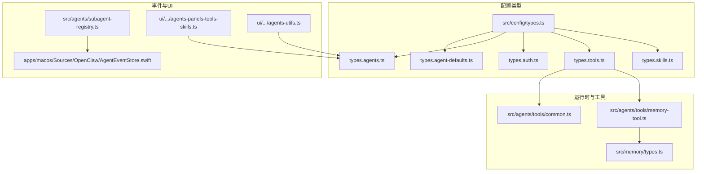
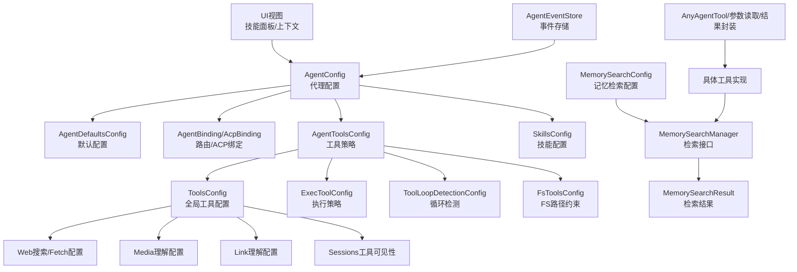
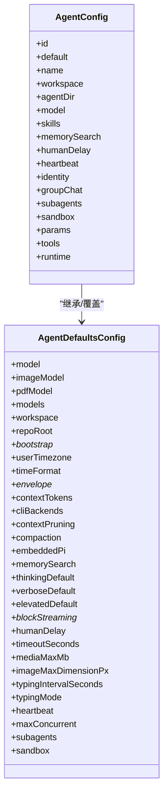
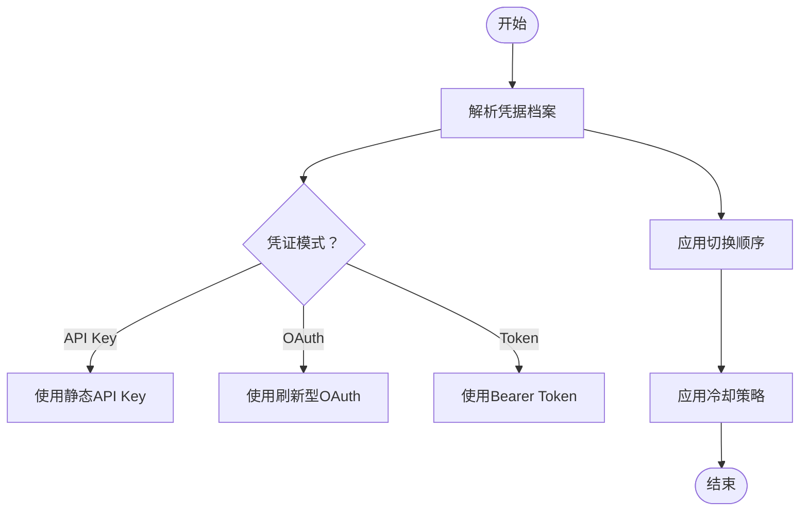
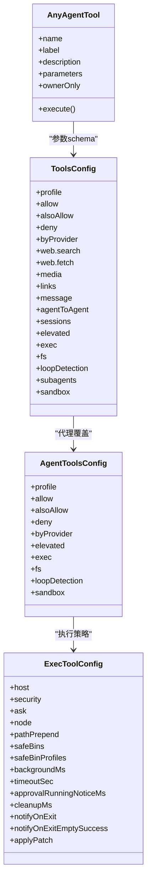
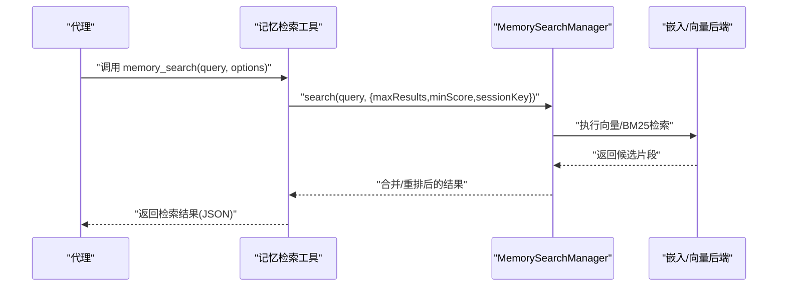
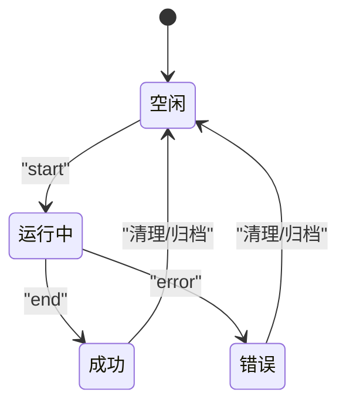
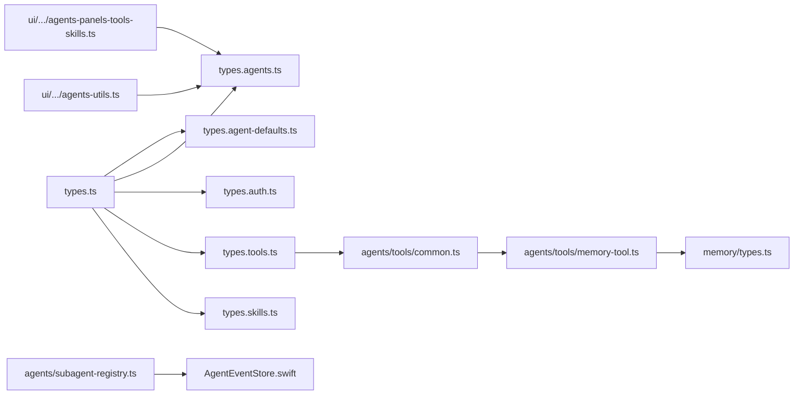

# 代理类型定义

## 目录
1. [引言](#引言)
2. [项目结构](#项目结构)
3. [核心组件](#核心组件)
4. [架构总览](#架构总览)
5. [详细组件分析](#详细组件分析)
6. [依赖关系分析](#依赖关系分析)
7. [性能考量](#性能考量)
8. [故障排查指南](#故障排查指南)
9. [结论](#结论)
10. [附录](#附录)

## 引言
本文件面向OpenClaw代理系统的开发者与运维人员，系统性梳理代理的核心数据类型、运行时状态、配置项与覆盖机制，以及代理会话、记忆与工具调用的类型定义。同时，文档覆盖代理生命周期管理的事件类型与状态转换、认证与权限相关的类型、代理工具与技能的接口规范，并给出扩展与自定义行为的类型化建议。内容以仓库中的类型定义与测试用例为依据，确保可追溯与可验证。

## 项目结构
OpenClaw的类型体系主要集中在配置模块与内存/工具模块中，采用“按功能域拆分”的组织方式，便于维护与编辑局部性。核心目录与文件如下：
- 配置类型入口：src/config/types.ts 汇总导出各子域类型
- 代理默认配置：src/config/types.agent-defaults.ts
- 代理配置与路由绑定：src/config/types.agents.ts
- 认证与凭据：src/config/types.auth.ts
- 工具与策略：src/config/types.tools.ts
- 技能配置：src/config/types.skills.ts
- 内存与检索：src/memory/types.ts
- 工具通用能力：src/agents/tools/common.ts
- 记忆检索工具实现：src/agents/tools/memory-tool.ts
- 记忆检索配置解析测试：src/agents/memory-search.test.ts
- 子代理生命周期事件监听：src/agents/subagent-registry.ts
- 控制端事件存储（macOS）：apps/macos/Sources/OpenClaw/AgentEventStore.swift
- UI侧技能面板渲染与上下文构建：ui/src/ui/views/agents-panels-tools-skills.ts、ui/src/ui/views/agents-utils.ts
- 凭据面（SecretRef）范围说明：docs/reference/secretref-credential-surface.md

**图表来源**
- [src/config/types.ts](file://src/config/types.ts#L1-L36)
- [src/config/types.agent-defaults.ts](file://src/config/types.agent-defaults.ts#L1-L346)
- [src/config/types.agents.ts](file://src/config/types.agents.ts#L1-L96)
- [src/config/types.auth.ts](file://src/config/types.auth.ts#L1-L30)
- [src/config/types.tools.ts](file://src/config/types.tools.ts#L1-L609)
- [src/config/types.skills.ts](file://src/config/types.skills.ts#L1-L48)
- [src/memory/types.ts](file://src/memory/types.ts#L1-L81)
- [src/agents/tools/common.ts](file://src/agents/tools/common.ts#L1-L341)
- [src/agents/tools/memory-tool.ts](file://src/agents/tools/memory-tool.ts#L1-L71)
- [src/agents/subagent-registry.ts](file://src/agents/subagent-registry.ts#L752-L807)
- [apps/macos/Sources/OpenClaw/AgentEventStore.swift](file://apps/macos/Sources/OpenClaw/AgentEventStore.swift#L1-L22)
- [ui/src/ui/views/agents-panels-tools-skills.ts](file://ui/src/ui/views/agents-panels-tools-skills.ts#L312-L491)
- [ui/src/ui/views/agents-utils.ts](file://ui/src/ui/views/agents-utils.ts#L146-L178)

**章节来源**
- [src/config/types.ts](file://src/config/types.ts#L1-L36)

## 核心组件
本节从类型视角概述代理系统的关键构件及其职责：
- 代理默认配置（AgentDefaultsConfig）：定义模型、工作空间、心跳、并发、思维/日志级别、流式输出、媒体与图片限制、打点与压缩等全局默认行为。
- 代理配置（AgentConfig）：在默认之上叠加每代理的覆盖项，如技能白名单、路由绑定、身份标识、子代理策略、沙箱与运行时等。
- 工具与策略（ToolsConfig/AgentToolsConfig）：统一管理工具集、执行策略、循环检测、跨上下文发送、会话可见性、提升权限与文件系统路径约束等。
- 认证与凭据（AuthConfig/AuthProfileConfig）：定义凭据类型（API Key/OAuth/Token）、冷却策略与回退逻辑。
- 技能配置（SkillsConfig）：控制技能加载、安装、限制与单个技能的密钥/环境注入。
- 内存与检索（MemorySearchConfig/MemorySearchResult）：向量检索开关、索引/缓存/批处理、混合检索、时序衰减、会话源开关等。
- 工具通用能力（AnyAgentTool、参数读取、结果封装、图像结果）：标准化工具输入校验、错误类型与结果格式。
- 生命周期事件（AgentEventStore、子代理运行跟踪）：事件存储与子代理生命周期状态机。

**章节来源**
- [src/config/types.agent-defaults.ts](file://src/config/types.agent-defaults.ts#L120-L287)
- [src/config/types.agents.ts](file://src/config/types.agents.ts#L61-L96)
- [src/config/types.tools.ts](file://src/config/types.tools.ts#L285-L313)
- [src/config/types.auth.ts](file://src/config/types.auth.ts#L1-L30)
- [src/config/types.skills.ts](file://src/config/types.skills.ts#L40-L48)
- [src/memory/types.ts](file://src/memory/types.ts#L1-L81)
- [src/agents/tools/common.ts](file://src/agents/tools/common.ts#L7-L341)
- [apps/macos/Sources/OpenClaw/AgentEventStore.swift](file://apps/macos/Sources/OpenClaw/AgentEventStore.swift#L1-L22)
- [src/agents/subagent-registry.ts](file://src/agents/subagent-registry.ts#L752-L807)

## 架构总览
下图展示代理类型在系统中的交互关系：配置层决定行为；工具层负责执行；内存层提供检索；UI与事件层用于可观测与治理。

**图表来源**
- [src/config/types.agents.ts](file://src/config/types.agents.ts#L61-L96)
- [src/config/types.agent-defaults.ts](file://src/config/types.agent-defaults.ts#L120-L287)
- [src/config/types.tools.ts](file://src/config/types.tools.ts#L285-L608)
- [src/memory/types.ts](file://src/memory/types.ts#L61-L81)
- [src/agents/tools/common.ts](file://src/agents/tools/common.ts#L7-L341)
- [ui/src/ui/views/agents-panels-tools-skills.ts](file://ui/src/ui/views/agents-panels-tools-skills.ts#L312-L491)
- [apps/macos/Sources/OpenClaw/AgentEventStore.swift](file://apps/macos/Sources/OpenClaw/AgentEventStore.swift#L1-L22)

## 详细组件分析

### 代理配置与默认值
- 默认配置（AgentDefaultsConfig）
  - 模型与多模态模型：支持主备模型列表、别名与参数透传。
  - 工作空间与引导：工作目录、仓库根、引导文件截断策略与最大字符数。
  - 时间与信封：用户时区、时间格式、信封时间戳与相对时间显示。
  - 上下文窗口与CLI后端：令牌上限、CLI命令行后端参数、序列化与看门狗超时。
  - 上下文修剪：软硬裁剪策略、工具白/黑名单、保留最后若干助手消息。
  - 压缩与摘要：压缩模式、保留令牌预算、历史份额、标识符保留策略、质量审计重试。
  - 心跳：周期、活跃时段、目标通道、直接消息策略、提示词与轻量上下文。
  - 并发与子代理：全局并发、最大子代深度、每请求最大子代数、归档时间、默认模型与思考等级。
  - 沙箱与运行时：非主会话沙箱策略。
- 代理配置（AgentConfig）
  - 覆盖默认：技能白名单、人类延迟、心跳覆盖、身份、群聊配置、子代理默认、沙箱覆盖、流式参数、工具策略、运行时描述。

**图表来源**
- [src/config/types.agent-defaults.ts](file://src/config/types.agent-defaults.ts#L120-L287)
- [src/config/types.agents.ts](file://src/config/types.agents.ts#L61-L96)

**章节来源**
- [src/config/types.agent-defaults.ts](file://src/config/types.agent-defaults.ts#L1-L346)
- [src/config/types.agents.ts](file://src/config/types.agents.ts#L1-L96)

### 认证与权限
- 认证配置（AuthConfig）
  - 多个凭据档案（profiles），每个档案指定提供方与凭证模式（API Key/OAuth/Token）。
  - 凭据切换顺序（order），按提供方与账户维度排序。
  - 冷却策略：账单回退小时数、按提供方细分、失败窗口与上限。
- 凭据表面（SecretRef Credential Surface）
  - 明确“受支持/不受支持”的凭据范围，指导 secrets configure/apply/audit 的使用边界。

**图表来源**
- [src/config/types.auth.ts](file://src/config/types.auth.ts#L1-L30)
- [docs/reference/secretref-credential-surface.md](file://docs/reference/secretref-credential-surface.md#L1-L24)

**章节来源**
- [src/config/types.auth.ts](file://src/config/types.auth.ts#L1-L30)
- [docs/reference/secretref-credential-surface.md](file://docs/reference/secretref-credential-surface.md#L1-L24)

### 工具与技能接口
- 工具配置（ToolsConfig/AgentToolsConfig）
  - 基础配置：profile、allow/alsoAllow/deny、按提供方覆盖。
  - 执行策略（exec）：宿主路由（沙箱/网关/节点）、安全模式（拒绝/允许/全开）、询问策略、PATH扩展、安全二进制清单与自定义配置、后台/超时/通知等。
  - 文件系统策略（fs）：仅限工作区。
  - 循环检测（loopDetection）：重复调用、无进展轮询、乒乓模式等检测器与阈值。
  - 沙箱工具策略（sandbox.tools）：允许/禁止列表。
  - Web搜索/Fetch：提供商选择、密钥注入、结果数量、缓存TTL、可选Firecrawl回退。
  - 媒体理解：图像/音频/视频三类配置，含能力标签、CLI或Provider两种路径、语言提示、超时与字节数限制。
  - 链接理解：最大链接数、超时、模型回退。
  - 会话工具可见性（sessions.visibility）：self/tree/agent/all。
  - 提升权限（elevated）：全局与代理级开关及来源许可。
  - 子代理与沙箱默认策略：模型与工具白/黑名单。
- 技能配置（SkillsConfig）
  - 捆绑技能白名单、额外扫描目录、监控与去抖、安装偏好与包管理器、加载与提示限制。
- 工具通用能力（AnyAgentTool、参数读取、结果封装、图像结果）
  - 统一的工具签名、ownerOnly限制、输入参数读取（字符串/数字/数组/反应）、错误类型（ToolInputError/ToolAuthorizationError）、JSON结果封装、图像结果生成与净化。

**图表来源**
- [src/config/types.tools.ts](file://src/config/types.tools.ts#L285-L608)
- [src/agents/tools/common.ts](file://src/agents/tools/common.ts#L7-L341)

**章节来源**
- [src/config/types.tools.ts](file://src/config/types.tools.ts#L1-L609)
- [src/config/types.skills.ts](file://src/config/types.skills.ts#L1-L48)
- [src/agents/tools/common.ts](file://src/agents/tools/common.ts#L1-L341)

### 记忆与检索
- 记忆检索配置（MemorySearchConfig）
  - 开关与来源：memory/sessions，实验性会话索引开关。
  - 远端/本地嵌入：提供方、模型、批处理、缓存、SQLite向量扩展、分块策略。
  - 同步策略：会话开始/搜索/监视、会话增量阈值。
  - 查询策略：最大结果、最小分数、BM25+向量融合、MMR重排、时间衰减。
  - 索引缓存：启用与容量。
- 记忆检索结果（MemorySearchResult）
  - 片段路径、起止行、相似度、片段文本、来源、引用信息。
- 记忆管理器接口（MemorySearchManager）
  - 搜索、文件读取、状态查询、同步、嵌入/向量可用性探测、关闭。

**图表来源**
- [src/agents/tools/memory-tool.ts](file://src/agents/tools/memory-tool.ts#L40-L71)
- [src/memory/types.ts](file://src/memory/types.ts#L61-L81)

**章节来源**
- [src/memory/types.ts](file://src/memory/types.ts#L1-L81)
- [src/agents/tools/memory-tool.ts](file://src/agents/tools/memory-tool.ts#L1-L71)
- [src/agents/memory-search.test.ts](file://src/agents/memory-search.test.ts#L266-L305)

### 代理生命周期与事件
- 子代理运行跟踪
  - 监听生命周期事件流（lifecycle），根据 phase(start/end/error) 更新运行记录，记录开始/结束时间、错误、结果状态（ok/timeout），并在结束时触发清理与告别消息。
- 控制端事件存储（macOS）
  - 单例事件存储，限制最大事件数，支持追加与清空。

**图表来源**
- [src/agents/subagent-registry.ts](file://src/agents/subagent-registry.ts#L752-L807)
- [apps/macos/Sources/OpenClaw/AgentEventStore.swift](file://apps/macos/Sources/OpenClaw/AgentEventStore.swift#L1-L22)

**章节来源**
- [src/agents/subagent-registry.ts](file://src/agents/subagent-registry.ts#L752-L807)
- [apps/macos/Sources/OpenClaw/AgentEventStore.swift](file://apps/macos/Sources/OpenClaw/AgentEventStore.swift#L1-L22)

### 会话、记忆与工具调用的类型定义
- 会话键与作用域解析
  - 通过会话键解析所属代理ID，用于确定记忆检索配置与工具上下文。
- 工具调用参数
  - 统一的参数读取函数族（字符串/数字/数组/反应），严格校验与容错处理，避免歧义命名。
- 结果封装
  - JSON结果封装与图像结果生成，自动进行媒体净化与尺寸限制。

**章节来源**
- [src/agents/tools/memory-tool.ts](file://src/agents/tools/memory-tool.ts#L25-L38)
- [src/agents/tools/common.ts](file://src/agents/tools/common.ts#L74-L201)
- [src/agents/tools/common.ts](file://src/agents/tools/common.ts#L230-L302)

### 配置覆盖与默认值
- 默认优先级
  - 全局默认（AgentDefaultsConfig） → 代理级覆盖（AgentConfig） → 工具级覆盖（AgentToolsConfig/ToolsConfig）。
- 实验性特性
  - 记忆检索的会话源开关（experimental.sessionMemory）需显式开启才生效。
- UI侧上下文构建
  - 从配置表单与文件系统推导工作区、模型标签、身份名称与表情、技能过滤与计数。

**章节来源**
- [src/config/types.agent-defaults.ts](file://src/config/types.agent-defaults.ts#L120-L287)
- [src/config/types.agents.ts](file://src/config/types.agents.ts#L61-L96)
- [src/agents/memory-search.test.ts](file://src/agents/memory-search.test.ts#L266-L305)
- [ui/src/ui/views/agents-utils.ts](file://ui/src/ui/views/agents-utils.ts#L146-L178)

### 安全与权限
- 执行策略（exec.security）
  - 拒绝/允许/全开三种模式，结合安全二进制清单与自定义配置，降低提权风险。
- 提升权限（elevated）
  - 全局与代理级开关，配合来源许可（allowFrom）控制谁可以发起提升权限请求。
- 文件系统路径约束（fs.workspaceOnly）
  - 限制文件系统工具仅在工作区目录内操作，减少越权访问。
- 凭据面（SecretRef）
  - 明确哪些凭据属于受支持范围，指导凭据配置与审计。

**章节来源**
- [src/config/types.tools.ts](file://src/config/types.tools.ts#L228-L275)
- [src/config/types.tools.ts](file://src/config/types.tools.ts#L577-L583)
- [src/config/types.tools.ts](file://src/config/types.tools.ts#L277-L283)
- [docs/reference/secretref-credential-surface.md](file://docs/reference/secretref-credential-surface.md#L1-L24)

### 代理扩展与自定义行为
- 技能扩展（SkillsConfig.entries）
  - 为单个技能注入密钥、环境变量与任意配置对象，实现按需定制。
- 工具扩展（AgentToolsConfig.byProvider）
  - 按提供方或“提供方/模型”粒度覆盖工具策略，满足不同供应商的差异化需求。
- UI侧技能面板
  - 支持筛选、启用/禁用、批量操作与保存配置，便于治理与快速调整。

**章节来源**
- [src/config/types.skills.ts](file://src/config/types.skills.ts#L40-L48)
- [src/config/types.tools.ts](file://src/config/types.tools.ts#L292-L294)
- [ui/src/ui/views/agents-panels-tools-skills.ts](file://ui/src/ui/views/agents-panels-tools-skills.ts#L312-L491)

## 依赖关系分析
- 配置聚合
  - types.ts 将各子域类型集中导出，形成清晰的类型入口。
- 工具到内存
  - 记忆检索工具依赖 MemorySearchManager 接口，实现对向量/全文/会话源的统一检索。
- UI与配置
  - UI视图从配置表单与文件系统推导上下文，再渲染技能面板与工具可见性。
- 事件与运行时
  - 子代理注册表监听生命周期事件，驱动运行时状态机与资源回收。

**图表来源**
- [src/config/types.ts](file://src/config/types.ts#L1-L36)
- [src/config/types.tools.ts](file://src/config/types.tools.ts#L285-L608)
- [src/agents/tools/common.ts](file://src/agents/tools/common.ts#L7-L341)
- [src/agents/tools/memory-tool.ts](file://src/agents/tools/memory-tool.ts#L1-L71)
- [src/memory/types.ts](file://src/memory/types.ts#L1-L81)
- [ui/src/ui/views/agents-panels-tools-skills.ts](file://ui/src/ui/views/agents-panels-tools-skills.ts#L312-L491)
- [ui/src/ui/views/agents-utils.ts](file://ui/src/ui/views/agents-utils.ts#L146-L178)
- [src/agents/subagent-registry.ts](file://src/agents/subagent-registry.ts#L752-L807)
- [apps/macos/Sources/OpenClaw/AgentEventStore.swift](file://apps/macos/Sources/OpenClaw/AgentEventStore.swift#L1-L22)

**章节来源**
- [src/config/types.ts](file://src/config/types.ts#L1-L36)

## 性能考量
- 记忆检索
  - 合理设置 chunking/tokens、overlap 与 hybrid.vectorWeight/textWeight，平衡召回与重排成本。
  - 使用缓存与批处理（batch.enabled/wait/concurrency/pollIntervalMs/timeoutMinutes）降低重复计算。
  - 在高并发场景启用 sync.watchDebounceMs 与 sessions.deltaBytes/deltaMessages，减少频繁重建索引。
- 工具执行
  - 通过 exec.timeoutSec、backgroundMs 与 cleanupMs 控制资源占用与回收节奏。
  - 使用 loopDetection 的阈值与检测器，避免无效循环导致的CPU与IO浪费。
- UI与可观测
  - 事件存储限制最大事件数，避免内存膨胀；必要时持久化至磁盘或外部存储。

[本节为通用指导，无需特定文件引用]

## 故障排查指南
- 记忆检索不可用
  - 检查 memorySearch.enabled 与 sources，确认实验性开关 experimental.sessionMemory 是否开启。
  - 关注 MemorySearchManager.status 中的 fts/vector/cache/batch 字段，定位失败原因。
- 工具调用失败
  - 使用 ToolInputError/ToolAuthorizationError 的错误码与消息定位输入参数问题或权限不足。
  - 对于图像结果，检查媒体净化与尺寸限制是否导致内容被裁剪或丢弃。
- 子代理运行异常
  - 查看生命周期事件中的 error 字段与结束时间，确认是否因超时或错误而中断。
  - 核对子代理并发限制、运行超时与归档策略。

**章节来源**
- [src/agents/memory-search.test.ts](file://src/agents/memory-search.test.ts#L266-L305)
- [src/agents/tools/common.ts](file://src/agents/tools/common.ts#L26-L42)
- [src/agents/subagent-registry.ts](file://src/agents/subagent-registry.ts#L752-L807)

## 结论
OpenClaw的代理类型体系以“配置优先、工具标准化、内存检索可插拔、事件可观测”为核心设计原则。通过明确的默认值与覆盖机制、严格的工具与执行策略、完善的记忆检索与会话可见性控制，系统在灵活性与安全性之间取得平衡。建议在生产环境中：
- 明确凭据面与冷却策略，避免滥用与回退风暴；
- 合理配置记忆检索与工具循环检测，保障性能与稳定性；
- 利用UI与事件存储进行持续治理与审计。

[本节为总结性内容，无需特定文件引用]

## 附录
- 类型入口一览：src/config/types.ts
- 记忆检索配置解析测试：src/agents/memory-search.test.ts
- macOS事件存储：apps/macos/Sources/OpenClaw/AgentEventStore.swift
- UI技能面板与上下文：ui/src/ui/views/agents-panels-tools-skills.ts、ui/src/ui/views/agents-utils.ts

[本节为补充信息，无需特定文件引用]