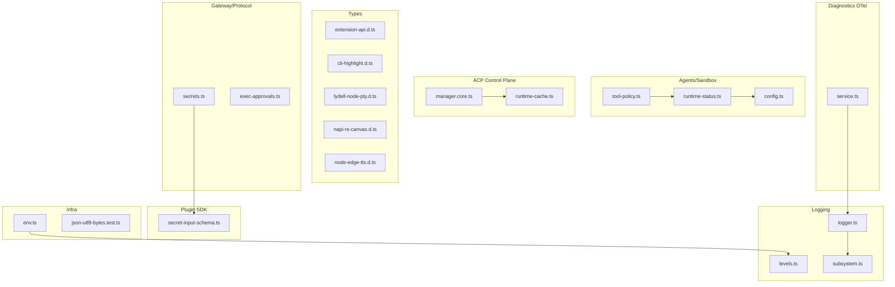
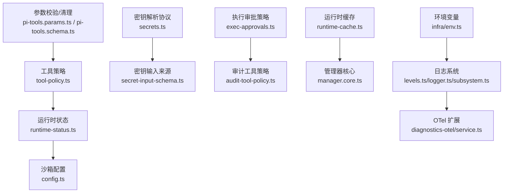
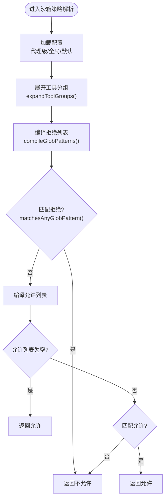
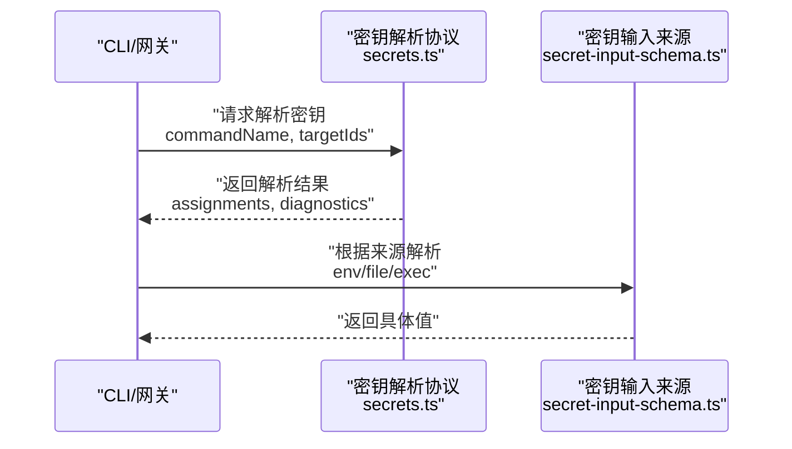
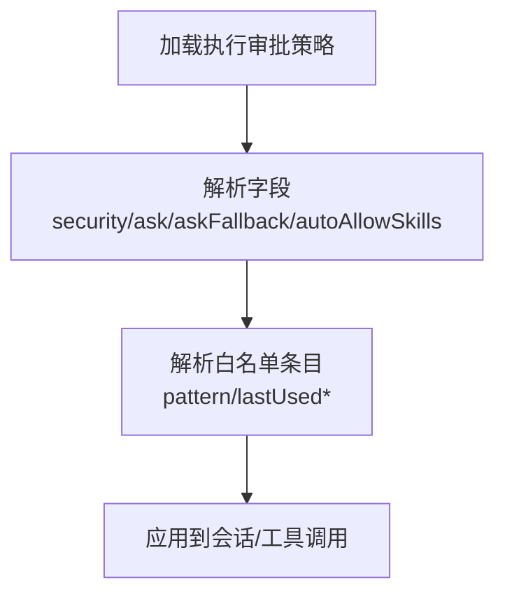
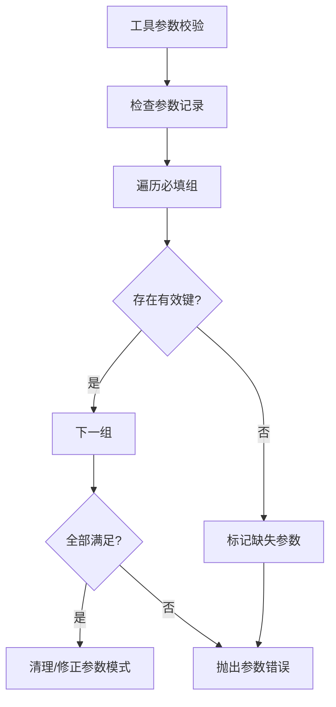
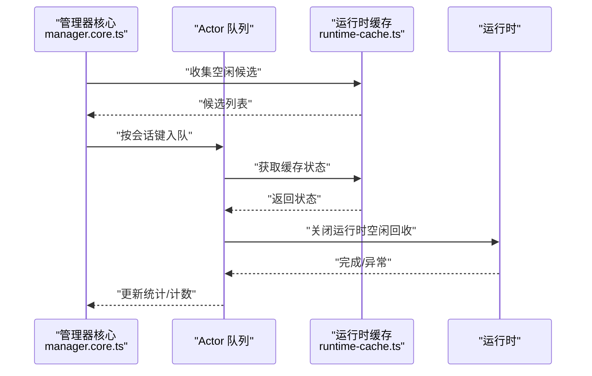
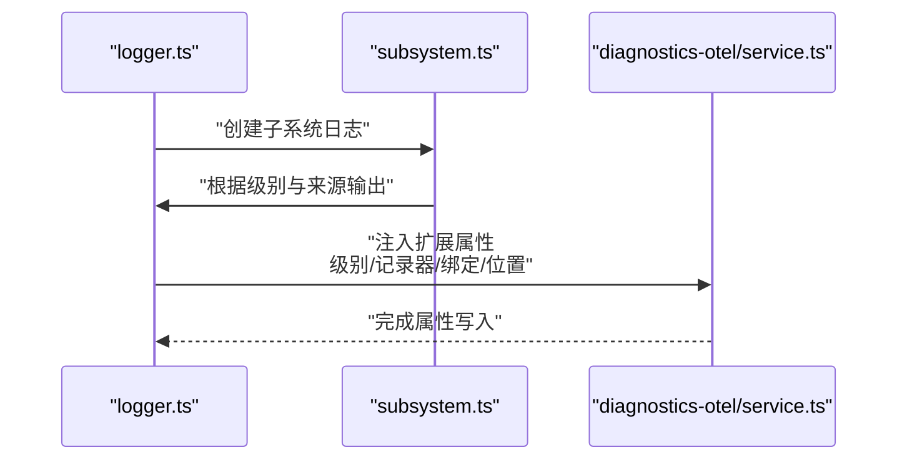
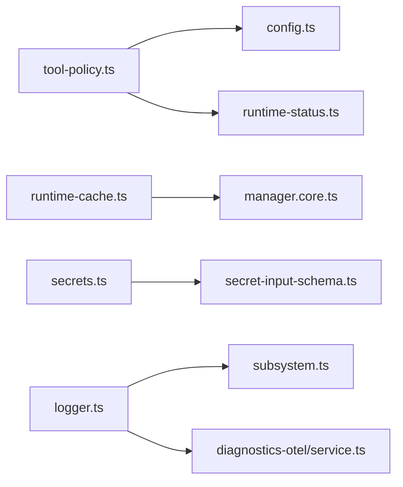

# 工具类型和辅助类型

## 目录
1. [简介](#简介)
2. [项目结构](#项目结构)
3. [核心组件](#核心组件)
4. [架构总览](#架构总览)
5. [详细组件分析](#详细组件分析)
6. [依赖关系分析](#依赖关系分析)
7. [性能考虑](#性能考虑)
8. [故障排查指南](#故障排查指南)
9. [结论](#结论)
10. [附录](#附录)

## 简介
本文件为 OpenClaw 的“工具类型与辅助类型”参考文档，聚焦以下主题：
- 队列管理：会话级并发控制、运行时缓存与空闲回收
- 沙箱隔离：工具策略解析、沙箱模式与会话判定
- 密钥管理：密钥解析协议、输入来源与安全比较
- 工具调用与参数校验：工具参数必填组、参数验证与清理
- 权限控制与安全策略：执行审批策略、审计与策略选择
- 类型验证、转换与序列化：JSON 序列化字节长度、Zod 密钥输入模式
- 异步操作、并发控制与资源管理：运行时生命周期与资源回收
- 调试、日志与监控：日志级别、子系统日志、OTel 扩展属性
- 性能优化与内存管理：运行时空闲回收、日志轮转与大小限制
- 开发与测试环境辅助：环境变量规范化、进程环境适配

## 项目结构
围绕“工具类型与辅助类型”的相关模块分布于如下目录：
- agents/sandbox：沙箱配置、运行时状态、工具策略
- gateway/protocol/schema：密钥解析协议、执行审批策略
- plugin-sdk：密钥输入模式（Zod）
- logging：日志级别与子系统日志
- acp/control-plane：运行时缓存与并发控制
- infra：环境变量与 JSON 字节长度工具
- types：第三方库类型声明
- extensions/diagnostics-otel：日志扩展属性注入

图表来源
- [src/agents/sandbox/tool-policy.ts](file://src/agents/sandbox/tool-policy.ts#L1-L110)
- [src/agents/sandbox/runtime-status.ts](file://src/agents/sandbox/runtime-status.ts#L45-L97)
- [src/agents/sandbox/config.ts](file://src/agents/sandbox/config.ts#L157-L188)
- [src/gateway/protocol/schema/secrets.ts](file://src/gateway/protocol/schema/secrets.ts#L1-L35)
- [src/plugin-sdk/secret-input-schema.ts](file://src/plugin-sdk/secret-input-schema.ts#L1-L12)
- [src/logging/levels.ts](file://src/logging/levels.ts#L1-L37)
- [src/logging/logger.ts](file://src/logging/logger.ts#L183-L233)
- [src/logging/subsystem.ts](file://src/logging/subsystem.ts#L308-L347)
- [src/acp/control-plane/manager.core.ts](file://src/acp/control-plane/manager.core.ts#L1079-L1157)
- [src/acp/control-plane/runtime-cache.ts](file://src/acp/control-plane/runtime-cache.ts#L1-L59)
- [src/infra/env.ts](file://src/infra/env.ts#L1-L52)
- [extensions/diagnostics-otel/src/service.ts](file://extensions/diagnostics-otel/src/service.ts#L316-L352)

章节来源
- [src/agents/sandbox/tool-policy.ts](file://src/agents/sandbox/tool-policy.ts#L1-L110)
- [src/agents/sandbox/runtime-status.ts](file://src/agents/sandbox/runtime-status.ts#L45-L97)
- [src/agents/sandbox/config.ts](file://src/agents/sandbox/config.ts#L157-L188)
- [src/gateway/protocol/schema/secrets.ts](file://src/gateway/protocol/schema/secrets.ts#L1-L35)
- [src/plugin-sdk/secret-input-schema.ts](file://src/plugin-sdk/secret-input-schema.ts#L1-L12)
- [src/logging/levels.ts](file://src/logging/levels.ts#L1-L37)
- [src/logging/logger.ts](file://src/logging/logger.ts#L183-L233)
- [src/logging/subsystem.ts](file://src/logging/subsystem.ts#L308-L347)
- [src/acp/control-plane/manager.core.ts](file://src/acp/control-plane/manager.core.ts#L1079-L1157)
- [src/acp/control-plane/runtime-cache.ts](file://src/acp/control-plane/runtime-cache.ts#L1-L59)
- [src/infra/env.ts](file://src/infra/env.ts#L1-L52)
- [extensions/diagnostics-otel/src/service.ts](file://extensions/diagnostics-otel/src/service.ts#L316-L352)

## 核心组件
- 沙箱工具策略与运行时状态
  - 工具允许/拒绝判定、策略来源追踪、默认策略合并与增强
  - 运行时沙箱模式解析、主会话键解析、被阻断消息格式化
  - 沙箱配置解析（全局/代理级）、作用域与裁剪策略
- 密钥管理与安全
  - 密钥解析协议（命令名、目标 ID、赋值结果、诊断信息）
  - 密钥输入来源（环境变量、文件、可执行）与安全比较
- 权限控制与安全策略
  - 执行审批策略（默认/代理级字段、白名单条目）
  - 审计工具策略导出
- 工具调用与参数校验
  - 参数必填组校验、参数错误构造
  - 工具参数模式清理与兼容性处理
- 并发控制与资源管理
  - 运行时缓存、空闲回收、会话 Actor 队列
- 日志与监控
  - 日志级别解析与归一化、子系统日志、OTel 属性注入

章节来源
- [src/agents/sandbox/tool-policy.ts](file://src/agents/sandbox/tool-policy.ts#L16-L33)
- [src/agents/sandbox/runtime-status.ts](file://src/agents/sandbox/runtime-status.ts#L45-L97)
- [src/agents/sandbox/config.ts](file://src/agents/sandbox/config.ts#L157-L188)
- [src/gateway/protocol/schema/secrets.ts](file://src/gateway/protocol/schema/secrets.ts#L1-L35)
- [src/plugin-sdk/secret-input-schema.ts](file://src/plugin-sdk/secret-input-schema.ts#L1-L12)
- [src/gateway/protocol/schema/exec-approvals.ts](file://src/gateway/protocol/schema/exec-approvals.ts#L1-L50)
- [src/security/audit-tool-policy.ts](file://src/security/audit-tool-policy.ts#L1-L1)
- [src/agents/pi-tools.params.ts](file://src/agents/pi-tools.params.ts#L154-L204)
- [src/agents/pi-tools.schema.ts](file://src/agents/pi-tools.schema.ts#L112-L138)
- [src/acp/control-plane/manager.core.ts](file://src/acp/control-plane/manager.core.ts#L1079-L1157)
- [src/acp/control-plane/runtime-cache.ts](file://src/acp/control-plane/runtime-cache.ts#L1-L59)
- [src/logging/levels.ts](file://src/logging/levels.ts#L1-L37)
- [src/logging/logger.ts](file://src/logging/logger.ts#L183-L233)
- [src/logging/subsystem.ts](file://src/logging/subsystem.ts#L308-L347)
- [extensions/diagnostics-otel/src/service.ts](file://extensions/diagnostics-otel/src/service.ts#L316-L352)

## 架构总览
下图展示“工具类型与辅助类型”的关键交互：沙箱策略解析与运行时状态决定工具可用性；密钥解析与输入来源保障安全；执行审批策略与审计工具策略共同构成权限控制；日志与监控贯穿全链路。

图表来源
- [src/agents/sandbox/tool-policy.ts](file://src/agents/sandbox/tool-policy.ts#L35-L110)
- [src/agents/sandbox/runtime-status.ts](file://src/agents/sandbox/runtime-status.ts#L45-L97)
- [src/agents/sandbox/config.ts](file://src/agents/sandbox/config.ts#L170-L188)
- [src/gateway/protocol/schema/secrets.ts](file://src/gateway/protocol/schema/secrets.ts#L1-L35)
- [src/plugin-sdk/secret-input-schema.ts](file://src/plugin-sdk/secret-input-schema.ts#L1-L12)
- [src/gateway/protocol/schema/exec-approvals.ts](file://src/gateway/protocol/schema/exec-approvals.ts#L1-L50)
- [src/security/audit-tool-policy.ts](file://src/security/audit-tool-policy.ts#L1-L1)
- [src/agents/pi-tools.params.ts](file://src/agents/pi-tools.params.ts#L154-L204)
- [src/agents/pi-tools.schema.ts](file://src/agents/pi-tools.schema.ts#L112-L138)
- [src/acp/control-plane/runtime-cache.ts](file://src/acp/control-plane/runtime-cache.ts#L1-L59)
- [src/acp/control-plane/manager.core.ts](file://src/acp/control-plane/manager.core.ts#L1079-L1157)
- [src/logging/levels.ts](file://src/logging/levels.ts#L1-L37)
- [src/logging/logger.ts](file://src/logging/logger.ts#L183-L233)
- [src/logging/subsystem.ts](file://src/logging/subsystem.ts#L308-L347)
- [src/infra/env.ts](file://src/infra/env.ts#L1-L52)
- [extensions/diagnostics-otel/src/service.ts](file://extensions/diagnostics-otel/src/service.ts#L316-L352)

## 详细组件分析

### 沙箱工具策略与运行时状态
- 工具策略解析
  - 支持代理级/全局/默认三级策略来源，自动展开工具分组并编译通配符
  - 默认在沙箱会话中保留图像工具能力，除非显式拒绝
- 运行时状态
  - 解析沙箱模式、主会话键、是否沙箱化，并生成被阻断工具的提示信息
- 配置解析
  - 合并全局与代理级沙箱配置，确定作用域与裁剪策略（空闲时长、最大年龄）

图表来源
- [src/agents/sandbox/tool-policy.ts](file://src/agents/sandbox/tool-policy.ts#L16-L33)
- [src/agents/sandbox/tool-policy.ts](file://src/agents/sandbox/tool-policy.ts#L35-L110)

章节来源
- [src/agents/sandbox/tool-policy.ts](file://src/agents/sandbox/tool-policy.ts#L16-L33)
- [src/agents/sandbox/tool-policy.ts](file://src/agents/sandbox/tool-policy.ts#L35-L110)
- [src/agents/sandbox/runtime-status.ts](file://src/agents/sandbox/runtime-status.ts#L45-L97)
- [src/agents/sandbox/config.ts](file://src/agents/sandbox/config.ts#L157-L188)

### 密钥管理与安全
- 密钥解析协议
  - 定义密钥解析参数（命令名、目标 ID 列表）与结果（赋值、诊断、非活动引用路径）
- 密钥输入来源
  - Zod 模式支持字符串或对象形式，对象包含来源（环境变量/文件/可执行）、提供者与标识
- 安全比较
  - 提供常量时间比较函数，用于密钥比较以降低侧信道风险

图表来源
- [src/gateway/protocol/schema/secrets.ts](file://src/gateway/protocol/schema/secrets.ts#L1-L35)
- [src/plugin-sdk/secret-input-schema.ts](file://src/plugin-sdk/secret-input-schema.ts#L1-L12)

章节来源
- [src/gateway/protocol/schema/secrets.ts](file://src/gateway/protocol/schema/secrets.ts#L1-L35)
- [src/plugin-sdk/secret-input-schema.ts](file://src/plugin-sdk/secret-input-schema.ts#L1-L12)

### 权限控制与安全策略
- 执行审批策略
  - 默认/代理级字段：安全级别、询问策略、回退策略、自动允许技能
  - 白名单条目：模式、最后使用时间/命令/解析路径
- 审计工具策略
  - 导出工具策略选择逻辑，便于审计与合规检查

图表来源
- [src/gateway/protocol/schema/exec-approvals.ts](file://src/gateway/protocol/schema/exec-approvals.ts#L1-L50)
- [src/security/audit-tool-policy.ts](file://src/security/audit-tool-policy.ts#L1-L1)

章节来源
- [src/gateway/protocol/schema/exec-approvals.ts](file://src/gateway/protocol/schema/exec-approvals.ts#L1-L50)
- [src/security/audit-tool-policy.ts](file://src/security/audit-tool-policy.ts#L1-L1)

### 工具调用与参数校验
- 参数必填组校验
  - 对参数记录进行必填组校验，支持“允许为空”选项，缺失时报错
- 工具参数模式清理
  - 修复缺失顶层 type 的模式，合并变体属性，确保模型兼容性

图表来源
- [src/agents/pi-tools.params.ts](file://src/agents/pi-tools.params.ts#L168-L204)
- [src/agents/pi-tools.schema.ts](file://src/agents/pi-tools.schema.ts#L112-L138)

章节来源
- [src/agents/pi-tools.params.ts](file://src/agents/pi-tools.params.ts#L154-L204)
- [src/agents/pi-tools.schema.ts](file://src/agents/pi-tools.schema.ts#L112-L138)

### 并发控制与资源管理
- 运行时缓存
  - 缓存运行时句柄、后端、代理、会话模式等元数据，提供最近触达时间与快照
- 空闲回收
  - 基于空闲 TTL 收集候选，通过 Actor 队列串行关闭，避免并发冲突
- 会话 Actor 队列
  - 将同一会话的操作排队执行，保证并发一致性

图表来源
- [src/acp/control-plane/manager.core.ts](file://src/acp/control-plane/manager.core.ts#L1096-L1157)
- [src/acp/control-plane/runtime-cache.ts](file://src/acp/control-plane/runtime-cache.ts#L1-L59)

章节来源
- [src/acp/control-plane/manager.core.ts](file://src/acp/control-plane/manager.core.ts#L1079-L1157)
- [src/acp/control-plane/runtime-cache.ts](file://src/acp/control-plane/runtime-cache.ts#L1-L59)

### 日志与监控
- 日志级别
  - 允许级别集合、解析与归一化、映射最小级别
- 子系统日志
  - 控制台与文件输出开关、抑制探测行、元数据透传
- OTel 扩展属性
  - 注入日志级别、记录器名称、父链、绑定键值、参数数组、代码位置等

图表来源
- [src/logging/levels.ts](file://src/logging/levels.ts#L1-L37)
- [src/logging/logger.ts](file://src/logging/logger.ts#L210-L233)
- [src/logging/subsystem.ts](file://src/logging/subsystem.ts#L308-L347)
- [extensions/diagnostics-otel/src/service.ts](file://extensions/diagnostics-otel/src/service.ts#L316-L352)

章节来源
- [src/logging/levels.ts](file://src/logging/levels.ts#L1-L37)
- [src/logging/logger.ts](file://src/logging/logger.ts#L183-L233)
- [src/logging/subsystem.ts](file://src/logging/subsystem.ts#L308-L347)
- [extensions/diagnostics-otel/src/service.ts](file://extensions/diagnostics-otel/src/service.ts#L316-L352)

### 类型验证、转换与序列化
- JSON UTF-8 字节长度
  - 序列化失败时回退字符串转换，统一计算 UTF-8 字节长度
- 进程环境适配
  - 将进程环境键值转为字符串映射，过滤未定义值
- 第三方库类型声明
  - 扩展 API、高亮、Pty、Canvas、EdgeTTS 等类型声明

章节来源
- [src/infra/json-utf8-bytes.test.ts](file://src/infra/json-utf8-bytes.test.ts#L1-L16)
- [src/process/supervisor/adapters/env.ts](file://src/process/supervisor/adapters/env.ts#L1-L13)
- [src/types/extension-api.d.ts](file://src/types/extension-api.d.ts#L1-L4)
- [src/types/cli-highlight.d.ts](file://src/types/cli-highlight.d.ts#L1-L11)
- [src/types/lydell-node-pty.d.ts](file://src/types/lydell-node-pty.d.ts#L1-L25)
- [src/types/napi-rs-canvas.d.ts](file://src/types/napi-rs-canvas.d.ts#L1-L8)
- [src/types/node-edge-tts.d.ts](file://src/types/node-edge-tts.d.ts#L1-L19)

### 开发与测试环境辅助
- 环境变量规范化
  - 归一化 Z_AI_* 变量别名、布尔值解析、单行截断与脱敏输出
- UI 配置表单 JSON Schema 辅助
  - 推导类型、默认值、路径键生成

章节来源
- [src/infra/env.ts](file://src/infra/env.ts#L1-L52)
- [ui/src/ui/views/config-form.shared.ts](file://ui/src/ui/views/config-form.shared.ts#L1-L59)

## 依赖关系分析
- 组件内聚与耦合
  - 沙箱策略与运行时状态紧密耦合，策略解析依赖配置与工具分组展开
  - 运行时缓存与管理器核心通过 Actor 队列解耦并发与资源回收
  - 日志系统与 OTel 扩展通过子系统日志统一入口
- 外部依赖
  - 类型验证使用 TypeBox/Zod
  - 日志使用 tslog 与文件系统
  - OTel 扩展注入属性到遥测系统

图表来源
- [src/agents/sandbox/tool-policy.ts](file://src/agents/sandbox/tool-policy.ts#L1-L110)
- [src/agents/sandbox/config.ts](file://src/agents/sandbox/config.ts#L157-L188)
- [src/agents/sandbox/runtime-status.ts](file://src/agents/sandbox/runtime-status.ts#L45-L97)
- [src/acp/control-plane/runtime-cache.ts](file://src/acp/control-plane/runtime-cache.ts#L1-L59)
- [src/acp/control-plane/manager.core.ts](file://src/acp/control-plane/manager.core.ts#L1079-L1157)
- [src/gateway/protocol/schema/secrets.ts](file://src/gateway/protocol/schema/secrets.ts#L1-L35)
- [src/plugin-sdk/secret-input-schema.ts](file://src/plugin-sdk/secret-input-schema.ts#L1-L12)
- [src/logging/logger.ts](file://src/logging/logger.ts#L183-L233)
- [src/logging/subsystem.ts](file://src/logging/subsystem.ts#L308-L347)
- [extensions/diagnostics-otel/src/service.ts](file://extensions/diagnostics-otel/src/service.ts#L316-L352)

## 性能考虑
- 运行时空闲回收
  - 基于 TTL 的批量回收，减少无效句柄占用
- 日志轮转与大小限制
  - 动态检测文件大小并追加写入，避免超大日志文件
- JSON 序列化降级
  - 序列化失败时采用字符串回退，保证稳定性

章节来源
- [src/acp/control-plane/manager.core.ts](file://src/acp/control-plane/manager.core.ts#L1096-L1157)
- [src/logging/logger.ts](file://src/logging/logger.ts#L186-L208)
- [src/infra/json-utf8-bytes.test.ts](file://src/infra/json-utf8-bytes.test.ts#L1-L16)

## 故障排查指南
- 沙箱工具被阻断
  - 使用运行时状态解析函数获取沙箱模式与主会话键，结合工具策略来源定位问题
- 密钥解析失败
  - 检查命令名与目标 ID 是否正确，确认来源类型与提供者标识
- 执行审批策略异常
  - 核对默认/代理级字段与白名单条目，确认模式匹配与最后使用信息
- 日志级别不生效
  - 检查日志级别解析与子系统开关，确认 OTel 属性注入是否正确

章节来源
- [src/agents/sandbox/runtime-status.ts](file://src/agents/sandbox/runtime-status.ts#L81-L97)
- [src/gateway/protocol/schema/secrets.ts](file://src/gateway/protocol/schema/secrets.ts#L1-L35)
- [src/gateway/protocol/schema/exec-approvals.ts](file://src/gateway/protocol/schema/exec-approvals.ts#L1-L50)
- [src/logging/levels.ts](file://src/logging/levels.ts#L13-L23)
- [src/logging/subsystem.ts](file://src/logging/subsystem.ts#L316-L347)

## 结论
本文档梳理了 OpenClaw 在工具类型与辅助类型方面的核心结构与交互，覆盖沙箱隔离、密钥管理、权限控制、并发与资源管理、日志与监控、以及开发测试辅助等方面。建议在实际使用中：
- 明确代理级与全局沙箱策略优先级，合理配置工具允许/拒绝列表
- 通过密钥解析协议与输入来源确保凭据安全
- 使用执行审批策略与审计工具策略构建多层权限控制
- 借助运行时缓存与 Actor 队列提升并发安全性与资源利用率
- 通过日志与 OTel 扩展完善可观测性

## 附录
- 相关类型声明与第三方库接口参见 types 目录与 UI 表单辅助工具