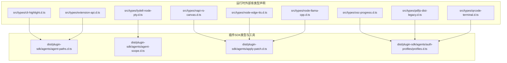
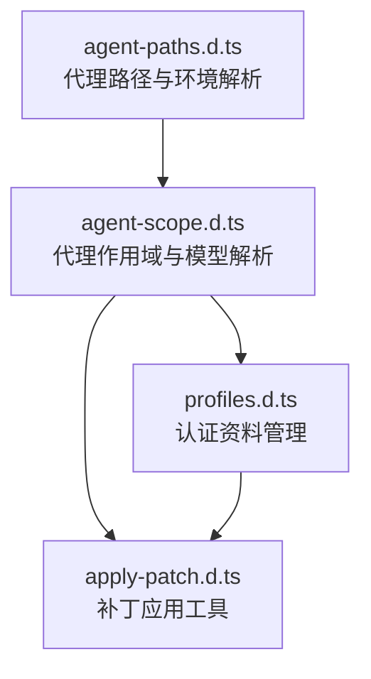
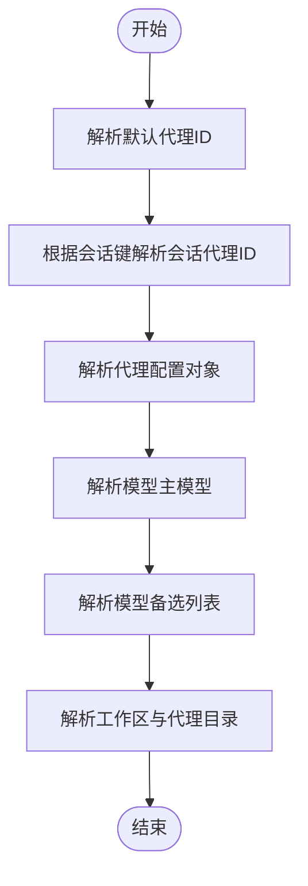
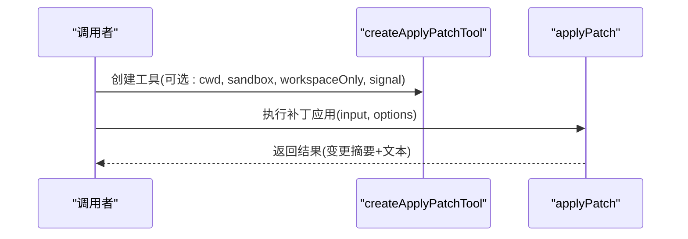
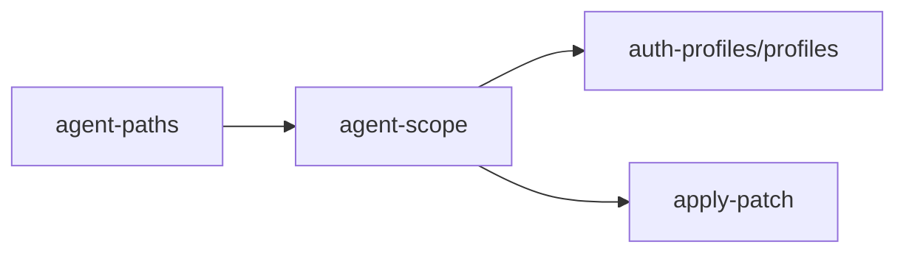

# 核心类型系统

## 目录
1. [引言](#引言)
2. [项目结构](#项目结构)
3. [核心组件](#核心组件)
4. [架构总览](#架构总览)
5. [详细组件分析](#详细组件分析)
6. [依赖分析](#依赖分析)
7. [性能考虑](#性能考虑)
8. [故障排查指南](#故障排查指南)
9. [结论](#结论)
10. [附录](#附录)

## 引言
本文件为 OpenClaw 核心类型系统的权威参考，聚焦于基础数据类型、通用接口与核心实体定义，覆盖会话、消息、用户、代理等关键领域，并对枚举、联合、泛型、类型别名与工具类型进行系统梳理。同时给出类型验证规则、约束条件、类型转换与序列化实现指南，以及版本兼容性与迁移策略建议。内容严格基于仓库中的类型声明文件整理而成，便于开发者快速理解并正确使用类型系统。

## 项目结构
OpenClaw 的类型系统由两类来源构成：
- 运行时外部库的类型声明：位于 src/types 下，用于第三方模块（如终端、TTS、PDF 渲染、二维码、进度条等）的类型安全封装。
- 插件 SDK 类型与工具：位于 dist/plugin-sdk 下，面向插件生态的代理配置解析、补丁应用、认证资料管理等能力的类型与接口定义。

下图展示两类类型来源与其职责边界：

图表来源
- [src/types/cli-highlight.d.ts](file://src/types/cli-highlight.d.ts#L1-L11)
- [src/types/extension-api.d.ts](file://src/types/extension-api.d.ts#L1-L4)
- [src/types/lydell-node-pty.d.ts](file://src/types/lydell-node-pty.d.ts#L1-L25)
- [src/types/napi-rs-canvas.d.ts](file://src/types/napi-rs-canvas.d.ts#L1-L8)
- [src/types/node-edge-tts.d.ts](file://src/types/node-edge-tts.d.ts#L1-L19)
- [src/types/node-llama-cpp.d.ts](file://src/types/node-llama-cpp.d.ts#L1-L23)
- [src/types/osc-progress.d.ts](file://src/types/osc-progress.d.ts#L1-L17)
- [src/types/pdfjs-dist-legacy.d.ts](file://src/types/pdfjs-dist-legacy.d.ts#L1-L34)
- [src/types/qrcode-terminal.d.ts](file://src/types/qrcode-terminal.d.ts#L1-L10)
- [dist/plugin-sdk/agents/agent-paths.d.ts](file://dist/plugin-sdk/agents/agent-paths.d.ts#L1-L3)
- [dist/plugin-sdk/agents/agent-scope.d.ts](file://dist/plugin-sdk/agents/agent-scope.d.ts#L1-L62)
- [dist/plugin-sdk/agents/apply-patch.d.ts](file://dist/plugin-sdk/agents/apply-patch.d.ts#L1-L36)
- [dist/plugin-sdk/agents/auth-profiles/profiles.d.ts](file://dist/plugin-sdk/agents/auth-profiles/profiles.d.ts#L1-L25)

章节来源
- [src/types/cli-highlight.d.ts](file://src/types/cli-highlight.d.ts#L1-L11)
- [src/types/extension-api.d.ts](file://src/types/extension-api.d.ts#L1-L4)
- [src/types/lydell-node-pty.d.ts](file://src/types/lydell-node-pty.d.ts#L1-L25)
- [src/types/napi-rs-canvas.d.ts](file://src/types/napi-rs-canvas.d.ts#L1-L8)
- [src/types/node-edge-tts.d.ts](file://src/types/node-edge-tts.d.ts#L1-L19)
- [src/types/node-llama-cpp.d.ts](file://src/types/node-llama-cpp.d.ts#L1-L23)
- [src/types/osc-progress.d.ts](file://src/types/osc-progress.d.ts#L1-L17)
- [src/types/pdfjs-dist-legacy.d.ts](file://src/types/pdfjs-dist-legacy.d.ts#L1-L34)
- [src/types/qrcode-terminal.d.ts](file://src/types/qrcode-terminal.d.ts#L1-L10)
- [dist/plugin-sdk/agents/agent-paths.d.ts](file://dist/plugin-sdk/agents/agent-paths.d.ts#L1-L3)
- [dist/plugin-sdk/agents/agent-scope.d.ts](file://dist/plugin-sdk/agents/agent-scope.d.ts#L1-L62)
- [dist/plugin-sdk/agents/apply-patch.d.ts](file://dist/plugin-sdk/agents/apply-patch.d.ts#L1-L36)
- [dist/plugin-sdk/agents/auth-profiles/profiles.d.ts](file://dist/plugin-sdk/agents/auth-profiles/profiles.d.ts#L1-L25)

## 核心组件
本节从“基础数据类型”“通用接口”“核心实体”三个维度梳理类型系统要点，并给出验证规则与约束条件。

- 基础数据类型
  - 字符串、数字、布尔值、数组、对象字面量等作为类型声明的基础单元广泛出现。
  - 可选属性通过可选链或联合类型表达，例如可选语言标识、可选主题参数等。
  - 数组与只读数组在 PDF 文本项、嵌入向量等场景中出现。

- 通用接口
  - 回调监听器接口：统一以泛型监听器包装事件对象，便于订阅/取消订阅模式。
  - 工具函数接口：如高亮、进度控制器、PDF 获取器等，均以函数签名与返回值类型明确行为契约。

- 核心实体
  - 会话与代理：通过代理路径解析、会话键到代理 ID 的映射、代理工作区与目录解析等工具函数支撑会话生命周期管理。
  - 认证资料：提供认证资料去重、排序、增删改查、标记有效状态等操作的类型化接口。
  - 补丁应用：提供补丁输入校验、沙箱文件桥接、结果汇总与文本输出的类型化工具。

章节来源
- [dist/plugin-sdk/agents/agent-paths.d.ts](file://dist/plugin-sdk/agents/agent-paths.d.ts#L1-L3)
- [dist/plugin-sdk/agents/agent-scope.d.ts](file://dist/plugin-sdk/agents/agent-scope.d.ts#L1-L62)
- [dist/plugin-sdk/agents/auth-profiles/profiles.d.ts](file://dist/plugin-sdk/agents/auth-profiles/profiles.d.ts#L1-L25)
- [dist/plugin-sdk/agents/apply-patch.d.ts](file://dist/plugin-sdk/agents/apply-patch.d.ts#L1-L36)

## 架构总览
下图展示类型系统在插件 SDK 中的关键交互：代理路径解析、代理作用域解析、认证资料管理、补丁应用工具等模块如何协同工作，形成围绕“代理”的类型化能力闭环。

图表来源
- [dist/plugin-sdk/agents/agent-paths.d.ts](file://dist/plugin-sdk/agents/agent-paths.d.ts#L1-L3)
- [dist/plugin-sdk/agents/agent-scope.d.ts](file://dist/plugin-sdk/agents/agent-scope.d.ts#L1-L62)
- [dist/plugin-sdk/agents/auth-profiles/profiles.d.ts](file://dist/plugin-sdk/agents/auth-profiles/profiles.d.ts#L1-L25)
- [dist/plugin-sdk/agents/apply-patch.d.ts](file://dist/plugin-sdk/agents/apply-patch.d.ts#L1-L36)

## 详细组件分析

### 代理路径与环境解析（agent-paths）
- 职责
  - 解析代理目录与环境变量，确保代理运行所需的本地路径与工作空间一致。
- 关键类型与接口
  - 函数签名：解析代理目录、确保代理环境变量存在。
- 验证规则与约束
  - 返回值必须为非空字符串；若解析失败需抛出错误或返回默认值以保证上层逻辑健壮性。
- 使用建议
  - 在启动代理前先调用路径解析函数，再进行后续初始化。

章节来源
- [dist/plugin-sdk/agents/agent-paths.d.ts](file://dist/plugin-sdk/agents/agent-paths.d.ts#L1-L3)

### 代理作用域与模型解析（agent-scope）
- 职责
  - 将配置文件映射为代理配置对象，支持默认代理 ID、会话代理 ID、工作区目录、代理目录、模型主备配置、心跳、身份、群聊、子代理、沙箱、工具等字段的解析。
- 关键类型与接口
  - ResolvedAgentConfig：代理配置对象，包含可选字段集合。
  - 多个 resolve* 系列函数：根据会话键、代理 ID、配置对象解析最终生效的代理与模型设置。
- 验证规则与约束
  - 当传入的配置或会话键为空时，应回退到默认值；当模型主备列表为空时，需显式处理。
  - 会话级覆盖优先于全局配置。
- 使用建议
  - 先解析默认代理 ID，再根据会话键解析会话代理 ID；最后解析代理配置对象。

图表来源
- [dist/plugin-sdk/agents/agent-scope.d.ts](file://dist/plugin-sdk/agents/agent-scope.d.ts#L23-L62)

章节来源
- [dist/plugin-sdk/agents/agent-scope.d.ts](file://dist/plugin-sdk/agents/agent-scope.d.ts#L1-L62)

### 认证资料管理（auth-profiles/profiles）
- 职责
  - 提供认证资料的去重、排序、插入/更新、查询、标记有效状态等操作的类型化接口。
- 关键类型与接口
  - upsertAuthProfile / upsertAuthProfileWithLock：写入或更新认证资料，支持加锁。
  - setAuthProfileOrder：按提供方设置认证资料顺序。
  - listProfilesForProvider：列出指定提供方下的资料 ID。
  - markAuthProfileGood：标记某资料为可用。
- 验证规则与约束
  - profileId 必须唯一且非空；provider 必须匹配；order 列表应与实际资料集合一致。
- 使用建议
  - 写入前先去重；批量更新时使用带锁版本以避免竞态。

章节来源
- [dist/plugin-sdk/agents/auth-profiles/profiles.d.ts](file://dist/plugin-sdk/agents/auth-profiles/profiles.d.ts#L1-L25)

### 补丁应用工具（apply-patch）
- 职责
  - 对给定补丁输入进行校验与应用，支持沙箱文件桥接、工作区限制、中止信号等。
- 关键类型与接口
  - ApplyPatchResult / ApplyPatchSummary：应用结果与变更摘要。
  - ApplyPatchToolDetails：工具详情。
  - createApplyPatchTool：创建补丁应用工具（含 TypeBox Schema）。
  - applyPatch：执行补丁应用。
- 验证规则与约束
  - 输入补丁必须满足 Schema 校验；workspaceOnly 默认开启，防止越权访问。
  - 沙箱配置可选，启用后需提供根路径与文件桥接器。
- 使用建议
  - 在受限工作区内执行补丁应用；必要时通过 AbortSignal 中断长耗时任务。

图表来源
- [dist/plugin-sdk/agents/apply-patch.d.ts](file://dist/plugin-sdk/agents/apply-patch.d.ts#L26-L36)

章节来源
- [dist/plugin-sdk/agents/apply-patch.d.ts](file://dist/plugin-sdk/agents/apply-patch.d.ts#L1-L36)

### 外部库类型声明（运行时）
以下模块提供第三方能力的类型安全封装，涵盖终端高亮、扩展 API、伪终端、画布、Edge TTS、LLaMA 嵌入、进度条、PDF 渲染、二维码等。

- 终端高亮
  - 类型：HighlightOptions、highlight、supportsLanguage
  - 约束：language 可选；theme 为未知类型；ignoreIllegals 可选
- 扩展 API
  - 类型：runEmbeddedPiAgent(params)
  - 约束：params 为任意键值对；返回 Promise&lt;未知>
- 伪终端（PTY）
  - 类型：PtyExitEvent、PtyListener、PtyHandle、PtySpawn、spawn
  - 约束：onData/onExit 使用回调监听；write 接受字符串或 Buffer
- 画布
  - 类型：Canvas、createCanvas
  - 约束：toBuffer 支持可选类型参数
- Edge TTS
  - 类型：EdgeTTSOptions、EdgeTTS 类、ttsPromise
  - 约束：构造函数可选参数；ttsPromise 返回 Promise&lt;void&gt;
- LLaMA 嵌入
  - 类型：LlamaLogLevel、LlamaEmbedding、LlamaEmbeddingContext、LlamaModel、Llama、getLlama、resolveModelFile
  - 约束：日志级别为枚举；嵌入向量为 Float32Array 或 number[]
- 进度条
  - 类型：OscProgressController、createOscProgressController、supportsOscProgress
  - 约束：setPercent 接收百分比；done 可选
- PDF 渲染
  - 类型：TextItem、TextMarkedContent、TextContent、Viewport、PDFPageProxy、PDFDocumentProxy、getDocument
  - 约束：getPage 返回 Promise；render 返回包含 promise 的对象
- 二维码
  - 类型：QRCode、QRErrorCorrectLevel
  - 约束：导出默认模块与错误纠正级别常量

章节来源
- [src/types/cli-highlight.d.ts](file://src/types/cli-highlight.d.ts#L1-L11)
- [src/types/extension-api.d.ts](file://src/types/extension-api.d.ts#L1-L4)
- [src/types/lydell-node-pty.d.ts](file://src/types/lydell-node-pty.d.ts#L1-L25)
- [src/types/napi-rs-canvas.d.ts](file://src/types/napi-rs-canvas.d.ts#L1-L8)
- [src/types/node-edge-tts.d.ts](file://src/types/node-edge-tts.d.ts#L1-L19)
- [src/types/node-llama-cpp.d.ts](file://src/types/node-llama-cpp.d.ts#L1-L23)
- [src/types/osc-progress.d.ts](file://src/types/osc-progress.d.ts#L1-L17)
- [src/types/pdfjs-dist-legacy.d.ts](file://src/types/pdfjs-dist-legacy.d.ts#L1-L34)
- [src/types/qrcode-terminal.d.ts](file://src/types/qrcode-terminal.d.ts#L1-L10)

## 依赖分析
- 模块内聚与耦合
  - agent-paths 与 agent-scope 之间存在直接依赖：agent-scope 使用 agent-paths 导出的会话键解析函数。
  - agent-scope 与 auth-profiles、apply-patch 存在间接依赖：前者提供代理与模型解析，后者提供认证与补丁能力，二者共同服务于代理生命周期。
- 外部依赖
  - apply-patch 使用 TypeBox Schema 进行输入校验。
  - 多数模块为纯类型声明，不引入运行时依赖，降低耦合度。
- 循环依赖
  - 未发现循环导入；各模块职责清晰，接口单向依赖。

图表来源
- [dist/plugin-sdk/agents/agent-paths.d.ts](file://dist/plugin-sdk/agents/agent-paths.d.ts#L1-L3)
- [dist/plugin-sdk/agents/agent-scope.d.ts](file://dist/plugin-sdk/agents/agent-scope.d.ts#L1-L62)
- [dist/plugin-sdk/agents/auth-profiles/profiles.d.ts](file://dist/plugin-sdk/agents/auth-profiles/profiles.d.ts#L1-L25)
- [dist/plugin-sdk/agents/apply-patch.d.ts](file://dist/plugin-sdk/agents/apply-patch.d.ts#L1-L36)

章节来源
- [dist/plugin-sdk/agents/agent-paths.d.ts](file://dist/plugin-sdk/agents/agent-paths.d.ts#L1-L3)
- [dist/plugin-sdk/agents/agent-scope.d.ts](file://dist/plugin-sdk/agents/agent-scope.d.ts#L1-L62)
- [dist/plugin-sdk/agents/auth-profiles/profiles.d.ts](file://dist/plugin-sdk/agents/auth-profiles/profiles.d.ts#L1-L25)
- [dist/plugin-sdk/agents/apply-patch.d.ts](file://dist/plugin-sdk/agents/apply-patch.d.ts#L1-L36)

## 性能考虑
- 类型声明本身不引入运行时开销，但涉及 I/O 的工具（如补丁应用、PDF 渲染、TTS 合成）应避免不必要的重复调用。
- 在代理作用域解析中，尽量缓存解析结果，减少重复计算。
- 对于大型 PDF 文档，建议分页渲染并控制缩放比例以平衡质量与性能。

## 故障排查指南
- 代理路径解析失败
  - 现象：返回空字符串或抛错。
  - 排查：确认代理目录是否存在、权限是否足够；检查环境变量是否正确注入。
- 会话代理 ID 解析异常
  - 现象：默认代理与会话代理不一致。
  - 排查：核对会话键格式；确认 agent-scope 的解析逻辑是否被正确调用。
- 认证资料写入冲突
  - 现象：并发写入导致数据不一致。
  - 排查：使用带锁的 upsert 接口；确保同一提供方下的资料 ID 唯一。
- 补丁应用失败
  - 现象：输入不符合 Schema、越权访问、执行中断。
  - 排查：检查输入补丁是否满足 Schema；关闭 workspaceOnly 或正确设置 cwd；合理使用 AbortSignal。

章节来源
- [dist/plugin-sdk/agents/agent-paths.d.ts](file://dist/plugin-sdk/agents/agent-paths.d.ts#L1-L3)
- [dist/plugin-sdk/agents/agent-scope.d.ts](file://dist/plugin-sdk/agents/agent-scope.d.ts#L1-L62)
- [dist/plugin-sdk/agents/auth-profiles/profiles.d.ts](file://dist/plugin-sdk/agents/auth-profiles/profiles.d.ts#L1-L25)
- [dist/plugin-sdk/agents/apply-patch.d.ts](file://dist/plugin-sdk/agents/apply-patch.d.ts#L1-L36)

## 结论
OpenClaw 的类型系统以“声明即契约”的方式，将代理生命周期、认证资料与补丁应用等关键流程以强类型形式固化，显著提升了可维护性与可测试性。通过清晰的模块边界与严格的验证规则，开发者可以更安全地扩展插件能力。建议在新增功能时遵循现有类型命名与组织方式，保持一致性。

## 附录

### 类型继承关系与接口实现说明
- 本仓库类型声明多为接口与类型别名组合，未见显式的类继承或接口实现代码，因此不涉及传统面向对象的继承关系图。
- 若未来引入类结构，建议以接口定义行为契约，以类型别名简化复杂联合与交叉类型。

### 枚举、联合、泛型使用方式
- 枚举
  - LlamaLogLevel：用于控制日志级别。
- 联合类型
  - 嵌入向量类型为 Float32Array 或 number[] 的联合，提升兼容性。
- 泛型
  - 监听器接口使用泛型包裹事件类型，便于不同事件的统一处理。

章节来源
- [src/types/node-llama-cpp.d.ts](file://src/types/node-llama-cpp.d.ts#L2-L10)

### 类型别名与工具类型
- 类型别名
  - 代理配置对象、回调监听器、句柄、控制器等均以类型别名简化书写。
- 工具类型
  - 通过函数签名与返回值类型表达工具能力，如 createApplyPatchTool、createOscProgressController 等。

章节来源
- [src/types/lydell-node-pty.d.ts](file://src/types/lydell-node-pty.d.ts#L2-L21)
- [src/types/osc-progress.d.ts](file://src/types/osc-progress.d.ts#L2-L16)
- [dist/plugin-sdk/agents/apply-patch.d.ts](file://dist/plugin-sdk/agents/apply-patch.d.ts#L26-L33)

### 类型验证规则与约束条件
- 输入校验
  - apply-patch 使用 TypeBox Schema 对输入进行校验。
- 约束条件
  - workspaceOnly 默认开启，防止越权访问；profileId 唯一且非空；provider 匹配；order 与资料集合一致。
- 错误处理
  - 失败时返回错误或抛出异常，调用方需捕获并处理。

章节来源
- [dist/plugin-sdk/agents/apply-patch.d.ts](file://dist/plugin-sdk/agents/apply-patch.d.ts#L26-L36)
- [dist/plugin-sdk/agents/auth-profiles/profiles.d.ts](file://dist/plugin-sdk/agents/auth-profiles/profiles.d.ts#L3-L24)

### 类型转换与序列化实现指南
- 序列化
  - 对于 JSON 兼容对象，可直接序列化；对于二进制数据（如 PDF、画布缓冲），建议使用 toBuffer 或等价方法获取 Buffer 后再进行序列化。
- 转换
  - 代理路径与工作区解析返回字符串；TTS 输出为文件路径；PDF 页面渲染返回 promise；进度控制器提供 setPercent/setIndeterminate/clear 等方法。
- 注意
  - 浮点向量与 TypedArray 需要特别处理，避免丢失精度。

章节来源
- [src/types/napi-rs-canvas.d.ts](file://src/types/napi-rs-canvas.d.ts#L2-L4)
- [src/types/pdfjs-dist-legacy.d.ts](file://src/types/pdfjs-dist-legacy.d.ts#L19-L23)
- [src/types/osc-progress.d.ts](file://src/types/osc-progress.d.ts#L2-L7)

### 版本兼容性与迁移策略
- 版本兼容性
  - 类型声明采用语义化版本管理；新增字段建议保持可选，避免破坏既有调用方。
- 迁移策略
  - 删除字段时提供迁移脚本或兼容层；对枚举新增成员时保留旧值以便回溯。
  - 对于 Schema 校验的工具（如 apply-patch），升级时提供向后兼容的 Schema 并逐步替换。