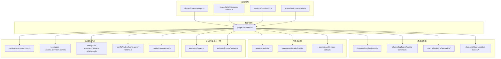
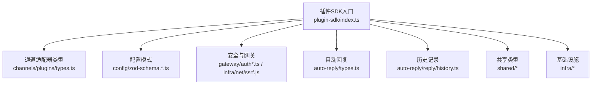
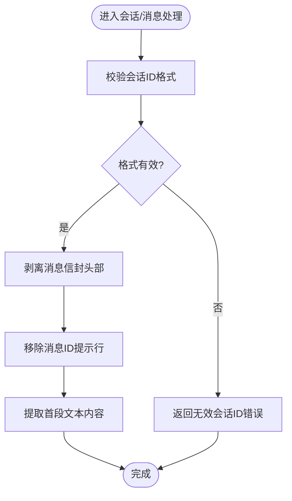
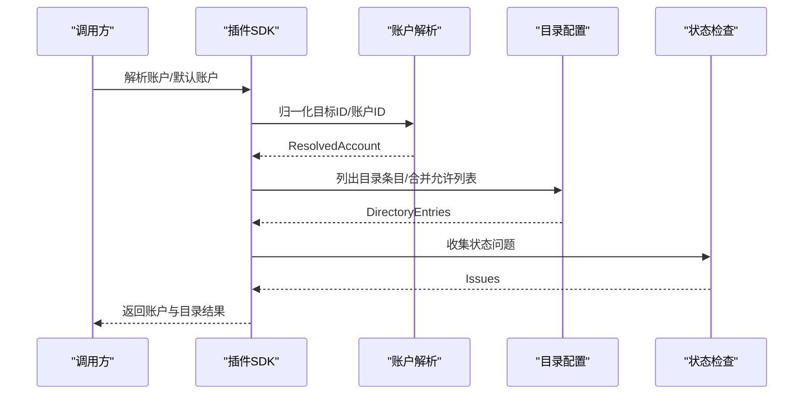
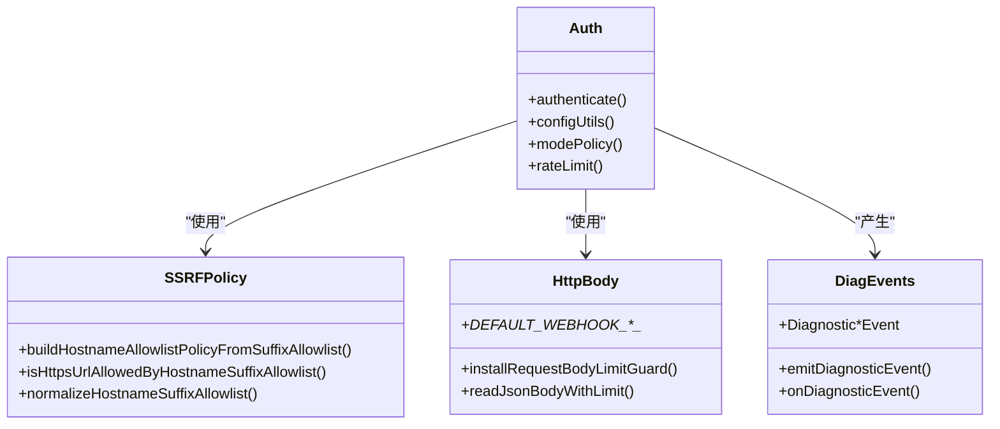
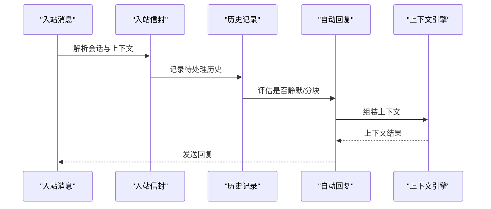
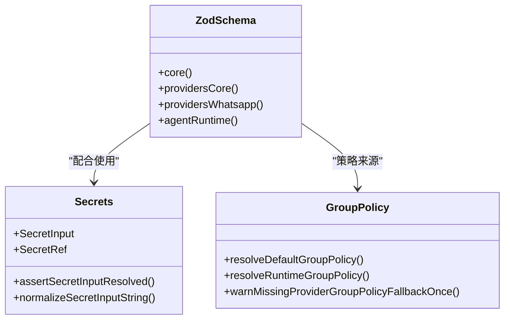
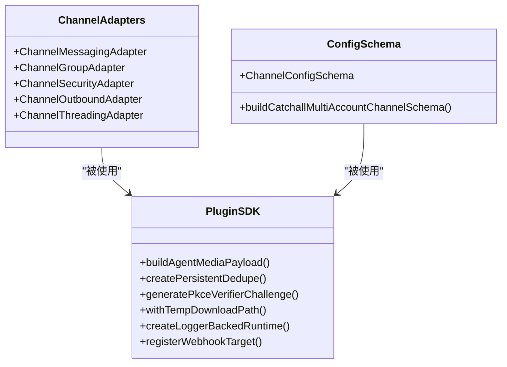
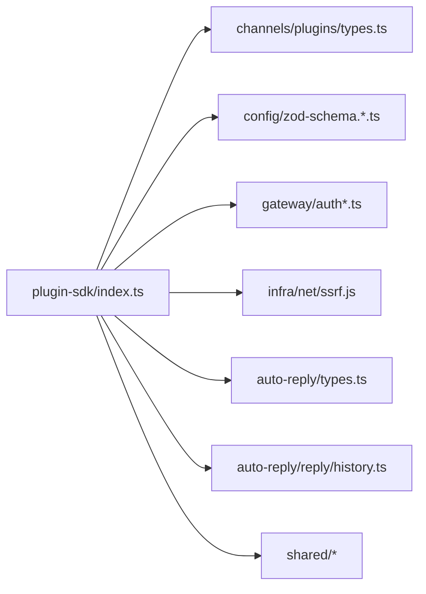

# 类型定义

## 目录
1. [简介](#简介)
2. [项目结构](#项目结构)
3. [核心组件](#核心组件)
4. [架构总览](#架构总览)
5. [详细组件分析](#详细组件分析)
6. [依赖分析](#依赖分析)
7. [性能考虑](#性能考虑)
8. [故障排查指南](#故障排查指南)
9. [结论](#结论)
10. [附录](#附录)

## 简介
本文件为 OpenClaw 系统的类型定义参考文档，覆盖会话、消息、用户、通道等核心实体的数据结构与接口；说明类型继承与实现关系；列举枚举、联合、泛型的使用方式；给出验证规则与约束；提供类型转换与序列化指南；解释类型别名与工具类型；记录版本兼容性与迁移策略，并给出 TypeScript 开发的最佳实践与类型安全建议。

## 项目结构
OpenClaw 的类型定义主要分布在以下区域：
- 插件 SDK 类型导出：集中于插件入口导出文件，统一暴露适配器、配置模式、运行时上下文、工具类型等。
- 共享与通用类型：消息信封、消息内容提取、会话 ID 校验、元数据解析等。
- 通道适配器与配置：各通道（Discord、Slack、Telegram、Signal、WhatsApp、iMessage、LINE 等）的账户、目标、配置、状态检查等类型与工具。
- 网关与安全：认证、速率限制、策略、诊断事件、SSRF 策略等。
- 自动回复与上下文引擎：自动回复类型、分块策略、历史记录、前缀上下文等。
- 配置与密钥：Zod 模式、密钥类型、运行时组策略等。
- 基础设施与工具：HTTP 请求体限制、去重缓存、时间格式化、媒体处理、网络与环境等。

图表来源
- [src/plugin-sdk/index.ts](file://src/plugin-sdk/index.ts#L1-L812)
- [src/shared/chat-envelope.ts](file://src/shared/chat-envelope.ts#L1-L49)
- [src/shared/chat-message-content.ts](file://src/shared/chat-message-content.ts#L1-L16)
- [src/sessions/session-id.ts](file://src/sessions/session-id.ts#L1-L6)
- [src/shared/entry-metadata.ts](file://src/shared/entry-metadata.ts#L1-L19)
- [src/channels/plugins/types.ts](file://src/channels/plugins/types.ts)
- [src/channels/plugins/config-schema.ts](file://src/channels/plugins/config-schema.ts)
- [src/gateway/auth.ts](file://src/gateway/auth.ts)
- [src/gateway/auth-rate-limit.ts](file://src/gateway/auth-rate-limit.ts)
- [src/gateway/auth-mode-policy.ts](file://src/gateway/auth-mode-policy.ts)
- [src/auto-reply/types.ts](file://src/auto-reply/types.ts)
- [src/auto-reply/reply/history.ts](file://src/auto-reply/reply/history.ts)
- [src/config/zod-schema.core.ts](file://src/config/zod-schema.core.ts)
- [src/config/zod-schema.providers-core.ts](file://src/config/zod-schema.providers-core.ts)
- [src/config/zod-schema.providers-whatsapp.ts](file://src/config/zod-schema.providers-whatsapp.ts)
- [src/config/zod-schema.agent-runtime.ts](file://src/config/zod-schema.agent-runtime.ts)
- [src/config/types.secrets.ts](file://src/config/types.secrets.ts)

章节来源
- [src/plugin-sdk/index.ts](file://src/plugin-sdk/index.ts#L1-L812)

## 核心组件
本节概述系统中最重要的类型族及其职责边界。

- 通道适配器与配置
  - 通道账户、目录、消息、线程、安全、心跳、工具发送等适配器接口与上下文类型。
  - 各通道的配置模式（Zod Schema）、允许列表匹配、目录配置助手、目标归一化与状态检查。
- 网关与安全
  - 认证流程、速率限制、策略解析、SSRF 政策、诊断事件、错误格式化。
- 自动回复与上下文引擎
  - 回复类型、分块策略、静默令牌、历史记录、前缀上下文、打字指示、ACK 反应门控。
- 配置与密钥
  - 运行时组策略、默认策略、密钥输入/引用类型、Zod 模式校验。
- 共享与通用
  - 消息信封剥离、首段文本提取、会话 ID 校验、元数据合并、时间格式化、媒体 MIME 扩展等。

章节来源
- [src/plugin-sdk/index.ts](file://src/plugin-sdk/index.ts#L64-L632)
- [src/channels/plugins/types.ts](file://src/channels/plugins/types.ts)
- [src/channels/plugins/config-schema.ts](file://src/channels/plugins/config-schema.ts)
- [src/gateway/auth.ts](file://src/gateway/auth.ts)
- [src/gateway/auth-rate-limit.ts](file://src/gateway/auth-rate-limit.ts)
- [src/gateway/auth-mode-policy.ts](file://src/gateway/auth-mode-policy.ts)
- [src/auto-reply/types.ts](file://src/auto-reply/types.ts)
- [src/auto-reply/chunk.ts](file://src/auto-reply/chunk.ts)
- [src/auto-reply/tokens.ts](file://src/auto-reply/tokens.ts)
- [src/auto-reply/envelope.ts](file://src/auto-reply/envelope.ts)
- [src/auto-reply/reply/history.ts](file://src/auto-reply/reply/history.ts)
- [src/config/zod-schema.core.ts](file://src/config/zod-schema.core.ts)
- [src/config/zod-schema.providers-core.ts](file://src/config/zod-schema.providers-core.ts)
- [src/config/zod-schema.providers-whatsapp.ts](file://src/config/zod-schema.providers-whatsapp.ts)
- [src/config/zod-schema.agent-runtime.ts](file://src/config/zod-schema.agent-runtime.ts)
- [src/config/types.secrets.ts](file://src/config/types.secrets.ts)
- [src/shared/chat-envelope.ts](file://src/shared/chat-envelope.ts#L1-L49)
- [src/shared/chat-message-content.ts](file://src/shared/chat-message-content.ts#L1-L16)
- [src/sessions/session-id.ts](file://src/sessions/session-id.ts#L1-L6)
- [src/shared/entry-metadata.ts](file://src/shared/entry-metadata.ts#L1-L19)

## 架构总览
下图展示类型定义在系统中的分布与交互关系，重点体现插件 SDK 对通道适配器、配置模式、运行时上下文与基础设施模块的统一导出与依赖。

图表来源
- [src/plugin-sdk/index.ts](file://src/plugin-sdk/index.ts#L1-L812)
- [src/channels/plugins/types.ts](file://src/channels/plugins/types.ts)
- [src/config/zod-schema.core.ts](file://src/config/zod-schema.core.ts)
- [src/gateway/auth.ts](file://src/gateway/auth.ts)
- [src/gateway/auth-rate-limit.ts](file://src/gateway/auth-rate-limit.ts)
- [src/gateway/auth-mode-policy.ts](file://src/gateway/auth-mode-policy.ts)
- [src/auto-reply/types.ts](file://src/auto-reply/types.ts)
- [src/auto-reply/reply/history.ts](file://src/auto-reply/reply/history.ts)
- [src/shared/chat-envelope.ts](file://src/shared/chat-envelope.ts#L1-L49)
- [src/shared/chat-message-content.ts](file://src/shared/chat-message-content.ts#L1-L16)
- [src/sessions/session-id.ts](file://src/sessions/session-id.ts#L1-L6)
- [src/shared/entry-metadata.ts](file://src/shared/entry-metadata.ts#L1-L19)
- [src/infra/net/ssrf.js](file://src/infra/net/ssrf.js)

## 详细组件分析

### 会话与消息类型
- 会话标识
  - 会话 ID 正则与校验函数，确保 UUID 格式一致性。
- 消息信封与内容
  - 信封头部识别与剥离、消息 ID 提示行过滤。
  - 首段文本块提取，支持多内容块场景下的健壮性。
- 入站会话上下文
  - 解析入站路由会话信封上下文，用于后续消息处理与转发。

图表来源
- [src/sessions/session-id.ts](file://src/sessions/session-id.ts#L1-L6)
- [src/shared/chat-envelope.ts](file://src/shared/chat-envelope.ts#L1-L49)
- [src/shared/chat-message-content.ts](file://src/shared/chat-message-content.ts#L1-L16)
- [src/channels/session-envelope.ts](file://src/channels/session-envelope.ts)

章节来源
- [src/sessions/session-id.ts](file://src/sessions/session-id.ts#L1-L6)
- [src/shared/chat-envelope.ts](file://src/shared/chat-envelope.ts#L1-L49)
- [src/shared/chat-message-content.ts](file://src/shared/chat-message-content.ts#L1-L16)
- [src/channels/session-envelope.ts](file://src/channels/session-envelope.ts)

### 用户与通道账户类型
- 账户解析与归一化
  - 各通道账户 ID 解析、默认账户解析、目标归一化（Discord、Slack、Telegram、Signal、WhatsApp、iMessage）。
- 账户状态与检查
  - 各通道状态问题收集、账户信息检查、配对提示消息常量。
- 账户配置与目录
  - 目录条目、目录配置、允许列表合并与匹配、目录键生成。

图表来源
- [src/plugin-sdk/index.ts](file://src/plugin-sdk/index.ts#L634-L784)
- [src/channels/plugins/normalize/discord.ts](file://src/channels/plugins/normalize/discord.ts)
- [src/channels/plugins/normalize/slack.ts](file://src/channels/plugins/normalize/slack.ts)
- [src/channels/plugins/normalize/telegram.ts](file://src/channels/plugins/normalize/telegram.ts)
- [src/channels/plugins/normalize/whatsapp.ts](file://src/channels/plugins/normalize/whatsapp.ts)
- [src/channels/plugins/normalize/imessage.ts](file://src/channels/plugins/normalize/imessage.ts)
- [src/channels/plugins/directory-config.ts](file://src/channels/plugins/directory-config.ts)
- [src/channels/plugins/directory-config-helpers.ts](file://src/channels/plugins/directory-config-helpers.ts)
- [src/channels/plugins/status-issues/discord.ts](file://src/channels/plugins/status-issues/discord.ts)
- [src/channels/plugins/status-issues/telegram.ts](file://src/channels/plugins/status-issues/telegram.ts)
- [src/channels/plugins/status-issues/whatsapp.ts](file://src/channels/plugins/status-issues/whatsapp.ts)

章节来源
- [src/plugin-sdk/index.ts](file://src/plugin-sdk/index.ts#L634-L784)
- [src/channels/plugins/normalize/discord.ts](file://src/channels/plugins/normalize/discord.ts)
- [src/channels/plugins/normalize/slack.ts](file://src/channels/plugins/normalize/slack.ts)
- [src/channels/plugins/normalize/telegram.ts](file://src/channels/plugins/normalize/telegram.ts)
- [src/channels/plugins/normalize/whatsapp.ts](file://src/channels/plugins/normalize/whatsapp.ts)
- [src/channels/plugins/normalize/imessage.ts](file://src/channels/plugins/normalize/imessage.ts)
- [src/channels/plugins/directory-config.ts](file://src/channels/plugins/directory-config.ts)
- [src/channels/plugins/directory-config-helpers.ts](file://src/channels/plugins/directory-config-helpers.ts)
- [src/channels/plugins/status-issues/discord.ts](file://src/channels/plugins/status-issues/discord.ts)
- [src/channels/plugins/status-issues/telegram.ts](file://src/channels/plugins/status-issues/telegram.ts)
- [src/channels/plugins/status-issues/whatsapp.ts](file://src/channels/plugins/status-issues/whatsapp.ts)

### 网关与安全类型
- 认证与速率限制
  - 认证流程、认证配置工具、认证模式策略、速率限制器与异常计数器。
- SSRF 与请求保护
  - 主机白名单策略、HTTPS 后缀允许列表、SSRF 策略构建、请求体读取限制。
- 诊断事件与日志
  - 诊断事件载荷、心跳、队列事件、消息处理事件、使用统计事件等。

图表来源
- [src/gateway/auth.ts](file://src/gateway/auth.ts)
- [src/gateway/auth-config-utils.ts](file://src/gateway/auth-config-utils.ts)
- [src/gateway/auth-mode-policy.ts](file://src/gateway/auth-mode-policy.ts)
- [src/gateway/auth-rate-limit.ts](file://src/gateway/auth-rate-limit.ts)
- [src/infra/net/ssrf.js](file://src/infra/net/ssrf.js)
- [src/infra/http-body.js](file://src/infra/http-body.js)
- [src/infra/diagnostic-events.js](file://src/infra/diagnostic-events.js)

章节来源
- [src/gateway/auth.ts](file://src/gateway/auth.ts)
- [src/gateway/auth-config-utils.ts](file://src/gateway/auth-config-utils.ts)
- [src/gateway/auth-mode-policy.ts](file://src/gateway/auth-mode-policy.ts)
- [src/gateway/auth-rate-limit.ts](file://src/gateway/auth-rate-limit.ts)
- [src/infra/net/ssrf.js](file://src/infra/net/ssrf.js)
- [src/infra/http-body.js](file://src/infra/http-body.js)
- [src/infra/diagnostic-events.js](file://src/infra/diagnostic-events.js)

### 自动回复与上下文引擎类型
- 自动回复类型
  - 回复载荷、分块模式、静默回复令牌、入站来源标签格式化。
- 历史记录
  - 历史条目、记录与清理、历史上限、按会话键聚合。
- 上下文引擎
  - 上下文组装、压缩、摄取、引导、子代理生命周期事件。

图表来源
- [src/auto-reply/types.ts](file://src/auto-reply/types.ts)
- [src/auto-reply/chunk.ts](file://src/auto-reply/chunk.ts)
- [src/auto-reply/tokens.ts](file://src/auto-reply/tokens.ts)
- [src/auto-reply/envelope.ts](file://src/auto-reply/envelope.ts)
- [src/auto-reply/reply/history.ts](file://src/auto-reply/reply/history.ts)
- [src/context-engine/types.js](file://src/context-engine/types.js)

章节来源
- [src/auto-reply/types.ts](file://src/auto-reply/types.ts)
- [src/auto-reply/chunk.ts](file://src/auto-reply/chunk.ts)
- [src/auto-reply/tokens.ts](file://src/auto-reply/tokens.ts)
- [src/auto-reply/envelope.ts](file://src/auto-reply/envelope.ts)
- [src/auto-reply/reply/history.ts](file://src/auto-reply/reply/history.ts)
- [src/context-engine/types.js](file://src/context-engine/types.js)

### 配置与密钥类型
- Zod 模式
  - 核心配置模式、提供商核心模式、WhatsApp 特定模式、代理运行时策略模式。
- 密钥类型
  - SecretInput/SecretRef 类型与断言、规范化、解析辅助。
- 运行时组策略
  - 默认组策略、运行时解析、提供者回退警告、访问决策与原因。

图表来源
- [src/config/zod-schema.core.ts](file://src/config/zod-schema.core.ts)
- [src/config/zod-schema.providers-core.ts](file://src/config/zod-schema.providers-core.ts)
- [src/config/zod-schema.providers-whatsapp.ts](file://src/config/zod-schema.providers-whatsapp.ts)
- [src/config/zod-schema.agent-runtime.ts](file://src/config/zod-schema.agent-runtime.ts)
- [src/config/types.secrets.ts](file://src/config/types.secrets.ts)
- [src/config/runtime-group-policy.ts](file://src/config/runtime-group-policy.ts)
- [src/config/group-policy.ts](file://src/config/group-policy.ts)

章节来源
- [src/config/zod-schema.core.ts](file://src/config/zod-schema.core.ts)
- [src/config/zod-schema.providers-core.ts](file://src/config/zod-schema.providers-core.ts)
- [src/config/zod-schema.providers-whatsapp.ts](file://src/config/zod-schema.providers-whatsapp.ts)
- [src/config/zod-schema.agent-runtime.ts](file://src/config/zod-schema.agent-runtime.ts)
- [src/config/types.secrets.ts](file://src/config/types.secrets.ts)
- [src/config/runtime-group-policy.ts](file://src/config/runtime-group-policy.ts)
- [src/config/group-policy.ts](file://src/config/group-policy.ts)

### 插件SDK类型族
- 适配器与上下文
  - 通道适配器、网关上下文、安全上下文、工具发送上下文、线程上下文等。
- 配置与模式
  - 通道配置模式、允许列表解析、基础多账户通道模式。
- 工具与实用
  - 媒体载荷构建、回复载荷构建、去重缓存、持久化去重、SSRF 策略、OAuth 工具、临时路径、Windows Spawn 策略、命令执行、HTTP 路径与 Webhook 目标解析等。

图表来源
- [src/plugin-sdk/index.ts](file://src/plugin-sdk/index.ts#L64-L632)
- [src/plugin-sdk/agent-media-payload.js](file://src/plugin-sdk/agent-media-payload.js)
- [src/plugin-sdk/persistent-dedupe.js](file://src/plugin-sdk/persistent-dedupe.js)
- [src/plugin-sdk/oauth-utils.js](file://src/plugin-sdk/oauth-utils.js)
- [src/plugin-sdk/temp-path.js](file://src/plugin-sdk/temp-path.js)
- [src/plugin-sdk/runtime.js](file://src/plugin-sdk/runtime.js)
- [src/plugin-sdk/webhook-targets.js](file://src/plugin-sdk/webhook-targets.js)
- [src/channels/plugins/config-schema.ts](file://src/channels/plugins/config-schema.ts)

章节来源
- [src/plugin-sdk/index.ts](file://src/plugin-sdk/index.ts#L64-L632)

### 类型验证规则与约束
- 会话 ID 必须符合 UUID v4 格式。
- 消息信封头部需满足已知通道前缀或时间戳格式。
- 目标 ID 归一化需遵循各通道规范（如 Discord Snowflake、Telegram/Slack ID）。
- 配置模式通过 Zod 校验，严格限定字段类型与范围。
- SSRF 策略基于主机后缀白名单，仅允许 HTTPS URL。
- 速率限制与异常计数器用于防止滥用与异常流量。

章节来源
- [src/sessions/session-id.ts](file://src/sessions/session-id.ts#L1-L6)
- [src/shared/chat-envelope.ts](file://src/shared/chat-envelope.ts#L1-L49)
- [src/channels/plugins/normalize/discord.ts](file://src/channels/plugins/normalize/discord.ts)
- [src/channels/plugins/normalize/telegram.ts](file://src/channels/plugins/normalize/telegram.ts)
- [src/channels/plugins/normalize/slack.ts](file://src/channels/plugins/normalize/slack.ts)
- [src/channels/plugins/normalize/whatsapp.ts](file://src/channels/plugins/normalize/whatsapp.ts)
- [src/channels/plugins/normalize/imessage.ts](file://src/channels/plugins/normalize/imessage.ts)
- [src/config/zod-schema.core.ts](file://src/config/zod-schema.core.ts)
- [src/infra/net/ssrf.js](file://src/infra/net/ssrf.js)
- [src/infra/http-body.js](file://src/infra/http-body.js)

### 类型转换与序列化
- JSON 序列化与反序列化
  - 使用 JSON 存储与原子写入，读取时带长度限制与超时控制。
- 文本分块
  - 出站文本分块策略，结合媒体与附件链接格式化。
- 时间格式化
  - UTC 与时区时间格式化，时区解析与本地化。
- 媒体载荷
  - 媒体载荷构建与 URL 加载，扩展名与 MIME 类型推断。

章节来源
- [src/plugin-sdk/json-store.js](file://src/plugin-sdk/json-store.js)
- [src/plugin-sdk/text-chunking.js](file://src/plugin-sdk/text-chunking.js)
- [src/infra/format-time/format-datetime.js](file://src/infra/format-time/format-datetime.js)
- [src/plugin-sdk/agent-media-payload.js](file://src/plugin-sdk/agent-media-payload.js)
- [src/media/mime.js](file://src/media/mime.js)

### 类型别名与工具类型
- 类型别名
  - ChatType、RoutePeerKind（已弃用）、AccountId/AgentId 规范化、会话键解析等。
- 工具类型
  - 字符串枚举与可选字符串枚举、布尔参数读取、历史条目类型、日志传输类型、诊断事件载荷等。

章节来源
- [src/plugin-sdk/index.ts](file://src/plugin-sdk/index.ts#L380-L632)
- [src/agents/schema/typebox.ts](file://src/agents/schema/typebox.ts)
- [src/auto-reply/reply/history.ts](file://src/auto-reply/reply/history.ts)
- [src/logging/logger.js](file://src/logging/logger.js)
- [src/infra/diagnostic-events.js](file://src/infra/diagnostic-events.js)

### 版本兼容性与迁移策略
- 类型导出策略
  - 通过插件 SDK 入口统一导出，避免直接导入内部实现细节，便于未来重构与演进。
- 枚举与联合类型
  - 使用 TypeBox 枚举与可空变体清理，保证向后兼容与模型演进。
- 配置模式演进
  - 通过 Zod 模式逐步引入新字段并保持默认值与回退策略，减少破坏性变更。
- 建议
  - 引入兼容层与迁移脚本，逐步替换弃用类型与接口；在插件 SDK 中保留过渡期别名与警告。

章节来源
- [src/plugin-sdk/index.ts](file://src/plugin-sdk/index.ts#L1-L812)
- [src/agents/schema/typebox.ts](file://src/agents/schema/typebox.ts)
- [src/agents/schema/clean-for-gemini.ts](file://src/agents/schema/clean-for-gemini.ts)
- [src/config/zod-schema.core.ts](file://src/config/zod-schema.core.ts)

### TypeScript 开发最佳实践与类型安全建议
- 优先使用 Zod 模式进行输入校验，确保运行时类型安全。
- 将通道特定的 ID 归一化与校验封装为独立工具函数，避免散落的正则表达式。
- 使用枚举与联合类型明确状态与行为，配合 TypeBox 提升可维护性。
- 在插件 SDK 中集中导出公共类型，避免跨包直接依赖内部实现。
- 对 JSON 存储与网络请求增加长度与超时限制，防止资源滥用。
- 为诊断事件与日志提供统一接口，便于监控与排障。

## 依赖分析
下图展示插件 SDK 对核心模块的依赖关系，强调类型导出与工具函数的集中化管理。

图表来源
- [src/plugin-sdk/index.ts](file://src/plugin-sdk/index.ts#L1-L812)
- [src/channels/plugins/types.ts](file://src/channels/plugins/types.ts)
- [src/config/zod-schema.core.ts](file://src/config/zod-schema.core.ts)
- [src/gateway/auth.ts](file://src/gateway/auth.ts)
- [src/infra/net/ssrf.js](file://src/infra/net/ssrf.js)
- [src/auto-reply/types.ts](file://src/auto-reply/types.ts)
- [src/auto-reply/reply/history.ts](file://src/auto-reply/reply/history.ts)
- [src/shared/chat-envelope.ts](file://src/shared/chat-envelope.ts#L1-L49)

章节来源
- [src/plugin-sdk/index.ts](file://src/plugin-sdk/index.ts#L1-L812)

## 性能考虑
- 去重与缓存
  - 使用内存与持久化去重缓存，降低重复处理开销。
- 分块与限流
  - 文本分块与 Webhook 内存守卫（固定窗口限流、异常计数器）提升吞吐稳定性。
- 媒体加载
  - 媒体 URL 加载与扩展名推断，避免不必要的下载与转换。

章节来源
- [src/plugin-sdk/persistent-dedupe.js](file://src/plugin-sdk/persistent-dedupe.js)
- [src/plugin-sdk/webhook-memory-guards.js](file://src/plugin-sdk/webhook-memory-guards.js)
- [src/plugin-sdk/outbound-media.js](file://src/plugin-sdk/outbound-media.js)
- [src/media/mime.js](file://src/media/mime.js)

## 故障排查指南
- 认证与配对
  - 检查认证模式策略与速率限制配置，确认配对挑战与提示消息。
- SSRF 与网络
  - 核对主机后缀白名单与 HTTPS 限制，排查私有地址与阻断主机。
- 日志与诊断
  - 使用日志传输与诊断事件收集器定位异常，关注队列、消息处理与 Webhook 相关事件。
- 目标与账户
  - 校验目标 ID 归一化与账户解析结果，检查通道状态问题集合。

章节来源
- [src/gateway/auth.ts](file://src/gateway/auth.ts)
- [src/gateway/auth-mode-policy.ts](file://src/gateway/auth-mode-policy.ts)
- [src/gateway/auth-rate-limit.ts](file://src/gateway/auth-rate-limit.ts)
- [src/infra/net/ssrf.js](file://src/infra/net/ssrf.js)
- [src/logging/logger.js](file://src/logging/logger.js)
- [src/infra/diagnostic-events.js](file://src/infra/diagnostic-events.js)
- [src/channels/plugins/status-issues/discord.ts](file://src/channels/plugins/status-issues/discord.ts)
- [src/channels/plugins/status-issues/telegram.ts](file://src/channels/plugins/status-issues/telegram.ts)
- [src/channels/plugins/status-issues/whatsapp.ts](file://src/channels/plugins/status-issues/whatsapp.ts)

## 结论
OpenClaw 的类型体系以插件 SDK 为核心枢纽，围绕通道适配器、配置模式、安全策略与自动回复机制构建了清晰的类型边界。通过 Zod 模式、TypeBox 枚举与严格的验证规则，系统在功能扩展的同时保持了良好的类型安全与可维护性。建议在后续迭代中继续强化兼容层与迁移策略，确保类型演进的平滑过渡。

## 附录
- 术语表
  - 通道：消息平台适配层（如 Discord、Slack、Telegram 等）
  - 适配器：连接通道与系统核心的接口抽象
  - 会话：一次消息往返的上下文容器
  - 信封：消息头部附加信息（通道、时间戳、消息ID提示等）
  - 去重：基于键的重复消息检测与过滤
  - SSRF：服务端请求伪造防护策略
  - Zod：声明式数据结构校验库
  - TypeBox：TypeScript 类型到 JSON Schema 的双向映射