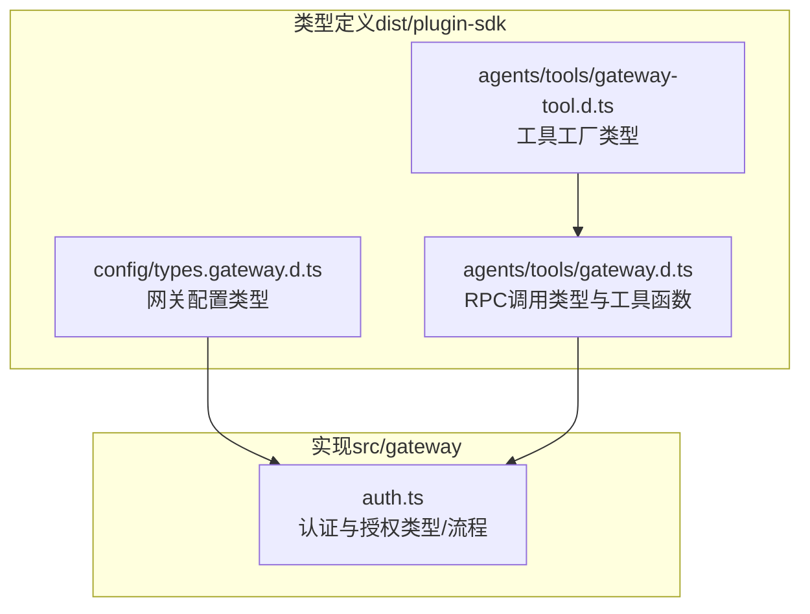
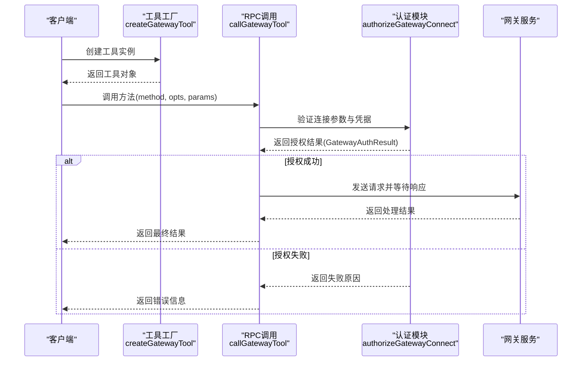
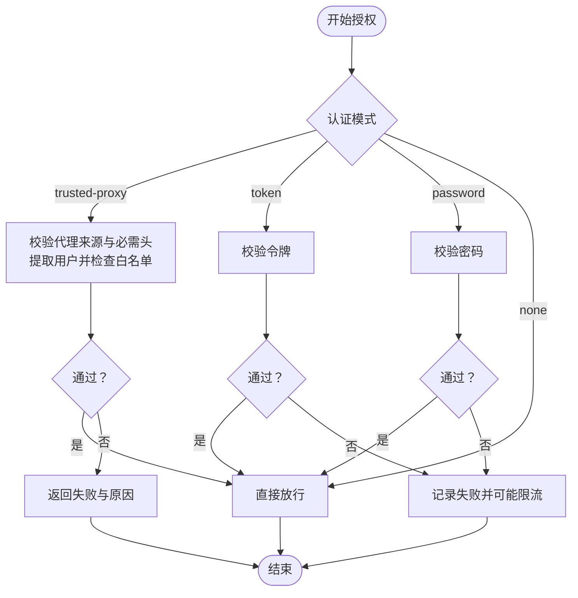
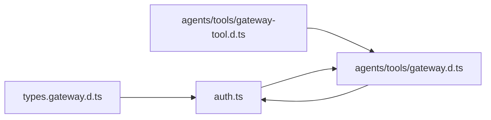

# 网关类型定义

## 目录
1. [引言](#引言)
2. [项目结构](#项目结构)
3. [核心组件](#核心组件)
4. [架构总览](#架构总览)
5. [详细组件分析](#详细组件分析)
6. [依赖关系分析](#依赖关系分析)
7. [性能考量](#性能考量)
8. [故障排查指南](#故障排查指南)
9. [结论](#结论)
10. [附录](#附录)

## 引言
本文件面向OpenClaw网关系统的使用者与扩展开发者，系统性梳理与网关相关的类型定义，覆盖以下主题：
- WebSocket协议相关的数据类型、消息格式与事件类型
- 网关服务器方法的参数类型与返回值类型
- 会话状态、连接管理与认证相关的类型定义
- 网关协议的消息结构、错误码与状态码
- 网关配置、运行时状态与监控指标的类型定义
- 网关与客户端交互的RPC调用类型
- 网关扩展与插件集成的类型接口

本文件以仓库内已生成的类型定义与实现代码为依据，确保内容可追溯至实际源码。

## 项目结构
围绕“网关类型定义”的核心位置如下：
- 类型定义集中于dist目录下的plugin-sdk声明文件，涵盖网关配置、RPC调用选项等
- 网关认证逻辑位于src/gateway/auth.ts，提供认证结果与授权流程的类型支撑
- 插件侧工具通过gateway.d.ts与gateway-tool.d.ts暴露RPC调用与工具封装接口

图表来源
- [dist/plugin-sdk/config/types.gateway.d.ts](file://dist/plugin-sdk/config/types.gateway.d.ts#L1-L336)
- [dist/plugin-sdk/agents/tools/gateway.d.ts](file://dist/plugin-sdk/agents/tools/gateway.d.ts#L1-L16)
- [dist/plugin-sdk/agents/tools/gateway-tool.d.ts](file://dist/plugin-sdk/agents/tools/gateway-tool.d.ts#L1-L7)
- [src/gateway/auth.ts](file://src/gateway/auth.ts#L1-L504)

章节来源
- [dist/plugin-sdk/config/types.gateway.d.ts](file://dist/plugin-sdk/config/types.gateway.d.ts#L1-L336)
- [dist/plugin-sdk/agents/tools/gateway.d.ts](file://dist/plugin-sdk/agents/tools/gateway.d.ts#L1-L16)
- [dist/plugin-sdk/agents/tools/gateway-tool.d.ts](file://dist/plugin-sdk/agents/tools/gateway-tool.d.ts#L1-L7)
- [src/gateway/auth.ts](file://src/gateway/auth.ts#L1-L504)

## 核心组件
本节对与网关类型定义直接相关的核心类型进行分层说明，并给出其职责与使用场景。

- 网关配置类型
  - 绑定模式、TLS、发现、控制UI、认证、远程访问、HTTP端点、节点与工具策略等
  - 关键类型：GatewayBindMode、GatewayTlsConfig、DiscoveryConfig、GatewayAuthConfig、GatewayHttpConfig、GatewayNodesConfig、GatewayToolsConfig、GatewayConfig
  - 参考路径：[dist/plugin-sdk/config/types.gateway.d.ts](file://dist/plugin-sdk/config/types.gateway.d.ts#L1-L336)

- RPC调用类型
  - 网关调用选项、默认网关地址、工具调用函数签名
  - 关键类型：GatewayCallOptions、DEFAULT_GATEWAY_URL、callGatewayTool
  - 工具工厂：createGatewayTool
  - 参考路径：[dist/plugin-sdk/agents/tools/gateway.d.ts](file://dist/plugin-sdk/agents/tools/gateway.d.ts#L1-L16)，[dist/plugin-sdk/agents/tools/gateway-tool.d.ts](file://dist/plugin-sdk/agents/tools/gateway-tool.d.ts#L1-L7)

- 认证与授权类型
  - 解析后的认证模式、授权结果、请求客户端IP解析、Tailscale身份校验等
  - 关键类型：ResolvedGatewayAuth、GatewayAuthResult、AuthorizeGatewayConnectParams、GatewayAuthSurface
  - 参考路径：[src/gateway/auth.ts](file://src/gateway/auth.ts#L1-L504)

章节来源
- [dist/plugin-sdk/config/types.gateway.d.ts](file://dist/plugin-sdk/config/types.gateway.d.ts#L1-L336)
- [dist/plugin-sdk/agents/tools/gateway.d.ts](file://dist/plugin-sdk/agents/tools/gateway.d.ts#L1-L16)
- [dist/plugin-sdk/agents/tools/gateway-tool.d.ts](file://dist/plugin-sdk/agents/tools/gateway-tool.d.ts#L1-L7)
- [src/gateway/auth.ts](file://src/gateway/auth.ts#L1-L504)

## 架构总览
下图展示从客户端到网关服务端的关键类型交互：客户端通过RPC调用发起请求，网关根据配置与认证策略决定是否放行并执行相应操作。

图表来源
- [dist/plugin-sdk/agents/tools/gateway-tool.d.ts](file://dist/plugin-sdk/agents/tools/gateway-tool.d.ts#L1-L7)
- [dist/plugin-sdk/agents/tools/gateway.d.ts](file://dist/plugin-sdk/agents/tools/gateway.d.ts#L1-L16)
- [src/gateway/auth.ts](file://src/gateway/auth.ts#L378-L485)

## 详细组件分析

### 网关配置类型（GatewayConfig）
- 绑定与监听
  - bind: 支持auto、lan、loopback、custom、tailnet等模式
  - customBindHost: 自定义绑定IP（当bind为custom时生效）
  - port: 复用端口（默认18789）
- 控制UI与安全
  - controlUi: 基础路径、根目录、跨域、设备身份与不安全认证开关
  - tls: TLS启用、自签证书、证书/密钥/CA路径
  - auth: 认证模式（none/token/password/trusted-proxy）、令牌/密码、Tailscale支持、速率限制、代理头配置
  - tailscale: 暴露模式（off/serve/funnel）、退出重置
  - trustedProxies与allowRealIpFallback: 代理信任与回退策略
- 远程访问
  - remote: URL、传输方式（ssh/direct）、认证凭据、TLS指纹、SSH目标与密钥
- HTTP端点与安全
  - http.endpoints.chatCompletions与responses
  - http.securityHeaders.strictTransportSecurity
- 节点与工具策略
  - nodes.browser路由策略与命令白名单/黑名单
  - tools.allow/deny用于HTTP /tools/invoke访问控制
- 其他
  - reload.mode/debounceMs
  - channelHealthCheckMinutes

章节来源
- [dist/plugin-sdk/config/types.gateway.d.ts](file://dist/plugin-sdk/config/types.gateway.d.ts#L1-L336)

### RPC调用类型（GatewayCallOptions与工具）
- 默认网关地址：DEFAULT_GATEWAY_URL
- 调用选项：gatewayUrl、gatewayToken、timeoutMs
- 工具函数
  - readGatewayCallOptions: 将任意参数映射为GatewayCallOptions
  - resolveGatewayOptions: 解析最终URL、令牌与超时
  - callGatewayTool: 执行RPC调用，支持expectFinal标志
- 工具工厂：createGatewayTool，支持agentSessionKey与OpenClawConfig注入

章节来源
- [dist/plugin-sdk/agents/tools/gateway.d.ts](file://dist/plugin-sdk/agents/tools/gateway.d.ts#L1-L16)
- [dist/plugin-sdk/agents/tools/gateway-tool.d.ts](file://dist/plugin-sdk/agents/tools/gateway-tool.d.ts#L1-L7)

### 认证与授权类型（GatewayAuth）
- 解析后的认证配置
  - ResolvedGatewayAuth: mode、token、password、allowTailscale、trustedProxy
  - ResolvedGatewayAuthMode与来源：override/config/password/token/default
- 授权结果
  - GatewayAuthResult: ok、method（none/token/password/tailscale/device-token/trusted-proxy）、user、reason、rateLimited、retryAfterMs
- 授权参数
  - AuthorizeGatewayConnectParams: auth、connectAuth、req、trustedProxies、tailscaleWhois、authSurface、rateLimiter、clientIp、rateLimitScope、allowRealIpFallback
- 授权流程要点
  - 支持trusted-proxy模式：校验代理来源、必需头、用户白名单
  - 支持none与token/password模式；token与password需严格比较
  - 支持Tailscale头认证（仅在WS Control UI表面允许）
  - 速率限制：按IP与作用域统计失败次数，超过阈值阻断并返回重试时间

图表来源
- [src/gateway/auth.ts](file://src/gateway/auth.ts#L378-L485)

章节来源
- [src/gateway/auth.ts](file://src/gateway/auth.ts#L1-L504)

### WebSocket协议与消息类型
- 客户端默认连接地址：DEFAULT_GATEWAY_URL
- 连接建立前的认证：通过authorizeGatewayConnect完成
- 消息格式与事件类型
  - 未在本文件中显式定义具体消息体字段，建议参考网关协议文档或实现代码中的消息编解码部分
  - 若存在RPC调用，通常采用JSON-RPC风格（方法名+参数），并由callGatewayTool统一处理

章节来源
- [dist/plugin-sdk/agents/tools/gateway.d.ts](file://dist/plugin-sdk/agents/tools/gateway.d.ts#L1-L16)
- [src/gateway/auth.ts](file://src/gateway/auth.ts#L378-L485)

### 错误码与状态码
- 授权失败常见原因（reason）
  - trusted_proxy_*：代理相关（无请求、不可信来源、缺失必需头、用户缺失或不在白名单）
  - token_missing_config/token_missing/token_mismatch：令牌缺失或不匹配
  - password_missing_config/password_missing/password_mismatch：密码缺失或不匹配
  - unauthorized：通用未授权
  - rate_limited：触发速率限制
  - tailscale_*：Tailscale用户或身份验证相关问题
- 状态码
  - 未在本文件中定义HTTP状态码常量；如需，请参考HTTP端点实现与错误处理

章节来源
- [src/gateway/auth.ts](file://src/gateway/auth.ts#L40-L49)

### 运行时状态与监控指标
- 运行时状态
  - 未在本文件中定义专用运行时状态类型；通常由网关内部维护
- 监控指标
  - 未在本文件中定义专用指标类型；可通过外部监控系统采集网关日志与指标

章节来源
- [dist/plugin-sdk/config/types.gateway.d.ts](file://dist/plugin-sdk/config/types.gateway.d.ts#L330-L335)

### 网关扩展与插件集成接口
- 插件清单与入口
  - 各扩展包包含openclaw.plugin.json与index.ts，作为插件入口与元数据
  - 示例：extensions/*/openclaw.plugin.json、extensions/*/index.ts
- 类型接口
  - 插件SDK类型定义位于dist/plugin-sdk下，包括config、discord、infra、shared等子目录
  - 网关相关类型：config/types.gateway.d.ts、shared/gateway-bind-url.d.ts、infra/tls/gateway.d.ts等

章节来源
- [dist/plugin-sdk/config/types.gateway.d.ts](file://dist/plugin-sdk/config/types.gateway.d.ts#L1-L336)

## 依赖关系分析
- 类型定义依赖
  - 网关配置类型被RPC调用与认证模块广泛使用
  - RPC调用依赖认证模块提供的授权结果
- 实现依赖
  - 认证模块依赖网关配置、速率限制器、Tailscale身份查询与客户端IP解析

图表来源
- [dist/plugin-sdk/config/types.gateway.d.ts](file://dist/plugin-sdk/config/types.gateway.d.ts#L1-L336)
- [src/gateway/auth.ts](file://src/gateway/auth.ts#L1-L504)
- [dist/plugin-sdk/agents/tools/gateway.d.ts](file://dist/plugin-sdk/agents/tools/gateway.d.ts#L1-L16)
- [dist/plugin-sdk/agents/tools/gateway-tool.d.ts](file://dist/plugin-sdk/agents/tools/gateway-tool.d.ts#L1-L7)

章节来源
- [dist/plugin-sdk/config/types.gateway.d.ts](file://dist/plugin-sdk/config/types.gateway.d.ts#L1-L336)
- [src/gateway/auth.ts](file://src/gateway/auth.ts#L1-L504)
- [dist/plugin-sdk/agents/tools/gateway.d.ts](file://dist/plugin-sdk/agents/tools/gateway.d.ts#L1-L16)
- [dist/plugin-sdk/agents/tools/gateway-tool.d.ts](file://dist/plugin-sdk/agents/tools/gateway-tool.d.ts#L1-L7)

## 性能考量
- 速率限制
  - 通过AuthRateLimiter按IP与作用域统计失败次数，避免暴力破解
  - 支持滑动窗口与锁定时长配置
- 连接与超时
  - callGatewayTool支持超时设置，避免长时间阻塞
- HTTP端点
  - 对URL拉取、文件大小、图片大小、PDF解析等设置上限，防止资源滥用

章节来源
- [src/gateway/auth.ts](file://src/gateway/auth.ts#L138-L147)
- [dist/plugin-sdk/agents/tools/gateway.d.ts](file://dist/plugin-sdk/agents/tools/gateway.d.ts#L5-L6)
- [dist/plugin-sdk/config/types.gateway.d.ts](file://dist/plugin-sdk/config/types.gateway.d.ts#L206-L251)

## 故障排查指南
- 常见问题定位
  - 令牌/密码错误：检查配置与环境变量，确认严格比较逻辑
  - 代理认证失败：核对trustedProxy.userHeader、requiredHeaders与allowUsers
  - 速率限制：观察retryAfterMs，调整阈值或豁免本地回环
  - Tailscale身份不匹配：确认头信息与反向代理配置
- 建议步骤
  - 开启详细日志，复现问题并记录reason
  - 使用默认网关地址与最小化配置快速验证
  - 在受控环境中临时关闭速率限制以排除干扰

章节来源
- [src/gateway/auth.ts](file://src/gateway/auth.ts#L331-L372)
- [src/gateway/auth.ts](file://src/gateway/auth.ts#L448-L481)

## 结论
本文基于仓库内的类型定义与实现代码，系统梳理了OpenClaw网关的配置、RPC调用、认证授权与扩展接口等关键类型。对于消息格式、错误码与状态码的具体细节，建议结合网关协议文档与实现代码进一步查阅。若需更深入的实现细节，可参考对应源文件的注释与流程图。

## 附录
- 相关文件索引
  - 网关配置类型：[dist/plugin-sdk/config/types.gateway.d.ts](file://dist/plugin-sdk/config/types.gateway.d.ts#L1-L336)
  - RPC调用类型：[dist/plugin-sdk/agents/tools/gateway.d.ts](file://dist/plugin-sdk/agents/tools/gateway.d.ts#L1-L16)
  - 工具工厂类型：[dist/plugin-sdk/agents/tools/gateway-tool.d.ts](file://dist/plugin-sdk/agents/tools/gateway-tool.d.ts#L1-L7)
  - 认证与授权类型：[src/gateway/auth.ts](file://src/gateway/auth.ts#L1-L504)