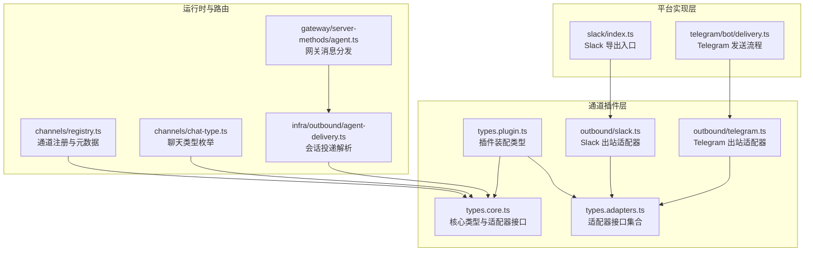
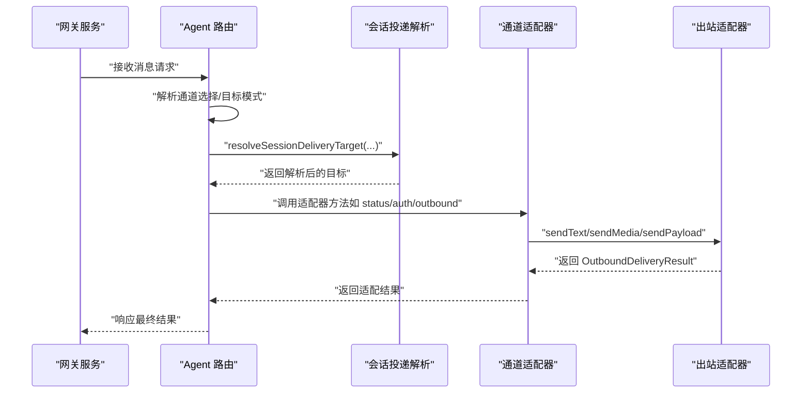
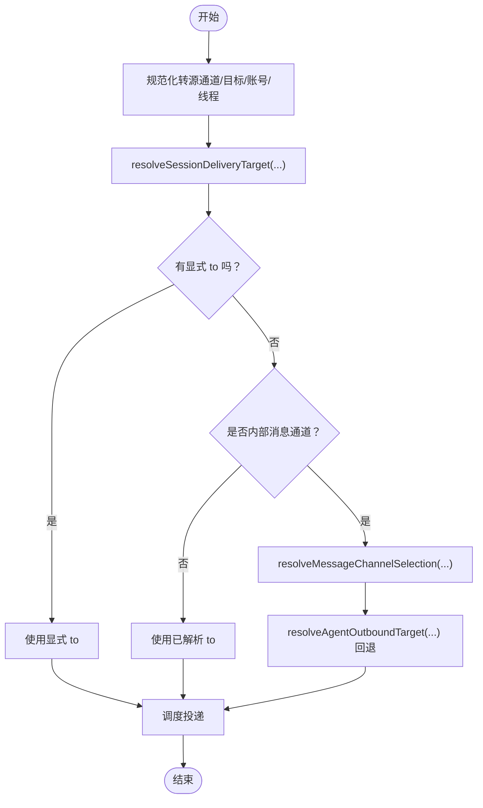
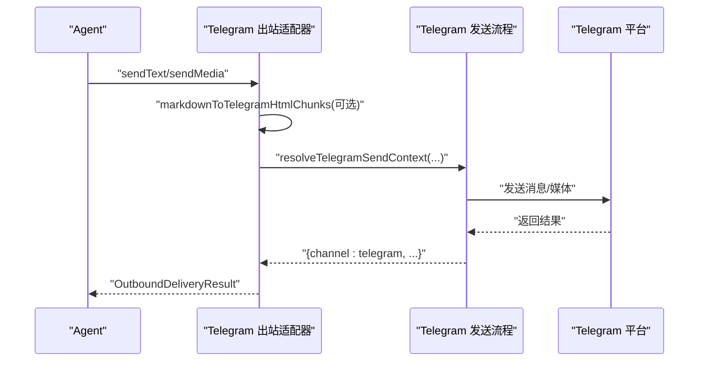
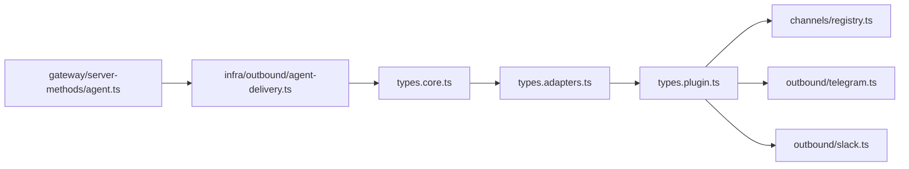

# 通道类型系统

## 目录
1. [引言](#引言)
2. [项目结构](#项目结构)
3. [核心组件](#核心组件)
4. [架构总览](#架构总览)
5. [详细组件分析](#详细组件分析)
6. [依赖关系分析](#依赖关系分析)
7. [性能考量](#性能考量)
8. [故障排查指南](#故障排查指南)
9. [结论](#结论)
10. [附录](#附录)

## 引言
本文件为 OpenClaw 通道系统的“类型定义参考”，聚焦于即时通讯平台（如 Discord、Telegram、Slack 等）在系统中的类型化抽象与实现契约。内容涵盖：
- 通道通用类型：消息格式、用户身份、权限策略、线程与回复模式
- 通道适配器接口与实现要求：配置、认证、状态、网关、出站发送、目录解析等
- 消息路由、转发与处理的类型定义
- 通道配置、认证与连接状态的类型结构
- 通道特定的工具调用与技能类型
- 通道扩展与自定义适配器的类型接口

目标是帮助开发者在不深入源码细节的情况下，快速理解并正确实现或扩展新的通道适配器。

## 项目结构
OpenClaw 将“通道”抽象为可插拔的插件，通过统一的类型接口对接不同平台。核心类型位于 channels/plugins 下，通道实现位于各自平台目录（如 src/discord、src/telegram、src/slack），并通过注册表进行统一管理。

图表来源
- [src/channels/plugins/types.core.ts](file://src/channels/plugins/types.core.ts#L1-L391)
- [src/channels/plugins/types.adapters.ts](file://src/channels/plugins/types.adapters.ts#L1-L384)
- [src/channels/plugins/types.plugin.ts](file://src/channels/plugins/types.plugin.ts#L1-L86)
- [src/channels/plugins/outbound/telegram.ts](file://src/channels/plugins/outbound/telegram.ts#L42-L102)
- [src/channels/plugins/outbound/slack.ts](file://src/channels/plugins/outbound/slack.ts#L95-L138)
- [src/slack/index.ts](file://src/slack/index.ts#L1-L26)
- [src/telegram/bot/delivery.ts](file://src/telegram/bot/delivery.ts)
- [src/channels/registry.ts](file://src/channels/registry.ts#L1-L201)
- [src/channels/chat-type.ts](file://src/channels/chat-type.ts#L1-L19)
- [src/infra/outbound/agent-delivery.ts](file://src/infra/outbound/agent-delivery.ts#L55-L87)
- [src/gateway/server-methods/agent.ts](file://src/gateway/server-methods/agent.ts#L593-L628)

章节来源
- [src/channels/plugins/types.core.ts](file://src/channels/plugins/types.core.ts#L1-L391)
- [src/channels/plugins/types.adapters.ts](file://src/channels/plugins/types.adapters.ts#L1-L384)
- [src/channels/plugins/types.plugin.ts](file://src/channels/plugins/types.plugin.ts#L1-L86)
- [src/channels/registry.ts](file://src/channels/registry.ts#L1-L201)
- [src/channels/chat-type.ts](file://src/channels/chat-type.ts#L1-L19)

## 核心组件
本节梳理通道系统的关键类型与职责边界，便于快速定位实现位置。

- 通道标识与能力
  - ChannelId：通道唯一标识，支持内置通道与外部插件扩展
  - ChannelCapabilities：声明通道支持的聊天类型、媒体、回复、投票、线程等能力
  - ChatType：direct/group/channel 的标准化枚举

- 适配器接口族
  - 配置与设置：ChannelConfigAdapter、ChannelSetupAdapter
  - 认证与安全：ChannelAuthAdapter、ChannelSecurityAdapter
  - 状态与审计：ChannelStatusAdapter、BaseProbeResult、BaseTokenResolution
  - 网关与生命周期：ChannelGatewayAdapter、ChannelLogoutContext
  - 出站发送：ChannelOutboundAdapter（含文本/媒体/Poll/负载发送）
  - 入站/目录/解析：ChannelDirectoryAdapter、ChannelResolverAdapter
  - 线程与提及：ChannelThreadingAdapter、ChannelMentionAdapter
  - 心跳与命令：ChannelHeartbeatAdapter、ChannelCommandAdapter
  - 流式输出：ChannelStreamingAdapter

- 插件装配
  - ChannelPlugin：将上述适配器与元数据、能力、默认参数组合为完整插件

章节来源
- [src/channels/plugins/types.core.ts](file://src/channels/plugins/types.core.ts#L11-L391)
- [src/channels/plugins/types.adapters.ts](file://src/channels/plugins/types.adapters.ts#L24-L384)
- [src/channels/plugins/types.plugin.ts](file://src/channels/plugins/types.plugin.ts#L49-L85)

## 架构总览
下图展示从“消息进入”到“通道出站”的关键类型交互与控制流。

图表来源
- [src/gateway/server-methods/agent.ts](file://src/gateway/server-methods/agent.ts#L593-L628)
- [src/infra/outbound/agent-delivery.ts](file://src/infra/outbound/agent-delivery.ts#L55-L87)
- [src/channels/plugins/types.adapters.ts](file://src/channels/plugins/types.adapters.ts#L108-L125)
- [src/channels/plugins/types.core.ts](file://src/channels/plugins/types.core.ts#L286-L297)

## 详细组件分析

### 通道适配器接口与实现要求
- 配置与账户
  - ChannelConfigAdapter：列出账户、解析账户、启用/禁用、描述快照、默认 to、allow-from 解析与格式化
  - ChannelSetupAdapter：解析/绑定账户 ID，应用账户名与配置，校验输入
- 安全与认证
  - ChannelSecurityAdapter：解析 DM 策略、收集安全告警
  - ChannelAuthAdapter：登录流程（按需）
- 状态与审计
  - ChannelStatusAdapter：构建摘要、探测账户、审计、生成账户快照、日志自识别、状态推断、问题收集
  - BaseProbeResult/BaseTokenResolution：最小探测与令牌解析结果基类
- 网关与生命周期
  - ChannelGatewayAdapter：启动/停止账户、二维码登录、登出
  - ChannelLogoutContext：登出上下文
- 出站发送
  - ChannelOutboundAdapter：声明投递模式（direct/gateway/hybrid）、文本块切分器、限制、目标解析、文本/媒体/Poll/负载发送
- 目录与解析
  - ChannelDirectoryAdapter：查询自身、用户/群组列表、群成员
  - ChannelResolverAdapter：目标解析（用户/群组）
- 线程与提及
  - ChannelThreadingAdapter：回复模式、工具上下文构建
  - ChannelMentionAdapter：提及剥离与显示格式
- 心跳与命令
  - ChannelHeartbeatAdapter：就绪检查、收件人解析
  - ChannelCommandAdapter：命令执行策略

章节来源
- [src/channels/plugins/types.adapters.ts](file://src/channels/plugins/types.adapters.ts#L24-L384)
- [src/channels/plugins/types.core.ts](file://src/channels/plugins/types.core.ts#L55-L391)

### 消息路由、转发与处理的类型定义
- 会话投递解析
  - 依据会话条目、显式 to、线程信息、转源通道等，解析最终投递目标
- 内部消息通道与回退
  - 当目标通道为内部消息通道时，尝试解析实际通道并回填目标模式
- 线程上下文与工具上下文
  - 提供当前消息、回复模式、是否已回复标记等，用于工具调用与转发

图表来源
- [src/infra/outbound/agent-delivery.ts](file://src/infra/outbound/agent-delivery.ts#L55-L87)
- [src/gateway/server-methods/agent.ts](file://src/gateway/server-methods/agent.ts#L593-L628)

章节来源
- [src/infra/outbound/agent-delivery.ts](file://src/infra/outbound/agent-delivery.ts#L55-L87)
- [src/gateway/server-methods/agent.ts](file://src/gateway/server-methods/agent.ts#L593-L628)

### 通道配置、认证与连接状态的类型结构
- 通道元数据与注册
  - ChannelMeta：标签、文档路径、别名、系统图标、排序等
  - 注册表：内置通道顺序、别名映射、标准化通道 ID
- 账户快照
  - ChannelAccountSnapshot：配置/运行/连接状态、错误、时间戳、凭据来源、DM 策略等
- 运行时状态 UI
  - UI 层根据快照渲染“已配置/运行/连接”等状态

章节来源
- [src/channels/plugins/types.core.ts](file://src/channels/plugins/types.core.ts#L76-L159)
- [src/channels/registry.ts](file://src/channels/registry.ts#L27-L121)
- [ui/src/ui/views/channels.ts](file://ui/src/ui/views/channels.ts#L200-L245)
- [ui/src/ui/views/channels.shared.ts](file://ui/src/ui/views/channels.shared.ts#L5-L38)

### 通道特定的消息格式与适配器实现
- Telegram
  - 出站适配器：声明直连投递、Markdown 块切分、文本长度限制；提供 sendText/sendMedia/sendPayload
  - 发送流程：解析发送上下文（含回复/线程），调用底层发送
- Slack
  - 出站适配器：声明直连投递、文本长度限制；提供 sendText/sendMedia/sendPayload
  - 平台导出：消息发送、编辑、反应、成员信息、探测等

图表来源
- [src/channels/plugins/outbound/telegram.ts](file://src/channels/plugins/outbound/telegram.ts#L42-L102)
- [src/telegram/bot/delivery.ts](file://src/telegram/bot/delivery.ts)

章节来源
- [src/channels/plugins/outbound/telegram.ts](file://src/channels/plugins/outbound/telegram.ts#L42-L102)
- [src/telegram/bot/delivery.ts](file://src/telegram/bot/delivery.ts)
- [src/channels/plugins/outbound/slack.ts](file://src/channels/plugins/outbound/slack.ts#L95-L138)
- [src/slack/index.ts](file://src/slack/index.ts#L1-L26)

### 通道扩展与自定义适配器的类型接口
- 插件装配
  - ChannelPlugin：聚合所有适配器、元数据、能力、默认队列参数、重载前缀、代理工具等
- UI 配置提示
  - ChannelConfigSchema/ChannelConfigUiHint：为通道配置提供 JSON Schema 与 UI 提示（标签、帮助、敏感字段等）

章节来源
- [src/channels/plugins/types.plugin.ts](file://src/channels/plugins/types.plugin.ts#L49-L85)
- [src/channels/plugins/types.adapters.ts](file://src/channels/plugins/types.adapters.ts#L108-L125)

### 网关模型与跨端一致性
- 通道状态与配置查询
  - ChannelsStatusParams/ChannelsStatusResult：通道状态快照、账户映射、默认账户等
  - TalkModeParams/TalkConfigParams/TalkConfigResult：Talk 模式与配置读取结果
- Swift 端一致性
  - macOS 与共享库中的 GatewayModels.swift 保持一致的键名与结构，确保跨端协议稳定

章节来源
- [apps/shared/OpenClawKit/Sources/OpenClawProtocol/GatewayModels.swift](file://apps/shared/OpenClawKit/Sources/OpenClawProtocol/GatewayModels.swift#L1825-L1926)
- [apps/macos/Sources/OpenClawProtocol/GatewayModels.swift](file://apps/macos/Sources/OpenClawProtocol/GatewayModels.swift#L1825-L1926)

## 依赖关系分析
- 类型耦合与内聚
  - types.core.ts 定义核心类型与最小接口，types.adapters.ts 在其上扩展适配器接口，types.plugin.ts 组装插件
  - 通道实现（如 Telegram/Slack）仅依赖适配器接口，降低对核心模块的耦合
- 外部依赖与集成点
  - 通道注册表负责内置通道的元数据与标准化 ID
  - 网关与会话投递解析作为上层编排，向下依赖适配器接口
- 循环依赖规避
  - 通道插件通过“仅导入类型”与“延迟加载”避免循环依赖（例如 normalizeAnyChannelId 使用插件注册表）

图表来源
- [src/channels/plugins/types.core.ts](file://src/channels/plugins/types.core.ts#L1-L391)
- [src/channels/plugins/types.adapters.ts](file://src/channels/plugins/types.adapters.ts#L1-L384)
- [src/channels/plugins/types.plugin.ts](file://src/channels/plugins/types.plugin.ts#L1-L86)
- [src/channels/registry.ts](file://src/channels/registry.ts#L1-L201)
- [src/infra/outbound/agent-delivery.ts](file://src/infra/outbound/agent-delivery.ts#L55-L87)
- [src/gateway/server-methods/agent.ts](file://src/gateway/server-methods/agent.ts#L593-L628)

## 性能考量
- 文本块切分与长度限制
  - 出站适配器可配置 chunker 与 textChunkLimit，避免平台单次发送上限导致失败
- 队列与去抖
  - 插件 defaults.queue.debounceMs 可用于批量/节流发送
- 线程与回复模式
  - 合理设置 replyToMode 与工具上下文，减少重复转发与跨上下文装饰成本

## 故障排查指南
- 状态问题收集
  - ChannelStatusAdapter.collectStatusIssues：集中收集配置/权限/认证/运行期问题
- 探测与审计
  - probeAccount/auditAccount：通过最小探测与审计定位连接/令牌/网络问题
- UI 状态核对
  - UI 层根据 channels.status 渲染“已配置/运行/连接”等状态，辅助快速定位异常

章节来源
- [src/channels/plugins/types.adapters.ts](file://src/channels/plugins/types.adapters.ts#L127-L166)
- [ui/src/ui/views/channels.ts](file://ui/src/ui/views/channels.ts#L200-L245)

## 结论
OpenClaw 的通道系统以强类型的适配器接口为核心，将不同平台的消息生态抽象为统一契约。通过插件化装配与严格的类型约束，既保证了扩展性，又降低了实现复杂度。遵循本文档的类型定义与实现建议，可高效完成新通道的接入与优化。

## 附录
- 通道能力速查
  - 支持聊天类型：direct/group/channel
  - 支持功能：媒体、回复、投票、线程、反应、编辑、撤回、原生命令、阻塞流式输出
- 关键类型索引
  - ChannelId、ChannelCapabilities、ChannelMeta、ChannelAccountSnapshot
  - ChannelConfigAdapter、ChannelSetupAdapter、ChannelAuthAdapter、ChannelSecurityAdapter
  - ChannelStatusAdapter、ChannelGatewayAdapter、ChannelOutboundAdapter
  - ChannelDirectoryAdapter、ChannelResolverAdapter、ChannelThreadingAdapter、ChannelMentionAdapter
  - ChannelHeartbeatAdapter、ChannelCommandAdapter、ChannelStreamingAdapter