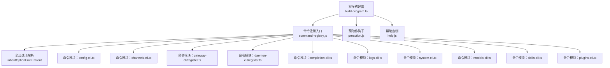
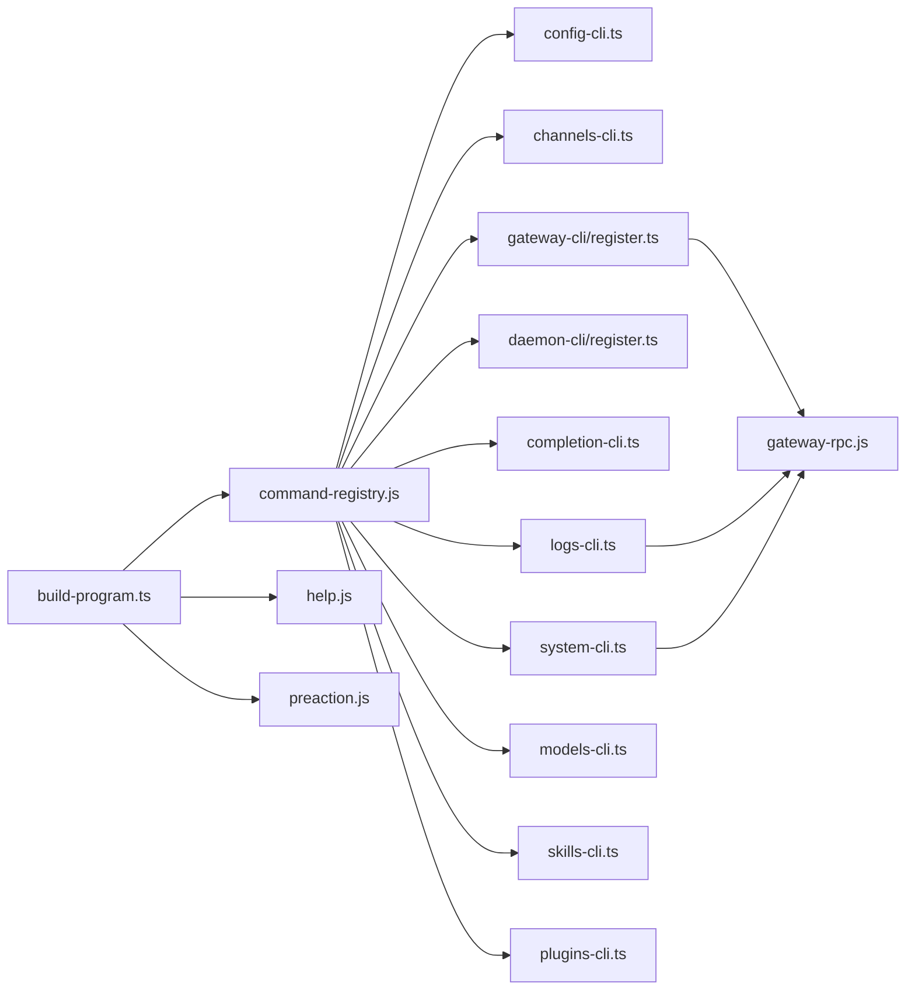

# CLI命令参考

## 目录
1. [简介](#简介)
2. [项目结构](#项目结构)
3. [核心组件](#核心组件)
4. [架构总览](#架构总览)
5. [详细组件分析](#详细组件分析)
6. [依赖关系分析](#依赖关系分析)
7. [性能与输出特性](#性能与输出特性)
8. [自动化与批处理指南](#自动化与批处理指南)
9. [故障排除](#故障排除)
10. [结论](#结论)

## 简介
本参考文档面向使用 OpenClaw CLI 的用户与运维人员，系统梳理命令树、子命令、参数选项、使用示例与最佳实践。内容覆盖网关管理、频道配置、代理控制、工具调用、日志与诊断、模型与插件管理等常用场景，并提供命令行补全、别名配置、输出格式与日志级别的说明，以及常见问题的排查路径。

## 项目结构
OpenClaw CLI 基于 Commander 构建，通过“程序构建器”集中注册命令与帮助信息；各功能域（如网关、频道、模型、插件）在独立模块中定义命令注册函数，最终由程序构建器统一挂载。

图表来源
- [src/cli/program/build-program.ts](file://src/cli/program/build-program.ts#L1-L21)
- [src/cli/command-options.ts](file://src/cli/command-options.ts#L20-L44)
- [src/cli/config-cli.ts](file://src/cli/config-cli.ts#L395-L477)
- [src/cli/channels-cli.ts](file://src/cli/channels-cli.ts#L70-L257)
- [src/cli/gateway-cli/register.ts](file://src/cli/gateway-cli/register.ts#L89-L281)
- [src/cli/daemon-cli/register.ts](file://src/cli/daemon-cli/register.ts#L6-L19)
- [src/cli/completion-cli.ts](file://src/cli/completion-cli.ts#L301-L301)
- [src/cli/logs-cli.ts](file://src/cli/logs-cli.ts#L198-L330)
- [src/cli/system-cli.ts](file://src/cli/system-cli.ts#L41-L133)
- [src/cli/models-cli.ts](file://src/cli/models-cli.ts#L37-L444)
- [src/cli/skills-cli.ts](file://src/cli/skills-cli.ts#L40-L82)
- [src/cli/plugins-cli.ts](file://src/cli/plugins-cli.ts#L364-L827)

章节来源
- [src/cli/program/build-program.ts](file://src/cli/program/build-program.ts#L1-L21)

## 核心组件
- 程序构建器：负责创建 Commander 实例、注入上下文、注册帮助与预动作钩子、加载命令注册表。
- 全局选项继承：支持父级命令选项在子命令中的有限层级继承，避免无界遍历。
- 命令模块：按功能域拆分，每个模块导出 registerXxxCli 函数，集中声明子命令、参数与行为。

章节来源
- [src/cli/program/build-program.ts](file://src/cli/program/build-program.ts#L8-L20)
- [src/cli/command-options.ts](file://src/cli/command-options.ts#L20-L44)

## 架构总览
下图展示 CLI 主要命令与子命令的组织关系，以及与网关服务交互的关键点（如 gateway、daemon、logs、system 等）。

```mermaid
graph TB
subgraph "顶层命令"
CMD_OPENCLAW["openclaw"]
CMD_SETUP["setup"]
CMD_ONBOARD["onboard"]
CMD_CONFIGURE["configure"]
CMD_CONFIG["config"]
CMD_COMPLETION["completion"]
CMD_DOCTOR["doctor"]
CMD_DASHBOARD["dashboard"]
CMD_BACKUP["backup"]
CMD_RESET["reset"]
CMD_UNINSTALL["uninstall"]
CMD_UPDATE["update"]
CMD_CHANNELS["channels"]
CMD_SKILLS["skills"]
CMD_PLUGINS["plugins"]
CMD_MODELS["models"]
CMD_GATEWAY["gateway"]
CMD_DAEMON["daemon"]
CMD_LOGS["logs"]
CMD_SYSTEM["system"]
CMD_MEMORY["memory"]
CMD_DIRECTORY["directory"]
CMD_NODES["nodes"]
CMD_DEVICES["devices"]
CMD_NODE["node"]
CMD_APPROVALS["approvals"]
CMD_SANDBOX["sandbox"]
CMD_TUI["tui"]
CMD_BROWSER["browser"]
CMD_CRON["cron"]
CMD_DNS["dns"]
CMD_DOCS["docs"]
CMD_HOOKS["hooks"]
CMD_WEBHOOKS["webhooks"]
CMD_PAIRING["pairing"]
CMD_QR["qr"]
CMD_CLAWBOT["clawbot"]
end
CMD_OPENCLAW --> CMD_GATEWAY
CMD_OPENCLAW --> CMD_DAEMON
CMD_OPENCLAW --> CMD_LOGS
CMD_OPENCLAW --> CMD_SYSTEM
CMD_OPENCLAW --> CMD_MODELS
CMD_OPENCLAW --> CMD_PLUGINS
CMD_OPENCLAW --> CMD_CHANNELS
CMD_OPENCLAW --> CMD_SKILLS
CMD_OPENCLAW --> CMD_CONFIG
CMD_OPENCLAW --> CMD_COMPLETION
CMD_OPENCLAW --> CMD_DOCTOR
CMD_OPENCLAW --> CMD_DASHBOARD
CMD_OPENCLAW --> CMD_BACKUP
CMD_OPENCLAW --> CMD_RESET
CMD_OPENCLAW --> CMD_UNINSTALL
CMD_OPENCLAW --> CMD_UPDATE
CMD_OPENCLAW --> CMD_MEMORY
CMD_OPENCLAW --> CMD_DIRECTORY
CMD_OPENCLAW --> CMD_NODES
CMD_OPENCLAW --> CMD_DEVICES
CMD_OPENCLAW --> CMD_NODE
CMD_OPENCLAW --> CMD_APPROVALS
CMD_OPENCLAW --> CMD_SANDBOX
CMD_OPENCLAW --> CMD_TUI
CMD_OPENCLAW --> CMD_BROWSER
CMD_OPENCLAW --> CMD_CRON
CMD_OPENCLAW --> CMD_DNS
CMD_OPENCLAW --> CMD_DOCS
CMD_OPENCLAW --> CMD_HOOKS
CMD_OPENCLAW --> CMD_WEBHOOKS
CMD_OPENCLAW --> CMD_PAIRING
CMD_OPENCLAW --> CMD_QR
CMD_OPENCLAW --> CMD_CLAWBOT
```

图表来源
- [docs/cli/index.md](file://docs/cli/index.md#L93-L267)

章节来源
- [docs/cli/index.md](file://docs/cli/index.md#L93-L267)

## 详细组件分析

### 全局选项与输出样式
- 全局标志
  - --dev：隔离状态到 ~/.openclaw-dev 并切换默认端口。
  - --profile &lt;name&gt;：按配置文件夹隔离状态。
  - --no-color：禁用 ANSI 颜色。
  - --update：等价于 openclaw update（仅源码安装生效）。
  - -V, --version, -v：打印版本并退出。
- 输出样式
  - TTY 会渲染带颜色与进度指示；非 TTY 回退为纯文本。
  - --json 与部分命令的 --plain 关闭样式，便于机器解析。
  - --no-color 与 NO_COLOR=1 同效。
  - 长任务显示进度指示（支持 OSC 9;4）。
- 调色板
  - 使用“龙虾”主题色板，涵盖强调、成功、警告、错误、柔和等语义色。

章节来源
- [docs/cli/index.md](file://docs/cli/index.md#L62-L92)

### 配置命令（config）
- 子命令
  - get &lt;path&gt;：按点/方括号路径读取配置值。
  - set &lt;path&gt; &lt;value&gt;：写入配置值（支持严格 JSON5 或原始字符串）。
  - unset &lt;path&gt;：删除配置项。
  - file：打印当前生效配置文件路径。
  - validate [--json]：对配置进行模式校验，不启动网关。
- 行为要点
  - set/unset 在写入前基于“解析后但未合并默认值”的快照进行，避免默认值污染。
  - set 时对特定键（如 Ollama API Key）自动补齐 Provider 默认项。
  - validate 支持 JSON 输出，便于 CI。

章节来源
- [src/cli/config-cli.ts](file://src/cli/config-cli.ts#L279-L393)

### 频道管理（channels）
- 子命令
  - list [--no-usage] [--json]：列出已配置频道与认证档案。
  - status [--probe] [--timeout &lt;ms&gt;] [--json]：检查网关与频道健康状况。
  - capabilities [--channel] [--account] [--target] [--timeout] [--json]：查询提供商能力。
  - resolve &lt;entries...> [--channel] [--account] [--kind] [--json]：将名称解析为 ID。
  - logs [--channel] [--lines] [--json]：从网关日志文件中查看最近日志。
  - add [--channel] [--account] [--name] [多平台令牌/路径选项...] [--use-env]：添加或更新账号。
  - remove [--channel] [--account] [--delete]：禁用或删除账号。
  - login [--channel] [--account] [--verbose]：登录（如支持）。
  - logout [--channel] [--account]：登出（如支持）。
- 通用选项
  - --channel &lt;name&gt;：支持的频道列表。
  - --account &lt;id&gt;：账号 ID，默认 default。
  - --name &lt;label&gt;：账号显示名。

章节来源
- [src/cli/channels-cli.ts](file://src/cli/channels-cli.ts#L70-L257)

### 网关与守护进程（gateway / daemon）
- gateway
  - run：前台运行网关。
  - call &lt;method&gt; [--params]：直接调用网关 RPC 方法。
  - health：获取网关健康状态。
  - usage-cost [--days]：统计最近 N 天用量。
  - probe [--url|--ssh|--ssh-identity|--ssh-auto] [--token|--password] [--timeout] [--json]：综合探测可达性与健康。
  - discover [--timeout] [--json]：发现本地与广域网网关信标。
  - 服务命令（通过 addGatewayServiceCommands 注册）：status/install/uninstall/start/stop/restart。
- daemon
  - 管理服务安装与状态（等价于 gateway service，兼容旧别名）。

章节来源
- [src/cli/gateway-cli/register.ts](file://src/cli/gateway-cli/register.ts#L89-L281)
- [src/cli/daemon-cli/register.ts](file://src/cli/daemon-cli/register.ts#L6-L19)

### 日志（logs）
- 选项
  - --limit &lt;n&gt;：返回最大行数。
  - --max-bytes &lt;n&gt;：读取最大字节数。
  - --follow：持续跟踪输出。
  - --interval &lt;ms&gt;：轮询间隔。
  - --json：逐行输出 JSON。
  - --plain/--no-color：禁用颜色或纯文本。
  - --local-time：按本地时区显示时间戳。
  - --url/--token/--timeout：RPC 连接参数。
- 行为
  - TTY 模式美化输出，非 TTY 为纯文本。
  - JSON 模式输出结构化事件，含元数据与通知。

章节来源
- [src/cli/logs-cli.ts](file://src/cli/logs-cli.ts#L198-L330)

### 系统工具（system）
- 子命令
  - event --text &lt;text&gt; [--mode now|next-heartbeat] [--json]：入队系统事件并可触发心跳。
  - heartbeat last|enable|disable [--json]：心跳控制与查询。
  - presence [--json]：列出系统在线条目。
- 选项
  - 统一支持 --url/--token/--timeout 等 RPC 客户端选项。

章节来源
- [src/cli/system-cli.ts](file://src/cli/system-cli.ts#L41-L133)

### 模型管理（models）
- 子命令
  - list [--all|--local|--provider] [--json|--plain]：列出模型。
  - status [--json|--plain] [--check] [--probe...] [--agent]：查看配置与认证状态，支持探活与检查过期。
  - set &lt;model&gt; / set-image &lt;model&gt;：设置默认与图像模型。
  - aliases list/add/remove [--json|--plain]：别名管理。
  - fallbacks list/add/remove/clear [--json|--plain]：文本模型回退列表。
  - image-fallbacks list/add/remove/clear [--json|--plain]：图像模型回退列表。
  - scan [--min-params|--max-age-days|--provider|--max-candidates|--timeout|--concurrency|--no-probe|--yes|--no-input|--set-default|--set-image] [--json]：扫描可用模型并生成回退建议。
  - auth add/login/setup-token/paste-token/login-github-copilot/order get/set/clear [--agent]：认证配置与优先级管理。
- 选项
  - --agent &lt;id&gt;：覆盖默认代理工作区。

章节来源
- [src/cli/models-cli.ts](file://src/cli/models-cli.ts#L37-L444)

### 技能（skills）
- 子命令
  - list [--json|--eligible|-v]：列出技能。
  - info &lt;name&gt; [--json]：查看技能详情。
  - check [--json]：检查就绪状态。
- 默认行为：无子命令时等价于 list。

章节来源
- [src/cli/skills-cli.ts](file://src/cli/skills-cli.ts#L40-L82)

### 插件（plugins）
- 子命令
  - list [--json|--enabled|--verbose]：列出插件。
  - info &lt;id&gt; [--json]：查看插件详情。
  - enable &lt;id&gt; / disable &lt;id&gt;：启用/禁用。
  - uninstall &lt;id&gt; [--keep-files|--keep-config|--force|--dry-run]：卸载插件。
  - install &lt;path-or-spec&gt; [-l|--link] [--pin]：安装插件（本地路径、归档或 npm 规范）。
  - update [id] [--all] [--dry-run]：更新 npm 安装的插件。
  - doctor：报告插件加载问题。
- 行为要点
  - 支持“捆绑前置安装计划”，在 npm 失败时回退到内置源。
  - 安装后自动记录安装记录并应用槽位选择，必要时提示重启网关。

章节来源
- [src/cli/plugins-cli.ts](file://src/cli/plugins-cli.ts#L364-L827)

### 补全与别名（completion）
- 用途
  - 生成并安装 zsh/bash/fish/PowerShell 补全脚本。
  - 可将脚本缓存至状态目录，避免动态生成带来的性能开销。
- 选项
  - -s, --shell &lt;shell&gt;：目标 Shell（默认 zsh）。
  - -i, --install：安装到 Shell 配置文件。
  - --write-state：写入 $OPENCLAW_STATE_DIR/completions，不输出到 stdout。
  - -y, --yes：非交互确认。
- 注意
  - --install 会在配置文件中追加“OpenClaw Completion”块并指向缓存脚本。
  - 未指定 --install 或 --write-state 时，直接打印脚本到 stdout。
  - 生成补全脚本会预先加载完整命令树，确保嵌套子命令也被包含。

章节来源
- [docs/cli/completion.md](file://docs/cli/completion.md#L1-L36)
- [src/cli/completion-cli.ts](file://src/cli/completion-cli.ts#L231-L301)

## 依赖关系分析
- 组件耦合
  - 程序构建器与命令注册表强耦合，保证命令树一次性构建。
  - 各命令模块相对独立，仅通过公共运行时与 CLI 工具函数交互。
  - 网关相关命令共享 RPC 客户端选项（--url/--token/--timeout），通过统一混入函数注入。
- 外部依赖
  - Commander：命令解析与帮助生成。
  - 文件系统与进程：用于状态目录、缓存脚本写入、日志流输出等。

图表来源
- [src/cli/program/build-program.ts](file://src/cli/program/build-program.ts#L1-L21)
- [src/cli/gateway-cli/register.ts](file://src/cli/gateway-cli/register.ts#L1-L281)
- [src/cli/logs-cli.ts](file://src/cli/logs-cli.ts#L1-L330)
- [src/cli/system-cli.ts](file://src/cli/system-cli.ts#L1-L133)
- [src/cli/plugins-cli.ts](file://src/cli/plugins-cli.ts#L1-L827)

## 性能与输出特性
- 输出样式
  - TTY：彩色、结构化、超链接、进度指示。
  - 非 TTY：纯文本，关闭颜色与进度。
  - --json：结构化输出，便于管道与监控系统消费。
- 日志
  - logs 支持 --follow 与 --interval 控制轮询节奏。
  - JSON 模式下每行一条事件，包含类型与字段。
- 选项继承
  - 父级选项在子命令中最多向上两层继承，避免深层遍历导致的性能问题。

章节来源
- [docs/cli/index.md](file://docs/cli/index.md#L70-L77)
- [src/cli/logs-cli.ts](file://src/cli/logs-cli.ts#L218-L330)
- [src/cli/command-options.ts](file://src/cli/command-options.ts#L17-L44)

## 自动化与批处理指南
- 常用自动化场景
  - 批量频道配置：channels add 与 channels remove 支持非交互模式，结合环境变量与 JSON 输出可被脚本驱动。
  - 模型与认证：models status --probe 与 models auth 可在 CI 中做健康检查与凭据轮换。
  - 插件生命周期：plugins install/update/uninstall 可配合版本锁定与槽位选择，保障一致性。
  - 日志采集：logs --follow --json 结合外部收集器（如 Fluent Bit/Fluentd）进行集中化处理。
- 建议
  - 使用 --json 与 --plain 获取稳定输出，便于解析。
  - 将敏感参数通过环境变量或 SecretRef 提供，避免明文写入脚本。
  - 对长耗时命令（如 plugins update、models scan）设置合理超时与并发限制。

[本节为通用指导，无需具体文件引用]

## 故障排除
- 健康检查
  - openclaw doctor：执行健康检查与快速修复，支持 --deep 与 --non-interactive。
  - openclaw status --deep：对网关与频道进行深入探测。
  - openclaw logs：查看网关文件日志，定位异常。
- 网关连通性
  - openclaw gateway probe：综合探测可达性、发现与健康。
  - openclaw gateway discover：扫描本地与广域网网关。
- 配置与凭据
  - openclaw config validate：在不启动网关的前提下验证配置。
  - openclaw models status --probe：探活认证与配额。
- 插件问题
  - openclaw plugins doctor：报告加载错误与诊断信息。
  - openclaw plugins uninstall --dry-run：预览卸载影响，避免误操作。
- 补全与别名
  - openclaw completion --write-state：生成缓存脚本，避免动态生成的性能损耗。
  - openclaw completion --install：将补全写入 Shell 配置文件。

章节来源
- [docs/cli/index.md](file://docs/cli/index.md#L400-L410)
- [src/cli/logs-cli.ts](file://src/cli/logs-cli.ts#L198-L330)
- [src/cli/gateway-cli/register.ts](file://src/cli/gateway-cli/register.ts#L192-L281)
- [src/cli/plugins-cli.ts](file://src/cli/plugins-cli.ts#L791-L827)
- [docs/cli/completion.md](file://docs/cli/completion.md#L1-L36)

## 结论
OpenClaw CLI 以模块化方式组织命令，围绕网关与通道生态提供完善的管理、诊断与自动化能力。通过统一的全局选项、丰富的子命令与稳定的 JSON 输出，既满足日常运维需求，也便于集成到 CI/CD 与监控体系。建议在生产环境中结合补全、别名与 JSON 输出，提升效率与可观测性。