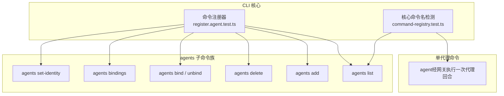
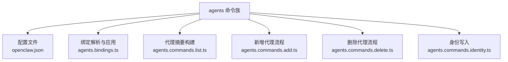
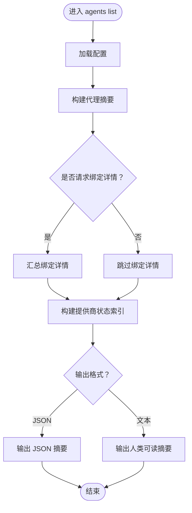
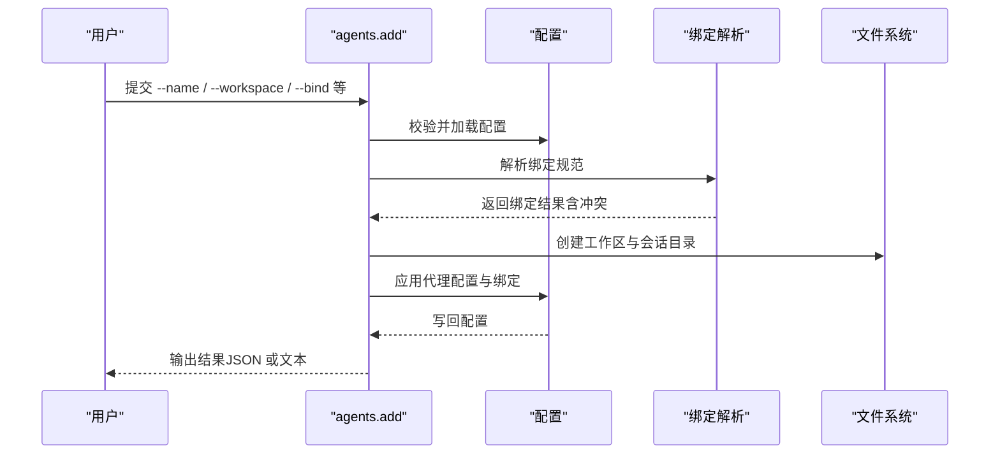
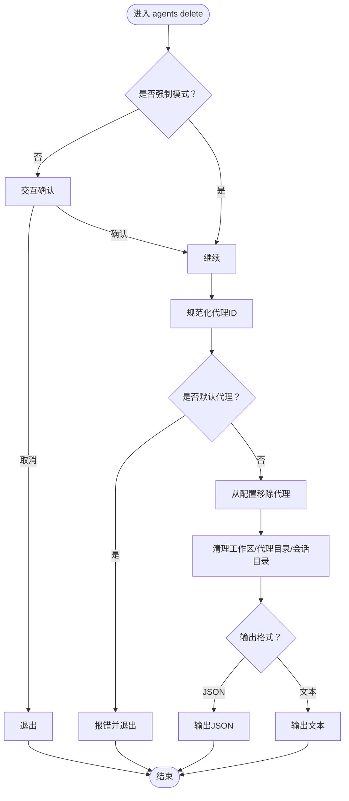
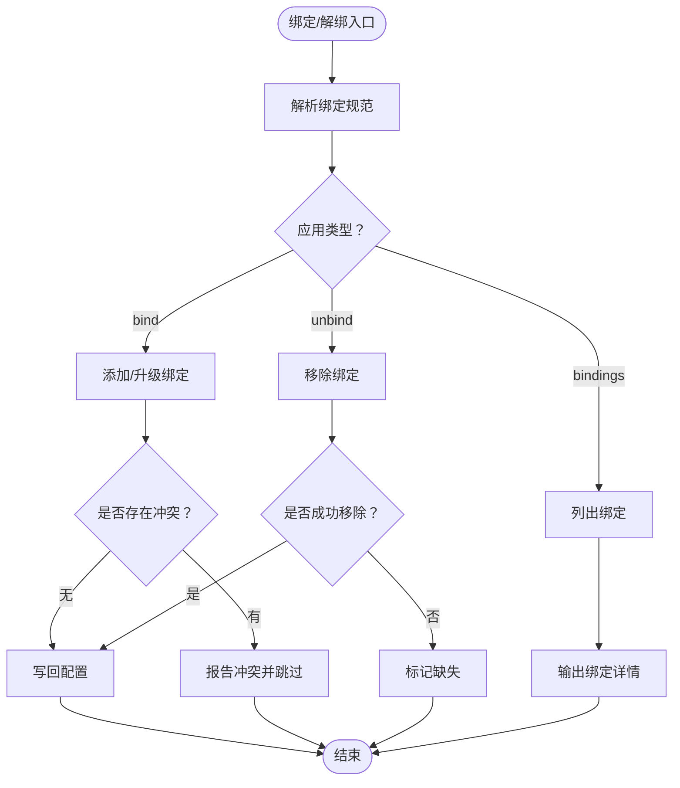
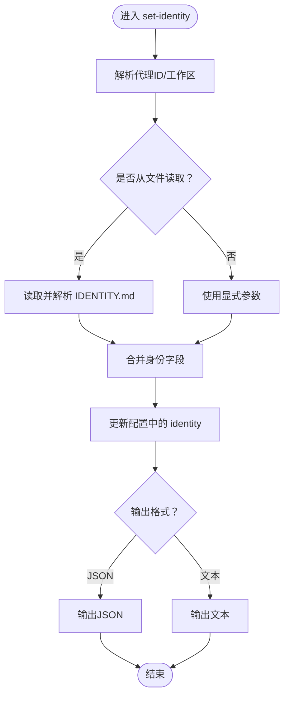
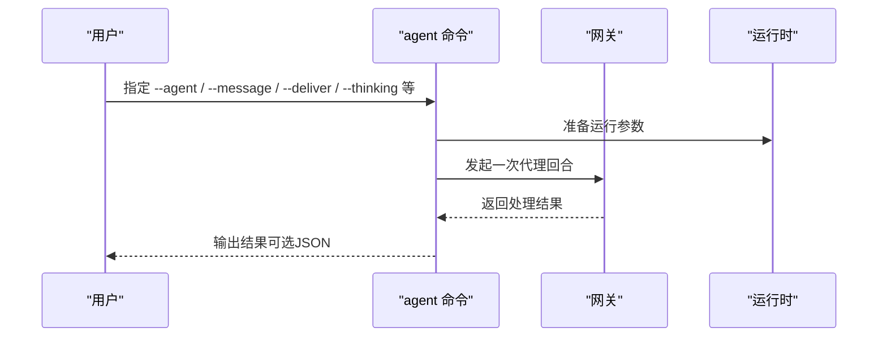
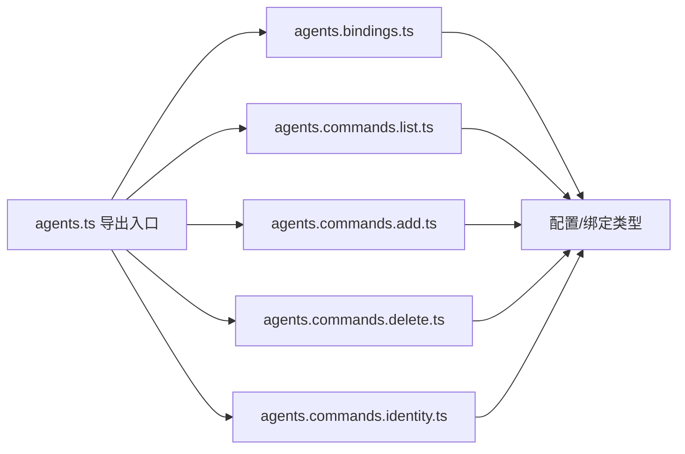

# 代理控制命令

## 目录
1. [简介](#简介)
2. [项目结构](#项目结构)
3. [核心组件](#核心组件)
4. [架构总览](#架构总览)
5. [详细组件分析](#详细组件分析)
6. [依赖关系分析](#依赖关系分析)
7. [性能与资源监控](#性能与资源监控)
8. [故障排除指南](#故障排除指南)
9. [结论](#结论)
10. [附录](#附录)

## 简介
本文件系统性梳理 OpenClaw 的代理控制命令，覆盖 agent 与 agents 命令组的完整能力：代理创建、删除、配置与管理；代理绑定/解绑与身份管理；会话控制、状态查询与历史记录查看；配置文件编辑与验证；性能监控与资源统计；代理间通信、协作与权限控制；自动化脚本与批量操作示例；以及故障排除与调试方法。内容以仓库内官方文档与源码实现为依据，确保准确可追溯。

## 项目结构
OpenClaw 的 CLI 命令由核心注册器统一挂载，其中 agent 与 agents 作为独立子命令存在。agents 子命令进一步细分为 list、add、delete、bindings、bind、unbind、set-identity 等子子命令，分别对应多代理管理的不同场景。

图示来源
- [src/cli/program/register.agent.test.ts](file://src/cli/program/register.agent.test.ts#L47-L74)
- [src/cli/program/command-registry.test.ts](file://src/cli/program/command-registry.test.ts#L52-L83)

章节来源
- [src/cli/program/register.agent.test.ts](file://src/cli/program/register.agent.test.ts#L47-L74)
- [src/cli/program/command-registry.test.ts](file://src/cli/program/command-registry.test.ts#L52-L83)

## 核心组件
- agents 列表与概览：列出所有代理的基本信息、工作区、代理目录、模型、路由规则与提供商状态摘要。
- agents 添加：交互式或非交互式创建新代理，支持自动复制默认代理认证资料、引导通道登录与绑定。
- agents 删除：安全删除指定代理及其工作区、代理目录与会话目录，支持强制模式与 JSON 输出。
- 绑定与路由：解析绑定规范，添加/升级/移除路由绑定，支持账户级作用域与通配降级。
- 身份管理：从 IDENTITY.md 或显式参数写入代理身份字段（名称、主题、表情、头像），支持工作区相对路径与 URL。
- 单代理执行：通过网关运行一次代理回合，支持本地嵌入模式与消息投递选项。

章节来源
- [docs/cli/agents.md](file://docs/cli/agents.md#L1-L124)
- [docs/cli/agent.md](file://docs/cli/agent.md#L1-L29)
- [src/commands/agents.commands.list.ts](file://src/commands/agents.commands.list.ts#L1-L136)
- [src/commands/agents.commands.add.ts](file://src/commands/agents.commands.add.ts#L1-L369)
- [src/commands/agents.commands.delete.ts](file://src/commands/agents.commands.delete.ts#L1-L102)
- [src/commands/agents.bindings.ts](file://src/commands/agents.bindings.ts#L1-L327)
- [src/commands/agents.commands.identity.ts](file://src/commands/agents.commands.identity.ts#L1-L234)
- [src/commands/agent-via-gateway.ts](file://src/commands/agent-via-gateway.ts)

## 架构总览
下图展示 agents 子命令族在配置与运行时之间的交互关系：命令读取并修改配置文件，解析绑定规则，生成路由映射，并在需要时引导工作区与会话目录准备。

图示来源
- [src/commands/agents.bindings.ts](file://src/commands/agents.bindings.ts#L75-L159)
- [src/commands/agents.commands.list.ts](file://src/commands/agents.commands.list.ts#L75-L136)
- [src/commands/agents.commands.add.ts](file://src/commands/agents.commands.add.ts#L51-L177)
- [src/commands/agents.commands.delete.ts](file://src/commands/agents.commands.delete.ts#L19-L102)
- [src/commands/agents.commands.identity.ts](file://src/commands/agents.commands.identity.ts#L68-L234)

## 详细组件分析

### agents list：代理列表与路由概览
- 功能要点
  - 支持 JSON 输出与人类可读格式。
  - 可选显示每个代理的路由规则详情与提供商状态摘要。
  - 默认代理若无显式规则，会标注“默认（无显式规则）”。
- 关键实现
  - 汇总代理条目，构建摘要行，按需附加路由与提供商信息。
  - 使用绑定解析工具汇总路由映射，用于快速定位代理与通道/账号/群组的对应关系。

图示来源
- [src/commands/agents.commands.list.ts](file://src/commands/agents.commands.list.ts#L75-L136)

章节来源
- [src/commands/agents.commands.list.ts](file://src/commands/agents.commands.list.ts#L1-L136)

### agents add：创建隔离代理（含工作区、认证与绑定）
- 功能要点
  - 非交互模式要求提供工作区路径与代理名称。
  - 自动规范化代理 ID，保留默认代理不可覆盖。
  - 可选择复制默认代理的认证资料到新代理。
  - 引导通道登录与绑定，支持批量绑定规范解析。
  - 写回配置并确保工作区与会话目录存在。
- 关键实现
  - 解析绑定规范，校验冲突，支持“同通道无账户绑定升级为账户级绑定”的行为。
  - 与工作区引导工具协作，按需跳过引导文件注入。

图示来源
- [src/commands/agents.commands.add.ts](file://src/commands/agents.commands.add.ts#L51-L177)
- [src/commands/agents.bindings.ts](file://src/commands/agents.bindings.ts#L288-L327)

章节来源
- [src/commands/agents.commands.add.ts](file://src/commands/agents.commands.add.ts#L1-L369)
- [src/commands/agents.bindings.ts](file://src/commands/agents.bindings.ts#L1-L327)

### agents delete：删除代理与关联资源
- 功能要点
  - 默认需要交互确认；非交互会话需显式 --force。
  - 不允许删除默认代理。
  - 安全清理工作区、代理目录与会话目录，支持 JSON 输出。
- 关键实现
  - 从配置中移除代理条目，同时清理绑定与允许列表。
  - 将工作区、代理目录与会话目录移动到回收站，避免误删。

图示来源
- [src/commands/agents.commands.delete.ts](file://src/commands/agents.commands.delete.ts#L19-L102)

章节来源
- [src/commands/agents.commands.delete.ts](file://src/commands/agents.commands.delete.ts#L1-L102)

### agents bind / unbind / bindings：绑定与路由管理
- 功能要点
  - 支持从绑定规范字符串解析绑定，如 channel[:account]。
  - 绑定升级：当同一通道无账户绑定被替换为带账户绑定时，原绑定会被就地升级而非重复添加。
  - 支持移除指定绑定或全部绑定。
  - 支持列出当前路由绑定与 JSON 输出。
- 关键实现
  - 匹配键由“匹配身份键 + 账户ID”构成，保证同通道不同账户的唯一性。
  - 插件可提供默认账户解析逻辑，必要时强制账户绑定。

图示来源
- [src/commands/agents.bindings.ts](file://src/commands/agents.bindings.ts#L75-L159)
- [src/commands/agents.bindings.ts](file://src/commands/agents.bindings.ts#L161-L227)
- [src/commands/agents.bindings.ts](file://src/commands/agents.bindings.ts#L288-L327)

章节来源
- [src/commands/agents.bindings.ts](file://src/commands/agents.bindings.ts#L1-L327)

### agents set-identity：代理身份管理
- 功能要点
  - 支持从 IDENTITY.md 文件或显式参数设置身份字段（名称、主题、表情、头像）。
  - 头像路径支持工作区相对路径、HTTP(S) URL 或数据 URI。
  - 可通过 --workspace 或 --agent 精确指定目标代理。
- 关键实现
  - 解析 IDENTITY.md 并合并显式参数，更新 agents.list 中的 identity 字段。
  - 若未找到代理条目且列表为空，会自动插入默认代理条目以保持一致性。

图示来源
- [src/commands/agents.commands.identity.ts](file://src/commands/agents.commands.identity.ts#L68-L234)

章节来源
- [src/commands/agents.commands.identity.ts](file://src/commands/agents.commands.identity.ts#L1-L234)

### agent：通过网关执行一次代理回合
- 功能要点
  - 支持本地嵌入模式与消息投递选项。
  - 可直接针对已配置代理执行回合。
  - 当触发模型配置再生时，SecretRef 管理的凭据将以非敏感占位形式持久化。
- 关键实现
  - 通过网关执行代理回合，支持思考层级与回复渠道等参数。

图示来源
- [docs/cli/agent.md](file://docs/cli/agent.md#L1-L29)
- [src/commands/agent-via-gateway.ts](file://src/commands/agent-via-gateway.ts)

章节来源
- [docs/cli/agent.md](file://docs/cli/agent.md#L1-L29)
- [src/commands/agent-via-gateway.ts](file://src/commands/agent-via-gateway.ts)

## 依赖关系分析
- agents 子命令族依赖配置读写、绑定解析、工作区与会话目录准备、提供商状态索引等模块。
- 绑定解析模块负责去重、升级与冲突检测，确保路由规则确定性与最具体优先。
- 多代理概念文档提供了路由规则与账户作用域的行为约定，是命令实现的重要参考。

图示来源
- [src/commands/agents.ts](file://src/commands/agents.ts#L1-L7)
- [src/commands/agents.bindings.ts](file://src/commands/agents.bindings.ts#L1-L327)
- [src/commands/agents.commands.list.ts](file://src/commands/agents.commands.list.ts#L1-L136)
- [src/commands/agents.commands.add.ts](file://src/commands/agents.commands.add.ts#L1-L369)
- [src/commands/agents.commands.delete.ts](file://src/commands/agents.commands.delete.ts#L1-L102)
- [src/commands/agents.commands.identity.ts](file://src/commands/agents.commands.identity.ts#L1-L234)

章节来源
- [src/commands/agents.ts](file://src/commands/agents.ts#L1-L7)
- [docs/concepts/multi-agent.md](file://docs/concepts/multi-agent.md#L172-L193)

## 性能与资源监控
- 会话与历史记录
  - 会话存储位于各代理的会话目录，可通过会话工具列出、查看与发送。
  - 历史记录查看建议结合会话工具与会话状态命令进行。
- 资源使用统计
  - 仓库未提供专用的“代理性能监控/资源使用统计”命令；建议通过系统级监控工具与日志采集配合使用。
- 模型与凭据
  - 模型配置再生时，SecretRef 管理的凭据以非敏感占位形式保存，避免明文泄露风险。

章节来源
- [docs/concepts/multi-agent.md](file://docs/concepts/multi-agent.md#L10-L28)
- [docs/cli/agent.md](file://docs/cli/agent.md#L26-L29)

## 故障排除指南
- 多代理安全与会话隔离
  - 多代理运行时应确保每个代理拥有独立会话，避免跨代理状态交叉。
  - 会话文件位于各代理的会话目录，建议通过会话工具进行查看与清理。
- 配置与凭据
  - 当凭据或模型配置变更导致配置再生时，注意 SecretRef 管理的凭据不会以明文形式保存。
- 常见问题定位
  - 使用诊断命令检查网关健康与通道状态，结合日志工具定位问题。
  - 对于 macOS 平台，建议通过应用重启与日志采集工具进行问题复现与分析。

章节来源
- [docs/concepts/multi-agent.md](file://docs/concepts/multi-agent.md#L225-L230)
- [docs/cli/agent.md](file://docs/cli/agent.md#L26-L29)

## 结论
agents 命令族提供了完整的多代理生命周期管理能力：从创建、配置、绑定到删除，再到身份与路由管理，均具备明确的边界与行为约定。结合 agent 命令与会话工具，用户可以高效完成代理的日常运维与自动化脚本集成。对于性能监控与资源统计，建议结合系统级工具与日志采集进行综合评估。

## 附录

### 常用命令速查
- 列出代理：openclaw agents list [--bindings] [--json]
- 新增代理：openclaw agents add &lt;name&gt; [--workspace &lt;dir&gt;] [--bind &lt;channel[:account]> ...]
- 删除代理：openclaw agents delete &lt;id&gt; [--force] [--json]
- 查看绑定：openclaw agents bindings [--agent &lt;id&gt;] [--json]
- 添加绑定：openclaw agents bind --agent &lt;id&gt; --bind &lt;channel[:account]> ...
- 移除绑定：openclaw agents unbind --agent &lt;id&gt; --bind &lt;channel[:account]> ... | --all
- 设置身份：openclaw agents set-identity --agent &lt;id&gt; [--name|--emoji|--theme|--avatar] | [--from-identity --workspace &lt;dir&gt;]

章节来源
- [docs/cli/agents.md](file://docs/cli/agents.md#L17-L124)
- [docs/cli/agent.md](file://docs/cli/agent.md#L17-L29)