# 实用工具命令

## 目录
1. [简介](#简介)
2. [项目结构](#项目结构)
3. [核心组件](#核心组件)
4. [架构总览](#架构总览)
5. [详细组件分析](#详细组件分析)
6. [依赖关系分析](#依赖关系分析)
7. [性能考量](#性能考量)
8. [故障排查指南](#故障排查指南)
9. [结论](#结论)
10. [附录](#附录)

## 简介
本文件面向OpenClaw实用工具命令，系统化梳理以下CLI与相关组件：browser-cli（浏览器管理）、sandbox-cli（沙箱管理）、tui-cli（文本界面）、docs-cli（文档生成）、pairing-cli（配对管理）、qr-cli（二维码生成与扫描）、exec-approvals-cli（执行审批）与security-cli（安全配置）。文档以“从仓库中实际存在的源码”为依据，通过架构图、序列图与流程图展示命令如何组织、调用与协作，同时给出使用示例与最佳实践建议。

## 项目结构
OpenClaw在src/cli目录下集中定义各类命令入口与动作注册，在src/commands与src/agents等子模块中实现具体能力；TUI与Web组件分别位于src/tui与src/web；安全与沙箱策略由src/infra与src/agents/sandbox等模块提供。

```mermaid
graph TB
subgraph "CLI 命令"
BC["browser-cli-actions-input.ts"]
SC["sandbox-cli.ts"]
TC["tui-cli.ts"]
DCli["docs-cli.ts"]
PC["pairing-cli.ts"]
QC["qr-cli.ts"]
EAC["exec-approvals-cli.ts"]
SEC["security-cli.ts"]
end
subgraph "命令实现"
CMD_DOCS["commands/docs.ts"]
end
subgraph "浏览器与沙箱"
SB["agents/sandbox/browser.ts"]
BR["agents/sandbox/browser-bridges.ts"]
SSEC["agents/sandbox/validate-sandbox-security.ts"]
SMP["agents/sandbox-media-paths.ts"]
end
subgraph "TUI"
TUI_CMD["tui/tui-command-handlers.ts"]
TUI_EVT["tui/tui-event-handlers.ts"]
TUI_ACT["tui/tui-session-actions.ts"]
end
subgraph "Web 与二维码"
QR_LOGIN["web/login-qr.ts"]
QR_IMG["web/qr-image.ts"]
end
subgraph "安全与审批"
SEC_HOST["infra/host-env-security.ts"]
EA_CFG["infra/exec-approvals-config.ts"]
EA_ALLOW["infra/exec-approvals-allowlist.ts"]
end
subgraph "配对"
CH_PAIR["channels/plugins/pairing.ts"]
DEV_PAIR["infra/device-pairing.ts"]
NODE_PAIR["infra/node-pairing.ts"]
end
BC --> BR
BC --> SB
SC --> SSEC
SC --> SMP
TC --> TUI_CMD
TC --> TUI_EVT
TC --> TUI_ACT
DCli --> CMD_DOCS
QC --> QR_LOGIN
QC --> QR_IMG
EAC --> EA_CFG
EAC --> EA_ALLOW
SEC --> SEC_HOST
PC --> CH_PAIR
PC --> DEV_PAIR
PC --> NODE_PAIR
```

图表来源
- [src/cli/browser-cli-actions-input.ts](file://src/cli/browser-cli-actions-input.ts#L1-L2)
- [src/cli/sandbox-cli.ts](file://src/cli/sandbox-cli.ts)
- [src/cli/tui-cli.ts](file://src/cli/tui-cli.ts)
- [src/cli/docs-cli.ts](file://src/cli/docs-cli.ts)
- [src/cli/pairing-cli.ts](file://src/cli/pairing-cli.ts)
- [src/cli/qr-cli.ts](file://src/cli/qr-cli.ts)
- [src/cli/exec-approvals-cli.ts](file://src/cli/exec-approvals-cli.ts)
- [src/cli/security-cli.ts](file://src/cli/security-cli.ts)
- [src/commands/docs.ts](file://src/commands/docs.ts)
- [src/agents/sandbox/browser.ts](file://src/agents/sandbox/browser.ts)
- [src/agents/sandbox/browser-bridges.ts](file://src/agents/sandbox/browser-bridges.ts)
- [src/agents/sandbox/validate-sandbox-security.ts](file://src/agents/sandbox/validate-sandbox-security.ts)
- [src/agents/sandbox-media-paths.ts](file://src/agents/sandbox-media-paths.ts)
- [src/tui/tui-command-handlers.ts](file://src/tui/tui-command-handlers.ts)
- [src/tui/tui-event-handlers.ts](file://src/tui/tui-event-handlers.ts)
- [src/tui/tui-session-actions.ts](file://src/tui/tui-session-actions.ts)
- [src/web/login-qr.ts](file://src/web/login-qr.ts)
- [src/web/qr-image.ts](file://src/web/qr-image.ts)
- [src/infra/exec-approvals-config.ts](file://src/infra/exec-approvals-config.ts)
- [src/infra/exec-approvals-allowlist.ts](file://src/infra/exec-approvals-allowlist.ts)
- [src/infra/host-env-security.ts](file://src/infra/host-env-security.ts)
- [src/channels/plugins/pairing.ts](file://src/channels/plugins/pairing.ts)
- [src/infra/device-pairing.ts](file://src/infra/device-pairing.ts)
- [src/infra/node-pairing.ts](file://src/infra/node-pairing.ts)

章节来源
- [src/cli/browser-cli-actions-input.ts](file://src/cli/browser-cli-actions-input.ts#L1-L2)
- [src/cli/sandbox-cli.ts](file://src/cli/sandbox-cli.ts)
- [src/cli/tui-cli.ts](file://src/cli/tui-cli.ts)
- [src/cli/docs-cli.ts](file://src/cli/docs-cli.ts)
- [src/cli/pairing-cli.ts](file://src/cli/pairing-cli.ts)
- [src/cli/qr-cli.ts](file://src/cli/qr-cli.ts)
- [src/cli/exec-approvals-cli.ts](file://src/cli/exec-approvals-cli.ts)
- [src/cli/security-cli.ts](file://src/cli/security-cli.ts)
- [src/commands/docs.ts](file://src/commands/docs.ts)
- [src/agents/sandbox/browser.ts](file://src/agents/sandbox/browser.ts)
- [src/agents/sandbox/browser-bridges.ts](file://src/agents/sandbox/browser-bridges.ts)
- [src/agents/sandbox/validate-sandbox-security.ts](file://src/agents/sandbox/validate-sandbox-security.ts)
- [src/agents/sandbox-media-paths.ts](file://src/agents/sandbox-media-paths.ts)
- [src/tui/tui-command-handlers.ts](file://src/tui/tui-command-handlers.ts)
- [src/tui/tui-event-handlers.ts](file://src/tui/tui-event-handlers.ts)
- [src/tui/tui-session-actions.ts](file://src/tui/tui-session-actions.ts)
- [src/web/login-qr.ts](file://src/web/login-qr.ts)
- [src/web/qr-image.ts](file://src/web/qr-image.ts)
- [src/infra/exec-approvals-config.ts](file://src/infra/exec-approvals-config.ts)
- [src/infra/exec-approvals-allowlist.ts](file://src/infra/exec-approvals-allowlist.ts)
- [src/infra/host-env-security.ts](file://src/infra/host-env-security.ts)
- [src/channels/plugins/pairing.ts](file://src/channels/plugins/pairing.ts)
- [src/infra/device-pairing.ts](file://src/infra/device-pairing.ts)
- [src/infra/node-pairing.ts](file://src/infra/node-pairing.ts)

## 核心组件
- 浏览器管理命令（browser-cli）
  - 通过动作输入注册机制组织浏览器实例控制、页面操作与调试功能。
  - 关键实现：浏览器桥接与沙箱浏览器实例管理。
- 沙箱管理命令（sandbox-cli）
  - 提供沙箱创建、配置与隔离校验，确保媒体路径与安全策略正确应用。
- 文本界面命令（tui-cli）
  - 驱动TUI交互，处理命令、事件与会话动作。
- 文档生成命令（docs-cli）
  - 调用文档生成命令实现，输出或导出文档内容。
- 配对管理命令（pairing-cli）
  - 支持设备与节点配对，配合通道插件与基础设施模块完成配对流程。
- 二维码命令（qr-cli）
  - 生成登录二维码与图像，支持扫码与仪表盘集成。
- 执行审批命令（exec-approvals-cli）
  - 管理执行审批配置与白名单，保障受控执行。
- 安全配置命令（security-cli）
  - 应用主机环境安全策略，统一安全基线。

章节来源
- [src/cli/browser-cli-actions-input.ts](file://src/cli/browser-cli-actions-input.ts#L1-L2)
- [src/cli/sandbox-cli.ts](file://src/cli/sandbox-cli.ts)
- [src/cli/tui-cli.ts](file://src/cli/tui-cli.ts)
- [src/cli/docs-cli.ts](file://src/cli/docs-cli.ts)
- [src/cli/pairing-cli.ts](file://src/cli/pairing-cli.ts)
- [src/cli/qr-cli.ts](file://src/cli/qr-cli.ts)
- [src/cli/exec-approvals-cli.ts](file://src/cli/exec-approvals-cli.ts)
- [src/cli/security-cli.ts](file://src/cli/security-cli.ts)
- [src/commands/docs.ts](file://src/commands/docs.ts)

## 架构总览
下图展示各实用工具命令与其核心实现模块之间的关系与调用链：

```mermaid
graph TB
CLI_BC["browser-cli<br/>浏览器管理"]
CLI_SC["sandbox-cli<br/>沙箱管理"]
CLI_TC["tui-cli<br/>文本界面"]
CLI_DCli["docs-cli<br/>文档生成"]
CLI_PC["pairing-cli<br/>配对管理"]
CLI_QC["qr-cli<br/>二维码"]
CLI_EAC["exec-approvals-cli<br/>执行审批"]
CLI_SEC["security-cli<br/>安全配置"]
MOD_BR["agents/sandbox/browser-bridges.ts"]
MOD_SB["agents/sandbox/browser.ts"]
MOD_SSEC["agents/sandbox/validate-sandbox-security.ts"]
MOD_SMP["agents/sandbox-media-paths.ts"]
MOD_TUI_CMD["tui/tui-command-handlers.ts"]
MOD_TUI_EVT["tui/tui-event-handlers.ts"]
MOD_TUI_ACT["tui/tui-session-actions.ts"]
MOD_DOCS["commands/docs.ts"]
MOD_QR_LOGIN["web/login-qr.ts"]
MOD_QR_IMG["web/qr-image.ts"]
MOD_EA_CFG["infra/exec-approvals-config.ts"]
MOD_EA_ALLOW["infra/exec-approvals-allowlist.ts"]
MOD_SEC_HOST["infra/host-env-security.ts"]
MOD_CH_PAIR["channels/plugins/pairing.ts"]
MOD_DEV_PAIR["infra/device-pairing.ts"]
MOD_NODE_PAIR["infra/node-pairing.ts"]
CLI_BC --> MOD_BR
CLI_BC --> MOD_SB
CLI_SC --> MOD_SSEC
CLI_SC --> MOD_SMP
CLI_TC --> MOD_TUI_CMD
CLI_TC --> MOD_TUI_EVT
CLI_TC --> MOD_TUI_ACT
CLI_DCli --> MOD_DOCS
CLI_QC --> MOD_QR_LOGIN
CLI_QC --> MOD_QR_IMG
CLI_EAC --> MOD_EA_CFG
CLI_EAC --> MOD_EA_ALLOW
CLI_SEC --> MOD_SEC_HOST
CLI_PC --> MOD_CH_PAIR
CLI_PC --> MOD_DEV_PAIR
CLI_PC --> MOD_NODE_PAIR
```

图表来源
- [src/cli/browser-cli-actions-input.ts](file://src/cli/browser-cli-actions-input.ts#L1-L2)
- [src/cli/sandbox-cli.ts](file://src/cli/sandbox-cli.ts)
- [src/cli/tui-cli.ts](file://src/cli/tui-cli.ts)
- [src/cli/docs-cli.ts](file://src/cli/docs-cli.ts)
- [src/cli/pairing-cli.ts](file://src/cli/pairing-cli.ts)
- [src/cli/qr-cli.ts](file://src/cli/qr-cli.ts)
- [src/cli/exec-approvals-cli.ts](file://src/cli/exec-approvals-cli.ts)
- [src/cli/security-cli.ts](file://src/cli/security-cli.ts)
- [src/agents/sandbox/browser-bridges.ts](file://src/agents/sandbox/browser-bridges.ts)
- [src/agents/sandbox/browser.ts](file://src/agents/sandbox/browser.ts)
- [src/agents/sandbox/validate-sandbox-security.ts](file://src/agents/sandbox/validate-sandbox-security.ts)
- [src/agents/sandbox-media-paths.ts](file://src/agents/sandbox-media-paths.ts)
- [src/tui/tui-command-handlers.ts](file://src/tui/tui-command-handlers.ts)
- [src/tui/tui-event-handlers.ts](file://src/tui/tui-event-handlers.ts)
- [src/tui/tui-session-actions.ts](file://src/tui/tui-session-actions.ts)
- [src/commands/docs.ts](file://src/commands/docs.ts)
- [src/web/login-qr.ts](file://src/web/login-qr.ts)
- [src/web/qr-image.ts](file://src/web/qr-image.ts)
- [src/infra/exec-approvals-config.ts](file://src/infra/exec-approvals-config.ts)
- [src/infra/exec-approvals-allowlist.ts](file://src/infra/exec-approvals-allowlist.ts)
- [src/infra/host-env-security.ts](file://src/infra/host-env-security.ts)
- [src/channels/plugins/pairing.ts](file://src/channels/plugins/pairing.ts)
- [src/infra/device-pairing.ts](file://src/infra/device-pairing.ts)
- [src/infra/node-pairing.ts](file://src/infra/node-pairing.ts)

## 详细组件分析

### 浏览器管理命令（browser-cli）
- 功能概述
  - 通过动作输入注册机制组织浏览器实例控制、页面操作与调试功能。
  - 与沙箱浏览器与桥接模块协同，提供可复用的浏览器生命周期与CDP交互能力。
- 关键实现
  - 动作输入注册：将浏览器相关命令注册到CLI框架。
  - 沙箱浏览器：封装浏览器实例创建、连接与关闭。
  - 浏览器桥接：提供与外部浏览器进程的通信接口。
- 使用示例（步骤级）
  - 启动浏览器实例：通过命令入口触发实例创建与准备。
  - 页面操作：导航、点击、输入、截图等。
  - 调试：启用日志、断点、网络拦截等。
- 最佳实践
  - 在沙箱环境中运行浏览器，避免污染宿主系统。
  - 明确超时与重试策略，提升稳定性。
  - 使用桥接模块进行跨进程通信，避免直接操作进程细节。

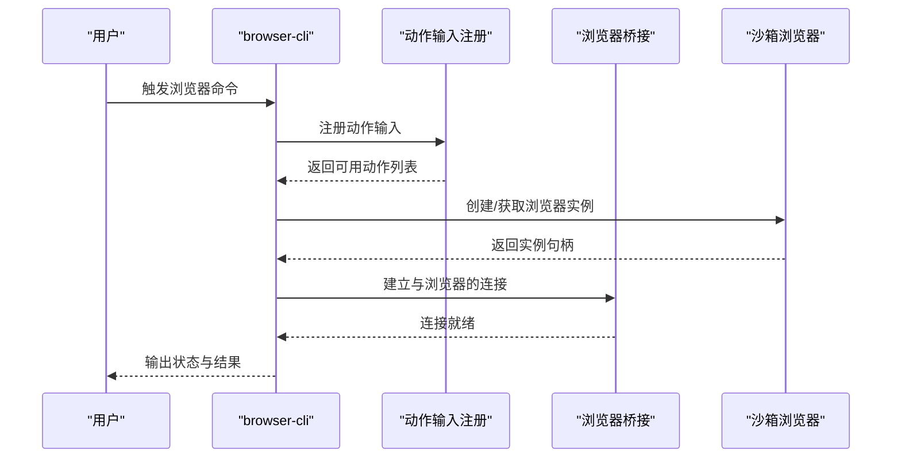

图表来源
- [src/cli/browser-cli-actions-input.ts](file://src/cli/browser-cli-actions-input.ts#L1-L2)
- [src/agents/sandbox/browser-bridges.ts](file://src/agents/sandbox/browser-bridges.ts)
- [src/agents/sandbox/browser.ts](file://src/agents/sandbox/browser.ts)

章节来源
- [src/cli/browser-cli-actions-input.ts](file://src/cli/browser-cli-actions-input.ts#L1-L2)
- [src/agents/sandbox/browser.ts](file://src/agents/sandbox/browser.ts)
- [src/agents/sandbox/browser-bridges.ts](file://src/agents/sandbox/browser-bridges.ts)

### 沙箱管理命令（sandbox-cli）
- 功能概述
  - 提供沙箱创建、配置与隔离校验，确保媒体路径与安全策略正确应用。
- 关键实现
  - 安全校验：验证沙箱安全策略是否符合预期。
  - 媒体路径：管理沙箱内媒体访问路径，限制I/O范围。
- 使用示例（步骤级）
  - 创建沙箱：指定参数（如资源限制、网络策略、挂载路径）。
  - 应用安全策略：加载并校验主机环境安全策略。
  - 验证媒体路径：确认媒体读写权限与隔离边界。
- 最佳实践
  - 优先使用最小权限原则，严格限制文件系统与网络访问。
  - 对媒体路径进行白名单管理，避免越权访问。
  - 在CI/本地开发与生产环境采用不同安全等级。

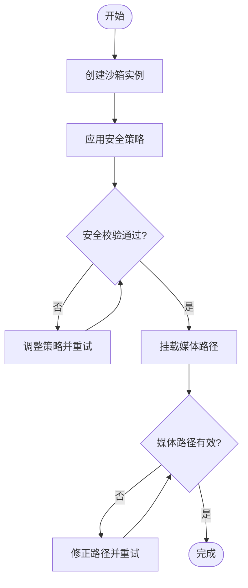

图表来源
- [src/cli/sandbox-cli.ts](file://src/cli/sandbox-cli.ts)
- [src/agents/sandbox/validate-sandbox-security.ts](file://src/agents/sandbox/validate-sandbox-security.ts)
- [src/agents/sandbox-media-paths.ts](file://src/agents/sandbox-media-paths.ts)

章节来源
- [src/cli/sandbox-cli.ts](file://src/cli/sandbox-cli.ts)
- [src/agents/sandbox/validate-sandbox-security.ts](file://src/agents/sandbox/validate-sandbox-security.ts)
- [src/agents/sandbox-media-paths.ts](file://src/agents/sandbox-media-paths.ts)

### 文本界面命令（tui-cli）
- 功能概述
  - 驱动TUI交互，处理命令、事件与会话动作，提供交互式体验。
- 关键实现
  - 命令处理器：解析与执行用户输入的命令。
  - 事件处理器：响应键盘/鼠标事件，更新界面状态。
  - 会话动作：维护会话上下文与历史记录。
- 使用示例（步骤级）
  - 启动TUI：进入交互模式。
  - 输入命令：执行任务或切换视图。
  - 处理事件：滚动、选择、确认等。
- 最佳实践
  - 将复杂逻辑拆分为命令与事件处理器，保持职责单一。
  - 使用会话动作模块持久化状态，提升用户体验。

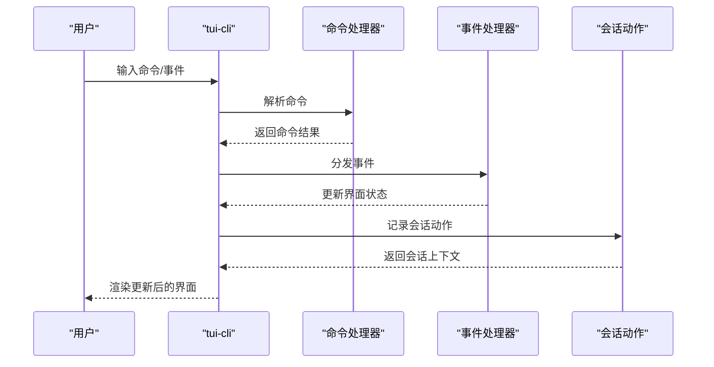

图表来源
- [src/cli/tui-cli.ts](file://src/cli/tui-cli.ts)
- [src/tui/tui-command-handlers.ts](file://src/tui/tui-command-handlers.ts)
- [src/tui/tui-event-handlers.ts](file://src/tui/tui-event-handlers.ts)
- [src/tui/tui-session-actions.ts](file://src/tui/tui-session-actions.ts)

章节来源
- [src/cli/tui-cli.ts](file://src/cli/tui-cli.ts)
- [src/tui/tui-command-handlers.ts](file://src/tui/tui-command-handlers.ts)
- [src/tui/tui-event-handlers.ts](file://src/tui/tui-event-handlers.ts)
- [src/tui/tui-session-actions.ts](file://src/tui/tui-session-actions.ts)

### 文档生成命令（docs-cli）
- 功能概述
  - 调用文档生成命令实现，输出或导出文档内容。
- 关键实现
  - 文档生成命令：负责收集、格式化与输出文档。
- 使用示例（步骤级）
  - 生成文档：指定输出目录与格式。
  - 导出清单：生成索引或链接清单。
- 最佳实践
  - 统一文档模板与元数据，便于维护与检索。
  - 对大文档分块生成，避免内存压力。

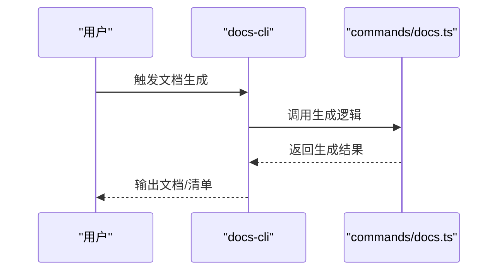

图表来源
- [src/cli/docs-cli.ts](file://src/cli/docs-cli.ts)
- [src/commands/docs.ts](file://src/commands/docs.ts)

章节来源
- [src/cli/docs-cli.ts](file://src/cli/docs-cli.ts)
- [src/commands/docs.ts](file://src/commands/docs.ts)

### 配对管理命令（pairing-cli）
- 功能概述
  - 支持设备与节点配对，配合通道插件与基础设施模块完成配对流程。
- 关键实现
  - 通道插件：提供配对消息与协议支持。
  - 设备配对：管理设备侧配对状态与令牌。
  - 节点配对：管理节点侧配对状态与信任关系。
- 使用示例（步骤级）
  - 初始化配对：生成配对请求或接收邀请。
  - 认证与授权：验证身份并建立信任。
  - 完成配对：更新配对状态并同步配置。
- 最佳实践
  - 使用一次性令牌与短有效期，降低泄露风险。
  - 对配对状态进行审计与清理，避免僵尸状态。

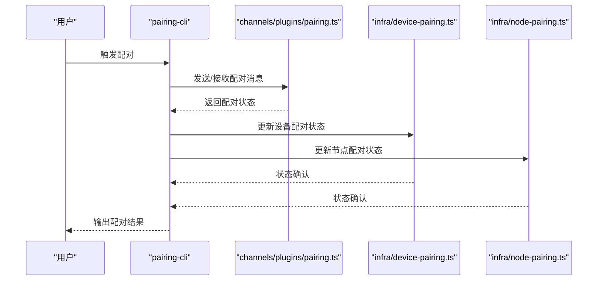

图表来源
- [src/cli/pairing-cli.ts](file://src/cli/pairing-cli.ts)
- [src/channels/plugins/pairing.ts](file://src/channels/plugins/pairing.ts)
- [src/infra/device-pairing.ts](file://src/infra/device-pairing.ts)
- [src/infra/node-pairing.ts](file://src/infra/node-pairing.ts)

章节来源
- [src/cli/pairing-cli.ts](file://src/cli/pairing-cli.ts)
- [src/channels/plugins/pairing.ts](file://src/channels/plugins/pairing.ts)
- [src/infra/device-pairing.ts](file://src/infra/device-pairing.ts)
- [src/infra/node-pairing.ts](file://src/infra/node-pairing.ts)

### 二维码命令（qr-cli）
- 功能概述
  - 生成登录二维码与图像，支持扫码与仪表盘集成。
- 关键实现
  - 登录二维码：生成用于认证的二维码数据。
  - 二维码图像：渲染与显示二维码。
- 使用示例（步骤级）
  - 生成二维码：触发二维码生成流程。
  - 展示与扫描：在终端或网页中展示二维码，等待扫描。
  - 完成认证：根据扫描结果更新认证状态。
- 最佳实践
  - 设置超时与刷新策略，避免过期。
  - 提供多种展示方式（终端/网页），提升可用性。

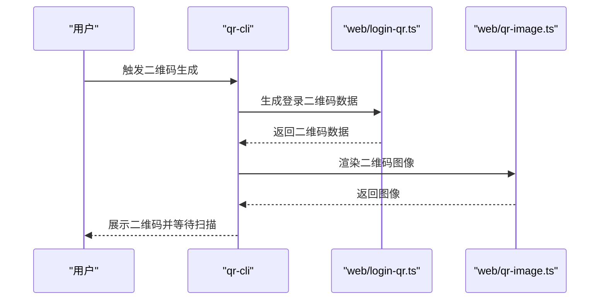

图表来源
- [src/cli/qr-cli.ts](file://src/cli/qr-cli.ts)
- [src/web/login-qr.ts](file://src/web/login-qr.ts)
- [src/web/qr-image.ts](file://src/web/qr-image.ts)

章节来源
- [src/cli/qr-cli.ts](file://src/cli/qr-cli.ts)
- [src/web/login-qr.ts](file://src/web/login-qr.ts)
- [src/web/qr-image.ts](file://src/web/qr-image.ts)

### 执行审批命令（exec-approvals-cli）
- 功能概述
  - 管理执行审批配置与白名单，保障受控执行。
- 关键实现
  - 执行审批配置：定义审批规则与策略。
  - 白名单管理：维护允许执行的程序或脚本集合。
- 使用示例（步骤级）
  - 查看配置：列出当前审批策略与白名单。
  - 更新配置：添加/删除审批项或白名单条目。
  - 生效与审计：使变更生效并记录审计日志。
- 最佳实践
  - 采用最小权限原则，仅允许必要程序执行。
  - 定期审查白名单，移除不再需要的条目。

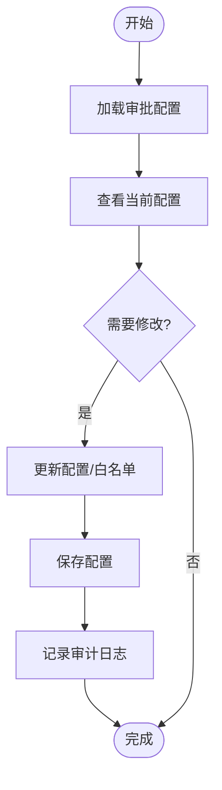

图表来源
- [src/cli/exec-approvals-cli.ts](file://src/cli/exec-approvals-cli.ts)
- [src/infra/exec-approvals-config.ts](file://src/infra/exec-approvals-config.ts)
- [src/infra/exec-approvals-allowlist.ts](file://src/infra/exec-approvals-allowlist.ts)

章节来源
- [src/cli/exec-approvals-cli.ts](file://src/cli/exec-approvals-cli.ts)
- [src/infra/exec-approvals-config.ts](file://src/infra/exec-approvals-config.ts)
- [src/infra/exec-approvals-allowlist.ts](file://src/infra/exec-approvals-allowlist.ts)

### 安全配置命令（security-cli）
- 功能概述
  - 应用主机环境安全策略，统一安全基线。
- 关键实现
  - 主机环境安全策略：定义与应用安全策略。
- 使用示例（步骤级）
  - 应用策略：加载并应用安全策略。
  - 校验与报告：检查策略执行情况并输出报告。
- 最佳实践
  - 将安全策略与CI/CD集成，确保每次部署都满足基线要求。
  - 对关键服务启用更严格的安全策略。

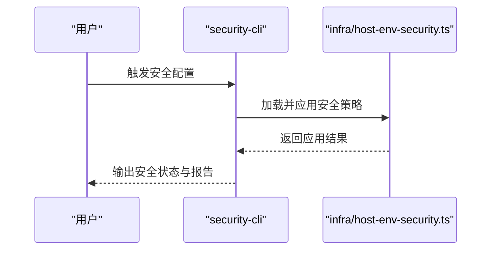

图表来源
- [src/cli/security-cli.ts](file://src/cli/security-cli.ts)
- [src/infra/host-env-security.ts](file://src/infra/host-env-security.ts)

章节来源
- [src/cli/security-cli.ts](file://src/cli/security-cli.ts)
- [src/infra/host-env-security.ts](file://src/infra/host-env-security.ts)

## 依赖关系分析
- 组件耦合
  - browser-cli与agents/sandbox模块紧密耦合，依赖桥接与浏览器实例。
  - sandbox-cli与agents/sandbox与agents/sandbox-media-paths存在直接依赖。
  - tui-cli与tui系列模块形成内聚的交互层。
  - docs-cli依赖commands/docs实现。
  - pairing-cli依赖channels/plugins/pairing与infra下的设备/节点配对模块。
  - qr-cli依赖web模块中的二维码生成与图像渲染。
  - exec-approvals-cli依赖exec-approvals相关配置与白名单模块。
  - security-cli依赖host环境安全策略模块。
- 外部依赖与集成点
  - CLI命令通过模块导入与注册机制与具体实现解耦。
  - 浏览器与沙箱能力通过桥接与实例管理抽象对外提供。

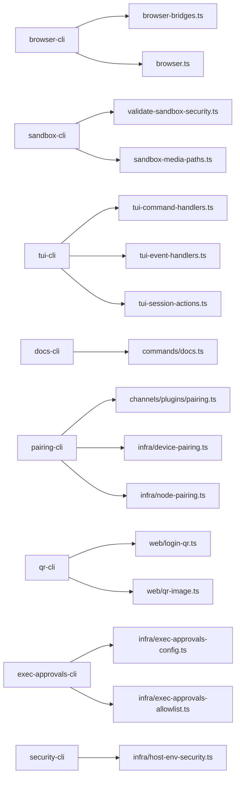

图表来源
- [src/cli/browser-cli-actions-input.ts](file://src/cli/browser-cli-actions-input.ts#L1-L2)
- [src/agents/sandbox/browser-bridges.ts](file://src/agents/sandbox/browser-bridges.ts)
- [src/agents/sandbox/browser.ts](file://src/agents/sandbox/browser.ts)
- [src/cli/sandbox-cli.ts](file://src/cli/sandbox-cli.ts)
- [src/agents/sandbox/validate-sandbox-security.ts](file://src/agents/sandbox/validate-sandbox-security.ts)
- [src/agents/sandbox-media-paths.ts](file://src/agents/sandbox-media-paths.ts)
- [src/cli/tui-cli.ts](file://src/cli/tui-cli.ts)
- [src/tui/tui-command-handlers.ts](file://src/tui/tui-command-handlers.ts)
- [src/tui/tui-event-handlers.ts](file://src/tui/tui-event-handlers.ts)
- [src/tui/tui-session-actions.ts](file://src/tui/tui-session-actions.ts)
- [src/cli/docs-cli.ts](file://src/cli/docs-cli.ts)
- [src/commands/docs.ts](file://src/commands/docs.ts)
- [src/cli/pairing-cli.ts](file://src/cli/pairing-cli.ts)
- [src/channels/plugins/pairing.ts](file://src/channels/plugins/pairing.ts)
- [src/infra/device-pairing.ts](file://src/infra/device-pairing.ts)
- [src/infra/node-pairing.ts](file://src/infra/node-pairing.ts)
- [src/cli/qr-cli.ts](file://src/cli/qr-cli.ts)
- [src/web/login-qr.ts](file://src/web/login-qr.ts)
- [src/web/qr-image.ts](file://src/web/qr-image.ts)
- [src/cli/exec-approvals-cli.ts](file://src/cli/exec-approvals-cli.ts)
- [src/infra/exec-approvals-config.ts](file://src/infra/exec-approvals-config.ts)
- [src/infra/exec-approvals-allowlist.ts](file://src/infra/exec-approvals-allowlist.ts)
- [src/cli/security-cli.ts](file://src/cli/security-cli.ts)
- [src/infra/host-env-security.ts](file://src/infra/host-env-security.ts)

章节来源
- [src/cli/browser-cli-actions-input.ts](file://src/cli/browser-cli-actions-input.ts#L1-L2)
- [src/agents/sandbox/browser-bridges.ts](file://src/agents/sandbox/browser-bridges.ts)
- [src/agents/sandbox/browser.ts](file://src/agents/sandbox/browser.ts)
- [src/cli/sandbox-cli.ts](file://src/cli/sandbox-cli.ts)
- [src/agents/sandbox/validate-sandbox-security.ts](file://src/agents/sandbox/validate-sandbox-security.ts)
- [src/agents/sandbox-media-paths.ts](file://src/agents/sandbox-media-paths.ts)
- [src/cli/tui-cli.ts](file://src/cli/tui-cli.ts)
- [src/tui/tui-command-handlers.ts](file://src/tui/tui-command-handlers.ts)
- [src/tui/tui-event-handlers.ts](file://src/tui/tui-event-handlers.ts)
- [src/tui/tui-session-actions.ts](file://src/tui/tui-session-actions.ts)
- [src/cli/docs-cli.ts](file://src/cli/docs-cli.ts)
- [src/commands/docs.ts](file://src/commands/docs.ts)
- [src/cli/pairing-cli.ts](file://src/cli/pairing-cli.ts)
- [src/channels/plugins/pairing.ts](file://src/channels/plugins/pairing.ts)
- [src/infra/device-pairing.ts](file://src/infra/device-pairing.ts)
- [src/infra/node-pairing.ts](file://src/infra/node-pairing.ts)
- [src/cli/qr-cli.ts](file://src/cli/qr-cli.ts)
- [src/web/login-qr.ts](file://src/web/login-qr.ts)
- [src/web/qr-image.ts](file://src/web/qr-image.ts)
- [src/cli/exec-approvals-cli.ts](file://src/cli/exec-approvals-cli.ts)
- [src/infra/exec-approvals-config.ts](file://src/infra/exec-approvals-config.ts)
- [src/infra/exec-approvals-allowlist.ts](file://src/infra/exec-approvals-allowlist.ts)
- [src/cli/security-cli.ts](file://src/cli/security-cli.ts)
- [src/infra/host-env-security.ts](file://src/infra/host-env-security.ts)

## 性能考量
- 浏览器与沙箱
  - 在沙箱中运行浏览器可减少I/O与网络开销，但需注意实例创建与销毁成本。
  - 合理设置超时与重试，避免长时间阻塞。
- TUI
  - 将命令与事件处理分离，减少主线程阻塞。
  - 对会话动作进行批量处理，降低频繁渲染带来的开销。
- 文档生成
  - 对大文档分块生成，避免单次内存峰值过高。
- 配对与二维码
  - 二维码生成与展示应异步进行，避免阻塞用户交互。
- 执行审批与安全
  - 审批与安全策略检查应尽量缓存与增量更新，减少重复计算。

## 故障排查指南
- 浏览器与沙箱
  - 若浏览器无法启动或无响应，检查实例创建与桥接连接状态。
  - 若沙箱安全校验失败，核对策略配置与媒体路径映射。
- TUI
  - 若命令无响应，检查命令处理器与事件分发逻辑。
  - 若界面卡顿，检查会话动作记录与渲染频率。
- 文档生成
  - 若生成失败，检查输出路径权限与模板完整性。
- 配对
  - 若配对失败，检查通道插件消息与设备/节点配对状态。
- 二维码
  - 若二维码无法扫描，检查生成数据与图像渲染质量。
- 执行审批与安全
  - 若审批未生效，检查配置与白名单是否正确加载。
  - 若安全策略未应用，检查主机环境安全策略加载与执行日志。

章节来源
- [src/agents/sandbox/validate-sandbox-security.ts](file://src/agents/sandbox/validate-sandbox-security.ts)
- [src/tui/tui-command-handlers.ts](file://src/tui/tui-command-handlers.ts)
- [src/tui/tui-event-handlers.ts](file://src/tui/tui-event-handlers.ts)
- [src/tui/tui-session-actions.ts](file://src/tui/tui-session-actions.ts)
- [src/commands/docs.ts](file://src/commands/docs.ts)
- [src/channels/plugins/pairing.ts](file://src/channels/plugins/pairing.ts)
- [src/infra/device-pairing.ts](file://src/infra/device-pairing.ts)
- [src/infra/node-pairing.ts](file://src/infra/node-pairing.ts)
- [src/web/login-qr.ts](file://src/web/login-qr.ts)
- [src/web/qr-image.ts](file://src/web/qr-image.ts)
- [src/infra/exec-approvals-config.ts](file://src/infra/exec-approvals-config.ts)
- [src/infra/exec-approvals-allowlist.ts](file://src/infra/exec-approvals-allowlist.ts)
- [src/infra/host-env-security.ts](file://src/infra/host-env-security.ts)

## 结论
OpenClaw实用工具命令围绕“可组合、可扩展、可审计”的设计目标构建：browser-cli与sandbox-cli提供可控的浏览器与执行环境；tui-cli提供交互式体验；docs-cli支撑知识沉淀；pairing-cli与qr-cli完善认证与配对流程；exec-approvals-cli与security-cli强化执行与安全治理。通过模块化与清晰的依赖关系，这些命令能够在不同场景下稳定运行并易于维护。

## 附录
- 使用示例与最佳实践
  - 浏览器管理：在沙箱中运行，明确超时与重试策略，使用桥接模块进行通信。
  - 沙箱管理：最小权限原则，严格媒体路径白名单，定期审计安全策略。
  - TUI：职责分离，批量处理会话动作，优化渲染频率。
  - 文档生成：统一模板与元数据，分块生成大文档。
  - 配对与二维码：一次性令牌与短有效期，多渠道展示二维码。
  - 执行审批：最小权限与白名单管理，定期审查与审计。
  - 安全配置：与CI/CD集成，关键服务启用更严格策略。