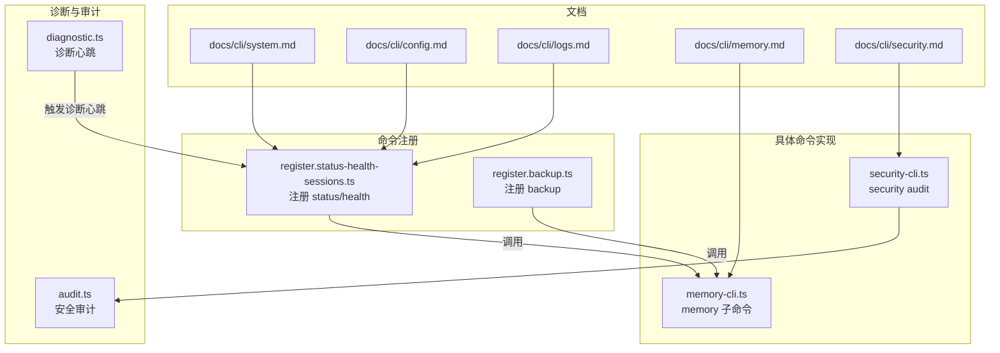
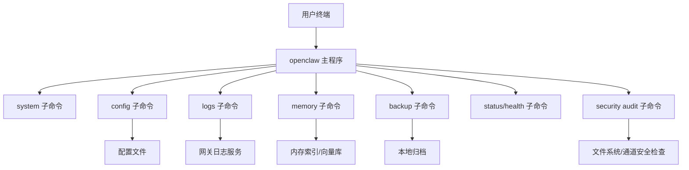
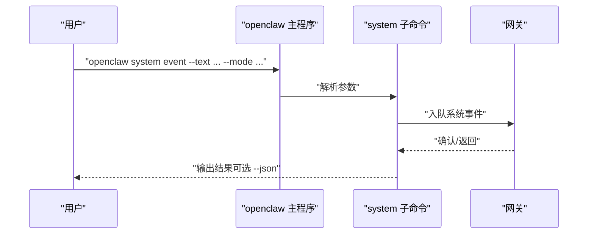
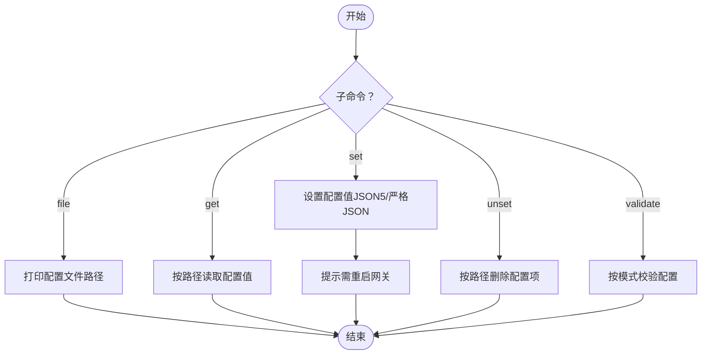
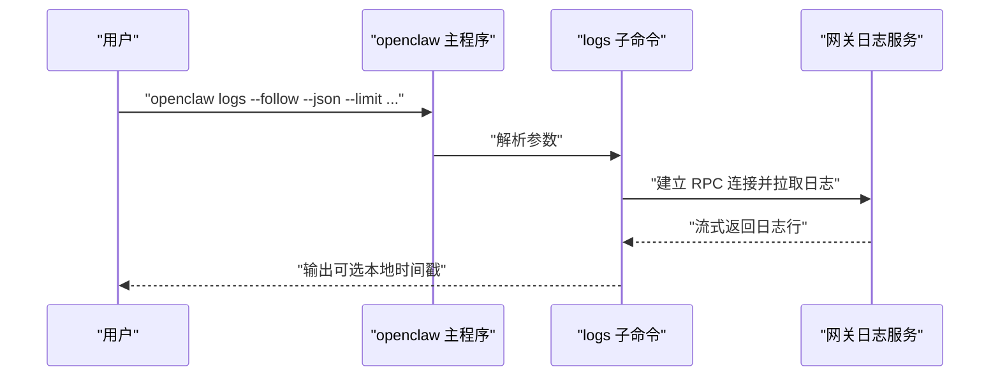
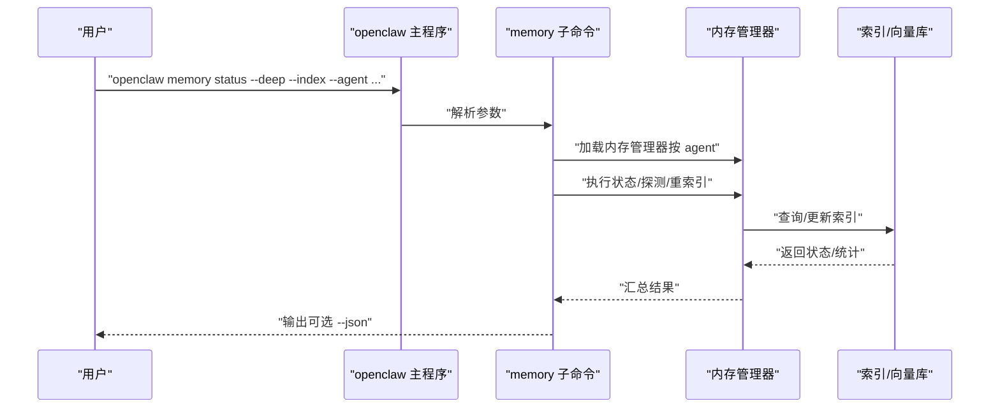
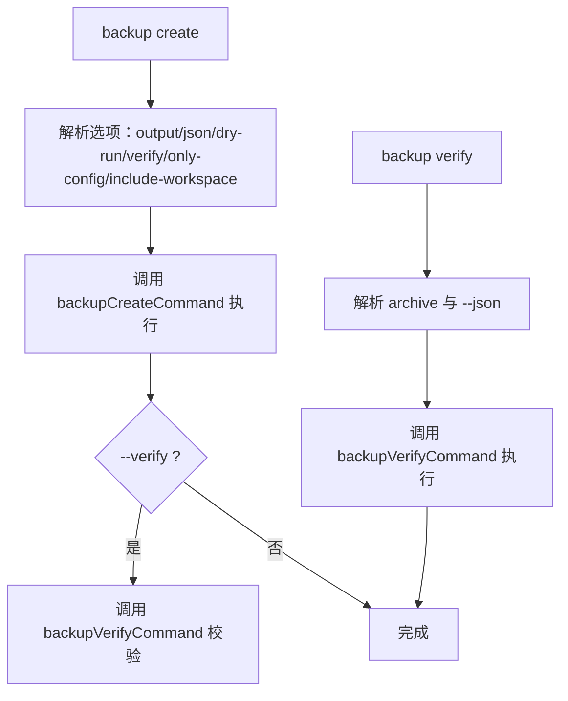
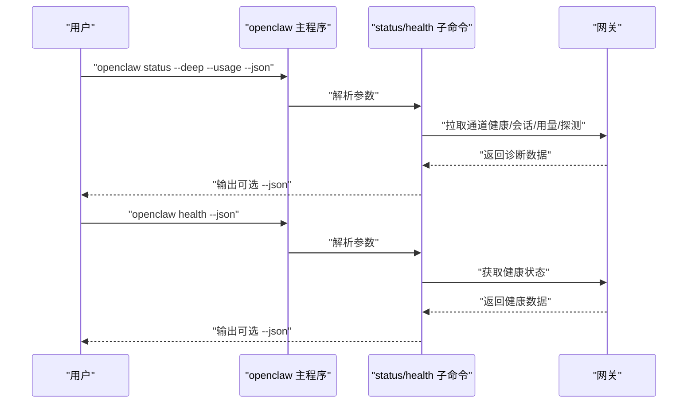
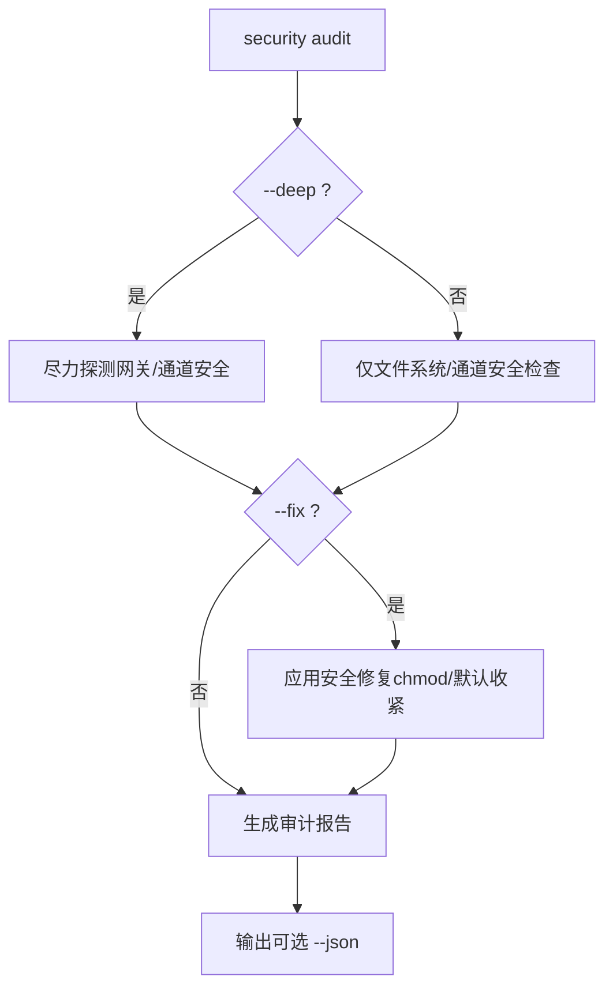
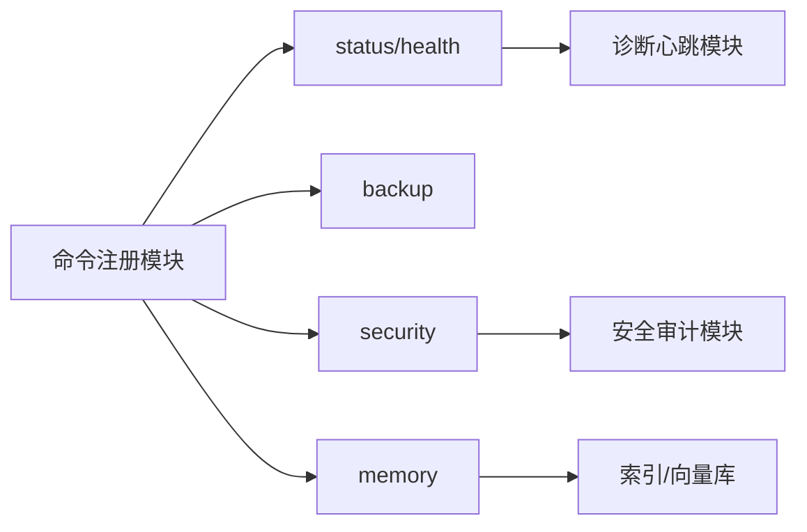

# 系统工具命令

## 目录
1. [简介](#简介)
2. [项目结构](#项目结构)
3. [核心组件](#核心组件)
4. [架构总览](#架构总览)
5. [详细组件分析](#详细组件分析)
6. [依赖关系分析](#依赖关系分析)
7. [性能考虑](#性能考虑)
8. [故障排查指南](#故障排查指南)
9. [结论](#结论)
10. [附录](#附录)

## 简介
本文件面向 OpenClaw 系统管理员与运维工程师，系统性梳理并说明以下系统管理命令的功能与使用方法：
- system-cli：系统事件入队、心跳控制、在线状态查看
- config-cli：配置查看、编辑、验证与文件定位
- logs-cli：远程追踪网关日志（RPC）
- memory-cli：内存索引状态、重建索引、语义检索
- 备份与恢复：本地备份归档创建与校验
- 健康检查与状态报告：通道健康、运行时健康、会话摘要
- 诊断与安全审计：系统诊断心跳、安全审计与修复
- 性能优化与资源清理：缓存与临时文件清理建议（基于仓库实践）

上述命令均以 openclaw 顶级命令形式提供，并通过内置帮助与示例指导用户正确使用。

## 项目结构
围绕系统工具命令，相关文档与实现主要分布在如下位置：
- 文档层：docs/cli/*.md 与 docs/zh-CN/cli/*.md 提供英文与中文参考
- CLI 注册层：src/cli/program/* 负责注册各子命令与参数
- 具体命令实现：src/cli/memory-cli.ts、src/cli/security-cli.ts 等
- 安全审计与诊断：src/security/audit.ts、src/logging/diagnostic.ts
- 备份命令：src/cli/program/register.backup.ts

图表来源
- [src/cli/program/register.status-health-sessions.ts](file://src/cli/program/register.status-health-sessions.ts#L43-L113)
- [src/cli/program/register.backup.ts](file://src/cli/program/register.backup.ts#L1-L92)
- [src/cli/memory-cli.ts](file://src/cli/memory-cli.ts#L608-L634)
- [src/cli/security-cli.ts](file://src/cli/security-cli.ts#L30-L60)
- [src/security/audit.ts](file://src/security/audit.ts#L115-L166)
- [src/logging/diagnostic.ts](file://src/logging/diagnostic.ts#L331-L370)
- [docs/cli/system.md](file://docs/cli/system.md#L1-L61)
- [docs/cli/config.md](file://docs/cli/config.md#L1-L69)
- [docs/cli/logs.md](file://docs/cli/logs.md#L1-L29)
- [docs/cli/memory.md](file://docs/cli/memory.md#L1-L67)
- [docs/cli/security.md](file://docs/cli/security.md#L43-L72)

章节来源
- [docs/cli/system.md](file://docs/cli/system.md#L1-L61)
- [docs/zh-CN/cli/system.md](file://docs/zh-CN/cli/system.md#L1-L64)
- [docs/cli/config.md](file://docs/cli/config.md#L1-L69)
- [docs/zh-CN/cli/config.md](file://docs/zh-CN/cli/config.md#L1-L58)
- [docs/cli/logs.md](file://docs/cli/logs.md#L1-L29)
- [docs/zh-CN/cli/logs.md](file://docs/zh-CN/cli/logs.md#L1-L32)
- [docs/cli/memory.md](file://docs/cli/memory.md#L1-L67)
- [docs/zh-CN/cli/memory.md](file://docs/zh-CN/cli/memory.md#L1-L53)
- [src/cli/program/register.status-health-sessions.ts](file://src/cli/program/register.status-health-sessions.ts#L43-L113)
- [src/cli/program/register.backup.ts](file://src/cli/program/register.backup.ts#L1-L92)
- [src/cli/memory-cli.ts](file://src/cli/memory-cli.ts#L608-L634)
- [src/cli/security-cli.ts](file://src/cli/security-cli.ts#L30-L60)
- [src/security/audit.ts](file://src/security/audit.ts#L115-L166)
- [src/logging/diagnostic.ts](file://src/logging/diagnostic.ts#L331-L370)
- [docs/cli/security.md](file://docs/cli/security.md#L43-L72)

## 核心组件
- system-cli：提供 system event、system heartbeat、system presence 子命令，用于系统事件入队、心跳启停与在线状态查看
- config-cli：提供 config file、config get、config set、config unset、config validate 子命令，用于配置文件定位、键值读取/设置/删除与配置验证
- logs-cli：提供 logs 子命令，支持远程追踪网关日志，支持 follow、json、limit、local-time 等选项
- memory-cli：提供 memory status、memory index、memory search 子命令，支持按智能体作用域、深度探测、强制重建索引、语义检索与结果过滤
- backup-cli：提供 backup create、backup verify 子命令，支持创建本地备份归档与校验清单
- status/health：提供 status（通道健康、会话摘要、用量快照、深度探测）、health（运行时健康）子命令
- security-cli：提供 security audit 子命令，支持本地安全审计、深度探测与自动修复
- 诊断与心跳：诊断模块周期性生成诊断心跳，辅助健康检查与状态报告

章节来源
- [docs/cli/system.md](file://docs/cli/system.md#L10-L61)
- [docs/cli/config.md](file://docs/cli/config.md#L8-L69)
- [docs/cli/logs.md](file://docs/cli/logs.md#L9-L29)
- [docs/cli/memory.md](file://docs/cli/memory.md#L9-L67)
- [src/cli/program/register.backup.ts](file://src/cli/program/register.backup.ts#L10-L92)
- [src/cli/program/register.status-health-sessions.ts](file://src/cli/program/register.status-health-sessions.ts#L43-L113)
- [src/cli/security-cli.ts](file://src/cli/security-cli.ts#L30-L60)
- [src/logging/diagnostic.ts](file://src/logging/diagnostic.ts#L331-L370)

## 架构总览
下图展示系统工具命令的高层交互：用户通过 openclaw 顶层命令调用各子命令，子命令根据配置与运行时环境执行相应逻辑，并输出人类可读或机器可读的结果。

图表来源
- [docs/cli/system.md](file://docs/cli/system.md#L10-L61)
- [docs/cli/config.md](file://docs/cli/config.md#L8-L69)
- [docs/cli/logs.md](file://docs/cli/logs.md#L9-L29)
- [docs/cli/memory.md](file://docs/cli/memory.md#L9-L67)
- [src/cli/program/register.backup.ts](file://src/cli/program/register.backup.ts#L10-L92)
- [src/cli/program/register.status-health-sessions.ts](file://src/cli/program/register.status-health-sessions.ts#L43-L113)
- [src/cli/security-cli.ts](file://src/cli/security-cli.ts#L30-L60)

## 详细组件分析

### system-cli（系统事件、心跳、在线状态）
- 功能要点
  - system event：在主会话入队系统事件，支持立即触发或等待下次心跳注入
  - system heartbeat：last/enable/disable 控制心跳状态
  - system presence：列出网关已知的系统在线状态条目
- 关键行为
  - 需要可达的运行中网关
  - 系统事件为临时，重启不持久
- 使用场景
  - 快速注入系统提示、临时开关心跳、检查节点/实例状态

图表来源
- [docs/cli/system.md](file://docs/cli/system.md#L24-L46)
- [docs/zh-CN/cli/system.md](file://docs/zh-CN/cli/system.md#L30-L58)

章节来源
- [docs/cli/system.md](file://docs/cli/system.md#L10-L61)
- [docs/zh-CN/cli/system.md](file://docs/zh-CN/cli/system.md#L17-L64)

### config-cli（配置查看、编辑、验证）
- 功能要点
  - config file：打印当前生效配置文件路径
  - config get：按路径读取配置值（支持点号与方括号语法）
  - config set：设置配置值（JSON5 解析，支持严格 JSON）
  - config unset：按路径删除配置项
  - config validate：在不启动网关的前提下按模式校验配置
- 关键行为
  - 编辑后需重启网关使更改生效
  - 支持机器可读输出（--json）

图表来源
- [docs/cli/config.md](file://docs/cli/config.md#L14-L68)
- [docs/zh-CN/cli/config.md](file://docs/zh-CN/cli/config.md#L20-L57)

章节来源
- [docs/cli/config.md](file://docs/cli/config.md#L8-L69)
- [docs/zh-CN/cli/config.md](file://docs/zh-CN/cli/config.md#L15-L58)

### logs-cli（日志追踪与分析）
- 功能要点
  - 远程通过 RPC 跟踪网关文件日志（支持 follow、json、limit、local-time）
- 使用场景
  - 无需 SSH 即可查看网关日志
  - 为工具链提供 JSON 日志行

图表来源
- [docs/cli/logs.md](file://docs/cli/logs.md#L17-L28)
- [docs/zh-CN/cli/logs.md](file://docs/zh-CN/cli/logs.md#L24-L31)

章节来源
- [docs/cli/logs.md](file://docs/cli/logs.md#L9-L29)
- [docs/zh-CN/cli/logs.md](file://docs/zh-CN/cli/logs.md#L16-L32)

### memory-cli（内存索引、状态与检索）
- 功能要点
  - memory status：显示索引统计，支持 deep 探测、index 强制重索引、agent 作用域、json 输出
  - memory index：重建索引，支持 agent 作用域、force 强制、verbose 详细日志
  - memory search：语义检索，支持 query/max-results/min-score/agent/json
- 关键行为
  - 支持多智能体作用域，默认针对默认智能体或已配置智能体列表
  - verbose 模式输出阶段细节（提供商、模型、数据源、批次活动）
  - 当有效配置了远端密钥字段为 SecretRefs 时，命令从网关快照解析密钥值

图表来源
- [docs/cli/memory.md](file://docs/cli/memory.md#L19-L66)
- [src/cli/memory-cli.ts](file://src/cli/memory-cli.ts#L608-L634)
- [src/cli/memory-cli.test.ts](file://src/cli/memory-cli.test.ts#L132-L168)

章节来源
- [docs/cli/memory.md](file://docs/cli/memory.md#L9-L67)
- [docs/zh-CN/cli/memory.md](file://docs/zh-CN/cli/memory.md#L16-L53)
- [src/cli/memory-cli.ts](file://src/cli/memory-cli.ts#L608-L634)
- [src/cli/memory-cli.test.ts](file://src/cli/memory-cli.test.ts#L443-L486)

### 备份与恢复（backup-cli）
- 功能要点
  - backup create：创建本地备份归档，支持输出目录、仅配置、排除工作区、干跑、验证
  - backup verify：校验归档结构与清单
- 关键行为
  - 通过运行时封装统一执行命令逻辑
  - 支持机器可读输出（--json）

图表来源
- [src/cli/program/register.backup.ts](file://src/cli/program/register.backup.ts#L10-L92)

章节来源
- [src/cli/program/register.backup.ts](file://src/cli/program/register.backup.ts#L1-L92)

### 健康检查与状态报告（status/health）
- 功能要点
  - status：通道健康、最近会话收件人、完整诊断、模型用量快照、深度探测（超时可配）、详细日志
  - health：从运行中的网关获取健康状态
- 关键行为
  - 支持 --json、--all、--usage、--deep、--timeout、--verbose/--debug
  - 与诊断心跳配合，辅助判断系统活动与卡顿

图表来源
- [src/cli/program/register.status-health-sessions.ts](file://src/cli/program/register.status-health-sessions.ts#L43-L113)

章节来源
- [src/cli/program/register.status-health-sessions.ts](file://src/cli/program/register.status-health-sessions.ts#L43-L113)

### 诊断与安全审计（security-cli）
- 功能要点
  - security audit：本地安全审计，支持 deep（尽力探测）、fix（安全修复）、json 输出
- 关键行为
  - --fix 应用安全修复（如收紧组策略、调整敏感信息脱敏级别、收紧状态/配置文件权限）
  - --fix 与 --json 组合时，同时输出修复动作与最终报告
  - 不旋转令牌/密码/密钥，不改变网关暴露策略，不移除/重写插件/技能

图表来源
- [src/cli/security-cli.ts](file://src/cli/security-cli.ts#L30-L60)
- [src/security/audit.ts](file://src/security/audit.ts#L115-L166)
- [docs/cli/security.md](file://docs/cli/security.md#L43-L72)

章节来源
- [src/cli/security-cli.ts](file://src/cli/security-cli.ts#L30-L60)
- [src/security/audit.ts](file://src/security/audit.ts#L115-L166)
- [docs/cli/security.md](file://docs/cli/security.md#L43-L72)

## 依赖关系分析
- 命令注册与路由
  - status/health、backup、security、memory 等命令通过各自的注册函数挂载到主程序
  - 各命令共享运行时封装，确保一致的日志、错误处理与退出码
- 内部依赖
  - memory-cli 依赖内存管理器与索引/向量库
  - security-cli 依赖安全审计模块与配置加载
  - 诊断心跳模块与健康检查协同，提供系统活动度与排队状态的周期性观测

图表来源
- [src/cli/program/register.status-health-sessions.ts](file://src/cli/program/register.status-health-sessions.ts#L43-L113)
- [src/cli/program/register.backup.ts](file://src/cli/program/register.backup.ts#L10-L92)
- [src/cli/security-cli.ts](file://src/cli/security-cli.ts#L30-L60)
- [src/logging/diagnostic.ts](file://src/logging/diagnostic.ts#L331-L370)

章节来源
- [src/cli/program/register.status-health-sessions.ts](file://src/cli/program/register.status-health-sessions.ts#L43-L113)
- [src/cli/program/register.backup.ts](file://src/cli/program/register.backup.ts#L1-L92)
- [src/cli/security-cli.ts](file://src/cli/security-cli.ts#L30-L60)
- [src/logging/diagnostic.ts](file://src/logging/diagnostic.ts#L331-L370)

## 性能考虑
- memory-cli
  - verbose 模式会输出大量阶段细节，适合排障但可能增加 I/O 与输出开销
  - deep 与 index 选项会触发更深入的探测与重建，建议在维护窗口执行
- logs-cli
  - follow 模式持续拉取日志，注意网络与磁盘 I/O；结合 limit 限制输出量
- status/health
  - deep 探测与探针超时可调，建议根据网络条件适当缩短超时
- security-cli
  - --deep 探测可能涉及外部通道/网关连接，注意耗时与失败回退

## 故障排查指南
- memory-cli
  - 若“内存搜索不可用”，检查内存插件是否启用或索引是否可用
  - 若“后端不支持手动重建索引”，请使用 status --index 或按插件能力执行重建
  - SecretRefs 无法解析时，确认网关可达且具备 secrets.resolve 能力
- logs-cli
  - 远程模式下无法连接网关，请检查网络与认证配置
- security-cli
  - --fix 仅应用安全修复，不旋转密钥；若仍报风险，请手动检查密钥轮换策略
- status/health
  - 深度探测失败时，尝试缩短超时或关闭 deep；关注 --verbose 输出的超时/连接失败信息
- 诊断心跳
  - 诊断心跳模块会周期性统计会话状态与队列深度，若长时间无活动但仍显示排队，检查上游流量与处理速率

章节来源
- [src/cli/memory-cli.test.ts](file://src/cli/memory-cli.test.ts#L443-L486)
- [src/logging/diagnostic.ts](file://src/logging/diagnostic.ts#L331-L370)

## 结论
本文系统梳理了 OpenClaw 的系统工具命令，覆盖配置管理、日志追踪、内存索引与检索、健康检查、安全审计、备份与恢复等关键运维场景。通过统一的 openclaw 顶层命令与清晰的参数选项，用户可在本地或远程高效地完成系统管理任务。建议在生产环境中结合 --json 输出与自动化脚本，实现可审计、可重复的运维流程。

## 附录
- 常用命令速查
  - system：event、heartbeat（last/enable/disable）、presence
  - config：file、get、set、unset、validate
  - logs：--follow、--json、--limit、--local-time
  - memory：status（--deep、--index、--agent、--json）、index（--agent、--force、--verbose）、search（--query、--max-results、--min-score、--agent、--json）
  - backup：create（--output、--json、--dry-run、--verify、--only-config、--no-include-workspace）、verify
  - status/health：--json、--all、--usage、--deep、--timeout、--verbose/--debug
  - security：audit（--deep、--fix、--json）