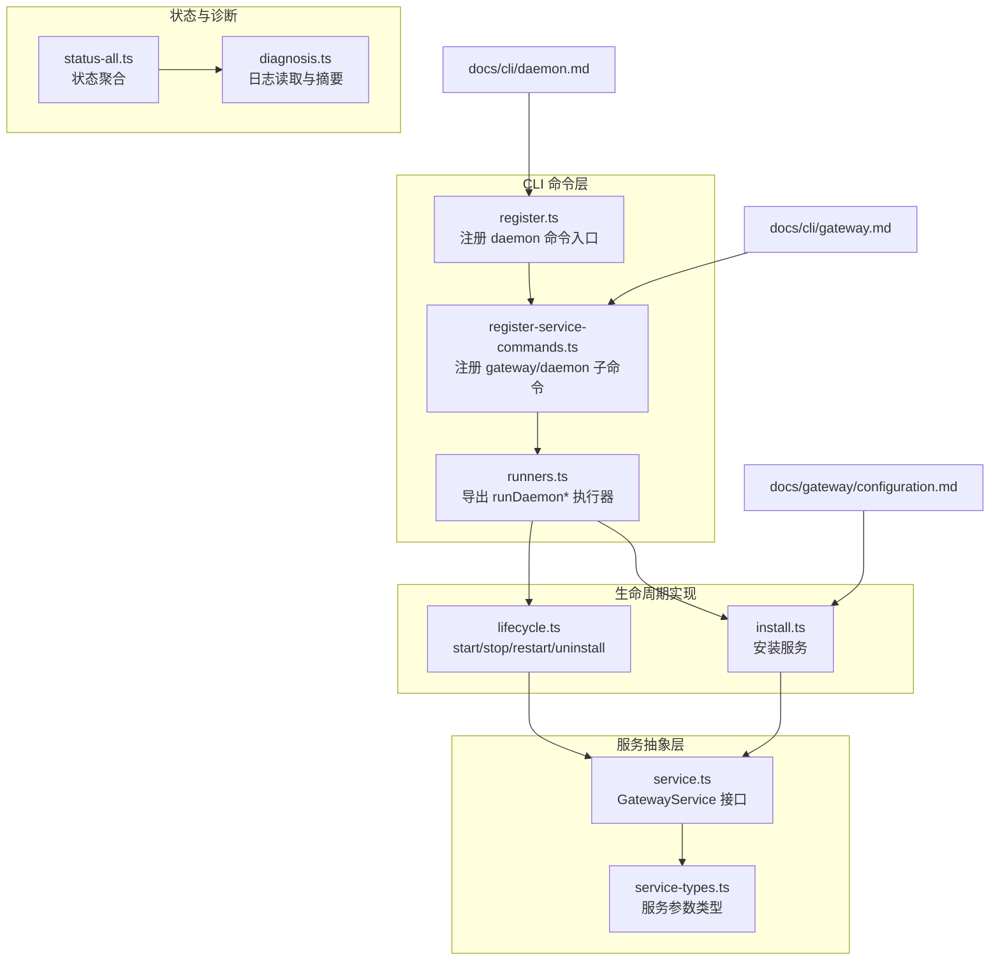
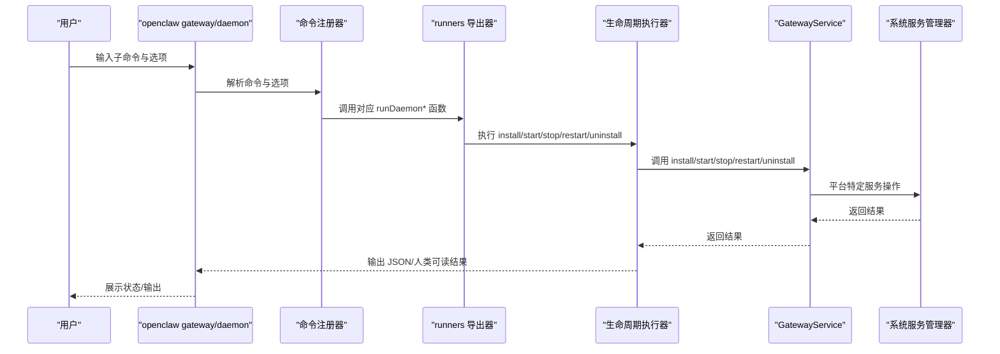
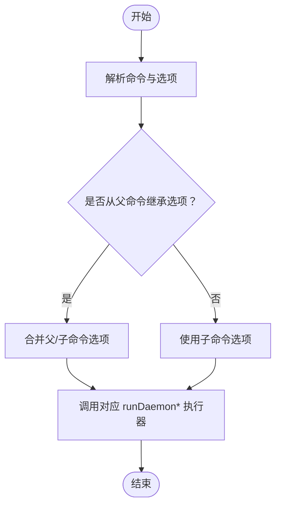
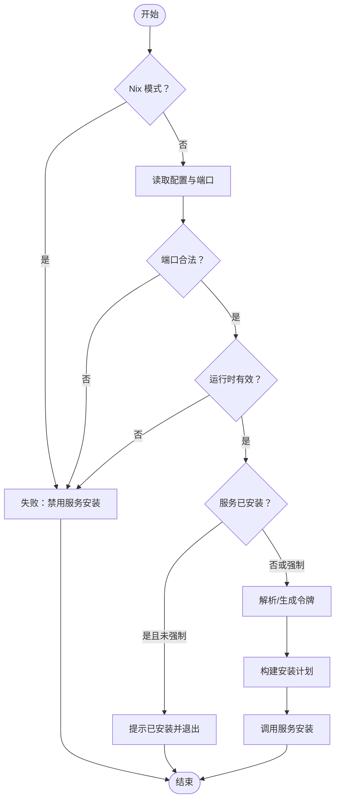
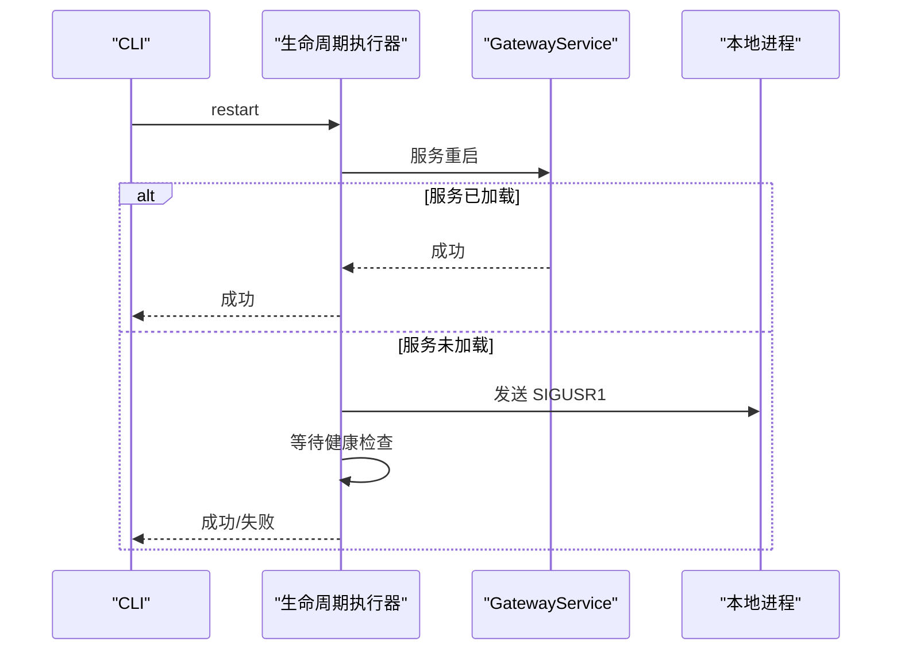
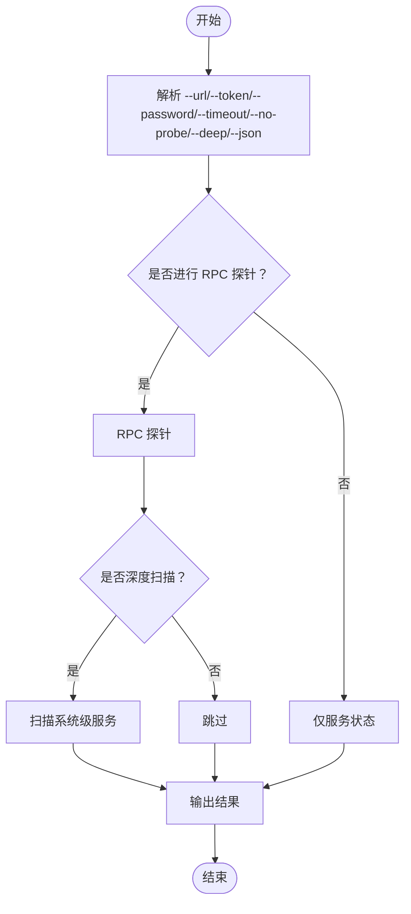
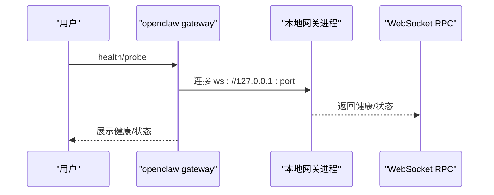
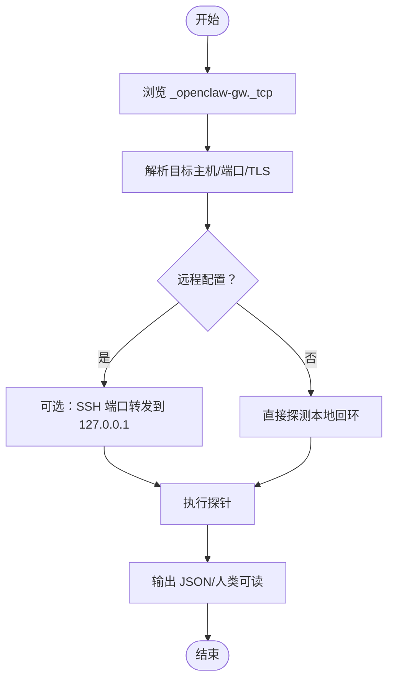
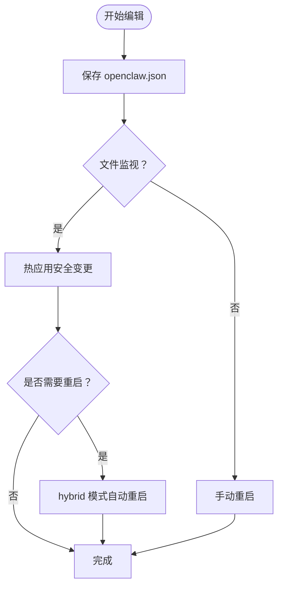
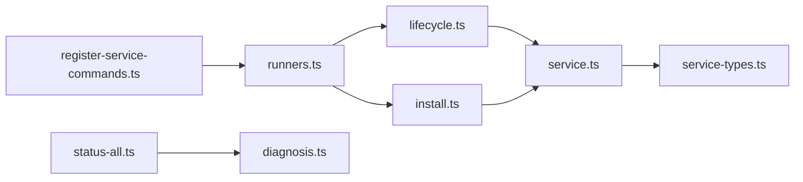

# 网关管理命令

## 目录
1. [简介](#简介)
2. [项目结构](#项目结构)
3. [核心组件](#核心组件)
4. [架构总览](#架构总览)
5. [详细组件分析](#详细组件分析)
6. [依赖关系分析](#依赖关系分析)
7. [性能考虑](#性能考虑)
8. [故障排除指南](#故障排除指南)
9. [结论](#结论)
10. [附录](#附录)

## 简介
本文件面向运维与开发者，系统化梳理 OpenClaw 网关管理命令，覆盖以下主题：
- 网关服务生命周期：安装、启动、停止、重启、卸载、状态查询
- 网关本地运行与健康探测
- 网关发现（Bonjour/LAN/Tailscale）、远程网关连接与 SSH 端口转发
- 配置文件的编辑、校验与热重载
- 性能监控、日志查看与故障排除
- 升级、备份与恢复建议
- 自动化脚本示例与最佳实践

## 项目结构
围绕“网关管理命令”的相关源码与文档主要分布在如下位置：
- CLI 守护进程命令注册与执行：src/cli/daemon-cli/*
- 网关服务抽象与平台适配：src/daemon/*
- 状态聚合与诊断：src/commands/status-all.*
- 文档：docs/cli/gateway.md、docs/cli/daemon.md、docs/gateway/configuration.md 等

**图示来源**
- [src/cli/daemon-cli/register-service-commands.ts](file://src/cli/daemon-cli/register-service-commands.ts#L38-L101)
- [src/cli/daemon-cli/register.ts](file://src/cli/daemon-cli/register.ts#L6-L19)
- [src/cli/daemon-cli/runners.ts](file://src/cli/daemon-cli/runners.ts#L1-L9)
- [src/cli/daemon-cli/install.ts](file://src/cli/daemon-cli/install.ts#L21-L127)
- [src/cli/daemon-cli/lifecycle.ts](file://src/cli/daemon-cli/lifecycle.ts#L193-L332)
- [src/daemon/service.ts](file://src/daemon/service.ts#L54-L67)
- [src/daemon/service-types.ts](file://src/daemon/service-types.ts#L1-L39)
- [src/commands/status-all.ts](file://src/commands/status-all.ts#L241-L275)
- [src/commands/status-all/diagnosis.ts](file://src/commands/status-all/diagnosis.ts#L167-L194)
- [docs/cli/gateway.md](file://docs/cli/gateway.md#L1-L215)
- [docs/cli/daemon.md](file://docs/cli/daemon.md#L1-L52)
- [docs/gateway/configuration.md](file://docs/gateway/configuration.md#L1-L547)

**章节来源**
- [src/cli/daemon-cli/register-service-commands.ts](file://src/cli/daemon-cli/register-service-commands.ts#L1-L102)
- [src/cli/daemon-cli/register.ts](file://src/cli/daemon-cli/register.ts#L1-L19)
- [src/cli/daemon-cli/runners.ts](file://src/cli/daemon-cli/runners.ts#L1-L9)
- [src/cli/daemon-cli/install.ts](file://src/cli/daemon-cli/install.ts#L1-L127)
- [src/cli/daemon-cli/lifecycle.ts](file://src/cli/daemon-cli/lifecycle.ts#L1-L332)
- [src/daemon/service.ts](file://src/daemon/service.ts#L54-L67)
- [src/daemon/service-types.ts](file://src/daemon/service-types.ts#L1-L39)
- [src/commands/status-all.ts](file://src/commands/status-all.ts#L241-L275)
- [src/commands/status-all/diagnosis.ts](file://src/commands/status-all/diagnosis.ts#L167-L194)
- [docs/cli/gateway.md](file://docs/cli/gateway.md#L1-L215)
- [docs/cli/daemon.md](file://docs/cli/daemon.md#L1-L52)
- [docs/gateway/configuration.md](file://docs/gateway/configuration.md#L1-L547)

## 核心组件
- 守护进程命令注册器：负责在 openclaw gateway/daemon 下注册 status、install、uninstall、start、stop、restart 子命令，并解析选项与上下文。
- 运行器导出器：统一导出 runDaemonInstall、runDaemonStart、runDaemonStop、runDaemonRestart、runDaemonUninstall。
- 生命周期执行器：封装服务安装、启动、停止、重启、卸载的流程，含健康检查、端口解析、进程信号处理等。
- 服务抽象：GatewayService 抽象不同平台（launchd/systemd/schtasks）的服务安装与控制接口。
- 状态与诊断：聚合网关状态、连接性、认证方式、最近日志等信息，辅助排障。

**章节来源**
- [src/cli/daemon-cli/register-service-commands.ts](file://src/cli/daemon-cli/register-service-commands.ts#L38-L101)
- [src/cli/daemon-cli/runners.ts](file://src/cli/daemon-cli/runners.ts#L1-L9)
- [src/cli/daemon-cli/lifecycle.ts](file://src/cli/daemon-cli/lifecycle.ts#L193-L332)
- [src/daemon/service.ts](file://src/daemon/service.ts#L54-L67)
- [src/commands/status-all.ts](file://src/commands/status-all.ts#L241-L275)

## 架构总览
下图展示从 CLI 到服务抽象与执行器的整体调用链路，以及与文档中命令定义的对应关系。

**图示来源**
- [src/cli/daemon-cli/register-service-commands.ts](file://src/cli/daemon-cli/register-service-commands.ts#L38-L101)
- [src/cli/daemon-cli/runners.ts](file://src/cli/daemon-cli/runners.ts#L1-L9)
- [src/cli/daemon-cli/lifecycle.ts](file://src/cli/daemon-cli/lifecycle.ts#L193-L332)
- [src/daemon/service.ts](file://src/daemon/service.ts#L54-L67)

## 详细组件分析

### 守护进程命令注册与选项解析
- 注册命令：status、install、uninstall、start、stop、restart
- 选项继承：父命令的 --port/--token/--password 可被子命令继承并合并
- 选项解析：resolveInstallOptions/resolveRpcOptions 将父子命令选项合并，优先使用子命令显式值

**图示来源**
- [src/cli/daemon-cli/register-service-commands.ts](file://src/cli/daemon-cli/register-service-commands.ts#L13-L36)
- [src/cli/daemon-cli/register-service-commands.ts](file://src/cli/daemon-cli/register-service-commands.ts#L38-L101)

**章节来源**
- [src/cli/daemon-cli/register-service-commands.ts](file://src/cli/daemon-cli/register-service-commands.ts#L1-L102)

### 安装服务（gateway install / daemon install）
- 支持指定端口、运行时（node/bun）、令牌、强制覆盖
- 校验端口合法性、运行时有效性
- 读取当前配置与环境，构建安装计划
- 校验 SecretRef 可解析性；必要时生成并持久化令牌
- 调用服务抽象执行安装

**图示来源**
- [src/cli/daemon-cli/install.ts](file://src/cli/daemon-cli/install.ts#L21-L127)

**章节来源**
- [src/cli/daemon-cli/install.ts](file://src/cli/daemon-cli/install.ts#L1-L127)

### 启动/停止/重启/卸载（gateway start/stop/restart/uninstall）
- start：调用服务启动，必要时渲染启动提示
- stop：优先通过服务管理器停止；若未加载则尝试向监听端口的进程发送 SIGTERM
- restart：优先通过服务管理器重启；若未加载则向单个监听进程发送 SIGUSR1，并进行健康检查
- uninstall：停止并卸载服务，断言卸载后不再加载

**图示来源**
- [src/cli/daemon-cli/lifecycle.ts](file://src/cli/daemon-cli/lifecycle.ts#L220-L332)

**章节来源**
- [src/cli/daemon-cli/lifecycle.ts](file://src/cli/daemon-cli/lifecycle.ts#L193-L332)

### 状态查询（gateway status / daemon status）
- 支持 --url/--token/--password/--timeout/--no-probe/--deep/--json
- 可选进行 RPC 探针，扫描系统级服务，输出人类可读或 JSON
- 在 Linux systemd 安装场景下，支持从 Environment/EnvironmentFile 读取并校验令牌漂移

**图示来源**
- [src/cli/daemon-cli/register-service-commands.ts](file://src/cli/daemon-cli/register-service-commands.ts#L38-L56)

**章节来源**
- [src/cli/daemon-cli/register-service-commands.ts](file://src/cli/daemon-cli/register-service-commands.ts#L38-L56)

### 网关本地运行与健康探测
- openclaw gateway：前台运行网关，支持端口绑定、认证模式、Tailscale、日志级别等
- openclaw gateway health：通过 WebSocket RPC 查询健康
- openclaw gateway probe：同时探测配置的远程网关与本地回环，支持 SSH 端口转发

**图示来源**
- [docs/cli/gateway.md](file://docs/cli/gateway.md#L85-L157)

**章节来源**
- [docs/cli/gateway.md](file://docs/cli/gateway.md#L22-L157)

### 网关发现与远程连接
- Bonjour 多播/单播发现，支持 Wide-Area 记录中的传输、端口、TLS 等元数据
- gateway discover：浏览与解析网关信标，支持超时与 JSON 输出
- gateway probe：同时探测远程与本地网关；支持 SSH 端口转发到本地回环

**图示来源**
- [docs/cli/gateway.md](file://docs/cli/gateway.md#L179-L215)

**章节来源**
- [docs/cli/gateway.md](file://docs/cli/gateway.md#L179-L215)

### 配置文件编辑与验证
- 编辑方式：交互向导、CLI 一次性设置、控制 UI 表单、直接编辑
- 严格校验：不符合模式的配置会导致网关拒绝启动，需通过 doctor 修复
- 热重载：大部分字段即时生效；服务器类与基础设施类变更需重启
- RPC 更新：config.apply（全量替换）与 config.patch（部分更新），带速率限制

**图示来源**
- [docs/gateway/configuration.md](file://docs/gateway/configuration.md#L349-L387)

**章节来源**
- [docs/gateway/configuration.md](file://docs/gateway/configuration.md#L36-L447)

## 依赖关系分析
- 命令注册依赖运行器导出器，运行器再依赖生命周期执行器
- 生命周期执行器依赖服务抽象（GatewayService），以适配不同平台的服务管理器
- 状态与诊断模块依赖配置与日志路径解析，用于汇总输出与排障

**图示来源**
- [src/cli/daemon-cli/register-service-commands.ts](file://src/cli/daemon-cli/register-service-commands.ts#L1-L102)
- [src/cli/daemon-cli/runners.ts](file://src/cli/daemon-cli/runners.ts#L1-L9)
- [src/cli/daemon-cli/lifecycle.ts](file://src/cli/daemon-cli/lifecycle.ts#L1-L332)
- [src/cli/daemon-cli/install.ts](file://src/cli/daemon-cli/install.ts#L1-L127)
- [src/daemon/service.ts](file://src/daemon/service.ts#L54-L67)
- [src/daemon/service-types.ts](file://src/daemon/service-types.ts#L1-L39)
- [src/commands/status-all.ts](file://src/commands/status-all.ts#L241-L275)
- [src/commands/status-all/diagnosis.ts](file://src/commands/status-all/diagnosis.ts#L167-L194)

**章节来源**
- [src/cli/daemon-cli/register-service-commands.ts](file://src/cli/daemon-cli/register-service-commands.ts#L1-L102)
- [src/cli/daemon-cli/runners.ts](file://src/cli/daemon-cli/runners.ts#L1-L9)
- [src/cli/daemon-cli/lifecycle.ts](file://src/cli/daemon-cli/lifecycle.ts#L1-L332)
- [src/cli/daemon-cli/install.ts](file://src/cli/daemon-cli/install.ts#L1-L127)
- [src/daemon/service.ts](file://src/daemon/service.ts#L54-L67)
- [src/daemon/service-types.ts](file://src/daemon/service-types.ts#L1-L39)
- [src/commands/status-all.ts](file://src/commands/status-all.ts#L241-L275)
- [src/commands/status-all/diagnosis.ts](file://src/commands/status-all/diagnosis.ts#L167-L194)

## 性能考虑
- 日志样式：可通过 --ws-log 控制 WebSocket 日志风格，便于在高并发场景下降低日志噪声
- 健康检查：重启后等待端口健康与进程健康，避免误判；Windows 上对未知监听视为陈旧进程处理
- 端口冲突：启动前可强制终止占用端口的监听者（--force），减少阻塞
- 热重载策略：根据变更类别选择 hybrid/hot/restart/off，平衡稳定性与响应速度

[本节为通用指导，不直接分析具体文件]

## 故障排除指南
- 使用 doctor 快速定位配置错误与服务异常
- 查看网关日志尾部摘要，结合 redact 策略过滤敏感信息
- 若服务未加载但存在监听进程，尝试通过 SIGTERM 停止或 SIGUSR1 触发重启
- 当健康检查超时，参考诊断输出与提示命令（如 status --deep、doctor）

**章节来源**
- [src/commands/status-all/diagnosis.ts](file://src/commands/status-all/diagnosis.ts#L167-L194)
- [docs/zh-CN/logging.md](file://docs/zh-CN/logging.md#L325-L330)

## 结论
本文基于仓库内 CLI 与文档，系统梳理了 OpenClaw 网关管理命令的注册、执行与平台适配机制，覆盖服务生命周期、发现与连接、配置与诊断、性能与排障等关键方面。建议在生产环境中优先使用 openclaw gateway 子命令，并配合 doctor 与 status --deep 进行持续监控与排障。

[本节为总结，不直接分析具体文件]

## 附录

### 命令速查与要点
- openclaw gateway
  - 运行与调试：端口、绑定、认证、Tailscale、日志级别、原始流输出等
  - 健康查询：openclaw gateway health
  - 状态查询：openclaw gateway status（支持 --no-probe、--deep、--json）
  - 探测：openclaw gateway probe（支持 --ssh）
  - 发现：openclaw gateway discover（Bonjour/LAN/Wide-Area）
- openclaw daemon（兼容别名）
  - status、install、uninstall、start、stop、restart
- openclaw doctor / logs / health / status（全局命令，辅助排障）

**章节来源**
- [docs/cli/gateway.md](file://docs/cli/gateway.md#L22-L215)
- [docs/cli/daemon.md](file://docs/cli/daemon.md#L15-L52)

### 最佳实践
- 使用 SecretRef 管理令牌与密码，避免明文存储
- 在 systemd 环境中启用令牌漂移检测，确保服务与配置一致
- 对于多实例/多端口场景，使用隔离配置与独立端口，避免冲突
- 配置热重载策略，按变更类别选择 hybrid/hot/restart/off
- 定期运行 doctor 与 status --deep，保持服务健康可见

**章节来源**
- [docs/gateway/configuration.md](file://docs/gateway/configuration.md#L501-L536)
- [src/cli/daemon-cli/lifecycle.ts](file://src/cli/daemon-cli/lifecycle.ts#L220-L332)