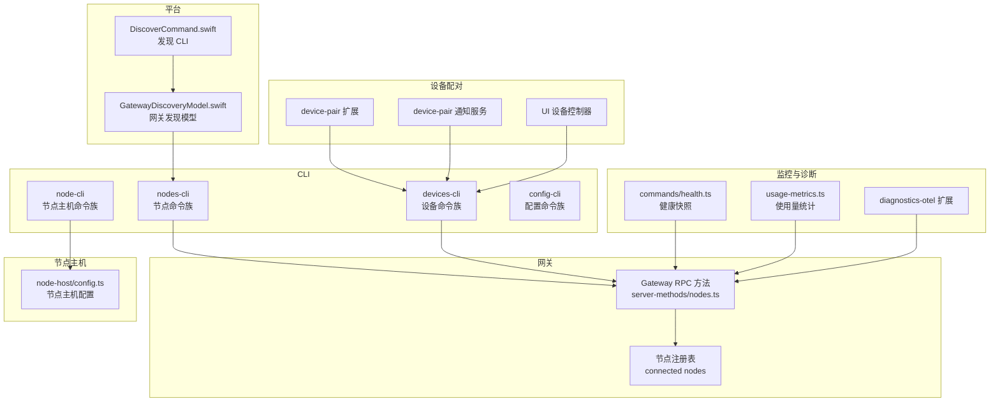
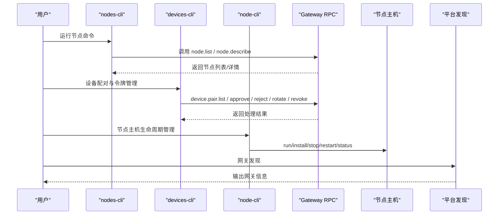
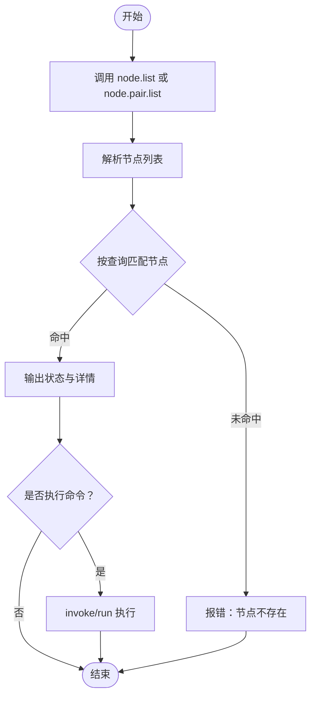
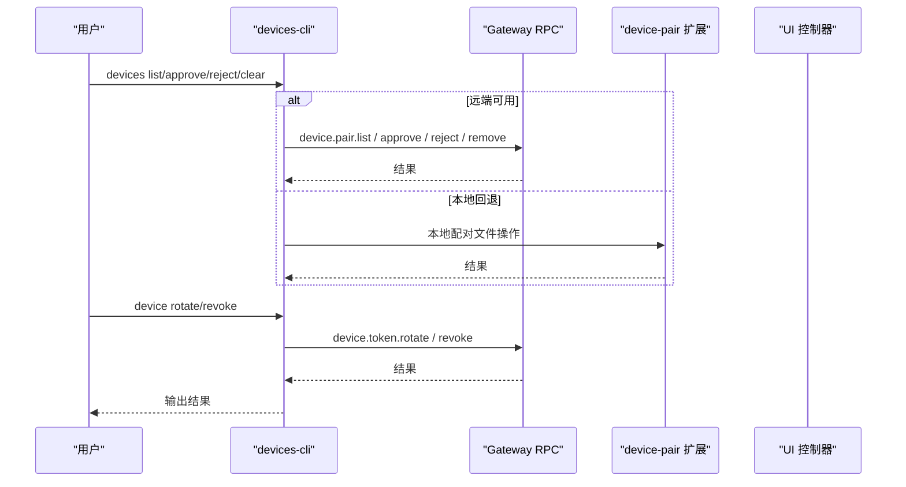
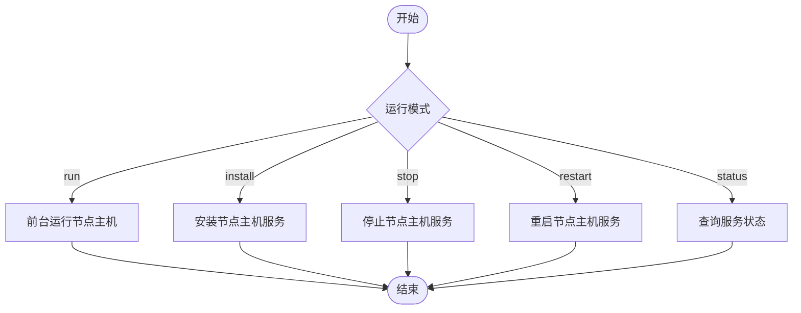
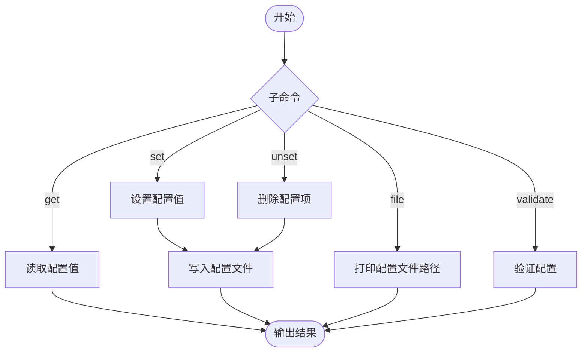
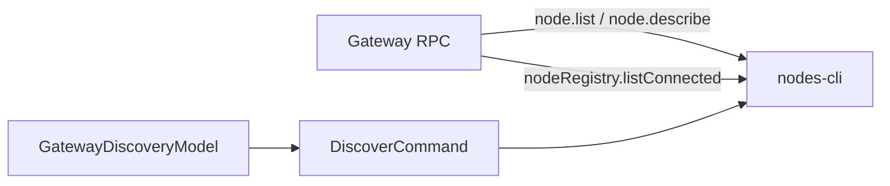
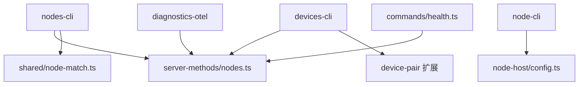
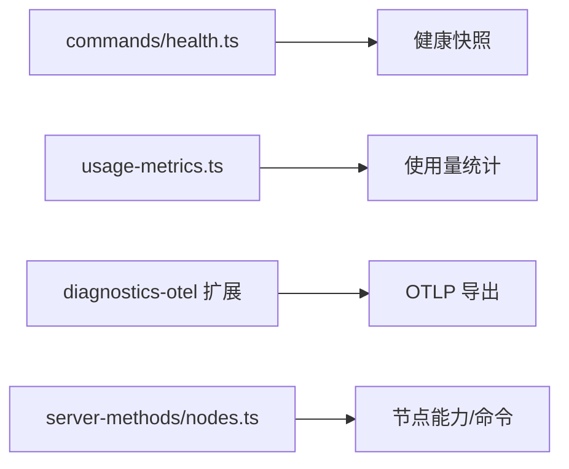

# 节点管理命令

## 目录
1. [简介](#简介)
2. [项目结构](#项目结构)
3. [核心组件](#核心组件)
4. [架构总览](#架构总览)
5. [详细组件分析](#详细组件分析)
6. [依赖关系分析](#依赖关系分析)
7. [性能与监控](#性能与监控)
8. [故障排查指南](#故障排查指南)
9. [结论](#结论)
10. [附录](#附录)

## 简介
本文件系统性梳理 OpenClaw 的节点管理命令体系，覆盖以下能力：
- 节点发现、连接与控制：通过 nodes-cli 命令族实现节点状态查询、配对审批、远程执行与媒体能力调用。
- 设备管理：通过 devices-cli 实现设备配对请求的查看、批准、拒绝、令牌轮换与吊销，并支持本地回退模式。
- 节点生命周期管理：通过 node-cli 提供 headless 节点主机的运行、安装、停止、重启与状态查询。
- 配置文件编辑与验证：通过 config-cli 对配置进行路径化读写、校验与打开配置向导。
- 节点间通信、网络发现与拓扑：结合网关 RPC、节点注册表与本地匹配逻辑，支撑节点发现与拓扑展示。
- 性能监控、资源统计与诊断：提供健康快照、使用量统计与可观测性扩展。
- 批量操作、自动化部署与集群管理：通过 CLI 与服务化节点主机实现批量与自动化运维。
- 跨平台最佳实践与安全配置：涵盖权限、证书指纹、审计与安全建议。

## 项目结构
OpenClaw 的节点管理相关代码主要分布在 CLI 层、网关服务端方法、节点主机与平台发现模块中：
- CLI 层：nodes-cli、devices-cli、node-cli、config-cli 提供命令行入口与子命令。
- 网关层：server-methods/nodes.ts 定义节点列表、描述等 RPC 方法。
- 节点主机：node-host/config.ts 管理节点主机配置持久化。
- 平台发现：macOS 平台的网关发现模型与 CLI 发现命令。
- 设备配对：extensions/device-pair 与 UI 控制器实现配对流程与通知。
- 安全审计：security/audit 与 audit-extra.async 提供配置与文件系统安全检查。
- 监控与诊断：commands/health、ui/views/usage-metrics、extensions/diagnostics-otel 提供健康与可观测性能力。

**图表来源**
- [src/cli/nodes-cli/register.ts](file://src/cli/nodes-cli/register.ts#L15-L39)
- [src/cli/devices-cli.ts](file://src/cli/devices-cli.ts#L213-L453)
- [src/cli/node-cli/register.ts](file://src/cli/node-cli/register.ts#L21-L110)
- [src/cli/config-cli.ts](file://src/cli/config-cli.ts#L232-L244)
- [src/gateway/server-methods/nodes.ts](file://src/gateway/server-methods/nodes.ts#L599-L644)
- [src/node-host/config.ts](file://src/node-host/config.ts#L56-L66)
- [apps/macos/Sources/OpenClawDiscovery/GatewayDiscoveryModel.swift](file://apps/macos/Sources/OpenClawDiscovery/GatewayDiscoveryModel.swift#L38-L66)
- [apps/macos/Sources/OpenClawMacCLI/DiscoverCommand.swift](file://apps/macos/Sources/OpenClawMacCLI/DiscoverCommand.swift#L1-L55)
- [extensions/device-pair/index.ts](file://extensions/device-pair/index.ts#L364-L399)
- [extensions/device-pair/notify.ts](file://extensions/device-pair/notify.ts#L427-L460)
- [ui/src/ui/controllers/devices.ts](file://ui/src/ui/controllers/devices.ts#L48-L103)
- [src/commands/health.ts](file://src/commands/health.ts#L348-L375)
- [ui/src/ui/views/usage-metrics.ts](file://ui/src/ui/views/usage-metrics.ts#L407-L431)
- [extensions/diagnostics-otel/src/service.ts](file://extensions/diagnostics-otel/src/service.ts#L78-L587)

**章节来源**
- [src/cli/nodes-cli/register.ts](file://src/cli/nodes-cli/register.ts#L15-L39)
- [src/cli/devices-cli.ts](file://src/cli/devices-cli.ts#L213-L453)
- [src/cli/node-cli/register.ts](file://src/cli/node-cli/register.ts#L21-L110)
- [src/cli/config-cli.ts](file://src/cli/config-cli.ts#L232-L244)
- [src/gateway/server-methods/nodes.ts](file://src/gateway/server-methods/nodes.ts#L599-L644)
- [src/node-host/config.ts](file://src/node-host/config.ts#L56-L66)
- [apps/macos/Sources/OpenClawDiscovery/GatewayDiscoveryModel.swift](file://apps/macos/Sources/OpenClawDiscovery/GatewayDiscoveryModel.swift#L38-L66)
- [apps/macos/Sources/OpenClawMacCLI/DiscoverCommand.swift](file://apps/macos/Sources/OpenClawMacCLI/DiscoverCommand.swift#L1-L55)
- [extensions/device-pair/index.ts](file://extensions/device-pair/index.ts#L364-L399)
- [extensions/device-pair/notify.ts](file://extensions/device-pair/notify.ts#L427-L460)
- [ui/src/ui/controllers/devices.ts](file://ui/src/ui/controllers/devices.ts#L48-L103)
- [src/commands/health.ts](file://src/commands/health.ts#L348-L375)
- [ui/src/ui/views/usage-metrics.ts](file://ui/src/ui/views/usage-metrics.ts#L407-L431)
- [extensions/diagnostics-otel/src/service.ts](file://extensions/diagnostics-otel/src/service.ts#L78-L587)

## 核心组件
- nodes-cli：节点状态、配对、远程执行与媒体能力调用的统一入口，支持过滤与表格输出。
- devices-cli：设备配对请求的列表、批准、拒绝、清除、令牌轮换与吊销，支持本地回退。
- node-cli：headless 节点主机的运行、安装、停止、重启与状态查询，支持 TLS 与证书指纹校验。
- config-cli：配置路径式读取、设置、删除、打印与验证，支持严格 JSON5 解析。
- 网关 RPC：提供节点列表、描述、配对等方法，配合节点注册表与设备配对存储。
- 节点主机配置：负责节点主机配置的加载、规范化与原子写入。
- 平台发现：macOS 端的网关发现模型与 CLI 发现命令，支持超时与本地包含选项。
- 设备配对扩展与通知：实现配对请求的自动轮询与通知服务。
- 监控与诊断：健康快照、使用量统计与 OTLP 可观测性导出。

**章节来源**
- [src/cli/nodes-cli.ts](file://src/cli/nodes-cli.ts#L1-L1)
- [src/cli/devices-cli.ts](file://src/cli/devices-cli.ts#L1-L454)
- [src/cli/node-cli/register.ts](file://src/cli/node-cli/register.ts#L1-L111)
- [src/cli/config-cli.ts](file://src/cli/config-cli.ts#L209-L259)
- [src/gateway/server-methods/nodes.ts](file://src/gateway/server-methods/nodes.ts#L599-L644)
- [src/node-host/config.ts](file://src/node-host/config.ts#L56-L66)
- [apps/macos/Sources/OpenClawDiscovery/GatewayDiscoveryModel.swift](file://apps/macos/Sources/OpenClawDiscovery/GatewayDiscoveryModel.swift#L38-L66)
- [apps/macos/Sources/OpenClawMacCLI/DiscoverCommand.swift](file://apps/macos/Sources/OpenClawMacCLI/DiscoverCommand.swift#L1-L55)
- [extensions/device-pair/index.ts](file://extensions/device-pair/index.ts#L364-L399)
- [extensions/device-pair/notify.ts](file://extensions/device-pair/notify.ts#L427-L460)
- [ui/src/ui/controllers/devices.ts](file://ui/src/ui/controllers/devices.ts#L48-L103)
- [src/commands/health.ts](file://src/commands/health.ts#L348-L375)
- [ui/src/ui/views/usage-metrics.ts](file://ui/src/ui/views/usage-metrics.ts#L407-L431)
- [extensions/diagnostics-otel/src/service.ts](file://extensions/diagnostics-otel/src/service.ts#L78-L587)

## 架构总览
下图展示了节点管理命令在系统中的交互关系：CLI 将用户输入解析为 RPC 调用或本地操作；网关侧提供节点与设备配对的 RPC 方法；节点主机负责承载节点能力（如 system.run）；平台发现模块辅助网关发现；设备配对扩展与通知服务贯穿审批流程；监控与诊断模块提供健康与可观测性。

**图表来源**
- [src/cli/nodes-cli/register.status.ts](file://src/cli/nodes-cli/register.status.ts#L100-L295)
- [src/cli/devices-cli.ts](file://src/cli/devices-cli.ts#L213-L453)
- [src/cli/node-cli/register.ts](file://src/cli/node-cli/register.ts#L21-L110)
- [apps/macos/Sources/OpenClawMacCLI/DiscoverCommand.swift](file://apps/macos/Sources/OpenClawMacCLI/DiscoverCommand.swift#L1-L55)

## 详细组件分析

### nodes-cli：节点发现、连接与控制
- 命令组织：nodes 子命令聚合状态、配对、远程执行、媒体能力等子命令。
- 节点状态：支持仅显示已连接节点、按最近连接时间过滤；输出节点 ID、名称、IP、设备型号、权限、版本、状态、能力与命令清单。
- 节点解析：通过 node.list 或 node.pair.list 获取候选节点，再基于 nodeId、displayName、IP 或前缀匹配解析目标节点。
- 远程执行：支持 invoke 与 run 两种风格，run 支持 exec 默认行为、工作目录、环境变量、超时、屏幕录制权限要求、代理与安全策略覆盖。
- 媒体能力：包含摄像头拍照、画布能力刷新、屏幕截图等子命令入口。

**图表来源**
- [src/cli/nodes-cli/rpc.ts](file://src/cli/nodes-cli/rpc.ts#L75-L96)
- [src/cli/nodes-cli/register.status.ts](file://src/cli/nodes-cli/register.status.ts#L100-L295)
- [src/gateway/server-methods/nodes.ts](file://src/gateway/server-methods/nodes.ts#L599-L644)
- [src/shared/node-match.ts](file://src/shared/node-match.ts#L23-L55)

**章节来源**
- [src/cli/nodes-cli/register.ts](file://src/cli/nodes-cli/register.ts#L15-L39)
- [src/cli/nodes-cli/register.status.ts](file://src/cli/nodes-cli/register.status.ts#L100-L295)
- [src/cli/nodes-cli/rpc.ts](file://src/cli/nodes-cli/rpc.ts#L75-L96)
- [src/gateway/server-methods/nodes.ts](file://src/gateway/server-methods/nodes.ts#L599-L644)
- [src/shared/node-match.ts](file://src/shared/node-match.ts#L23-L55)
- [docs/cli/nodes.md](file://docs/cli/nodes.md#L25-L76)

### devices-cli：设备配对、认证与状态监控
- 列表：展示待批准与已配对设备，支持 JSON 输出；当缺少配对权限且满足本地回退条件时，自动切换到本地配对文件。
- 批准/拒绝：支持按 requestId 明确批准或选择最新请求；拒绝请求。
- 清除：批量移除已配对设备，可选同时拒绝待批准请求。
- 令牌管理：按角色轮换令牌（可更新作用域），或吊销令牌。
- 权限与安全：需要 operator.pairing 或 operator.admin；clear 需要显式确认；本地回退仅在特定条件下启用。

**图表来源**
- [src/cli/devices-cli.ts](file://src/cli/devices-cli.ts#L129-L145)
- [src/cli/devices-cli.ts](file://src/cli/devices-cli.ts#L147-L169)
- [extensions/device-pair/index.ts](file://extensions/device-pair/index.ts#L364-L399)
- [ui/src/ui/controllers/devices.ts](file://ui/src/ui/controllers/devices.ts#L48-L103)

**章节来源**
- [src/cli/devices-cli.ts](file://src/cli/devices-cli.ts#L213-L453)
- [extensions/device-pair/index.ts](file://extensions/device-pair/index.ts#L364-L399)
- [extensions/device-pair/notify.ts](file://extensions/device-pair/notify.ts#L427-L460)
- [ui/src/ui/controllers/devices.ts](file://ui/src/ui/controllers/devices.ts#L48-L103)
- [docs/cli/devices.md](file://docs/cli/devices.md#L15-L95)

### node-cli：节点生命周期管理
- 运行：前台运行节点主机，支持指定网关主机、端口、TLS 与证书指纹校验、节点 ID 与显示名覆盖。
- 服务：安装/卸载/停止/重启节点主机服务，支持运行时选择与强制覆盖。
- 状态：查询节点主机服务状态，支持 JSON 输出。
- 认证：从环境变量与配置解析网关认证参数，优先 OPENCLAW_GATEWAY_*，其次本地配置，最后远程配置。

**图表来源**
- [src/cli/node-cli/register.ts](file://src/cli/node-cli/register.ts#L21-L110)
- [src/node-host/config.ts](file://src/node-host/config.ts#L56-L66)

**章节来源**
- [src/cli/node-cli/register.ts](file://src/cli/node-cli/register.ts#L21-L110)
- [docs/cli/node.md](file://docs/cli/node.md#L46-L123)

### 配置文件编辑与验证
- 路径式操作：支持 get、set、unset、file、validate 等子命令；路径支持点号与方括号表示法；值采用 JSON5 解析，可启用严格 JSON 模式。
- 验证：在不启动网关的前提下对当前配置进行模式校验，失败时输出问题与修复建议。
- 编辑建议：修改后需重启网关以生效。

**图表来源**
- [src/cli/config-cli.ts](file://src/cli/config-cli.ts#L209-L259)
- [docs/cli/config.md](file://docs/cli/config.md#L14-L69)

**章节来源**
- [src/cli/config-cli.ts](file://src/cli/config-cli.ts#L209-L259)
- [docs/cli/config.md](file://docs/cli/config.md#L14-L69)

### 节点间通信、网络发现与拓扑管理
- 节点通信：nodes-cli 通过 Gateway RPC 与节点主机通信；节点注册表维护已连接节点集合。
- 网络发现：macOS 端提供网关发现模型与 CLI 发现命令，支持超时、JSON 输出与本地网关包含。
- 拓扑管理：节点状态排序与展示由网关侧完成，CLI 侧负责过滤与渲染。

**图表来源**
- [src/gateway/server-methods/nodes.ts](file://src/gateway/server-methods/nodes.ts#L599-L644)
- [apps/macos/Sources/OpenClawDiscovery/GatewayDiscoveryModel.swift](file://apps/macos/Sources/OpenClawDiscovery/GatewayDiscoveryModel.swift#L38-L66)
- [apps/macos/Sources/OpenClawMacCLI/DiscoverCommand.swift](file://apps/macos/Sources/OpenClawMacCLI/DiscoverCommand.swift#L1-L55)

**章节来源**
- [src/gateway/server-methods/nodes.ts](file://src/gateway/server-methods/nodes.ts#L599-L644)
- [apps/macos/Sources/OpenClawDiscovery/GatewayDiscoveryModel.swift](file://apps/macos/Sources/OpenClawDiscovery/GatewayDiscoveryModel.swift#L38-L66)
- [apps/macos/Sources/OpenClawMacCLI/DiscoverCommand.swift](file://apps/macos/Sources/OpenClawMacCLI/DiscoverCommand.swift#L1-L55)

## 依赖关系分析
- nodes-cli 依赖网关 RPC 与节点匹配工具，用于解析节点与渲染状态。
- devices-cli 依赖网关 RPC 与本地配对文件，支持远端与本地回退。
- node-cli 依赖节点主机配置与服务管理工具，负责节点主机生命周期。
- 监控与诊断模块独立于 CLI，但可被网关与 UI 使用。

**图表来源**
- [src/cli/nodes-cli/register.status.ts](file://src/cli/nodes-cli/register.status.ts#L100-L295)
- [src/cli/devices-cli.ts](file://src/cli/devices-cli.ts#L129-L145)
- [src/cli/node-cli/register.ts](file://src/cli/node-cli/register.ts#L21-L110)
- [src/gateway/server-methods/nodes.ts](file://src/gateway/server-methods/nodes.ts#L599-L644)
- [src/shared/node-match.ts](file://src/shared/node-match.ts#L23-L55)
- [src/node-host/config.ts](file://src/node-host/config.ts#L56-L66)
- [extensions/diagnostics-otel/src/service.ts](file://extensions/diagnostics-otel/src/service.ts#L78-L587)
- [src/commands/health.ts](file://src/commands/health.ts#L348-L375)

**章节来源**
- [src/cli/nodes-cli/register.status.ts](file://src/cli/nodes-cli/register.status.ts#L100-L295)
- [src/cli/devices-cli.ts](file://src/cli/devices-cli.ts#L129-L145)
- [src/cli/node-cli/register.ts](file://src/cli/node-cli/register.ts#L21-L110)
- [src/gateway/server-methods/nodes.ts](file://src/gateway/server-methods/nodes.ts#L599-L644)
- [src/shared/node-match.ts](file://src/shared/node-match.ts#L23-L55)
- [src/node-host/config.ts](file://src/node-host/config.ts#L56-L66)
- [extensions/diagnostics-otel/src/service.ts](file://extensions/diagnostics-otel/src/service.ts#L78-L587)
- [src/commands/health.ts](file://src/commands/health.ts#L348-L375)

## 性能与监控
- 健康快照：聚合通道、会话、心跳与代理探针信息，支持超时与错误描述。
- 使用量统计：按提供商、代理与渠道聚合使用计数与延迟，便于资源统计。
- 可观测性：OTLP 导出支持 traces、metrics、logs，采样率与服务名可配置。
- 节点能力：节点描述返回能力与命令清单，便于评估节点能力与负载。

**图表来源**
- [src/commands/health.ts](file://src/commands/health.ts#L348-L375)
- [apps/macos/Sources/OpenClaw/HealthStore.swift](file://apps/macos/Sources/OpenClaw/HealthStore.swift#L147-L163)
- [ui/src/ui/views/usage-metrics.ts](file://ui/src/ui/views/usage-metrics.ts#L407-L431)
- [extensions/diagnostics-otel/src/service.ts](file://extensions/diagnostics-otel/src/service.ts#L78-L587)
- [src/gateway/server-methods/nodes.ts](file://src/gateway/server-methods/nodes.ts#L617-L644)

**章节来源**
- [src/commands/health.ts](file://src/commands/health.ts#L348-L375)
- [apps/macos/Sources/OpenClaw/HealthStore.swift](file://apps/macos/Sources/OpenClaw/HealthStore.swift#L147-L163)
- [ui/src/ui/views/usage-metrics.ts](file://ui/src/ui/views/usage-metrics.ts#L407-L431)
- [extensions/diagnostics-otel/src/service.ts](file://extensions/diagnostics-otel/src/service.ts#L78-L587)
- [src/gateway/server-methods/nodes.ts](file://src/gateway/server-methods/nodes.ts#L617-L644)

## 故障排查指南
- 配置文件权限：确保配置文件与包含文件权限最小化，避免世界可读写；审计报告提供修复建议。
- 设备配对：若远端不可用，CLI 可回退到本地配对文件；注意明确凭据传递。
- TLS 与证书：节点主机支持 TLS 与证书指纹校验，确保连接安全。
- 健康检查：通道探针超时或失败时，健康快照会给出具体原因与耗时；根据提示定位问题。
- 令牌安全：轮换与吊销令牌时注意敏感性，遵循最小权限原则。

**章节来源**
- [src/security/audit.ts](file://src/security/audit.ts#L307-L343)
- [src/security/audit-extra.async.ts](file://src/security/audit-extra.async.ts#L915-L981)
- [src/cli/devices-cli.ts](file://src/cli/devices-cli.ts#L100-L119)
- [src/cli/node-cli/register.ts](file://src/cli/node-cli/register.ts#L48-L60)
- [apps/macos/Sources/OpenClaw/HealthStore.swift](file://apps/macos/Sources/OpenClaw/HealthStore.swift#L147-L163)

## 结论
OpenClaw 的节点管理命令体系围绕 CLI、网关 RPC、节点主机与平台发现构建，形成完整的节点发现、配对、执行与监控闭环。通过 devices-cli 与 node-cli 实现设备与节点主机的生命周期管理，通过 nodes-cli 提供节点状态与能力的可视化与远程执行能力。配合健康快照、使用量统计与 OTLP 可观测性，能够有效支撑节点性能监控与故障诊断。安全方面，通过权限审计、TLS 与证书指纹、令牌轮换与吊销等机制保障系统安全。

## 附录
- 常用命令参考
  - 节点状态与配对：nodes status、nodes pending、nodes approve、nodes list
  - 远程执行：nodes invoke、nodes run
  - 设备管理：devices list、devices approve、devices reject、devices clear、devices rotate、devices revoke
  - 节点主机：node run、node install、node stop、node restart、node status
  - 配置：config file、config get、config set、config unset、config validate
- 最佳实践
  - 使用 TLS 与证书指纹校验节点主机连接。
  - 严格控制设备令牌作用域，定期轮换。
  - 通过健康快照与使用量统计持续监控节点性能。
  - 在多节点环境中，利用节点能力与命令清单进行任务路由与负载均衡。