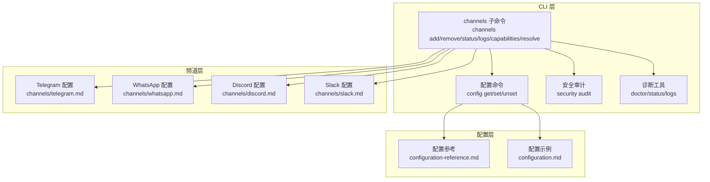
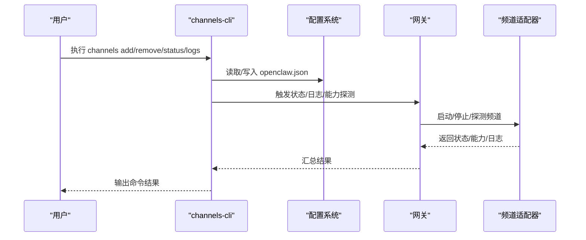
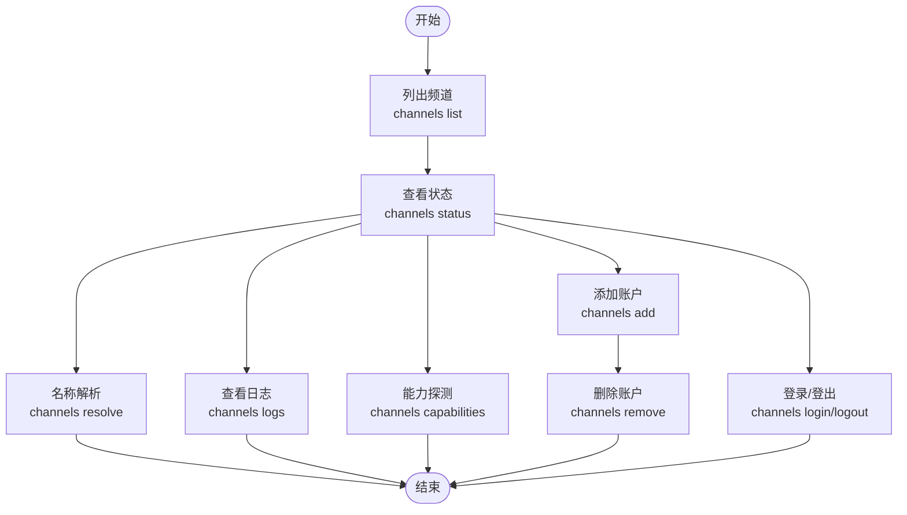
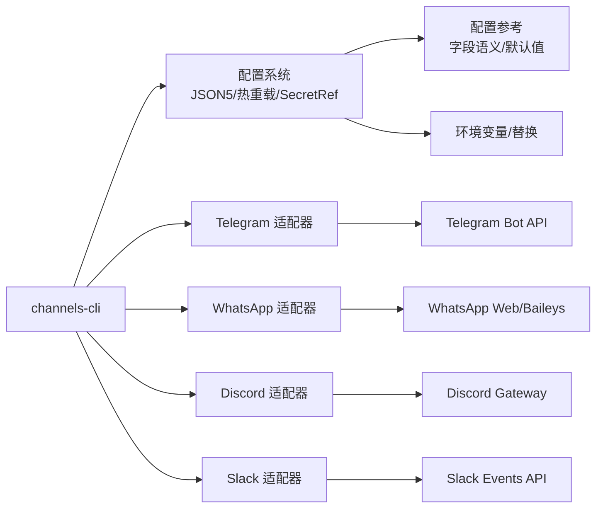

# 频道配置命令

## 目录
1. [简介](#简介)
2. [项目结构](#项目结构)
3. [核心组件](#核心组件)
4. [架构总览](#架构总览)
5. [详细组件分析](#详细组件分析)
6. [依赖关系分析](#依赖关系分析)
7. [性能考虑](#性能考虑)
8. [故障排除指南](#故障排除指南)
9. [结论](#结论)
10. [附录](#附录)

## 简介
本文件系统化梳理 OpenClaw 的频道配置命令与操作流程，围绕 channels-cli 命令族展开，覆盖添加/删除/修改频道账户、登录/登出、能力探测、名称解析、日志查看、状态查询、绑定/解绑、连接测试与验证、权限与安全策略、以及批量配置与模板使用等主题。文档同时结合各频道（Telegram、WhatsApp、Discord、Slack 等）的配置要点与认证方式，帮助用户在多频道场景下实现稳定、可审计、可扩展的运行时配置。

## 项目结构
- CLI 文档：channels.md 提供 channels 子命令的使用说明与最佳实践。
- 频道指南：各频道独立文档（Telegram、WhatsApp、Discord、Slack 等）详述接入步骤、认证方式、访问控制、功能特性与排障。
- 配置体系：configuration.md 与 configuration-reference.md 提供通用配置模型、字段语义、热重载与环境变量、SecretRef 凭证注入等。
- 安全与排障：security.md 提供安全审计与修复建议；channels/troubleshooting.md 提供快速诊断清单。

**图示来源**
- [docs/cli/channels.md](file://docs/cli/channels.md#L1-L102)
- [docs/gateway/configuration.md](file://docs/gateway/configuration.md#L1-L547)
- [docs/gateway/configuration-reference.md](file://docs/gateway/configuration-reference.md#L1-L200)

**章节来源**
- [docs/cli/channels.md](file://docs/cli/channels.md#L1-L102)
- [docs/gateway/configuration.md](file://docs/gateway/configuration.md#L1-L547)

## 核心组件
- channels 子命令族：用于管理聊天频道账户、运行状态、日志与能力探测。
- 配置系统：支持 JSON5、热重载、环境变量注入、SecretRef 凭证引用、$include 多文件组织。
- 频道适配器：各频道（Telegram、WhatsApp、Discord、Slack 等）的接入参数、认证令牌、访问控制策略与功能开关。
- 安全与审计：安全审计命令与排障流程，保障凭据安全与运行稳健。

**章节来源**
- [docs/cli/channels.md](file://docs/cli/channels.md#L18-L102)
- [docs/gateway/configuration.md](file://docs/gateway/configuration.md#L349-L547)
- [docs/gateway/configuration-reference.md](file://docs/gateway/configuration-reference.md#L18-L92)

## 架构总览
channels-cli 在“配置层—频道层—网关层”的协作中发挥作用：
- 配置层：通过 openclaw.json 或交互式向导生成/更新配置；支持热重载与 SecretRef 注入。
- 频道层：各频道按配置启动，执行登录/登出、能力探测、名称解析、日志采集与状态上报。
- 网关层：承载频道进程、路由消息、执行工具动作、维护会话与线程绑定。

**图示来源**
- [docs/cli/channels.md](file://docs/cli/channels.md#L18-L102)
- [docs/gateway/configuration.md](file://docs/gateway/configuration.md#L349-L547)

## 详细组件分析

### channels 子命令详解
- 列表与状态
  - 列出已配置频道与账户：openclaw channels list
  - 查看频道运行状态与能力：openclaw channels status、openclaw channels capabilities
  - 日志查看：openclaw channels logs --channel all
- 添加/删除账户
  - 添加：openclaw channels add --channel &lt;provider&gt; [flags]
  - 删除：openclaw channels remove --channel &lt;provider&gt; [--delete]
  - 交互式向导：无 flags 时触发，支持账户 ID、显示名、即时绑定到代理等
- 登录/登出（交互）
  - openclaw channels login --channel &lt;provider&gt;
  - openclaw channels logout --channel &lt;provider&gt;
- 能力探测与名称解析
  - openclaw channels capabilities [--channel &lt;provider&gt; --target &lt;id&gt;]
  - openclaw channels resolve --channel &lt;provider&gt; &lt;targets...>

**图示来源**
- [docs/cli/channels.md](file://docs/cli/channels.md#L18-L102)

**章节来源**
- [docs/cli/channels.md](file://docs/cli/channels.md#L18-L102)

### 频道类型与认证方式
- Telegram
  - 认证：botToken（或 tokenFile），支持 SecretRef；默认无需 login
  - 访问控制：dmPolicy（pairing/allowlist/open/disabled）、allowFrom；群组策略 groupPolicy、groupAllowFrom、groups.*
  - 功能：内联按钮能力、命令菜单、流式预览、媒体大小限制、网络代理、webhook
- WhatsApp
  - 认证：QR 登录；支持多账户；自聊天保护与自定义响应前缀
  - 访问控制：dmPolicy、allowFrom、groupPolicy、groupAllowFrom、groups
  - 运行行为：自聊天跳过已读回执、历史上下文注入、媒体占位符与位置/联系人提取
- Discord
  - 认证：Bot Token（Socket Mode 默认需 appToken + botToken；HTTP 模式需 signingSecret）
  - 访问控制：dmPolicy、allowFrom、guilds.*、channels.*、requireMention、ignoreOtherMentions
  - 功能：组件容器、线程绑定、语音通道、自动状态、反应通知、动作门控
- Slack
  - 认证：Socket Mode（appToken + botToken）或 HTTP（botToken + signingSecret）
  - 访问控制：dmPolicy、allowFrom、channels.*、requireMention、users 允许列表
  - 功能：文本流式传输（Agents and AI Apps）、线程历史、回复标签、动作门控

**章节来源**
- [docs/channels/telegram.md](file://docs/channels/telegram.md#L1-L948)
- [docs/channels/whatsapp.md](file://docs/channels/whatsapp.md#L1-L446)
- [docs/channels/discord.md](file://docs/channels/discord.md#L1-L1223)
- [docs/channels/slack.md](file://docs/channels/slack.md#L1-L555)

### 权限管理与访问控制
- 通用 DM 策略
  - pairing：未知发送者需一次性配对码批准
  - allowlist：仅允许 allowFrom 中的发送者（或已配对存储）
  - open：允许所有 DM（需 allowFrom 包含 "*"）
  - disabled：忽略所有 DM
- 群组策略
  - allowlist（默认）：仅允许白名单中的群组
  - open：绕过群组白名单（仍受提及/回复激活约束）
  - disabled：阻止所有群组/房间消息
- 平台差异
  - Discord 支持 guilds.*.users 与 roles 双维度允许列表，支持 ignoreOtherMentions
  - Slack 支持 per-channel users 与 requireMention，支持 thread 历史作用域
  - Telegram 支持 per-group/per-topic 继承与覆盖，支持 mentionPatterns

**章节来源**
- [docs/gateway/configuration-reference.md](file://docs/gateway/configuration-reference.md#L22-L92)
- [docs/channels/discord.md](file://docs/channels/discord.md#L368-L460)
- [docs/channels/slack.md](file://docs/channels/slack.md#L136-L205)
- [docs/channels/telegram.md](file://docs/channels/telegram.md#L105-L220)

### 频道绑定、解绑与状态查询
- 绑定/解绑
  - 使用 agents bindings、agents bind、agents unbind 管理路由规则（channels add 也可在交互模式下选择绑定）
  - Discord/Telegram 支持持久化 ACP 绑定（top-level bindings[] + match.channel/match.peer）
- 状态查询
  - channels status：查看频道运行状态与降级提示
  - channels status --probe：探测权限与成员资格（部分频道/目标）
  - channels capabilities：能力探测（意图/范围/静态特性）

**章节来源**
- [docs/cli/channels.md](file://docs/cli/channels.md#L29-L102)
- [docs/channels/discord.md](file://docs/channels/discord.md#L688-L751)
- [docs/channels/telegram.md](file://docs/channels/telegram.md#L472-L541)

### 测试连接与配置验证
- 快速检查命令梯度
  - openclaw status → openclaw gateway status → openclaw logs --follow → openclaw doctor → openclaw channels status --probe
- 针对性验证
  - Telegram：隐私模式、群组可见性、setMyCommands 成功与否
  - Discord：Intent 启用、权限校验、线程绑定可用性
  - Slack：Socket/HTTP 模式、签名密钥、事件订阅路径唯一性
  - WhatsApp：QR 登录、重连循环、历史上下文注入

**章节来源**
- [docs/channels/troubleshooting.md](file://docs/channels/troubleshooting.md#L13-L118)
- [docs/channels/telegram.md](file://docs/channels/telegram.md#L793-L858)
- [docs/channels/discord.md](file://docs/channels/discord.md#L1069-L1185)
- [docs/channels/slack.md](file://docs/channels/slack.md#L433-L490)
- [docs/channels/whatsapp.md](file://docs/channels/whatsapp.md#L374-L424)

### 配置管理与安全
- 配置编辑方式
  - 交互式向导：openclaw onboard、openclaw configure
  - CLI 单行：openclaw config get/set/unset
  - 控制 UI：本地 http://127.0.0.1:18789
  - 直接编辑：~/.openclaw/openclaw.json，支持热重载
- 环境变量与 SecretRef
  - 环境变量优先级与替换语法
  - SecretRef 支持 env/file/exec 三种来源，覆盖敏感字段
- 安全审计
  - openclaw security audit：检测共享用户风险、沙箱配置、工具策略、网关暴露等
  - --fix 应用安全修复（不旋转密钥/禁用工具/变更网关暴露）

**章节来源**
- [docs/gateway/configuration.md](file://docs/gateway/configuration.md#L36-L547)
- [docs/cli/security.md](file://docs/cli/security.md#L17-L72)

### 批量配置与模板使用
- $include 多文件组织
  - 支持单文件替换、数组深合并、嵌套 include（最多 10 层）、相对路径解析
  - 适用于将 agents、broadcast、客户端配置拆分管理
- 交互式向导
  - openclaw onboard 与 openclaw configure 提供“所见即所得”的配置生成体验
- 配置示例
  - configuration.md 提供最小配置、模型选择、会话与心跳、钩子、多代理路由等常用任务模板

**章节来源**
- [docs/gateway/configuration.md](file://docs/gateway/configuration.md#L325-L347)
- [docs/gateway/configuration.md](file://docs/gateway/configuration.md#L26-L35)

## 依赖关系分析
- channels-cli 依赖配置系统与网关 RPC；配置系统依赖 SecretRef 与环境变量注入；各频道适配器依赖平台 API（Bot Token、App Token、Signing Secret、QR 登录等）。
- 频间耦合点
  - 通用 DM/群组策略在 configuration-reference.md 中统一定义
  - 平台特定字段在各频道文档中定义，遵循 configuration-reference.md 的命名与语义

**图示来源**
- [docs/gateway/configuration-reference.md](file://docs/gateway/configuration-reference.md#L18-L92)
- [docs/channels/telegram.md](file://docs/channels/telegram.md#L1-L948)
- [docs/channels/whatsapp.md](file://docs/channels/whatsapp.md#L1-L446)
- [docs/channels/discord.md](file://docs/channels/discord.md#L1-L1223)
- [docs/channels/slack.md](file://docs/channels/slack.md#L1-L555)

**章节来源**
- [docs/gateway/configuration-reference.md](file://docs/gateway/configuration-reference.md#L18-L92)

## 性能考虑
- 热重载与重启策略
  - hybrid 模式：安全变更即时生效，关键变更自动重启
  - hot/restart/off 模式可按需调整
- 平台级优化
  - Telegram：长轮询/Webhook、媒体上限、网络代理、DNS 家族选择
  - Discord：事件队列监听超时、入站工作线程运行超时、线程绑定、语音 DAVE 加密与容错
  - Slack：文本流式传输（Agents and AI Apps）、线程历史作用域、动作门控
  - WhatsApp：文本分片、媒体上限、自聊天读回执跳过、历史上下文注入

**章节来源**
- [docs/gateway/configuration.md](file://docs/gateway/configuration.md#L349-L388)
- [docs/channels/telegram.md](file://docs/channels/telegram.md#L704-L762)
- [docs/channels/discord.md](file://docs/channels/discord.md#L1114-L1149)
- [docs/channels/slack.md](file://docs/channels/slack.md#L492-L532)
- [docs/channels/whatsapp.md](file://docs/channels/whatsapp.md#L292-L316)

## 故障排除指南
- 快速命令梯度
  - openclaw status → openclaw gateway status → openclaw logs --follow → openclaw doctor → openclaw channels status --probe
- 平台签名与修复
  - Telegram：隐私模式、@mention、DNS/IPv6/代理到 api.telegram.org
  - Discord：Intent、权限、线程绑定、语音解密失败自动重连
  - Slack：Socket/HTTP 模式、签名密钥、事件订阅路径唯一性
  - WhatsApp：QR 登录、重连循环、历史上下文注入
- 安全审计
  - openclaw security audit：共享用户风险、沙箱配置、工具策略、网关暴露、mDNS 泄露等

**章节来源**
- [docs/channels/troubleshooting.md](file://docs/channels/troubleshooting.md#L13-L118)
- [docs/cli/security.md](file://docs/cli/security.md#L17-L72)

## 结论
通过 channels-cli 与配置系统的协同，OpenClaw 实现了多频道的统一接入与治理。遵循本文档的命令使用、权限设计、安全审计与排障流程，可在保证安全性与可维护性的前提下，高效完成频道的添加、修改、删除、登录/登出、能力探测、名称解析、日志查看与状态查询，并支持绑定/解绑与批量配置模板化管理。

## 附录
- 常用命令速查
  - 列表/状态/能力/解析/日志：参见 channels.md
  - 配置编辑：openclaw config get/set/unset、openclaw onboard/configure、控制 UI
  - 安全审计：openclaw security audit [--fix] [--json]
  - 排障：openclaw status/gateway status/logs/doctor/channels status --probe
- 频道能力与认证要点
  - Telegram：botToken/SecretRef、webhook、inlineButtons、commands、流式预览
  - WhatsApp：QR 登录、自聊天保护、历史上下文、媒体上限
  - Discord：Socket/HTTP、Intent、组件容器、线程绑定、语音、自动状态
  - Slack：Socket/HTTP、Agent 和 AI Apps、文本流式传输、线程历史

**章节来源**
- [docs/cli/channels.md](file://docs/cli/channels.md#L18-L102)
- [docs/gateway/configuration.md](file://docs/gateway/configuration.md#L36-L547)
- [docs/cli/security.md](file://docs/cli/security.md#L17-L72)
- [docs/channels/telegram.md](file://docs/channels/telegram.md#L862-L948)
- [docs/channels/whatsapp.md](file://docs/channels/whatsapp.md#L426-L446)
- [docs/channels/discord.md](file://docs/channels/discord.md#L1187-L1223)
- [docs/channels/slack.md](file://docs/channels/slack.md#L533-L555)