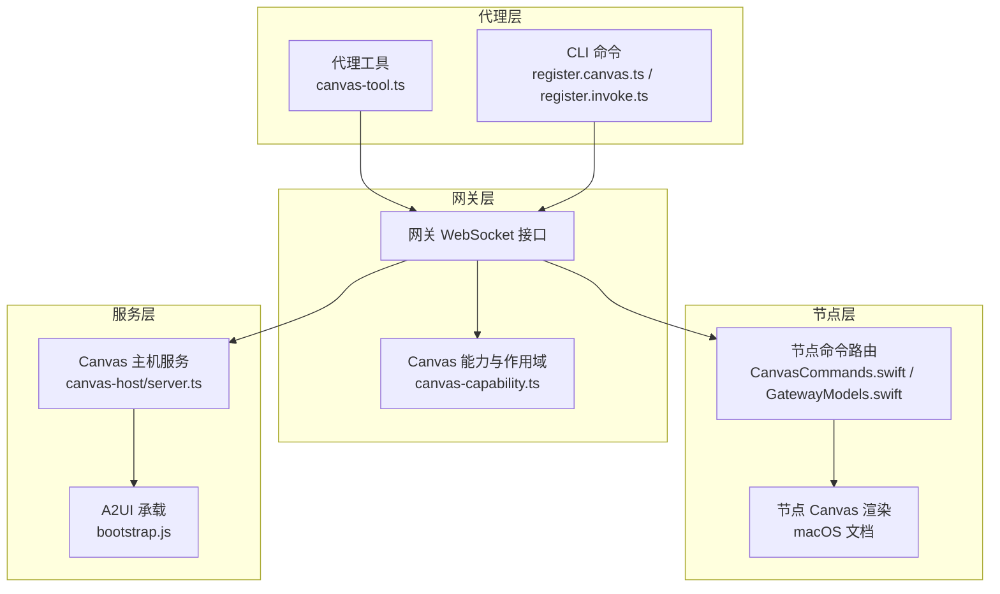
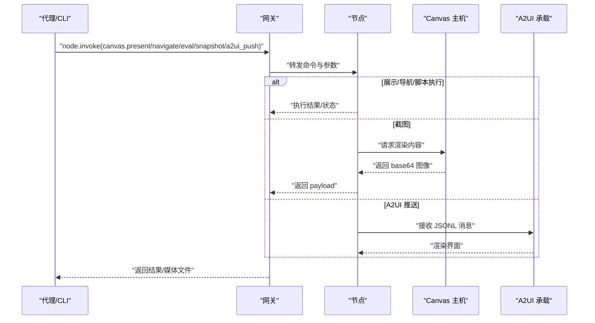
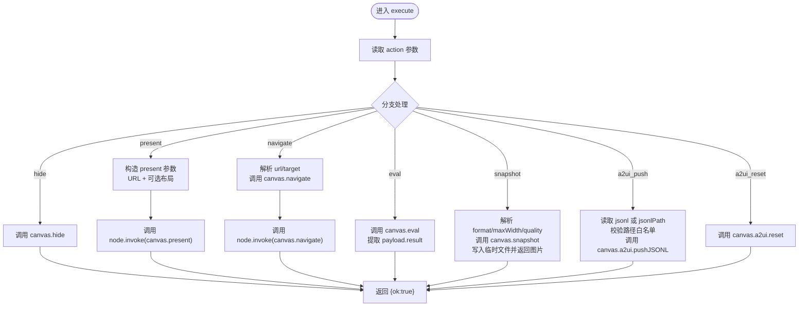
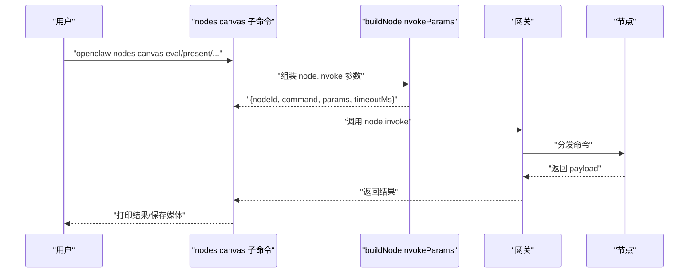
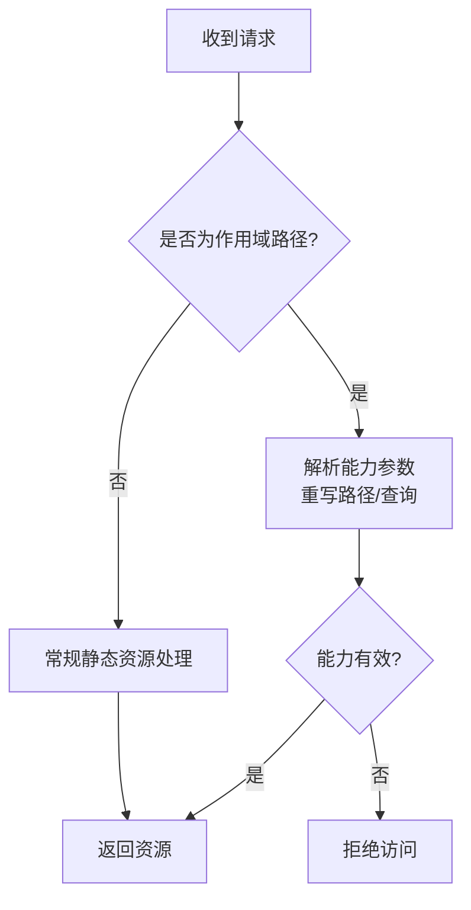
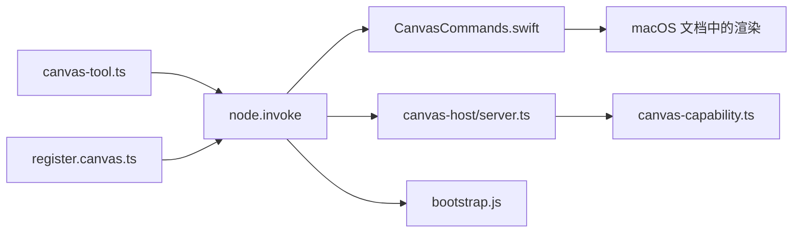

# Canvas绘图工具

## 目录
1. [简介](#简介)
2. [项目结构](#项目结构)
3. [核心组件](#核心组件)
4. [架构总览](#架构总览)
5. [组件详解](#组件详解)
6. [依赖关系分析](#依赖关系分析)
7. [性能与资源限制](#性能与资源限制)
8. [故障排查指南](#故障排查指南)
9. [结论](#结论)
10. [附录](#附录)

## 简介
本文件系统性介绍 OpenClaw Canvas 绘图工具，覆盖功能范围、参数配置、执行流程、权限与安全限制、与代理系统的集成机制（工具注册、调用链路、错误处理）、沙箱执行与资源限制、性能优化策略，并提供可操作的使用示例与最佳实践。

Canvas 工具允许代理控制连接节点（Mac、iOS、Android）上的 Canvas 视图，支持展示/隐藏/导航/脚本执行/截图/推送 A2UI 等能力。其核心由“网关命令”驱动，结合“Canvas 主机服务”和“节点桥接”实现跨平台渲染与交互。

## 项目结构
围绕 Canvas 的关键代码分布在以下模块：
- 代理侧工具定义与参数校验：src/agents/tools/canvas-tool.ts
- CLI 命令注册与调用：src/cli/nodes-cli/register.canvas.ts、src/cli/nodes-cli/register.invoke.ts
- 节点侧命令路由与协议：apps/shared/OpenClawKit/Sources/OpenClawKit/CanvasCommands.swift、apps/macos/Sources/OpenClawProtocol/GatewayModels.swift
- Canvas 主机服务与路径/能力管理：src/canvas-host/server.ts、src/gateway/canvas-capability.ts
- A2UI 承载与渲染：apps/shared/OpenClawKit/Tools/CanvasA2UI/bootstrap.js
- 平台文档与示例：docs/platforms/mac/canvas.md、skills/canvas/SKILL.md
- 截图解析与临时文件：src/cli/nodes-canvas.ts
- 行为测试与媒体结果：src/agents/pi-embedded-subscribe.handlers.tools.media.test.ts

图表来源
- [src/agents/tools/canvas-tool.ts](file://src/agents/tools/canvas-tool.ts#L80-L216)
- [src/cli/nodes-cli/register.canvas.ts](file://src/cli/nodes-cli/register.canvas.ts#L1-L189)
- [src/cli/nodes-cli/register.invoke.ts](file://src/cli/nodes-cli/register.invoke.ts#L289-L326)
- [src/gateway/canvas-capability.ts](file://src/gateway/canvas-capability.ts#L1-L88)
- [apps/shared/OpenClawKit/Sources/OpenClawKit/CanvasCommands.swift](file://apps/shared/OpenClawKit/Sources/OpenClawKit/CanvasCommands.swift#L1-L9)
- [apps/macos/Sources/OpenClawProtocol/GatewayModels.swift](file://apps/macos/Sources/OpenClawProtocol/GatewayModels.swift#L77-L123)
- [src/canvas-host/server.ts](file://src/canvas-host/server.ts#L205-L478)
- [apps/shared/OpenClawKit/Tools/CanvasA2UI/bootstrap.js](file://apps/shared/OpenClawKit/Tools/CanvasA2UI/bootstrap.js#L1-L550)

章节来源
- [src/agents/tools/canvas-tool.ts](file://src/agents/tools/canvas-tool.ts#L1-L216)
- [src/cli/nodes-cli/register.canvas.ts](file://src/cli/nodes-cli/register.canvas.ts#L1-L189)
- [src/cli/nodes-cli/register.invoke.ts](file://src/cli/nodes-cli/register.invoke.ts#L289-L326)
- [src/gateway/canvas-capability.ts](file://src/gateway/canvas-capability.ts#L1-L88)
- [apps/shared/OpenClawKit/Sources/OpenClawKit/CanvasCommands.swift](file://apps/shared/OpenClawKit/Sources/OpenClawKit/CanvasCommands.swift#L1-L9)
- [apps/macos/Sources/OpenClawProtocol/GatewayModels.swift](file://apps/macos/Sources/OpenClawProtocol/GatewayModels.swift#L77-L123)
- [src/canvas-host/server.ts](file://src/canvas-host/server.ts#L205-L478)
- [apps/shared/OpenClawKit/Tools/CanvasA2UI/bootstrap.js](file://apps/shared/OpenClawKit/Tools/CanvasA2UI/bootstrap.js#L1-L550)

## 核心组件
- 代理工具（canvas-tool.ts）
  - 定义 Canvas 动作集合（present/hide/navigate/eval/snapshot/a2ui_push/a2ui_reset）
  - 参数校验与网关调用封装
  - 截图后写入临时文件并返回图片结果
- CLI 命令（register.canvas.ts / register.invoke.ts）
  - 将用户输入映射为网关 node.invoke 请求
  - 支持超时、幂等键、审批字段透传
- 节点命令路由（CanvasCommands.swift / GatewayModels.swift）
  - 在节点侧注册 canvas.present/hide/navigate/eval/snapshot 等命令处理器
- Canvas 主机与能力（canvas-host/server.ts / canvas-capability.ts）
  - 提供静态资源服务、注入实时重载、WebSocket 广播
  - 规范化作用域 URL、生成能力令牌、构建受控访问路径
- A2UI 渲染（bootstrap.js）
  - 承载 A2UI v0.8 消息流，提供主题与状态反馈
- 截图解析（nodes-canvas.ts）
  - 解析 canvas.snapshot 返回的 payload，生成临时文件名
- 平台文档（macOS 文档）
  - 说明自定义 URL Scheme、面板行为、A2UI 默认地址与消息类型

章节来源
- [src/agents/tools/canvas-tool.ts](file://src/agents/tools/canvas-tool.ts#L18-L26)
- [src/cli/nodes-cli/register.canvas.ts](file://src/cli/nodes-cli/register.canvas.ts#L13-L26)
- [apps/shared/OpenClawKit/Sources/OpenClawKit/CanvasCommands.swift](file://apps/shared/OpenClawKit/Sources/OpenClawKit/CanvasCommands.swift#L3-L9)
- [apps/macos/Sources/OpenClawProtocol/GatewayModels.swift](file://apps/macos/Sources/OpenClawProtocol/GatewayModels.swift#L83-L84)
- [src/canvas-host/server.ts](file://src/canvas-host/server.ts#L205-L478)
- [src/gateway/canvas-capability.ts](file://src/gateway/canvas-capability.ts#L20-L40)
- [apps/shared/OpenClawKit/Tools/CanvasA2UI/bootstrap.js](file://apps/shared/OpenClawKit/Tools/CanvasA2UI/bootstrap.js#L214-L550)
- [src/cli/nodes-canvas.ts](file://src/cli/nodes-canvas.ts#L5-L25)
- [docs/platforms/mac/canvas.md](file://docs/platforms/mac/canvas.md#L44-L126)

## 架构总览
Canvas 的整体工作流如下：
- 代理通过工具或 CLI 发起 node.invoke 请求
- 网关根据目标节点路由到对应节点命令处理器
- 节点执行具体动作：展示/隐藏/导航/脚本执行/截图/A2UI 推送
- Canvas 主机提供静态资源与 A2UI 承载，必要时注入实时重载
- 能力作用域确保 URL 访问受控，避免越权

图表来源
- [src/agents/tools/canvas-tool.ts](file://src/agents/tools/canvas-tool.ts#L99-L105)
- [src/cli/nodes-cli/register.canvas.ts](file://src/cli/nodes-cli/register.canvas.ts#L13-L26)
- [apps/shared/OpenClawKit/Sources/OpenClawKit/CanvasCommands.swift](file://apps/shared/OpenClawKit/Sources/OpenClawKit/CanvasCommands.swift#L3-L9)
- [src/canvas-host/server.ts](file://src/canvas-host/server.ts#L205-L478)
- [apps/shared/OpenClawKit/Tools/CanvasA2UI/bootstrap.js](file://apps/shared/OpenClawKit/Tools/CanvasA2UI/bootstrap.js#L484-L504)

## 组件详解

### 代理工具：Canvas 工具
- 功能
  - present：在节点上展示 Canvas，支持目标 URL 与可选布局参数
  - hide：隐藏 Canvas
  - navigate：跳转到新 URL（支持 target/url 别名）
  - eval：在 Canvas 中执行 JavaScript，返回结果文本
  - snapshot：对当前渲染进行截图，支持 png/jpg 输出、最大宽度、质量、延迟
  - a2ui_push：推送 A2UI JSONL 消息，支持直接字符串或本地文件路径
  - a2ui_reset：清空 A2UI 界面
- 关键实现要点
  - 使用网关工具调用 node.invoke，携带幂等键
  - 对 snapshot 结果进行解析，写入临时文件并返回图片结果
  - 对 a2ui_push 的 jsonlPath 进行入站路径白名单校验，防止越权读取
  - 对输出格式、尺寸、质量等参数做边界检查与归一化

图表来源
- [src/agents/tools/canvas-tool.ts](file://src/agents/tools/canvas-tool.ts#L88-L216)
- [src/cli/nodes-canvas.ts](file://src/cli/nodes-canvas.ts#L10-L25)

章节来源
- [src/agents/tools/canvas-tool.ts](file://src/agents/tools/canvas-tool.ts#L80-L216)
- [src/cli/nodes-canvas.ts](file://src/cli/nodes-canvas.ts#L5-L25)

### CLI 命令：节点 Canvas 控制
- register.canvas.ts
  - 提供 canvas 子命令族：present、hide、navigate、eval、snapshot、a2ui
  - 将 CLI 输入映射为 node.invoke 请求，支持超时、幂等键
- register.invoke.ts
  - 通用 invoke 命令，支持透传审批与运行上下文

图表来源
- [src/cli/nodes-cli/register.canvas.ts](file://src/cli/nodes-cli/register.canvas.ts#L13-L26)
- [src/cli/nodes-cli/register.invoke.ts](file://src/cli/nodes-cli/register.invoke.ts#L289-L326)

章节来源
- [src/cli/nodes-cli/register.canvas.ts](file://src/cli/nodes-cli/register.canvas.ts#L1-L189)
- [src/cli/nodes-cli/register.invoke.ts](file://src/cli/nodes-cli/register.invoke.ts#L289-L326)

### 节点命令路由与协议
- CanvasCommands.swift
  - 定义节点侧可用的 Canvas 命令集合
- GatewayModels.swift
  - 描述网关握手消息中的 canvasHostUrl 字段，用于节点发现 Canvas/A2UI 承载地址

章节来源
- [apps/shared/OpenClawKit/Sources/OpenClawKit/CanvasCommands.swift](file://apps/shared/OpenClawKit/Sources/OpenClawKit/CanvasCommands.swift#L3-L9)
- [apps/macos/Sources/OpenClawProtocol/GatewayModels.swift](file://apps/macos/Sources/OpenClawProtocol/GatewayModels.swift#L83-L84)

### Canvas 主机与能力作用域
- canvas-host/server.ts
  - 创建 HTTP 服务器，提供静态资源服务
  - 自动准备默认根目录，注入实时重载 WebSocket 客户端
  - 监听目录变更并广播重载事件
- canvas-capability.ts
  - 生成能力令牌，构建带能力的作用域 URL
  - 规范化作用域 URL，剥离能力参数并重写路径

图表来源
- [src/gateway/canvas-capability.ts](file://src/gateway/canvas-capability.ts#L42-L87)
- [src/canvas-host/server.ts](file://src/canvas-host/server.ts#L205-L478)

章节来源
- [src/canvas-host/server.ts](file://src/canvas-host/server.ts#L205-L478)
- [src/gateway/canvas-capability.ts](file://src/gateway/canvas-capability.ts#L1-L88)

### A2UI 渲染与交互
- bootstrap.js
  - 承载 A2UI v0.8 消息流，维护表面（surface）与组件树
  - 处理用户动作事件，向原生桥发送 userAction
  - 提供状态提示与 Toast 反馈

章节来源
- [apps/shared/OpenClawKit/Tools/CanvasA2UI/bootstrap.js](file://apps/shared/OpenClawKit/Tools/CanvasA2UI/bootstrap.js#L214-L550)

### 截图与媒体处理
- nodes-canvas.ts
  - 解析 canvas.snapshot 返回的 payload（format/base64）
  - 生成临时文件路径，供代理侧写入 base64 数据并返回图片结果
- 行为测试
  - 验证工具执行结束时返回包含图片内容与路径的结果

章节来源
- [src/cli/nodes-canvas.ts](file://src/cli/nodes-canvas.ts#L5-L25)
- [src/agents/pi-embedded-subscribe.handlers.tools.media.test.ts](file://src/agents/pi-embedded-subscribe.handlers.tools.media.test.ts#L237-L254)

## 依赖关系分析
- 代理工具依赖网关 RPC 调用与节点命令路由
- CLI 依赖通用 RPC 组装与网关调用
- 节点侧命令路由依赖 CanvasCommands.swift 与协议模型
- Canvas 主机依赖能力作用域与实时重载机制
- A2UI 承载依赖 bootstrap.js 与节点 WebView 渲染

图表来源
- [src/agents/tools/canvas-tool.ts](file://src/agents/tools/canvas-tool.ts#L99-L105)
- [src/cli/nodes-cli/register.canvas.ts](file://src/cli/nodes-cli/register.canvas.ts#L13-L26)
- [apps/shared/OpenClawKit/Sources/OpenClawKit/CanvasCommands.swift](file://apps/shared/OpenClawKit/Sources/OpenClawKit/CanvasCommands.swift#L3-L9)
- [src/canvas-host/server.ts](file://src/canvas-host/server.ts#L205-L478)
- [src/gateway/canvas-capability.ts](file://src/gateway/canvas-capability.ts#L20-L40)
- [apps/shared/OpenClawKit/Tools/CanvasA2UI/bootstrap.js](file://apps/shared/OpenClawKit/Tools/CanvasA2UI/bootstrap.js#L484-L504)

章节来源
- [src/agents/tools/canvas-tool.ts](file://src/agents/tools/canvas-tool.ts#L80-L216)
- [src/cli/nodes-cli/register.canvas.ts](file://src/cli/nodes-cli/register.canvas.ts#L1-L189)
- [apps/shared/OpenClawKit/Sources/OpenClawKit/CanvasCommands.swift](file://apps/shared/OpenClawKit/Sources/OpenClawKit/CanvasCommands.swift#L1-L9)
- [src/canvas-host/server.ts](file://src/canvas-host/server.ts#L205-L478)
- [src/gateway/canvas-capability.ts](file://src/gateway/canvas-capability.ts#L1-L88)
- [apps/shared/OpenClawKit/Tools/CanvasA2UI/bootstrap.js](file://apps/shared/OpenClawKit/Tools/CanvasA2UI/bootstrap.js#L1-L550)

## 性能与资源限制
- 实时重载
  - Canvas 主机会监控根目录变化并通过 WebSocket 广播重载，适合开发场景
  - 当目录较大或出现文件描述符不足时，可通过配置关闭实时重载
- 资源限制
  - snapshot 支持最大宽度与质量参数，建议按需设置以平衡画质与体积
  - 入站路径白名单策略保护文件系统访问，避免越权读取
- 平台差异
  - macOS 使用自定义 URL Scheme 与 WKWebView，具备较好的本地渲染性能
  - iOS/Android 通过网关与原生桥接，注意网络与渲染环境差异

章节来源
- [src/canvas-host/server.ts](file://src/canvas-host/server.ts#L205-L478)
- [src/agents/tools/canvas-tool.ts](file://src/agents/tools/canvas-tool.ts#L30-L51)
- [docs/platforms/mac/canvas.md](file://docs/platforms/mac/canvas.md#L34-L42)

## 故障排查指南
- URL 不匹配导致白屏
  - 检查网关绑定模式与实际使用的主机名，确保使用与绑定一致的地址
- “node required”或“node not connected”
  - 确保指定正确的节点 ID，并确认节点在线
- 内容不更新
  - 检查 liveReload 是否开启、文件是否位于根目录、查看日志中是否有监视错误
- 截图为空或格式异常
  - 校验 snapshot 参数（format/maxWidth/quality），确认节点返回的 payload 正确

章节来源
- [skills/canvas/SKILL.md](file://skills/canvas/SKILL.md#L151-L180)
- [src/agents/tools/canvas-tool.ts](file://src/agents/tools/canvas-tool.ts#L162-L193)

## 结论
Canvas 绘图工具通过统一的代理工具与 CLI 接口，结合网关与节点命令路由、Canvas 主机与能力作用域，以及 A2UI 承载，实现了跨平台的可视化工作区与交互体验。遵循本文的参数配置、执行流程与安全限制，可稳定地完成图像生成、绘图操作与格式转换等任务，并在不同平台上获得一致的使用体验。

## 附录

### 使用示例与最佳实践
- 展示与导航
  - 使用 present 指定目标 URL 与布局参数；navigate 支持别名 target/url
- 脚本执行
  - eval 在 Canvas 上执行 JavaScript，返回结果文本
- 截图
  - snapshot 支持 png/jpg 输出、最大宽度与质量；建议在生产环境适当降低质量以节省带宽
- A2UI 推送
  - 使用 a2ui_push 推送 JSONL 消息；优先使用本地文件路径并确保在白名单范围内
- 平台差异
  - macOS 使用自定义 URL Scheme，iOS/Android 通过网关与原生桥接

章节来源
- [skills/canvas/SKILL.md](file://skills/canvas/SKILL.md#L48-L150)
- [docs/platforms/mac/canvas.md](file://docs/platforms/mac/canvas.md#L44-L126)