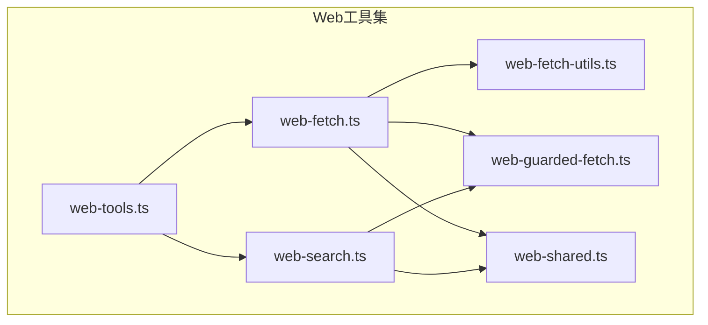
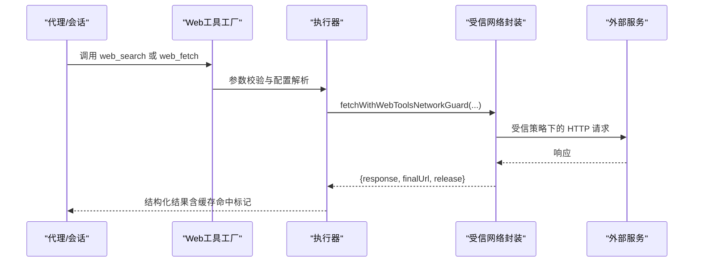
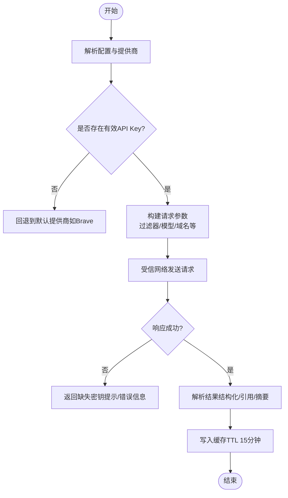
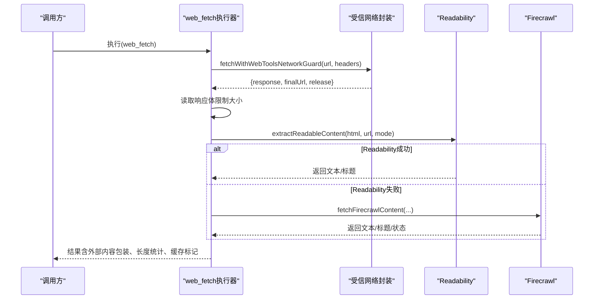
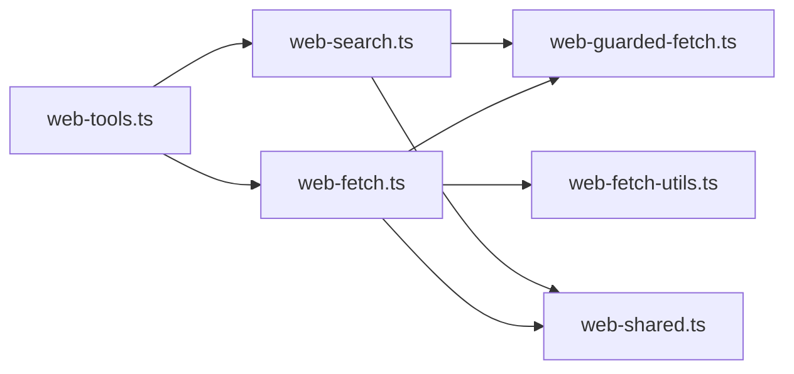

# Web工具集

## 目录
1. [简介](#简介)
2. [项目结构](#项目结构)
3. [核心组件](#核心组件)
4. [架构总览](#架构总览)
5. [详细组件分析](#详细组件分析)
6. [依赖关系分析](#依赖关系分析)
7. [性能考量](#性能考量)
8. [故障排查指南](#故障排查指南)
9. [结论](#结论)
10. [附录](#附录)

## 简介
本文件系统性阐述 OpenClaw 的 Web 工具集，覆盖网页抓取、搜索查询、内容提取等能力。文档重点说明：
- 工具功能与参数配置
- 执行流程与安全限制（含 SSRF 防护）
- 与代理系统的集成方式（受信任网络模式、环境代理）
- 沙箱执行、资源限制与性能优化策略
- 使用示例与最佳实践（HTTP 请求、数据解析、结果处理）

## 项目结构
Web 工具集位于 agents/tools 子目录，核心文件包括：
- web-tools.ts：导出 web_search 与 web_fetch 工具工厂
- web-search.ts：实现多提供商搜索（Brave、Gemini、Grok、Kimi、Perplexity）
- web-fetch.ts：实现 HTTP 抓取与可读内容提取，支持 Firecrawl 回退
- web-fetch-utils.ts：HTML 到 Markdown/文本的转换、Readability 解析、截断与可见字符清理
- web-guarded-fetch.ts：基于受信策略的网络访问封装
- web-shared.ts：缓存、超时、响应读取等共享逻辑

图表来源
- [web-tools.ts](file://src/agents/tools/web-tools.ts#L1-L3)
- [web-search.ts](file://src/agents/tools/web-search.ts#L1-L800)
- [web-fetch.ts](file://src/agents/tools/web-fetch.ts#L1-L787)
- [web-fetch-utils.ts](file://src/agents/tools/web-fetch-utils.ts#L1-L255)
- [web-guarded-fetch.ts](file://src/agents/tools/web-guarded-fetch.ts#L1-L84)
- [web-shared.ts](file://src/agents/tools/web-shared.ts#L1-L171)

章节来源
- [web-tools.ts](file://src/agents/tools/web-tools.ts#L1-L3)
- [web-search.ts](file://src/agents/tools/web-search.ts#L1-L800)
- [web-fetch.ts](file://src/agents/tools/web-fetch.ts#L1-L787)
- [web-fetch-utils.ts](file://src/agents/tools/web-fetch-utils.ts#L1-L255)
- [web-guarded-fetch.ts](file://src/agents/tools/web-guarded-fetch.ts#L1-L84)
- [web-shared.ts](file://src/agents/tools/web-shared.ts#L1-L171)

## 核心组件
- web_search：按配置选择提供商（Brave、Gemini、Grok、Kimi、Perplexity），返回结构化结果或 AI 合成答案（带引用）。
- web_fetch：对 URL 发起 HTTP 请求，优先 Readability 提取，失败则回退 Firecrawl；支持可选的用户代理、重定向限制、响应体大小限制、缓存 TTL。

章节来源
- [web.md](file://docs/tools/web.md#L1-L389)
- [web-search.ts](file://src/agents/tools/web-search.ts#L1-L800)
- [web-fetch.ts](file://src/agents/tools/web-fetch.ts#L1-L787)

## 架构总览
Web 工具通过“受信网络模式”的 guarded fetch 访问外部服务，结合本地缓存与可选的 Firecrawl 回退，确保在受限环境中稳定运行。

图表来源
- [web-guarded-fetch.ts](file://src/agents/tools/web-guarded-fetch.ts#L37-L84)
- [web-search.ts](file://src/agents/tools/web-search.ts#L1-L800)
- [web-fetch.ts](file://src/agents/tools/web-fetch.ts#L508-L684)

## 详细组件分析

### 组件A：web_search（搜索工具）
- 功能要点
  - 多提供商自动检测与路由（Brave/Gemini/Grok/Kimi/Perplexity）
  - 支持时间过滤、语言/国家筛选、Perplexity 域名过滤与内容预算控制
  - 缓存查询结果，默认 TTL 15 分钟
- 关键参数
  - query（必填）、count（1-10）、country、language、freshness、date_after/date_before、domain_filter（Perplexity 专用）、max_tokens/max_tokens_per_page（Perplexity 专用）
- 安全与配置
  - API Key 支持配置路径与环境变量两种来源，SecretRef 在启动/重载时原子解析
  - 自动检测未配置时的降级行为（默认 Brave）
- 错误处理
  - 缺失密钥时返回结构化提示与文档链接
  - 对 Perplexity 兼容路径（OpenRouter/Sonar）进行参数约束与错误提示

图表来源
- [web-search.ts](file://src/agents/tools/web-search.ts#L564-L670)
- [web-search.ts](file://src/agents/tools/web-search.ts#L786-L800)
- [web-guarded-fetch.ts](file://src/agents/tools/web-guarded-fetch.ts#L64-L84)

章节来源
- [web.md](file://docs/tools/web.md#L228-L327)
- [web-search.ts](file://src/agents/tools/web-search.ts#L1-L800)
- [web-guarded-fetch.ts](file://src/agents/tools/web-guarded-fetch.ts#L1-L84)

### 组件B：web_fetch（抓取与提取工具）
- 功能要点
  - HTTP GET 抓取，支持用户代理、Accept-Language、最大重定向次数
  - 内容提取优先 Readability，失败回退 Firecrawl（可配置 API Key、代理模式、缓存 TTL）
  - 响应体大小上限、字符截断、警告包装、缓存命中标记
- 关键参数
  - url（必填，http/https）、extractMode（markdown/text）、maxChars、readability 开关
- 安全与防护
  - 受信网络模式下进行 SSRF 防护，阻止私有/内部主机名
  - 对最终 URL 进行二次检查与重定向验证
- 错误处理
  - 非 2xx 状态码时尝试 Firecrawl 回退；均失败抛出错误并包装详细信息
  - 对 HTML 错误页进行 Markdown 化与截断，便于调试

图表来源
- [web-fetch.ts](file://src/agents/tools/web-fetch.ts#L508-L684)
- [web-fetch-utils.ts](file://src/agents/tools/web-fetch-utils.ts#L209-L255)
- [web-guarded-fetch.ts](file://src/agents/tools/web-guarded-fetch.ts#L37-L84)

章节来源
- [web.md](file://docs/tools/web.md#L328-L389)
- [web-fetch.ts](file://src/agents/tools/web-fetch.ts#L1-L787)
- [web-fetch-utils.ts](file://src/agents/tools/web-fetch-utils.ts#L1-L255)
- [web-guarded-fetch.ts](file://src/agents/tools/web-guarded-fetch.ts#L1-L84)

### 组件C：内容提取与转换（Readability/Firecrawl）
- Readability
  - 加载依赖模块，解析 HTML，应用 Readability 规则生成主内容
  - 对深度嵌套或超大 HTML 进行启发式保护，必要时回退基础转换
- Firecrawl 回退
  - 当 Readability 不可用或无内容时，按配置发起 Firecrawl 请求
  - 支持代理模式（auto/basic/stealth）、缓存与超时控制
- 文本处理
  - HTML 到 Markdown 转换、标题抽取、列表/段落规范化
  - Markdown 到纯文本转换、代码块/行内代码剥离
  - 字符串截断与不可见字符清理

章节来源
- [web-fetch-utils.ts](file://src/agents/tools/web-fetch-utils.ts#L1-L255)
- [web-fetch.ts](file://src/agents/tools/web-fetch.ts#L357-L474)

## 依赖关系分析
- 组件耦合
  - web-tools.ts 作为导出入口，聚合 web-search 与 web-fetch
  - web-search 与 web-fetch 均依赖 web-guarded-fetch 实现受信网络访问
  - web-fetch 依赖 web-fetch-utils 进行内容提取与转换，并依赖 web-shared 提供缓存与超时
- 外部依赖
  - Readability 与 linkedom（动态加载）
  - Firecrawl API（可选）
  - 浏览器工具（当网页需要 JS 渲染或登录场景）

图表来源
- [web-tools.ts](file://src/agents/tools/web-tools.ts#L1-L3)
- [web-search.ts](file://src/agents/tools/web-search.ts#L1-L800)
- [web-fetch.ts](file://src/agents/tools/web-fetch.ts#L1-L787)
- [web-fetch-utils.ts](file://src/agents/tools/web-fetch-utils.ts#L1-L255)
- [web-guarded-fetch.ts](file://src/agents/tools/web-guarded-fetch.ts#L1-L84)
- [web-shared.ts](file://src/agents/tools/web-shared.ts#L1-L171)

章节来源
- [web-tools.ts](file://src/agents/tools/web-tools.ts#L1-L3)
- [web-guarded-fetch.ts](file://src/agents/tools/web-guarded-fetch.ts#L1-L84)
- [web-shared.ts](file://src/agents/tools/web-shared.ts#L1-L171)

## 性能考量
- 缓存策略
  - 查询与抓取结果均支持 TTL 控制，默认 15 分钟；缓存容量有限，避免内存膨胀
- 资源限制
  - 抓取响应体大小上限、字符截断、最大重定向次数
  - Readability 对 HTML 深度与大小进行启发式保护，防止栈/内存问题
- 超时与并发
  - 统一超时解析与信号管理，避免长时间阻塞
- 代理与网络
  - 受信网络模式默认允许私有网络与基准测试地址，必要时可收紧策略
- Firecrawl
  - 可配置代理模式与缓存 TTL，减少重复抓取成本

章节来源
- [web-shared.ts](file://src/agents/tools/web-shared.ts#L1-L171)
- [web-fetch.ts](file://src/agents/tools/web-fetch.ts#L1-L787)
- [web-guarded-fetch.ts](file://src/agents/tools/web-guarded-fetch.ts#L1-L84)

## 故障排查指南
- SSRF 阻止
  - 若目标为 localhost 或私有/内部主机名，受信网络封装会直接阻止，不发起请求
  - 请检查 URL 与 DNS 解析结果，确认是否被严格策略拦截
- 缺失 API Key
  - web_search 在缺少提供商密钥时返回结构化提示，包含配置命令与文档链接
- Firecrawl 失败
  - 当 Readability 与 Firecrawl 均无法提取内容时，会抛出错误；可检查密钥、代理与缓存配置
- 错误信息解读
  - 非 2xx 响应会尝试 Firecrawl 回退；若仍失败，错误信息会被包装并截断，便于日志查看

章节来源
- [web-fetch.ssrf.test.ts](file://src/agents/tools/web-fetch.ssrf.test.ts#L66-L90)
- [web-search.ts](file://src/agents/tools/web-search.ts#L564-L602)
- [web-fetch.ts](file://src/agents/tools/web-fetch.ts#L555-L595)

## 结论
OpenClaw 的 Web 工具集以“受信网络 + 本地缓存 + Firecrawl 回退”为核心设计，在保证安全性的同时兼顾易用性与稳定性。通过清晰的参数体系与严格的资源限制，适合在沙箱与生产环境中安全使用。对于需要 JS 渲染或复杂交互的页面，建议结合浏览器工具使用。

## 附录

### 使用示例与最佳实践
- web_search
  - 设置提供商与 API Key，按需启用缓存与超时
  - 使用时间过滤与语言/国家筛选提升结果质量
  - Perplexity 建议使用域名过滤与内容预算参数控制输出规模
- web_fetch
  - 优先启用 Readability；如站点复杂可开启 Firecrawl 回退
  - 合理设置 maxChars 与 maxResponseBytes，避免超大响应
  - 使用受信网络模式，必要时调整用户代理与 Accept-Language
- 与浏览器工具的关系
  - Web 工具适用于静态内容抓取与轻量搜索；涉及登录或 JS 渲染时，优先使用浏览器工具

章节来源
- [web.md](file://docs/tools/web.md#L228-L389)
- [browser.md](file://docs/tools/browser.md#L1-L674)

### 工具注册与调用链路
- 工具注册
  - 通过 createWebSearchTool/createWebFetchTool 创建工具实例
  - 工具暴露统一的参数 Schema 与执行接口
- 调用链路
  - 参数解析 → 配置解析（含 SecretRef）→ 受信网络访问 → 结果包装与缓存 → 返回

章节来源
- [web-tools.ts](file://src/agents/tools/web-tools.ts#L1-L3)
- [web-search.ts](file://src/agents/tools/web-search.ts#L1-L800)
- [web-fetch.ts](file://src/agents/tools/web-fetch.ts#L718-L787)

### 安全与合规
- SSRF 防护
  - 受信网络模式默认允许私有网络与基准测试范围；可通过策略收紧
- 密钥管理
  - 支持配置路径与环境变量；SecretRef 在启动/重载时原子解析
- 外部内容包装
  - 所有来自外部的内容均进行包装与警告标注，便于审计与隔离

章节来源
- [web-guarded-fetch.ts](file://src/agents/tools/web-guarded-fetch.ts#L10-L13)
- [web.md](file://docs/tools/web.md#L52-L57)
- [web-fetch.ts](file://src/agents/tools/web-fetch.ts#L247-L309)