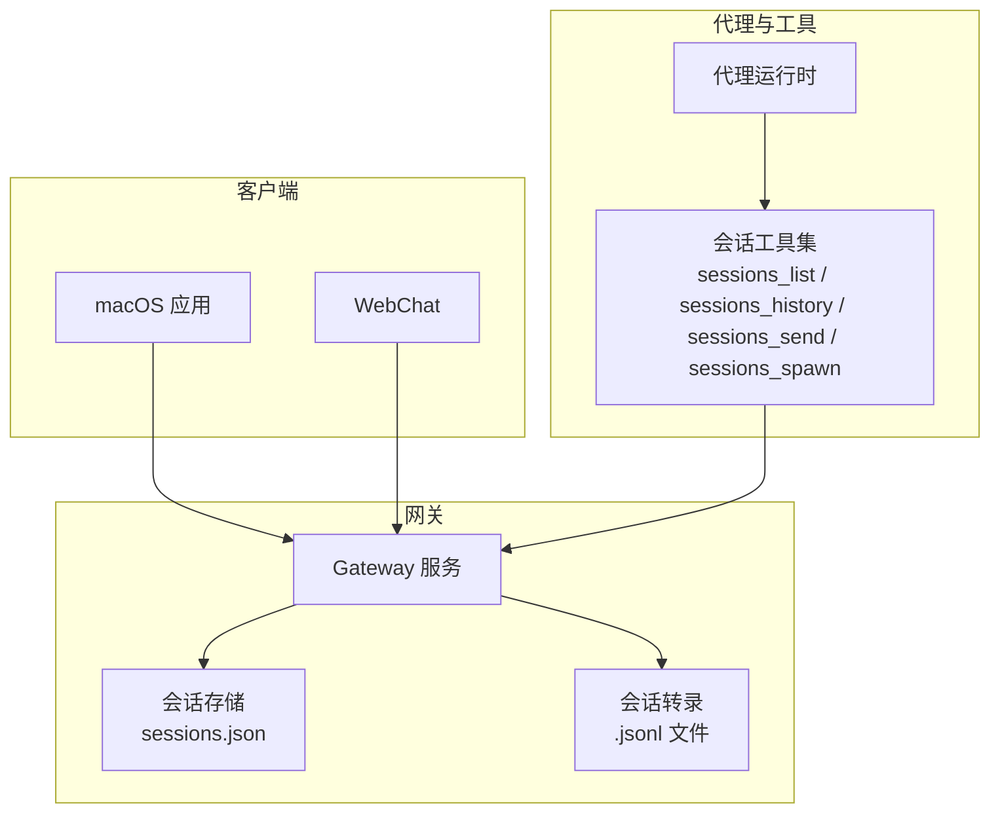
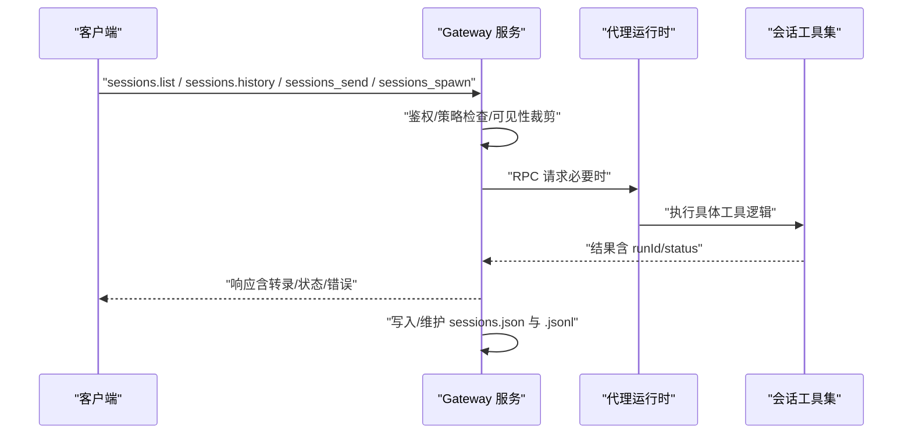
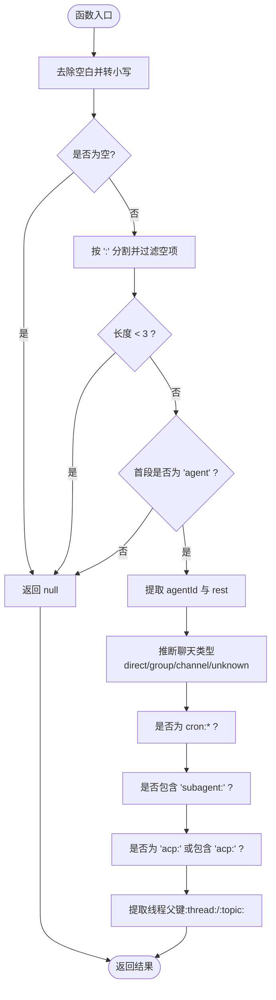
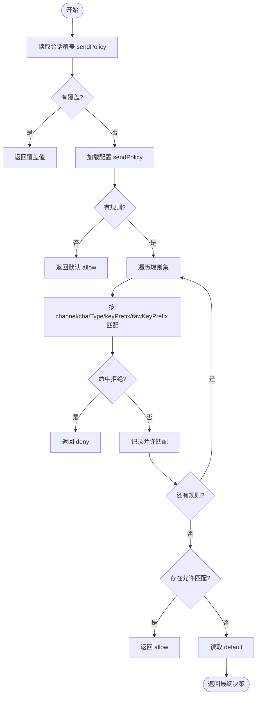
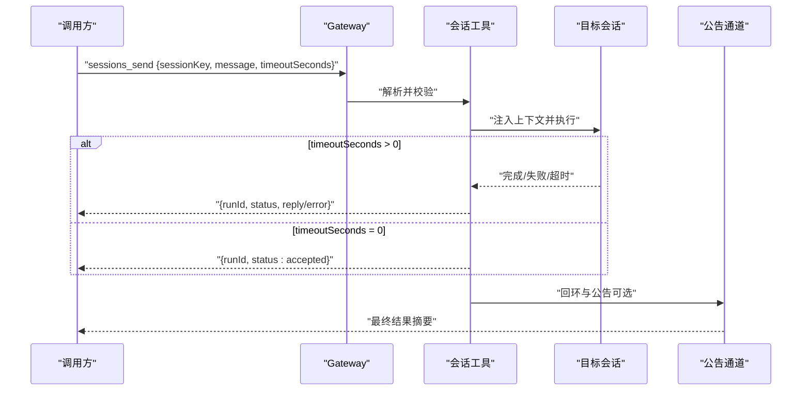
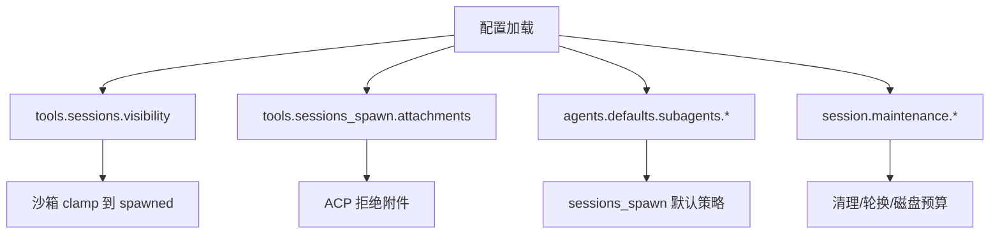
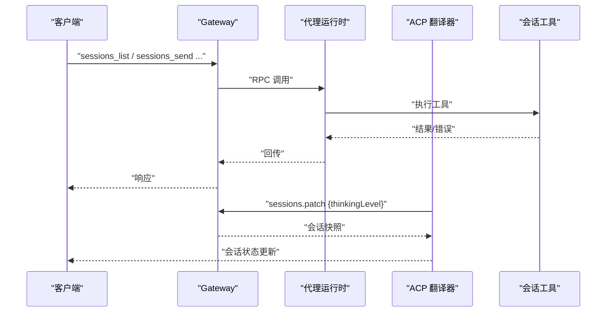
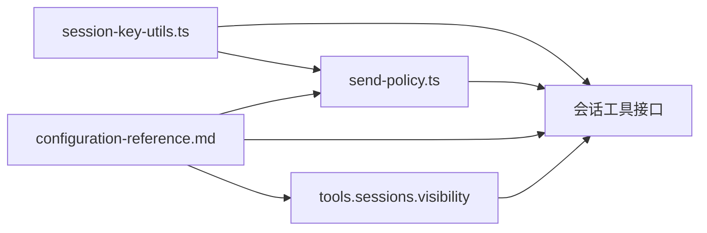

# 会话管理工具

## 目录
1. [简介](#简介)
2. [项目结构](#项目结构)
3. [核心组件](#核心组件)
4. [架构总览](#架构总览)
5. [详细组件分析](#详细组件分析)
6. [依赖关系分析](#依赖关系分析)
7. [性能考量](#性能考量)
8. [故障排查指南](#故障排查指南)
9. [结论](#结论)
10. [附录](#附录)

## 简介
本文件系统化阐述 OpenClaw 的会话管理工具与能力边界，覆盖会话创建、历史记录、列表管理、跨会话发送、子代理派生运行（spawn）、权限控制与安全策略、与代理系统的集成方式（工具注册、调用链路、错误处理）、沙箱执行与资源限制、以及性能优化策略。文档同时给出参数配置要点、执行流程、权限要求与安全限制，并提供可操作的使用示例与最佳实践。

## 项目结构
OpenClaw 将“会话”视为一次对话或任务的上下文容器，由网关作为权威存储与调度中心，客户端（如 macOS 应用、WebChat）通过 RPC/HTTP 调用获取会话列表、历史与状态；工具（sessions_list、sessions_history、sessions_send、sessions_spawn）在代理侧提供跨会话能力，受配置与沙箱策略约束。

图中展示了“客户端—网关—存储/转录—代理—工具”的基本交互路径。会话数据以 JSON 结构持久化，转录以 JSONL 形式记录消息流。

章节来源
- file://docs/concepts/session.md#L57-L72
- file://docs/concepts/session-tool.md#L1-L28

## 核心组件
- 会话键解析与类型推断：用于识别会话类型（直接/群组/频道/未知）、判断是否为定时任务/子代理/Acp 会话、提取线程父键等。
- 发送策略：基于通道/聊天类型/键前缀的策略匹配，支持运行时覆盖与默认策略。
- 会话 ID 规范：会话标识符的正则校验，确保输入合法性。
- 会话转录事件：监听转录更新并广播给订阅者，便于 UI/监控刷新。
- 配置入口：会话维护、清理、重置策略、可见性与附件策略等集中于配置参考文档。
- 工具接口：RPC/HTTP 接口定义与行为规范，包含列表、历史、发送、派生运行等。

章节来源
- file://src/sessions/session-key-utils.ts#L1-L133
- file://src/sessions/send-policy.ts#L1-L124
- file://src/sessions/session-id.ts#L1-L6
- file://src/sessions/transcript-events.ts#L1-L30
- file://docs/gateway/configuration-reference.md#L1902-L1955

## 架构总览
下图展示从客户端到网关再到代理工具的调用链，以及会话数据在网关侧的持久化位置。

图示要点：
- 客户端通过统一入口访问会话能力。
- 网关负责鉴权、策略与可见性控制。
- 代理工具在运行时执行具体逻辑。
- 会话状态与转录持久化在网关侧完成。

章节来源
- file://docs/concepts/session-tool.md#L29-L106
- file://docs/concepts/session.md#L57-L72

## 详细组件分析

### 组件A：会话键解析与类型推断
- 功能要点
  - 解析以“agent:&lt;agentId&gt;:...”开头的规范键，返回 agentId 与剩余部分。
  - 从键中推断聊天类型（direct/group/channel/unknown），兼容旧格式。
  - 判断是否为定时任务、子代理、Acp 会话。
  - 提取线程/话题的父会话键，支持多级线程绑定。
- 复杂度
  - 解析与匹配为 O(n) 字符串处理，n 为键长度。
- 错误处理
  - 输入为空或格式不合法时返回空值，避免异常传播。
- 性能影响
  - 常驻字符串切分与正则匹配，开销极低，适合高频调用。

章节来源
- file://src/sessions/session-key-utils.ts#L12-L133

### 组件B：发送策略与权限控制
- 功能要点
  - 支持按通道/聊天类型/键前缀进行规则匹配，允许/拒绝。
  - 允许运行时覆盖单个会话的 sendPolicy。
  - 默认策略来自配置，未命中规则时采用 default。
- 执行流程
  - 优先读取会话条目中的覆盖值。
  - 否则读取配置中的 sendPolicy 规则集。
  - 按顺序匹配规则，遇到拒绝即返回拒绝；若存在允许匹配则返回允许；否则回退到默认策略。
- 安全边界
  - 强制基于通道/聊天类型的策略，而非逐会话 ID 过滤，降低绕过风险。
  - 可在网关层拦截 chat.send 与自动回复投递逻辑。

章节来源
- file://src/sessions/send-policy.ts#L53-L124
- file://docs/concepts/session-tool.md#L114-L143

### 组件C：会话 ID 规范与校验
- 作用：确保传入的 sessionId 符合 UUID v4 格式，避免非法标识导致的路由与持久化问题。
- 使用场景：工具参数校验、会话解析与映射。

章节来源
- file://src/sessions/session-id.ts#L1-L6

### 组件D：会话转录事件监听
- 作用：提供会话转录文件变更的事件通知机制，供 UI/监控订阅刷新。
- 行为：去重、异常吞吐、批量广播。

章节来源
- file://src/sessions/transcript-events.ts#L1-L30

### 组件E：会话工具接口与行为
- sessions_list
  - 支持按类型过滤、限制行数、仅活跃会话、附带最后 N 条消息。
  - 在沙箱会话中默认限制为“仅已派生”可见性。
- sessions_history
  - 获取指定会话的完整转录，支持包含/排除工具消息。
- sessions_send
  - 支持阻塞/非阻塞发送，超时控制，跨代理回环与公告步骤。
  - 注入代理间上下文，记录 inter_session 来源。
- sessions_spawn
  - 在隔离会话中派生子代理运行，支持附件材料、线程绑定、沙箱继承与归档策略。
  - 返回 runId 与子会话键，后续公告至请求方渠道。

章节来源
- file://docs/concepts/session-tool.md#L29-L106
- file://docs/concepts/session-tool.md#L144-L185

### 组件F：配置与可见性控制
- tools.sessions.visibility
  - self/tree/agent/all，默认 tree（当前会话+其派生的子代理）。
  - 沙箱会话可强制 clamp 到 spawned。
- tools.sessions_spawn.attachments
  - 控制内联附件的启用、总量/文件数/单文件大小限制与保留策略。
- agents.defaults.subagents.*
  - 子代理默认模型、并发、超时、归档时间等。
- session.maintenance.*
  - 维护模式、清理窗口、最大条目、轮换阈值、磁盘预算与水位线。

章节来源
- file://docs/gateway/configuration-reference.md#L1902-L1955
- file://docs/gateway/configuration-reference.md#L1956-L1971

### 组件G：与代理系统的集成与调用链
- 工具注册与发现
  - 代理侧提供工具清单，工具名与参数在测试中被显式校验。
- 调用链路
  - 客户端发起 RPC/HTTP 请求，网关进行鉴权与策略裁剪后转发至代理工具。
  - 工具执行完成后，网关写入会话存储与转录，并返回结果。
- 错误处理
  - 网关层捕获异常并返回结构化错误；工具层记录日志并抛出可诊断错误。
- 代理侧模式切换
  - ACP 翻译器支持设置会话模式（如思考层级），并通过网关 patch 更新会话快照并广播。

章节来源
- file://src/agents/openclaw-tools.sessions.test.ts#L86-L100
- file://src/acp/translator.ts#L499-L524
- file://src/gateway/server.sessions.gateway-server-sessions-a.test.ts#L429-L482

## 依赖关系分析
- 会话键解析依赖聊天类型推断与正则匹配，耦合度低、内聚性强。
- 发送策略依赖配置与会话条目，策略规则与默认值构成清晰的决策树。
- 工具接口依赖网关的鉴权与可见性裁剪，代理工具负责具体执行。
- 配置参考文档为所有策略与可见性提供统一入口，避免分散配置带来的歧义。

章节来源
- file://src/sessions/session-key-utils.ts#L1-L133
- file://src/sessions/send-policy.ts#L1-L124
- file://docs/gateway/configuration-reference.md#L1902-L1955

## 性能考量
- 维护策略
  - 使用“模式+时间+计数+磁盘预算+水位线”的组合策略，避免单一维度导致的无限增长。
  - 在生产环境建议启用 enforce 模式，定期清理与轮换，减少写放大。
- 会话存储规模
  - 大规模会话存储会增加写路径延迟，应平衡 pruneAfter 与 maxEntries，避免长期滞留。
- 附件与派生运行
  - 附件启用需谨慎，严格控制总量与单文件大小；派生运行应设置合理超时与并发上限。
- 磁盘预算
  - 启用磁盘预算时，建议将高水位线显著低于总预算，避免频繁清理造成抖动。

章节来源
- file://docs/concepts/session.md#L101-L120
- file://docs/gateway/configuration-reference.md#L1902-L1955

## 故障排查指南
- 无法列出会话或权限不足
  - 检查 tools.sessions.visibility 与当前会话是否沙箱化，确认是否被 clamp 到 spawned。
  - 参考：[tools.sessions 可见性](file://docs/gateway/configuration-reference.md#L1902-L1925)
- 发送被拒绝
  - 检查 sendPolicy 规则与默认值，确认通道/聊天类型/键前缀是否匹配。
  - 单会话覆盖可通过 sessions.patch 或 owner-only 命令临时调整。
  - 参考：[发送策略与运行时覆盖](file://docs/concepts/session-tool.md#L114-L143)
- 会话历史缺失或不完整
  - 确认 sessions_history 的 limit 与 includeTools 参数，必要时直接打开 .jsonl 文件核对。
  - 参考：[sessions_history](file://docs/concepts/session-tool.md#L62-L77)
- 清理策略未生效
  - 使用 openclaw sessions cleanup 预演（--dry-run）与强制执行（--enforce），核对 session.maintenance.* 配置。
  - 参考：[sessions CLI](file://docs/cli/sessions.md#L48-L105)
- 远程网关连接与认证
  - 确认 gateway.remote.url/token/password 与本地 token 会话键的网关作用域一致。
  - 参考：[webchat 全局选项](file://docs/zh-CN/web/webchat.md#L51-L57)
- macOS 应用状态查询
  - 使用 mainSessionKey 与 status 查询当前主会话键与网关健康状态。
  - 参考：[GatewayConnection.swift](file://apps/macos/Sources/OpenClaw/GatewayConnection.swift#L444-L472)

章节来源
- file://docs/concepts/session-tool.md#L114-L143
- file://docs/cli/sessions.md#L48-L105
- file://docs/zh-CN/web/webchat.md#L51-L57
- file://apps/macos/Sources/OpenClaw/GatewayConnection.swift#L444-L472

## 结论
OpenClaw 的会话管理工具以“网关权威、代理执行、策略可控”为核心设计，通过规范化的会话键、严格的发送策略、可裁剪的可见性与完善的维护策略，实现了跨会话的可观测、可治理与可扩展。结合沙箱与附件策略，既能满足复杂场景下的隔离与安全需求，又能保持良好的性能与可运维性。

## 附录

### 使用示例与最佳实践
- 会话操作
  - 列出会话：使用 sessions_list，配合 kinds/limit/activeMinutes/messageLimit 进行筛选与预览。
  - 查看历史：使用 sessions_history，按需开启 includeTools。
  - 跨会话发送：使用 sessions_send，设置合适的 timeoutSeconds；必要时启用回环与公告。
  - 派生运行：使用 sessions_spawn，合理设置 model/thinking/runTimeoutSeconds/thread/cleanup/sandbox。
- 状态查询
  - 通过网关 status/mainSessionKey 查询健康与主会话键。
- 权限验证
  - 通过 sendPolicy 与 tools.sessions.visibility 控制跨会话访问范围；必要时使用运行时覆盖。
- 最佳实践
  - 生产环境启用 enforce 维护策略，设置合理的 pruneAfter 与 maxEntries。
  - 对附件启用严格限额并注意清理策略。
  - 派生运行限制并发与超时，避免资源耗尽。

章节来源
- file://docs/concepts/session-tool.md#L29-L106
- file://docs/concepts/session.md#L177-L218
- file://apps/macos/Sources/OpenClaw/GatewayConnection.swift#L444-L472