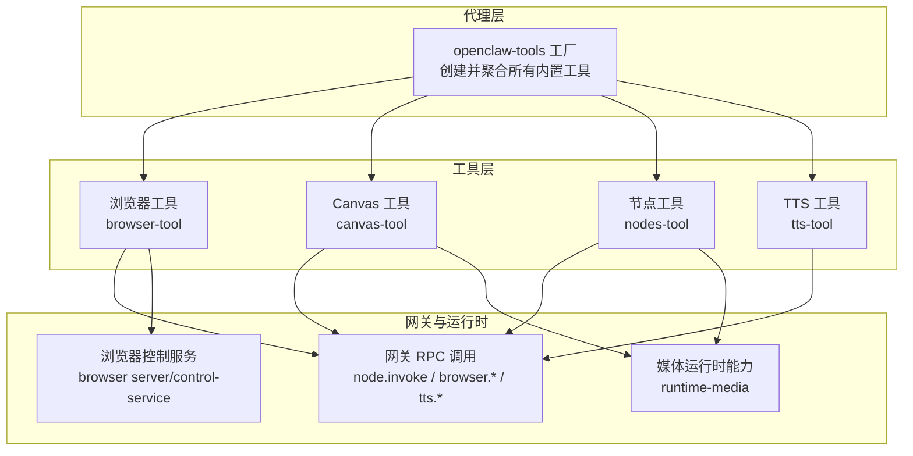
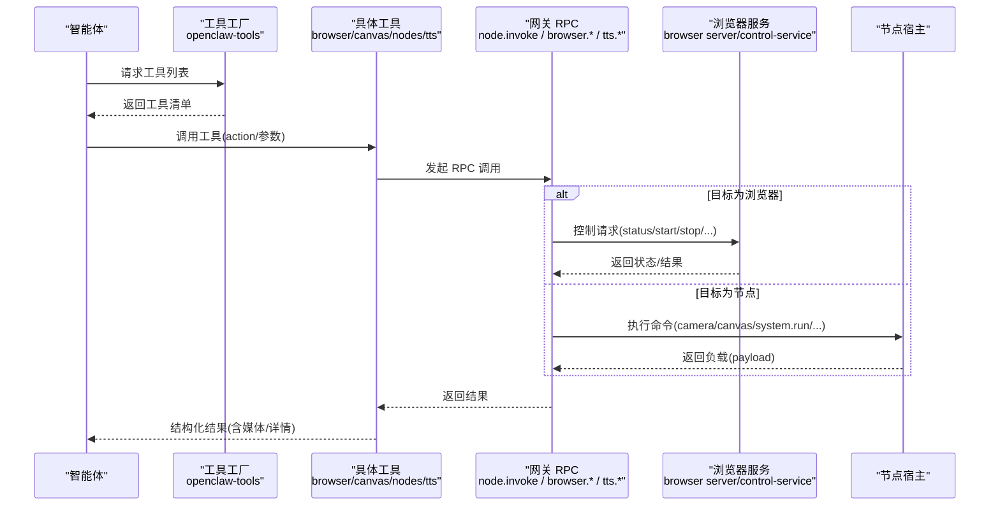
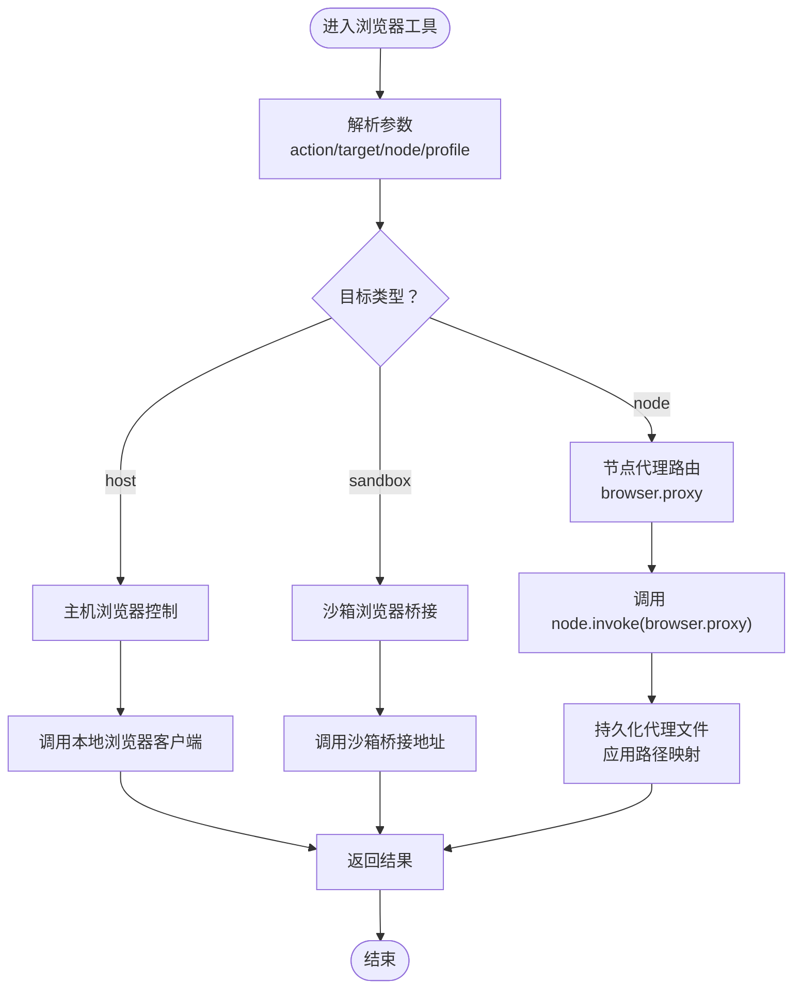
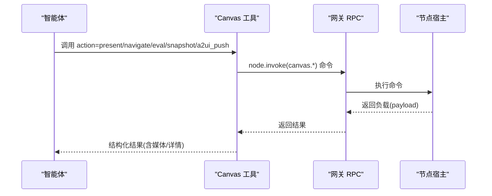
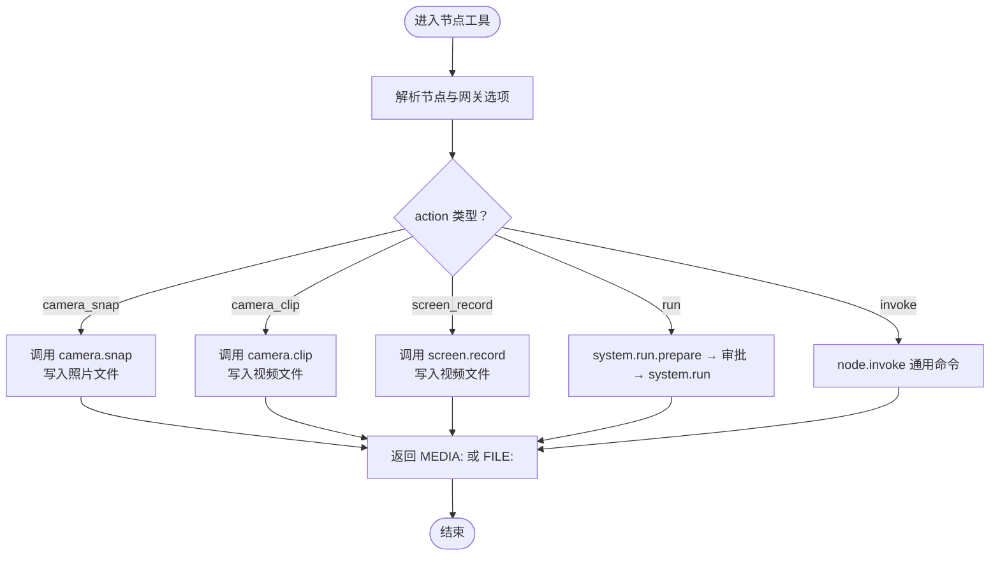
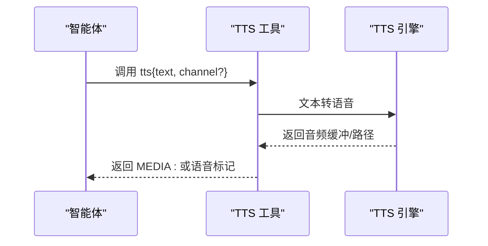
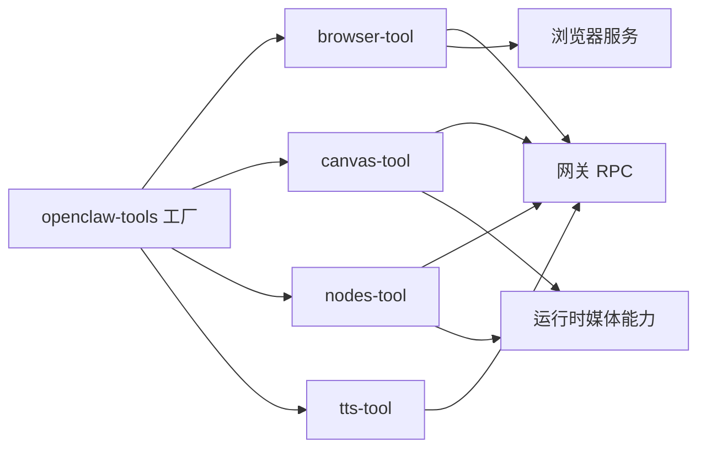

# 内置工具

## 目录
1. [简介](#简介)
2. [项目结构](#项目结构)
3. [核心组件](#核心组件)
4. [架构总览](#架构总览)
5. [详细组件分析](#详细组件分析)
6. [依赖关系分析](#依赖关系分析)
7. [性能考量](#性能考量)
8. [故障排查指南](#故障排查指南)
9. [结论](#结论)
10. [附录](#附录)

## 简介
本文件系统性梳理 OpenClaw 的内置工具体系，覆盖浏览器控制、Canvas 绘图与交互、节点设备与系统操作、文本转语音（TTS）、网页检索与抓取、会话与子代理管理等能力。文档重点阐述各工具的职责边界、参数模型、执行流程、权限与安全限制、与代理系统的集成方式（工具注册、调用链路、错误处理），以及沙箱执行、资源限制与性能优化策略。同时给出常见使用场景与最佳实践，帮助开发者与用户正确、安全地使用这些工具。

## 项目结构
OpenClaw 将“工具”抽象为可被智能体调用的原子能力单元，统一通过工具工厂函数集中注册到代理运行时。浏览器、Canvas、节点、TTS 等工具均以“工具工厂 + 参数校验 + 调用网关”的模式实现，确保一致的生命周期与安全策略。

图表来源
- [src/agents/openclaw-tools.ts](file://src/agents/openclaw-tools.ts#L29-L222)
- [src/agents/tools/browser-tool.ts](file://src/agents/tools/browser-tool.ts#L281-L660)
- [src/agents/tools/canvas-tool.ts](file://src/agents/tools/canvas-tool.ts#L80-L216)
- [src/agents/tools/nodes-tool.ts](file://src/agents/tools/nodes-tool.ts#L155-L816)
- [src/agents/tools/tts-tool.ts](file://src/agents/tools/tts-tool.ts#L17-L62)
- [src/browser/server.ts](file://src/browser/server.ts#L63-L99)
- [src/browser/control-service.ts](file://src/browser/control-service.ts#L42-L65)
- [src/plugins/runtime/runtime-media.ts](file://src/plugins/runtime/runtime-media.ts#L8-L17)

章节来源
- [src/agents/openclaw-tools.ts](file://src/agents/openclaw-tools.ts#L29-L222)

## 核心组件
- 浏览器控制工具：提供状态查询、启动/停止、标签页管理、打开/聚焦/关闭、截图/快照、PDF 导出、上传/对话框钩子、自动化动作等能力；支持“主机”“沙箱”“节点代理”三种目标位置，并自动选择节点代理或本地浏览器。
- Canvas 工具：在节点侧呈现/隐藏 UI、导航到 URL、执行 JS、抓取屏幕快照、推送 A2UI JSONL 状态等；对输出图像进行安全限制与格式化。
- 节点工具：发现与配对节点、通知、相机拍照/录像、相册最新照片、屏幕录制、定位、通知操作、系统命令执行（含审批流）、通用命令调用等。
- 文本转语音工具：将文本转换为音频，按渠道输出为语音附件或普通媒体文件，返回可直接用于消息发送的结果。
- 网页检索与抓取工具：基于运行时元数据选择合适的 Web 搜索/抓取后端，避免重复实现。
- 会话与子代理工具：列出/历史/发送/派生会话，管理子代理，辅助多轮任务编排。

章节来源
- [src/agents/tools/browser-tool.ts](file://src/agents/tools/browser-tool.ts#L281-L660)
- [src/agents/tools/canvas-tool.ts](file://src/agents/tools/canvas-tool.ts#L80-L216)
- [src/agents/tools/nodes-tool.ts](file://src/agents/tools/nodes-tool.ts#L155-L816)
- [src/agents/tools/tts-tool.ts](file://src/agents/tools/tts-tool.ts#L17-L62)
- [src/agents/openclaw-tools.ts](file://src/agents/openclaw-tools.ts#L102-L197)

## 架构总览
下图展示工具调用从代理到网关、再到浏览器控制服务与节点宿主的完整链路，以及媒体与 TTS 的关键路径。

图表来源
- [src/agents/openclaw-tools.ts](file://src/agents/openclaw-tools.ts#L128-L198)
- [src/agents/tools/browser-tool.ts](file://src/agents/tools/browser-tool.ts#L305-L657)
- [src/agents/tools/canvas-tool.ts](file://src/agents/tools/canvas-tool.ts#L99-L105)
- [src/agents/tools/nodes-tool.ts](file://src/agents/tools/nodes-tool.ts#L80-L89)
- [src/browser/server.ts](file://src/browser/server.ts#L63-L99)
- [src/browser/control-service.ts](file://src/browser/control-service.ts#L42-L65)

## 详细组件分析

### 浏览器控制工具
- 功能概览
  - 状态查询、启动/停止浏览器实例
  - 标签页管理（打开/聚焦/关闭）
  - 截图与页面快照（支持 PNG/JPEG、区域/全页）
  - PDF 导出、文件上传/对话框钩子
  - 自动化动作（点击/输入/按键/拖拽/选择/等待/JS 评估/关闭）
  - 支持三种目标：主机、沙箱、节点代理
- 关键参数与行为
  - 目标选择：target 可为 "sandbox"|"host"|"node"，默认根据沙箱桥接与策略决定
  - Chrome 扩展接管：当 profile="chrome" 且未显式指定 node 时，默认走主机 Chrome
  - 节点代理：当存在可用节点且策略允许时，自动路由至 node.invoke(browser.proxy)
  - 快照与截图：支持 refs 模式（role/aria）与输出格式（png/jpeg），并可传入 ref/element 定位
  - 上传与对话框：arm 文件选择器与弹窗确认，支持超时与目标标签
- 执行流程
  - 解析目标与策略 → 选择本地浏览器或节点代理 → 调用对应接口（status/start/stop/profiles/tabs/open/snapshot/screenshot/act/pdf/upload/dialog）
  - 对于节点代理，将远端返回的文件映射回本地路径，并应用代理路径替换
- 权限与安全
  - 主机控制受沙箱策略限制；禁用主机时抛出明确错误
  - 节点代理模式受 gateway.nodes.browser 配置控制
  - 上传目录受白名单限制，防止任意路径写入
- 常见用法
  - 获取当前状态：action="status"
  - 在新标签打开链接：action="open"，targetUrl/url
  - 截取元素快照：action="snapshot"，ref 或 element
  - 执行自动化动作：action="act"，request=&#123; kind, ... &#125; 或扁平参数
  - 上传文件：action="upload"，paths 列表，配合 ref/inputRef/element 定位
- 最佳实践
  - 使用 snapshot 后续动作时优先复用 targetId 保持上下文
  - 优先使用 refs="aria" 获得跨调用稳定的引用
  - 对需要用户交互的动作设置合理 timeoutMs
  - Chrome 扩展接管需先“绑定标签”，否则无法连接

图表来源
- [src/agents/tools/browser-tool.ts](file://src/agents/tools/browser-tool.ts#L131-L241)
- [src/agents/tools/browser-tool.ts](file://src/agents/tools/browser-tool.ts#L305-L657)
- [src/browser/server.ts](file://src/browser/server.ts#L63-L99)
- [src/browser/control-service.ts](file://src/browser/control-service.ts#L42-L65)

章节来源
- [src/agents/tools/browser-tool.ts](file://src/agents/tools/browser-tool.ts#L281-L660)
- [src/agents/tools/browser-tool.schema.ts](file://src/agents/tools/browser-tool.schema.ts#L88-L139)
- [src/cli/browser-cli-shared.ts](file://src/cli/browser-cli-shared.ts#L30-L84)

### Canvas 绘图与交互工具
- 功能概览
  - 在节点侧呈现/隐藏 UI，导航到指定 URL
  - 执行 JavaScript 并返回结果
  - 抓取屏幕快照并输出为本地图片，支持 PNG/JPG
  - 推送 A2UI JSONL 状态，或重置 A2UI
- 关键参数与行为
  - present：支持 target/url、可选 x/y/width/height 定位
  - navigate：支持 target 别名
  - eval：传入 javaScript，返回字符串结果
  - snapshot：输出格式 png/jpg，支持 maxWidth/quality/delayMs
  - a2ui_push：支持 jsonl 或 jsonlPath（仅允许在允许的本地根目录内）
  - a2ui_reset：重置 A2UI 状态
- 执行流程
  - 解析节点与网关选项 → 调用 node.invoke 对应命令 → 处理返回负载（如 base64 图像）→ 写入临时文件并返回媒体结果
- 安全与限制
  - 对 jsonlPath 进行本地根目录白名单校验，防止越权读取
  - 输出图像经过安全限制与 MIME 类型推断
- 常见用法
  - 展示 UI：action="present"，target=url，可带定位参数
  - 执行脚本：action="eval"，javaScript
  - 抓取快照：action="snapshot"，outputFormat/maxWidth/quality
  - 推送 A2UI：action="a2ui_push"，jsonl 或 jsonlPath
- 最佳实践
  - 使用 snapshot 作为后续交互的锚点，减少对 DOM 选择器的依赖
  - A2UI 数据建议使用 JSONL 分行存储，便于增量更新

图表来源
- [src/agents/tools/canvas-tool.ts](file://src/agents/tools/canvas-tool.ts#L80-L216)
- [src/agents/tools/canvas-tool.ts](file://src/agents/tools/canvas-tool.ts#L99-L105)

章节来源
- [src/agents/tools/canvas-tool.ts](file://src/agents/tools/canvas-tool.ts#L80-L216)

### 节点管理与系统工具
- 功能概览
  - 节点发现、描述、待处理配对请求、批准/拒绝
  - 通知发送（系统/覆盖层/自动）
  - 相机拍照/录像、相册最新照片
  - 屏幕录制（帧率、屏幕索引、是否含音频）
  - 定位获取（精度、最大年龄、超时）
  - 通知操作（打开/关闭/回复）
  - 系统命令执行（system.run）：支持准备阶段、审批流、重试与超时
  - 通用命令调用（invoke）：支持 JSON 参数与超时控制
- 关键参数与行为
  - 通知：title/body/sound/priority/delivery
  - 相机：facing/front/back/both、maxWidth/quality/delayMs/deviceId/limit
  - 录屏：fps/screenIndex/outPath/durationMs/includeAudio
  - 定位：maxAgeMs/desiredAccuracy/locationTimeoutMs
  - 命令执行：command 数组、cwd、env、commandTimeoutMs、invokeTimeoutMs、needsScreenRecording
  - 通用调用：invokeCommand + invokeParamsJson
- 执行流程
  - 解析节点 → 调用 node.invoke → 处理媒体负载（照片/视频/音频）→ 返回 FILE: 或 MEDIA: 标记
  - system.run 具备两阶段：prepare → 执行；若被拒则发起审批请求并在超时内等待决策
- 安全与限制
  - invoke 命令返回媒体时，若未开启 allowMediaInvokeCommands，则强制改用专用 action，避免上下文膨胀
  - 媒体结果在返回前进行图像清洗与 MIME 推断
- 常见用法
  - 查看节点状态：action="status"
  - 发送通知：action="notify"，node/title/body/priority/delivery
  - 拍照：action="camera_snap"，facing/maxWidth/quality
  - 录屏：action="screen_record"，durationMs/fps/screenIndex/includeAudio
  - 执行命令：action="run"，command/cwd/env/commandTimeoutMs
  - 通用调用：action="invoke"，invokeCommand/invokeParamsJson
- 最佳实践
  - 指定 node 明确目标，避免多节点冲突
  - 录屏/拍照前确认设备权限与前置条件
  - system.run 建议提供清晰的命令文本与环境变量

图表来源
- [src/agents/tools/nodes-tool.ts](file://src/agents/tools/nodes-tool.ts#L181-L786)

章节来源
- [src/agents/tools/nodes-tool.ts](file://src/agents/tools/nodes-tool.ts#L155-L816)

### 文本转语音工具
- 功能概览
  - 将文本转换为音频，按渠道输出为语音附件或普通媒体文件
  - 成功时返回 MEDIA: 路径，Telegram 等渠道可识别为语音
- 关键参数与行为
  - text：必填
  - channel：可选，用于选择输出格式（如 telegram）
- 执行流程
  - 读取参数 → 调用 textToSpeech → 若成功返回音频路径与提供商信息 → 包装为内容块（MEDIA: 或语音标记）
- 安全与限制
  - 由 TTS 提供商与配置决定可用性与输出格式
- 常见用法
  - 简单 TTS：action="tts"，text
  - 指定渠道：action="tts"，text，channel="telegram"
- 最佳实践
  - 成功后使用静默令牌避免重复回复
  - 对长文本分段处理，提升可听性

图表来源
- [src/agents/tools/tts-tool.ts](file://src/agents/tools/tts-tool.ts#L26-L59)
- [src/tts/tts.ts](file://src/tts/tts.ts#L740-L783)
- [src/gateway/server-methods/tts.ts](file://src/gateway/server-methods/tts.ts#L69-L94)

章节来源
- [src/agents/tools/tts-tool.ts](file://src/agents/tools/tts-tool.ts#L17-L62)
- [src/tts/tts.ts](file://src/tts/tts.ts#L740-L783)
- [src/gateway/server-methods/tts.ts](file://src/gateway/server-methods/tts.ts#L69-L94)

### 网页检索与抓取工具
- 功能概览
  - 基于运行时元数据选择 Web 搜索与抓取后端，避免重复实现
- 关键参数与行为
  - 通过配置与运行时开关决定是否启用搜索/抓取
- 执行流程
  - 创建工具时注入 runtimeWebTools 元数据 → 调用相应后端
- 最佳实践
  - 优先使用平台提供的搜索/抓取能力，避免自建

章节来源
- [src/agents/openclaw-tools.ts](file://src/agents/openclaw-tools.ts#L102-L111)

### 媒体理解与媒体运行时
- 媒体理解注册表：提供媒体理解提供方的注册与查找能力
- 运行时媒体能力：封装媒体加载、MIME 检测、媒体类型判定、音频兼容性、图像元数据与缩放等

章节来源
- [src/media-understanding/providers/index.ts](file://src/media-understanding/providers/index.ts#L34-L63)
- [src/plugins/runtime/runtime-media.ts](file://src/plugins/runtime/runtime-media.ts#L8-L17)

## 依赖关系分析
- 工具工厂集中注册：openclaw-tools.ts 统一创建浏览器、Canvas、节点、TTS、会话、Web 工具与插件工具
- 工具到网关：各工具通过 callGatewayTool 发起 node.invoke 或浏览器/网关方法
- 浏览器服务：浏览器控制服务监听本地端口，提供状态与控制能力；CLI 通过 gateway 间接调用
- 媒体与图像：Canvas/TTS/节点工具在生成媒体时依赖运行时媒体能力与安全限制

图表来源
- [src/agents/openclaw-tools.ts](file://src/agents/openclaw-tools.ts#L128-L198)
- [src/browser/server.ts](file://src/browser/server.ts#L63-L99)
- [src/plugins/runtime/runtime-media.ts](file://src/plugins/runtime/runtime-media.ts#L8-L17)

章节来源
- [src/agents/openclaw-tools.ts](file://src/agents/openclaw-tools.ts#L29-L222)

## 性能考量
- 浏览器自动化
  - 优先使用 snapshot+act，避免无谓等待；必要时再使用 wait
  - 截图与快照尽量限定区域与分辨率，降低 I/O 与传输成本
- Canvas 与节点媒体
  - 控制输出质量与尺寸，减少 base64 上下文体积
  - 使用临时文件承载媒体，避免在消息中携带大块二进制数据
- TTS
  - 选择就近/低延迟的提供商；对长文本分段
  - 渠道特定优化（如 Telegram 语音附件）
- 网络与超时
  - 为浏览器与节点调用设置合理超时，避免阻塞
  - CLI 与网关间调用保留超时余量，避免中间层截断

## 故障排查指南
- 浏览器工具
  - 主机控制被禁用：检查沙箱策略与配置，确认 allowHostControl 与 browser.enabled
  - Chrome 扩展未绑定：确保用户已在目标标签点击工具栏按钮，使扩展处于“已连接”状态
  - 节点代理不可用：确认节点具备 browser 能力或命令，或调整 gateway.nodes.browser.mode
  - 上传失败：检查上传目录白名单与路径合法性
- Canvas 工具
  - jsonlPath 越权：确保路径位于允许的本地根目录内
  - 快照为空：确认目标 UI 已渲染完成，必要时增加 delayMs
- 节点工具
  - system.run 被拒：检查审批流是否触发，确认用户在超时内完成决策
  - invoke 返回媒体：若未开启 allowMediaInvokeCommands，改为专用 action
  - 设备权限不足：确认节点侧权限与前置条件
- TTS 工具
  - 无可用提供商：检查配置中的 API Key 与提供商可用性
  - 渠道不支持：确认目标渠道的音频格式支持情况
- 媒体信任与输出
  - 工具结果媒体白名单：仅部分内置工具允许直接输出本地 MEDIA: 路径，插件/MCP 工具除外
  - 媒体占位符与回退：当无有效文本但有详情路径时，仍可发出媒体

章节来源
- [src/agents/tools/browser-tool.ts](file://src/agents/tools/browser-tool.ts#L131-L199)
- [src/agents/tools/canvas-tool.ts](file://src/agents/tools/canvas-tool.ts#L30-L51)
- [src/agents/tools/nodes-tool.ts](file://src/agents/tools/nodes-tool.ts#L607-L786)
- [src/agents/tools/tts-tool.ts](file://src/agents/tools/tts-tool.ts#L26-L59)
- [src/agents/pi-embedded-subscribe.tools.ts](file://src/agents/pi-embedded-subscribe.tools.ts#L133-L170)
- [src/agents/pi-embedded-subscribe.handlers.tools.media.test.ts](file://src/agents/pi-embedded-subscribe.handlers.tools.media.test.ts#L186-L255)

## 结论
OpenClaw 的内置工具体系以“统一工厂 + 网关 RPC + 安全策略”为核心设计，既保证了功能的完整性与一致性，又通过沙箱与媒体策略强化了安全性与可审计性。浏览器、Canvas、节点与 TTS 等工具覆盖了桌面/移动生态下的常见自动化与感知需求；结合审批流与媒体理解能力，能够支撑复杂场景下的多模态交互与执行。

## 附录

### 沙箱与工具策略
- 工具策略来源优先级：代理配置 > 全局配置 > 默认值
- deny 优先于 allow；未配置时默认允许（若存在 allow 则按 allow 匹配）
- 可通过 alsoAllow 在未显式 allow 时叠加允许集
- 运行时状态包含沙箱模式、主会话键与最终策略，便于诊断

章节来源
- [src/agents/sandbox-tool-policy.ts](file://src/agents/sandbox-tool-policy.ts#L21-L37)
- [src/agents/sandbox/tool-policy.ts](file://src/agents/sandbox/tool-policy.ts#L35-L43)
- [src/agents/sandbox/runtime-status.ts](file://src/agents/sandbox/runtime-status.ts#L45-L79)

### 平台集成要点
- Android 节点命令分发：节点侧将命令映射到具体 UI 行为（如 Present/Navigate/Eval/Snapshot），并对非法请求返回错误码
- Android 语音合成：支持多种参数（音色/模型/速度/相似度/风格/种子/语言/输出格式/延迟等级/一次性），并提供回退到系统 TTS 的逻辑
- macOS 节点服务：通过命令启动/停止节点服务，记录错误并返回提示

章节来源
- [apps/android/app/src/main/java/ai/openclaw/app/node/InvokeDispatcher.kt](file://apps/android/app/src/main/java/ai/openclaw/app/node/InvokeDispatcher.kt#L56-L92)
- [apps/android/app/src/main/java/ai/openclaw/app/voice/TalkModeManager.kt](file://apps/android/app/src/main/java/ai/openclaw/app/voice/TalkModeManager.kt#L875-L903)
- [apps/android/app/src/main/java/ai/openclaw/app/voice/TalkDirectiveParser.kt](file://apps/android/app/src/main/java/ai/openclaw/app/voice/TalkDirectiveParser.kt#L1-L68)
- [apps/macos/Sources/OpenClaw/NodeServiceManager.swift](file://apps/macos/Sources/OpenClaw/NodeServiceManager.swift#L7-L29)