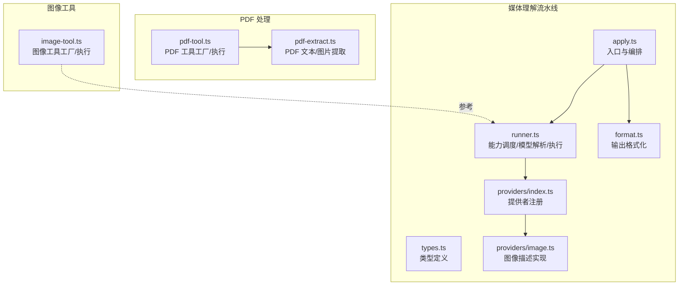
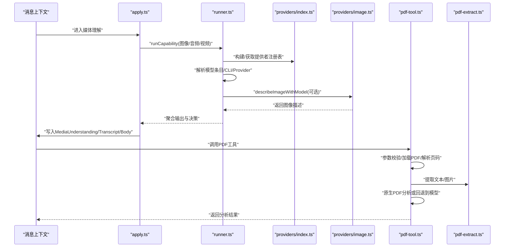
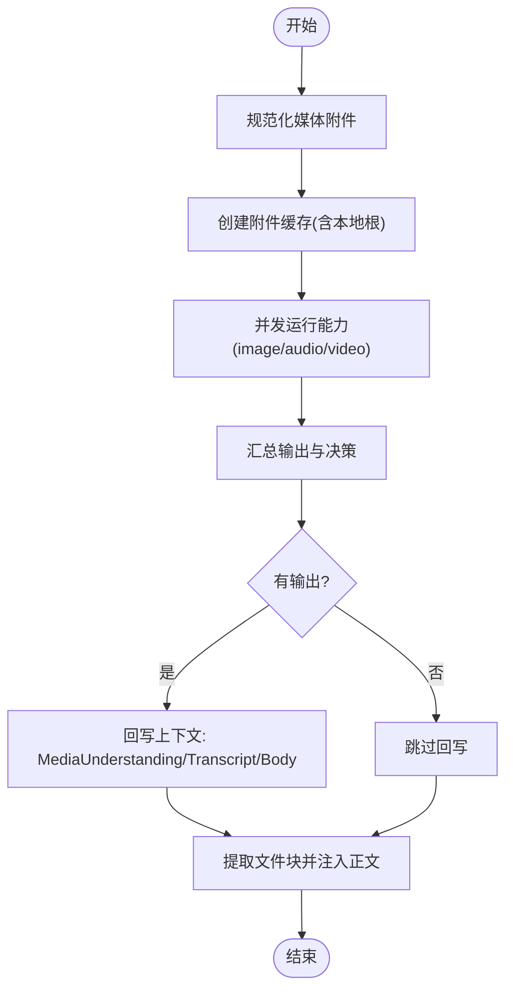
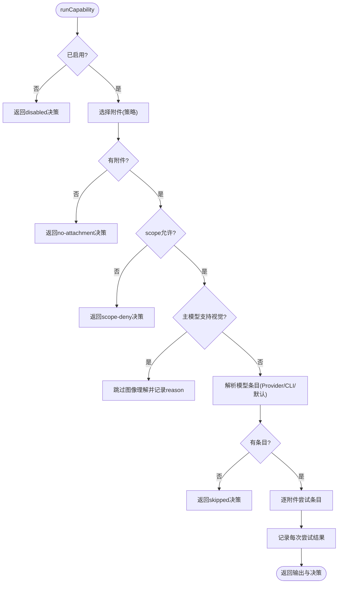
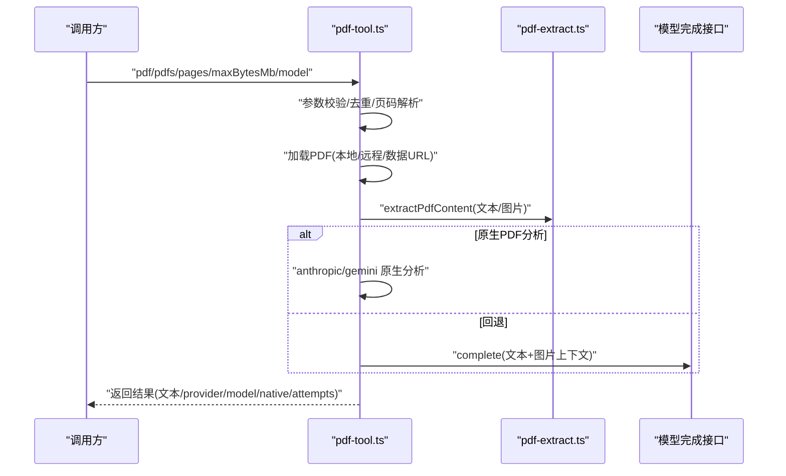
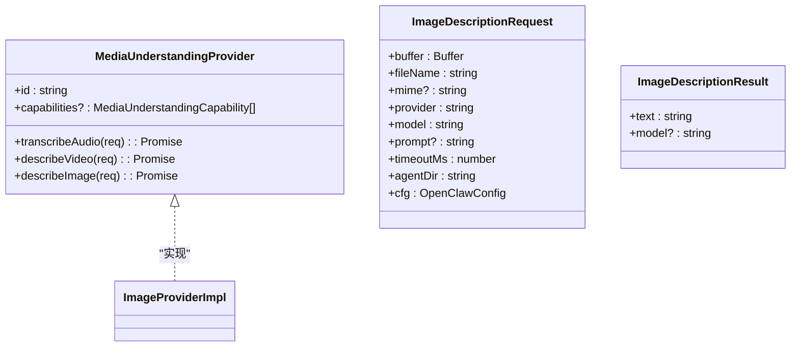
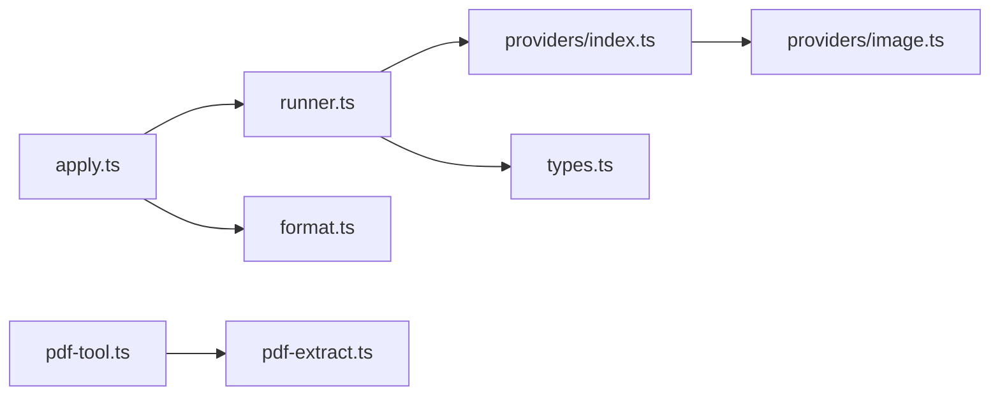

# 媒体处理工具

## 目录
1. [简介](#简介)
2. [项目结构](#项目结构)
3. [核心组件](#核心组件)
4. [架构总览](#架构总览)
5. [详细组件分析](#详细组件分析)
6. [依赖关系分析](#依赖关系分析)
7. [性能考量](#性能考量)
8. [故障排查指南](#故障排查指南)
9. [结论](#结论)
10. [附录](#附录)

## 简介
本文件系统性介绍 OpenClaw 的媒体处理能力，覆盖图像识别、PDF 解析与理解、媒体内容格式化与回传等模块。重点说明以下方面：
- 工具功能与参数：图像分析、PDF 提取与多模态分析、文件块注入等
- 执行流程与权限控制：模型选择、沙箱路径、鉴权与配额
- 安全与限制：MIME 类型校验、二进制/文本判定、页面与像素限制
- 与代理系统的集成：工具注册、调用链路、决策记录与回写
- 沙箱执行、资源限制与性能优化策略

## 项目结构
媒体处理相关代码主要分布在如下位置：
- PDF 工具与解析：src/agents/tools/pdf-tool.ts、src/media/pdf-extract.ts
- 媒体理解流水线：src/media-understanding/apply.ts、src/media-understanding/runner.ts、src/media-understanding/format.ts、src/media-understanding/types.ts、src/media-understanding/providers/index.ts、src/media-understanding/providers/image.ts
- 图像工具（作为对比参考）：src/agents/tools/image-tool.ts

**图示来源**
- [src/media-understanding/apply.ts](file://src/media-understanding/apply.ts#L466-L581)
- [src/media-understanding/runner.ts](file://src/media-understanding/runner.ts#L659-L800)
- [src/media-understanding/format.ts](file://src/media-understanding/format.ts#L47-L98)
- [src/media-understanding/providers/index.ts](file://src/media-understanding/providers/index.ts#L34-L63)
- [src/media-understanding/providers/image.ts](file://src/media-understanding/providers/image.ts#L19-L79)
- [src/agents/tools/pdf-tool.ts](file://src/agents/tools/pdf-tool.ts#L295-L559)
- [src/media/pdf-extract.ts](file://src/media/pdf-extract.ts#L42-L105)
- [src/agents/tools/image-tool.ts](file://src/agents/tools/image-tool.ts#L270-L331)

**章节来源**
- [src/media-understanding/apply.ts](file://src/media-understanding/apply.ts#L1-L581)
- [src/media-understanding/runner.ts](file://src/media-understanding/runner.ts#L1-L806)
- [src/media-understanding/format.ts](file://src/media-understanding/format.ts#L1-L98)
- [src/media-understanding/types.ts](file://src/media-understanding/types.ts#L1-L116)
- [src/media-understanding/providers/index.ts](file://src/media-understanding/providers/index.ts#L1-L63)
- [src/media-understanding/providers/image.ts](file://src/media-understanding/providers/image.ts#L1-L79)
- [src/agents/tools/pdf-tool.ts](file://src/agents/tools/pdf-tool.ts#L1-L559)
- [src/media/pdf-extract.ts](file://src/media/pdf-extract.ts#L1-L105)
- [src/agents/tools/image-tool.ts](file://src/agents/tools/image-tool.ts#L270-L331)

## 核心组件
- 媒体理解应用层（apply.ts）
  - 负责从消息上下文中抽取媒体附件、构建缓存、并发运行三类能力（图像/音频/视频），并把结果格式化回写到上下文。
- 媒体理解运行器（runner.ts）
  - 能力级调度：按配置启用/拒绝、范围策略（scope）、附件筛选；自动解析可用模型（CLI/Provider/默认），逐附件尝试不同条目，记录每次尝试结果与最终选择。
- 输出格式化（format.ts）
  - 将多种媒体理解输出合并为统一文本，支持带编号的多附件后缀，音频转录单独格式化。
- 类型与提供者（types.ts、providers/index.ts、providers/image.ts）
  - 定义媒体理解的种类、能力、附件、决策、请求/响应结构；提供者注册表与具体实现（如图像描述）。
- PDF 工具（pdf-tool.ts）
  - 工具工厂：参数校验、最大数量/大小/页数限制、本地/远程加载、页面范围解析、沙箱路径桥接；执行时优先走原生 PDF 分析（Anthropic/Gemini），否则回退到文本/图片提取后喂给模型。
- PDF 提取（pdf-extract.ts）
  - 使用 pdfjs 读取文本，若文本不足则渲染缩略图提取图片，受最大页数与像素预算约束。

**章节来源**
- [src/media-understanding/apply.ts](file://src/media-understanding/apply.ts#L466-L581)
- [src/media-understanding/runner.ts](file://src/media-understanding/runner.ts#L659-L800)
- [src/media-understanding/format.ts](file://src/media-understanding/format.ts#L47-L98)
- [src/media-understanding/types.ts](file://src/media-understanding/types.ts#L1-L116)
- [src/media-understanding/providers/index.ts](file://src/media-understanding/providers/index.ts#L34-L63)
- [src/media-understanding/providers/image.ts](file://src/media-understanding/providers/image.ts#L19-L79)
- [src/agents/tools/pdf-tool.ts](file://src/agents/tools/pdf-tool.ts#L295-L559)
- [src/media/pdf-extract.ts](file://src/media/pdf-extract.ts#L42-L105)

## 架构总览
媒体理解在收到消息后，按“能力顺序”并发执行，每种能力对选中的附件逐一尝试可用模型条目，记录决策并回写上下文。PDF 工具在执行前先进行输入校验与加载，并在模型层面做原生 PDF 分析优先策略。

**图示来源**
- [src/media-understanding/apply.ts](file://src/media-understanding/apply.ts#L466-L581)
- [src/media-understanding/runner.ts](file://src/media-understanding/runner.ts#L659-L800)
- [src/media-understanding/providers/index.ts](file://src/media-understanding/providers/index.ts#L34-L63)
- [src/media-understanding/providers/image.ts](file://src/media-understanding/providers/image.ts#L19-L79)
- [src/agents/tools/pdf-tool.ts](file://src/agents/tools/pdf-tool.ts#L357-L559)
- [src/media/pdf-extract.ts](file://src/media/pdf-extract.ts#L42-L105)

## 详细组件分析

### 组件A：媒体理解应用层（apply.ts）
- 输入：消息上下文、配置、可选的提供者覆盖、活动模型
- 关键流程：
  - 规范化媒体附件、构建本地根目录与缓存
  - 并发运行三类能力（图像/音频/视频），收集输出与决策
  - 若有音频输出，生成转录并可回显；将文件块注入正文
  - 最终回写上下文（媒体理解结果、命令体、原始体、转录等）
- 安全与限制：
  - 文件块提取时进行 MIME 类型判定与白名单控制，避免未知/二进制媒体直接注入
  - 对 URL/本地路径访问进行策略控制（由上游策略决定）

**图示来源**
- [src/media-understanding/apply.ts](file://src/media-understanding/apply.ts#L466-L581)

**章节来源**
- [src/media-understanding/apply.ts](file://src/media-understanding/apply.ts#L466-L581)

### 组件B：媒体理解运行器（runner.ts）
- 能力调度：
  - 启用开关、附件策略、范围策略（scope deny/disable/no-attachment）
  - 当主模型具备视觉能力时，跳过图像理解以避免重复处理
- 模型解析与执行：
  - 自动解析 CLI（whisper/sherpa/gemini）与 Provider（含鉴权验证）
  - 对每个附件尝试多个条目，记录每次尝试的 provider/model/outcome/reason
- 错误处理：
  - 区分“跳过/失败”，并保留原因便于审计

**图示来源**
- [src/media-understanding/runner.ts](file://src/media-understanding/runner.ts#L659-L800)

**章节来源**
- [src/media-understanding/runner.ts](file://src/media-understanding/runner.ts#L659-L800)

### 组件C：PDF 工具（pdf-tool.ts）
- 参数与限制：
  - 支持单个或多个 PDF（最多 10），可指定页码范围、最大字节数、模型覆盖
  - 远程 URL 在沙箱模式下禁止；本地路径支持用户家目录展开
- 执行流程：
  - 加载 PDF（本地/远程/数据 URL），校验 MIME
  - 提取文本/图片（回退策略），构造上下文
  - 优先使用原生 PDF 分析（Anthropic/Gemini），否则回退到文本/图片喂给模型
  - 返回统一结果（文本、provider、model、是否原生、尝试记录）

**图示来源**
- [src/agents/tools/pdf-tool.ts](file://src/agents/tools/pdf-tool.ts#L357-L559)
- [src/media/pdf-extract.ts](file://src/media/pdf-extract.ts#L42-L105)

**章节来源**
- [src/agents/tools/pdf-tool.ts](file://src/agents/tools/pdf-tool.ts#L295-L559)
- [src/media/pdf-extract.ts](file://src/media/pdf-extract.ts#L42-L105)

### 组件D：图像工具（image-tool.ts）
- 功能要点：
  - 支持单个或多个图像（最多 20），可指定最大字节数与最大图像数
  - 若主模型具备视觉能力，则仅在提示中未包含图像时才需要该工具
  - 参数校验与去重，构建工具描述与执行逻辑

**章节来源**
- [src/agents/tools/image-tool.ts](file://src/agents/tools/image-tool.ts#L270-L331)

### 组件E：类型与提供者（types.ts、providers/index.ts、providers/image.ts）
- 类型定义：
  - 媒体理解种类（音频转录/视频描述/图像描述）、能力、附件、输出、决策、请求/响应
- 提供者注册：
  - 构建注册表，支持覆盖与能力声明
- 图像描述实现：
  - 模型发现与鉴权，构造上下文，调用完成接口，统一文本输出

**图示来源**
- [src/media-understanding/types.ts](file://src/media-understanding/types.ts#L109-L116)
- [src/media-understanding/providers/index.ts](file://src/media-understanding/providers/index.ts#L34-L63)
- [src/media-understanding/providers/image.ts](file://src/media-understanding/providers/image.ts#L19-L79)

**章节来源**
- [src/media-understanding/types.ts](file://src/media-understanding/types.ts#L1-L116)
- [src/media-understanding/providers/index.ts](file://src/media-understanding/providers/index.ts#L34-L63)
- [src/media-understanding/providers/image.ts](file://src/media-understanding/providers/image.ts#L19-L79)

## 依赖关系分析
- 应用层（apply.ts）依赖运行器（runner.ts）与格式化（format.ts），并通过提供者注册（providers/index.ts）与具体实现（providers/image.ts）解耦
- PDF 工具（pdf-tool.ts）依赖 PDF 提取（pdf-extract.ts）与模型完成接口（通过工具共享逻辑间接使用）
- 运行器（runner.ts）内部解析模型条目，优先使用已激活模型，其次自动探测 CLI/Provider，最后回退到默认

**图示来源**
- [src/media-understanding/apply.ts](file://src/media-understanding/apply.ts#L1-L50)
- [src/media-understanding/runner.ts](file://src/media-understanding/runner.ts#L1-L63)
- [src/media-understanding/providers/index.ts](file://src/media-understanding/providers/index.ts#L34-L63)
- [src/media-understanding/providers/image.ts](file://src/media-understanding/providers/image.ts#L19-L79)
- [src/agents/tools/pdf-tool.ts](file://src/agents/tools/pdf-tool.ts#L1-L41)
- [src/media/pdf-extract.ts](file://src/media/pdf-extract.ts#L1-L41)

**章节来源**
- [src/media-understanding/apply.ts](file://src/media-understanding/apply.ts#L1-L50)
- [src/media-understanding/runner.ts](file://src/media-understanding/runner.ts#L1-L63)
- [src/media-understanding/providers/index.ts](file://src/media-understanding/providers/index.ts#L34-L63)
- [src/media-understanding/providers/image.ts](file://src/media-understanding/providers/image.ts#L19-L79)
- [src/agents/tools/pdf-tool.ts](file://src/agents/tools/pdf-tool.ts#L1-L41)
- [src/media/pdf-extract.ts](file://src/media/pdf-extract.ts#L1-L41)

## 性能考量
- 并发与限流
  - 能力级并发执行，减少整体等待时间；可通过配置调整并发度
- 资源限制
  - PDF：最大页数、像素预算、最小文本字符数；超过阈值优先提取图片
  - 文件块：最大字节数、超时、MIME 白名单
- 模型选择与回退
  - 优先原生 PDF 分析（Anthropic/Gemini）以减少图片传输与计算
  - 主模型具备视觉能力时跳过图像理解，避免重复处理
- I/O 与缓存
  - 附件缓存减少重复读取；清理阶段确保资源回收

[本节为通用指导，无需特定文件引用]

## 故障排查指南
- 常见错误与定位
  - PDF 工具：页码范围与原生 PDF 提供商不兼容、远程 URL 在沙箱模式下被禁用、文件路径/URL 不支持、MIME 非 PDF
  - 媒体理解：提供者未配置或无对应能力、模型不支持图像、CLI 二进制缺失或不可执行、scope deny
- 审计与日志
  - 运行器会记录每次尝试的 provider/model/outcome/reason，便于定位失败原因
  - 文件块提取会记录 MIME 覆盖、未知 MIME、URL 禁用等信息
- 建议操作
  - 检查模型鉴权与提供商能力
  - 确认 CLI 二进制存在且可执行
  - 调整并发度、页数/大小限制与 scope 策略

**章节来源**
- [src/agents/tools/pdf-tool.ts](file://src/agents/tools/pdf-tool.ts#L407-L451)
- [src/media-understanding/runner.ts](file://src/media-understanding/runner.ts#L627-L653)
- [src/media-understanding/apply.ts](file://src/media-understanding/apply.ts#L358-L423)

## 结论
OpenClaw 的媒体处理工具通过“应用层编排 + 能力调度 + 提供者抽象”的架构，实现了对图像、音频、视频与 PDF 的统一理解与回写。PDF 工具在原生分析与回退策略之间自动切换，兼顾准确性与兼容性；媒体理解流水线在保证安全与性能的前提下，提供了灵活的配置与可观测性。结合沙箱与策略控制，可在多平台与多渠道环境中稳定运行。

[本节为总结，无需特定文件引用]

## 附录

### 参数与配置速查
- PDF 工具
  - 参数：prompt、pdf/pdfs（最多 10）、pages（页码范围）、model、maxBytesMb
  - 限制：默认最大页数、像素预算、最小文本字符数；沙箱模式下禁止远程 URL
- 媒体理解
  - 能力：image/audio/video；支持 scope 与附件策略
  - 输出：kind（音频转录/视频描述/图像描述）、provider、model、文本
- 图像工具
  - 参数：prompt、image/images（最多 20）、model、maxBytesMb、maxImages
  - 行为：当主模型具备视觉能力时，仅在提示未包含图像时使用

**章节来源**
- [src/agents/tools/pdf-tool.ts](file://src/agents/tools/pdf-tool.ts#L341-L356)
- [src/media-understanding/runner.ts](file://src/media-understanding/runner.ts#L679-L705)
- [src/agents/tools/image-tool.ts](file://src/agents/tools/image-tool.ts#L309-L320)