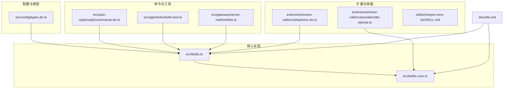
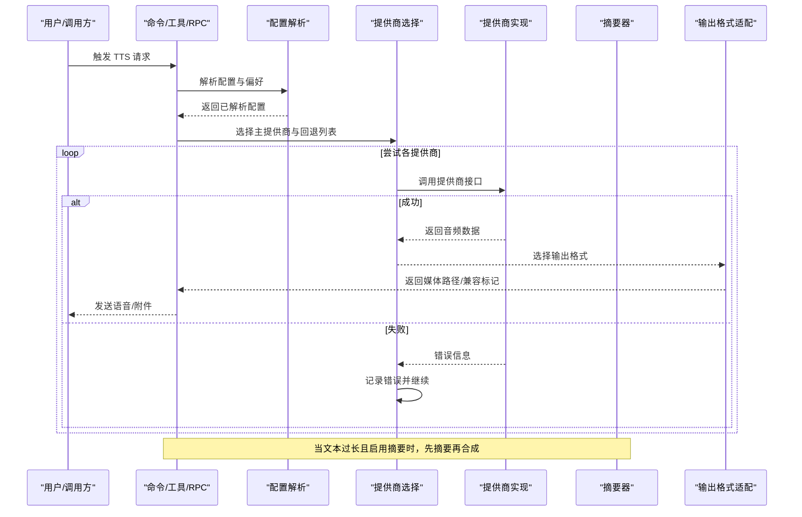
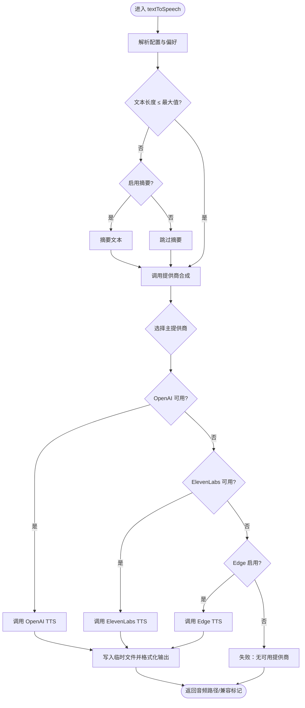
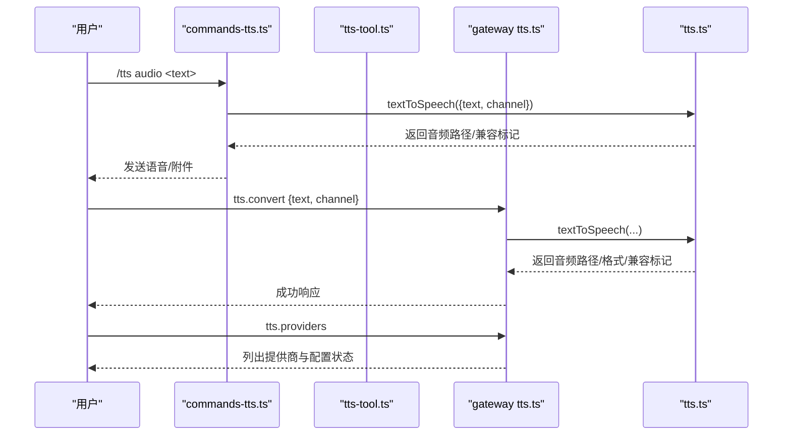
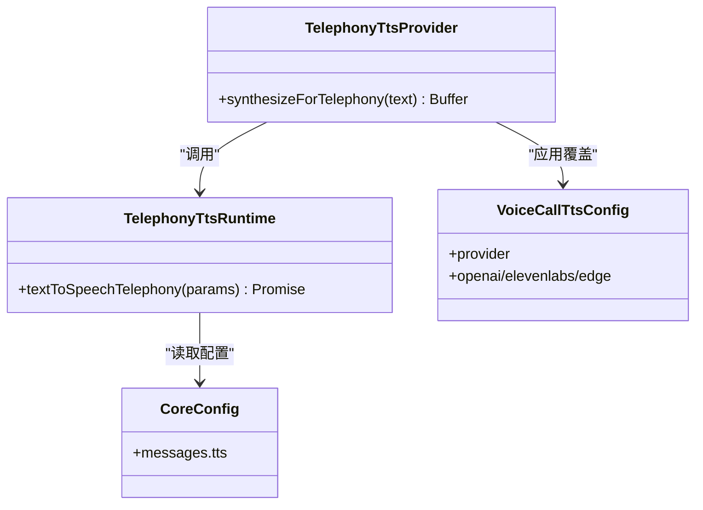
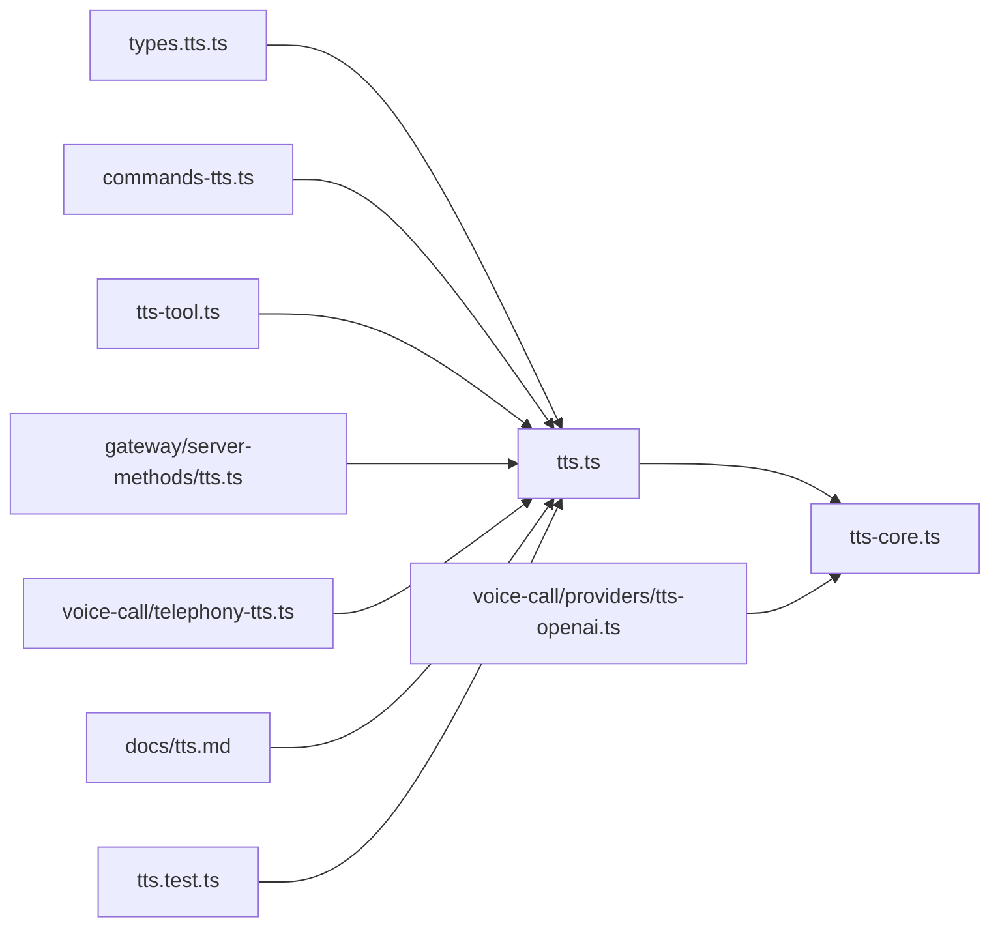

# 文本转语音工具

## 目录
1. [简介](#简介)
2. [项目结构](#项目结构)
3. [核心组件](#核心组件)
4. [架构总览](#架构总览)
5. [详细组件分析](#详细组件分析)
6. [依赖关系分析](#依赖关系分析)
7. [性能考虑](#性能考虑)
8. [故障排除指南](#故障排除指南)
9. [结论](#结论)
10. [附录](#附录)

## 简介
OpenClaw 的文本转语音（TTS）工具支持多种语音合成服务：ElevenLabs、OpenAI 和 Edge TTS。它既可用于自动回复中的语音播报，也可通过插件扩展用于电话语音通话场景。TTS 工具具备完善的参数配置、模型驱动的指令覆盖、自动摘要、输出格式适配以及与代理系统的深度集成能力。

## 项目结构
TTS 功能主要分布在以下模块：
- 配置与类型定义：消息配置下的 TTS 子配置与类型约束
- 核心逻辑：TTS 解析、摘要、提供商选择与调用
- 命令与工具：Slash 命令、Agent 工具、网关 RPC 方法
- 扩展与插件：电话语音通话集成、本地离线 TTS 技能
- 文档与测试：官方文档与单元测试

**图表来源**
- [src/config/types.tts.ts](file://src/config/types.tts.ts#L1-L86)
- [src/tts/tts.ts](file://src/tts/tts.ts#L1-L970)
- [src/tts/tts-core.ts](file://src/tts/tts-core.ts#L1-L700)
- [src/auto-reply/reply/commands-tts.ts](file://src/auto-reply/reply/commands-tts.ts#L1-L280)
- [src/agents/tools/tts-tool.ts](file://src/agents/tools/tts-tool.ts#L1-L62)
- [src/gateway/server-methods/tts.ts](file://src/gateway/server-methods/tts.ts#L1-L158)
- [extensions/voice-call/src/telephony-tts.ts](file://extensions/voice-call/src/telephony-tts.ts#L1-L83)
- [extensions/voice-call/src/providers/tts-openai.ts](file://extensions/voice-call/src/providers/tts-openai.ts#L1-L219)
- [skills/sherpa-onnx-tts/SKILL.md](file://skills/sherpa-onnx-tts/SKILL.md#L1-L104)
- [docs/tts.md](file://docs/tts.md#L1-L404)

**章节来源**
- [docs/tts.md](file://docs/tts.md#L1-L404)
- [src/tts/tts.ts](file://src/tts/tts.ts#L1-L970)
- [src/tts/tts-core.ts](file://src/tts/tts-core.ts#L1-L700)

## 核心组件
- 配置解析与默认值：根据用户配置与环境变量解析 TTS 参数，包含提供商、模型、声音、语言、种子、文本归一化、速率、音高等，并提供默认值与校验。
- 摘要与长度控制：对超长文本进行摘要，支持自定义摘要模型；提供最大文本长度限制，避免过长输入导致成本或性能问题。
- 提供商选择与回退：优先使用用户首选提供商，若不可用则按顺序尝试其他可用提供商；Edge TTS 在无密钥时可作为默认回退。
- 输出格式适配：针对不同渠道（如 Telegram 的语音气泡）自动选择最优输出格式（Opus/MP3），并兼容语音播放。
- 模型驱动的指令覆盖：允许模型在单条回复中注入 TTS 指令，动态覆盖提供商、声音、模型、音色设置等，支持白名单控制。
- 网关 RPC 与命令行：提供状态查询、启用/禁用、转换、切换提供商、列出提供商等 RPC 接口；Slash 命令支持一键开关、限长、摘要开关、一次性音频生成等。
- 电话语音通话集成：为电话系统提供专用的 PCM/μ-law 转换与采样率适配，确保与传统电话网络兼容。
- 本地离线 TTS 技能：提供基于 sherpa-onnx 的本地 TTS 能力，适合隐私敏感或无网络场景。

**章节来源**
- [src/tts/tts.ts](file://src/tts/tts.ts#L258-L325)
- [src/tts/tts-core.ts](file://src/tts/tts-core.ts#L46-L92)
- [src/config/types.tts.ts](file://src/config/types.tts.ts#L28-L85)
- [src/auto-reply/reply/commands-tts.ts](file://src/auto-reply/reply/commands-tts.ts#L43-L69)
- [src/gateway/server-methods/tts.ts](file://src/gateway/server-methods/tts.ts#L21-L157)
- [extensions/voice-call/src/telephony-tts.ts](file://extensions/voice-call/src/telephony-tts.ts#L24-L46)
- [skills/sherpa-onnx-tts/SKILL.md](file://skills/sherpa-onnx-tts/SKILL.md#L64-L104)

## 架构总览
TTS 的执行流程从“配置解析”开始，经过“提供商选择与调用”、“摘要与长度控制”、“输出格式适配”，最终返回音频路径或缓冲区。电话通话场景通过专用运行时与音频格式转换适配传统 PBX/云电话平台。

**图表来源**
- [src/tts/tts.ts](file://src/tts/tts.ts#L557-L723)
- [src/tts/tts-core.ts](file://src/tts/tts-core.ts#L432-L523)
- [src/tts/tts-core.ts](file://src/tts/tts-core.ts#L539-L661)

## 详细组件分析

### 组件A：TTS 核心流程与配置
- 配置解析：支持 OpenAI/ElevenLabs 的 API 密钥、基础 URL、模型与声音；Edge TTS 的语音、语言、输出格式、节拍/速率/音量、代理与超时；用户偏好路径与最大文本长度、超时等。
- 提供商选择：优先级为主提供商 → 其他可用提供商；Edge 可通过配置显式启用/禁用。
- 摘要与长度控制：当文本超过阈值且启用摘要时，调用摘要模型生成精简文本后再合成。
- 输出格式：根据渠道自动选择 Opus（语音气泡）或 MP3（通用），并判断是否语音兼容。
- 模型指令覆盖：解析 [[tts:...]] 指令，支持覆盖提供商、声音、模型、音色设置、语言、种子等，支持白名单控制。

**图表来源**
- [src/tts/tts.ts](file://src/tts/tts.ts#L557-L723)
- [src/tts/tts-core.ts](file://src/tts/tts-core.ts#L539-L661)

**章节来源**
- [src/tts/tts.ts](file://src/tts/tts.ts#L258-L325)
- [src/tts/tts.ts](file://src/tts/tts.ts#L557-L723)
- [src/tts/tts-core.ts](file://src/tts/tts-core.ts#L432-L523)

### 组件B：命令与工具集成
- Slash 命令：/tts on/off/status/provider/limit/summary/audio 等，支持授权发送者、本地偏好存储、状态展示与一次性音频生成。
- Agent 工具：tts 工具将结果转换为 MEDIA: 路径，Telegram 下自动标记为语音气泡。
- 网关 RPC：tts.status/tts.enable/tts.disable/tts.convert/tts.setProvider/tts.providers，便于外部系统集成与自动化。

**图表来源**
- [src/auto-reply/reply/commands-tts.ts](file://src/auto-reply/reply/commands-tts.ts#L71-L279)
- [src/agents/tools/tts-tool.ts](file://src/agents/tools/tts-tool.ts#L26-L61)
- [src/gateway/server-methods/tts.ts](file://src/gateway/server-methods/tts.ts#L69-L156)
- [src/tts/tts.ts](file://src/tts/tts.ts#L557-L723)

**章节来源**
- [src/auto-reply/reply/commands-tts.ts](file://src/auto-reply/reply/commands-tts.ts#L43-L279)
- [src/agents/tools/tts-tool.ts](file://src/agents/tools/tts-tool.ts#L17-L61)
- [src/gateway/server-methods/tts.ts](file://src/gateway/server-methods/tts.ts#L21-L157)

### 组件C：电话语音通话集成
- 运行时桥接：通过 createTelephonyTtsProvider 将核心 TTS 与电话系统集成，支持配置覆盖与合并。
- 音频格式转换：将提供商返回的 PCM 数据转换为 μ-law（8kHz）以满足传统电话网络要求。
- 采样率适配：根据提供商输出采样率进行转换，保证通话质量与兼容性。

**图表来源**
- [extensions/voice-call/src/telephony-tts.ts](file://extensions/voice-call/src/telephony-tts.ts#L6-L46)
- [extensions/voice-call/src/providers/tts-openai.ts](file://extensions/voice-call/src/providers/tts-openai.ts#L77-L151)

**章节来源**
- [extensions/voice-call/src/telephony-tts.ts](file://extensions/voice-call/src/telephony-tts.ts#L24-L83)
- [extensions/voice-call/src/providers/tts-openai.ts](file://extensions/voice-call/src/providers/tts-openai.ts#L1-L219)

### 组件D：本地离线 TTS 技能
- sherpa-onnx 技能提供本地语音合成，无需云端 API，适合隐私敏感或离线场景。
- 安装步骤：下载运行时与模型，配置环境变量后即可使用。
- 使用方式：通过技能包装脚本直接调用本地 CLI。

**章节来源**
- [skills/sherpa-onnx-tts/SKILL.md](file://skills/sherpa-onnx-tts/SKILL.md#L64-L104)

## 依赖关系分析
- 配置层：types.tts.ts 定义配置结构与约束，tts.ts 中解析为运行时配置。
- 核心层：tts-core.ts 实现提供商调用、摘要、格式推断与清理调度。
- 接口层：commands-tts.ts、tts-tool.ts、gateway server-methods/tts.ts 分别对接命令、工具与 RPC。
- 扩展层：voice-call 插件提供电话通话专用集成与音频转换。
- 文档与测试：docs/tts.md 提供使用说明与配置示例；tts.test.ts 覆盖关键行为与边界条件。

**图表来源**
- [src/config/types.tts.ts](file://src/config/types.tts.ts#L1-L86)
- [src/tts/tts.ts](file://src/tts/tts.ts#L1-L970)
- [src/tts/tts-core.ts](file://src/tts/tts-core.ts#L1-L700)
- [src/auto-reply/reply/commands-tts.ts](file://src/auto-reply/reply/commands-tts.ts#L1-L280)
- [src/agents/tools/tts-tool.ts](file://src/agents/tools/tts-tool.ts#L1-L62)
- [src/gateway/server-methods/tts.ts](file://src/gateway/server-methods/tts.ts#L1-L158)
- [extensions/voice-call/src/telephony-tts.ts](file://extensions/voice-call/src/telephony-tts.ts#L1-L83)
- [extensions/voice-call/src/providers/tts-openai.ts](file://extensions/voice-call/src/providers/tts-openai.ts#L1-L219)
- [docs/tts.md](file://docs/tts.md#L1-L404)
- [src/tts/tts.test.ts](file://src/tts/tts.test.ts#L1-L667)

**章节来源**
- [src/tts/tts.ts](file://src/tts/tts.ts#L1-L970)
- [src/tts/tts-core.ts](file://src/tts/tts-core.ts#L1-L700)

## 性能考虑
- 超时与重试：为提供商请求设置超时，Edge TTS 在首选输出格式失败时自动回退到默认格式，减少失败重试成本。
- 临时文件管理：采用定时清理策略，避免磁盘空间占用。
- 输出格式选择：针对语音气泡通道优先选择 Opus，兼顾体积与质量；其他通道使用 MP3 平衡清晰度与兼容性。
- 摘要策略：对超长文本启用摘要，降低合成成本与延迟。
- 电话音频：将 PCM 转换为 μ-law（8kHz）以满足传统电话网络要求，减少带宽与延迟。

**章节来源**
- [src/tts/tts-core.ts](file://src/tts/tts-core.ts#L24-L24)
- [src/tts/tts.ts](file://src/tts/tts.ts#L516-L548)
- [src/tts/tts.ts](file://src/tts/tts.ts#L525-L548)
- [src/tts/tts.ts](file://src/tts/tts.ts#L525-L548)
- [src/tts/tts.ts](file://src/tts/tts.ts#L501-L506)
- [extensions/voice-call/src/telephony-tts.ts](file://extensions/voice-call/src/telephony-tts.ts#L43-L43)

## 故障排除指南
- 无可用提供商：检查 API 密钥、提供商配置与网络连通性；确认 Edge 是否启用。
- 文本过长：调整最大文本长度或开启摘要；必要时缩短输入。
- 摘要失败：确认摘要模型可用与 API 密钥正确；检查超时设置。
- 输出格式不兼容：针对 Telegram 使用 Opus；其他渠道使用 MP3。
- 电话音频异常：确认采样率与格式转换正确；检查 μ-law 编码与带宽限制。

**章节来源**
- [src/tts/tts.ts](file://src/tts/tts.ts#L542-L555)
- [src/tts/tts.ts](file://src/tts/tts.ts#L569-L574)
- [src/tts/tts-core.ts](file://src/tts/tts-core.ts#L432-L523)
- [src/tts/tts.ts](file://src/tts/tts.ts#L501-L506)
- [extensions/voice-call/src/telephony-tts.ts](file://extensions/voice-call/src/telephony-tts.ts#L39-L44)

## 结论
OpenClaw 的 TTS 工具提供了灵活、可配置且易于集成的语音合成能力。通过多提供商支持、模型驱动的指令覆盖、自动摘要与输出格式适配，能够满足从即时消息到电话通话的多样化场景需求。配合命令与 RPC 接口，开发者可以快速将其嵌入到代理系统与外部应用中。

## 附录

### 使用示例与最佳实践
- 启用自动 TTS：在 openclaw.json 中设置 messages.tts.auto 为 "always"/"inbound"/"tagged"。
- 选择提供商：优先配置 OpenAI 或 ElevenLabs，Edge 作为默认回退。
- 控制文本长度：合理设置 maxTextLength，避免超长文本触发摘要或截断。
- 语音质量：根据渠道选择输出格式；Telegram 使用 Opus，其他渠道使用 MP3。
- 一次性音频：使用 /tts audio &lt;text&gt; 生成单次语音，不改变全局状态。
- 电话集成：通过 voice-call 插件提供的运行时与转换函数，将文本转为 μ-law 音频流。

**章节来源**
- [docs/tts.md](file://docs/tts.md#L56-L200)
- [src/auto-reply/reply/commands-tts.ts](file://src/auto-reply/reply/commands-tts.ts#L96-L157)
- [src/gateway/server-methods/tts.ts](file://src/gateway/server-methods/tts.ts#L69-L100)
- [extensions/voice-call/src/telephony-tts.ts](file://extensions/voice-call/src/telephony-tts.ts#L32-L44)

### 权限与安全
- API 密钥：OpenAI 与 ElevenLabs 需要相应密钥；Edge 不需要密钥但受微软服务限制。
- 环境变量：支持通过 OPENAI_TTS_BASE_URL、OPENCLAW_TTS_PREFS 等环境变量进行配置。
- 代理与超时：Edge 支持代理与超时设置，避免网络不稳定影响体验。

**章节来源**
- [docs/tts.md](file://docs/tts.md#L33-L45)
- [src/tts/tts-core.ts](file://src/tts/tts-core.ts#L38-L44)
- [src/tts/tts-core.ts](file://src/tts/tts-core.ts#L680-L700)

### 测试与验证
- 单元测试覆盖：有效性校验、输出格式选择、指令解析、摘要调用、提供商选择等。
- 关键断言：模型/声音合法性、目标长度范围、摘要内容非空、提供商回退链路等。

**章节来源**
- [src/tts/tts.test.ts](file://src/tts/tts.test.ts#L95-L167)
- [src/tts/tts.test.ts](file://src/tts/tts.test.ts#L169-L217)
- [src/tts/tts.test.ts](file://src/tts/tts.test.ts#L252-L316)
- [src/tts/tts.test.ts](file://src/tts/tts.test.ts#L318-L456)
- [src/tts/tts.test.ts](file://src/tts/tts.test.ts#L458-L555)