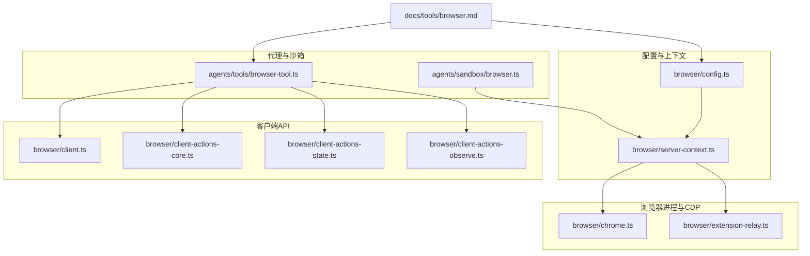
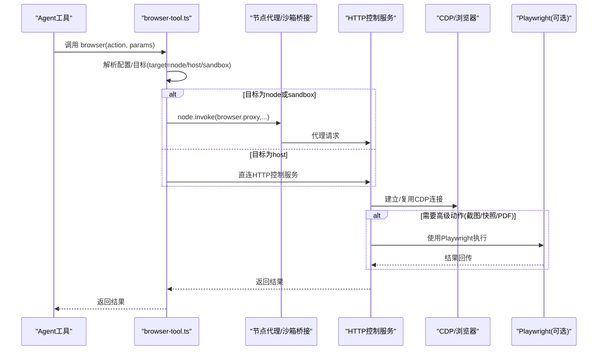
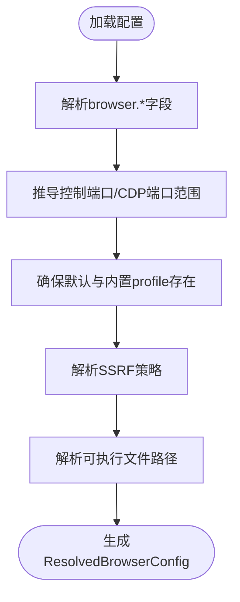
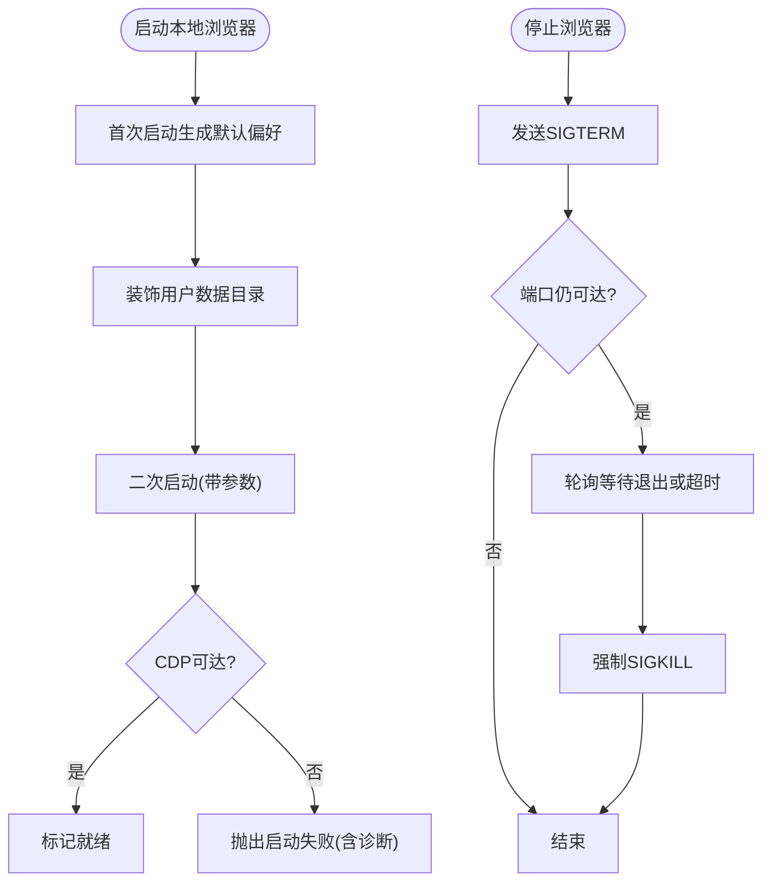
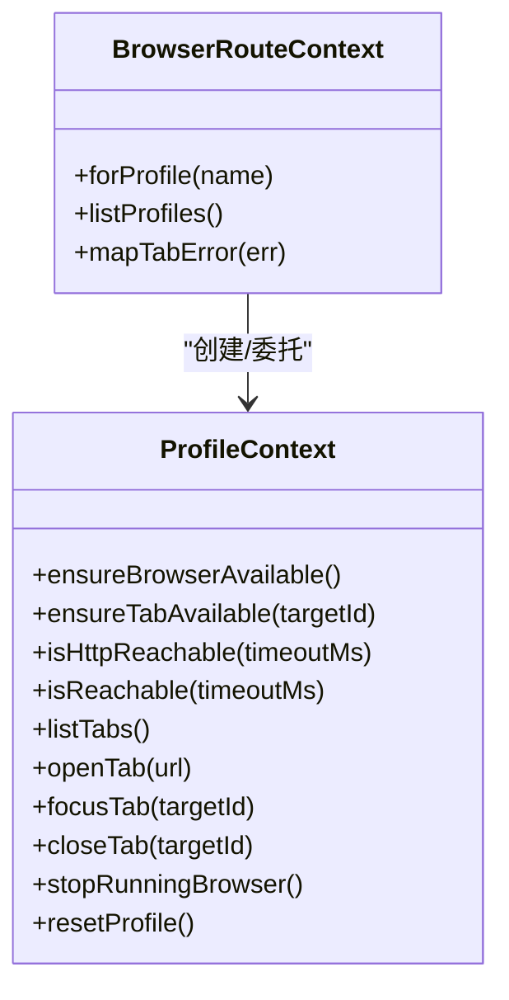
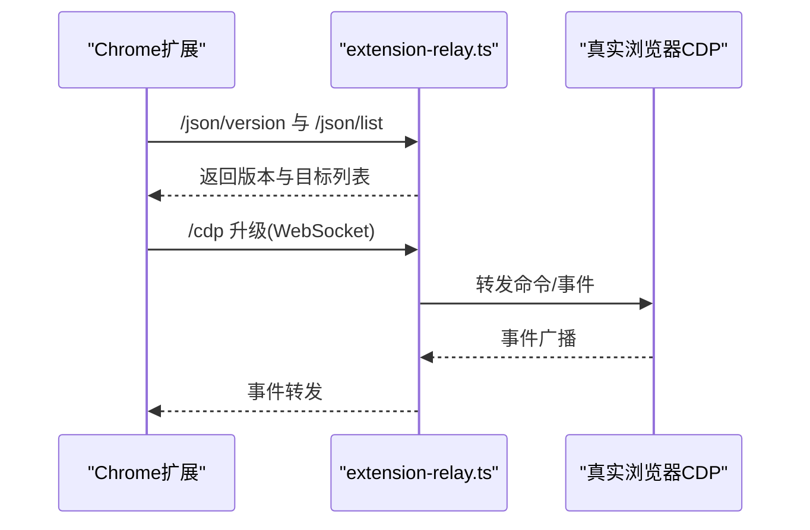
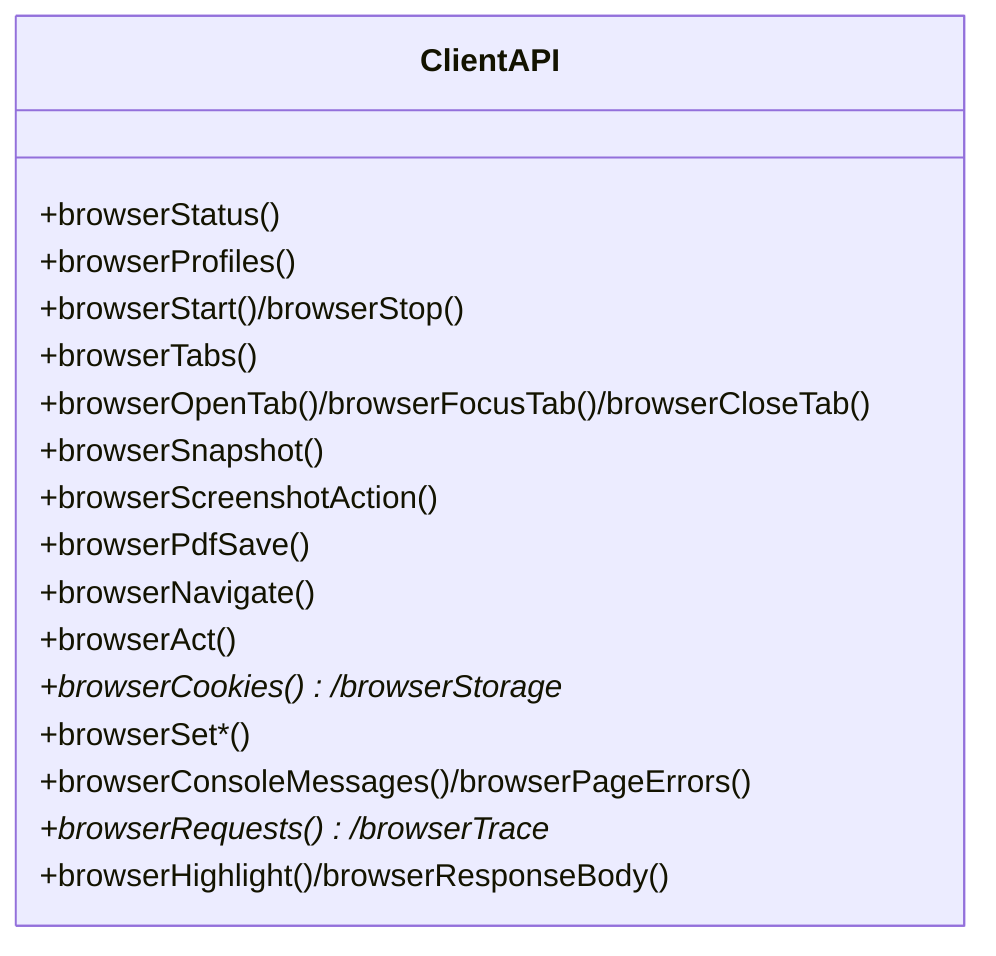
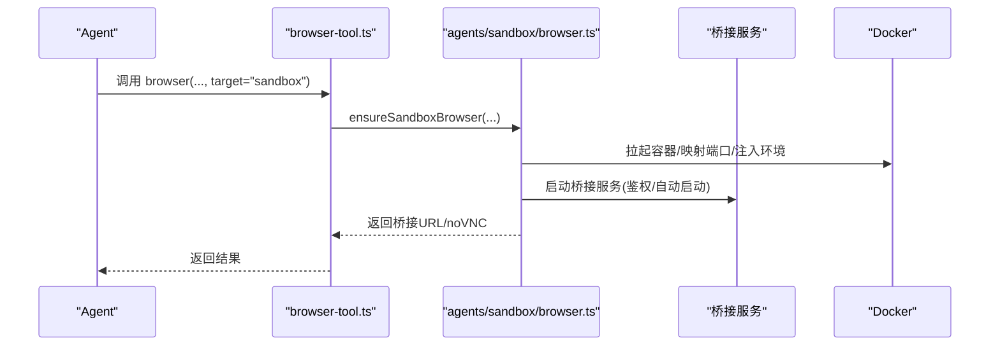
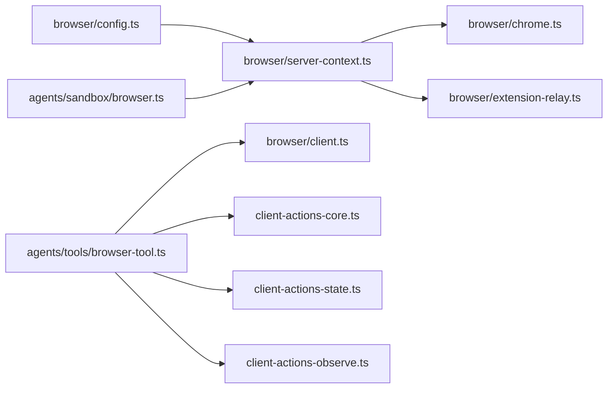

# 浏览器控制工具

## 目录
1. [简介](#简介)
2. [项目结构](#项目结构)
3. [核心组件](#核心组件)
4. [架构总览](#架构总览)
5. [详细组件分析](#详细组件分析)
6. [依赖关系分析](#依赖关系分析)
7. [性能考虑](#性能考虑)
8. [故障排查指南](#故障排查指南)
9. [结论](#结论)
10. [附录](#附录)

## 简介
本文件系统化阐述 OpenClaw 的浏览器控制工具：从浏览器自动化能力（页面导航、元素交互、截图、PDF、下载、状态与环境设置）到配置与执行流程，再到与代理系统（节点主机、沙箱）的集成方式与安全限制。文档面向不同技术背景的读者，既提供高层概览，也包含代码级关系图与调用序列图，帮助快速理解并正确使用该工具。

## 项目结构
浏览器控制工具由“配置解析、本地/远程浏览器生命周期管理、CDP 连接与可达性探测、HTTP 控制服务、Playwright 驱动的动作执行、代理路由与沙箱隔离”等模块组成。下图展示关键文件之间的关系：

**图表来源**
- [src/browser/config.ts](file://src/browser/config.ts#L212-L366)
- [src/browser/server-context.ts](file://src/browser/server-context.ts#L118-L242)
- [src/browser/chrome.ts](file://src/browser/chrome.ts#L238-L448)
- [src/browser/extension-relay.ts](file://src/browser/extension-relay.ts#L225-L800)
- [src/browser/client.ts](file://src/browser/client.ts#L103-L342)
- [src/browser/client-actions-core.ts](file://src/browser/client-actions-core.ts#L108-L260)
- [src/browser/client-actions-state.ts](file://src/browser/client-actions-state.ts#L70-L279)
- [src/browser/client-actions-observe.ts](file://src/browser/client-actions-observe.ts#L25-L185)
- [src/agents/tools/browser-tool.ts](file://src/agents/tools/browser-tool.ts#L281-L660)
- [src/agents/sandbox/browser.ts](file://src/agents/sandbox/browser.ts#L129-L402)
- [docs/tools/browser.md](file://docs/tools/browser.md#L1-L674)

**章节来源**
- [src/browser/config.ts](file://src/browser/config.ts#L212-L366)
- [src/browser/server-context.ts](file://src/browser/server-context.ts#L118-L242)
- [src/browser/chrome.ts](file://src/browser/chrome.ts#L238-L448)
- [src/browser/extension-relay.ts](file://src/browser/extension-relay.ts#L225-L800)
- [src/browser/client.ts](file://src/browser/client.ts#L103-L342)
- [src/browser/client-actions-core.ts](file://src/browser/client-actions-core.ts#L108-L260)
- [src/browser/client-actions-state.ts](file://src/browser/client-actions-state.ts#L70-L279)
- [src/browser/client-actions-observe.ts](file://src/browser/client-actions-observe.ts#L25-L185)
- [src/agents/tools/browser-tool.ts](file://src/agents/tools/browser-tool.ts#L281-L660)
- [src/agents/sandbox/browser.ts](file://src/agents/sandbox/browser.ts#L129-L402)
- [docs/tools/browser.md](file://docs/tools/browser.md#L1-L674)

## 核心组件
- 配置解析与默认值：负责解析浏览器配置、推导端口范围、默认 profile、SSRF 策略、可执行文件路径等。
- 服务器上下文：为每个 profile 维护运行态、可用性检查、标签页管理、重置与可达性探测。
- 本地浏览器管理：启动/停止本地 Chromium/Chrome/Brave/Edge，装饰用户数据目录，检测 CDP 就绪。
- 扩展中继：在 Chrome 扩展与 CDP 之间做桥接，转发命令、事件与目标列表。
- 客户端 API：统一的 HTTP 接口封装，覆盖状态、标签页、快照、截图、PDF、动作、状态与观察类能力。
- 代理路由与沙箱：根据策略自动选择 host、node 或 sandbox 目标；在沙箱容器内拉起浏览器并暴露桥接服务。

**章节来源**
- [src/browser/config.ts](file://src/browser/config.ts#L19-L366)
- [src/browser/server-context.ts](file://src/browser/server-context.ts#L45-L242)
- [src/browser/chrome.ts](file://src/browser/chrome.ts#L238-L448)
- [src/browser/extension-relay.ts](file://src/browser/extension-relay.ts#L225-L800)
- [src/browser/client.ts](file://src/browser/client.ts#L103-L342)
- [src/agents/tools/browser-tool.ts](file://src/agents/tools/browser-tool.ts#L281-L660)
- [src/agents/sandbox/browser.ts](file://src/agents/sandbox/browser.ts#L129-L402)

## 架构总览
浏览器控制工具采用“配置驱动 + 本地/远程 CDP + HTTP 控制服务 + Playwright 动作层”的分层设计。Agent 工具通过统一入口调用，按需路由到 host、node 或 sandbox。扩展中继用于 Chrome 扩展接管现有 Chrome 标签页；沙箱模式在容器内运行浏览器并通过桥接服务对外暴露。

**图表来源**
- [src/agents/tools/browser-tool.ts](file://src/agents/tools/browser-tool.ts#L305-L660)
- [src/browser/server-context.ts](file://src/browser/server-context.ts#L118-L242)
- [src/browser/client.ts](file://src/browser/client.ts#L103-L342)
- [src/browser/client-actions-core.ts](file://src/browser/client-actions-core.ts#L108-L260)
- [src/browser/client-actions-observe.ts](file://src/browser/client-actions-observe.ts#L25-L185)
- [src/browser/client-actions-state.ts](file://src/browser/client-actions-state.ts#L70-L279)

## 详细组件分析

### 配置与端口解析
- 支持多 profile（openclaw、chrome、remote），默认 profile 自动补齐。
- 自动推导控制端口与 CDP 端口范围，避免与开发工具冲突。
- SSRF 策略支持“受信任网络/严格公开”两种模式，并允许白名单主机名。
- 可指定可执行文件路径，或自动检测系统默认 Chromium 系浏览器。

**图表来源**
- [src/browser/config.ts](file://src/browser/config.ts#L212-L366)

**章节来源**
- [src/browser/config.ts](file://src/browser/config.ts#L212-L366)

### 本地浏览器生命周期与 CDP 就绪探测
- 启动时创建/装饰用户数据目录，必要时先启动一次以生成默认偏好，再进行装饰与重启。
- 通过端口可用性检查、/json/version 探测、WebSocket 握手命令等方式判断 CDP 就绪。
- 停止时优雅终止，超时后强制 SIGKILL，并探测端口不再可达。

**图表来源**
- [src/browser/chrome.ts](file://src/browser/chrome.ts#L238-L448)

**章节来源**
- [src/browser/chrome.ts](file://src/browser/chrome.ts#L238-L448)

### 服务器上下文与 profile 管理
- 为每个 profile 维护运行态、最后活动目标、可用性检查、标签页操作与重置逻辑。
- 列举 profile 状态时，会尝试探测端口是否监听、统计页面数、标注默认与远程属性。

**图表来源**
- [src/browser/server-context.ts](file://src/browser/server-context.ts#L45-L242)

**章节来源**
- [src/browser/server-context.ts](file://src/browser/server-context.ts#L45-L242)

### 扩展中继（Chrome 扩展接管）
- 提供 HTTP 与 WebSocket 服务，作为 Chrome 扩展与 CDP 的桥接。
- 处理扩展侧命令转发、事件广播、目标列表与 attach 状态维护。
- 支持鉴权头/查询令牌，仅允许来自扩展的升级请求。

**图表来源**
- [src/browser/extension-relay.ts](file://src/browser/extension-relay.ts#L538-L800)

**章节来源**
- [src/browser/extension-relay.ts](file://src/browser/extension-relay.ts#L225-L800)

### 客户端 API 与动作编排
- HTTP 控制服务提供统一接口：状态、标签页、快照、截图、PDF、导航、动作、状态与观察类能力。
- 动作层区分只读（如快照/截图/PDF）与需要 Playwright 的高级动作（点击/输入/拖拽/选择/等待/评估）。
- 状态与环境设置支持 Cookie、Storage、离线、自定义 Header、HTTP 基本认证、地理信息、媒体主题、时区、语言、设备/视口等。

**图表来源**
- [src/browser/client.ts](file://src/browser/client.ts#L103-L342)
- [src/browser/client-actions-core.ts](file://src/browser/client-actions-core.ts#L108-L260)
- [src/browser/client-actions-state.ts](file://src/browser/client-actions-state.ts#L70-L279)
- [src/browser/client-actions-observe.ts](file://src/browser/client-actions-observe.ts#L25-L185)

**章节来源**
- [src/browser/client.ts](file://src/browser/client.ts#L103-L342)
- [src/browser/client-actions-core.ts](file://src/browser/client-actions-core.ts#L108-L260)
- [src/browser/client-actions-state.ts](file://src/browser/client-actions-state.ts#L70-L279)
- [src/browser/client-actions-observe.ts](file://src/browser/client-actions-observe.ts#L25-L185)

### 代理路由与沙箱执行
- Agent 工具根据策略与目标选择 host、node 或 sandbox。
- 沙箱模式在容器内拉起浏览器，映射 CDP 端口与可选 noVNC 端口，注入安全参数（如 no-sandbox），并暴露桥接服务。
- 沙箱浏览器注册表记录容器名、配置哈希、最近使用时间等，支持热复用与变更检测。

**图表来源**
- [src/agents/tools/browser-tool.ts](file://src/agents/tools/browser-tool.ts#L305-L358)
- [src/agents/sandbox/browser.ts](file://src/agents/sandbox/browser.ts#L129-L402)

**章节来源**
- [src/agents/tools/browser-tool.ts](file://src/agents/tools/browser-tool.ts#L281-L660)
- [src/agents/sandbox/browser.ts](file://src/agents/sandbox/browser.ts#L129-L402)

## 依赖关系分析
- 配置解析依赖端口默认值与网关端口派生逻辑，确保控制端口与 CDP 端口范围不冲突。
- 服务器上下文依赖配置解析与可达性探测，为动作层提供稳定的 profile 上下文。
- 本地浏览器管理依赖平台可执行文件解析、用户数据目录装饰与 CDP 就绪探测。
- 客户端 API 依赖 HTTP 客户端封装与查询参数构建，动作层进一步依赖 Playwright（可选）。
- 代理路由与沙箱依赖工具策略、节点发现与容器编排。

**图表来源**
- [src/browser/config.ts](file://src/browser/config.ts#L212-L366)
- [src/browser/server-context.ts](file://src/browser/server-context.ts#L118-L242)
- [src/browser/chrome.ts](file://src/browser/chrome.ts#L238-L448)
- [src/browser/extension-relay.ts](file://src/browser/extension-relay.ts#L225-L800)
- [src/browser/client.ts](file://src/browser/client.ts#L103-L342)
- [src/browser/client-actions-core.ts](file://src/browser/client-actions-core.ts#L108-L260)
- [src/browser/client-actions-state.ts](file://src/browser/client-actions-state.ts#L70-L279)
- [src/browser/client-actions-observe.ts](file://src/browser/client-actions-observe.ts#L25-L185)
- [src/agents/tools/browser-tool.ts](file://src/agents/tools/browser-tool.ts#L281-L660)
- [src/agents/sandbox/browser.ts](file://src/agents/sandbox/browser.ts#L129-L402)

**章节来源**
- [src/browser/config.ts](file://src/browser/config.ts#L212-L366)
- [src/browser/server-context.ts](file://src/browser/server-context.ts#L118-L242)
- [src/browser/chrome.ts](file://src/browser/chrome.ts#L238-L448)
- [src/browser/extension-relay.ts](file://src/browser/extension-relay.ts#L225-L800)
- [src/browser/client.ts](file://src/browser/client.ts#L103-L342)
- [src/browser/client-actions-core.ts](file://src/browser/client-actions-core.ts#L108-L260)
- [src/browser/client-actions-state.ts](file://src/browser/client-actions-state.ts#L70-L279)
- [src/browser/client-actions-observe.ts](file://src/browser/client-actions-observe.ts#L25-L185)
- [src/agents/tools/browser-tool.ts](file://src/agents/tools/browser-tool.ts#L281-L660)
- [src/agents/sandbox/browser.ts](file://src/agents/sandbox/browser.ts#L129-L402)

## 性能考虑
- 启动阶段：避免频繁重启，优先复用已就绪的 profile；对 CDP 就绪探测设置合理超时，减少无效等待。
- 远程 CDP：针对非回环地址设置更长的探测与握手超时，降低误判。
- Playwright：仅在需要高级动作时启用，避免在无 Playwright 环境下的额外开销。
- 沙箱：容器内启用 no-sandbox 并持久化浏览器缓存路径，提升启动速度与稳定性。
- 资源限制：在容器中限制 CPU/内存与磁盘挂载，避免资源争用。

[本节为通用建议，无需特定文件引用]

## 故障排查指南
- 启动失败：查看本地浏览器 stderr 摘要与沙箱提示（如 Linux 容器需 no-sandbox）。确认端口未被占用，必要时调整端口范围。
- CDP 不可达：检查 /json/version 是否返回 webSocketDebuggerUrl；若为 WebSocket 直连端点，确认握手超时设置。
- 扩展中继：确认扩展已连接（badge ON）、鉴权令牌有效、仅允许来自扩展的升级请求。
- 代理路由：当存在多个节点时，确认 gateway.nodes.browser.mode 与 target 参数；必要时显式指定 node 或 profile。
- 沙箱：若配置变更导致“热浏览器”，按提示重建容器；检查 noVNC 密码与令牌。

**章节来源**
- [src/browser/chrome.ts](file://src/browser/chrome.ts#L370-L448)
- [src/browser/extension-relay.ts](file://src/browser/extension-relay.ts#L538-L800)
- [src/agents/tools/browser-tool.ts](file://src/agents/tools/browser-tool.ts#L316-L358)
- [src/agents/sandbox/browser.ts](file://src/agents/sandbox/browser.ts#L190-L215)

## 结论
OpenClaw 的浏览器控制工具通过“配置驱动 + CDP + HTTP 控制服务 + 可选 Playwright”的架构，实现了对本地/远程浏览器的统一控制与可观测性。配合节点代理与沙箱执行，既能满足日常自动化需求，也能在受限环境中安全稳定地运行。建议结合 SSRF 策略、鉴权与最小权限原则，确保生产环境的安全与合规。

[本节为总结，无需特定文件引用]

## 附录

### 使用示例与最佳实践
- 启动与状态
  - 使用 status/start/stop 管理浏览器生命周期。
  - 默认 profile 为 openclaw（隔离浏览器），如需接管现有 Chrome 标签页，使用 profile="chrome"。
- 页面操作
  - 先 snapshot 获取 refs，再 act 使用 numeric refs 或 role refs（如 e12）。
  - 使用 wait 组合条件（文本/URL/加载状态/JS 断言）提升稳定性。
- 元素定位
  - 优先使用 refs（numeric 或 role），避免基于 CSS 选择器的脆弱定位。
  - 在 iframe 内操作时，先对 iframe 做 role snapshot 再使用作用域内的 ref。
- 数据提取
  - PDF 保存、截图（全页/元素）、响应体截断读取、控制台/错误/请求日志辅助调试。
- 安全与权限
  - 严格模式下限制私有网络访问，必要时配置 hostname 白名单。
  - 远程 CDP 凭据使用环境变量或密钥管理，避免硬编码。
  - 沙箱模式下，host 控制需显式授权；跨命名空间场景谨慎开放 relayBindHost。

**章节来源**
- [docs/tools/browser.md](file://docs/tools/browser.md#L369-L674)
- [src/browser/client-actions-core.ts](file://src/browser/client-actions-core.ts#L108-L260)
- [src/browser/client-actions-observe.ts](file://src/browser/client-actions-observe.ts#L25-L185)
- [src/browser/client-actions-state.ts](file://src/browser/client-actions-state.ts#L70-L279)