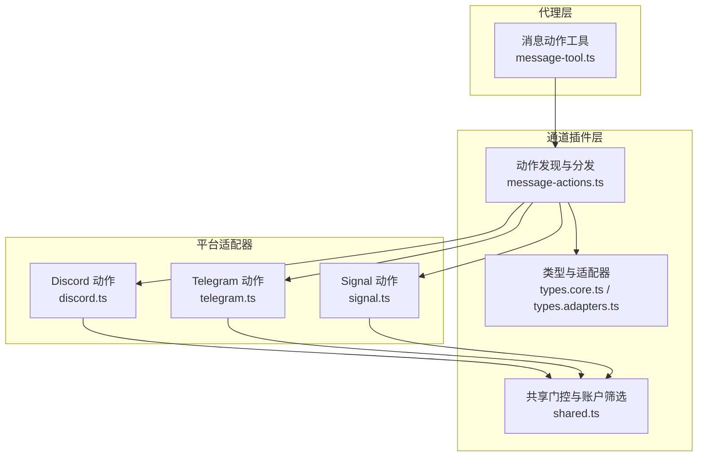
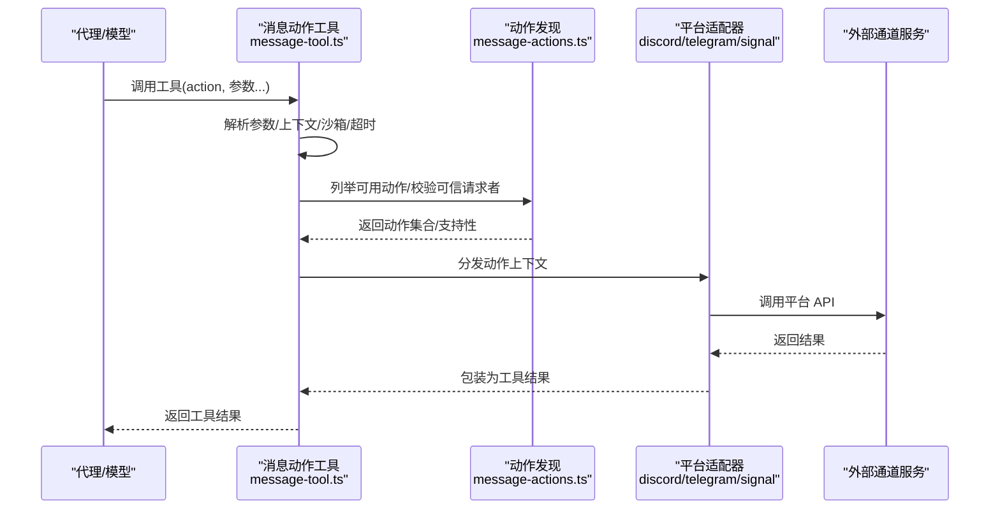
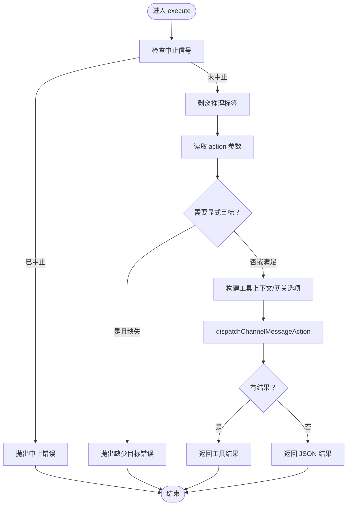
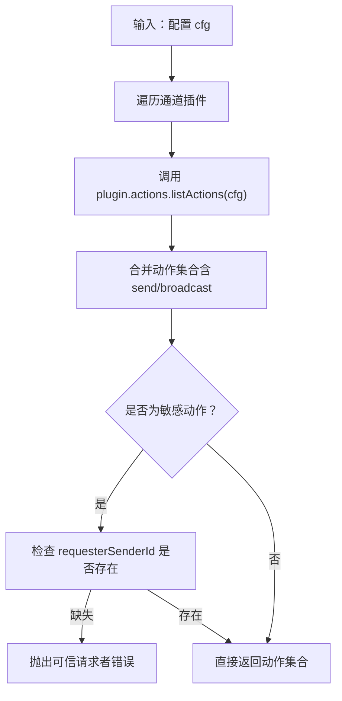
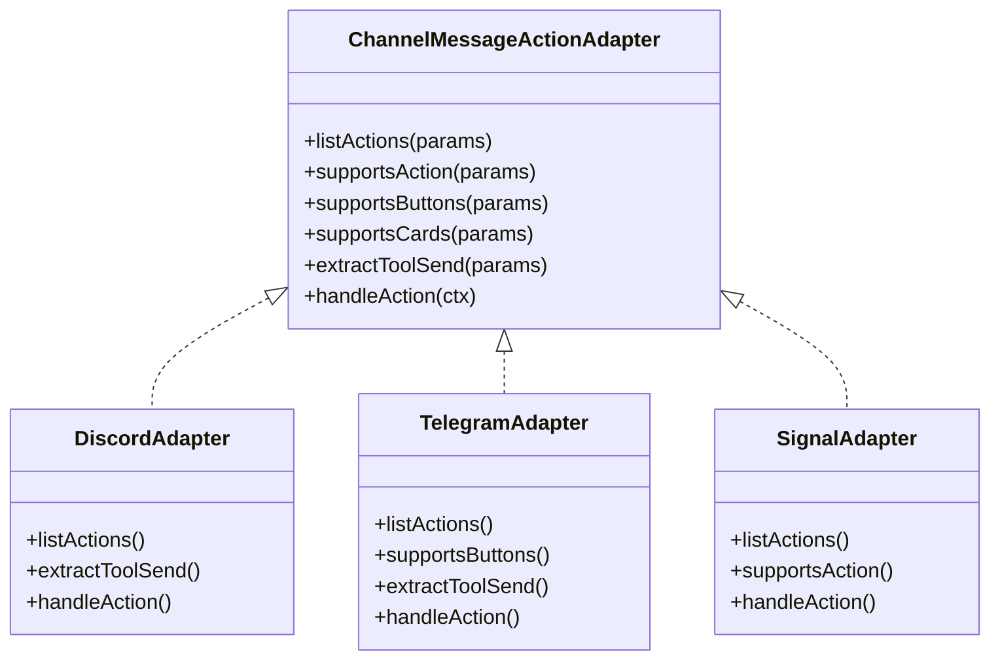
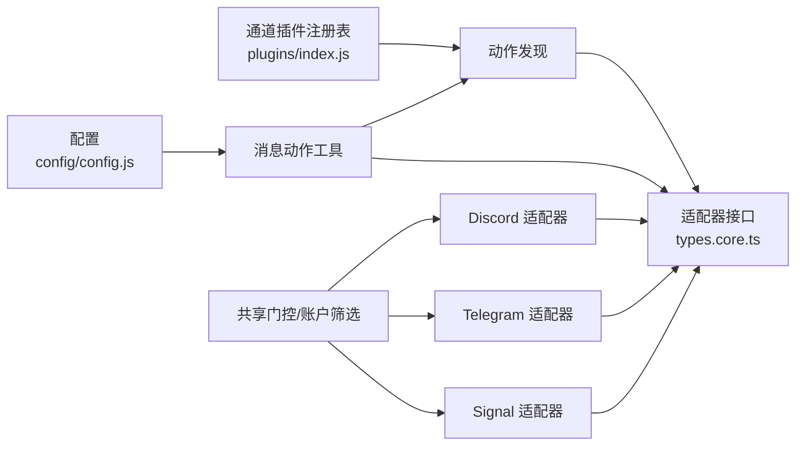

# 渠道动作工具

## 目录
1. [简介](#简介)
2. [项目结构](#项目结构)
3. [核心组件](#核心组件)
4. [架构总览](#架构总览)
5. [详细组件分析](#详细组件分析)
6. [依赖关系分析](#依赖关系分析)
7. [性能考虑](#性能考虑)
8. [故障排查指南](#故障排查指南)
9. [结论](#结论)
10. [附录](#附录)

## 简介
本文件系统性阐述 OpenClaw 的“渠道动作工具”，用于在多即时通讯平台（如 Telegram、Discord、Signal 等）上执行消息发送、反应、投票、话题/子频道管理、搜索、贴纸、事件等动作。该工具通过统一的 Agent 工具接口暴露能力，并由各渠道插件适配具体平台的可用动作集合与调用方式。文档覆盖：
- 功能范围与支持的动作类型
- 参数配置与执行流程
- 权限要求与安全限制
- 与代理系统的集成机制（工具注册、调用链路、错误处理）
- 渠道沙箱执行、资源限制与性能优化策略

## 项目结构
OpenClaw 将“消息动作工具”作为 Agent 工具实现，围绕“通道插件”体系组织各平台能力。关键目录与文件：
- 工具定义与执行：src/agents/tools/message-tool.ts
- 通道动作发现与分发：src/channels/plugins/message-actions.ts
- 通道类型与适配器：src/channels/plugins/types.core.ts、types.adapters.ts
- 平台动作适配器示例：src/channels/plugins/actions/&#123;discord,telegram,signal&#125;.ts
- 共享动作门控与账户筛选：src/channels/plugins/actions/shared.ts
- 行为测试与描述生成：src/agents/tools/message-tool.test.ts

图表来源
- [message-tool.ts](file://src/agents/tools/message-tool.ts#L669-L792)
- [message-actions.ts](file://src/channels/plugins/message-actions.ts#L19-L103)
- [types.core.ts](file://src/channels/plugins/types.core.ts#L317-L360)
- [types.adapters.ts](file://src/channels/plugins/types.adapters.ts#L347-L360)
- [discord.ts](file://src/channels/plugins/actions/discord.ts#L7-L102)
- [telegram.ts](file://src/channels/plugins/actions/telegram.ts#L68-L111)
- [signal.ts](file://src/channels/plugins/actions/signal.ts#L72-L93)
- [shared.ts](file://src/channels/plugins/actions/shared.ts#L7-L19)

章节来源
- [message-tool.ts](file://src/agents/tools/message-tool.ts#L1-L793)
- [message-actions.ts](file://src/channels/plugins/message-actions.ts#L1-L104)
- [types.core.ts](file://src/channels/plugins/types.core.ts#L1-L391)
- [types.adapters.ts](file://src/channels/plugins/types.adapters.ts#L1-L384)
- [discord.ts](file://src/channels/plugins/actions/discord.ts#L1-L135)
- [telegram.ts](file://src/channels/plugins/actions/telegram.ts#L1-L288)
- [signal.ts](file://src/channels/plugins/actions/signal.ts#L1-L187)
- [shared.ts](file://src/channels/plugins/actions/shared.ts#L1-L20)

## 核心组件
- 消息动作工具（Agent Tool）
  - 负责构建工具 Schema、解析参数、执行动作、返回结果。
  - 支持按当前通道动态推断可用动作，或跨通道动作发现。
- 通道动作发现与分发
  - 统一列举所有已启用通道的可用动作；对需要“可信请求者身份”的动作进行校验。
- 通道类型与适配器
  - 定义动作上下文、适配器接口（Outbound、Gateway、Directory、Resolver 等），支撑跨平台一致性。
- 平台动作适配器
  - 各平台（Discord、Telegram、Signal 等）实现 listActions、supportsAction、handleAction 等，暴露具体能力。

章节来源
- [message-tool.ts](file://src/agents/tools/message-tool.ts#L669-L792)
- [message-actions.ts](file://src/channels/plugins/message-actions.ts#L19-L103)
- [types.core.ts](file://src/channels/plugins/types.core.ts#L317-L360)
- [types.adapters.ts](file://src/channels/plugins/types.adapters.ts#L347-L360)

## 架构总览
消息动作工具的执行链路由“工具层 → 动作发现 → 平台适配器 → 外部通道服务”构成，具备以下关键点：
- 工具层负责参数解析、上下文注入（当前通道、线程、消息）、沙箱与超时控制。
- 动作发现层根据配置聚合各通道可用动作，并对敏感动作（如封禁、踢人）要求可信请求者身份。
- 平台适配器负责将通用动作映射到平台 API，处理目标规范化、按钮/卡片支持、轮询可见性等。

图表来源
- [message-tool.ts](file://src/agents/tools/message-tool.ts#L689-L790)
- [message-actions.ts](file://src/channels/plugins/message-actions.ts#L87-L103)
- [discord.ts](file://src/channels/plugins/actions/discord.ts#L115-L133)
- [telegram.ts](file://src/channels/plugins/actions/telegram.ts#L124-L136)
- [signal.ts](file://src/channels/plugins/actions/signal.ts#L96-L101)

章节来源
- [message-tool.ts](file://src/agents/tools/message-tool.ts#L669-L792)
- [message-actions.ts](file://src/channels/plugins/message-actions.ts#L87-L103)

## 详细组件分析

### 组件A：消息动作工具（Agent Tool）
- 功能要点
  - 动态构建 Schema：依据当前通道与全局配置，决定是否包含按钮、卡片、Discord 组件、Telegram 轮询扩展等。
  - 动作过滤：针对 BlueBubbles 的群组/私聊差异，动态裁剪动作集合。
  - 上下文注入：当前通道、线程、消息 ID、回复模式等，用于跨上下文装饰与转发。
  - 执行路径：调用 runMessageAction → dispatchChannelMessageAction → 平台适配器 handleAction。
  - 错误处理：中止信号、理由标签剥离、显式目标校验、可信请求者校验。
- 关键流程图

图表来源
- [message-tool.ts](file://src/agents/tools/message-tool.ts#L689-L790)
- [message-actions.ts](file://src/channels/plugins/message-actions.ts#L87-L103)

章节来源
- [message-tool.ts](file://src/agents/tools/message-tool.ts#L669-L792)
- [message-tool.test.ts](file://src/agents/tools/message-tool.test.ts#L297-L391)

### 组件B：动作发现与分发
- 功能要点
  - 聚合所有通道的 listActions，去重后形成工具可用动作集。
  - 对特定动作（如 Discord 的 timeout/kick/ban）要求“可信请求者身份”（来自入站上下文注入）。
  - 支持按钮/卡片特性探测，用于 Schema 动态生成。
- 关键流程图

图表来源
- [message-actions.ts](file://src/channels/plugins/message-actions.ts#L19-L103)

章节来源
- [message-actions.ts](file://src/channels/plugins/message-actions.ts#L1-L104)

### 组件C：平台动作适配器（以 Discord/Telegram/Signal 为例）
- Discord
  - 动作来源：基于账户级动作门控（token 源账户）聚合，启用任一账户即开放对应动作。
  - 支持动作：轮询、反应、消息读取/编辑/删除、置顶/取消置顶/列出、权限、线程、搜索、贴纸、成员/角色信息、表情上传/列表、频道/分类管理、语音状态、事件、适度管理、在线状态等。
  - 提供 extractToolSend，便于从工具参数提取发送目标。
- Telegram
  - 动作来源：基于账户级动作门控与轮询可见性状态，聚合可用动作。
  - 支持动作：发送、轮询、反应、删除、编辑、贴纸/搜索、论坛话题创建。
  - 支持内联按钮（取决于账户配置）。
- Signal
  - 动作来源：启用且已配置的账户，启用 reactions 动作才开放。
  - 支持动作：发送（由外发处理）、反应（需 reactionLevel 与动作门控均允许）。
  - 反应目标支持个人与群组，群组反应需提供作者标识。

图表来源
- [types.core.ts](file://src/channels/plugins/types.core.ts#L347-L360)
- [discord.ts](file://src/channels/plugins/actions/discord.ts#L7-L102)
- [telegram.ts](file://src/channels/plugins/actions/telegram.ts#L68-L111)
- [signal.ts](file://src/channels/plugins/actions/signal.ts#L72-L93)

章节来源
- [discord.ts](file://src/channels/plugins/actions/discord.ts#L1-L135)
- [telegram.ts](file://src/channels/plugins/actions/telegram.ts#L1-L288)
- [signal.ts](file://src/channels/plugins/actions/signal.ts#L1-L187)
- [shared.ts](file://src/channels/plugins/actions/shared.ts#L1-L20)

### 组件D：类型与适配器（通道运行时）
- 类型定义
  - ChannelMessageActionContext：动作上下文（通道、动作、配置、参数、请求者 ID、网关、工具上下文、干跑等）。
  - ChannelMessageActionAdapter：通道动作适配器接口。
  - 通道适配器族：Outbound、Gateway、Directory、Resolver、Security 等，支撑跨平台一致行为。
- 作用
  - 规范化动作上下文与返回结果，统一错误与日志处理，为外部插件提供运行时能力。

章节来源
- [types.core.ts](file://src/channels/plugins/types.core.ts#L317-L360)
- [types.adapters.ts](file://src/channels/plugins/types.adapters.ts#L347-L360)

## 依赖关系分析
- 工具层依赖
  - 配置加载、目标归一化、消息动作运行器、类型定义与 Schema。
- 发现层依赖
  - 通道插件注册表、动作名称常量、特性探测函数。
- 适配器层依赖
  - 账户门控（Union Gate）、账户筛选（Token 源账户）、平台专用逻辑（轮询可见性、按钮支持等）。

图表来源
- [message-tool.ts](file://src/agents/tools/message-tool.ts#L1-L30)
- [message-actions.ts](file://src/channels/plugins/message-actions.ts#L1-L10)
- [discord.ts](file://src/channels/plugins/actions/discord.ts#L1-L5)
- [telegram.ts](file://src/channels/plugins/actions/telegram.ts#L1-L20)
- [signal.ts](file://src/channels/plugins/actions/signal.ts#L1-L6)
- [shared.ts](file://src/channels/plugins/actions/shared.ts#L1-L19)

章节来源
- [message-tool.ts](file://src/agents/tools/message-tool.ts#L1-L30)
- [message-actions.ts](file://src/channels/plugins/message-actions.ts#L1-L10)
- [shared.ts](file://src/channels/plugins/actions/shared.ts#L1-L20)

## 性能考虑
- 动态 Schema 生成
  - 仅在需要时启用按钮/卡片/组件/轮询扩展，减少参数复杂度与校验开销。
- 动作聚合与缓存
  - 基于账户门控的联合门控（Union Gate）避免重复计算，提升动作枚举效率。
- 目标归一化与特性探测
  - 在工具层进行一次归一化与特性探测，减少适配器内部分支判断次数。
- 网关与超时
  - 工具层支持自定义网关 URL/Token/超时，便于隔离与限流。
- 沙箱与资源限制
  - 工具层可传入沙箱根目录，结合安全策略限制执行环境。

章节来源
- [message-tool.ts](file://src/agents/tools/message-tool.ts#L442-L578)
- [shared.ts](file://src/channels/plugins/actions/shared.ts#L13-L19)
- [types.adapters.ts](file://src/channels/plugins/types.adapters.ts#L275-L289)

## 故障排查指南
- 常见错误与定位
  - 中止错误：当执行前检测到中止信号，工具会抛出中止错误，检查调用方的 AbortSignal。
  - 缺少显式目标：当 requireExplicitTarget 为真且动作需要目标时，若未提供 target/targets/channelId，将抛错。
  - 可信请求者缺失：对敏感动作（如 Discord 的 timeout/kick/ban），若工具驱动上下文缺少 requesterSenderId，将抛错。
  - 平台能力未启用：例如 Signal 反应需 reactionLevel 与动作门控同时允许；Telegram 账户未配置或轮询不可用。
- 排查步骤
  - 检查配置中的通道启用状态与账户配置。
  - 使用工具描述（自动列举当前通道与其它已配置通道支持的动作）辅助确认。
  - 查看动作适配器的 listActions 输出，确认目标动作是否被聚合。
  - 对于平台特定错误（如 Signal 反应），核对账户动作门控与 reactionLevel 设置。

章节来源
- [message-tool.ts](file://src/agents/tools/message-tool.ts#L689-L724)
- [message-actions.ts](file://src/channels/plugins/message-actions.ts#L87-L103)
- [signal.ts](file://src/channels/plugins/actions/signal.ts#L101-L120)
- [message-tool.test.ts](file://src/agents/tools/message-tool.test.ts#L297-L391)

## 结论
渠道动作工具通过统一的 Agent 工具接口与通道插件体系，实现了跨平台消息动作的标准化与可组合性。其核心优势在于：
- 动态能力发现与上下文感知
- 明确的权限与安全边界（可信请求者、动作门控）
- 可扩展的平台适配器与一致的类型约束
- 面向生产的错误处理与可观测性

建议在生产环境中：
- 明确各通道的动作门控与 reactionLevel 等安全配置
- 使用工具描述与测试用例验证动作可用性
- 在非主会话场景启用沙箱与资源限制

## 附录

### A. 参数与能力速览（示例）
- 通用参数
  - 路由：channel、target、targets、accountId、dryRun
  - 发送：message/effectId/effect/media/buffer/caption/path/quoteText/threadId/asVoice/silent/gifPlayback
  - 反应：messageId/message_id、emoji、remove、targetAuthor、targetAuthorUuid、groupId
  - 轮询：pollQuestion/pollOption/pollDurationSeconds/pollAnonymous/pollPublic 等（按平台扩展）
  - 按钮/卡片/组件：buttons（Telegram）、card（部分平台）、components（Discord）
- 平台动作示例
  - Discord：poll、react、read/edit/delete、pin/unpin/list-pins、permissions、threads、search、sticker、member/role info、emoji/sticker upload、channels/categories、voice-status、events、moderation、presence
  - Telegram：poll、react、delete、edit、sticker、sticker-search、topic-create
  - Signal：react（需启用）

章节来源
- [message-tool.ts](file://src/agents/tools/message-tool.ts#L164-L327)
- [discord.ts](file://src/channels/plugins/actions/discord.ts#L22-L101)
- [telegram.ts](file://src/channels/plugins/actions/telegram.ts#L83-L110)
- [signal.ts](file://src/channels/plugins/actions/signal.ts#L83-L92)

### B. 使用示例与最佳实践
- 示例场景
  - 在 Telegram 发送带按钮的消息并附带轮询
  - 在 Discord 创建线程并发送消息
  - 在 Signal 对指定消息添加/移除反应
- 最佳实践
  - 明确显式目标（target/targets/channelId），避免隐式路由导致的歧义
  - 使用工具描述快速了解当前通道与其他通道支持的动作
  - 对敏感动作（如 moderation）确保可信请求者身份
  - 合理设置沙箱与超时，避免阻塞与资源滥用

章节来源
- [message-tool.test.ts](file://src/agents/tools/message-tool.test.ts#L297-L391)
- [README.md](file://README.md#L1-L560)