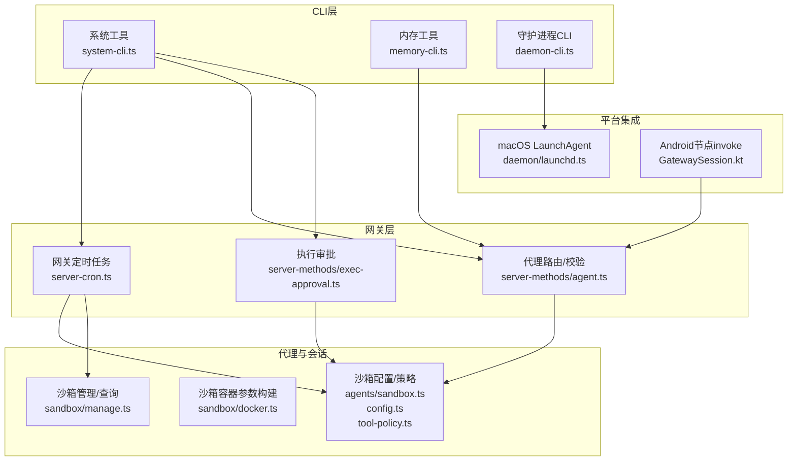
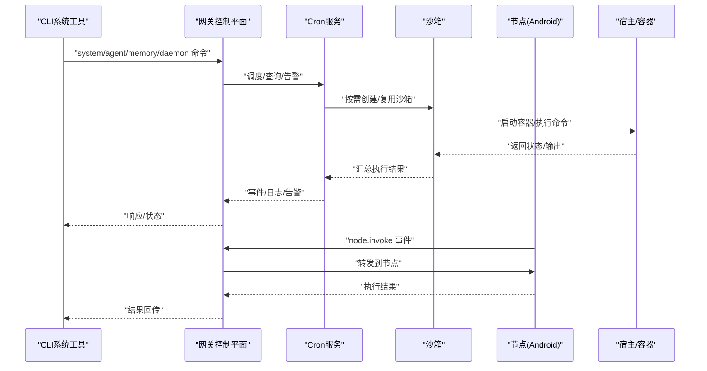
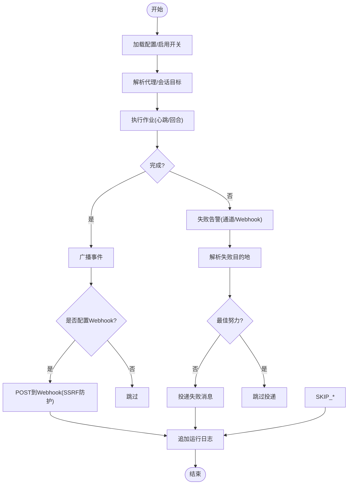
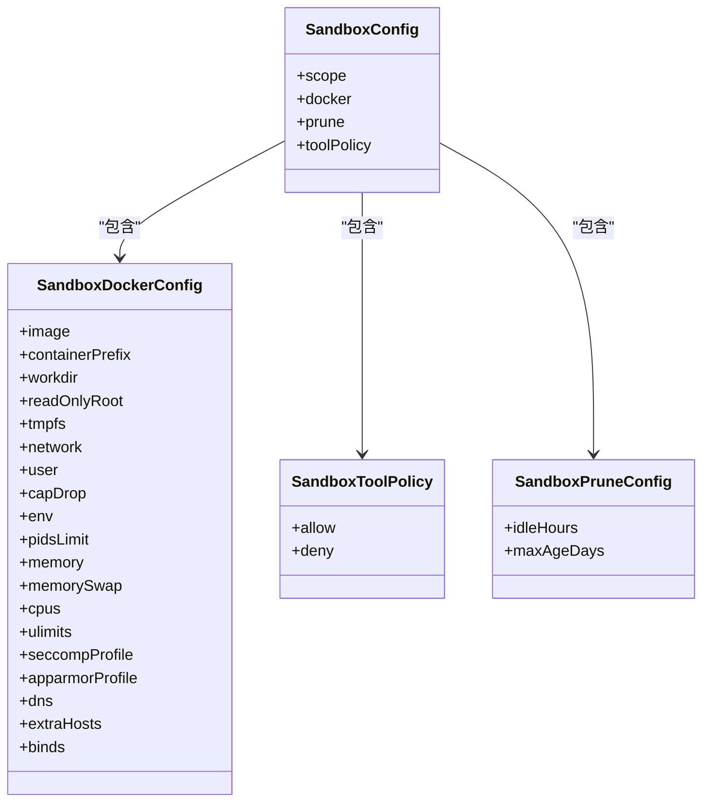
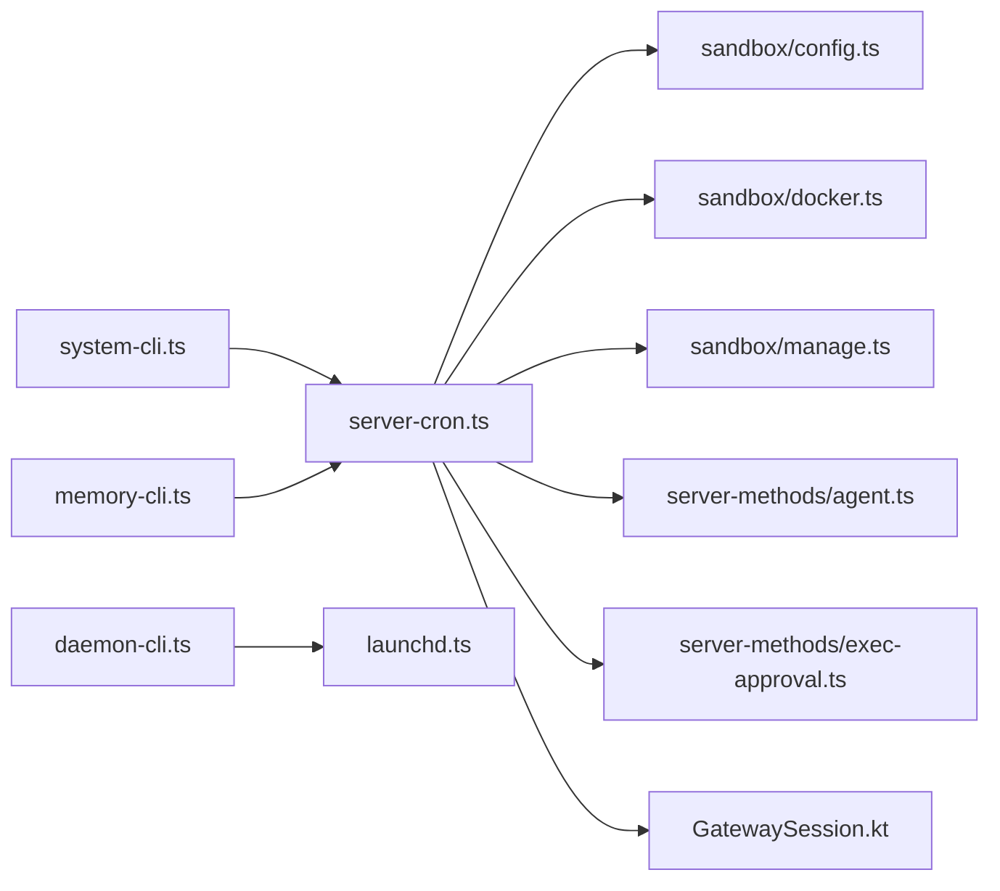

# 系统工具

## 目录
1. [简介](#简介)
2. [项目结构](#项目结构)
3. [核心组件](#核心组件)
4. [架构总览](#架构总览)
5. [组件详解](#组件详解)
6. [依赖关系分析](#依赖关系分析)
7. [性能考量](#性能考量)
8. [故障排查指南](#故障排查指南)
9. [结论](#结论)
10. [附录](#附录)

## 简介
本文件面向OpenClaw系统工具，系统性梳理并说明其在网关控制、内存管理、定时任务（Cron）、子代理管理、沙箱执行、资源限制与安全策略等方面的实现与使用方式。文档同时覆盖参数配置、执行流程、权限与安全限制，并给出可操作的使用示例与最佳实践，帮助用户在本地或远程环境中稳定、安全地运行系统工具。

## 项目结构
OpenClaw采用模块化分层设计：CLI命令层负责入口与参数解析；网关层提供WebSocket控制平面与服务编排；代理与会话层负责任务调度与上下文管理；沙箱层提供容器化隔离与资源限制；守护进程与平台集成层负责跨平台服务生命周期管理。

图表来源
- [src/cli/system-cli.ts](file://src/cli/system-cli.ts#L1-L200)
- [src/cli/memory-cli.ts](file://src/cli/memory-cli.ts#L1-L200)
- [src/cli/daemon-cli.ts](file://src/cli/daemon-cli.ts#L1-L200)
- [src/gateway/server-cron.ts](file://src/gateway/server-cron.ts#L144-L505)
- [src/gateway/server-methods/agent.ts](file://src/gateway/server-methods/agent.ts#L334-L349)
- [src/gateway/server-methods/exec-approval.ts](file://src/gateway/server-methods/exec-approval.ts#L154-L186)
- [src/agents/sandbox.ts](file://src/agents/sandbox.ts#L1-L45)
- [src/agents/sandbox/config.ts](file://src/agents/sandbox/config.ts#L76-L188)
- [src/agents/sandbox/docker.ts](file://src/agents/sandbox/docker.ts#L316-L342)
- [src/agents/sandbox/manage.ts](file://src/agents/sandbox/manage.ts#L1-L200)
- [src/daemon/launchd.ts](file://src/daemon/launchd.ts#L393-L526)
- [apps/android/app/src/main/java/ai/openclaw/app/gateway/GatewaySession.kt](file://apps/android/app/src/main/java/ai/openclaw/app/gateway/GatewaySession.kt#L517-L547)

章节来源
- [README.md](file://README.md#L185-L238)

## 核心组件
- 网关定时任务（Cron）：提供基于Cron表达式的计划任务执行、失败告警、运行日志与Webhook投递，支持按代理/会话维度调度。
- 沙箱系统：统一解析沙箱作用域、Docker参数、工具策略与清理策略，提供容器创建参数构建与管理接口，确保非主会话在受控环境下执行。
- 内存工具：对记忆库目录进行健康检查、路径可达性验证与问题报告，辅助诊断与维护。
- 守护进程（macOS LaunchAgent）：安装/卸载/重启LaunchAgent，输出安全日志路径，处理GUI域限制与兼容旧版单元。
- 执行审批：对高风险执行请求进行审批登记、广播与转发，结合设备/决策绑定防止重放攻击。
- 子代理管理：在网关侧对代理ID进行规范化与存在性校验，保障调用链正确性。
- 节点invoke（Android）：通过WebSocket事件触发节点侧本地能力执行，返回结果并处理异常。

章节来源
- [src/gateway/server-cron.ts](file://src/gateway/server-cron.ts#L144-L505)
- [src/agents/sandbox.ts](file://src/agents/sandbox.ts#L1-L45)
- [src/cli/memory-cli.ts](file://src/cli/memory-cli.ts#L204-L242)
- [src/daemon/launchd.ts](file://src/daemon/launchd.ts#L393-L526)
- [src/gateway/server-methods/exec-approval.ts](file://src/gateway/server-methods/exec-approval.ts#L154-L186)
- [src/gateway/server-methods/agent.ts](file://src/gateway/server-methods/agent.ts#L334-L349)
- [apps/android/app/src/main/java/ai/openclaw/app/gateway/GatewaySession.kt](file://apps/android/app/src/main/java/ai/openclaw/app/gateway/GatewaySession.kt#L517-L547)

## 架构总览
系统工具围绕“网关控制平面”组织，CLI通过网关方法与节点交互；Cron服务在网关内调度代理回合；沙箱在需要时提供容器化隔离；守护进程负责服务生命周期；Android节点通过invoke执行本地能力。

图表来源
- [src/gateway/server-cron.ts](file://src/gateway/server-cron.ts#L285-L297)
- [src/agents/sandbox/docker.ts](file://src/agents/sandbox/docker.ts#L316-L342)
- [apps/android/app/src/main/java/ai/openclaw/app/gateway/GatewaySession.kt](file://apps/android/app/src/main/java/ai/openclaw/app/gateway/GatewaySession.kt#L523-L547)

## 组件详解

### 网关定时任务（Cron）
- 功能要点
  - 解析Cron配置、作业存储路径与启用开关，支持环境变量禁用。
  - 支持按代理/会话键解析与默认代理回退，保证作业目标明确。
  - 提供心跳触发、孤立代理回合执行、失败告警（Webhook/通道投递）与运行日志追加。
  - 对Webhook进行SSRF防护与超时控制，失败/阻断分别记录。
- 关键流程
  - 作业完成事件广播，按配置选择投递目标（Webhook/通道），并写入运行日志。
  - 失败目的地根据作业与全局配置解析，支持最佳努力交付策略。
- 参数与配置
  - cron.enabled、cron.store、cron.webhookToken、cron.failureDestination、cron.runLog等。
- 使用建议
  - 将敏感URL收敛至受控域名，开启SSRF保护；合理设置runLog清理策略避免磁盘膨胀。

图表来源
- [src/gateway/server-cron.ts](file://src/gateway/server-cron.ts#L231-L502)

章节来源
- [src/gateway/server-cron.ts](file://src/gateway/server-cron.ts#L144-L505)

### 沙箱系统（容器化隔离与资源限制）
- 功能要点
  - 统一解析沙箱作用域（agent/session/shared）、Docker参数合并（env/ulimits/binds）、清理策略（空闲/最大年龄）与工具策略（允许/拒绝列表）。
  - 构建容器创建参数，包含只读根文件系统、tmpfs、网络none、用户映射、capabilities丢弃、资源限制（CPU/内存/句柄数）、Seccomp/AppArmor等。
  - 提供沙箱容器/浏览器列表查询、删除与上下文解析，保障会话工作区一致性。
- 安全与资源
  - 默认丢弃全部capabilities，限制PID数与句柄数，限制内存与交换，限制CPU配额，仅开放必要端口与卷挂载。
  - 严格校验绑定源根、保留容器命名空间、禁止危险网络模式与profile。
- 配置要点
  - agents.defaults.sandbox.* 与 agents.list[].sandbox.* 的层级合并策略。
  - 工具策略允许/拒绝白名单，浏览器沙箱镜像与通用镜像默认值。

图表来源
- [src/agents/sandbox.ts](file://src/agents/sandbox.ts#L1-L45)
- [src/agents/sandbox/config.ts](file://src/agents/sandbox/config.ts#L76-L188)
- [src/agents/sandbox/docker.ts](file://src/agents/sandbox/docker.ts#L316-L342)
- [src/agents/sandbox/manage.ts](file://src/agents/sandbox/manage.ts#L1-L200)

章节来源
- [src/agents/sandbox.ts](file://src/agents/sandbox.ts#L1-L45)
- [src/agents/sandbox/config.ts](file://src/agents/sandbox/config.ts#L76-L188)
- [src/agents/sandbox/docker.ts](file://src/agents/sandbox/docker.ts#L291-L342)
- [src/agents/sandbox/manage.ts](file://src/agents/sandbox/manage.ts#L1-L200)

### 内存工具（Memory CLI）
- 功能要点
  - 校验额外记忆路径可读性，忽略符号链接；检查主记忆目录是否存在与可读；收集不可访问/缺失问题并汇总。
  - 在关闭管理器时捕获并报告关闭失败，避免静默退出。
- 使用建议
  - 将记忆库置于有足够磁盘空间且权限合理的目录；定期通过该工具巡检索引数据库与附加路径。

章节来源
- [src/cli/memory-cli.ts](file://src/cli/memory-cli.ts#L204-L242)

### 守护进程（macOS LaunchAgent）
- 功能要点
  - 安装/卸载/重启LaunchAgent，生成安全的plist与日志路径，处理GUI域限制与旧版单元迁移。
  - 输出安装/重启成功信息与日志位置；遇到不支持GUI域时给出明确修复指引。
- 权限与安全
  - 仅在用户已登录GUI会话下可用；确保日志目录与plist权限收紧；支持清理遗留LaunchAgent。
- 使用建议
  - 在SSH/headless场景下请使用专用登录用户会话或自定义LaunchDaemon；遵循文档指引修正域错误。

章节来源
- [src/daemon/launchd.ts](file://src/daemon/launchd.ts#L393-L526)

### 执行审批（Exec Approval）
- 功能要点
  - 注册审批记录、广播请求事件、转发到外部审批系统；对注册失败进行错误包装；对转发异常记录日志。
  - 结合设备/决策绑定，阻止跨设备重放。
- 使用建议
  - 为高风险执行开启审批；确保审批系统可达与转发逻辑正确；关注广播与转发失败日志。

章节来源
- [src/gateway/server-methods/exec-approval.ts](file://src/gateway/server-methods/exec-approval.ts#L154-L186)

### 子代理管理（Agent路由/校验）
- 功能要点
  - 对传入代理ID进行标准化与存在性校验，未知ID直接返回无效请求错误，避免误路由。
- 使用建议
  - 在调用前确认代理ID已在配置中声明；使用默认代理回退策略时注意会话上下文。

章节来源
- [src/gateway/server-methods/agent.ts](file://src/gateway/server-methods/agent.ts#L334-L349)

### 节点invoke（Android）
- 功能要点
  - 解析invoke事件负载，调用本地处理器并发送结果；对缺失处理器返回错误；捕获异常并转换为标准错误结果。
- 使用建议
  - 在节点侧实现稳定的invoke处理器；确保WebSocket连接可靠与事件序列正确。

章节来源
- [apps/android/app/src/main/java/ai/openclaw/app/gateway/GatewaySession.kt](file://apps/android/app/src/main/java/ai/openclaw/app/gateway/GatewaySession.kt#L517-L547)

## 依赖关系分析
- CLI → 网关方法：系统工具通过网关方法实现对Cron、代理、内存与守护进程的统一控制。
- 网关 → 沙箱：Cron与代理回合在需要时调用沙箱以获得隔离执行环境。
- 网关 → 节点：Android节点通过invoke事件执行本地能力，结果回传网关。
- 平台集成：macOS LaunchAgent负责服务生命周期，确保网关长期稳定运行。

图表来源
- [src/cli/system-cli.ts](file://src/cli/system-cli.ts#L1-L200)
- [src/cli/memory-cli.ts](file://src/cli/memory-cli.ts#L1-L200)
- [src/cli/daemon-cli.ts](file://src/cli/daemon-cli.ts#L1-L200)
- [src/gateway/server-cron.ts](file://src/gateway/server-cron.ts#L144-L505)
- [src/agents/sandbox/config.ts](file://src/agents/sandbox/config.ts#L76-L188)
- [src/agents/sandbox/docker.ts](file://src/agents/sandbox/docker.ts#L316-L342)
- [src/agents/sandbox/manage.ts](file://src/agents/sandbox/manage.ts#L1-L200)
- [src/gateway/server-methods/agent.ts](file://src/gateway/server-methods/agent.ts#L334-L349)
- [src/gateway/server-methods/exec-approval.ts](file://src/gateway/server-methods/exec-approval.ts#L154-L186)
- [src/daemon/launchd.ts](file://src/daemon/launchd.ts#L393-L526)
- [apps/android/app/src/main/java/ai/openclaw/app/gateway/GatewaySession.kt](file://apps/android/app/src/main/java/ai/openclaw/app/gateway/GatewaySession.kt#L517-L547)

## 性能考量
- Cron执行
  - 合理设置runLog清理策略，避免日志文件过大影响IO；对Webhook设置超时与重试策略。
- 沙箱
  - 利用只读根文件系统与tmpfs减少持久化开销；限制CPU/内存/句柄数避免资源争用；按需清理空闲容器。
- 内存工具
  - 定期巡检索引数据库与附加路径，及时发现不可读/缺失问题，降低后续查询成本。
- 守护进程
  - 在headless环境使用专用登录用户会话或自定义LaunchDaemon，避免GUI域限制导致的启动失败。

## 故障排查指南
- Cron失败告警
  - 检查Webhook URL合法性与SSRF防护；确认通道投递目标有效；查看运行日志定位具体作业。
- 沙箱创建失败
  - 校验Docker参数（网络/绑定/用户/capabilities）是否符合安全策略；确认镜像可用与资源限额合理。
- 内存工具报错
  - 检查记忆目录与附加路径权限与可读性；关注符号链接与缺失文件；在关闭阶段留意管理器关闭失败日志。
- 守护进程安装/重启失败
  - 确认当前用户已登录GUI会话；遵循错误提示修正域限制；必要时迁移并清理旧版LaunchAgent。
- 执行审批未生效
  - 检查审批系统可达性与转发逻辑；核对设备/决策绑定与重放防护；关注广播与转发异常日志。
- 子代理ID无效
  - 确认代理ID已在agents.list中声明；使用默认代理回退时注意会话上下文匹配。

章节来源
- [src/gateway/server-cron.ts](file://src/gateway/server-cron.ts#L300-L356)
- [src/agents/sandbox/docker.ts](file://src/agents/sandbox/docker.ts#L329-L342)
- [src/cli/memory-cli.ts](file://src/cli/memory-cli.ts#L204-L242)
- [src/daemon/launchd.ts](file://src/daemon/launchd.ts#L444-L456)
- [src/gateway/server-methods/exec-approval.ts](file://src/gateway/server-methods/exec-approval.ts#L175-L186)
- [src/gateway/server-methods/agent.ts](file://src/gateway/server-methods/agent.ts#L334-L349)

## 结论
OpenClaw系统工具通过网关控制平面实现了对Cron、沙箱、内存与守护进程的统一管理，并在Android节点上提供本地能力执行接口。借助严格的沙箱安全策略、资源限制与审批机制，系统在功能扩展的同时兼顾了安全性与稳定性。建议在生产环境中结合文档配置与巡检工具，持续优化性能与可靠性。

## 附录
- 参考文档与运行指南：[README.md](file://README.md#L415-L431)
- 远程访问与安全：[README.md](file://README.md#L230-L238)
- 安全模型与沙箱默认策略：[README.md](file://README.md#L332-L338)