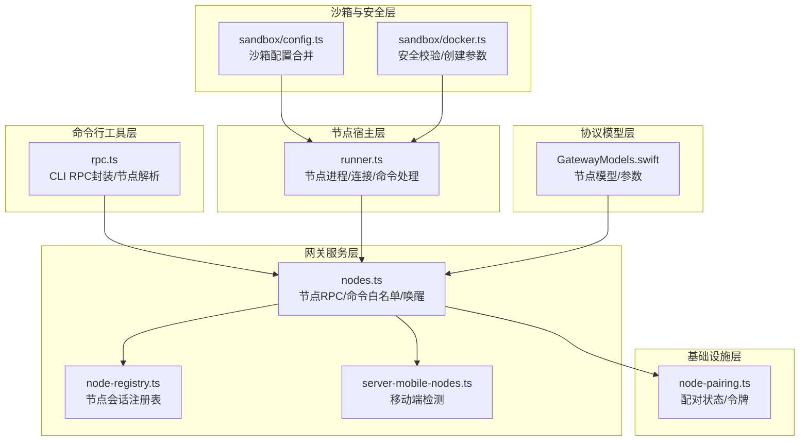
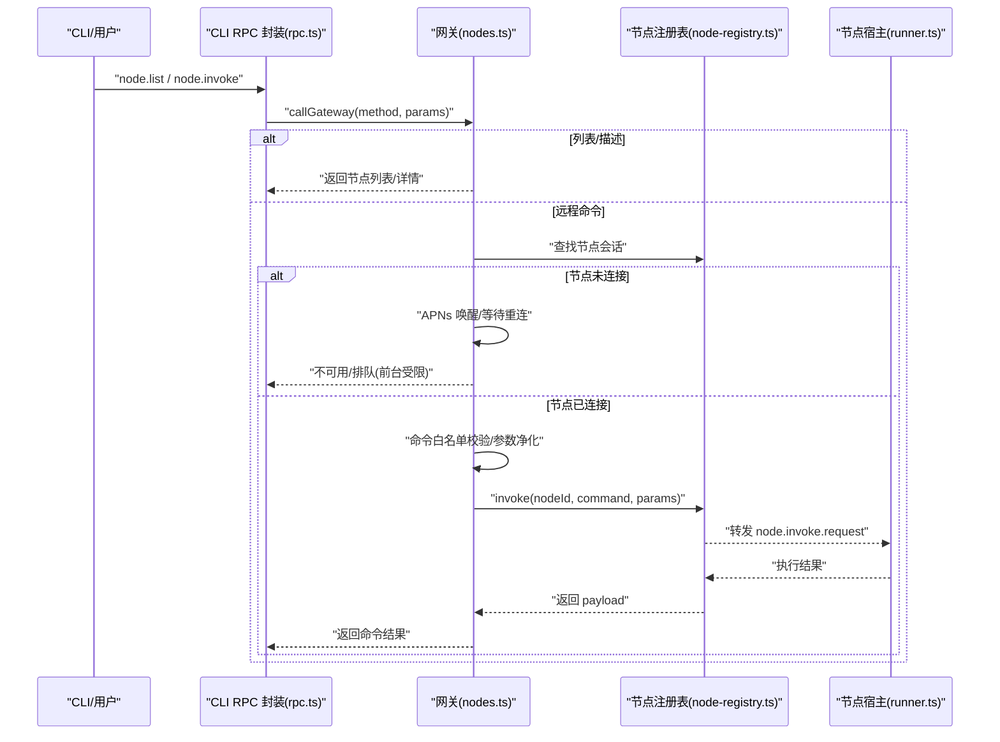
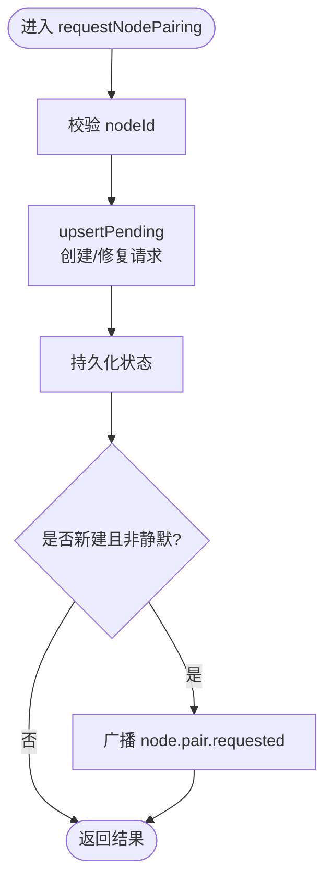
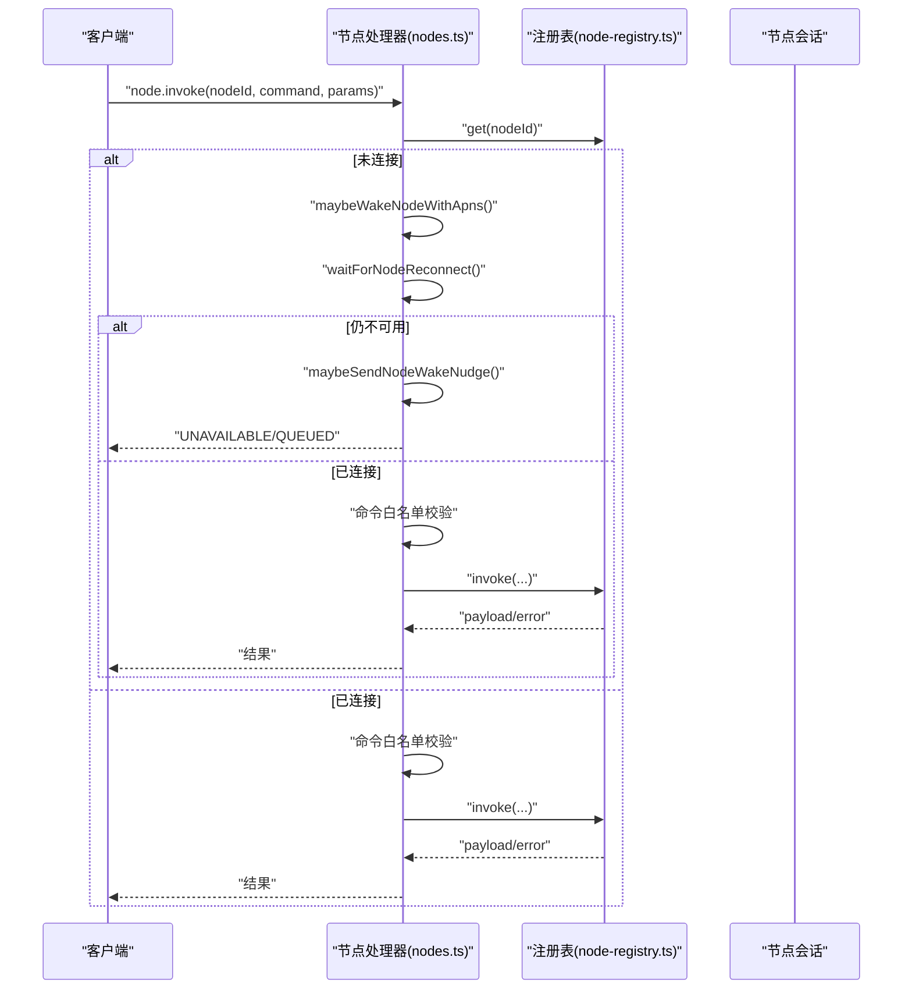
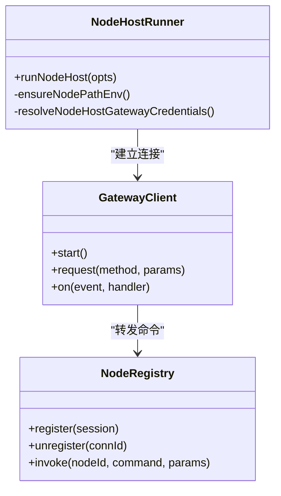
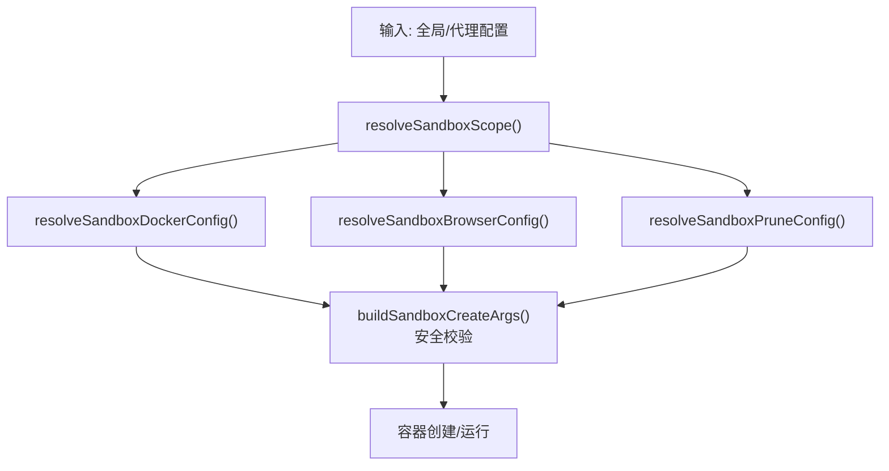
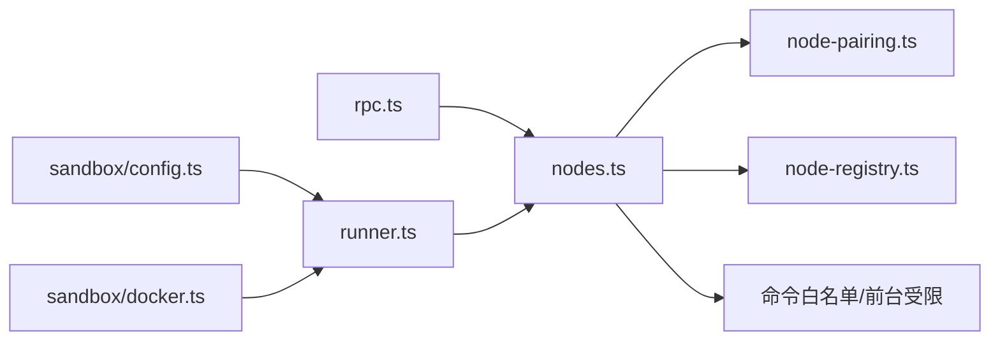

# 节点管理工具

## 目录
1. [简介](#简介)
2. [项目结构](#项目结构)
3. [核心组件](#核心组件)
4. [架构总览](#架构总览)
5. [详细组件分析](#详细组件分析)
6. [依赖关系分析](#依赖关系分析)
7. [性能考量](#性能考量)
8. [故障排查指南](#故障排查指南)
9. [结论](#结论)
10. [附录](#附录)

## 简介
本文件系统化阐述 OpenClaw 的“节点管理工具”，覆盖节点发现、配对管理、远程控制、代理集成、沙箱执行与资源限制、性能优化与安全策略。目标读者既包括一线运维与平台工程师，也包括需要在 CLI 或应用中集成节点能力的开发者。

## 项目结构
围绕节点管理的关键代码分布在以下模块：
- 基础设施层：节点配对状态持久化与令牌校验（infra）
- 网关服务层：节点 RPC 方法、命令白名单、唤醒与重连、事件处理（gateway）
- 节点宿主层：节点进程启动、连接网关、命令分发与执行（node-host）
- 命令行工具层：节点查询、解析、RPC 调用封装（cli/nodes-cli）
- 协议模型层：跨平台协议定义（Swift）
- 沙箱与安全层：容器化隔离、工具策略与资源限制（agents/sandbox）

图表来源
- [src/infra/node-pairing.ts](file://src/infra/node-pairing.ts#L1-L274)
- [src/gateway/server-methods/nodes.ts](file://src/gateway/server-methods/nodes.ts#L1-L1071)
- [src/gateway/node-registry.ts](file://src/gateway/node-registry.ts#L1-L105)
- [src/node-host/runner.ts](file://src/node-host/runner.ts#L1-L232)
- [src/cli/nodes-cli/rpc.ts](file://src/cli/nodes-cli/rpc.ts#L1-L97)
- [apps/shared/OpenClawKit/Sources/OpenClawProtocol/GatewayModels.swift](file://apps/shared/OpenClawKit/Sources/OpenClawProtocol/GatewayModels.swift#L755-L817)
- [src/agents/sandbox/config.ts](file://src/agents/sandbox/config.ts#L1-L217)
- [src/agents/sandbox/docker.ts](file://src/agents/sandbox/docker.ts#L291-L342)

章节来源
- [src/infra/node-pairing.ts](file://src/infra/node-pairing.ts#L1-L274)
- [src/gateway/server-methods/nodes.ts](file://src/gateway/server-methods/nodes.ts#L1-L1071)
- [src/gateway/node-registry.ts](file://src/gateway/node-registry.ts#L1-L105)
- [src/node-host/runner.ts](file://src/node-host/runner.ts#L1-L232)
- [src/cli/nodes-cli/rpc.ts](file://src/cli/nodes-cli/rpc.ts#L1-L97)
- [apps/shared/OpenClawKit/Sources/OpenClawProtocol/GatewayModels.swift](file://apps/shared/OpenClawKit/Sources/OpenClawProtocol/GatewayModels.swift#L755-L817)
- [src/agents/sandbox/config.ts](file://src/agents/sandbox/config.ts#L1-L217)
- [src/agents/sandbox/docker.ts](file://src/agents/sandbox/docker.ts#L291-L342)

## 核心组件
- 节点配对与状态管理：负责请求、批准、拒绝、验证、元数据更新与重命名；支持静默模式与修复流程。
- 网关节点 RPC：提供 node.list、node.describe、node.pair.*、node.invoke、node.event 等方法；内置命令白名单与前台受限命令队列。
- 节点会话注册表：维护已连接节点的会话信息，支持查询、超时清理与挂起调用管理。
- 节点宿主：启动节点进程，建立到网关的 WebSocket 连接，声明 capabilities 与 commands，处理远程命令。
- CLI 节点 RPC：封装 Gateway 调用，支持节点解析与统一超时控制。
- 协议模型：跨平台 Swift 定义节点模型与配对参数。
- 沙箱与安全：容器化隔离、资源限制、工具策略合并与安全校验。

章节来源
- [src/infra/node-pairing.ts](file://src/infra/node-pairing.ts#L104-L273)
- [src/gateway/server-methods/nodes.ts](file://src/gateway/server-methods/nodes.ts#L384-L1051)
- [src/gateway/node-registry.ts](file://src/gateway/node-registry.ts#L38-L105)
- [src/node-host/runner.ts](file://src/node-host/runner.ts#L144-L231)
- [src/cli/nodes-cli/rpc.ts](file://src/cli/nodes-cli/rpc.ts#L16-L96)
- [apps/shared/OpenClawKit/Sources/OpenClawProtocol/GatewayModels.swift](file://apps/shared/OpenClawKit/Sources/OpenClawProtocol/GatewayModels.swift#L755-L817)
- [src/agents/sandbox/config.ts](file://src/agents/sandbox/config.ts#L63-L216)
- [src/agents/sandbox/docker.ts](file://src/agents/sandbox/docker.ts#L316-L342)

## 架构总览
下图展示从 CLI 到网关再到节点宿主的完整调用链，以及节点命令在网关侧的白名单与前台受限处理逻辑。

图表来源
- [src/cli/nodes-cli/rpc.ts](file://src/cli/nodes-cli/rpc.ts#L16-L38)
- [src/gateway/server-methods/nodes.ts](file://src/gateway/server-methods/nodes.ts#L776-L1003)
- [src/gateway/node-registry.ts](file://src/gateway/node-registry.ts#L38-L105)
- [src/node-host/runner.ts](file://src/node-host/runner.ts#L202-L211)

## 详细组件分析

### 组件A：节点配对与状态管理
- 功能要点
  - 请求配对：去重、修复流程、静默模式、过期清理
  - 批准/拒绝：原子性写入、广播结果
  - 验证令牌：基于持久化 token 的校验
  - 元数据更新与重命名：增量更新与字段裁剪
- 数据结构与复杂度
  - 状态文件读写为 O(n) 遍历；并发通过锁保证一致性
  - 过期请求清理按时间窗口扫描
- 错误处理
  - 缺少 nodeId、未知请求/节点时返回明确错误码
- 性能与优化
  - 异步锁避免竞态；批量读写减少 IO
  - TTL 控制待清理队列规模

图表来源
- [src/infra/node-pairing.ts](file://src/infra/node-pairing.ts#L104-L144)

章节来源
- [src/infra/node-pairing.ts](file://src/infra/node-pairing.ts#L104-L273)

### 组件B：网关节点 RPC 与命令策略
- 功能要点
  - 节点 RPC：node.list、node.describe、node.pair.*、node.invoke、node.event
  - 命令白名单：结合节点声明与全局/平台策略
  - 前台受限命令队列：iOS 前台受限时自动排队并尝试唤醒
  - 事件与结果：统一的事件处理与结果回传
- 处理流程
  - 参数校验 → 权限/策略检查 → 可选 APNs 唤醒 → 转发至节点 → 结果回传或排队
- 错误处理
  - 无效参数、未知节点、不可用、前台受限等场景返回结构化错误

图表来源
- [src/gateway/server-methods/nodes.ts](file://src/gateway/server-methods/nodes.ts#L776-L1003)
- [src/gateway/node-registry.ts](file://src/gateway/node-registry.ts#L38-L105)

章节来源
- [src/gateway/server-methods/nodes.ts](file://src/gateway/server-methods/nodes.ts#L384-L1051)
- [src/gateway/server-methods/nodes.handlers.invoke-result.ts](file://src/gateway/server-methods/nodes.handlers.invoke-result.ts)
- [src/gateway/server-methods/nodes.helpers.js](file://src/gateway/server-methods/nodes.helpers.js)

### 组件C：节点宿主运行与命令分发
- 功能要点
  - 解析网关凭据、构建 PATH、声明 capabilities 与 commands
  - 启动 GatewayClient 并监听 node.invoke.request
  - 处理命令执行、结果回传、技能二进制信任缓存
- 安全与权限
  - 仅声明必要 capability（如 system、browser），避免过度授权
  - 通过 PATH 与可执行路径解析控制外部命令可见性

图表来源
- [src/node-host/runner.ts](file://src/node-host/runner.ts#L144-L231)
- [src/gateway/node-registry.ts](file://src/gateway/node-registry.ts#L38-L105)

章节来源
- [src/node-host/runner.ts](file://src/node-host/runner.ts#L144-L231)
- [src/config/types.node-host.ts](file://src/config/types.node-host.ts#L1-L11)

### 组件D：CLI 节点 RPC 封装
- 功能要点
  - 统一 Gateway 调用、超时控制、进度提示
  - 节点解析：优先 node.list，回退 node.pair.list
  - 错误提示：针对特定未授权场景给出指引
- 使用建议
  - 明确 --url 与 --token，设置合理 --timeout
  - 使用 --json 获取机器可解析输出

章节来源
- [src/cli/nodes-cli/rpc.ts](file://src/cli/nodes-cli/rpc.ts#L9-L96)
- [src/gateway/call.js](file://src/gateway/call.js)

### 组件E：协议模型（Swift）
- 节点配对参数：request/requestId、nodeId/token、silent 等
- 节点描述与列表：displayName、platform、version、caps、commands、remoteIp 等

章节来源
- [apps/shared/OpenClawKit/Sources/OpenClawProtocol/GatewayModels.swift](file://apps/shared/OpenClawKit/Sources/OpenClawProtocol/GatewayModels.swift#L755-L817)
- [apps/macos/Sources/OpenClawProtocol/GatewayModels.swift](file://apps/macos/Sources/OpenClawProtocol/GatewayModels.swift#L755-L817)

### 组件F：沙箱执行与资源限制
- 配置合并
  - scope 决定作用域（agent/session/shared）
  - docker、browser、prune 等配置按全局/代理层级合并
- 安全加固
  - 默认只读根文件系统、禁用网络或限定网络、丢弃所有 capability
  - 资源限制：内存、CPU、ulimit、pids 等
- 工具策略
  - allow/deny 合并，支持 alsoAllow 与通配符
- 运行时状态
  - 计算是否沙箱化、工具策略生效范围

图表来源
- [src/agents/sandbox/config.ts](file://src/agents/sandbox/config.ts#L63-L216)
- [src/agents/sandbox/docker.ts](file://src/agents/sandbox/docker.ts#L316-L342)
- [src/agents/sandbox-tool-policy.ts](file://src/agents/sandbox-tool-policy.ts#L21-L37)
- [src/agents/sandbox/runtime-status.ts](file://src/agents/sandbox/runtime-status.ts#L45-L79)

章节来源
- [src/agents/sandbox/config.ts](file://src/agents/sandbox/config.ts#L63-L216)
- [src/agents/sandbox/docker.ts](file://src/agents/sandbox/docker.ts#L291-L342)
- [src/agents/sandbox-tool-policy.ts](file://src/agents/sandbox-tool-policy.ts#L1-L37)
- [src/agents/sandbox/runtime-status.ts](file://src/agents/sandbox/runtime-status.ts#L45-L97)

## 依赖关系分析
- 节点配对依赖文件系统持久化与令牌生成；与网关方法强耦合
- 网关方法依赖注册表、设备配对、命令白名单与前台受限策略
- 节点宿主依赖网关客户端、设备身份、PATH 环境与浏览器代理配置
- CLI 依赖网关调用与节点解析工具
- 沙箱配置与工具策略独立于运行时，但影响工具可用性与安全性

图表来源
- [src/cli/nodes-cli/rpc.ts](file://src/cli/nodes-cli/rpc.ts#L16-L38)
- [src/gateway/server-methods/nodes.ts](file://src/gateway/server-methods/nodes.ts#L1-L1071)
- [src/infra/node-pairing.ts](file://src/infra/node-pairing.ts#L1-L274)
- [src/gateway/node-registry.ts](file://src/gateway/node-registry.ts#L1-L105)
- [src/node-host/runner.ts](file://src/node-host/runner.ts#L1-L232)
- [src/agents/sandbox/config.ts](file://src/agents/sandbox/config.ts#L1-L217)
- [src/agents/sandbox/docker.ts](file://src/agents/sandbox/docker.ts#L291-L342)

章节来源
- [src/gateway/server-methods/nodes.ts](file://src/gateway/server-methods/nodes.ts#L1-L1071)
- [src/gateway/server-mobile-nodes.ts](file://src/gateway/server-mobile-nodes.ts#L1-L14)

## 性能考量
- 并发与锁：配对状态写入使用异步锁，避免竞争条件
- 过期清理：待处理请求按 TTL 清理，降低内存占用
- 唤醒与重连：APNs 唤醒与等待重连采用节流与超时控制，避免频繁唤醒
- 容器资源：默认启用只读根、限制网络与 capability，结合 ulimit、memory、cpu 等参数控制资源占用
- 工具策略：最小化允许集合，减少不必要的工具暴露带来的开销

## 故障排查指南
- 无法连接节点
  - 检查网关 URL、TLS 配置与指纹
  - 观察 APNs 唤醒日志与重连等待
- 命令被拒
  - 查看命令白名单与前台受限策略
  - 确认节点声明的 commands 是否包含目标命令
- 未授权/签名问题
  - CLI 未签名或桥接客户端未授权时，参考 CLI 提示进行签名或开发模式配置
- 沙箱相关
  - 工具被策略拒绝时，检查 allow/deny 与 alsoAllow 配置
  - 容器创建失败多由安全校验导致，检查 binds、网络与保留命名空间

章节来源
- [src/gateway/server-methods/nodes.ts](file://src/gateway/server-methods/nodes.ts#L814-L1003)
- [src/cli/nodes-cli/rpc.ts](file://src/cli/nodes-cli/rpc.ts#L59-L73)
- [src/agents/sandbox/docker.ts](file://src/agents/sandbox/docker.ts#L329-L342)

## 结论
节点管理工具以“配对—注册—调用—沙箱”为主线，形成从 CLI 到网关再到节点宿主的闭环。通过严格的命令白名单、前台受限队列与 APNs 唤醒机制，保障远程控制的可靠性；通过容器化与工具策略实现安全与资源隔离。建议在生产环境启用 TLS、最小权限与合理的资源限制，并结合日志与健康检查持续优化。

## 附录
- 使用示例（步骤级）
  - 注册节点：在节点端运行节点宿主，确保网关凭据正确，节点自动上报 capabilities 与 commands
  - 列出节点：CLI 调用 node.list 或 node.pair.list，解析节点列表
  - 远程操作：CLI 调用 node.invoke，指定 nodeId、command 与 params，必要时设置 idempotencyKey
  - 状态监控：轮询 node.list 或订阅网关事件，观察 connected/paired/caps/commands
- 最佳实践
  - 为不同平台与代理分别配置沙箱策略，最小化允许集合
  - 对 iOS 前台受限命令采用队列与唤醒策略，提升用户体验
  - 在网关侧开启严格的命令白名单，避免任意命令执行
  - 定期清理过期配对请求与闲置容器，保持系统整洁