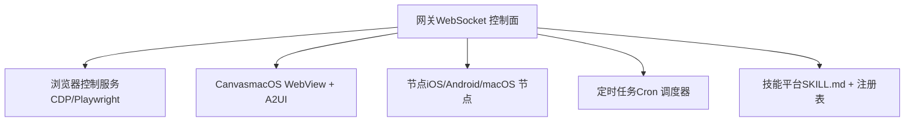
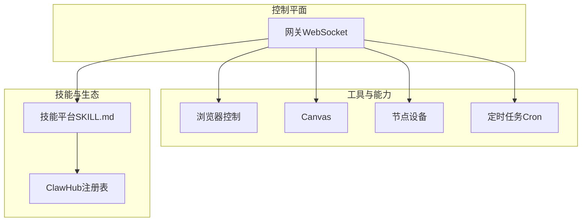
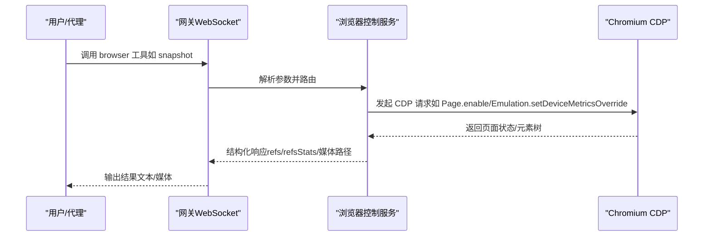
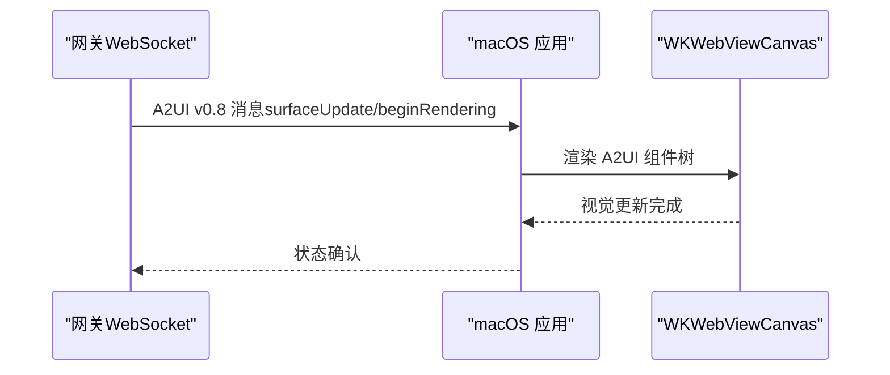
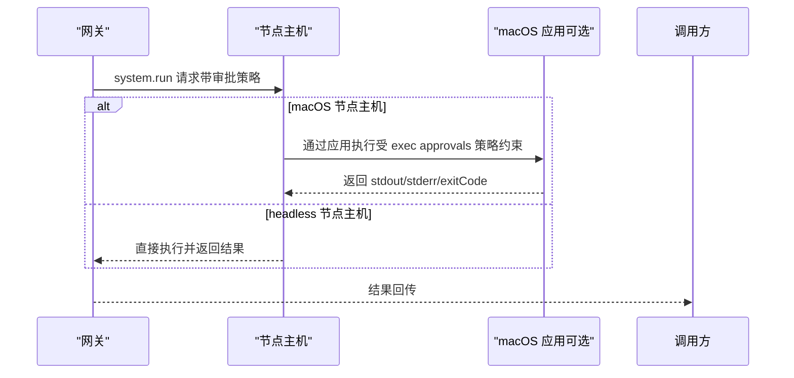
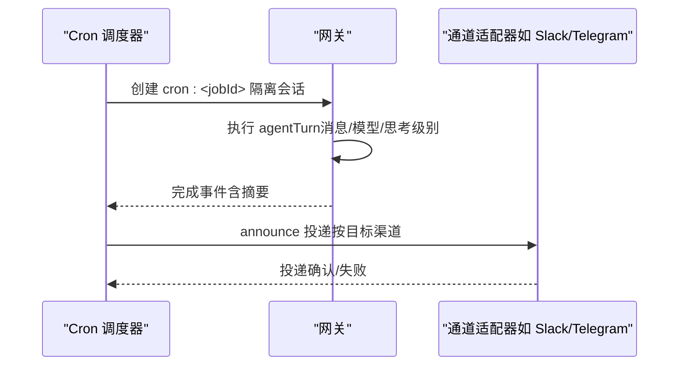
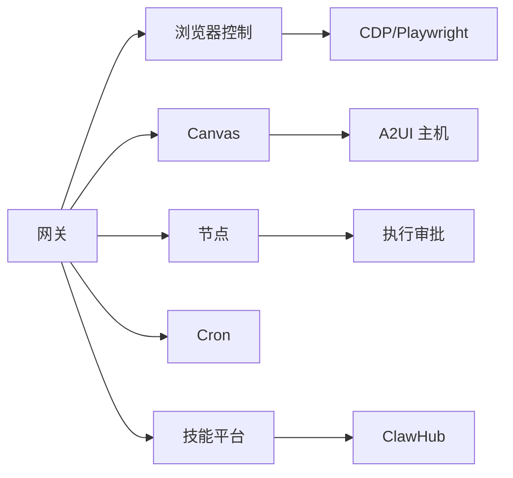

# 工具和技能

## 目录
1. [简介](#简介)
2. [项目结构](#项目结构)
3. [核心组件](#核心组件)
4. [架构总览](#架构总览)
5. [详细组件分析](#详细组件分析)
6. [依赖关系分析](#依赖关系分析)
7. [性能考量](#性能考量)
8. [故障排查指南](#故障排查指南)
9. [结论](#结论)
10. [附录](#附录)

## 简介
本文件面向使用者与开发者，系统化介绍 OpenClaw 的工具与技能体系：浏览器控制、Canvas 可视化工作区、节点（设备）能力、定时任务（Cron）、以及技能平台（含注册表 ClawHub）。文档覆盖架构、数据流、调用链路、安全与性能要点，并提供开发与运维的最佳实践。

## 项目结构
OpenClaw 采用多模块分层组织，核心子系统包括：
- 网关与协议：统一的 WebSocket 控制面，承载会话、通道、工具与事件
- 浏览器控制：独立的 CDP 驱动服务，支持本地/远程/扩展中继模式
- Canvas：macOS 应用内嵌的可视化工作区，支持 A2UI 推送
- 节点系统：设备节点通过配对连接网关，提供摄像头、屏幕录制、位置、系统命令等能力
- 定时任务：网关内置调度器，支持一次性与周期性任务，可投递到聊天或 Webhook
- 技能平台：基于 SKILL.md 的可发现、可加载、可安装的技能生态，支持公开注册表 ClawHub

章节来源
- [README.md](file://README.md#L185-L254)

## 核心组件
- 浏览器控制（openclaw-managed 或 Chrome 扩展中继）
  - 支持状态查询、启动/停止、标签页管理、快照/截图、动作执行、状态与环境设置、下载与追踪
  - 提供多配置文件（profiles）与远程 CDP/托管服务对接
- Canvas（macOS）
  - 通过自定义 URL Scheme 提供会话级可视化工作区，支持 A2UI 消息推送
- 节点系统
  - 设备配对后暴露命令集（canvas、camera、screen、location、system 等），支持远程节点主机
- 定时任务（Cron）
  - 在网关内持久化调度，支持主会话注入或隔离会话运行，可选择公告投递或 Webhook
- 技能平台
  - 基于 SKILL.md 的技能目录，支持捆绑、本地覆盖、工作区优先级；ClawHub 提供公共注册表与 CLI

章节来源
- [docs/tools/browser.md](file://docs/tools/browser.md#L10-L674)
- [docs/platforms/mac/canvas.md](file://docs/platforms/mac/canvas.md#L10-L126)
- [docs/nodes/index.md](file://docs/nodes/index.md#L10-L373)
- [docs/automation/cron-jobs.md](file://docs/automation/cron-jobs.md#L10-L686)
- [docs/tools/skills.md](file://docs/tools/skills.md#L9-L303)

## 架构总览
下图展示 OpenClaw 的关键交互：网关作为控制平面，工具与节点通过统一协议接入；技能与定时任务在网关内协同；浏览器与 Canvas 提供可视化与自动化能力。

图表来源
- [docs/tools/browser.md](file://docs/tools/browser.md#L10-L674)
- [docs/platforms/mac/canvas.md](file://docs/platforms/mac/canvas.md#L10-L126)
- [docs/nodes/index.md](file://docs/nodes/index.md#L10-L373)
- [docs/automation/cron-jobs.md](file://docs/automation/cron-jobs.md#L10-L686)
- [docs/tools/skills.md](file://docs/tools/skills.md#L9-L303)
- [docs/tools/clawhub.md](file://docs/tools/clawhub.md#L10-L258)

## 详细组件分析

### 组件一：浏览器控制（openclaw-managed 与 Chrome 扩展中继）
- 功能概览
  - 独立的 openclaw 配置文件（橙色主题）与扩展中继（Chrome 标签页）两种模式
  - 支持状态、启动/停止、标签页、导航、快照/截图、动作、Cookie/Storage、网络与调试接口
  - 多配置文件（profiles）与远程 CDP/托管服务对接
- 关键流程（CLI/工具调用到 CDP）

图表来源
- [docs/tools/browser.md](file://docs/tools/browser.md#L369-L430)

- 安全与隐私
  - loopback 仅限访问；远程 CDP 需要令牌与私有网络；建议使用受信网络与短时效令牌
  - 严格模式下可限制私有网络访问与主机白名单
- 远程与托管
  - 本地/远程 CDP、Browserless、Browserbase 等多种接入方式
  - 节点主机可代理浏览器控制（零配置默认）

章节来源
- [docs/tools/browser.md](file://docs/tools/browser.md#L10-L674)
- [docs/tools/chrome-extension.md](file://docs/tools/chrome-extension.md#L10-L197)

### 组件二：Canvas（macOS 可视化工作区）
- 能力概览
  - 会话级 Canvas 存储与自定义 URL Scheme 访问
  - 支持显示/隐藏、导航、JavaScript 评估、截图、A2UI 推送
- 典型流程（A2UI 推送）

图表来源
- [docs/platforms/mac/canvas.md](file://docs/platforms/mac/canvas.md#L67-L126)

- 安全边界
  - 自定义 Scheme 阻止目录穿越；仅允许显式导航到外部 URL

章节来源
- [docs/platforms/mac/canvas.md](file://docs/platforms/mac/canvas.md#L10-L126)

### 组件三：节点系统（设备与远程节点主机）
- 能力概览
  - 设备配对后暴露命令集：canvas、camera、screen、location、system 等
  - 远程节点主机在不同机器上执行 system.run/system.which，配合执行审批策略
- 典型流程（远程执行）

图表来源
- [docs/nodes/index.md](file://docs/nodes/index.md#L24-L373)

- 远程节点主机
  - 通过 SSH 隧道或直接连接；支持服务化安装与命名；执行审批集中管理

章节来源
- [docs/nodes/index.md](file://docs/nodes/index.md#L10-L373)

### 组件四：定时任务（Cron）
- 能力概览
  - 在网关内持久化调度，支持一次性/at、固定间隔/every、Cron 表达式
  - 主会话注入（systemEvent）或隔离会话（agentTurn），可选择公告投递或 Webhook
- 典型流程（隔离会话 + 公告）

图表来源
- [docs/automation/cron-jobs.md](file://docs/automation/cron-jobs.md#L135-L267)

- 配置与维护
  - 存储路径、并发数、重试策略、Webhook 令牌、会话保留与运行日志修剪

章节来源
- [docs/automation/cron-jobs.md](file://docs/automation/cron-jobs.md#L10-L686)

### 组件五：技能平台与 ClawHub
- 技能加载与优先级
  - 捆绑技能 → 本地覆盖（~/.openclaw/skills）→ 工作区技能（&lt;workspace&gt;/skills）
  - 支持插件自带技能目录，遵循相同优先级规则
- 格式与元数据
  - SKILL.md 必须包含 YAML frontmatter（name/description 等），metadata 为单行 JSON
  - 支持 gating（bin/env/config/os/install 等），可声明 homepage、是否用户可触发、是否绕过模型直接调用工具等
- 安装与同步
  - ClawHub 提供搜索、安装、更新、发布与同步；默认安装到当前工作区或 OpenClaw 工作区
- 生命周期与热重载
  - 会话开始时快照已筛选技能列表；可通过监视器在变更时热更新

章节来源
- [docs/tools/skills.md](file://docs/tools/skills.md#L9-L303)
- [docs/tools/creating-skills.md](file://docs/tools/creating-skills.md#L9-L59)
- [docs/tools/clawhub.md](file://docs/tools/clawhub.md#L10-L258)

## 依赖关系分析
- 组件耦合
  - 网关是控制平面，浏览器、Canvas、节点、Cron、技能均通过工具/会话/事件与之交互
  - 浏览器控制依赖 CDP/Playwright；Canvas 依赖网关的 A2UI 主机；节点依赖配对与执行审批
- 外部依赖
  - 浏览器：Chromium/Chrome/Brave/Edge 等；CDP/Playwright
  - 远程服务：Browserless、Browserbase 等托管 CDP
  - 注册表：ClawHub 提供技能发现与分发

图表来源
- [docs/tools/browser.md](file://docs/tools/browser.md#L10-L674)
- [docs/platforms/mac/canvas.md](file://docs/platforms/mac/canvas.md#L10-L126)
- [docs/nodes/index.md](file://docs/nodes/index.md#L10-L373)
- [docs/automation/cron-jobs.md](file://docs/automation/cron-jobs.md#L10-L686)
- [docs/tools/skills.md](file://docs/tools/skills.md#L9-L303)
- [docs/tools/clawhub.md](file://docs/tools/clawhub.md#L10-L258)

## 性能考量
- 浏览器快照与动作
  - AI 快照与 ARIA 快照在不同场景下各有优势；注意 ref 不稳定，需重新快照
  - Playwright 可提升截图/元素定位质量，但需要额外安装与缓存管理
- Canvas 与 A2UI
  - JSONL 消息体积与渲染复杂度需平衡；建议按需推送与清理
- Cron
  - 对高并发调度建议合理设置 sessionRetention 与 runLog 修剪策略，避免 IO 压力
- 技能提示词开销
  - 技能列表注入到系统提示词会产生确定性字符/令牌开销，建议精简描述并控制技能数量

章节来源
- [docs/tools/browser.md](file://docs/tools/browser.md#L534-L674)
- [docs/platforms/mac/canvas.md](file://docs/platforms/mac/canvas.md#L67-L126)
- [docs/automation/cron-jobs.md](file://docs/automation/cron-jobs.md#L425-L522)
- [docs/tools/skills.md](file://docs/tools/skills.md#L269-L286)

## 故障排查指南
- 浏览器
  - “浏览器未启用”：检查配置并重启网关；确认 loopback 与令牌；Linux 使用专用故障排查文档
  - 扩展中继：Badge 显示“!”通常表示 relay 不可达或令牌不匹配；检查网关端口派生与扩展选项
- Canvas
  - 无法加载：确认自定义 Scheme 与会话根路径；外部 URL 需显式导航
- 节点
  - 无法执行：检查配对、节点主机、执行审批；macOS 节点主机需遵循 exec approvals 策略
- Cron
  - 无运行：检查 cron.enabled 与时间区域；查看重试策略与运行历史
- 技能
  - 加载异常：检查 gating 条件（bin/env/config）、优先级与工作区覆盖；启用监视器以热更新

章节来源
- [docs/tools/browser.md](file://docs/tools/browser.md#L647-L674)
- [docs/tools/chrome-extension.md](file://docs/tools/chrome-extension.md#L105-L197)
- [docs/platforms/mac/canvas.md](file://docs/platforms/mac/canvas.md#L121-L126)
- [docs/nodes/index.md](file://docs/nodes/index.md#L317-L373)
- [docs/automation/cron-jobs.md](file://docs/automation/cron-jobs.md#L659-L686)
- [docs/tools/skills.md](file://docs/tools/skills.md#L287-L303)

## 结论
OpenClaw 通过统一的网关控制平面整合了浏览器自动化、可视化工作区、设备节点、定时任务与技能生态。对于使用者，推荐从浏览器与 Canvas 入手，结合节点能力扩展本地自动化；对于开发者，建议以 SKILL.md 为入口构建技能，并利用 ClawHub 实现共享与分发。在生产环境中，务必重视安全边界（loopback/令牌/私有网络）、权限与审批策略、以及性能与可观测性配置。

## 附录
- 常用 CLI 快速参考
  - 浏览器：status/start/stop/tabs/snapshot/screenshot/act/state/settings
  - Canvas：present/hide/navigate/eval/snapshot/a2ui push/reset
  - 节点：canvas/camera/screen/location/system 命令族
  - Cron：add/list/run/edit/remove/runs
  - 技能：ClawHub 搜索/安装/更新/发布/同步
- 最佳实践
  - 浏览器：优先使用 openclaw 配置文件隔离；远程/托管场景使用短时效令牌与受信网络
  - Canvas：按需推送 A2UI，避免大体积消息；谨慎使用 evaluate
  - 节点：明确执行审批清单；远程节点主机通过隧道连接
  - Cron：高频任务设置 sessionRetention 与 runLog 修剪；公告投递与 Webhook 混合使用
  - 技能：最小化 gating 条件；清晰描述与示例；定期更新与备份

章节来源
- [docs/tools/browser.md](file://docs/tools/browser.md#L431-L674)
- [docs/platforms/mac/canvas.md](file://docs/platforms/mac/canvas.md#L53-L126)
- [docs/nodes/index.md](file://docs/nodes/index.md#L147-L373)
- [docs/automation/cron-jobs.md](file://docs/automation/cron-jobs.md#L524-L686)
- [docs/tools/clawhub.md](file://docs/tools/clawhub.md#L118-L258)