# 娱乐休闲技能

## 目录
1. [简介](#简介)
2. [项目结构](#项目结构)
3. [核心组件](#核心组件)
4. [架构总览](#架构总览)
5. [详细组件分析](#详细组件分析)
6. [依赖关系分析](#依赖关系分析)
7. [性能考量](#性能考量)
8. [故障排查指南](#故障排查指南)
9. [结论](#结论)
10. [附录](#附录)

## 简介
本指南面向希望在OpenClaw中使用娱乐休闲类技能的用户与开发者，系统讲解以下娱乐功能的安装、配置、使用与最佳实践：Spotify音乐播放、Sonos音响控制、歌曲识别可视化、GIF搜索与提取、Google Workspace（Gmail/日历/文档/表格）协作、Philips Hue灯光控制、本地语音合成（TTS）、图像生成与编辑、tmux远程控制以及macOS界面自动化（Peekaboo）。文档覆盖从二进制依赖到环境变量注入、从配置文件到跨平台兼容性的全链路流程，并提供可复用的使用范式与个性化优化建议。

## 项目结构
OpenClaw通过“技能（Skill）”目录与Markdown描述文件（SKILL.md）来声明能力边界与安装方式。娱乐相关技能主要位于skills目录下，每个技能包含：
- SKILL.md：包含名称、描述、元数据（如平台要求、二进制依赖、安装器、主页链接等）
- 可选脚本或工具：用于执行具体任务（如CLI、下载模型等）

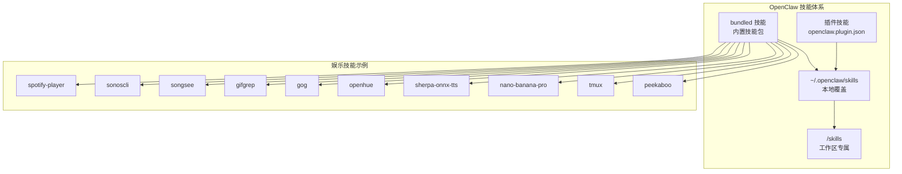

图示来源
- [skills.md](file://docs/tools/skills.md#L13-L48)

章节来源
- [skills.md](file://docs/tools/skills.md#L1-L77)

## 核心组件
- 播放与发现：Spotify播放器（spogo/spotify_player），Sonos音响控制（sonoscli）
- 音频理解：歌曲识别可视化（songsee）
- 动态内容：GIF搜索与提取（gifgrep）
- 协作与生产力：Google Workspace（gog）
- 灯光与氛围：Philips Hue（openhue）
- 本地语音：sherpa-onnx TTS
- 图像生成与编辑：nano-banana-pro（Gemini 3 Pro Image）
- 远程终端：tmux会话控制
- 界面自动化：Peekaboo（macOS）

章节来源
- [spotify-player/SKILL.md](file://skills/spotify-player/SKILL.md#L1-L65)
- [sonoscli/SKILL.md](file://skills/sonoscli/SKILL.md#L1-L66)
- [songsee/SKILL.md](file://skills/songsee/SKILL.md#L1-L50)
- [gifgrep/SKILL.md](file://skills/gifgrep/SKILL.md#L1-L80)
- [gog/SKILL.md](file://skills/gog/SKILL.md#L1-L117)
- [openhue/SKILL.md](file://skills/openhue/SKILL.md#L1-L113)
- [sherpa-onnx-tts/SKILL.md](file://skills/sherpa-onnx-tts/SKILL.md#L1-L104)
- [nano-banana-pro/SKILL.md](file://skills/nano-banana-pro/SKILL.md#L1-L66)
- [tmux/SKILL.md](file://skills/tmux/SKILL.md#L1-L154)
- [peekaboo/SKILL.md](file://skills/peekaboo/SKILL.md#L1-L191)

## 架构总览
OpenClaw在运行时根据技能元数据进行“加载门控”，仅对满足条件的技能暴露给代理与用户。技能的可用性由以下因素决定：
- 平台支持（os）
- 二进制依赖（requires.bins/anyBins）
- 环境变量（requires.env）
- 配置项（requires.config）
- 用户显式启用（skills.entries.&lt;name&gt;.enabled）

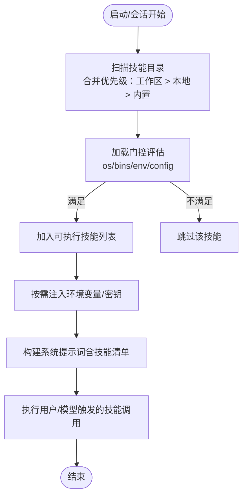

图示来源
- [skills.md](file://docs/tools/skills.md#L106-L187)
- [skills-config.md](file://docs/tools/skills-config.md#L11-L78)

章节来源
- [skills.md](file://docs/tools/skills.md#L106-L187)
- [skills-config.md](file://docs/tools/skills-config.md#L11-L78)

## 详细组件分析

### Spotify音乐播放（spotify-player）
- 功能特性
  - 支持Spotify Premium账户
  - 推荐使用spogo；若不可用则回退至spotify_player
  - 提供搜索、播放控制、设备选择、状态查询等命令
- 安装与前置
  - 二进制依赖：spogo 或 spotify_player
  - 首次使用需导入浏览器Cookie以完成认证
- 使用场景
  - 自动化播放：定时唤醒/下班回家自动切换歌单
  - 设备联动：多设备同步播放/暂停
  - 个性化：基于情绪/场景创建播放列表并触发播放
- 最佳实践
  - 在配置文件中设置Spotify Connect所需的client_id
  - 使用设备选择命令确保目标扬声器正确
  - 结合日志与状态命令进行排障

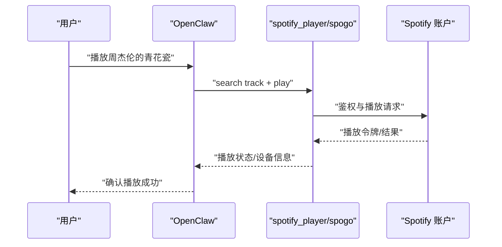

图示来源
- [spotify-player/SKILL.md](file://skills/spotify-player/SKILL.md#L33-L64)

章节来源
- [spotify-player/SKILL.md](file://skills/spotify-player/SKILL.md#L1-L65)

### Sonos音响控制（sonoscli）
- 功能特性
  - 局域网内发现与控制Sonos设备
  - 支持分组/派对模式、收藏夹、队列管理
  - 可通过SMAPI进行Spotify搜索
- 安装与前置
  - 二进制依赖：sonos
  - 若SSDP失败，可通过IP直连
- 使用场景
  - 多房间统一音量与播放
  - 派对模式一键开启/关闭
  - 与Spotify搜索结合实现“说一句话即播放”
- 最佳实践
  - 优先使用discover自动发现；失败时指定IP
  - 使用group命令管理跨房间同步
  - 为Spotify搜索配置SPOTIFY_CLIENT_ID/SECRET以提升体验

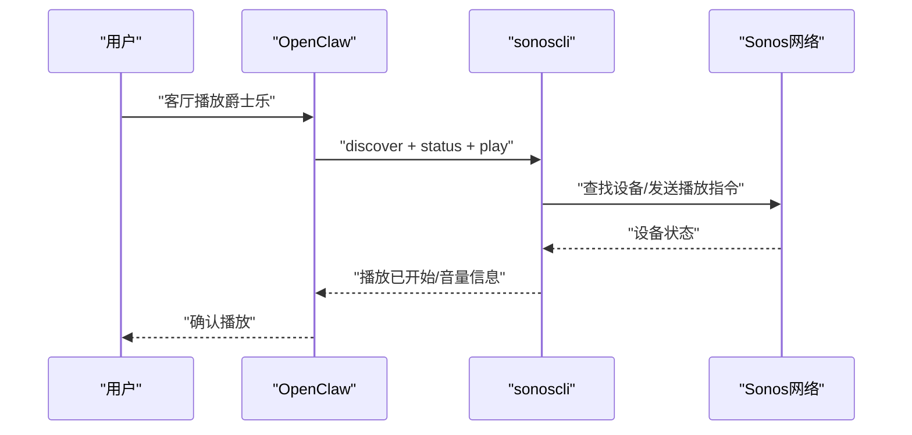

图示来源
- [sonoscli/SKILL.md](file://skills/sonoscli/SKILL.md#L25-L47)

章节来源
- [sonoscli/SKILL.md](file://skills/sonoscli/SKILL.md#L1-L66)

### 歌曲识别可视化（songsee）
- 功能特性
  - 从音频生成频谱图与特征面板（多视图拼接）
  - 支持时间切片、格式与尺寸控制
- 使用场景
  - 音频分析与教学演示
  - 快速提取片段帧用于分享
- 最佳实践
  - 对长音频使用start/duration参数进行切片
  - 多视图组合便于对比不同特征

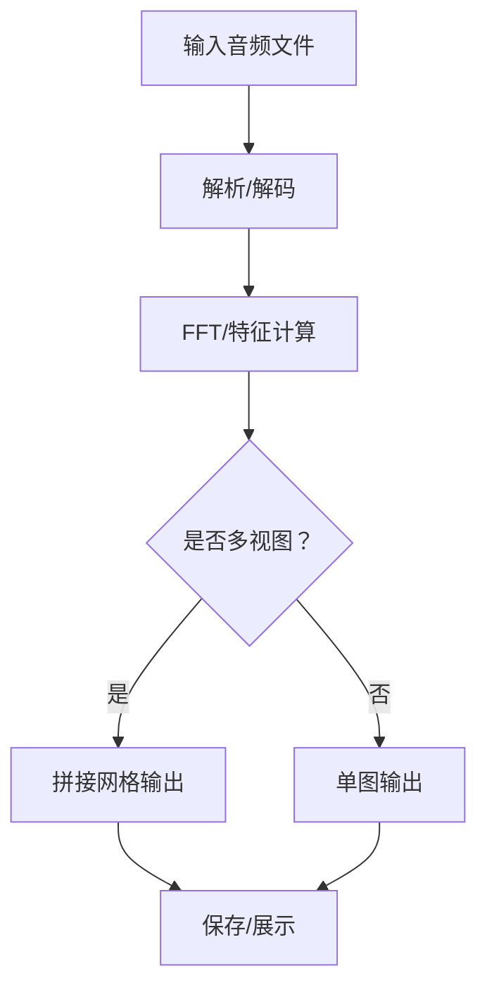

图示来源
- [songsee/SKILL.md](file://skills/songsee/SKILL.md#L25-L49)

章节来源
- [songsee/SKILL.md](file://skills/songsee/SKILL.md#L1-L50)

### GIF搜索与提取（gifgrep）
- 功能特性
  - 支持Tenor/Giphy搜索，TUI预览，批量下载与提取静帧/拼贴图
  - 支持API Key（Giphy）与环境变量微调
- 使用场景
  - 快速检索表情包/动图并导出用于聊天/文档
- 最佳实践
  - 使用--thumbs在Kitty/Ghostty中预览静帧
  - 使用--download配合--reveal一键打开下载目录
  - 使用--source明确数据源，避免API配额问题

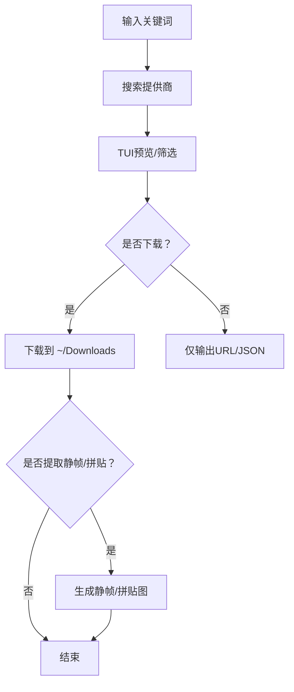

图示来源
- [gifgrep/SKILL.md](file://skills/gifgrep/SKILL.md#L32-L79)

章节来源
- [gifgrep/SKILL.md](file://skills/gifgrep/SKILL.md#L1-L80)

### Google Workspace（gog）协作
- 功能特性
  - Gmail/日历/驱动/联系人/表格/文档的OAuth集成CLI
  - 支持搜索、发送、草稿、事件创建/更新、表格读写/追加/清空、文档导出/查看
- 安装与前置
  - 二进制依赖：gog
  - 需要OAuth凭据初始化与账户授权
- 使用场景
  - 自动化邮件发送与归档
  - 日历事件批量创建与颜色标注
  - 表格数据更新与导出
- 最佳实践
  - 使用--json与--no-input进行脚本化
  - 通过GOG_ACCOUNT环境变量减少重复参数
  - 区分search与messages search以满足线程/消息粒度需求

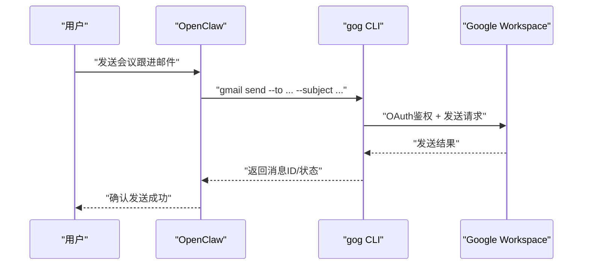

图示来源
- [gog/SKILL.md](file://skills/gog/SKILL.md#L25-L117)

章节来源
- [gog/SKILL.md](file://skills/gog/SKILL.md#L1-L117)

### Philips Hue灯光控制（openhue）
- 功能特性
  - 控制灯泡/房间/场景，支持亮度、色温、RGB/色名
- 使用场景
  - 睡眠模式/工作模式/观影模式一键切换
- 最佳实践
  - 首次运行需在桥上按下配对按钮
  - 仅对彩色灯泡生效的颜色功能

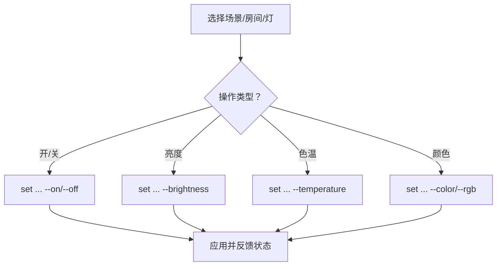

图示来源
- [openhue/SKILL.md](file://skills/openhue/SKILL.md#L49-L113)

章节来源
- [openhue/SKILL.md](file://skills/openhue/SKILL.md#L1-L113)

### 本地语音合成（sherpa-onnx-tts）
- 功能特性
  - 本地离线TTS，无需云端
  - 需要运行时与模型目录配置
- 安装与前置
  - 下载对应平台运行时与语音模型
  - 在配置文件中注入SHERPA_ONNX_RUNTIME_DIR与SHERPA_ONNX_MODEL_DIR
- 使用场景
  - 隐私敏感环境下的播报
  - 无网络时的文本转语音
- 最佳实践
  - 按需更换模型以匹配口音/语种
  - Windows环境下使用Node包装脚本

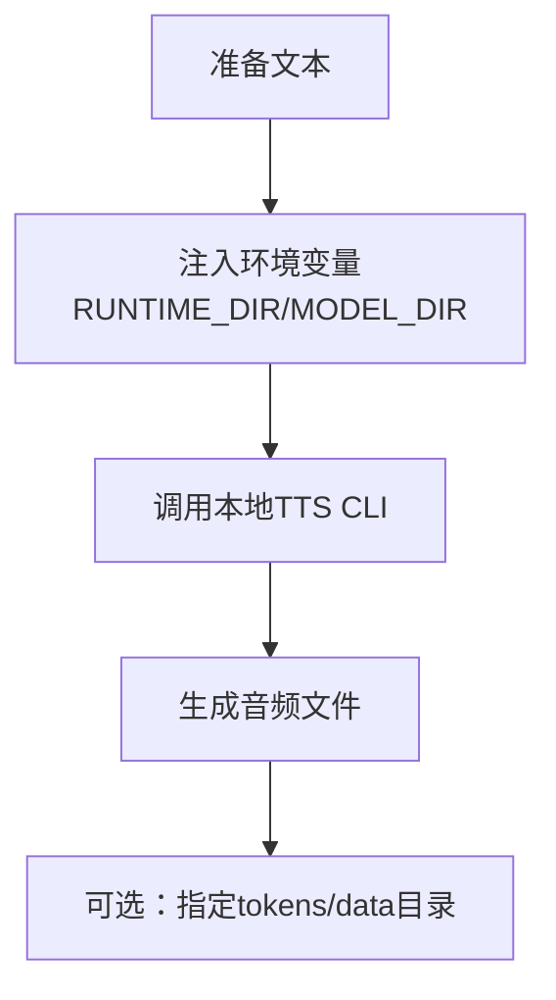

图示来源
- [sherpa-onnx-tts/SKILL.md](file://skills/sherpa-onnx-tts/SKILL.md#L64-L104)

章节来源
- [sherpa-onnx-tts/SKILL.md](file://skills/sherpa-onnx-tts/SKILL.md#L1-L104)

### 图像生成与编辑（nano-banana-pro）
- 功能特性
  - 基于Gemini 3 Pro Image的生成/编辑/多图合成
  - 支持分辨率与宽高比控制
- 安装与前置
  - 二进制依赖：uv
  - 需要GEMINI_API_KEY
- 使用场景
  - 快速生成头像/主题素材
  - 批量合成场景图
- 最佳实践
  - 使用时间戳命名文件，便于追踪
  - 通过MEDIA行让OpenClaw自动附加到聊天

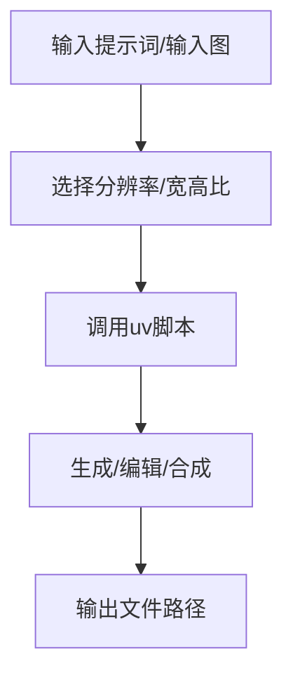

图示来源
- [nano-banana-pro/SKILL.md](file://skills/nano-banana-pro/SKILL.md#L26-L66)

章节来源
- [nano-banana-pro/SKILL.md](file://skills/nano-banana-pro/SKILL.md#L1-L66)

### tmux远程控制（tmux）
- 功能特性
  - 向tmux会话发送按键、抓取面板输出、管理窗口/窗格
- 使用场景
  - 监控Claude/Codex会话、向交互式CLI发送输入
- 最佳实践
  - 将长文本拆分为“键入-回车”序列，避免粘贴/多行边界问题
  - 使用capture-pane -S -捕获完整历史

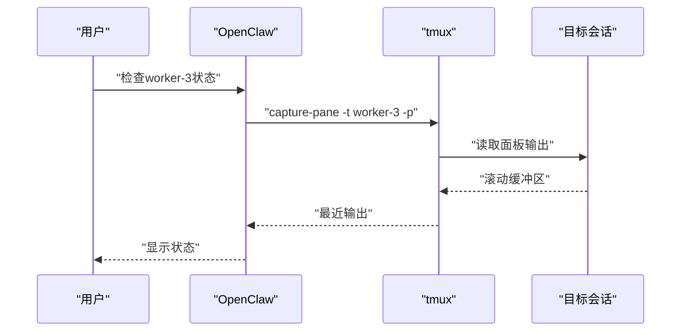

图示来源
- [tmux/SKILL.md](file://skills/tmux/SKILL.md#L41-L154)

章节来源
- [tmux/SKILL.md](file://skills/tmux/SKILL.md#L1-L154)

### macOS界面自动化（Peekaboo）
- 功能特性
  - 截图/视频采集、元素识别、点击/拖拽/滚动/键盘输入、应用/窗口/菜单/Dock管理
- 使用场景
  - 自动登录、数据截图与摘要、录制交互演示
- 最佳实践
  - 先see再click，使用--annotate辅助定位
  - 需要屏幕录制与无障碍权限

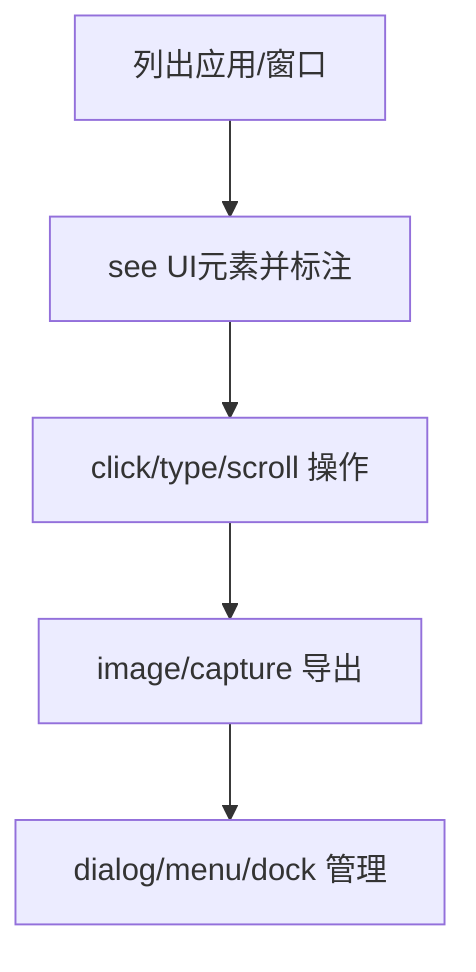

图示来源
- [peekaboo/SKILL.md](file://skills/peekaboo/SKILL.md#L26-L191)

章节来源
- [peekaboo/SKILL.md](file://skills/peekaboo/SKILL.md#L1-L191)

## 依赖关系分析
- 加载门控
  - 平台过滤：部分技能仅限darwin/linux/win32
  - 二进制探测：PATH存在与否决定技能可见性
  - 环境变量：技能声明的env必须在进程或配置中提供
  - 配置项：openclaw.json中的布尔/路径值决定是否加载
- 注入与作用域
  - per-run注入：仅在当前代理回合有效，结束后恢复原环境
  - 沙箱限制：容器内不继承宿主进程环境，需通过全局或镜像内配置
- 配置持久化
  - 通过服务器端接口更新技能条目（启用/禁用、env、apiKey）

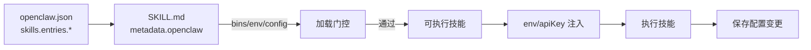

图示来源
- [skills.md](file://docs/tools/skills.md#L106-L187)
- [skills-config.md](file://docs/tools/skills-config.md#L26-L78)
- [skills.ts](file://src/gateway/server-methods/skills.ts#L177-L204)

章节来源
- [skills.md](file://docs/tools/skills.md#L106-L187)
- [skills-config.md](file://docs/tools/skills-config.md#L26-L78)
- [skills.ts](file://src/gateway/server-methods/skills.ts#L177-L204)

## 性能考量
- 技能提示词开销
  - 每个技能引入固定字符数（基础195 + 每技能约97 + 字段长度）；建议按需启用必要技能
- I/O与外部服务
  - 音乐/灯光/云服务均涉及网络请求，建议在本地缓存常用配置与设备列表
- 沙箱与资源
  - 容器内安装软件需要网络与写权限，尽量在镜像层预装常用工具

## 故障排查指南
- Sonos发现失败
  - SSDP错误：检查本地网络权限（macOS隐私设置）或改用沙箱网络模式
  - bind权限不足：确认未处于受限沙箱（Codex等）且已授予网络访问
- Spotify播放失败
  - Cookie未导入或过期：重新导入浏览器Cookie
  - 设备未选择：先列出设备并设置目标设备
- GIF搜索API配额
  - Giphy需API Key；Tenor默认Demo Key可能受限
- Hue首次配对
  - 按压桥上配对按钮后重试
- TTS模型缺失
  - 确认RUNTIME_DIR与MODEL_DIR指向正确的解压目录
- gog OAuth
  - 重新初始化凭据并授权所需服务

章节来源
- [sonoscli/SKILL.md](file://skills/sonoscli/SKILL.md#L49-L66)
- [spotify-player/SKILL.md](file://skills/spotify-player/SKILL.md#L42-L64)
- [gifgrep/SKILL.md](file://skills/gifgrep/SKILL.md#L65-L79)
- [openhue/SKILL.md](file://skills/openhue/SKILL.md#L108-L113)
- [sherpa-onnx-tts/SKILL.md](file://skills/sherpa-onnx-tts/SKILL.md#L66-L84)
- [gog/SKILL.md](file://skills/gog/SKILL.md#L29-L34)

## 结论
通过OpenClaw的技能体系，娱乐休闲类功能得以模块化、可配置地接入日常使用。建议以“最小可用”为原则逐步启用技能，结合环境变量与配置文件实现个性化体验，并在团队/多代理场景下利用共享技能目录与ClawHub进行统一管理与备份。

## 附录
- macOS技能界面
  - 技能列表与环境编辑器在macOS应用中提供可视化开关与密钥管理入口
- 配置参考
  - skills.entries.&lt;name&gt;用于启用/禁用与注入env/apiKey
  - skills.load.watch用于热刷新

章节来源
- [SkillsSettings.swift](file://apps/macos/Sources/OpenClaw/SkillsSettings.swift#L595-L621)
- [skills-config.md](file://docs/tools/skills-config.md#L26-L78)