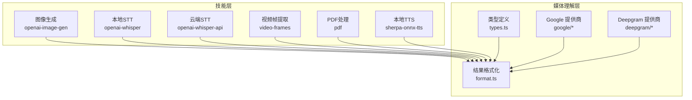
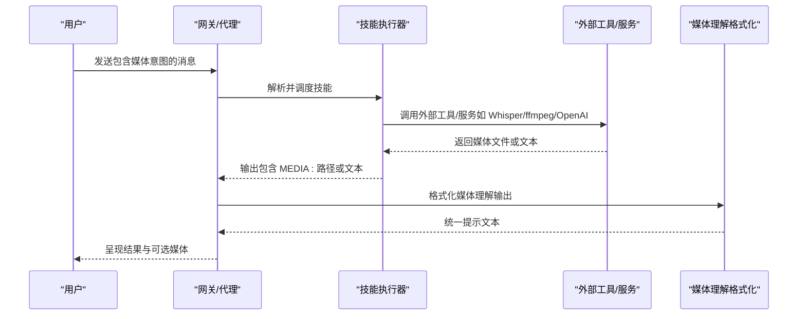
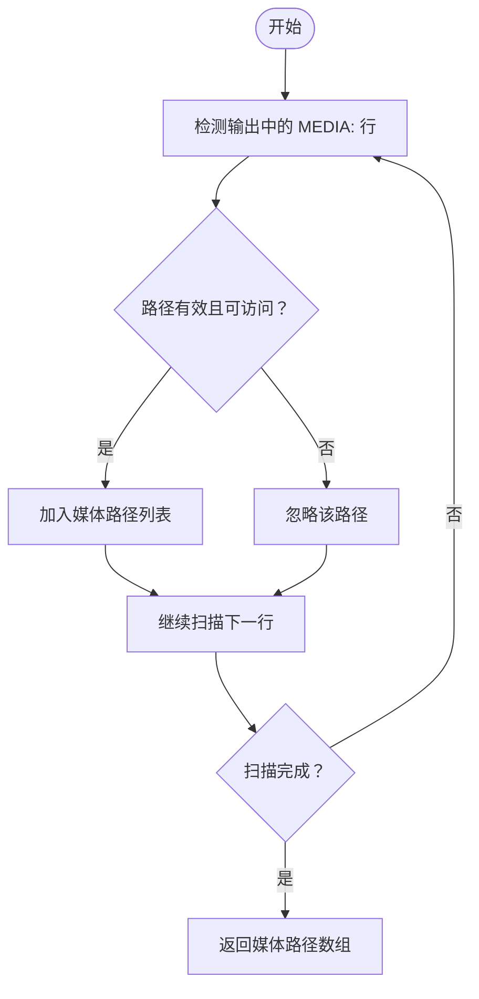
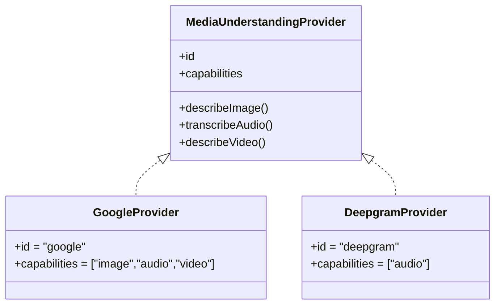
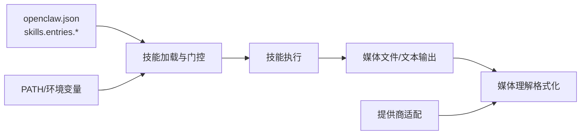

# 媒体处理技能

## 目录
1. [简介](#简介)
2. [项目结构](#项目结构)
3. [核心组件](#核心组件)
4. [架构总览](#架构总览)
5. [详细组件分析](#详细组件分析)
6. [依赖关系分析](#依赖关系分析)
7. [性能考虑](#性能考虑)
8. [故障排除指南](#故障排除指南)
9. [结论](#结论)
10. [附录](#附录)

## 简介
本指南面向在 OpenClaw 中使用媒体处理技能的用户与开发者，系统性介绍图像生成、语音转文字（STT）、文本转语音（TTS）、视频帧提取、PDF 处理等多媒体相关技能的功能特性、安装配置与使用场景，并提供批量处理、格式转换、内容分析与自动化工作流的最佳实践，以及性能优化与资源管理建议。

## 项目结构
OpenClaw 的媒体处理能力由“技能（Skills）”与“媒体理解（Media Understanding）”两大子系统构成：
- 技能层：通过 SKILL.md 描述与安装要求，封装外部工具或服务（如 Whisper、ffmpeg、OpenAI API、sherpa-onnx 等），并提供用户可直接调用的命令或参数。
- 媒体理解层：统一抽象“图像描述、音频转写、视频描述”的输出格式，负责将多路媒体理解结果格式化为统一的提示文本，便于后续对话或分析。

图示来源
- [skills/openai-image-gen/SKILL.md](file://skills/openai-image-gen/SKILL.md#L1-L93)
- [skills/openai-whisper/SKILL.md](file://skills/openai-whisper/SKILL.md#L1-L39)
- [skills/openai-whisper-api/SKILL.md](file://skills/openai-whisper-api/SKILL.md#L1-L53)
- [skills/video-frames/SKILL.md](file://skills/video-frames/SKILL.md#L1-L47)
- [skills/pdf/SKILL.md](file://skills/pdf/SKILL.md#L1-L315)
- [skills/sherpa-onnx-tts/SKILL.md](file://skills/sherpa-onnx-tts/SKILL.md#L1-L104)
- [src/media-understanding/types.ts](file://src/media-understanding/types.ts#L1-L49)
- [src/media-understanding/format.ts](file://src/media-understanding/format.ts#L1-L98)
- [src/media-understanding/providers/google/index.ts](file://src/media-understanding/providers/google/index.ts#L1-L12)
- [src/media-understanding/providers/deepgram/index.ts](file://src/media-understanding/providers/deepgram/index.ts#L1-L8)

章节来源
- [README.md](file://README.md#L144-L176)

## 核心组件
- 媒体理解类型与决策
  - 定义媒体理解的种类（音频转写、图像描述、视频描述）、附件与输出结构，以及模型选择与决策结果。
- 结果格式化
  - 将多路媒体理解输出合并为统一的提示文本，支持带用户备注、按类型分段、编号后缀等。
- 提供商适配
  - Google（Gemini）与 Deepgram（音频）提供统一的转写/描述接口，屏蔽底层差异。
- 运行时媒体能力
  - 暴露媒体加载、MIME 检测、媒体类型判定、音频兼容性检查、图片元数据读取与缩放等能力。

章节来源
- [src/media-understanding/types.ts](file://src/media-understanding/types.ts#L1-L49)
- [src/media-understanding/format.ts](file://src/media-understanding/format.ts#L1-L98)
- [src/media-understanding/providers/google/index.ts](file://src/media-understanding/providers/google/index.ts#L1-L12)
- [src/media-understanding/providers/deepgram/index.ts](file://src/media-understanding/providers/deepgram/index.ts#L1-L8)
- [src/plugins/runtime/runtime-media.ts](file://src/plugins/runtime/runtime-media.ts#L1-L17)

## 架构总览
媒体处理在 OpenClaw 中的典型流程：
- 用户通过聊天或命令触发技能（如“生成图片”“转写音频”“提取视频帧”“处理PDF”“合成语音”）。
- 技能根据自身要求（二进制、环境变量、API 密钥）进行加载与校验。
- 技能执行外部工具或调用云服务，产出媒体文件或文本结果。
- 媒体理解层对多路理解结果进行格式化，注入到系统提示中，供后续对话或分析使用。
- 运行时媒体能力负责媒体路径解析、MIME 判定与基础操作。

图示来源
- [src/media-understanding/format.ts](file://src/media-understanding/format.ts#L32-L91)
- [src/media/parse.test.ts](file://src/media/parse.test.ts#L1-L32)
- [src/agents/pi-embedded-subscribe.tools.media.test.ts](file://src/agents/pi-embedded-subscribe.tools.media.test.ts#L196-L232)

## 详细组件分析

### 图像生成（OpenAI Images API）
- 功能概述
  - 批量生成图片，支持多种模型与参数（尺寸、质量、透明背景、输出格式等），并生成缩略图画廊。
- 安装与前置条件
  - 需要 Python 与 OPENAI_API_KEY；可通过包管理器安装 Python。
- 使用要点
  - 生成耗时较长，建议在执行工具时提高超时时间，避免被提前终止。
  - 不同模型参数差异较大，脚本会自动选择模型默认值。
- 输出
  - PNG/JPEG/WEBP 图片、提示词映射文件、HTML 画廊。
- 最佳实践
  - 批量生成时合理设置并发与输出目录，避免磁盘空间不足。
  - 使用透明背景或指定输出格式以满足不同渠道展示需求。

章节来源
- [skills/openai-image-gen/SKILL.md](file://skills/openai-image-gen/SKILL.md#L1-L93)

### 语音转文字（本地 Whisper CLI）
- 功能概述
  - 使用本地 Whisper CLI 进行离线转写，无需 API 密钥。
- 安装与前置条件
  - 需要 whisper 可执行程序；首次运行会下载模型缓存。
- 使用要点
  - 模型大小影响速度与精度，按需选择 turbo/medium/large。
  - 支持任务切换（转写/翻译）与多种输出格式。
- 最佳实践
  - 在低延迟场景优先使用较小模型；需要高精度时选用较大模型。
  - 将输出目录与语言参数固定，便于批处理与归档。

章节来源
- [skills/openai-whisper/SKILL.md](file://skills/openai-whisper/SKILL.md#L1-L39)

### 语音转文字（OpenAI Audio Transcriptions API）
- 功能概述
  - 通过 OpenAI 的音频转写接口进行云端转写。
- 安装与前置条件
  - 需要 curl 与 OPENAI_API_KEY；可在配置中注入或通过环境变量提供。
- 使用要点
  - 默认模型 whisper-1，输出为纯文本；支持 JSON 格式与语言、提示词等参数。
- 最佳实践
  - 对长音频分段处理，结合语言与提示词提升准确性。
  - 在自动化流程中设置合理的重试与超时策略。

章节来源
- [skills/openai-whisper-api/SKILL.md](file://skills/openai-whisper-api/SKILL.md#L1-L53)

### 视频帧提取（ffmpeg）
- 功能概述
  - 从视频中抽取单帧或指定时间戳的帧作为缩略图或截图。
- 安装与前置条件
  - 需要 ffmpeg。
- 使用要点
  - 使用时间戳定位关键帧更直观；根据分享场景选择 JPEG 或 PNG。
- 最佳实践
  - 批量提取时统一命名规则与输出目录，便于后续处理。
  - 对大视频先抽帧再分析，降低计算成本。

章节来源
- [skills/video-frames/SKILL.md](file://skills/video-frames/SKILL.md#L1-L47)

### PDF 处理
- 功能概述
  - 文本与表格提取、合并/拆分、旋转、加水印、创建新 PDF、表单填写、加密/解密、图片提取、扫描版 PDF OCR 等。
- 工具与库
  - Python 库（pypdf、pdfplumber、reportlab）与命令行工具（pdftotext、qpdf、pdftk）。
- 使用要点
  - 文本布局保留、表格结构化导出、OCR 流程（扫描版 PDF）。
- 最佳实践
  - 先做元数据与页面统计，再进行拆分与批量处理。
  - OCR 建议分页执行并缓存中间图像，避免重复转换。

章节来源
- [skills/pdf/SKILL.md](file://skills/pdf/SKILL.md#L1-L315)

### 文本转语音（sherpa-onnx 本地）
- 功能概述
  - 使用 sherpa-onnx 离线 TTS 合成语音，无需网络。
- 安装与前置条件
  - 需要运行时与模型目录（SHERPA_ONNX_RUNTIME_DIR、SHERPA_ONNX_MODEL_DIR），支持 macOS/Linux/Windows。
- 使用要点
  - 可选择不同模型与覆盖默认文件路径；Windows 下通过 Node 包装器调用。
- 最佳实践
  - 选择合适模型以平衡音质与速度；将模型目录置于稳定路径，减少配置漂移。

章节来源
- [skills/sherpa-onnx-tts/SKILL.md](file://skills/sherpa-onnx-tts/SKILL.md#L1-L104)

### 媒体理解格式化与解析
- 媒体理解输出格式化
  - 将多路媒体理解结果（音频转写、图像描述、视频描述）按类型分段，支持用户备注与编号后缀，形成统一提示文本。
- 媒体路径解析
  - 从工具输出中提取 MEDIA: 路径，支持引号包裹、相对路径、Windows 路径等变体；过滤非 HTTP 链接以确保安全。
- 媒体类型与运行时能力
  - 提供 MIME 检测、媒体类型判定、音频兼容性检查、图片元数据读取与缩放等能力，支撑媒体处理链路。

图示来源
- [src/media/parse.test.ts](file://src/media/parse.test.ts#L11-L32)
- [src/agents/pi-embedded-subscribe.tools.media.test.ts](file://src/agents/pi-embedded-subscribe.tools.media.test.ts#L196-L232)

章节来源
- [src/media-understanding/format.ts](file://src/media-understanding/format.ts#L32-L98)
- [src/media/parse.test.ts](file://src/media/parse.test.ts#L1-L32)
- [src/agents/pi-embedded-subscribe.tools.media.test.ts](file://src/agents/pi-embedded-subscribe.tools.media.test.ts#L172-L204)
- [src/plugins/runtime/runtime-media.ts](file://src/plugins/runtime/runtime-media.ts#L1-L17)

### 提供商适配（Google / Deepgram）
- Google（Gemini）
  - 提供音频转写与视频描述能力，默认模型与提示词可配置，统一返回文本与模型标识。
- Deepgram
  - 提供音频转写能力，支持自定义模型、语言与查询参数，自动处理授权头与内容类型。

图示来源
- [src/media-understanding/providers/google/index.ts](file://src/media-understanding/providers/google/index.ts#L1-L12)
- [src/media-understanding/providers/deepgram/index.ts](file://src/media-understanding/providers/deepgram/index.ts#L1-L8)

章节来源
- [src/media-understanding/providers/google/audio.ts](file://src/media-understanding/providers/google/audio.ts#L1-L22)
- [src/media-understanding/providers/google/video.ts](file://src/media-understanding/providers/google/video.ts#L1-L22)
- [src/media-understanding/providers/deepgram/audio.ts](file://src/media-understanding/providers/deepgram/audio.ts#L1-L80)

## 依赖关系分析
- 技能与环境
  - 技能通过 metadata.openclaw.requres 指定二进制、环境变量与配置项，加载时进行门控筛选。
- 技能与配置
  - 通过 skills.entries.&lt;name&gt; 注入 API Key、环境变量与自定义配置，影响技能可用性与行为。
- 媒体理解与提供商
  - 媒体理解层不直接依赖具体提供商，而是通过统一接口适配不同提供商，便于扩展与替换。

图示来源
- [docs/tools/skills.md](file://docs/tools/skills.md#L106-L187)
- [src/media-understanding/format.ts](file://src/media-understanding/format.ts#L32-L91)

章节来源
- [docs/tools/skills.md](file://docs/tools/skills.md#L106-L187)

## 性能考虑
- 批量处理
  - 图像生成与 PDF 处理建议分批执行，控制并发度与内存占用；视频帧提取与音频转写建议按时间窗口切分。
- 超时与重试
  - 云端 STT（OpenAI API）与图像生成可能耗时较长，应适当提高执行超时；对失败请求设置指数退避重试。
- 模型选择
  - 本地 Whisper 优先选择小模型以提升速度；云端 STT 根据准确率需求选择模型。
- 存储与缓存
  - 首次下载的模型与缓存文件（如 Whisper 模型）位于用户缓存目录，建议定期清理以释放空间。
- 平台差异
  - TTS（sherpa-onnx）在不同平台的运行时与模型目录需正确配置，避免重复下载与路径错误。

## 故障排除指南
- 技能不可用
  - 检查二进制是否存在于 PATH，环境变量是否已注入，配置项是否满足要求。
- API 密钥问题
  - 确认 OPENAI_API_KEY 或其他提供商密钥已正确注入；必要时在配置中显式设置。
- 转写结果为空
  - 检查音频格式与采样率是否符合提供商要求；确认授权头与内容类型设置正确。
- 媒体路径解析失败
  - 确保输出中包含 MEDIA: 路径，且路径可访问；过滤掉非 HTTP 链接以避免安全风险。
- 性能瓶颈
  - 减少并发、分批处理、缓存模型与中间结果；选择合适模型与参数。

章节来源
- [skills/openai-whisper-api/SKILL.md](file://skills/openai-whisper-api/SKILL.md#L40-L53)
- [skills/openai-image-gen/SKILL.md](file://skills/openai-image-gen/SKILL.md#L30-L38)
- [src/media/parse.test.ts](file://src/media/parse.test.ts#L1-L32)
- [src/agents/pi-embedded-subscribe.tools.media.test.ts](file://src/agents/pi-embedded-subscribe.tools.media.test.ts#L172-L204)

## 结论
OpenClaw 的媒体处理技能体系通过“技能层 + 媒体理解层”的协同，实现了从本地工具到云端服务的统一接入与输出格式化。遵循本文的安装配置、使用示例与最佳实践，可高效完成图像生成、语音转文字、文本转语音、视频帧提取与 PDF 处理等常见任务，并在自动化工作流中实现稳定的性能与可维护性。

## 附录
- 技能注册与加载机制参考：[Skills 文档](file://docs/tools/skills.md#L1-L303)
- 媒体理解类型与格式化参考：
  - [类型定义](file://src/media-understanding/types.ts#L1-L49)
  - [格式化函数](file://src/media-understanding/format.ts#L32-L98)
- 提供商适配参考：
  - [Google 提供商入口](file://src/media-understanding/providers/google/index.ts#L1-L12)
  - [Deepgram 提供商入口](file://src/media-understanding/providers/deepgram/index.ts#L1-L8)