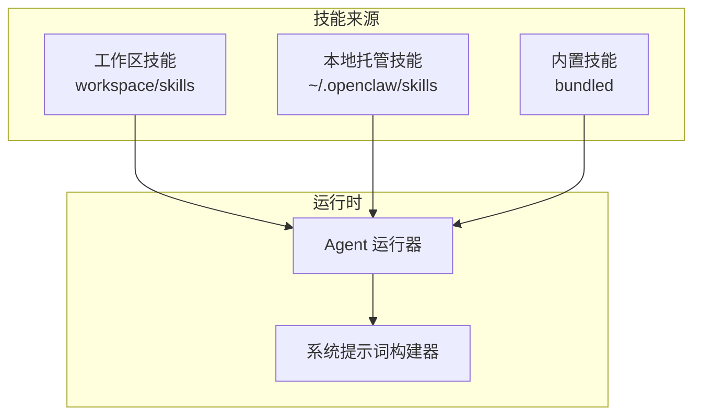
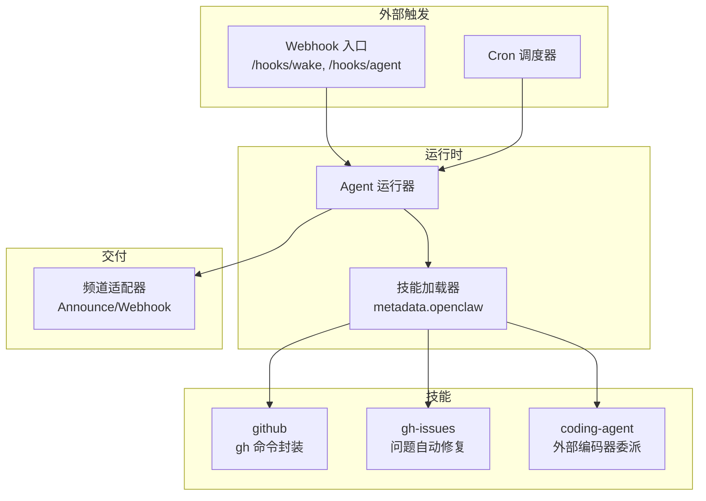
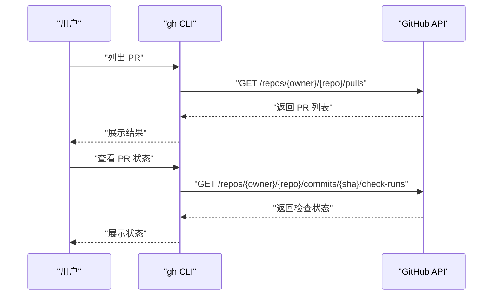
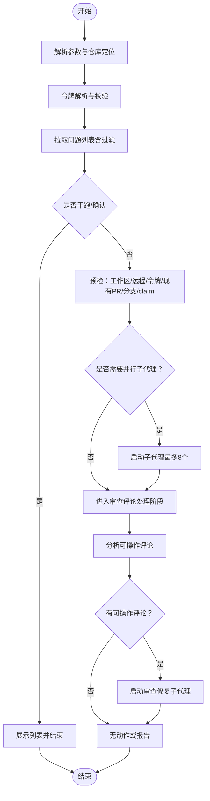
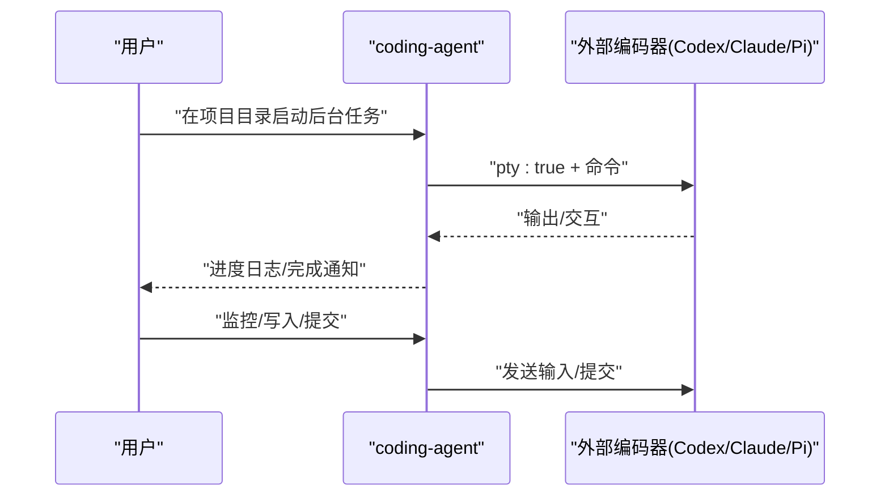
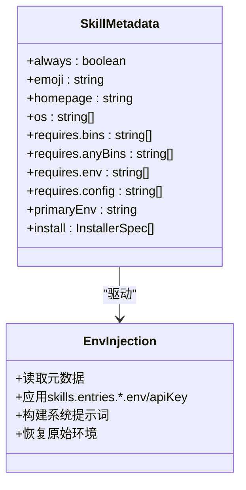
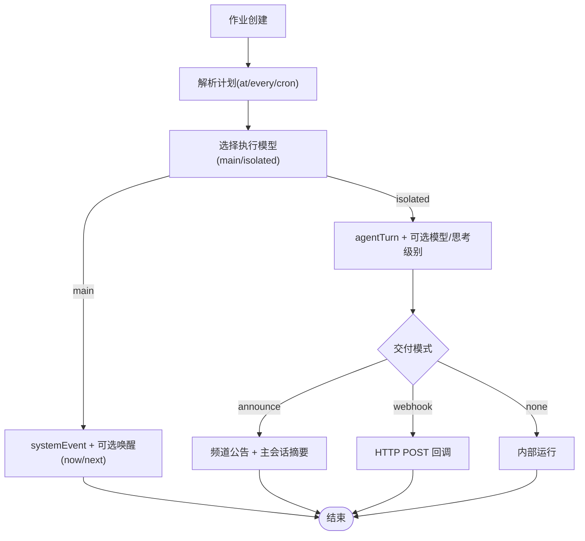
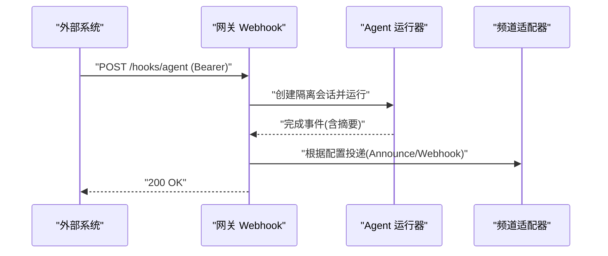
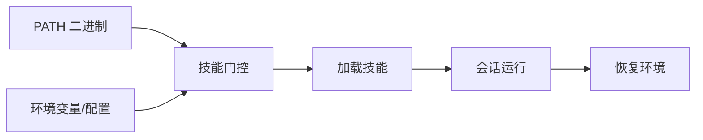

# 开发工具技能

## 目录
1. [简介](#简介)
2. [项目结构](#项目结构)
3. [核心组件](#核心组件)
4. [架构总览](#架构总览)
5. [详细组件分析](#详细组件分析)
6. [依赖关系分析](#依赖关系分析)
7. [性能考量](#性能考量)
8. [故障排查指南](#故障排查指南)
9. [结论](#结论)
10. [附录](#附录)

## 简介
本指南面向使用 OpenClaw 的开发者，系统讲解如何通过技能（Skills）实现 GitHub 集成、问题跟踪与代码审查等开发工具能力，并提供安装配置、参数设置、使用示例与最佳实践，帮助你构建从问题发现到自动修复、再到持续审阅的 DevOps 自动化闭环。

## 项目结构
OpenClaw 将“技能”作为可插拔的工具教学单元，每个技能以独立目录包含一个 SKILL.md 文件，描述其用途、前置条件、环境变量、命令行参数与调用方式。技能加载遵循优先级：工作区技能 > 本地托管技能 > 内置技能；并通过 metadata.openclaw 字段声明二进制依赖、环境变量与主密钥字段，实现按需启用与安全注入。

图示来源
- [docs/tools/skills.md](file://docs/tools/skills.md#L13-L27)
- [docs/tools/skills.md](file://docs/tools/skills.md#L106-L137)

章节来源
- [README.md](file://README.md#L1-L120)
- [docs/tools/skills.md](file://docs/tools/skills.md#L1-L120)

## 核心组件
- GitHub 集成技能（github）
  - 用于在终端中执行 gh 命令，覆盖 PR 列表、检查状态、查看详情、创建 PR、合并 PR、问题列表、创建/关闭问题、CI 运行查询与重试等常用操作。
  - 安装与认证：首次使用前需登录并验证状态。
  - 典型场景：快速列出/查看/创建/合并 PR，查询 CI 运行日志，重试失败作业。
  
  章节来源
  - [skills/github/SKILL.md](file://skills/github/SKILL.md#L46-L120)

- GitHub 问题自动修复技能（gh-issues）
  - 通过筛选过滤问题，支持 fork 模式推送分支与开 PR；支持交互模式与定时模式（cron）；支持并发子代理并行处理；支持 PR 审查评论的自动跟进与修复。
  - 关键特性：令牌解析、预检（脏树、远程可达性、PR/分支去重、claim 跟踪）、子代理任务模板、审查评论分析与自动修复。
  
  章节来源
  - [skills/gh-issues/SKILL.md](file://skills/gh-issues/SKILL.md#L1-L120)
  - [skills/gh-issues/SKILL.md](file://skills/gh-issues/SKILL.md#L283-L507)
  - [skills/gh-issues/SKILL.md](file://skills/gh-issues/SKILL.md#L557-L817)

- 编码代理技能（coding-agent）
  - 通过 bash/exec 工具委托给外部编码工具（如 Codex、Claude Code、Pi、OpenCode），支持 PTY 模式、后台会话、超时控制、并行批量评审与多工作区并行修复。
  - 使用建议：PR 评审在临时目录或 git worktree 中进行，避免污染主工程；Codex/Pi/OpenCode 需 PTY，Claude Code 使用 --print + 权限绕过模式。
  
  章节来源
  - [skills/coding-agent/SKILL.md](file://skills/coding-agent/SKILL.md#L1-L120)
  - [skills/coding-agent/SKILL.md](file://skills/coding-agent/SKILL.md#L130-L164)
  - [skills/coding-agent/SKILL.md](file://skills/coding-agent/SKILL.md#L204-L229)

- 技能平台与配置（skills）
  - 技能元数据（metadata.openclaw）定义二进制依赖、环境变量、配置项、主密钥字段与安装器；支持 per-agent 环境注入、热更新、远程节点能力探测。
  - 支持通过 ClawHub 安装/同步技能，支持工作区与托管技能的优先级覆盖。
  
  章节来源
  - [docs/tools/skills.md](file://docs/tools/skills.md#L78-L187)
  - [docs/tools/skills.md](file://docs/tools/skills.md#L189-L247)

- 自动化调度（Cron）
  - 在网关内部持久化调度任务，支持主会话（systemEvent）与隔离会话（agentTurn），可选择立即唤醒或下个心跳；支持 Webhook 回传与频道公告投递。
  - 提供重试策略、会话保留与运行日志裁剪配置。
  
  章节来源
  - [docs/automation/cron-jobs.md](file://docs/automation/cron-jobs.md#L10-L60)
  - [docs/automation/cron-jobs.md](file://docs/automation/cron-jobs.md#L367-L444)
  - [src/config/types.cron.ts](file://src/config/types.cron.ts#L1-L60)
  - [src/cron/types-shared.ts](file://src/cron/types-shared.ts#L1-L18)

- Webhook 触发
  - 提供 /hooks/wake 与 /hooks/agent 接口，支持令牌鉴权、会话键策略、映射与转换、模型/思考级别覆盖、交付目标路由。
  
  章节来源
  - [docs/automation/webhook.md](file://docs/automation/webhook.md#L13-L41)
  - [docs/automation/webhook.md](file://docs/automation/webhook.md#L60-L97)

## 架构总览
OpenClaw 的开发工具链围绕“技能 + 调度 + 触发”的闭环展开：
- 技能层：封装具体工具（gh、外部编码器、消息通道等）的使用方式与参数约束；
- 调度层：Cron 负责周期性任务与一次性提醒，支持隔离会话与交付；
- 触发层：Webhook 提供外部系统接入点，统一鉴权与路由；
- 运行时：Agent 运行器按需加载技能，注入环境变量，构建系统提示词。

图示来源
- [docs/automation/webhook.md](file://docs/automation/webhook.md#L42-L97)
- [docs/automation/cron-jobs.md](file://docs/automation/cron-jobs.md#L135-L193)
- [docs/tools/skills.md](file://docs/tools/skills.md#L106-L137)

## 详细组件分析

### GitHub 集成技能（github）
- 功能要点
  - PR 生命周期管理：列出、查看、检查状态、创建、合并；
  - 问题管理：列出、创建、关闭；
  - CI/Workflow：列出运行、查看失败步骤、重试失败作业；
  - API 查询：通过 gh api 获取指定字段。
- 安装与认证
  - 首次使用需执行登录与状态验证，确保本地 gh CLI 可用。
- 使用场景
  - 快速定位 PR CI 失败原因并重试；
  - 批量创建问题与 PR；
  - 查看最近运行记录辅助排障。

图示来源
- [skills/github/SKILL.md](file://skills/github/SKILL.md#L68-L114)

章节来源
- [skills/github/SKILL.md](file://skills/github/SKILL.md#L46-L120)

### GitHub 问题自动修复技能（gh-issues）
- 功能要点
  - 参数解析：仓库定位、标签/里程碑/指派/状态过滤、fork 模式、轮询间隔、干跑、仅审查模式、定时模式、通知频道等；
  - 令牌解析：优先环境变量，其次配置文件，再其次共享存储；
  - 预检：工作区状态、基线分支、远程可达性、现有 PR/分支去重、claim 超时清理；
  - 子代理：并行创建修复任务，支持定时模式游标推进与单次触发；
  - 审查评论处理：发现可操作评论后，自动修复并回复。
- 最佳实践
  - fork 模式下确保 fork 远程存在且 origin 可达；
  - 使用 --dry-run 验证筛选条件与待处理列表；
  - 结合 --notify-channel 在 Telegram 中接收最终 PR 汇总；
  - 定时模式配合 --cron 与 --interval 实现持续巡检与修复。

图示来源
- [skills/gh-issues/SKILL.md](file://skills/gh-issues/SKILL.md#L21-L120)
- [skills/gh-issues/SKILL.md](file://skills/gh-issues/SKILL.md#L161-L280)
- [skills/gh-issues/SKILL.md](file://skills/gh-issues/SKILL.md#L557-L817)

章节来源
- [skills/gh-issues/SKILL.md](file://skills/gh-issues/SKILL.md#L1-L120)
- [skills/gh-issues/SKILL.md](file://skills/gh-issues/SKILL.md#L283-L507)
- [skills/gh-issues/SKILL.md](file://skills/gh-issues/SKILL.md#L557-L817)

### 编码代理技能（coding-agent）
- 功能要点
  - 委托外部编码工具（Codex、Claude Code、Pi、OpenCode）执行任务；
  - PTY 模式对交互式工具至关重要；
  - 支持后台会话、超时控制、并行评审与批量修复；
  - PR 评审建议在临时目录或 git worktree 中进行，避免污染主工程。
- 使用示例
  - 临时目录快速问答：在临时 git 仓库中直接调用；
  - 后台长任务：在目标工作目录启动带 PTY 的后台会话；
  - 并行评审：为多个 PR 分别启动独立会话并行评审。

图示来源
- [skills/coding-agent/SKILL.md](file://skills/coding-agent/SKILL.md#L79-L103)
- [skills/coding-agent/SKILL.md](file://skills/coding-agent/SKILL.md#L130-L164)

章节来源
- [skills/coding-agent/SKILL.md](file://skills/coding-agent/SKILL.md#L1-L120)
- [skills/coding-agent/SKILL.md](file://skills/coding-agent/SKILL.md#L130-L164)
- [skills/coding-agent/SKILL.md](file://skills/coding-agent/SKILL.md#L204-L229)

### 技能平台与配置（skills）
- 加载与优先级
  - 工作区技能 > 本地托管技能 > 内置技能；
  - 支持额外目录加载（extraDirs）。
- 元数据与门控
  - metadata.openclaw.requires.bins/anyBins/env/config 控制加载；
  - primaryEnv 指定主密钥字段；
  - 支持安装器（brew/node/go/download）与平台过滤。
- 环境注入
  - 每次会话开始时注入技能所需环境变量，结束后恢复原环境。

图示来源
- [docs/tools/skills.md](file://docs/tools/skills.md#L106-L187)
- [docs/tools/skills.md](file://docs/tools/skills.md#L230-L247)

章节来源
- [docs/tools/skills.md](file://docs/tools/skills.md#L1-L120)
- [docs/tools/skills.md](file://docs/tools/skills.md#L189-L247)

### 自动化调度（Cron）
- 执行模型
  - 主会话（systemEvent）：在心跳时运行，适合与主上下文结合；
  - 隔离会话（agentTurn）：专用会话，可选择公告或 Webhook 回传。
- 交付与路由
  - announce：向目标频道投递摘要并简要回传主会话；
  - webhook：POST 完成事件负载至指定 URL；
  - none：内部运行，不投递。
- 配置要点
  - retry：瞬时错误重试次数与退避；
  - sessionRetention：隔离运行会话保留时长；
  - runLog：运行日志大小与行数限制。

图示来源
- [docs/automation/cron-jobs.md](file://docs/automation/cron-jobs.md#L113-L193)
- [src/config/types.cron.ts](file://src/config/types.cron.ts#L1-L60)
- [src/cron/types-shared.ts](file://src/cron/types-shared.ts#L1-L18)

章节来源
- [docs/automation/cron-jobs.md](file://docs/automation/cron-jobs.md#L1-L120)
- [docs/automation/cron-jobs.md](file://docs/automation/cron-jobs.md#L367-L444)
- [src/config/types.cron.ts](file://src/config/types.cron.ts#L1-L60)
- [src/cron/types-shared.ts](file://src/cron/types-shared.ts#L1-L18)

### Webhook 触发
- 接口
  - /hooks/wake：主会话系统事件；
  - /hooks/agent：隔离会话代理运行，支持模型/思考级别覆盖与交付路由。
- 安全与策略
  - Bearer 令牌鉴权；
  - 会话键策略（默认禁用请求覆盖，推荐固定默认键）；
  - 映射与转换支持自定义逻辑与模板。
- 使用建议
  - 将钩子暴露在受信网络边界；
  - 为钩子使用专用令牌，避免复用网关凭据；
  - 对外部内容开启安全包装，必要时在特定钩子上放宽。

图示来源
- [docs/automation/webhook.md](file://docs/automation/webhook.md#L42-L97)
- [docs/automation/webhook.md](file://docs/automation/webhook.md#L132-L157)

章节来源
- [docs/automation/webhook.md](file://docs/automation/webhook.md#L1-L120)
- [docs/automation/webhook.md](file://docs/automation/webhook.md#L168-L216)

## 依赖关系分析
- 技能加载依赖
  - PATH 二进制存在性（requires.bins/anyBins）；
  - 环境变量存在或配置项为真（requires.env/requires.config）；
  - 主密钥字段（primaryEnv）用于注入。
- 运行时注入
  - 每次会话开始注入，结束后恢复，避免全局污染。
- 远程节点能力
  - 当网关在 Linux 上运行而 macOS 节点允许 system.run 时，可在节点上探测命令支持并动态提升技能可用性。

图示来源
- [docs/tools/skills.md](file://docs/tools/skills.md#L106-L147)

章节来源
- [docs/tools/skills.md](file://docs/tools/skills.md#L106-L187)
- [docs/tools/skills.md](file://docs/tools/skills.md#L248-L253)

## 性能考量
- Cron
  - 高频调度会产生较大的运行日志与会话存档，建议合理设置 sessionRetention 与 runLog；
  - 对噪音较大的任务采用隔离模式并配置最佳努力投递，减少主会话干扰。
- 编码代理
  - 并行任务数量受 subagents.maxConcurrent 限制，避免资源争用；
  - PTY 模式对交互式工具至关重要，避免 hang 或输出异常导致的无效等待。
- 技能加载
  - 会话快照在新会话开始时生成，变更生效于下次会话，减少重复扫描成本。

## 故障排查指南
- 技能不可用
  - 检查二进制/环境/配置是否满足 metadata.openclaw 要求；
  - 通过 macOS Skills UI 的“Needs Setup”筛选定位缺失项。
- GitHub 认证失败
  - 确认 GH_TOKEN 是否存在于环境或配置中；
  - 在 gh-issues 中检查令牌解析与 API 返回状态。
- Cron 不执行
  - 检查 cron.enabled 与 OPENCLAW_SKIP_CRON；
  - 确认主机时区与表达式；查看重试与回退行为。
- Webhook 401/429
  - 核对 Authorization 头与令牌；
  - 关注客户端地址的重复认证失败限流。

章节来源
- [apps/macos/Sources/OpenClaw/SkillsSettings.swift](file://apps/macos/Sources/OpenClaw/SkillsSettings.swift#L123-L136)
- [skills/gh-issues/SKILL.md](file://skills/gh-issues/SKILL.md#L70-L120)
- [docs/automation/cron-jobs.md](file://docs/automation/cron-jobs.md#L659-L686)
- [docs/automation/webhook.md](file://docs/automation/webhook.md#L204-L216)

## 结论
通过将 GitHub 集成、问题自动修复、编码代理与自动化调度、Webhook 触发有机结合，OpenClaw 能够帮助团队建立从问题发现到修复闭环、从代码评审到持续审阅的 DevOps 自动化流水线。建议优先配置好令牌与门控要求，结合 Cron 与 Webhook 实现端到端自动化，并在实践中逐步优化重试策略与交付模式。

## 附录
- PR 审阅参考模板与多视角并行评审示例
  - 参考 .pi/prompts/reviewpr.md 的结构化评审流程；
  - 参考 open-prose 示例中的并行评审与自动化 PR 审阅工作流。

章节来源
- [.pi/prompts/reviewpr.md](file://.pi/prompts/reviewpr.md#L11-L77)
- [extensions/open-prose/skills/prose/examples/16-parallel-reviews.prose](file://extensions/open-prose/skills/prose/examples/16-parallel-reviews.prose#L1-L19)
- [extensions/open-prose/skills/prose/examples/28-automated-pr-review.prose](file://extensions/open-prose/skills/prose/examples/28-automated-pr-review.prose#L1-L37)
- [extensions/open-prose/skills/prose/examples/33-pr-review-autofix.prose](file://extensions/open-prose/skills/prose/examples/33-pr-review-autofix.prose#L1-L86)