# 系统管理技能

## 目录
1. [简介](#简介)
2. [项目结构](#项目结构)
3. [核心组件](#核心组件)
4. [架构总览](#架构总览)
5. [详细组件分析](#详细组件分析)
6. [依赖关系分析](#依赖关系分析)
7. [性能考量](#性能考量)
8. [故障排查指南](#故障排查指南)
9. [结论](#结论)
10. [附录](#附录)

## 简介
本指南面向系统管理员与高级用户，围绕 OpenClaw 的系统监控与管理能力，系统性讲解以下技能与功能：健康检查（host hardening）、会话日志分析、模型使用统计、命令执行与系统事件、系统监控与可观测性（心跳、队列、会话状态、诊断事件）。文档覆盖安装配置、指标与日志采集、权限与告警、使用示例与最佳实践，并给出性能优化建议与排障要点。

## 项目结构
OpenClaw 将“系统管理”相关能力分布在多个层次：
- 技能层：以技能形式提供可直接使用的命令式能力（如 healthcheck、session-logs、model-usage）。
- 网关服务层：提供系统事件、心跳、存在性、计划任务等系统级 RPC 能力。
- 命令行与状态：提供守护进程状态查询与格式化输出。
- 日志与可观测性：统一的日志子系统、控制台与文件输出、OpenTelemetry 导出。
- 诊断扩展：将诊断事件转化为指标与追踪，便于外部监控系统消费。

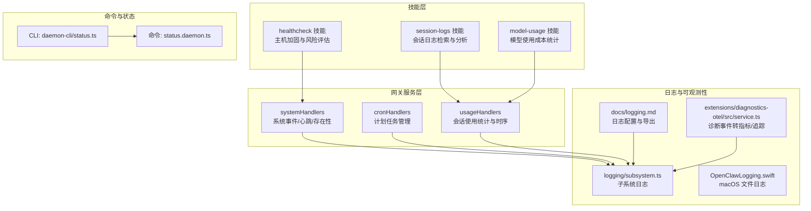

**图表来源**
- [skills/healthcheck/SKILL.md](file://skills/healthcheck/SKILL.md#L1-L246)
- [skills/session-logs/SKILL.md](file://skills/session-logs/SKILL.md#L1-L116)
- [skills/model-usage/SKILL.md](file://skills/model-usage/SKILL.md#L1-L70)
- [src/gateway/server-methods/system.ts](file://src/gateway/server-methods/system.ts#L1-L135)
- [src/gateway/server-methods/cron.ts](file://src/gateway/server-methods/cron.ts#L1-L304)
- [src/gateway/server-methods/usage.ts](file://src/gateway/server-methods/usage.ts#L623-L849)
- [src/commands/status.daemon.ts](file://src/commands/status.daemon.ts#L1-L37)
- [src/cli/daemon-cli/status.ts](file://src/cli/daemon-cli/status.ts#L1-L21)
- [src/logging/subsystem.ts](file://src/logging/subsystem.ts#L308-L347)
- [apps/macos/Sources/OpenClaw/Logging/OpenClawLogging.swift](file://apps/macos/Sources/OpenClaw/Logging/OpenClawLogging.swift#L175-L215)
- [docs/logging.md](file://docs/logging.md#L1-L353)
- [extensions/diagnostics-otel/src/service.ts](file://extensions/diagnostics-otel/src/service.ts#L560-L587)

**章节来源**
- [skills/healthcheck/SKILL.md](file://skills/healthcheck/SKILL.md#L1-L246)
- [skills/session-logs/SKILL.md](file://skills/session-logs/SKILL.md#L1-L116)
- [skills/model-usage/SKILL.md](file://skills/model-usage/SKILL.md#L1-L70)
- [src/gateway/server-methods/system.ts](file://src/gateway/server-methods/system.ts#L1-L135)
- [src/gateway/server-methods/cron.ts](file://src/gateway/server-methods/cron.ts#L1-L304)
- [src/gateway/server-methods/usage.ts](file://src/gateway/server-methods/usage.ts#L623-L849)
- [src/commands/status.daemon.ts](file://src/commands/status.daemon.ts#L1-L37)
- [src/cli/daemon-cli/status.ts](file://src/cli/daemon-cli/status.ts#L1-L21)
- [src/logging/subsystem.ts](file://src/logging/subsystem.ts#L308-L347)
- [apps/macos/Sources/OpenClaw/Logging/OpenClawLogging.swift](file://apps/macos/Sources/OpenClaw/Logging/OpenClawLogging.swift#L175-L215)
- [docs/logging.md](file://docs/logging.md#L1-L353)
- [extensions/diagnostics-otel/src/service.ts](file://extensions/diagnostics-otel/src/service.ts#L560-L587)

## 核心组件
- 健康检查（healthcheck）
  - 功能：主机安全加固、风险容忍度对齐、版本与更新状态检查、周期性审计调度。
  - 关键点：仅收紧 OpenClaw 默认与文件权限；不修改主机防火墙/SSH/系统更新；支持深扫描与修复；提供可执行的审计与更新命令。
- 会话日志分析（session-logs）
  - 功能：基于 jq/ripgrep 搜索历史会话，按日期/成本/工具调用等维度聚合。
  - 关键点：会话数据位于本地 JSONL 文件；提供常用查询模板与快速提示。
- 模型使用统计（model-usage）
  - 功能：从 CodexBar 获取成本 JSON 并按模型汇总当前或全量成本。
  - 关键点：支持 macOS（brew 安装），提供脚本化摘要与输出格式选择。
- 系统事件与心跳（systemHandlers）
  - 功能：查询最后心跳、开关心跳、列出系统存在性、上报系统事件并广播快照。
  - 关键点：事件过滤与上下文变更检测；节点事件差异仅在关键字段变化时入队系统事件。
- 计划任务（cronHandlers）
  - 功能：列出/添加/更新/删除/运行/查看运行记录，支持分页与筛选。
  - 关键点：参数校验与时间戳验证；运行记录日志路径解析。
- 使用统计与时序（usageHandlers）
  - 功能：按会话加载使用统计、时序与日志，支持工具与模型维度聚合。
  - 关键点：按天聚合消息数、延迟、模型使用与成本；支持时间序列加载。
- 守护进程状态（status.daemon 与 CLI）
  - 功能：获取网关/节点守护进程状态摘要与格式化输出。
  - 关键点：区分 OpenClaw 管理与外部管理；支持深度探测与 JSON 输出。
- 日志与可观测性
  - 功能：文件日志（JSONL）、控制台输出、CLI 实时跟踪、OpenTelemetry 导出。
  - 关键点：子系统日志、元数据渲染、敏感信息脱敏、诊断事件到指标/追踪映射。

**章节来源**
- [skills/healthcheck/SKILL.md](file://skills/healthcheck/SKILL.md#L1-L246)
- [skills/session-logs/SKILL.md](file://skills/session-logs/SKILL.md#L1-L116)
- [skills/model-usage/SKILL.md](file://skills/model-usage/SKILL.md#L1-L70)
- [src/gateway/server-methods/system.ts](file://src/gateway/server-methods/system.ts#L10-L135)
- [src/gateway/server-methods/cron.ts](file://src/gateway/server-methods/cron.ts#L24-L304)
- [src/gateway/server-methods/usage.ts](file://src/gateway/server-methods/usage.ts#L623-L849)
- [src/commands/status.daemon.ts](file://src/commands/status.daemon.ts#L15-L37)
- [src/cli/daemon-cli/status.ts](file://src/cli/daemon-cli/status.ts#L7-L21)
- [src/logging/subsystem.ts](file://src/logging/subsystem.ts#L308-L347)
- [apps/macos/Sources/OpenClaw/Logging/OpenClawLogging.swift](file://apps/macos/Sources/OpenClaw/Logging/OpenClawLogging.swift#L175-L215)
- [docs/logging.md](file://docs/logging.md#L1-L353)
- [extensions/diagnostics-otel/src/service.ts](file://extensions/diagnostics-otel/src/service.ts#L560-L587)

## 架构总览
下图展示系统管理相关模块之间的交互关系与数据流：

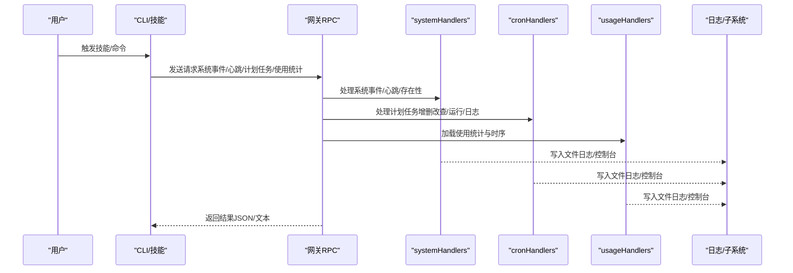

**图表来源**
- [src/gateway/server-methods/system.ts](file://src/gateway/server-methods/system.ts#L10-L135)
- [src/gateway/server-methods/cron.ts](file://src/gateway/server-methods/cron.ts#L24-L304)
- [src/gateway/server-methods/usage.ts](file://src/gateway/server-methods/usage.ts#L623-L849)
- [src/logging/subsystem.ts](file://src/logging/subsystem.ts#L308-L347)

## 详细组件分析

### 健康检查（healthcheck）技能
- 安装与配置
  - 通过技能描述可知该技能用于主机加固与风险评估，适合在需要安全审计、防火墙/SSH/更新策略审查、暴露面评估与版本状态检查时使用。
  - 建议在执行任何变更前明确权限与回滚方案；仅收紧 OpenClaw 默认与文件权限，不改变主机防火墙/SSH/系统更新策略。
- 使用流程
  - 模型自检：优先使用较新模型；若低于推荐级别，建议切换但不阻断执行。
  - 建立上下文：识别操作系统、特权级别、访问路径、网络暴露、备份与磁盘加密、自动安全更新等。
  - 运行 OpenClaw 安全审计：支持普通与深扫描模式；可一键修复 OpenClaw 默认与权限收紧。
  - 版本与更新状态：执行更新状态检查，报告渠道与可用更新。
  - 风险容忍度：提供平衡型、VPS 硬化、开发者便利与自定义等选项。
  - 周期性检查：通过计划任务调度定期审计与更新状态检查。
- 最佳实践
  - 在远程/无头服务器上，优先采用最小暴露面与密钥认证；避免 root 登录与不必要的端口开放。
  - 对浏览器控制启用双因素认证，优先硬件密钥。
  - 将审计与更新检查纳入 Cron，输出保存至受控位置，避免日志中泄露敏感信息。

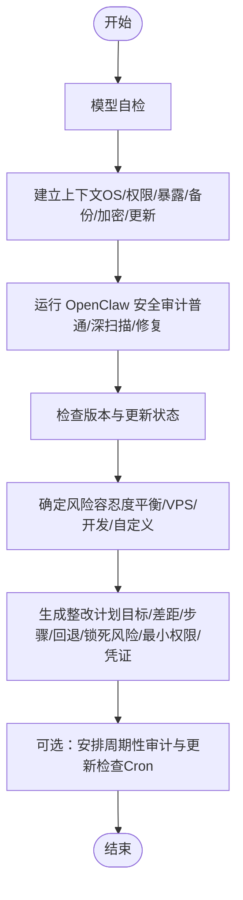

**图表来源**
- [skills/healthcheck/SKILL.md](file://skills/healthcheck/SKILL.md#L25-L246)

**章节来源**
- [skills/healthcheck/SKILL.md](file://skills/healthcheck/SKILL.md#L1-L246)

### 会话日志分析（session-logs）技能
- 数据位置与结构
  - 会话日志位于本地目录，包含索引文件与 JSONL 会话文件；每条记录包含类型、时间戳、角色与内容、用量等。
- 常用分析场景
  - 列出按日期与大小排序的会话、按日期筛选、提取用户/助手消息、关键词检索、计算单会话总成本、按日汇总成本、统计消息与令牌、工具调用分解、跨所有会话搜索。
- 使用示例
  - 列表与筛选：使用循环遍历与 jq/rg 组合实现。
  - 成本与消息统计：通过聚合函数计算总成本与消息数量。
  - 工具使用：统计工具调用次数并排序。
- 最佳实践
  - 大文件建议先采样（head/tail）；利用 sessions.json 索引定位会话；删除会话带有特定后缀，注意清理策略。

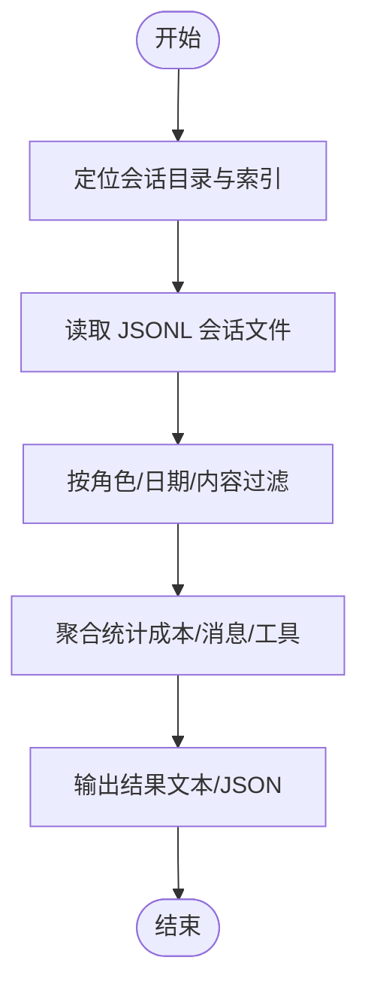

**图表来源**
- [skills/session-logs/SKILL.md](file://skills/session-logs/SKILL.md#L15-L116)

**章节来源**
- [skills/session-logs/SKILL.md](file://skills/session-logs/SKILL.md#L1-L116)

### 模型使用统计（model-usage）技能
- 输入与输出
  - 默认通过 CodexBar CLI 获取成本 JSON；支持从文件或标准输入传入；输出可为文本或 JSON。
- 当前模型逻辑
  - 优先取最近一天且包含模型拆解的成本行；若缺失则回退到已使用模型列表；可通过参数指定具体模型。
- 使用示例
  - 获取当前模型成本摘要与全量模型成本摘要；结合 Pretty JSON 输出便于阅读与集成。
- 最佳实践
  - 在 macOS 上通过 brew 安装 CodexBar；在 Linux 上等待后续安装指引；将输出重定向到受控位置以便归档与审计。

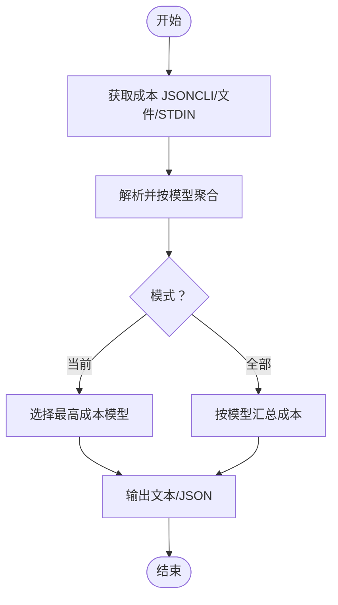

**图表来源**
- [skills/model-usage/SKILL.md](file://skills/model-usage/SKILL.md#L33-L70)

**章节来源**
- [skills/model-usage/SKILL.md](file://skills/model-usage/SKILL.md#L1-L70)

### 系统事件与心跳（systemHandlers）
- 能力概览
  - 查询最后心跳、开关心跳、列出系统存在性、上报系统事件并广播存在快照。
- 事件处理细节
  - 对节点存在行进行上下文变更检测：当主机/IP/版本/模式/原因发生显著变化时，入队系统事件并通知会话。
  - 其他类型事件直接入队并广播存在快照。
- 使用场景
  - 自动化运维：通过系统事件记录部署、版本升级、环境变更等；结合日志与告警联动。
  - 故障排查：结合心跳开关与存在性列表定位异常。

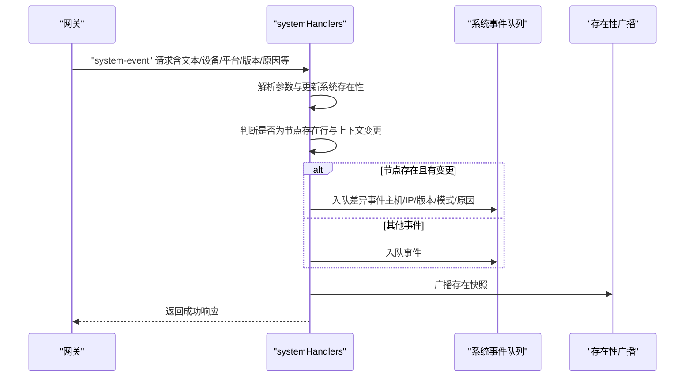

**图表来源**
- [src/gateway/server-methods/system.ts](file://src/gateway/server-methods/system.ts#L34-L133)

**章节来源**
- [src/gateway/server-methods/system.ts](file://src/gateway/server-methods/system.ts#L10-L135)

### 计划任务（cronHandlers）
- 能力概览
  - 支持列出、状态、添加、更新、删除、立即运行、查看运行记录（分页、筛选、排序）。
- 参数与校验
  - 所有操作均进行参数校验与时间戳验证；运行记录日志路径解析支持按作业或全部范围。
- 使用场景
  - 自动化运维：定时执行健康检查、更新状态检查、日志轮转、备份触发等。
  - 可视化与审计：通过运行记录页面化展示执行状态、交付状态与错误信息。

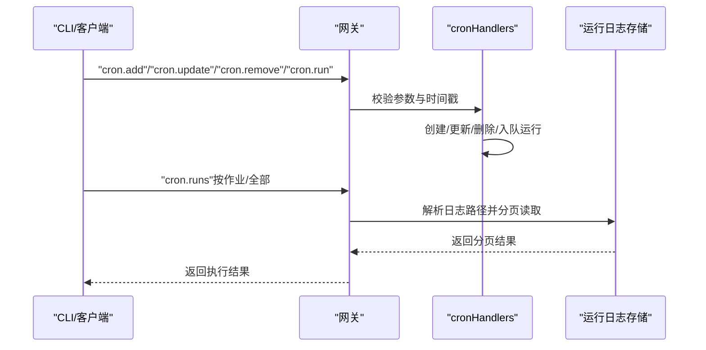

**图表来源**
- [src/gateway/server-methods/cron.ts](file://src/gateway/server-methods/cron.ts#L24-L304)

**章节来源**
- [src/gateway/server-methods/cron.ts](file://src/gateway/server-methods/cron.ts#L1-L304)

### 使用统计与时序（usageHandlers）
- 能力概览
  - 加载单会话使用统计（时序、每日分解、延迟、模型与工具使用）；支持按会话键加载时序数据。
- 数据聚合
  - 按天聚合消息数、延迟统计、模型使用与成本；工具调用计数与唯一工具数统计。
- 使用场景
  - 性能分析：通过延迟与时序了解模型调用性能；成本分析：按模型/提供商聚合成本。
  - 运维监控：结合日志与诊断事件，定位高延迟/高成本会话。

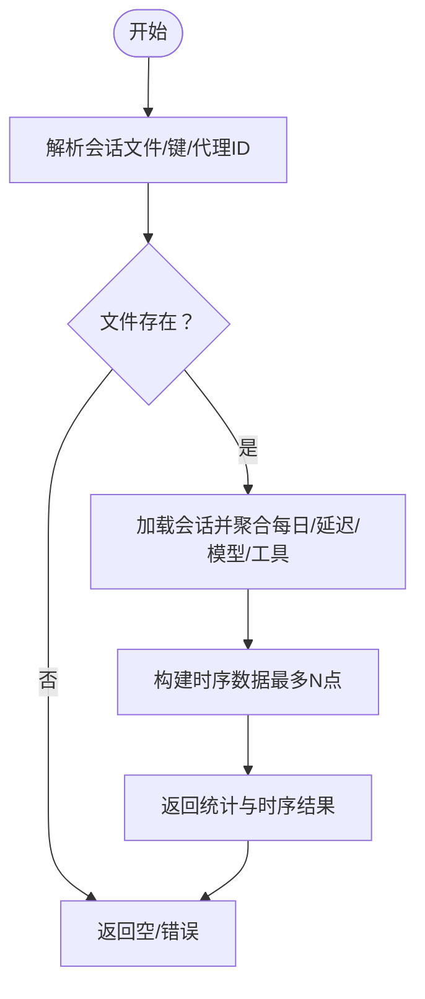

**图表来源**
- [src/gateway/server-methods/usage.ts](file://src/gateway/server-methods/usage.ts#L802-L849)
- [src/infra/session-cost-usage.ts](file://src/infra/session-cost-usage.ts#L674-L757)

**章节来源**
- [src/gateway/server-methods/usage.ts](file://src/gateway/server-methods/usage.ts#L623-L849)
- [src/infra/session-cost-usage.ts](file://src/infra/session-cost-usage.ts#L674-L757)

### 守护进程状态（status.daemon 与 CLI）
- 能力概览
  - 提供网关/节点守护进程状态摘要，支持深度探测与 JSON 输出；格式化输出包含运行时状态、PID、状态详情等。
- 使用场景
  - 快速诊断：通过 CLI 获取守护进程状态；结合日志定位问题。
  - 集成监控：以 JSON 输出便于监控系统采集。

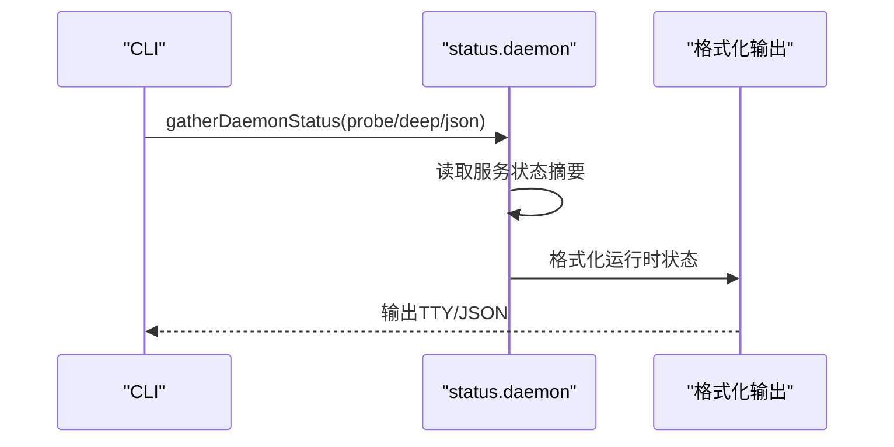

**图表来源**
- [src/cli/daemon-cli/status.ts](file://src/cli/daemon-cli/status.ts#L7-L21)
- [src/commands/status.daemon.ts](file://src/commands/status.daemon.ts#L15-L37)

**章节来源**
- [src/cli/daemon-cli/status.ts](file://src/cli/daemon-cli/status.ts#L1-L21)
- [src/commands/status.daemon.ts](file://src/commands/status.daemon.ts#L1-L37)

### 日志与可观测性
- 日志位置与读取
  - 默认滚动文件位于临时目录，可通过配置文件覆盖；CLI 支持实时跟踪、JSON/纯文本/禁色输出。
- 日志格式与控制台样式
  - 文件日志为 JSONL；控制台支持 pretty/compact/json；可通过环境变量或 CLI 选项覆盖默认级别。
- 子系统日志与元数据
  - 子系统日志按级别与子系统路由；元数据键值对渲染；macOS 端将结构化字段写入诊断文件。
- 诊断事件与 OpenTelemetry
  - 诊断事件涵盖模型使用、消息流、队列与会话状态；可导出为 OTLP/HTTP 指标与追踪，支持采样与刷新间隔配置。

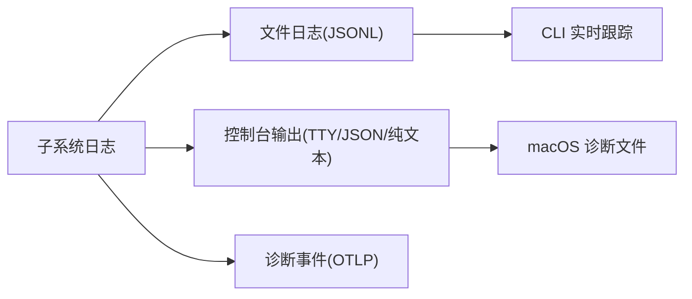

**图表来源**
- [src/logging/subsystem.ts](file://src/logging/subsystem.ts#L308-L347)
- [apps/macos/Sources/OpenClaw/Logging/OpenClawLogging.swift](file://apps/macos/Sources/OpenClaw/Logging/OpenClawLogging.swift#L175-L215)
- [docs/logging.md](file://docs/logging.md#L1-L353)
- [extensions/diagnostics-otel/src/service.ts](file://extensions/diagnostics-otel/src/service.ts#L560-L587)

**章节来源**
- [src/logging/subsystem.ts](file://src/logging/subsystem.ts#L308-L347)
- [apps/macos/Sources/OpenClaw/Logging/OpenClawLogging.swift](file://apps/macos/Sources/OpenClaw/Logging/OpenClawLogging.swift#L175-L215)
- [docs/logging.md](file://docs/logging.md#L1-L353)
- [extensions/diagnostics-otel/src/service.ts](file://extensions/diagnostics-otel/src/service.ts#L560-L587)

## 依赖关系分析
- 组件耦合
  - systemHandlers 与 cronHandlers 依赖于系统事件与运行日志存储；usageHandlers 依赖会话文件与成本聚合模块。
  - 日志子系统被多处模块共享，形成高内聚低耦合的日志基础设施。
- 外部依赖
  - macOS 端通过诊断文件日志与系统日志框架集成；OTEL 导出依赖插件与外部收集器。
- 潜在环路
  - 未发现直接循环依赖；各模块职责清晰，通过 RPC 与文件系统交互。

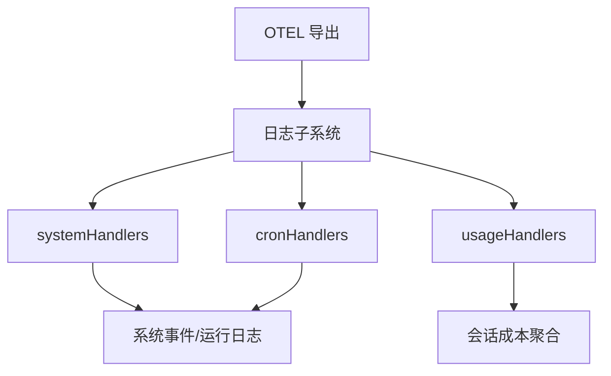

**图表来源**
- [src/gateway/server-methods/system.ts](file://src/gateway/server-methods/system.ts#L1-L135)
- [src/gateway/server-methods/cron.ts](file://src/gateway/server-methods/cron.ts#L1-L304)
- [src/gateway/server-methods/usage.ts](file://src/gateway/server-methods/usage.ts#L623-L849)
- [src/infra/session-cost-usage.ts](file://src/infra/session-cost-usage.ts#L674-L757)
- [src/logging/subsystem.ts](file://src/logging/subsystem.ts#L308-L347)
- [extensions/diagnostics-otel/src/service.ts](file://extensions/diagnostics-otel/src/service.ts#L560-L587)

**章节来源**
- [src/gateway/server-methods/system.ts](file://src/gateway/server-methods/system.ts#L1-L135)
- [src/gateway/server-methods/cron.ts](file://src/gateway/server-methods/cron.ts#L1-L304)
- [src/gateway/server-methods/usage.ts](file://src/gateway/server-methods/usage.ts#L623-L849)
- [src/infra/session-cost-usage.ts](file://src/infra/session-cost-usage.ts#L674-L757)
- [src/logging/subsystem.ts](file://src/logging/subsystem.ts#L308-L347)
- [extensions/diagnostics-otel/src/service.ts](file://extensions/diagnostics-otel/src/service.ts#L560-L587)

## 性能考量
- 日志级别与输出
  - 在生产环境中，建议将文件日志级别设为 info 或 warn，避免过高的 trace/debug 带来的 IO 压力。
  - 控制台样式在长会话中可切换为 compact 以减少输出体积。
- 诊断事件与 OTLP 导出
  - 启用诊断事件时，建议开启采样与合适的刷新间隔，降低导出开销。
  - 对高吞吐场景，优先在收集器侧进行采样与过滤。
- 会话统计与时序
  - 加载时序数据限制最大点数，避免一次性渲染大时间窗口导致内存压力。
- 心跳与系统事件
  - 合理配置心跳开关与事件过滤，避免噪声事件导致日志膨胀与广播压力。

[本节为通用指导，无需列出具体文件来源]

## 故障排查指南
- 网关不可达
  - 使用诊断命令快速定位：先执行诊断检查，再尝试日志跟踪。
- 日志为空或缺失
  - 检查网关是否运行、文件路径是否正确、日志级别是否过高导致输出被抑制。
- 需要更详细信息
  - 临时提升日志级别或使用 JSON 模式输出，结合诊断标志进行定向调试。
- 事件噪声与误报
  - 使用事件过滤逻辑识别非关键事件；关注节点存在行的关键字段变更。
- 计划任务执行异常
  - 查看运行记录页面，确认作业状态、交付状态与错误信息；核对时间戳与调度表达式。

**章节来源**
- [docs/logging.md](file://docs/logging.md#L347-L353)
- [src/infra/heartbeat-events-filter.ts](file://src/infra/heartbeat-events-filter.ts#L86-L96)
- [src/gateway/server-methods/cron.ts](file://src/gateway/server-methods/cron.ts#L218-L302)

## 结论
OpenClaw 的系统管理技能覆盖了从主机加固、会话分析、模型成本统计到系统事件、计划任务与可观测性的完整闭环。通过合理的日志与导出配置、严格的权限与回滚策略、以及周期性审计与自动化运维，可以有效保障系统的安全性、稳定性与可维护性。建议在生产环境中结合 Cron 与 OTLP 导出，构建完善的监控与告警体系。

[本节为总结性内容，无需列出具体文件来源]

## 附录
- 常用命令与参考
  - 健康检查：安全审计、深扫描、修复、更新状态、计划任务调度。
  - 会话日志：按日期/成本/工具调用检索与聚合。
  - 模型使用：CodexBar 成本 JSON 获取与模型汇总。
  - 系统事件：心跳开关、存在性列表、系统事件上报与广播。
  - 计划任务：增删改查、运行与运行记录查看。
  - 日志：CLI 实时跟踪、控制台样式、敏感信息脱敏、OTLP 导出。

[本节为概览性内容，无需列出具体文件来源]