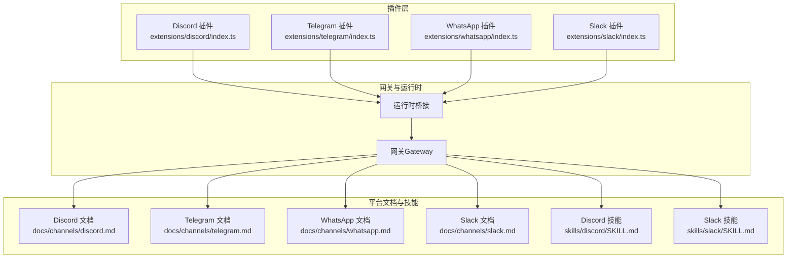
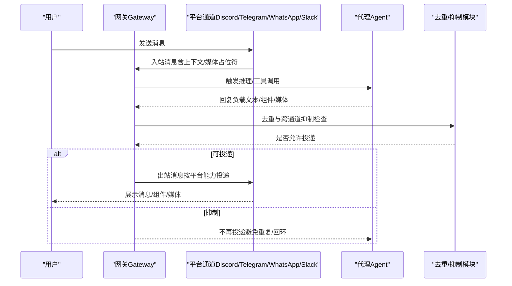
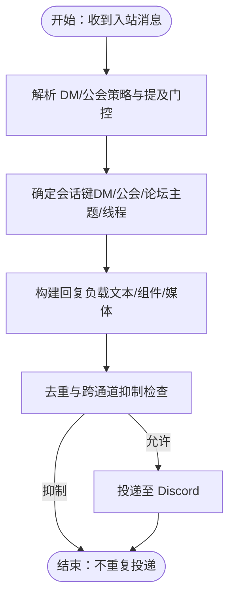
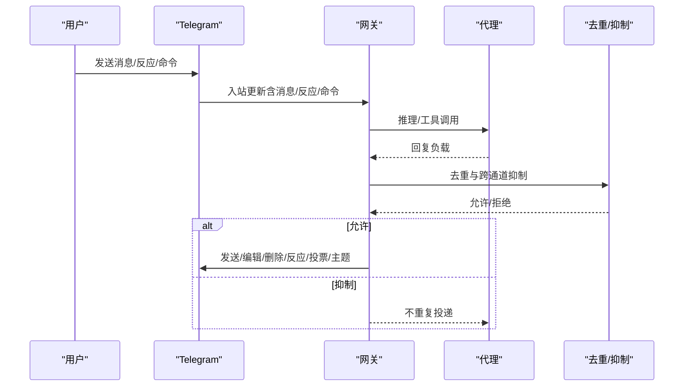
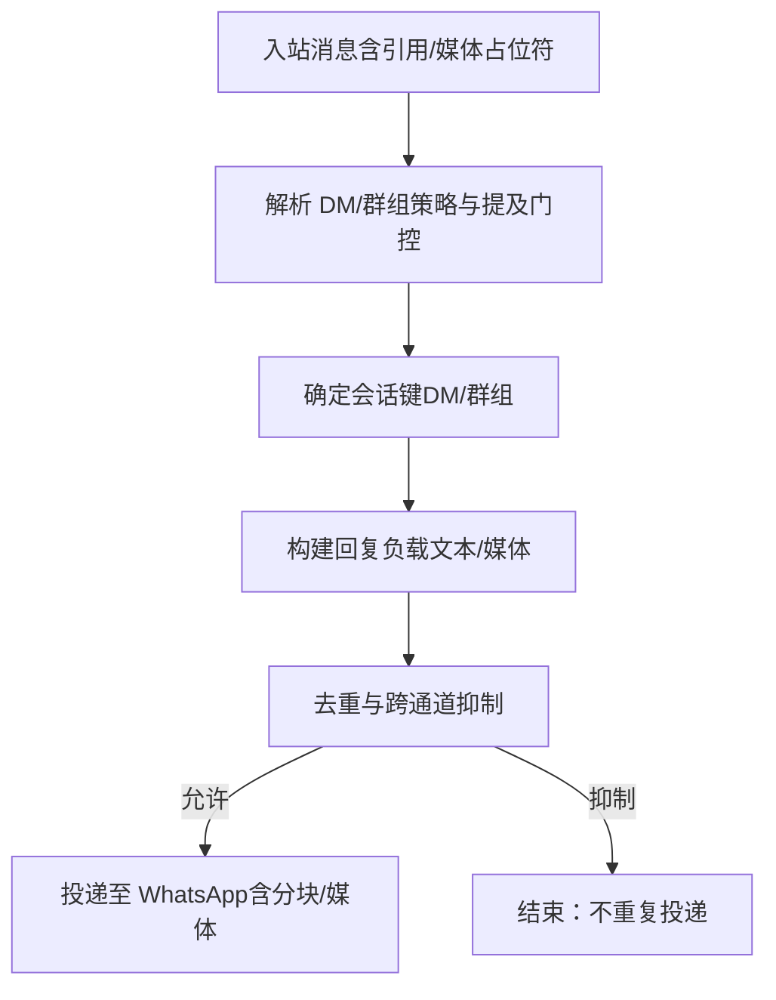
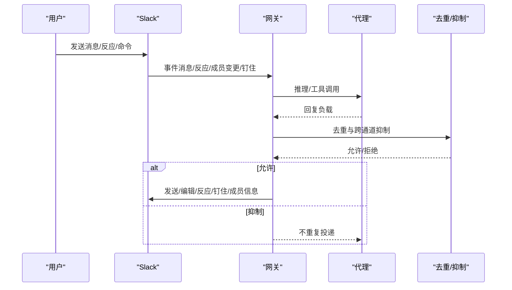
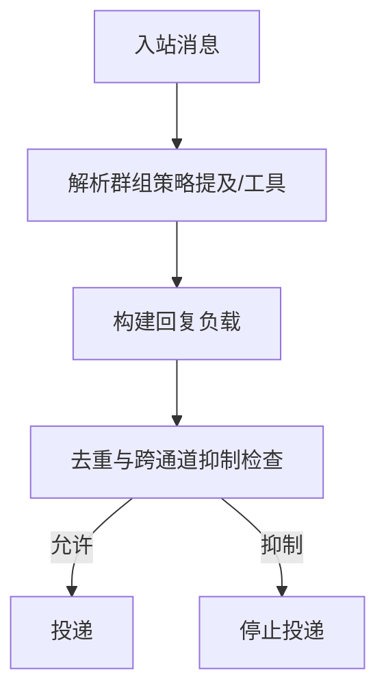
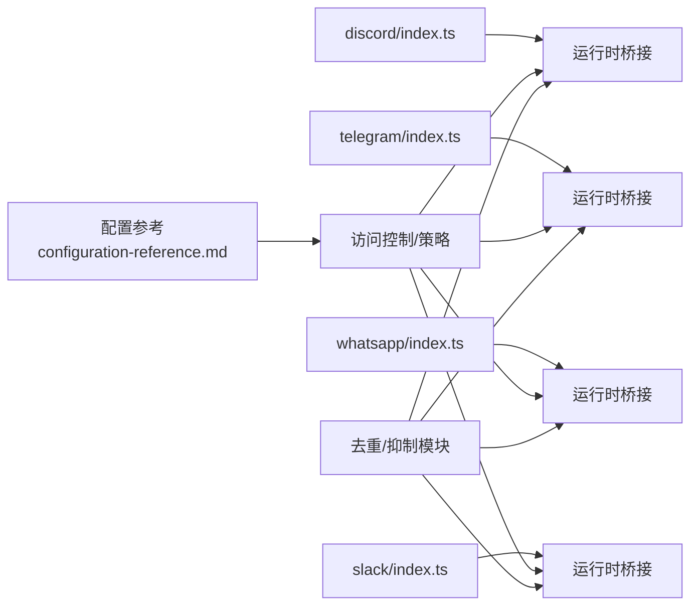

# 通信协作技能

## 目录
1. [简介](#简介)
2. [项目结构](#项目结构)
3. [核心组件](#核心组件)
4. [架构总览](#架构总览)
5. [详细组件分析](#详细组件分析)
6. [依赖关系分析](#依赖关系分析)
7. [性能考量](#性能考量)
8. [故障排查指南](#故障排查指南)
9. [结论](#结论)
10. [附录](#附录)

## 简介
本指南面向希望在 OpenClaw 中构建高效团队沟通自动化的用户，系统讲解如何配置与使用 Discord、Telegram、WhatsApp、Slack 等即时通讯平台的“通信协作技能”。内容涵盖：
- 平台能力与安装配置（API/令牌、频道绑定、权限策略）
- 消息路由与会话模型（DM、群组、话题/线程）
- 自动回复、群组管理、消息转发、通知处理等常见场景
- 跨平台消息同步与协作机制（去重、抑制重复回复、跨通道回注）

## 项目结构
OpenClaw 将各平台作为“通道”（Channel）接入，通过插件注册与运行时桥接，统一由网关（Gateway）持有连接并进行消息路由。技能（Skill）通过通用的消息工具（message tool）或平台专用工具（如 slack 工具）调用通道能力。

图示来源
- [extensions/discord/index.ts](file://extensions/discord/index.ts#L1-L20)
- [extensions/telegram/index.ts](file://extensions/telegram/index.ts#L1-L18)
- [extensions/whatsapp/index.ts](file://extensions/whatsapp/index.ts#L1-L18)
- [extensions/slack/index.ts](file://extensions/slack/index.ts#L1-L18)

章节来源
- [extensions/discord/index.ts](file://extensions/discord/index.ts#L1-L20)
- [extensions/telegram/index.ts](file://extensions/telegram/index.ts#L1-L18)
- [extensions/whatsapp/index.ts](file://extensions/whatsapp/index.ts#L1-L18)
- [extensions/slack/index.ts](file://extensions/slack/index.ts#L1-L18)

## 核心组件
- 通道插件：负责注册平台通道、注入运行时桥接，使网关可与平台交互。
- 平台文档：提供各平台的快速设置、权限策略、访问控制、特性细节与故障排查。
- 技能：以“消息工具”或平台专用工具形式提供自动化动作（发送、反应、编辑、投票、主题创建等）。
- 去重与抑制：在回复生成与投递阶段，避免重复消息与跨通道回环。

章节来源
- [skills/discord/SKILL.md](file://skills/discord/SKILL.md#L1-L198)
- [skills/slack/SKILL.md](file://skills/slack/SKILL.md#L1-L145)
- [src/auto-reply/reply/reply-payloads.ts](file://src/auto-reply/reply/reply-payloads.ts#L222-L264)
- [src/auto-reply/reply/followup-runner.ts](file://src/auto-reply/reply/followup-runner.ts#L301-L327)
- [src/agents/pi-embedded-helpers/messaging-dedupe.ts](file://src/agents/pi-embedded-helpers/messaging-dedupe.ts#L1-L46)

## 架构总览
下图展示从“入站消息”到“出站回复”的关键流程，以及跨通道抑制与去重逻辑：

图示来源
- [src/auto-reply/reply/followup-runner.ts](file://src/auto-reply/reply/followup-runner.ts#L301-L327)
- [src/auto-reply/reply/reply-payloads.ts](file://src/auto-reply/reply/reply-payloads.ts#L222-L264)
- [src/agents/pi-embedded-helpers/messaging-dedupe.ts](file://src/agents/pi-embedded-helpers/messaging-dedupe.ts#L1-L46)

## 详细组件分析

### Discord 通道与技能
- 快速设置要点
  - 创建应用与机器人、启用特权意图、复制机器人令牌
  - 生成邀请链接并添加到服务器；开启开发者模式收集 ID
  - 在配置中设置令牌与启用开关，并完成首次配对
- 访问控制与路由
  - DM 策略：配对、白名单、开放、禁用
  - 服务器（公会）策略：开放、白名单、禁用；支持按服务器/频道粒度配置
  - 提及门控：默认需要提及，可按服务器/频道覆盖
- 特性与行为
  - 会话隔离：DM 使用主会话；公会频道独立会话；论坛主题带话题后缀
  - 组件与交互：支持 v2 容器组件；交互事件回流为普通入站消息
  - 预览流式输出：支持部分预览与分块预览；与阻塞流式互斥
  - 反应通知：可配置仅自身、全部或关闭
  - ACK 反应：处理中发送确认反应
- 技能用法
  - 使用通用消息工具（channel=discord），支持发送、媒体、组件、反应、读取、编辑、删除、投票、主题创建、搜索、在线状态等
  - 多账户支持（accountId）

图示来源
- [docs/channels/discord.md](file://docs/channels/discord.md#L368-L460)
- [docs/channels/discord.md](file://docs/channels/discord.md#L553-L781)
- [skills/discord/SKILL.md](file://skills/discord/SKILL.md#L1-L198)

章节来源
- [docs/channels/discord.md](file://docs/channels/discord.md#L24-L167)
- [docs/channels/discord.md](file://docs/channels/discord.md#L368-L460)
- [docs/channels/discord.md](file://docs/channels/discord.md#L553-L781)
- [skills/discord/SKILL.md](file://skills/discord/SKILL.md#L1-L198)

### Telegram 通道与技能
- 快速设置要点
  - 通过 BotFather 获取机器人令牌；配置令牌与 DM 策略
  - 启动网关并完成首次配对；将机器人加入群组并配置群组策略
- 访问控制与路由
  - DM 策略：配对、白名单、开放、禁用
  - 群组策略：开放、白名单、禁用；支持按群组/话题粒度配置
  - 提及门控：默认需要提及，可通过配置覆盖
- 特性与行为
  - 会话隔离：按群组 ID；论坛主题附加 :topic:&lt;threadId&gt;
  - 预览流式输出：DM 与群组/话题均支持实时编辑预览
  - 内联按钮：支持按范围（DM/群组/全部/白名单）控制
  - 命令菜单：启动时注册 setMyCommands；支持自定义命令
  - 记事本/贴纸：支持贴纸缓存与搜索
  - 反应通知：可配置仅自身、全部或关闭
  - ACK 反应：处理中发送确认反应
  - Webhook/长轮询：可选模式，支持本地监听与反向代理
- 技能用法
  - 使用通用消息工具（channel=telegram），支持发送、反应、删除、编辑、主题创建、投票、贴纸发送与搜索等

图示来源
- [docs/channels/telegram.md](file://docs/channels/telegram.md#L105-L220)
- [docs/channels/telegram.md](file://docs/channels/telegram.md#L232-L791)
- [skills/discord/SKILL.md](file://skills/discord/SKILL.md#L25-L198)

章节来源
- [docs/channels/telegram.md](file://docs/channels/telegram.md#L24-L103)
- [docs/channels/telegram.md](file://docs/channels/telegram.md#L105-L220)
- [docs/channels/telegram.md](file://docs/channels/telegram.md#L232-L791)

### WhatsApp 通道与技能
- 快速设置要点
  - 配置 DM/群组访问策略；通过 QR 登录链接设备
  - 启动网关并完成首次配对（如使用配对模式）
- 访问控制与路由
  - DM 策略：配对、白名单、开放、禁用
  - 群组策略：开放、白名单、禁用；支持按群组与发送者白名单配置
  - 提及门控：默认需要提及，支持会话级激活命令
- 特性与行为
  - 会话隔离：DM 主会话合并；群组独立会话
  - 自聊天保护：当自号在允许列表时，跳过已读回执、避免自我提醒
  - 历史注入：群组未处理消息缓冲并注入上下文
  - 媒体与分块：支持图片/视频/音频/文档；语音备注兼容；分块与换行优先
  - ACK 反应：处理中发送确认反应
- 技能用法
  - 使用通用消息工具（channel=whatsapp），支持反应等动作（具体动作以平台工具为准）

图示来源
- [docs/channels/whatsapp.md](file://docs/channels/whatsapp.md#L134-L200)
- [docs/channels/whatsapp.md](file://docs/channels/whatsapp.md#L292-L364)

章节来源
- [docs/channels/whatsapp.md](file://docs/channels/whatsapp.md#L24-L81)
- [docs/channels/whatsapp.md](file://docs/channels/whatsapp.md#L134-L200)
- [docs/channels/whatsapp.md](file://docs/channels/whatsapp.md#L292-L364)

### Slack 通道与技能
- 快速设置要点
  - Socket Mode 或 HTTP Events API 两种模式
  - Socket Mode：启用 Socket Mode、创建 App Token 与 Bot Token，订阅事件
  - HTTP 模式：配置签名密钥与 Webhook 路径，确保请求 URL 一致
- 访问控制与路由
  - DM 策略：配对、白名单、开放、禁用
  - 频道策略：开放、白名单、禁用；支持按频道粒度配置
  - 提及门控：默认需要提及，支持按频道/用户白名单
- 特性与行为
  - 会话隔离：DM、频道、MPIM 分别路由；线程可继承历史
  - 预览流式输出：支持部分预览与分块追加；可选择是否使用 Slack 原生流式 API
  - 附件下载：从 Slack 私有 URL 下载并写入媒体存储
  - 动作与门控：消息、反应、钉住、成员信息、表情包列表等
  - ACK 反应与打字反应：处理中发送确认/临时反应
- 技能用法
  - 使用专用 slack 工具（react、readMessages、pin/unpin、memberInfo、emojiList 等）
  - 也可使用通用消息工具（channel=slack）执行发送/编辑/删除等

图示来源
- [docs/channels/slack.md](file://docs/channels/slack.md#L136-L205)
- [docs/channels/slack.md](file://docs/channels/slack.md#L284-L325)
- [docs/channels/slack.md](file://docs/channels/slack.md#L492-L518)

章节来源
- [docs/channels/slack.md](file://docs/channels/slack.md#L24-L121)
- [docs/channels/slack.md](file://docs/channels/slack.md#L136-L205)
- [docs/channels/slack.md](file://docs/channels/slack.md#L284-L325)
- [docs/channels/slack.md](file://docs/channels/slack.md#L492-L518)

### 跨平台消息同步与协作机制
- 群组提及与工具策略解析
  - 不同平台（Discord/Telegram/WhatsApp/Slack 等）的群组“需要提及”与“工具策略”解析逻辑统一，便于在多通道场景下保持一致的行为预期
- 去重与跨通道抑制
  - 基于“来源通道+目标+账号+线程”键进行匹配，避免重复回复与跨通道回环
  - 对文本与媒体分别做去重过滤，减少冗余投递
- 系统提示与工具可用性
  - 系统提示中强调“在当前会话回复 → 自动路由到源通道”，以及“子代理编排”“消息工具”等能力，帮助用户正确使用跨通道消息

图示来源
- [src/channels/plugins/group-mentions.ts](file://src/channels/plugins/group-mentions.ts#L161-L189)
- [src/auto-reply/reply/reply-payloads.ts](file://src/auto-reply/reply/reply-payloads.ts#L222-L264)
- [src/auto-reply/reply/followup-runner.ts](file://src/auto-reply/reply/followup-runner.ts#L301-L327)
- [src/agents/system-prompt.ts](file://src/agents/system-prompt.ts#L120-L146)

章节来源
- [src/channels/plugins/group-mentions.ts](file://src/channels/plugins/group-mentions.ts#L1-L358)
- [src/auto-reply/reply/reply-payloads.ts](file://src/auto-reply/reply/reply-payloads.ts#L222-L264)
- [src/auto-reply/reply/followup-runner.ts](file://src/auto-reply/reply/followup-runner.ts#L301-L327)
- [src/agents/system-prompt.ts](file://src/agents/system-prompt.ts#L120-L146)

## 依赖关系分析
- 插件注册
  - 各平台插件在注册时注入运行时桥接并注册通道，形成统一的通道接口
- 配置与策略
  - 平台文档与配置参考共同定义了访问控制、会话模型、流式输出、媒体限制、动作门控等关键参数
- 去重与抑制
  - 去重模块与抑制模块贯穿回复生成与投递阶段，确保跨通道一致性与稳定性

图示来源
- [extensions/discord/index.ts](file://extensions/discord/index.ts#L1-L20)
- [extensions/telegram/index.ts](file://extensions/telegram/index.ts#L1-L18)
- [extensions/whatsapp/index.ts](file://extensions/whatsapp/index.ts#L1-L18)
- [extensions/slack/index.ts](file://extensions/slack/index.ts#L1-L18)
- [docs/gateway/configuration-reference.md](file://docs/gateway/configuration-reference.md#L18-L91)

章节来源
- [extensions/discord/index.ts](file://extensions/discord/index.ts#L1-L20)
- [extensions/telegram/index.ts](file://extensions/telegram/index.ts#L1-L18)
- [extensions/whatsapp/index.ts](file://extensions/whatsapp/index.ts#L1-L18)
- [extensions/slack/index.ts](file://extensions/slack/index.ts#L1-L18)
- [docs/gateway/configuration-reference.md](file://docs/gateway/configuration-reference.md#L18-L91)

## 性能考量
- 流式输出
  - 预览流式与阻塞流式需谨慎选择，避免双重流式导致的额外网络开销
- 媒体与分块
  - 合理设置文本分块阈值与模式（长度/换行），减少拆分次数与传输体积
- 去重与抑制
  - 通过精确的目标键匹配降低无效投递，提升整体吞吐
- 会话隔离
  - 合理利用会话键隔离（DM/群组/话题/线程）可减少上下文污染与重复计算

## 故障排查指南
- Discord
  - 未启用“消息内容意图”或“服务器成员意图”会导致消息不可见或权限不足
  - 未开启开发者模式无法复制 ID；未允许服务器成员向机器人发 DM 会导致配对失败
  - 公会/频道策略与提及门控需核对；线程绑定需启用相应功能
- Telegram
  - 隐私模式会限制群组消息可见性；需在 BotFather 关闭隐私或赋予管理员
  - Webhook/长轮询模式需确保公网可达与路径唯一；反向代理需正确转发
- WhatsApp
  - 未登录/断连需重新 QR 登录；断线循环建议运行诊断工具
  - 群组消息被忽略需检查群组策略、发送者白名单、群组允许列表与提及门控
- Slack
  - Socket Mode 未启用或令牌错误会导致连接失败
  - HTTP 模式需校验签名密钥、Webhook 路径与请求 URL 一致性
  - 原生命令未生效需确认是否启用原生命令与在 Slack 注册对应斜杠命令

章节来源
- [docs/channels/discord.md](file://docs/channels/discord.md#L368-L460)
- [docs/channels/telegram.md](file://docs/channels/telegram.md#L793-L800)
- [docs/channels/whatsapp.md](file://docs/channels/whatsapp.md#L374-L424)
- [docs/channels/slack.md](file://docs/channels/slack.md#L433-L490)

## 结论
通过统一的通道插件架构与平台文档，OpenClaw 为 Discord、Telegram、WhatsApp、Slack 等平台提供了标准化的接入方式与强大的自动化能力。结合访问控制、会话模型、流式输出、去重与跨通道抑制机制，用户可以构建稳定、高效且可扩展的团队沟通自动化方案。建议在生产环境中优先采用白名单策略与明确的提及门控，并根据平台特性合理配置流式输出与媒体分块，以获得最佳体验。

## 附录
- 配置参考要点
  - DM/群组策略、心跳显示、模型按通道映射、多账户配置等
- 技能清单
  - Discord 技能：通用消息工具与组件能力
  - Slack 技能：专用 slack 工具与通用消息工具

章节来源
- [docs/gateway/configuration-reference.md](file://docs/gateway/configuration-reference.md#L18-L91)
- [skills/discord/SKILL.md](file://skills/discord/SKILL.md#L1-L198)
- [skills/slack/SKILL.md](file://skills/slack/SKILL.md#L1-L145)